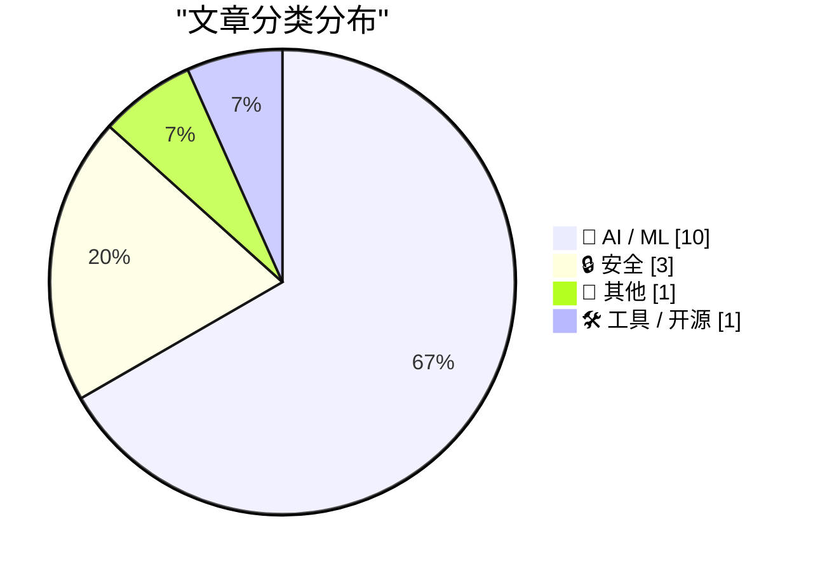
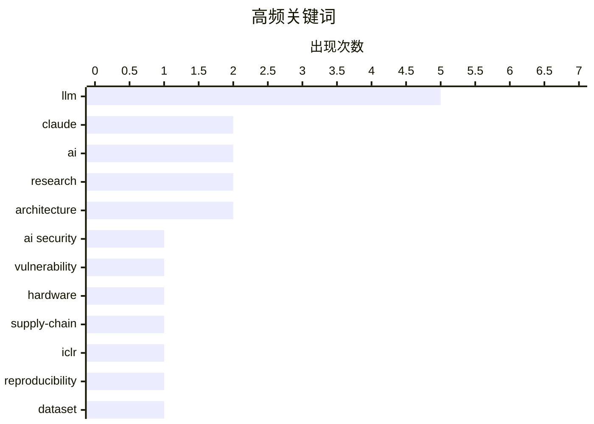

# 📰 AI 资讯每日精选 — 2026-04-20

> 汇聚 140+ 技术博客、X/Twitter、Hacker News、Reddit、Product Hunt、
> Lobste.rs、ClawFeed 日报及 GitHub Trending，经 AI 评分筛选。
>
> **本期内容**：🏆 今日必读 · 🌐 ClawFeed 日报 · 🔥 GitHub Trending · 📂 分类精选 · 🎨 设计与生成式 AI · 📊 数据概览

## 📝 今日看点

今日技术圈聚焦于人工智能浪潮下的双重变奏。一方面，AI产业正经历爆炸式增长与激烈竞争，头部公司收入与估值飙升，同时开源社区与成本优化实践日益活跃；另一方面，AI的普及也带来了严峻的安全与伦理挑战，从大模型自身漏洞到被用于制造虚假信息，安全问题持续引发高度关注。此外，由AI驱动的基础设施需求激增，正引发如内存短缺等供应链层面的长期影响。

---

## 🏆 今日必读

🥇 **Anthropic Claude 代码泄露揭示关键命令注入漏洞**

[Anthropic Claude Code Leak Reveals Critical Command Injection Vulnerabilities](https://beyondmachines.net/event_details/anthropic-claude-code-leak-reveals-critical-command-injection-vulnerabilities-e-6-c-1-k/gD2P6Ple2L) — Lobste.rs · 23 小时前 · 🔒 安全

> 文章披露了 Anthropic Claude 的代码泄露事件，并分析了其中存在的安全漏洞。泄露的代码中发现了关键的命令注入漏洞，攻击者可能利用这些漏洞执行任意系统命令。这些漏洞的严重性较高，可能影响 Claude 服务的安全性和用户数据。事件凸显了 AI 服务在代码安全和供应链管理方面存在的风险。

💡 **为什么值得读**: 对于关注 AI 模型安全、企业级 AI 应用风险以及代码审计的开发者与安全专家，此文提供了关于前沿 AI 服务潜在安全威胁的一手分析。

🏷️ Claude, AI security, vulnerability

🥈 **内存短缺问题可能持续数年**

[The RAM shortage could last years](https://www.theverge.com/ai-artificial-intelligence/914672/the-ram-shortage-could-last-years) — Hacker News Best · 16 小时前 · 📝 其他

> 文章探讨了由人工智能热潮引发的全球内存（RAM）供应短缺问题。AI 服务器和数据中心对高带宽内存（HBM）的需求激增，是导致短缺的核心原因。这种供需失衡预计将持续数年，可能影响从个人电脑到云服务的各类电子产品成本和供应。结论是，内存产业的结构性调整需要时间，短缺将成为未来几年的新常态。

💡 **为什么值得读**: 此文从宏观产业视角揭示了 AI 基础设施面临的硬件瓶颈，对硬件采购、产品规划以及理解 AI 发展制约因素的读者具有重要参考价值。

🏷️ hardware, AI, supply-chain

🥉 **1200 篇 ICLR 2026 论文附有公开代码或数据**

[1,200 ICLR 2026 Papers with Public Code or Data [R]](https://www.reddit.com/r/MachineLearning/comments/1spvoer/1200_iclr_2026_papers_with_public_code_or_data_r/) — r/MachineLearning · 8 小时前 · 🤖 AI / ML

> 文章整理并发布了约 1200 篇 ICLR 2026 会议已接收论文的公开资源链接。这些资源包括公开的代码、数据集或演示链接，直接提取自论文提交内容。该数量约占全部 5300 多篇接收论文的 22%。这份清单为研究人员快速查找和复现前沿工作提供了极大便利。

💡 **为什么值得读**: 对于机器学习领域的研究人员和工程师，这是一份极其实用的资源索引，能显著节省寻找可复现代码和基准数据的时间。

🏷️ ICLR, research, reproducibility, dataset

4️⃣ **LangChain 社区聚焦：如何节省 100 万美元 LLM 成本**

[RT LangChain OSS: LangChain Community Spotlight: Saving $1M in LLM Costs 💰 Gustaf, an AI Engineer, shows how he reduced a production RAG chatbot's ...](https://x.com/LangChain/status/2045895208064458983) — 𝕏 @LangChain · 8 小时前 · 🤖 AI / ML

> 一位 AI 工程师分享了其在生产环境中优化 RAG 聊天机器人的实战经验。通过实施缓存、智能路由以及利用 LangGraph 进行上下文管理，他将该聊天机器人的成本降低了 90%，同时将延迟改善了 82%。这些优化措施综合运用了多种工程技巧，而非单一技术。案例证明，通过精心的架构设计，可以大幅提升 LLM 应用的性价比。

💡 **为什么值得读**: 此案例提供了具体、可量化的 LLM 应用优化方案（90%成本削减，82%延迟改善），对正在面临高额 API 成本或性能瓶颈的工程团队具有直接的借鉴意义。

🏷️ RAG, cost optimization, LLM

5️⃣ **Anthropic 收入激增，据传引发万亿美元估值讨论**

[Anthropic's revenue surge reportedly fuels talk of trillion-dollar valuation](https://the-decoder.com/anthropics-revenue-surge-reportedly-fuels-talk-of-trillion-dollar-valuation/) — The Decoder · 9 小时前 · 🤖 AI / ML

> 报道称，Anthropic 在短短几个月内从亏损状态转变为收入巨头。其年化收入现已超过 300 亿美元，可能已超越 OpenAI。基于惊人的收入增长，投资者正在讨论其估值可能高达 1 万亿美元。这反映了资本市场对头部 AI 公司未来潜力的极度乐观预期。

💡 **为什么值得读**: 此文揭示了 AI 行业最前沿公司的财务动态和估值趋势，是了解行业竞争格局和资本风向的关键信息。

🏷️ Anthropic, valuation, revenue, LLM

---

## 🌐 ClawFeed 日报精选

> 来源：[ClawFeed](https://clawfeed.kevinhe.io) — AI 驱动的多源新闻聚合

### 🔥 今日头条

1. **OpenAI 把 Codex 从 coding tool 推向全工作流 agent 平台**
   今天最强主线就是 OpenAI 连续强化 Codex，新增 computer use、浏览器、image generation、memory、SSH devbox、并行 agents 和更多插件，目标已经不是“帮你写代码”，而是抢开发者与知识工作者的工作台入口。

2. **GPT-Rosalind 发布，frontier model 开始更明确切入生命科学**
   OpenAI 同步推出面向生命科学研究的 GPT-Rosalind，直接把能力包装到药物发现、基因组学、实验规划和转化医学流程，说明高价值垂直场景会越来越成为大模型产品化主战场。

3. **Claude Opus 4.7 刷新 agent 竞争强度**
   Anthropic 今天在社媒侧最强的产品信号是 Claude Opus 4.7，重点强调更稳的长任务执行、指令跟随和交付前自检。市场关注点继续从“聊天更像人”转向“能不能稳定干完复杂任务”。

4. **AI 安全和 cyber defense 持续升温**
   OpenAI 扩大 Trusted Access for Cyber，并开放更高信任级别团队申请 GPT-5.4-Cyber。Anthropic 则继续推进 Project Glasswing，把 Claude 往关键软件安全和基础设施防护场景里打，安全赛道已经明显进入平台级竞争。

5. **多模态 agent 和 world model 继续冒头**
   Google DeepMind 把 Gemini Robotics 接到 Spot 上，HeyGen 开源 HyperFrames，腾讯 HY-World-2.0 也被持续讨论。除了 coding agent，视频编辑、机器人执行、3D world generation 都在变成新一轮 agent 入口。

---

## 🔥 GitHub Trending

> 今日热门开源项目（全语言 + Python）

| # | 项目 | 描述 | ⭐ 总星 | 📈 今日 | 语言 |
|---|------|------|---------|---------|------|
| 1 | [Fincept-Corporation/FinceptTerminal](https://github.com/Fincept-Corporation/FinceptTerminal) | FinceptTerminal is a modern finance application offering ... | 6.5k | +1254 | Python |
| 2 | [openai/openai-agents-python](https://github.com/openai/openai-agents-python) 🤖 | A lightweight, powerful framework for multi-agent workflows | 23.1k | +752 | Python |
| 3 | [Donchitos/Claude-Code-Game-Studios](https://github.com/Donchitos/Claude-Code-Game-Studios) 🤖 | Turn Claude Code into a full game dev studio — 49 AI agen... | 13.4k | +704 | Shell |
| 4 | [thunderbird/thunderbolt](https://github.com/thunderbird/thunderbolt) 🤖 | AI You Control: Choose your models. Own your data. Elimin... | 2.2k | +695 | TypeScript |
| 5 | [BasedHardware/omi](https://github.com/BasedHardware/omi) 🤖 | AI that sees your screen, listens to your conversations a... | 11.1k | +685 | Dart |
| 6 | [EvoMap/evolver](https://github.com/EvoMap/evolver) 🤖 | The GEP-Powered Self-Evolution Engine for AI Agents. Geno... | 5.5k | +527 | JavaScript |
| 7 | [HKUDS/DeepTutor](https://github.com/HKUDS/DeepTutor) 🤖 | "DeepTutor: Agent-Native Personalized Learning Assistant" | 20.1k | +449 | Python |
| 8 | [paperless-ngx/paperless-ngx](https://github.com/paperless-ngx/paperless-ngx) | A community-supported supercharged document management sy... | 38.9k | +393 | Python |
| 9 | [lsdefine/GenericAgent](https://github.com/lsdefine/GenericAgent) 🤖 | Self-evolving agent: grows skill tree from 3.3K-line seed... | 4.5k | +300 | Python |
| 10 | [tractorjuice/arc-kit](https://github.com/tractorjuice/arc-kit) | Enterprise Architecture Governance & Vendor Procurement T... | 991 | +263 | HTML |
| 11 | [jingyaogong/minimind](https://github.com/jingyaogong/minimind) 🤖 | 🚀🚀 「大模型」2小时完全从0训练64M的小参数GPT！🌏 Train a 64M-parameter GP... | 47.6k | +214 | Python |
| 12 | [bytedance/deer-flow](https://github.com/bytedance/deer-flow) | An open-source long-horizon SuperAgent harness that resea... | 62.7k | +190 | Python |
| 13 | [ruvnet/RuView](https://github.com/ruvnet/RuView) | π RuView: WiFi DensePose turns commodity WiFi signals int... | 47.5k | +149 | Rust |
| 14 | [pingdotgg/t3code](https://github.com/pingdotgg/t3code) |  | 9.9k | +109 | TypeScript |
| 15 | [TheAlgorithms/Python](https://github.com/TheAlgorithms/Python) | All Algorithms implemented in Python | 219.9k | +87 | Python |

---

## 🤖 AI / ML

### 1. 1200 篇 ICLR 2026 论文附有公开代码或数据

[1,200 ICLR 2026 Papers with Public Code or Data [R]](https://www.reddit.com/r/MachineLearning/comments/1spvoer/1200_iclr_2026_papers_with_public_code_or_data_r/) — **r/MachineLearning** · 8 小时前 · ⭐ 26/30

> 文章整理并发布了约 1200 篇 ICLR 2026 会议已接收论文的公开资源链接。这些资源包括公开的代码、数据集或演示链接，直接提取自论文提交内容。该数量约占全部 5300 多篇接收论文的 22%。这份清单为研究人员快速查找和复现前沿工作提供了极大便利。

🏷️ ICLR, research, reproducibility, dataset

---

### 2. LangChain 社区聚焦：如何节省 100 万美元 LLM 成本

[RT LangChain OSS: LangChain Community Spotlight: Saving $1M in LLM Costs 💰 Gustaf, an AI Engineer, shows how he reduced a production RAG chatbot's ...](https://x.com/LangChain/status/2045895208064458983) — **𝕏 @LangChain** · 8 小时前 · ⭐ 26/30

> 一位 AI 工程师分享了其在生产环境中优化 RAG 聊天机器人的实战经验。通过实施缓存、智能路由以及利用 LangGraph 进行上下文管理，他将该聊天机器人的成本降低了 90%，同时将延迟改善了 82%。这些优化措施综合运用了多种工程技巧，而非单一技术。案例证明，通过精心的架构设计，可以大幅提升 LLM 应用的性价比。

🏷️ RAG, cost optimization, LLM

---

### 3. Anthropic 收入激增，据传引发万亿美元估值讨论

[Anthropic's revenue surge reportedly fuels talk of trillion-dollar valuation](https://the-decoder.com/anthropics-revenue-surge-reportedly-fuels-talk-of-trillion-dollar-valuation/) — **The Decoder** · 9 小时前 · ⭐ 25/30

> 报道称，Anthropic 在短短几个月内从亏损状态转变为收入巨头。其年化收入现已超过 300 亿美元，可能已超越 OpenAI。基于惊人的收入增长，投资者正在讨论其估值可能高达 1 万亿美元。这反映了资本市场对头部 AI 公司未来潜力的极度乐观预期。

🏷️ Anthropic, valuation, revenue, LLM

---

### 4. AI 生成的虚拟网红在中期选举前用亲特朗普内容淹没社交媒体

[AI-generated influencers flood social media with pro-Trump content ahead of midterms](https://the-decoder.com/ai-generated-influencers-flood-social-media-with-pro-trump-content-ahead-of-midterms/) — **The Decoder** · 15 小时前 · ⭐ 25/30

> 文章揭露了在中期选举前，数百个 AI 生成的虚拟形象在 TikTok、Instagram 和 YouTube 上大量发布支持特朗普的内容。部分账号已获得超过 3.5 万粉丝和数百万次观看，特朗普本人也曾分享 AI 生成的内容。目前尚不清楚这是个体活动还是有组织的协同行动。这一现象凸显了 AI 技术被用于政治宣传和操纵舆论的现实风险。

🏷️ AI influencers, disinformation, election, social media

---

### 5. 相同的 9B Qwen 权重：在 Aider 中得分 19.1% vs 适配小模型的脚手架得分 45.6%

[Same 9B Qwen weights: 19.1% in Aider vs 45.6% with a scaffold adapted to small local models](https://www.reddit.com/r/LocalLLaMA/comments/1spufzz/same_9b_qwen_weights_191_in_aider_vs_456_with_a/) — **r/LocalLLaMA** · 9 小时前 · ⭐ 25/30

> 一项实验探究了小型本地模型在代码助手任务中表现不佳的原因。实验固定使用 Qwen3.5-9B Q4 模型权重，仅改变其运行的“脚手架”（即外围的提示、流程控制等）。在 Aider 基准测试的 225 个练习中，使用默认 Aider 脚手架的平均通过率为 19.11%，而使用专为小模型优化的“little-coder”脚手架后，通过率大幅提升至 45.56%。结论表明，模型性能的瓶颈往往不在模型本身，而在于是否为其设计了合适的交互与任务分解框架。

🏷️ LLM, coding agent, scaffold, benchmark

---

### 6. 混合深度注意力机制 - arXiv 论文

[Mixture-of-Depths Attention - arXiv](https://www.reddit.com/r/LocalLLaMA/comments/1sq0hdv/mixtureofdepths_attention_arxiv/) — **r/LocalLLaMA** · 6 小时前 · ⭐ 25/30

> 论文提出了一种名为“混合深度注意力”的新机制，旨在解决大型语言模型随深度增加出现的信号退化问题。MoDA 允许每个注意力头同时关注当前层的序列 KV 对和来自前面特定层的深度 KV 对。这种方法能够保留浅层形成的有用特征，防止其在深层被稀释，从而提升模型表现。这是对 Transformer 核心注意力机制的一种创新性改进。

🏷️ LLM, architecture, efficiency, research

---

### 7. LangChain社区聚焦：LangSmith中的LLM-as-Judge（大语言模型作为评判者）

[RT LangChain OSS: LangChain Community Spotlight: LLM-as-Judge in LangSmith 🎯 Simon Budziak published a technical guide on automated evaluation at s...](https://x.com/LangChain/status/2045910308246667566) — **𝕏 @LangChain** · 7 小时前 · ⭐ 25/30

> 文章介绍了Simon Budziak发布的一篇关于利用LangSmith的LLM-as-Judge功能进行大规模自动化评估的技术指南。该方案的关键在于实现了85%的人类评估一致性，并引入了“Align Evals”功能以实现自我改进的校准。这种方法旨在解决大语言模型应用评估难以规模化的问题。

🏷️ LLM, evaluation, LangSmith

---

### 8. 为个人AI实现“无头化一切”

[Headless everything for personal AI](https://simonwillison.net/2026/Apr/19/headless-everything/#atom-everything) — **simonwillison.net** · 2 小时前 · ⭐ 24/30

> 文章探讨了Matt Webb的观点，即“无头化”（Headless）服务将因个人AI的兴起而变得普遍。核心论点是：用户通过个人AI与服务的交互体验优于直接使用服务；同时，对于个人AI而言，通过API调用无头服务比模拟鼠标点击图形界面更快捷、更可靠。这预示着一个服务优先通过API而非GUI被消费的未来趋势。

🏷️ AI, headless, architecture, personalization

---

### 9. 首次令牌计数揭示：尽管Anthropic实行统一定价，Opus 4.7的实际成本仍显著高于4.6

[First token counts reveal Opus 4.7 costs significantly more than 4.6 despite Anthropic's flat pricing](https://the-decoder.com/first-token-counts-reveal-opus-4-7-costs-significantly-more-than-4-6-despite-anthropics-flat-pricing/) — **The Decoder** · 14 小时前 · ⭐ 24/30

> 文章指出，Anthropic的Claude Opus 4.7模型虽然保持了与前任4.6版本相同的每令牌单价，但每个请求的实际成本却大幅增加。根本原因在于4.7采用了新的分词器，可将相同文本拆分成多达47%更多的令牌。早期测量数据已经展示了这一变化对Claude Code用户的实际影响。

🏷️ Claude, pricing, tokenizer, cost

---

### 10. 新基准测试发现：即使最佳AI模型，在面对复杂图表时性能也会下降约一半

[Even the best AI models lose about half their performance when charts get complicated, new benchmark finds](https://the-decoder.com/even-the-best-ai-models-lose-about-half-their-performance-when-charts-get-complicated-new-benchmark-finds/) — **The Decoder** · 15 小时前 · ⭐ 24/30

> RealChart2Code基准测试使用真实世界数据集构建的复杂可视化图表，对14个领先的AI模型进行了评估。测试发现，即使是顶级的闭源模型，与处理简单图表相比，其性能也下降了近一半。这暴露了当前多模态AI在理解和编码复杂视觉信息方面存在显著瓶颈。

🏷️ AI Benchmark, Multimodal AI, Chart Understanding

---

## 🔒 安全

### 11. Anthropic Claude 代码泄露揭示关键命令注入漏洞

[Anthropic Claude Code Leak Reveals Critical Command Injection Vulnerabilities](https://beyondmachines.net/event_details/anthropic-claude-code-leak-reveals-critical-command-injection-vulnerabilities-e-6-c-1-k/gD2P6Ple2L) — **Lobste.rs** · 23 小时前 · ⭐ 27/30

> 文章披露了 Anthropic Claude 的代码泄露事件，并分析了其中存在的安全漏洞。泄露的代码中发现了关键的命令注入漏洞，攻击者可能利用这些漏洞执行任意系统命令。这些漏洞的严重性较高，可能影响 Claude 服务的安全性和用户数据。事件凸显了 AI 服务在代码安全和供应链管理方面存在的风险。

🏷️ Claude, AI security, vulnerability

---

### 12. Vercel 2026年4月安全事件

[Vercel April 2026 security incident](https://www.bleepingcomputer.com/news/security/vercel-confirms-breach-as-hackers-claim-to-be-selling-stolen-data/) — **Hacker News Best** · 9 小时前 · ⭐ 25/30

> Vercel 确认发生数据泄露，黑客声称正在出售窃取的数据。此次安全事件影响广泛，在 Hacker News 上引发了高度关注（448 点，277 条评论）。事件细节和受影响范围正在调查和披露中。这再次为依赖现代云平台和托管服务的开发者敲响了安全警钟。

🏷️ Vercel, Security Incident, Post-Mortem

---

### 13. 纵深防御：Python供应链安全实用指南

[Defense in Depth: A Practical Guide to Python Supply Chain Security](https://bernat.tech/posts/securing-python-supply-chain/) — **Lobste.rs** · 2 小时前 · ⭐ 25/30

> 文章针对Python供应链安全提供了分层防御的实践方案。核心措施包括：使用Ruff的安全规则在代码发布前捕获漏洞；通过`uv lock`或`uv pip compile --generate-hashes`锁定所有依赖项及其加密哈希，防止包被恶意替换；在CI中运行`pip-audit`以拦截已知CVE漏洞；使用CycloneDX生成SBOM（软件物料清单），以便在类似Ultralytics的安全事件发生时，能在几分钟而非数天内评估影响。作者强调不应信任单一控制点，必须实施多层防御。

🏷️ Python, supply chain, security

---

## 📝 其他

### 14. 内存短缺问题可能持续数年

[The RAM shortage could last years](https://www.theverge.com/ai-artificial-intelligence/914672/the-ram-shortage-could-last-years) — **Hacker News Best** · 16 小时前 · ⭐ 26/30

> 文章探讨了由人工智能热潮引发的全球内存（RAM）供应短缺问题。AI 服务器和数据中心对高带宽内存（HBM）的需求激增，是导致短缺的核心原因。这种供需失衡预计将持续数年，可能影响从个人电脑到云服务的各类电子产品成本和供应。结论是，内存产业的结构性调整需要时间，短缺将成为未来几年的新常态。

🏷️ hardware, AI, supply-chain

---

## 🛠 工具 / 开源

### 15. 谷歌推出面向 AI 智能体的生成式 UI 标准

[Google launches generative UI standard for AI agents](https://the-decoder.com/google-launches-generative-ui-standard-for-ai-agents/) — **The Decoder** · 16 小时前 · ⭐ 25/30

> 谷歌发布了 A2UI 0.9，这是一个与框架无关的 UI 生成标准。该标准允许 AI 智能体动态生成用户界面元素，并能调用应用程序在 Web、移动端等多平台上的现有组件。其目标是实现 AI 与用户界面之间更灵活、更自然的交互。

🏷️ AI Agent, UI Generation, Google

---

## 🎨 Design & Generative AI

### 🖥️ 生成式 UI

- **[谷歌发布AI智能体生成式UI标准A2UI 0.9](https://the-decoder.com/google-launches-generative-ui-standard-for-ai-agents/)** — The Decoder · 16 小时前
  > 谷歌推出框架无关的A2UI标准，使AI智能体能够跨平台动态调用应用现有组件生成UI元素。

### 🖼️ 生成式图片

- **[探索KV缓存压缩新方法：熵+OLS+SVD组合实验](https://www.reddit.com/r/LocalLLaMA/comments/1spq8xh/experiment_entropy_ols_svd_for_kv_cache/)** — r/LocalLLaMA · 12 小时前
  > 在Top-K剪枝之外，尝试结合熵选择、OLS重建与SVD分解来优化LLM的KV缓存，以解决选择性剪枝失败导致的误差峰值问题。

- **[LoRA训练的神秘科学（SDXL篇） - 第二部分](https://www.reddit.com/r/StableDiffusion/comments/1sq59w0/the_mysterious_science_of_lora_training_sdxl_part/)** — r/StableDiffusion · 3 小时前
  > 基于社区建议进行新一轮SDXL LoRA模型训练尝试，并分享过程与结果。

- **[Comfy Canvas v1.0 正式发布](https://www.reddit.com/r/StableDiffusion/comments/1spko3g/comfy_canvas_v10/)** — r/StableDiffusion · 18 小时前
  > Stable Diffusion节点式工作流工具Comfy Canvas 1.0版本现已在GitHub开源。

- **[在AMD Ryzen AI 9 HX 370/ Radeon 890M上本地运行AI生图](https://www.reddit.com/r/StableDiffusion/comments/1sptme5/local_ai_image_generation_on_amd_ryzen_ai_9_hx/)** — r/StableDiffusion · 10 小时前
  > 探讨如何在搭载AMD最新Ryzen AI与Radeon显卡的硬件上实现本地化的AI图像生成。

- **[身份保持节点/工作流“Zimage”开发进展](https://www.reddit.com/r/comfyui/comments/1spsf4g/identity_node_workflow_zimage_work_in_progress/)** — r/comfyui · 11 小时前
  > 分享一个旨在生成图像时保持主体身份一致性的ComfyUI自定义节点/工作流“Zimage”的开发思路与进展。

- **[ComfyUI-Prompt-Manager新增完整工作流提取功能](https://www.reddit.com/r/StableDiffusion/comments/1spm890/a_user_asked_for_model_output_instead_i_added/)** — r/StableDiffusion · 16 小时前
  > 应用户需求，ComfyUI-Prompt-Manager工具新增了将模型输出扩展为完整可导入工作流的功能。

- **[Midjourney v8.1版本重获用户青睐](https://www.reddit.com/r/midjourney/comments/1sphmxo/v81_mj_is_useful_again/)** — r/midjourney · 20 小时前
  > 用户反馈Midjourney v8.1版本再次创造出令人惊艳的图像，恢复了早期版本带来的惊喜感。

- **[如何为LTX 2.3训练IC-LoRA模型？](https://www.reddit.com/r/StableDiffusion/comments/1spn93v/how_can_i_train_an_iclora/)** — r/StableDiffusion · 15 小时前
  > 寻求为LTX 2.3模型训练IC-LoRA（可能指图像条件化LoRA）的具体方法与资源指导。

- **[Nvidia Lyra-2自定义WAN2.1模型能否在ComfyUI中使用？](https://www.reddit.com/r/comfyui/comments/1sprf2c/nvidia_lyra2_custom_wan21_model_usable_in_comfy/)** — r/comfyui · 11 小时前
  > 探讨将Nvidia的Lyra-2图像生成模型及其自定义WAN2.1版本集成到ComfyUI中运行的可行性，目前面临VRAM不足等挑战。

- **[JoyAI图像编辑低VRAM工作流发布](https://www.reddit.com/r/comfyui/comments/1sq54ld/joyai_image_edit_low_vram_workflow/)** — r/comfyui · 3 小时前
  > JoyAI图像编辑模型现已提供GGUF格式，并分享了在ComfyUI中运行的低显存优化工作流。

- **[如何将风格迁移至Klein 9b模型？](https://www.reddit.com/r/StableDiffusion/comments/1spi250/whats_the_best_way_to_transfer_style_to_klein_9b/)** — r/StableDiffusion · 20 小时前
  > 寻求将特定图像风格有效迁移到Klein 9b图像生成模型上的最佳方法。

### 🌍 世界模型 / 3D

- **[黑客松项目：从2D图像到3D场景再到相机渲染视频](https://www.reddit.com/r/comfyui/comments/1spphxq/built_this_at_opencode_buildathon_2d_image_3d/)** — r/comfyui · 13 小时前
  > 在OpenCode黑客松上构建了一个工作流，可将2D图像转换为3D场景，并直接控制相机视角渲染出视频。

- **[Luma Labs为1.2亿创作者构建统一模型](https://x.com/LumaLabsAI/status/2045910300676018561)** — 𝕏 @LumaLabsAI · 7 小时前
  > Luma Labs CEO Anjney Midha透露，公司正致力于为全球1.2亿创作者开发统一的3D/世界生成模型。

- **[Luma Agents推出“卡通头像化”功能](https://x.com/LumaLabsAI/status/2046003767494296022)** — 𝕏 @LumaLabsAI · 1 小时前
  > 上传照片，Luma AI的智能体即可将其转化为你从未想过的迷你卡通版本形象。

---

## 📊 数据概览

| 扫描源 | 抓取文章 | 时间范围 | 精选 |
|:---:|:---:|:---:|:---:|
| 108/140 | 4673 篇 → 194 篇 | 24h | **15 篇** |

### 分类分布



### 高频关键词



<details>
<summary>📈 纯文本关键词图（终端友好）</summary>

```
llm           │ ████████████████████ 5
claude        │ ████████░░░░░░░░░░░░ 2
ai            │ ████████░░░░░░░░░░░░ 2
research      │ ████████░░░░░░░░░░░░ 2
architecture  │ ████████░░░░░░░░░░░░ 2
ai security   │ ████░░░░░░░░░░░░░░░░ 1
vulnerability │ ████░░░░░░░░░░░░░░░░ 1
hardware      │ ████░░░░░░░░░░░░░░░░ 1
supply-chain  │ ████░░░░░░░░░░░░░░░░ 1
iclr          │ ████░░░░░░░░░░░░░░░░ 1
```

</details>

### 🏷️ 话题标签

**llm**(5) · **claude**(2) · **ai**(2) · research(2) · architecture(2) · ai security(1) · vulnerability(1) · hardware(1) · supply-chain(1) · iclr(1) · reproducibility(1) · dataset(1) · rag(1) · cost optimization(1) · anthropic(1) · valuation(1) · revenue(1) · ai influencers(1) · disinformation(1) · election(1)

---

*生成于 2026-04-20 00:12 | 汇聚 140 个技术博客、X/Twitter、Hacker News、Reddit、Product Hunt、Lobste.rs、ClawFeed 日报及 GitHub Trending，经 AI 评分筛选出 Top 15 精华内容*
