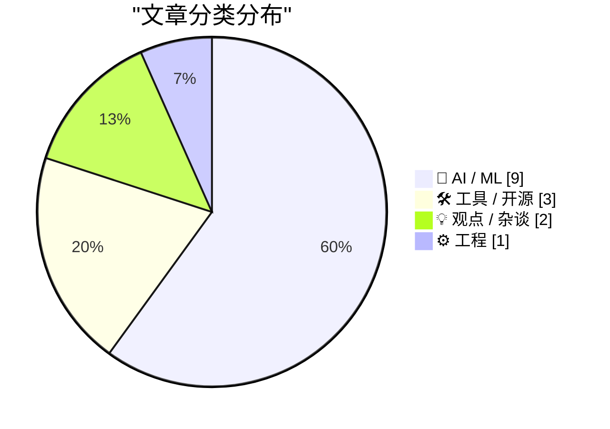
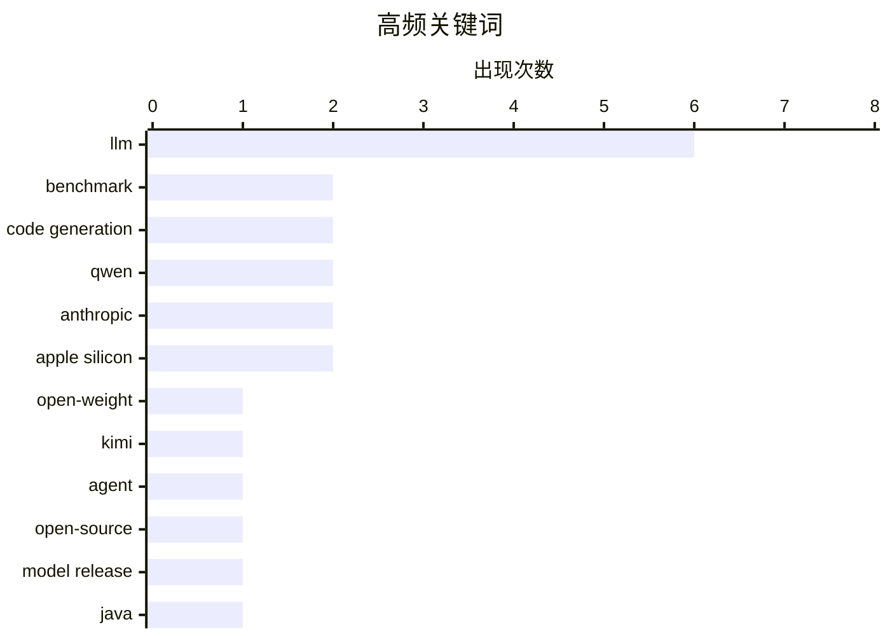

# 📰 AI 资讯每日精选 — 2026-04-21

> 汇聚 140+ 技术博客、X/Twitter、Hacker News、Reddit、Product Hunt、
> Lobste.rs、ClawFeed 日报及 GitHub Trending，经 AI 评分筛选。
>
> **本期内容**：🏆 今日必读 · 🌐 ClawFeed 日报 · 🔥 GitHub Trending · 📂 分类精选 · 🎨 设计与生成式 AI · 📊 数据概览

## 📝 今日看点

今日技术圈焦点集中于AI领域的激烈竞争与生态演变。开源大模型正强势挑战闭源巨头，Kimi与Qwen等国产模型在编码与智能基准上取得突破，推动技术民主化。同时，业界对AI开发工具与生产环境数据的关注日益加深，而Java等传统技术栈也在积极规划面向未来的演进。

---

## 🏆 今日必读

🥇 **开源模型 Kimi K2.6 以智能体集群技术挑战 GPT-5.4 与 Claude Opus 4.6**

[Open-weight Kimi K2.6 takes on GPT-5.4 and Claude Opus 4.6 with agent swarms](https://the-decoder.com/open-weight-kimi-k2-6-takes-on-gpt-5-4-and-claude-opus-4-6-with-agent-swarms/) — The Decoder · 7 小时前 · 🤖 AI / ML

> Moonshot AI 发布了开源的 Kimi K2.6 模型，旨在编程基准测试中与 GPT-5.4 和 Claude Opus 4.6 等顶级闭源模型竞争。该模型的核心优势在于其强大的智能体集群能力，能够并行运行多达 300 个智能体。这表明开源模型正通过差异化技术路线（如大规模并行智能体）来弥补与闭源模型在通用能力上的差距。文章认为，Kimi K2.6 的发布是开源社区挑战商业巨头在编程AI领域主导地位的一次重要尝试。

💡 **为什么值得读**: 此文揭示了开源大模型如何通过智能体集群等创新架构，在特定领域（如编码）向顶尖闭源模型发起挑战，为开发者提供了新的技术选型思路。

🏷️ open-weight, Kimi, agent, benchmark

🥈 **Kimi K2.6：推动开源编码模型的进步**

[Kimi K2.6: Advancing open-source coding](https://www.kimi.com/blog/kimi-k2-6) — Hacker News Best · 8 小时前 · 🤖 AI / ML

> 文章来自 Kimi 官方博客，详细介绍了 Kimi K2.6 模型在推动开源编码AI发展方面的进展。该模型在 Hacker News 上获得了 535 点热度与 274 条评论，引发了开发者社区的高度关注与讨论。内容可能涉及模型的技术细节、性能基准测试结果及其对开源生态的意义。社区的热烈反响表明，市场对高性能、可定制的开源编码模型存在强烈需求。

💡 **为什么值得读**: 通过官方视角和社区数据，可以深入了解 Kimi K2.6 的技术特性及其在开发者中的真实影响力。

🏷️ code generation, open-source, LLM

🥉 **Qwen3.6-Max-Preview：更智能、更敏锐，持续进化**

[Qwen3.6-Max-Preview: Smarter, Sharper, Still Evolving](https://qwen.ai/blog?id=qwen3.6-max-preview) — Hacker News Best · 10 小时前 · 🤖 AI / ML

> 通义千问团队发布了 Qwen3.6-Max-Preview 模型，强调其在智能与敏锐度上的提升。该模型在中文模型的 AA-Intelligence Index 评测中获得了最高分（52分）。文章发布后，在 Hacker News 上获得 505 点热度与 251 条评论，显示出国际开发者社区对中国领先大模型的密切关注。这表明 Qwen 系列模型正持续迭代，并在特定评测体系中展现出竞争力。

💡 **为什么值得读**: 关注中国顶尖大模型的最新进展和性能表现，了解其在全球开源生态中的定位与竞争力。

🏷️ Qwen, LLM, model release

4️⃣ **2026年Java技术的现状 • Ben Evans**

[State of the Art of Java in 2026 • Ben Evans](https://www.reddit.com/r/programming/comments/1sqqx50/state_of_the_art_of_java_in_2026_ben_evans/) — r/programming · 9 小时前 · ⚙️ 工程

> 这是一场由资深Java专家Ben Evans主讲的演讲，主题是展望2026年Java语言与生态系统的技术前沿。内容很可能涵盖Project Loom（虚拟线程）、Valhalla（值对象）、Panama（外部函数接口）等关键项目的最新进展与落地影响。演讲将分析这些新特性如何重塑Java在高并发、高性能计算等场景下的开发现状与最佳实践。对于Java开发者而言，这是把握未来几年技术风向标的重要参考。

💡 **为什么值得读**: Ben Evans是Java生态的权威声音，他的前瞻性分析能帮助开发者提前规划技术栈，应对即将到来的变革。

🏷️ Java, state of the art, 2026

5️⃣ **LangSmith 信号最新数据：基于 LangChain 开源遥测的 LLM 提供商 API 调用量与开发者采用趋势**

[📊 The latest from the LangSmith Signal: We looked at API call volume and developer adoption trends across LLM providers using LangChain open source...](https://x.com/LangChain/status/2046303329312227787) — 𝕏 @LangChain · 5 小时前 · 🤖 AI / ML

> LangChain 团队基于其开源框架的遥测数据，发布了自2025年12月以来各大LLM提供商的API调用量及开发者采用趋势分析。这份数据提供了独特的第三方视角，揭示了开发者在生产环境中实际使用AI模型的选择偏好。通过分析API调用量的变化，可以洞察哪些模型（如GPT、Claude、开源模型等）正在获得或失去开发者的青睐。这些数据对于评估LLM市场的真实竞争格局具有重要参考价值。

💡 **为什么值得读**: 基于真实生产环境数据的趋势分析，比单纯的基准测试更能反映LLM模型在实际开发中的受欢迎程度和实用性。

🏷️ LangChain, telemetry, trends

---

## 🌐 ClawFeed 日报精选

> 来源：[ClawFeed](https://clawfeed.kevinhe.io) — AI 驱动的多源新闻聚合

### 🔥 今日头条

1. **OpenAI 把 Codex 从 coding tool 推向全工作流 agent 平台**
   今天最强主线就是 OpenAI 连续强化 Codex，新增 computer use、浏览器、image generation、memory、SSH devbox、并行 agents 和更多插件，目标已经不是“帮你写代码”，而是抢开发者与知识工作者的工作台入口。

2. **GPT-Rosalind 发布，frontier model 开始更明确切入生命科学**
   OpenAI 同步推出面向生命科学研究的 GPT-Rosalind，直接把能力包装到药物发现、基因组学、实验规划和转化医学流程，说明高价值垂直场景会越来越成为大模型产品化主战场。

3. **Claude Opus 4.7 刷新 agent 竞争强度**
   Anthropic 今天在社媒侧最强的产品信号是 Claude Opus 4.7，重点强调更稳的长任务执行、指令跟随和交付前自检。市场关注点继续从“聊天更像人”转向“能不能稳定干完复杂任务”。

4. **AI 安全和 cyber defense 持续升温**
   OpenAI 扩大 Trusted Access for Cyber，并开放更高信任级别团队申请 GPT-5.4-Cyber。Anthropic 则继续推进 Project Glasswing，把 Claude 往关键软件安全和基础设施防护场景里打，安全赛道已经明显进入平台级竞争。

5. **多模态 agent 和 world model 继续冒头**
   Google DeepMind 把 Gemini Robotics 接到 Spot 上，HeyGen 开源 HyperFrames，腾讯 HY-World-2.0 也被持续讨论。除了 coding agent，视频编辑、机器人执行、3D world generation 都在变成新一轮 agent 入口。

---

## 🔥 GitHub Trending

> 今日热门开源项目（全语言 + Python）

| # | 项目 | 描述 | ⭐ 总星 | 📈 今日 | 语言 |
|---|------|------|---------|---------|------|
| 1 | [Fincept-Corporation/FinceptTerminal](https://github.com/Fincept-Corporation/FinceptTerminal) | FinceptTerminal is a modern finance application offering ... | 9.5k | +3109 | Python |
| 2 | [openai/openai-agents-python](https://github.com/openai/openai-agents-python) 🤖 | A lightweight, powerful framework for multi-agent workflows | 23.9k | +905 | Python |
| 3 | [ruvnet/RuView](https://github.com/ruvnet/RuView) | π RuView: WiFi DensePose turns commodity WiFi signals int... | 48.2k | +713 | Rust |
| 4 | [thunderbird/thunderbolt](https://github.com/thunderbird/thunderbolt) 🤖 | AI You Control: Choose your models. Own your data. Elimin... | 2.8k | +675 | TypeScript |
| 5 | [paperless-ngx/paperless-ngx](https://github.com/paperless-ngx/paperless-ngx) | A community-supported supercharged document management sy... | 39.4k | +606 | Python |
| 6 | [sansan0/TrendRadar](https://github.com/sansan0/TrendRadar) 🤖 | ⭐AI-driven public opinion & trend monitor with multi-plat... | 52.9k | +604 | Python |
| 7 | [tractorjuice/arc-kit](https://github.com/tractorjuice/arc-kit) | Enterprise Architecture Governance & Vendor Procurement T... | 1.3k | +329 | HTML |
| 8 | [koala73/worldmonitor](https://github.com/koala73/worldmonitor) 🤖 | Real-time global intelligence dashboard. AI-powered news ... | 50.1k | +316 | TypeScript |
| 9 | [HKUDS/RAG-Anything](https://github.com/HKUDS/RAG-Anything) 🤖 | "RAG-Anything: All-in-One RAG Framework" | 16.4k | +245 | Python |
| 10 | [pi-hole/pi-hole](https://github.com/pi-hole/pi-hole) | A black hole for Internet advertisements | 57.2k | +196 | Shell |
| 11 | [zhinianboke/xianyu-auto-reply](https://github.com/zhinianboke/xianyu-auto-reply) | 闲鱼自动回复管理系统是一个基于 Python + FastAPI 开发的自动化客服系统，专为闲鱼平台设计。系统通过... | 4.2k | +145 | Python |
| 12 | [deepseek-ai/DeepGEMM](https://github.com/deepseek-ai/DeepGEMM) 🤖 | DeepGEMM: clean and efficient FP8 GEMM kernels with fine-... | 6.8k | +109 | Cuda |
| 13 | [TheAlgorithms/Python](https://github.com/TheAlgorithms/Python) | All Algorithms implemented in Python | 219.9k | +88 | Python |
| 14 | [XTLS/Xray-core](https://github.com/XTLS/Xray-core) | Xray, Penetrates Everything. Also the best v2ray-core. Wh... | 37.4k | +78 | Go |
| 15 | [kyegomez/swarms](https://github.com/kyegomez/swarms) 🤖 | The Enterprise-Grade Production-Ready Multi-Agent Orchest... | 6.3k | +54 | Python |

---

## 🤖 AI / ML

### 1. 开源模型 Kimi K2.6 以智能体集群技术挑战 GPT-5.4 与 Claude Opus 4.6

[Open-weight Kimi K2.6 takes on GPT-5.4 and Claude Opus 4.6 with agent swarms](https://the-decoder.com/open-weight-kimi-k2-6-takes-on-gpt-5-4-and-claude-opus-4-6-with-agent-swarms/) — **The Decoder** · 7 小时前 · ⭐ 27/30

> Moonshot AI 发布了开源的 Kimi K2.6 模型，旨在编程基准测试中与 GPT-5.4 和 Claude Opus 4.6 等顶级闭源模型竞争。该模型的核心优势在于其强大的智能体集群能力，能够并行运行多达 300 个智能体。这表明开源模型正通过差异化技术路线（如大规模并行智能体）来弥补与闭源模型在通用能力上的差距。文章认为，Kimi K2.6 的发布是开源社区挑战商业巨头在编程AI领域主导地位的一次重要尝试。

🏷️ open-weight, Kimi, agent, benchmark

---

### 2. Kimi K2.6：推动开源编码模型的进步

[Kimi K2.6: Advancing open-source coding](https://www.kimi.com/blog/kimi-k2-6) — **Hacker News Best** · 8 小时前 · ⭐ 27/30

> 文章来自 Kimi 官方博客，详细介绍了 Kimi K2.6 模型在推动开源编码AI发展方面的进展。该模型在 Hacker News 上获得了 535 点热度与 274 条评论，引发了开发者社区的高度关注与讨论。内容可能涉及模型的技术细节、性能基准测试结果及其对开源生态的意义。社区的热烈反响表明，市场对高性能、可定制的开源编码模型存在强烈需求。

🏷️ code generation, open-source, LLM

---

### 3. Qwen3.6-Max-Preview：更智能、更敏锐，持续进化

[Qwen3.6-Max-Preview: Smarter, Sharper, Still Evolving](https://qwen.ai/blog?id=qwen3.6-max-preview) — **Hacker News Best** · 10 小时前 · ⭐ 27/30

> 通义千问团队发布了 Qwen3.6-Max-Preview 模型，强调其在智能与敏锐度上的提升。该模型在中文模型的 AA-Intelligence Index 评测中获得了最高分（52分）。文章发布后，在 Hacker News 上获得 505 点热度与 251 条评论，显示出国际开发者社区对中国领先大模型的密切关注。这表明 Qwen 系列模型正持续迭代，并在特定评测体系中展现出竞争力。

🏷️ Qwen, LLM, model release

---

### 4. LangSmith 信号最新数据：基于 LangChain 开源遥测的 LLM 提供商 API 调用量与开发者采用趋势

[📊 The latest from the LangSmith Signal: We looked at API call volume and developer adoption trends across LLM providers using LangChain open source...](https://x.com/LangChain/status/2046303329312227787) — **𝕏 @LangChain** · 5 小时前 · ⭐ 26/30

> LangChain 团队基于其开源框架的遥测数据，发布了自2025年12月以来各大LLM提供商的API调用量及开发者采用趋势分析。这份数据提供了独特的第三方视角，揭示了开发者在生产环境中实际使用AI模型的选择偏好。通过分析API调用量的变化，可以洞察哪些模型（如GPT、Claude、开源模型等）正在获得或失去开发者的青睐。这些数据对于评估LLM市场的真实竞争格局具有重要参考价值。

🏷️ LangChain, telemetry, trends

---

### 5. 谷歌组建精英团队，旨在缩小与Anthropic在AI编码领域的差距

[Google builds elite team to close the coding gap with Anthropic](https://the-decoder.com/google-builds-elite-team-to-close-the-coding-gap-with-anthropic/) — **The Decoder** · 7 小时前 · ⭐ 25/30

> 谷歌正在AI编码领域加倍投入，组建精英团队以追赶竞争对手Anthropic。公司的长期目标是开发能够自我改进的AI模型。联合创始人谢尔盖·布林（Sergey Brin）再次亲自领导这项关键任务，以确保谷歌在竞争白热化的AI领域保持竞争力。这表明在编程辅助AI这个核心赛道上，谷歌正面临来自 Anthropic（Claude）等公司的严峻挑战。

🏷️ Google, AI coding, Anthropic, competition

---

### 6. Qwen 3.6 Max Preview 已在千问聊天网站上发布，其AA智能指数在中国模型中最高（52分）

[Qwen 3.6 Max Preview just went live on the Qwen Chat website. It currently has the highest AA-Intelligence Index score among Chinese models (52) (Will it be open source?)](https://www.reddit.com/r/LocalLLaMA/comments/1sqlcan/qwen_36_max_preview_just_went_live_on_the_qwen/) — **r/LocalLLaMA** · 13 小时前 · ⭐ 25/30

> 通义千问的 Qwen 3.6 Max Preview 模型已在其官方聊天平台上线。根据AA智能指数（AA-Intelligence Index）评测，该模型目前在中国模型中得分最高，达到52分。社区（如 r/LocalLLaMA）的关注焦点在于这个预览版模型未来是否会开源。高分表现和开源可能性引发了开发者对中国最强开源模型迭代的期待。

🏷️ Qwen, LLM, benchmark

---

### 7. 我在MacBook Air M5上对21款本地大语言模型的代码质量和速度进行了基准测试

[I benchmarked 21 local LLMs on a MacBook Air M5 for code quality AND speed](https://www.reddit.com/r/LocalLLaMA/comments/1sr2wid/i_benchmarked_21_local_llms_on_a_macbook_air_m5/) — **r/LocalLLaMA** · 3 小时前 · ⭐ 25/30

> 该测试旨在用客观数据替代主观印象，评估21款本地大语言模型在MacBook Air M5上的实际编码表现。测试在统一条件下进行，使用164个编程问题，以pass@1作为代码正确性的核心指标，并同时测量生成速度。结果提供了包含模型、正确率、生成速度等维度的完整数据表格，使不同模型在性能与效率上的权衡一目了然。这为开发者在Mac平台上选择适合编码任务的本地模型提供了直接、可比较的数据支持。

🏷️ LLM Benchmark, Code Generation, Apple Silicon

---

### 8. LangChain数据：尽管增长平缓，OpenAI仍在LLM调用量上占据80%的绝对主导份额

[Re While @OpenAI growth was flat, they continued to dominate in the volume category with 80% of LLM traces.](https://x.com/LangChain/status/2046303334345384230) — **𝕏 @LangChain** · 5 小时前 · ⭐ 25/30

> 根据LangChain平台分享的LLM使用追踪数据，OpenAI在模型调用量上保持着压倒性的市场主导地位。尽管其增长势头趋于平缓，但在总调用量（volume）这一类别中，OpenAI占据了高达80%的份额。这表明绝大多数基于LangChain构建的应用程序仍在持续、大规模地调用OpenAI的API。数据揭示了当前LLM应用层对OpenAI生态的高度依赖现状。

🏷️ OpenAI, LLM, market-share

---

### 9. LangChain数据：Anthropic实现了最快速的增长，用户数激增73%，调用份额提升39%

[Re .@AnthropicAI had the speediest ascent, with a 73% increase in users and 39% increase in overall model run/API call share.](https://x.com/LangChain/status/2046303331879170519) — **𝕏 @LangChain** · 5 小时前 · ⭐ 25/30

> 同期数据显示，Anthropic是增长最快的LLM提供商。其用户数量实现了73%的显著增长，同时总体模型运行/API调用份额也提升了39%。这一增速在所有主要提供商中是最快的，表明Anthropic的模型（如Claude）正获得越来越多的开发者采纳。数据反映了LLM市场格局正在发生动态变化，出现了强有力的竞争者。

🏷️ Anthropic, LLM, growth

---

## 🛠 工具 / 开源

### 10. Claude Token 计数器升级，新增模型对比功能

[Claude Token Counter, now with model comparisons](https://simonwillison.net/2026/Apr/20/claude-token-counts/#atom-everything) — **simonwillison.net** · 23 小时前 · ⭐ 25/30

> 开发者 Simon Willison 升级了他的 Claude Token 计数器工具，新增了在不同模型间运行相同文本以对比令牌消耗量的功能。他发现 Claude Opus 4.7 是首个更改了分词器的模型，因此目前仅建议在 4.7 与 4.6 版本之间进行对比。该工具能帮助开发者精确评估不同模型处理相同内容时的成本差异，对于优化提示词和成本控制至关重要。

🏷️ Claude, LLM, token-counter, tools

---

### 11. TRELLIS.2 图像转3D模型现可在Mac（Apple Silicon）上运行，无需NVIDIA GPU

[TRELLIS.2 image-to-3D now runs on Mac (Apple Silicon) - no NVIDIA GPU needed](https://www.reddit.com/r/LocalLLaMA/comments/1sqi0m9/trellis2_imageto3d_now_runs_on_mac_apple_silicon/) — **r/LocalLLaMA** · 17 小时前 · ⭐ 25/30

> 微软的TRELLIS.2图像生成3D模型被成功移植到Apple Silicon Mac上运行，绕过了对NVIDIA GPU的依赖。原模型依赖五个仅支持CUDA的编译扩展（flex_gemm, flash_attn, o_voxel, cumesh, nvdiffrast），这些在Mac上无对应版本。作者通过重写后端实现了替代方案，包括纯PyTorch稀疏3D卷积和基于空间哈希的Python网格提取。这项工作使得没有高端NVIDIA显卡的Mac用户也能本地运行先进的图像转3D模型。

🏷️ 3D Generation, Apple Silicon, TRELLIS.2

---

### 12. 独家：微软计划将GitHub Copilot用户转向基于令牌的计费模式，并收紧速率限制

[Exclusive: Microsoft To Shift GitHub Copilot Users To Token-Based Billing, Tighten Rate Limits](https://www.wheresyoured.at/news-microsoft-to-shift-github-copilot-users-to-token-based-billing-reduce-rate-limits-2/) — **wheresyoured.at** · 7 小时前 · ⭐ 24/30

> 内部文件显示，微软计划对其GitHub Copilot编程辅助产品进行重大的计费模式变更。核心变化是从按“请求”计费转向基于消耗的“令牌”计费，同时将实施更严格的速率限制。文件透露，自年初以来，GitHub Copilot的每周运行成本已经翻倍，此次调整可能是为了控制激增的运营成本。作为过渡的一部分，个人账户的新注册将被暂时暂停。

🏷️ GitHub Copilot, billing, Microsoft

---

## 💡 观点 / 杂谈

### 13. 苹果官方公告：蒂姆·库克将转任董事会执行主席，约翰·特努斯将于2026年9月接任CEO

[Apple: ‘Tim Cook to Become Apple Executive Chairman; John Ternus to Become Apple CEO’](https://www.apple.com/newsroom/2026/04/tim-cook-to-become-apple-executive-chairman-john-ternus-to-become-apple-ceo/) — **daringfireball.net** · 3 小时前 · ⭐ 25/30

> 苹果公司正式宣布，现任CEO蒂姆·库克将于2026年9月1日转任公司董事会执行主席。现任硬件工程高级副总裁约翰·特努斯（John Ternus）将接任苹果首席执行官。此次交接是董事会经过深思熟虑的长期继任计划后一致批准的。库克将在夏季之前继续担任CEO，并与特努斯密切合作以确保平稳过渡。这标志着苹果自2011年以来的首次CEO更迭。

🏷️ Apple, CEO, leadership, transition

---

### 14. GitHub 的虚假星标经济

[GitHub's fake star economy](https://awesomeagents.ai/news/github-fake-stars-investigation/) — **Hacker News Best** · 15 小时前 · ⭐ 25/30

> 一篇调查报道深入揭露了GitHub上存在的虚假星标（stars）买卖产业链。文章在Hacker News上引发了巨大反响，获得727点热度与353条评论。这种“刷星”行为扭曲了开源项目的受欢迎度指标，使开发者难以甄别项目的真实质量与活跃度。虚假星标市场损害了开源社区的诚信，并对依赖GitHub数据做决策的投资者、开发者和公司造成误导。

🏷️ GitHub, open source, reputation, metrics

---

## ⚙️ 工程

### 15. 2026年Java技术的现状 • Ben Evans

[State of the Art of Java in 2026 • Ben Evans](https://www.reddit.com/r/programming/comments/1sqqx50/state_of_the_art_of_java_in_2026_ben_evans/) — **r/programming** · 9 小时前 · ⭐ 27/30

> 这是一场由资深Java专家Ben Evans主讲的演讲，主题是展望2026年Java语言与生态系统的技术前沿。内容很可能涵盖Project Loom（虚拟线程）、Valhalla（值对象）、Panama（外部函数接口）等关键项目的最新进展与落地影响。演讲将分析这些新特性如何重塑Java在高并发、高性能计算等场景下的开发现状与最佳实践。对于Java开发者而言，这是把握未来几年技术风向标的重要参考。

🏷️ Java, state of the art, 2026

---

## 🎨 Design & Generative AI

### 🖼️ 生成式图片

- **[LTX-2.3模型：63种采样器与线性二次调度程序测试](https://www.reddit.com/r/StableDiffusion/comments/1sqy9iu/ltx23_testing_63_samplers_with_linear_quadratic/)** — r/StableDiffusion · 5 小时前
  > 在Stable Diffusion社区测试LTX-2.3模型与63种不同采样器的性能表现。

- **[ComfyUI新节点发布：KleinRefGrid实现便捷参考](https://www.reddit.com/r/comfyui/comments/1sqts7n/node_release_comfyuikleinrefgrid_reference/)** — r/comfyui · 8 小时前
  > 介绍ComfyUI的新节点，方便用户在图像生成工作流中进行参考控制。

- **[开源蒸馏模型对比实验](https://www.reddit.com/r/StableDiffusion/comments/1sqv3i3/comparison_of_opensource_distilled_models/)** — r/StableDiffusion · 7 小时前
  > 对多个开源蒸馏模型进行图像生成效果的对比测试。

- **[Midjourney V8.1版本图像权重参数探讨](https://www.reddit.com/r/midjourney/comments/1sqdfbn/version_81_image_weights/)** — r/midjourney · 21 小时前
  > 展示并讨论Midjourney 8.1版本中图像权重参数对生成结果的影响。

- **[多模型横向对比：Chroma、Z image、Klein等](https://www.reddit.com/r/StableDiffusion/comments/1sqn1ro/same_prompt_for_various_models_chroma_z_image/)** — r/StableDiffusion · 12 小时前
  > 使用相同提示词对比Chroma、Z image、Klein等多个图像生成模型的输出效果。

- **[LTX 2.3与Wan 2.2模型效果对比](https://www.reddit.com/r/comfyui/comments/1sqot06/ltx_23_is_giving_me_better_results_than_wan_22/)** — r/comfyui · 11 小时前
  > 用户分享LTX 2.3模型在ComfyUI中相比Wan 2.2能产生更好结果的体验。

- **[Darkroom工作流重大更新：新增CMYK打印与色彩匹配功能](https://www.reddit.com/r/comfyui/comments/1sr2qba/darkroom_update_cmyk_print_workflow_reference/)** — r/comfyui · 3 小时前
  > ComfyUI的Darkroom工作流大幅更新，增加了专业印刷和色彩处理节点。

- **[RTX 5090在Ubuntu 25.10上训练FLUX.1 LoRA时出现显示冻结](https://www.reddit.com/r/comfyui/comments/1sqs6am/rtx_5090_ubuntu_2510_display_freeze_during_flux1/)** — r/comfyui · 9 小时前
  > 用户报告在Ubuntu 25.10系统上用RTX 5090训练FLUX.1模型的LoRA时遇到显示故障。

- **[专为LTX 2.3设计的开源CRT动画LoRA](https://www.reddit.com/r/StableDiffusion/comments/1squ6in/open_source_crt_animation_lora_for_ltx_23/)** — r/StableDiffusion · 7 小时前
  > 发布一个为LTX 2.3模型定制的、用于生成CRT显示器风格动画效果的LoRA。

- **[社区现象探讨：新技术发布后的热度为何难以维持？](https://www.reddit.com/r/StableDiffusion/comments/1sqpkeh/what_happens_to_all_the_new_tech_here_after_its/)** — r/StableDiffusion · 10 小时前
  > 讨论Stable Diffusion社区中新发布的技术（如视频编辑LoRA）为何很快沉寂的现象。

- **[Grok与LTX 2.3组合：自制电影预告片](https://www.reddit.com/r/StableDiffusion/comments/1sqfjla/grok_and_ltx_23_is_the_best_combo_made_my_own/)** — r/StableDiffusion · 19 小时前
  > 用户分享结合Grok和LTX 2.3模型制作个人电影预告片的成功经验。

- **[LTX 2.3外绘功能测试：以‘Billie Jean’为例](https://www.reddit.com/r/StableDiffusion/comments/1sr610d/ltx_23_outpainting_test_billie_jean_wan2gp/)** — r/StableDiffusion · 1 小时前
  > 测试LTX 2.3模型的外绘（Outpainting）功能，展示其扩展图像边界的能力。

- **[LTX 2.3新风格LoRA：适用于所有内容的‘更好现实’](https://www.reddit.com/r/StableDiffusion/comments/1sqw9ir/ltx_23_better_reality_lora_new_style_i_created/)** — r/StableDiffusion · 6 小时前
  > 介绍为LTX 2.3模型创建的一款旨在提升真实感并适用于广泛内容的新风格LoRA。

- **[ComfyUI节点更新：rgthree快速组旁路与静音功能增强](https://www.reddit.com/r/comfyui/comments/1sqfnv4/updated_rgthree_fast_groups_bypasser_and_fast/)** — r/comfyui · 19 小时前
  > 更新了ComfyUI中rgthree的快速组旁路器和静音器节点，提升工作流效率。

### 🎬 生成式视频

- **[AI生成完整对话场景：新类型AI电视即将到来？](https://www.reddit.com/r/midjourney/comments/1sqxgn0/a_new_genre_of_ai_tv_coming_aigenerated_full/)** — r/midjourney · 6 小时前
  > 展示一个由AI生成的包含完整对话的视频场景，探讨AI生成叙事内容的未来。

---

## 📊 数据概览

| 扫描源 | 抓取文章 | 时间范围 | 精选 |
|:---:|:---:|:---:|:---:|
| 114/140 | 4790 篇 → 215 篇 | 24h | **15 篇** |

### 分类分布



### 高频关键词



<details>
<summary>📈 纯文本关键词图（终端友好）</summary>

```
llm             │ ████████████████████ 6
benchmark       │ ███████░░░░░░░░░░░░░ 2
code generation │ ███████░░░░░░░░░░░░░ 2
qwen            │ ███████░░░░░░░░░░░░░ 2
anthropic       │ ███████░░░░░░░░░░░░░ 2
apple silicon   │ ███████░░░░░░░░░░░░░ 2
open-weight     │ ███░░░░░░░░░░░░░░░░░ 1
kimi            │ ███░░░░░░░░░░░░░░░░░ 1
agent           │ ███░░░░░░░░░░░░░░░░░ 1
open-source     │ ███░░░░░░░░░░░░░░░░░ 1
```

</details>

### 🏷️ 话题标签

**llm**(6) · **benchmark**(2) · **code generation**(2) · qwen(2) · anthropic(2) · apple silicon(2) · open-weight(1) · kimi(1) · agent(1) · open-source(1) · model release(1) · java(1) · state of the art(1) · 2026(1) · langchain(1) · telemetry(1) · trends(1) · claude(1) · token-counter(1) · tools(1)

---

*生成于 2026-04-21 00:18 | 汇聚 140 个技术博客、X/Twitter、Hacker News、Reddit、Product Hunt、Lobste.rs、ClawFeed 日报及 GitHub Trending，经 AI 评分筛选出 Top 15 精华内容*
