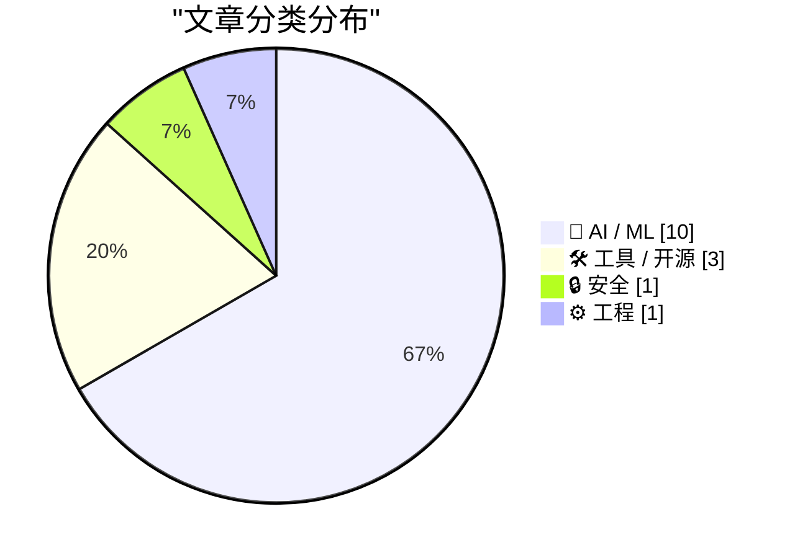
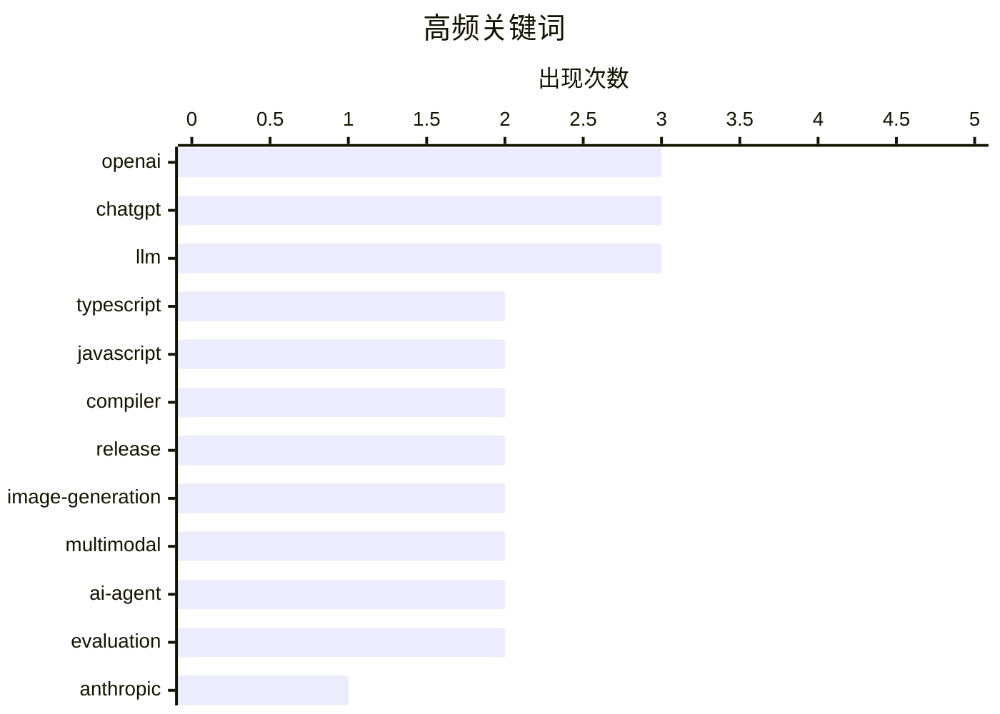

# 📰 AI 资讯每日精选 — 2026-04-22

> 汇聚 140+ 技术博客、X/Twitter、Hacker News、Reddit、Product Hunt、
> Lobste.rs、ClawFeed 日报及 GitHub Trending，经 AI 评分筛选。
>
> **本期内容**：🏆 今日必读 · 🌐 ClawFeed 日报 · 🔥 GitHub Trending · 📂 分类精选 · 🎨 设计与生成式 AI · 📊 数据概览

## 📝 今日看点

今日技术圈的核心焦点依然被人工智能的军备竞赛与生态构建所主导。云巨头与顶尖AI公司的千亿级深度绑定，揭示了基础设施已成为竞争的关键战场。同时，AI能力正从通用对话向专业化、自主化的智能体演进，并在图像生成等具体领域实现感知与推理能力的突破。此外，开发者工具的重要更新与针对大模型的新兴评估基准，也反映出产业在狂热发展中对工程稳健性与模型公正性的持续关注。

---

## 🏆 今日必读

🥇 **亚马逊向Anthropic注资330亿美元，后者承诺未来十年在AWS上投入超1000亿美元**

[Amazon pours $33B into Anthropic, which promises to spend $100B right back on AWS](https://the-decoder.com/amazon-pours-33b-into-anthropic-which-promises-to-spend-100b-right-back-on-aws/) — The Decoder · 14 小时前 · 🤖 AI / ML

> 亚马逊与AI公司Anthropic达成一项总额高达330亿美元的战略投资协议。作为交换，Anthropic承诺在未来十年内，在亚马逊AWS云服务上投入超过1000亿美元的基础设施支出。这笔交易旨在缓解Anthropic当前面临的严峻算力短缺问题。该协议体现了AI行业典型的“循环投资”模式，即资本投入与云服务消费紧密绑定。

💡 **为什么值得读**: 该新闻揭示了科技巨头与前沿AI实验室之间通过资本与算力深度绑定的新型合作模式，对理解AI产业竞争格局和基础设施依赖至关重要。

🏷️ Anthropic, AWS, Investment, Cloud

🥈 **TypeScript 7.0 Beta 版本发布**

[Announcing TypeScript 7.0 Beta](https://devblogs.microsoft.com/typescript/announcing-typescript-7-0-beta/) — Lobste.rs · 3 小时前 · 🛠 工具 / 开源

> 微软正式发布了 TypeScript 7.0 的 Beta 版本。该版本通常包含对类型系统、编译器性能或开发体验的重大改进和新特性。开发者可以通过官方博客了解具体的功能更新、破坏性变更和迁移指南。建议关注正式版发布前的测试和反馈周期。

💡 **为什么值得读**: 对于使用TypeScript的大型项目或框架开发者而言，提前了解主要版本的新特性和潜在破坏性变更，是规划技术升级和规避风险的必要步骤。

🏷️ TypeScript, JavaScript, compiler, release

🥉 **浣熊拿着火腿电台在哪？(ChatGPT Images 2.0 图像生成测试)**

[Where's the raccoon with the ham radio? (ChatGPT Images 2.0)](https://simonwillison.net/2026/Apr/21/gpt-image-2/#atom-everything) — simonwillison.net · 3 小时前 · 🤖 AI / ML

> 作者对OpenAI新发布的ChatGPT Images 2.0图像生成模型进行了趣味性测试。测试提示词是要求生成一幅类似《威利在哪里？》的寻找游戏图片，但主角换成一只拿着火腿电台的浣熊。OpenAI首席执行官Sam Altman曾宣称，该模型相对于前代的飞跃，相当于从GPT-3升级到GPT-5。文章记录了作者使用该提示词进行生成的具体过程和结果。

💡 **为什么值得读**: 通过一个生动有趣的真实用例，直观展示了新一代图像生成模型在理解复杂、具象化提示词和生成连贯场景方面的能力边界。

🏷️ OpenAI, ChatGPT, image-generation, multimodal

4️⃣ **ChatGPT Images 2.0 是一项可能彻底重塑图像生成的突破**

[ChatGPT Images 2.0 is a breakthrough that could fundamentally reshape graphic generation](https://the-decoder.com/openais-chatgpt-images-2-0-thinks-before-it-generates-adding-reasoning-and-web-search-to-image-creation/) — The Decoder · 4 小时前 · 🤖 AI / ML

> OpenAI为其图像生成器ChatGPT Images 2.0新增了推理和网络搜索能力。该模型现在能够根据单个提示词生成最多8张风格一致的图像，并且在处理文本（尤其是非拉丁文字）方面有显著提升。这些改进意味着模型在创作前会进行“思考”，从而更好地理解复杂意图和上下文。文章认为，这标志着图像生成技术向更智能、更可控的方向迈出了关键一步。

💡 **为什么值得读**: 它清晰地指出了新一代图像生成模型的核心技术进步（推理、一致性、文本处理），并解释了这些技术如何从根本上改变创作流程和输出质量。

🏷️ OpenAI, image-generation, ChatGPT, multimodal

5️⃣ **谷歌推出Deep Research与Deep Research Max智能体，以自动化复杂研究任务**

[Google launches Deep Research and Deep Research Max agents to automate complex research](https://the-decoder.com/google-launches-deep-research-and-deep-research-max-agents-to-automate-complex-research/) — The Decoder · 6 小时前 · 🤖 AI / ML

> 谷歌DeepMind发布了基于Gemini 3.1 Pro构建的新型AI智能体Deep Research Max。该智能体能够跨网络和专有数据源进行自主研究。其关键创新在于首次通过模型上下文协议（MCP），允许开发者接入金融数据流等专业数据源。然而，文章也指出，其公布的性能基准测试仍缺乏足够的透明度。

💡 **为什么值得读**: 它介绍了AI智能体在自动化专业研究领域的最新进展，特别是其连接外部专业数据源的能力，这对金融、咨询等行业的从业者有直接参考价值。

🏷️ Google, AI-agent, research, Gemini

---

## 🌐 ClawFeed 日报精选

> 来源：[ClawFeed](https://clawfeed.kevinhe.io) — AI 驱动的多源新闻聚合

### 🔥 今日头条

1. **OpenAI 把 Codex 从 coding tool 推向全工作流 agent 平台**
   今天最强主线就是 OpenAI 连续强化 Codex，新增 computer use、浏览器、image generation、memory、SSH devbox、并行 agents 和更多插件，目标已经不是“帮你写代码”，而是抢开发者与知识工作者的工作台入口。

2. **GPT-Rosalind 发布，frontier model 开始更明确切入生命科学**
   OpenAI 同步推出面向生命科学研究的 GPT-Rosalind，直接把能力包装到药物发现、基因组学、实验规划和转化医学流程，说明高价值垂直场景会越来越成为大模型产品化主战场。

3. **Claude Opus 4.7 刷新 agent 竞争强度**
   Anthropic 今天在社媒侧最强的产品信号是 Claude Opus 4.7，重点强调更稳的长任务执行、指令跟随和交付前自检。市场关注点继续从“聊天更像人”转向“能不能稳定干完复杂任务”。

4. **AI 安全和 cyber defense 持续升温**
   OpenAI 扩大 Trusted Access for Cyber，并开放更高信任级别团队申请 GPT-5.4-Cyber。Anthropic 则继续推进 Project Glasswing，把 Claude 往关键软件安全和基础设施防护场景里打，安全赛道已经明显进入平台级竞争。

5. **多模态 agent 和 world model 继续冒头**
   Google DeepMind 把 Gemini Robotics 接到 Spot 上，HeyGen 开源 HyperFrames，腾讯 HY-World-2.0 也被持续讨论。除了 coding agent，视频编辑、机器人执行、3D world generation 都在变成新一轮 agent 入口。

---

## 🔥 GitHub Trending

> 今日热门开源项目（全语言 + Python）

| # | 项目 | 描述 | ⭐ 总星 | 📈 今日 | 语言 |
|---|------|------|---------|---------|------|
| 1 | [Fincept-Corporation/FinceptTerminal](https://github.com/Fincept-Corporation/FinceptTerminal) | FinceptTerminal is a modern finance application offering ... | 11.6k | +2548 | Python |
| 2 | [ruvnet/RuView](https://github.com/ruvnet/RuView) | π RuView: WiFi DensePose turns commodity WiFi signals int... | 48.9k | +824 | Rust |
| 3 | [thunderbird/thunderbolt](https://github.com/thunderbird/thunderbolt) 🤖 | AI You Control: Choose your models. Own your data. Elimin... | 3.5k | +596 | TypeScript |
| 4 | [openai/openai-agents-python](https://github.com/openai/openai-agents-python) 🤖 | A lightweight, powerful framework for multi-agent workflows | 24.4k | +550 | Python |
| 5 | [sansan0/TrendRadar](https://github.com/sansan0/TrendRadar) 🤖 | ⭐AI-driven public opinion & trend monitor with multi-plat... | 53.6k | +534 | Python |
| 6 | [microsoft/ai-agents-for-beginners](https://github.com/microsoft/ai-agents-for-beginners) 🤖 | 12 Lessons to Get Started Building AI Agents | 57.6k | +200 | Jupyter Notebook |
| 7 | [zilliztech/claude-context](https://github.com/zilliztech/claude-context) 🤖 | Code search MCP for Claude Code. Make entire codebase the... | 6.6k | +169 | TypeScript |
| 8 | [HKUDS/RAG-Anything](https://github.com/HKUDS/RAG-Anything) 🤖 | "RAG-Anything: All-in-One RAG Framework" | 16.8k | +162 | Python |
| 9 | [OthmanAdi/planning-with-files](https://github.com/OthmanAdi/planning-with-files) 🤖 | Claude Code skill implementing Manus-style persistent mar... | 19.3k | +119 | Python |
| 10 | [MoonshotAI/kimi-cli](https://github.com/MoonshotAI/kimi-cli) 🤖 | Kimi Code CLI is your next CLI agent. | 8.0k | +76 | Python |
| 11 | [dayanch96/YTLite](https://github.com/dayanch96/YTLite) | A flexible enhancer for YouTube on iOS | 4.8k | +55 | Logos |
| 12 | [PrefectHQ/fastmcp](https://github.com/PrefectHQ/fastmcp) | 🚀 The fast, Pythonic way to build MCP servers and clients. | 24.7k | +53 | Python |
| 13 | [swisskyrepo/PayloadsAllTheThings](https://github.com/swisskyrepo/PayloadsAllTheThings) | A list of useful payloads and bypass for Web Application ... | 77.1k | +40 | Python |
| 14 | [huggingface/skills](https://github.com/huggingface/skills) | Give your agents the power of the Hugging Face ecosystem | 10.3k | +15 | Python |

---

## 🤖 AI / ML

### 1. 亚马逊向Anthropic注资330亿美元，后者承诺未来十年在AWS上投入超1000亿美元

[Amazon pours $33B into Anthropic, which promises to spend $100B right back on AWS](https://the-decoder.com/amazon-pours-33b-into-anthropic-which-promises-to-spend-100b-right-back-on-aws/) — **The Decoder** · 14 小时前 · ⭐ 26/30

> 亚马逊与AI公司Anthropic达成一项总额高达330亿美元的战略投资协议。作为交换，Anthropic承诺在未来十年内，在亚马逊AWS云服务上投入超过1000亿美元的基础设施支出。这笔交易旨在缓解Anthropic当前面临的严峻算力短缺问题。该协议体现了AI行业典型的“循环投资”模式，即资本投入与云服务消费紧密绑定。

🏷️ Anthropic, AWS, Investment, Cloud

---

### 2. 浣熊拿着火腿电台在哪？(ChatGPT Images 2.0 图像生成测试)

[Where's the raccoon with the ham radio? (ChatGPT Images 2.0)](https://simonwillison.net/2026/Apr/21/gpt-image-2/#atom-everything) — **simonwillison.net** · 3 小时前 · ⭐ 25/30

> 作者对OpenAI新发布的ChatGPT Images 2.0图像生成模型进行了趣味性测试。测试提示词是要求生成一幅类似《威利在哪里？》的寻找游戏图片，但主角换成一只拿着火腿电台的浣熊。OpenAI首席执行官Sam Altman曾宣称，该模型相对于前代的飞跃，相当于从GPT-3升级到GPT-5。文章记录了作者使用该提示词进行生成的具体过程和结果。

🏷️ OpenAI, ChatGPT, image-generation, multimodal

---

### 3. ChatGPT Images 2.0 是一项可能彻底重塑图像生成的突破

[ChatGPT Images 2.0 is a breakthrough that could fundamentally reshape graphic generation](https://the-decoder.com/openais-chatgpt-images-2-0-thinks-before-it-generates-adding-reasoning-and-web-search-to-image-creation/) — **The Decoder** · 4 小时前 · ⭐ 25/30

> OpenAI为其图像生成器ChatGPT Images 2.0新增了推理和网络搜索能力。该模型现在能够根据单个提示词生成最多8张风格一致的图像，并且在处理文本（尤其是非拉丁文字）方面有显著提升。这些改进意味着模型在创作前会进行“思考”，从而更好地理解复杂意图和上下文。文章认为，这标志着图像生成技术向更智能、更可控的方向迈出了关键一步。

🏷️ OpenAI, image-generation, ChatGPT, multimodal

---

### 4. 谷歌推出Deep Research与Deep Research Max智能体，以自动化复杂研究任务

[Google launches Deep Research and Deep Research Max agents to automate complex research](https://the-decoder.com/google-launches-deep-research-and-deep-research-max-agents-to-automate-complex-research/) — **The Decoder** · 6 小时前 · ⭐ 25/30

> 谷歌DeepMind发布了基于Gemini 3.1 Pro构建的新型AI智能体Deep Research Max。该智能体能够跨网络和专有数据源进行自主研究。其关键创新在于首次通过模型上下文协议（MCP），允许开发者接入金融数据流等专业数据源。然而，文章也指出，其公布的性能基准测试仍缺乏足够的透明度。

🏷️ Google, AI-agent, research, Gemini

---

### 5. 新LLM位置偏见基准测试：调换答案顺序后，LLM的判断会保持一致吗？

[New LLM Position Bias Benchmark: does an LLM keep the same judgment when you swap the answer order? Judge models compare two lightly edited versions of the same story twice, with the order swapped. The median model flips in 45% of decisive case pairs. GPT-5.4 is worst at 66%.](https://www.reddit.com/r/singularity/comments/1srx4i1/new_llm_position_bias_benchmark_does_an_llm_keep/) — **r/singularity** · 5 小时前 · ⭐ 25/30

> 一项新的基准测试旨在评估大语言模型（LLM）是否存在“位置偏见”，即其判断是否会因为备选答案的排列顺序不同而改变。测试方法是让作为裁判的模型对同一故事的两个轻微编辑版本进行两次比较，并调换答案顺序。结果显示，被测模型中位数在45%的关键案例对中会改变判断。其中，GPT-5.4的表现最差，翻转率高达66%。这表明位置偏见是当前LLM普遍存在且严重的问题。

🏷️ LLM, Benchmark, Bias, Evaluation

---

### 6. AI奥德赛，第四部分：令人惊叹的编程智能体

[An AI Odyssey, Part 4: Astounding Coding Agents](https://www.johndcook.com/blog/2026/04/21/an-ai-odyssey-part-4-astounding-coding-agents/) — **johndcook.com** · 3 小时前 · ⭐ 24/30

> 作者分享了自上次更新以来，使用AI编程智能体的最新体验。他指出，AI编程能力在去年夏季和去年12月至今年1月经历了两次显著飞跃。主观感受上，模型显得“聪明”得多，能够完成更广泛的任务，并且对代码库和用户意图有了更全面、深入的理解。文章通过具体实例说明了这些进步如何实际提升开发效率。

🏷️ AI-coding, LLM, developer-tools, productivity

---

### 7. QIMMA قِمّة ⛰：一个质量优先的阿拉伯语大语言模型排行榜

[QIMMA قِمّة ⛰: A Quality-First Arabic LLM Leaderboard](https://huggingface.co/blog/tiiuae/qimma-arabic-leaderboard) — **Hugging Face Blog** · 14 小时前 · ⭐ 24/30

> Hugging Face博客介绍了由阿联酋技术创新研究所（TII）推出的“QIMMA”阿拉伯语大语言模型专用排行榜。该排行榜的核心特点是“质量优先”，旨在更全面、公平地评估模型在阿拉伯语理解和生成任务上的能力。它可能包含了针对阿拉伯语语法、文化背景、多方言等独特挑战设计的评估基准。此举是为了填补当前主流评测对阿拉伯语等特定语言关注不足的空白。

🏷️ LLM, leaderboard, Arabic, evaluation

---

### 8. 如何利用合成人物角色，让韩国AI智能体基于真实人口统计数据落地

[How to Ground a Korean AI Agent in Real Demographics with Synthetic Personas](https://huggingface.co/blog/nvidia/build-korean-agents-with-nemotron-personas) — **Hugging Face Blog** · 23 小时前 · ⭐ 24/30

> 文章探讨了如何为韩国AI智能体创建符合真实人口统计特征的合成人物角色，以提升其本土化表现和可信度。核心方案是使用NVIDIA的Nemotron模型生成包含年龄、职业、地区等属性的多样化韩国人物角色数据集。这些合成数据用于训练或微调智能体，使其交互风格和知识背景更贴近韩国社会的真实分布。该方法为在特定文化或人口背景下构建更接地气的AI代理提供了一种高效的数据解决方案。

🏷️ AI-agent, synthetic-data, Korean, grounding

---

### 9. 杰夫·贝佐斯为其AI实验室“普罗米修斯计划”接近完成100亿美元融资轮

[Jeff Bezos nears $10 billion funding round for AI lab "Project Prometheus"](https://the-decoder.com/jeff-bezos-nears-10-billion-funding-round-for-ai-lab-project-prometheus/) — **The Decoder** · 14 小时前 · ⭐ 24/30

> 杰夫·贝佐斯即将为其代号为“Project Prometheus”的AI实验室完成一轮高达100亿美元的融资。据《金融时报》报道，此轮融资规模巨大，显示出贝佐斯在AI领域与OpenAI、Anthropic等公司竞争的强烈野心。巨额资金将用于支持该实验室在通用人工智能（AGI）等前沿方向的研究与开发。这表明科技巨头和富豪正以前所未有的资本投入，争夺AI领域的领导权。

🏷️ Jeff Bezos, AI Lab, Funding, Project Prometheus

---

### 10. ChatGPT Images 2.0发布

[ChatGPT Images 2.0](https://openai.com/index/introducing-chatgpt-images-2-0/) — **Hacker News Best** · 5 小时前 · ⭐ 24/30

> OpenAI发布了其图像生成模型的重要升级版本ChatGPT Images 2.0。新版本在图像质量、细节连贯性和提示词遵循能力上均有显著提升，并支持更高分辨率和更复杂的多对象场景生成。此次更新可能整合了DALL-E 3的后续改进技术，旨在巩固其在AI图像生成领域的竞争力。这表明文本到图像生成技术正朝着更精准、更高质量的方向快速迭代。

🏷️ OpenAI, ChatGPT, Multimodal AI

---

## 🛠 工具 / 开源

### 11. TypeScript 7.0 Beta 版本发布

[Announcing TypeScript 7.0 Beta](https://devblogs.microsoft.com/typescript/announcing-typescript-7-0-beta/) — **Lobste.rs** · 3 小时前 · ⭐ 26/30

> 微软正式发布了 TypeScript 7.0 的 Beta 版本。该版本通常包含对类型系统、编译器性能或开发体验的重大改进和新特性。开发者可以通过官方博客了解具体的功能更新、破坏性变更和迁移指南。建议关注正式版发布前的测试和反馈周期。

🏷️ TypeScript, JavaScript, compiler, release

---

### 12. TypeScript 7.0 Beta 版本发布 (Reddit讨论)

[Announcing TypeScript 7.0 Beta](https://www.reddit.com/r/programming/comments/1srwby3/announcing_typescript_70_beta/) — **r/programming** · 5 小时前 · ⭐ 25/30

> TypeScript项目经理Daniel Rosenwasser在Reddit的r/programming板块分享了TypeScript 7.0 Beta版本发布的官方博客链接。该帖子引发了开发者社区的关注和讨论。社区通常会在此类帖子中交流对新特性的看法、潜在问题以及升级经验。这是获取早期使用者反馈和实战问题的重要渠道。

🏷️ TypeScript, JavaScript, compiler

---

### 13. Git 2.54版本亮点解读

[Highlights from Git 2.54](https://www.reddit.com/r/programming/comments/1srhttc/highlights_from_git_254/) — **r/programming** · 15 小时前 · ⭐ 24/30

> 文章总结了分布式版本控制系统Git最新2.54版本中的主要新特性与改进。亮点包括对`git stash`命令的重构以提升性能、`git maintenance`任务的优化以增强仓库维护效率，以及`git grep`等命令的功能增强。这些更新持续优化了开发者日常使用的工作流和大型仓库的管理体验。新版本延续了Git对性能、可用性和可维护性的持续关注。

🏷️ Git, version control, release

---

## 🔒 安全

### 14. “散乱蜘蛛”黑客组织成员“Tylerb”认罪

[‘Scattered Spider’ Member ‘Tylerb’ Pleads Guilty](https://krebsonsecurity.com/2026/04/scattered-spider-member-tylerb-pleads-guilty/) — **krebsonsecurity.com** · 9 小时前 · ⭐ 24/30

> 24岁的英国公民、网络犯罪组织“散乱蜘蛛”（Scattered Spider）的高级成员Tyler Robert Buchanan已对合谋电信欺诈和严重身份盗窃罪名表示认罪。他承认在2022年夏季参与了一系列短信钓鱼攻击，帮助该组织入侵了至少十几家大型科技公司。通过这些攻击，该组织从投资者那里窃取了价值数千万美元的加密货币。

🏷️ cybercrime, phishing, legal, Scattered-Spider

---

## ⚙️ 工程

### 15. 一个Roblox外挂和一款AI工具如何导致Vercel整个平台瘫痪

[A Roblox cheat and one AI tool brought down Vercel's platform](https://webmatrices.com/post/how-a-roblox-cheat-and-one-ai-tool-brought-down-vercel-s-entire-platform) — **Hacker News Best** · 20 小时前 · ⭐ 24/30

> 一篇技术分析文章详细复盘了Vercel平台一次大规模服务中断的根本原因。事故起因是一个流行的Roblox游戏外挂工具，其开发者使用某个AI代码生成工具，批量创建了海量恶意Vercel预览部署项目。这些项目触发了平台反滥用系统的警报，导致自动防护机制错误地封禁了大量合法用户项目，引发雪崩效应。事件暴露了云平台在自动化防护与AI生成内容滥用相结合时面临的复杂挑战。

🏷️ Vercel, outage, scaling

---

## 🎨 Design & Generative AI

### 🖼️ 生成式图片

- **[ComfyUI节点连接工具更新：新增激光特效](https://www.reddit.com/r/comfyui/comments/1srnncl/comfyuiconnectthedots_connect_comfyui_nodes_using/)** — r/comfyui · 10 小时前
  > 一款为ComfyUI设计的侧边栏工具，简化节点连接流程并新增视觉特效。

- **[ComfyUI DiffAid补丁发布：提升文本到图像生成的校正效果](https://www.reddit.com/r/StableDiffusion/comments/1srk0xx/release_comfyui_diffaid_patches_inferencetime/)** — r/StableDiffusion · 13 小时前
  > 通过推理时自适应交互去噪技术，改善修正后的文生图质量。

- **[ComfyUI全景贴纸插件新增视频与全景支持](https://www.reddit.com/r/comfyui/comments/1srgf9x/comfyui_panorama_stickers_added_video_support/)** — r/comfyui · 16 小时前
  > ComfyUI插件现支持视频生成及180°/360°全景图像制作。

- **[Anima Turbo LoRA模型v0.1版本发布](https://www.reddit.com/r/StableDiffusion/comments/1srpjac/anima_turbo_lora_v01_released/)** — r/StableDiffusion · 9 小时前
  > 一款新的LoRA模型发布，旨在加速或增强Stable Diffusion的图像生成。

- **[ComfyUI Deno自定义节点包发布](https://www.reddit.com/r/StableDiffusion/comments/1sreybz/deno_custom_nodes_for_comfyui/)** — r/StableDiffusion · 18 小时前
  > 为ComfyUI发布了一套专注于工作流程的实用自定义节点包。

- **[开源单二进制文件图像生成CLI工具](https://www.reddit.com/r/StableDiffusion/comments/1sr8b6k/open_source_image_generation_cli_one_binary/)** — r/StableDiffusion · 23 小时前
  > 一个旨在简化模型管理和管道搭建的单一可执行文件命令行图像生成工具。

- **[一键部署ComfyUI + CUDA + Docker环境](https://www.reddit.com/r/StableDiffusion/comments/1srooox/comfyui_cuda_docker_in_a_single_command/)** — r/StableDiffusion · 10 小时前
  > 通过单个命令简化ComfyUI与CUDA在Docker环境中的部署过程。

- **[用户测试新版GPT图像模型，发现美学大幅提升](https://www.reddit.com/r/midjourney/comments/1srpdkn/ive_been_frantically_testing_the_new_gpt_20_model/)** — r/midjourney · 9 小时前
  > 用户对比测试表明，新版GPT图像生成模型在美学上融合了Midjourney元素，效果显著改进。

- **[KleinRefGrid工具登陆ComfyUI，优化参考图工作流](https://www.reddit.com/r/comfyui/comments/1srlbuh/kleinrefgrid_arrives_in_comfyui_for_better/)** — r/comfyui · 12 小时前
  > 一款新工具集成到ComfyUI中，旨在提供更好的参考图像处理工作流程。

- **[新版ChatGPT图像生成出现类似早期Stable Diffusion的瑕疵](https://www.reddit.com/r/StableDiffusion/comments/1ss0bst/these_artifacts_of_the_new_chatgpt_images_20/)** — r/StableDiffusion · 3 小时前
  > 用户发现ChatGPT新图像模型产生的瑕疵让人联想到Stable Diffusion 1.5时代常见的参数错误结果。

- **[寻求适用于RTX 3050 8GB显卡的最新工作流](https://www.reddit.com/r/StableDiffusion/comments/1srzn9p/most_recent_work_flow_for_a_3050_8gb_desktop/)** — r/StableDiffusion · 3 小时前
  > 用户在使用SD 1.5和Automatic1111后，为RTX 3050 8GB显卡寻找更现代的图像生成工作流程建议。

- **[ComfyUI便携版未来去向引关注](https://www.reddit.com/r/comfyui/comments/1sriqbq/future_of_the_portable_version/)** — r/comfyui · 14 小时前
  > 用户发现ComfyUI便携版从官网消失，对其未来表示担忧并寻求相关信息。

- **[探讨通过Inference UI在ComfyUI中使用ADetailer](https://www.reddit.com/r/comfyui/comments/1srl1a9/adetailer_for_comfyui_through_inference_ui/)** — r/comfyui · 12 小时前
  > 前Forge用户尝试通过Stability Matrix的Inference工具在ComfyUI中实现类似ADetailer的面部修复功能。

### 🎬 生成式视频

- **[Luma Agents：为你的故事提供完整漫画式视频处理](https://x.com/LumaLabsAI/status/2046722038606540807)** — 𝕏 @LumaLabsAI · 1 小时前
  > Luma Labs的AI代理能够将用户构建的故事和场景自动绘制成具有漫画风格的分镜视频。

- **[本地AI动画作品：“Psychotria Viridis”（使用Wan 2.2与ComfyUI）](https://www.reddit.com/r/StableDiffusion/comments/1srphob/psychotria_viridis_local_ai_animation_wan_22/)** — r/StableDiffusion · 9 小时前
  > 一部使用Wan 2.2模型在ComfyUI中本地生成的AI动画作品展示。

---

## 📊 数据概览

| 扫描源 | 抓取文章 | 时间范围 | 精选 |
|:---:|:---:|:---:|:---:|
| 109/140 | 4628 篇 → 209 篇 | 24h | **15 篇** |

### 分类分布



### 高频关键词



<details>
<summary>📈 纯文本关键词图（终端友好）</summary>

```
openai           │ ████████████████████ 3
chatgpt          │ ████████████████████ 3
llm              │ ████████████████████ 3
typescript       │ █████████████░░░░░░░ 2
javascript       │ █████████████░░░░░░░ 2
compiler         │ █████████████░░░░░░░ 2
release          │ █████████████░░░░░░░ 2
image-generation │ █████████████░░░░░░░ 2
multimodal       │ █████████████░░░░░░░ 2
ai-agent         │ █████████████░░░░░░░ 2
```

</details>

### 🏷️ 话题标签

**openai**(3) · **chatgpt**(3) · **llm**(3) · typescript(2) · javascript(2) · compiler(2) · release(2) · image-generation(2) · multimodal(2) · ai-agent(2) · evaluation(2) · anthropic(1) · aws(1) · investment(1) · cloud(1) · google(1) · research(1) · gemini(1) · benchmark(1) · bias(1)

---

*生成于 2026-04-22 00:12 | 汇聚 140 个技术博客、X/Twitter、Hacker News、Reddit、Product Hunt、Lobste.rs、ClawFeed 日报及 GitHub Trending，经 AI 评分筛选出 Top 15 精华内容*
