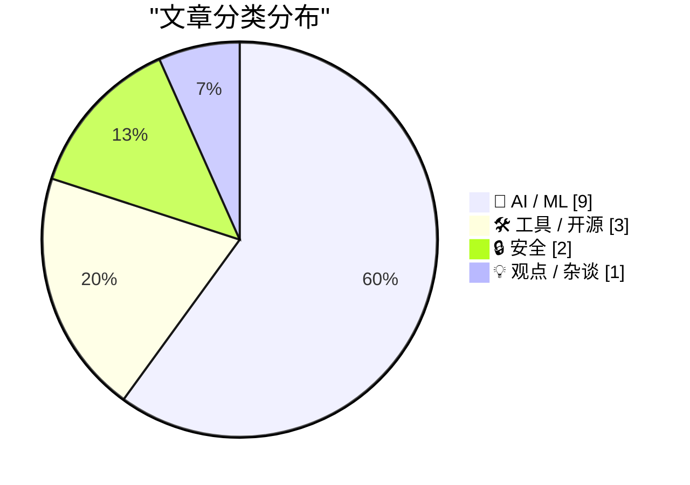
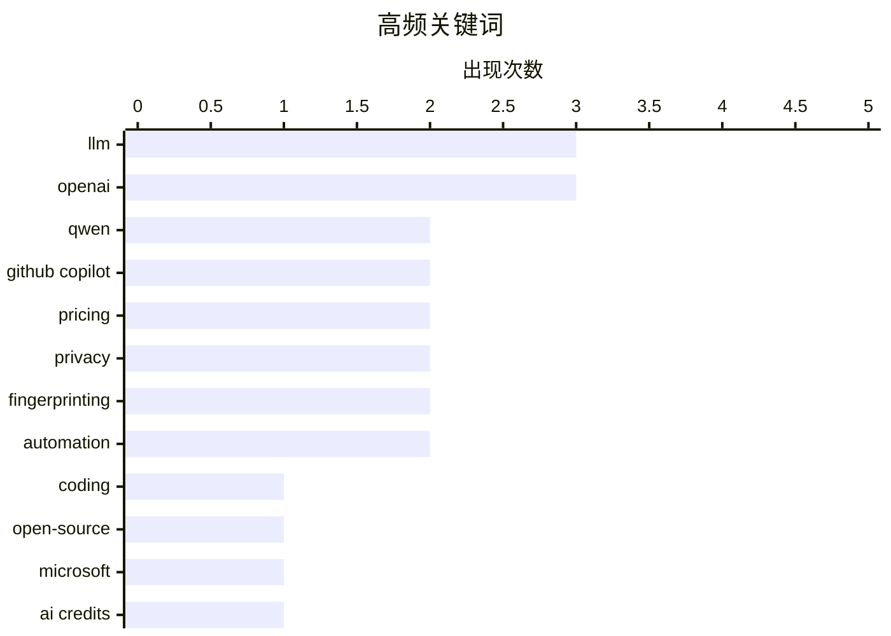

# 📰 AI 资讯每日精选 — 2026-04-23

> 汇聚 140+ 技术博客、X/Twitter、Hacker News、Reddit、Product Hunt、
> Lobste.rs、ClawFeed 日报及 GitHub Trending，经 AI 评分筛选。
>
> **本期内容**：🏆 今日必读 · 🌐 ClawFeed 日报 · 🔥 GitHub Trending · 📂 分类精选 · 🎨 设计与生成式 AI · 📊 数据概览

## 📝 今日看点

今日技术圈聚焦于AI能力的深度进化与行业生态的深刻变革。一方面，大模型正朝着更高效、更专业的方向迈进，通义千问和DeepMind分别发布了在编码与科研领域实现突破的紧凑型模型和自主智能体。另一方面，以微软GitHub Copilot为代表的AI工具付费模式正经历关键调整，基于用量的计费方式预示着AI服务商业化进入精细化运营阶段。同时，从谷歌发布专为智能体优化的TPU到教育界热议AI对教学的重塑，技术基础设施与应用场景正在同步迎来“智能体时代”的全面洗礼。

---

## 🏆 今日必读

🥇 **Qwen3.6-27B：在270亿参数稠密模型中实现旗舰级编码能力**

[Qwen3.6-27B: Flagship-Level Coding in a 27B Dense Model](https://simonwillison.net/2026/Apr/22/qwen36-27b/#atom-everything) — simonwillison.net · 8 小时前 · 🤖 AI / ML

> 通义千问发布了其最新的开源模型Qwen3.6-27B，声称在编码任务上达到了旗舰级性能。该模型在主要编码基准测试中，全面超越了上一代开源旗舰模型Qwen3.5-397B-A17B（一个总参数量3970亿、激活参数量170亿的混合专家模型）。作为一个270亿参数的稠密模型，其性能表现挑战了“更大参数模型性能必然更强”的常规认知。这表明，通过架构和训练优化，中等规模的模型也能在特定领域（如编码）达到顶尖水平。

💡 **为什么值得读**: 对于关注开源大模型进展和AI编码助手技术路线的开发者而言，这篇文章提供了关于模型效率与性能边界的最新、具体案例。

🏷️ LLM, Qwen, coding, open-source

🥈 **独家：微软将于6月将所有GitHub Copilot订阅用户转向基于令牌的计费模式**

[Exclusive: Microsoft Moving All GitHub Copilot Subscribers To Token-Based Billing In June](https://www.wheresyoured.at/exclusive-microsoft-moving-all-github-copilot-subscribers-to-token-based-billing-in-june/) — wheresyoured.at · 7 小时前 · 🛠 工具 / 开源

> 微软计划从6月开始，为所有GitHub Copilot客户推行基于令牌使用量的新计费模式。根据内部文件，Copilot Business客户每月每用户支付19美元，可获得30美元的共享AI额度；Copilot Enterprise客户每月每用户支付39美元，可获得70美元的共享AI额度。此举意味着收费方式从固定订阅费转向与实际使用量挂钩。这可能会显著改变企业客户，尤其是重度用户的成本结构。

💡 **为什么值得读**: 该消息直接影响所有GitHub Copilot企业用户的预算和采购决策，是了解AI工具商业化趋势和成本控制的关键信息。

🏷️ GitHub Copilot, pricing, Microsoft, AI credits

🥉 **Qwen3.6-27B：在270亿参数稠密模型中实现旗舰级编码能力**

[Qwen3.6-27B: Flagship-Level Coding in a 27B Dense Model](https://qwen.ai/blog?id=qwen3.6-27b) — Hacker News Best · 12 小时前 · 🤖 AI / ML

> 通义千问发布了其最新的开源模型Qwen3.6-27B，声称在编码任务上达到了旗舰级性能。该模型在主要编码基准测试中，全面超越了上一代开源旗舰模型Qwen3.5-397B-A17B（一个总参数量3970亿、激活参数量170亿的混合专家模型）。作为一个270亿参数的稠密模型，其性能表现挑战了“更大参数模型性能必然更强”的常规认知。这表明，通过架构和训练优化，中等规模的模型也能在特定领域（如编码）达到顶尖水平。

💡 **为什么值得读**: 对于关注开源大模型进展和AI编码助手技术路线的开发者而言，这篇文章提供了关于模型效率与性能边界的最新、具体案例。

🏷️ LLM, code generation, Qwen

4️⃣ **深度研究Max：自主研究智能体的一个阶跃式变革 | 来自Deepmind的新成果**

[Deep Research Max: a step change for autonomous research agents | New from Deepmind](https://www.reddit.com/r/singularity/comments/1ssa0ql/deep_research_max_a_step_change_for_autonomous/) — r/singularity · 21 小时前 · 🤖 AI / ML

> DeepMind发布了名为“Deep Research Max”的新型自主研究智能体，标志着该领域的一次重大进步。该智能体旨在自动化科学研究流程，能够自主进行假设生成、实验设计、数据分析和论文撰写等复杂任务。其核心突破在于提升了长程推理、多步骤规划以及在复杂科学领域（如材料发现、药物研发）的探索能力。这预示着AI驱动科学发现的速度和规模可能迎来质变。

💡 **为什么值得读**: 它展示了AI前沿如何从工具辅助迈向自主发现，对科研工作者和关注AI科学应用的人具有前瞻性启发。

🏷️ Deepmind, autonomous research, AI agent

5️⃣ **我们的第八代TPU：为智能体时代打造的双芯片**

[Our eighth generation TPUs: two chips for the agentic era](https://blog.google/innovation-and-ai/infrastructure-and-cloud/google-cloud/eighth-generation-tpu-agentic-era/) — Hacker News Best · 13 小时前 · 🤖 AI / ML

> 谷歌发布了专为“智能体时代”设计的第八代TPU（张量处理单元），包含两种芯片配置。新TPU针对运行复杂的AI智能体工作负载进行了优化，这些智能体需要长时间运行、具备记忆和工具使用能力。其架构革新旨在提供更高的计算密度、能效和内存带宽，以支持下一代自主或半自主AI系统的训练与推理。这标志着AI硬件正从服务单一模型推理转向支持持续、交互式的智能体任务。

💡 **为什么值得读**: 通过了解顶级科技公司的专用AI硬件路线图，可以把握未来AI应用（尤其是智能体）对底层算力的核心需求和发展方向。

🏷️ TPU, hardware, AI agents

---

## 🌐 ClawFeed 日报精选

> 来源：[ClawFeed](https://clawfeed.kevinhe.io) — AI 驱动的多源新闻聚合

### 🔥 今日头条

1. **OpenAI 把 Codex 从 coding tool 推向全工作流 agent 平台**
   今天最强主线就是 OpenAI 连续强化 Codex，新增 computer use、浏览器、image generation、memory、SSH devbox、并行 agents 和更多插件，目标已经不是“帮你写代码”，而是抢开发者与知识工作者的工作台入口。

2. **GPT-Rosalind 发布，frontier model 开始更明确切入生命科学**
   OpenAI 同步推出面向生命科学研究的 GPT-Rosalind，直接把能力包装到药物发现、基因组学、实验规划和转化医学流程，说明高价值垂直场景会越来越成为大模型产品化主战场。

3. **Claude Opus 4.7 刷新 agent 竞争强度**
   Anthropic 今天在社媒侧最强的产品信号是 Claude Opus 4.7，重点强调更稳的长任务执行、指令跟随和交付前自检。市场关注点继续从“聊天更像人”转向“能不能稳定干完复杂任务”。

4. **AI 安全和 cyber defense 持续升温**
   OpenAI 扩大 Trusted Access for Cyber，并开放更高信任级别团队申请 GPT-5.4-Cyber。Anthropic 则继续推进 Project Glasswing，把 Claude 往关键软件安全和基础设施防护场景里打，安全赛道已经明显进入平台级竞争。

5. **多模态 agent 和 world model 继续冒头**
   Google DeepMind 把 Gemini Robotics 接到 Spot 上，HeyGen 开源 HyperFrames，腾讯 HY-World-2.0 也被持续讨论。除了 coding agent，视频编辑、机器人执行、3D world generation 都在变成新一轮 agent 入口。

---

## 🔥 GitHub Trending

> 今日热门开源项目（全语言 + Python）

| # | 项目 | 描述 | ⭐ 总星 | 📈 今日 | 语言 |
|---|------|------|---------|---------|------|
| 1 | [Fincept-Corporation/FinceptTerminal](https://github.com/Fincept-Corporation/FinceptTerminal) | FinceptTerminal is a modern finance application offering ... | 13.1k | +1772 | Python |
| 2 | [sansan0/TrendRadar](https://github.com/sansan0/TrendRadar) 🤖 | ⭐AI-driven public opinion & trend monitor with multi-plat... | 54.4k | +969 | Python |
| 3 | [zilliztech/claude-context](https://github.com/zilliztech/claude-context) 🤖 | Code search MCP for Claude Code. Make entire codebase the... | 7.5k | +871 | TypeScript |
| 4 | [HKUDS/RAG-Anything](https://github.com/HKUDS/RAG-Anything) 🤖 | "RAG-Anything: All-in-One RAG Framework" | 17.6k | +786 | Python |
| 5 | [ruvnet/RuView](https://github.com/ruvnet/RuView) | π RuView: WiFi DensePose turns commodity WiFi signals int... | 49.4k | +565 | Rust |
| 6 | [open-metadata/OpenMetadata](https://github.com/open-metadata/OpenMetadata) | OpenMetadata is a unified metadata platform for data disc... | 12.2k | +521 | TypeScript |
| 7 | [Z4nzu/hackingtool](https://github.com/Z4nzu/hackingtool) | ALL IN ONE Hacking Tool For Hackers | 59.7k | +518 | Python |
| 8 | [koala73/worldmonitor](https://github.com/koala73/worldmonitor) 🤖 | Real-time global intelligence dashboard. AI-powered news ... | 51.6k | +424 | TypeScript |
| 9 | [open-webui/open-webui](https://github.com/open-webui/open-webui) 🤖 | User-friendly AI Interface (Supports Ollama, OpenAI API, ... | 133.4k | +379 | Python |
| 10 | [KeygraphHQ/shannon](https://github.com/KeygraphHQ/shannon) 🤖 | Shannon Lite is an autonomous, white-box AI pentester for... | 39.6k | +372 | TypeScript |
| 11 | [vercel-labs/skills](https://github.com/vercel-labs/skills) 🤖 | The open agent skills tool - npx skills | 15.5k | +333 | TypeScript |
| 12 | [AIDC-AI/Pixelle-Video](https://github.com/AIDC-AI/Pixelle-Video) 🤖 | 🚀 AI 全自动短视频引擎 | AI Fully Automated Short Video Engine | 5.6k | +308 | Python |
| 13 | [mvanhorn/last30days-skill](https://github.com/mvanhorn/last30days-skill) 🤖 | AI agent skill that researches any topic across Reddit, X... | 23.5k | +257 | Python |
| 14 | [Alishahryar1/free-claude-code](https://github.com/Alishahryar1/free-claude-code) 🤖 | Use claude-code for free in the terminal, VSCode extensio... | 2.9k | +181 | Python |
| 15 | [langfuse/langfuse](https://github.com/langfuse/langfuse) 🤖 | 🪢 Open source LLM engineering platform: LLM Observabilit... | 25.6k | +149 | TypeScript |

---

## 🤖 AI / ML

### 1. Qwen3.6-27B：在270亿参数稠密模型中实现旗舰级编码能力

[Qwen3.6-27B: Flagship-Level Coding in a 27B Dense Model](https://simonwillison.net/2026/Apr/22/qwen36-27b/#atom-everything) — **simonwillison.net** · 8 小时前 · ⭐ 27/30

> 通义千问发布了其最新的开源模型Qwen3.6-27B，声称在编码任务上达到了旗舰级性能。该模型在主要编码基准测试中，全面超越了上一代开源旗舰模型Qwen3.5-397B-A17B（一个总参数量3970亿、激活参数量170亿的混合专家模型）。作为一个270亿参数的稠密模型，其性能表现挑战了“更大参数模型性能必然更强”的常规认知。这表明，通过架构和训练优化，中等规模的模型也能在特定领域（如编码）达到顶尖水平。

🏷️ LLM, Qwen, coding, open-source

---

### 2. Qwen3.6-27B：在270亿参数稠密模型中实现旗舰级编码能力

[Qwen3.6-27B: Flagship-Level Coding in a 27B Dense Model](https://qwen.ai/blog?id=qwen3.6-27b) — **Hacker News Best** · 12 小时前 · ⭐ 27/30

> 通义千问发布了其最新的开源模型Qwen3.6-27B，声称在编码任务上达到了旗舰级性能。该模型在主要编码基准测试中，全面超越了上一代开源旗舰模型Qwen3.5-397B-A17B（一个总参数量3970亿、激活参数量170亿的混合专家模型）。作为一个270亿参数的稠密模型，其性能表现挑战了“更大参数模型性能必然更强”的常规认知。这表明，通过架构和训练优化，中等规模的模型也能在特定领域（如编码）达到顶尖水平。

🏷️ LLM, code generation, Qwen

---

### 3. 深度研究Max：自主研究智能体的一个阶跃式变革 | 来自Deepmind的新成果

[Deep Research Max: a step change for autonomous research agents | New from Deepmind](https://www.reddit.com/r/singularity/comments/1ssa0ql/deep_research_max_a_step_change_for_autonomous/) — **r/singularity** · 21 小时前 · ⭐ 27/30

> DeepMind发布了名为“Deep Research Max”的新型自主研究智能体，标志着该领域的一次重大进步。该智能体旨在自动化科学研究流程，能够自主进行假设生成、实验设计、数据分析和论文撰写等复杂任务。其核心突破在于提升了长程推理、多步骤规划以及在复杂科学领域（如材料发现、药物研发）的探索能力。这预示着AI驱动科学发现的速度和规模可能迎来质变。

🏷️ Deepmind, autonomous research, AI agent

---

### 4. 我们的第八代TPU：为智能体时代打造的双芯片

[Our eighth generation TPUs: two chips for the agentic era](https://blog.google/innovation-and-ai/infrastructure-and-cloud/google-cloud/eighth-generation-tpu-agentic-era/) — **Hacker News Best** · 13 小时前 · ⭐ 26/30

> 谷歌发布了专为“智能体时代”设计的第八代TPU（张量处理单元），包含两种芯片配置。新TPU针对运行复杂的AI智能体工作负载进行了优化，这些智能体需要长时间运行、具备记忆和工具使用能力。其架构革新旨在提供更高的计算密度、能效和内存带宽，以支持下一代自主或半自主AI系统的训练与推理。这标志着AI硬件正从服务单一模型推理转向支持持续、交互式的智能体任务。

🏷️ TPU, hardware, AI agents

---

### 5. 从零开始编写LLM，第33部分——我终于完成附录后学到了什么

[Writing an LLM from scratch, part 33 -- what I learned from finally getting round to the appendices](https://www.gilesthomas.com/2026/04/llm-from-scratch-33-what-i-learned-from-the-appendices) — **gilesthomas.com** · 7 小时前 · ⭐ 25/30

> 作者在完成《从零开始构建大语言模型》一书主体后，分享了完成三个后续目标（包括训练一个完整的GPT-2-small风格的基础模型）的心得与收获。实践过程揭示了从理论理解到实际训练一个可工作模型所面临的、教程中常被忽略的工程挑战和细节陷阱。这些经验对于任何想深入理解LLM内部机制而非仅调用API的开发者或研究者极具价值。它强调了动手实现对于真正掌握LLM核心技术的重要性。

🏷️ LLM, from scratch, machine learning

---

### 6. 腾讯、阿里巴巴正洽谈投资DeepSeek，估值超200亿美元

[Tencent, Alibaba in Talks to Invest in DeepSeek at $20 Billion-Plus Valuation](https://www.reddit.com/r/LocalLLaMA/comments/1ssna1h/tencent_alibaba_in_talks_to_invest_in_deepseek_at/) — **r/LocalLLaMA** · 10 小时前 · ⭐ 25/30

> 中国AI初创公司DeepSeek正与腾讯、阿里巴巴等巨头进行投资谈判，估值可能超过200亿美元。这笔潜在投资将为中国大模型领域的竞争格局带来重大影响，标志着头部互联网公司对顶尖AI初创企业的战略布局。若交易达成，DeepSeek将获得巨额资金支持，用于加速其大语言模型的研发与商业化。这反映了资本市场对具有自主技术实力的中国AI公司的持续看好。

🏷️ investment, DeepSeek, AI-ecosystem

---

### 7. 在补丁前录下了大规模OpenAI Codex模型泄露视频！（GPT-5.5, Arcanine, Glacier-alpha）

[Caught the massive OpenAI Codex model leak on video before it was patched! (GPT-5.5, Arcanine, Glacier-alpha)](https://www.reddit.com/r/singularity/comments/1ssb7mz/caught_the_massive_openai_codex_model_leak_on/) — **r/singularity** · 20 小时前 · ⭐ 25/30

> OpenAI的Codex界面意外泄露了其内部未发布模型的完整列表，包括GPT-5.5、oai-2.1、Arcanine和Glacier-alpha等。泄露源于OpenAI错误地将内部测试环境推送至生产环境，用户通过下拉菜单和工具提示发现了这些机密项目。工具提示显示GPT-5.5被描述为“最新的前沿模型”，而oai-2.1则关联到“推理”功能。OpenAI在发现问题后迅速修复了此漏洞，但视频记录已留存。此次泄露为外界窥探OpenAI的研发管线提供了罕见窗口。

🏷️ OpenAI, model leak, GPT-5.5

---

### 8. 前OpenAI研究员Jerry Tworek创立Core Automation，旨在打造全球自动化程度最高的AI实验室

[Ex-OpenAI researcher Jerry Tworek launches Core Automation to build the most automated AI lab in the world](https://the-decoder.com/ex-openai-researcher-jerry-tworek-launches-core-automation-to-build-the-most-automated-ai-lab-in-the-world/) — **The Decoder** · 6 小时前 · ⭐ 24/30

> 前OpenAI研究员Jerry Tworek创立了新公司Core Automation，目标是构建全球自动化程度最高的AI研究实验室。该公司计划采用小型精英团队配合全新的学习方法，以突破当前AI架构的局限性。其核心理念是通过极致的自动化流程来驱动AI模型的研发与迭代，减少对人力的依赖。Tworek希望借此探索超越现有Transformer架构的下一代AI范式。

🏷️ AI lab, automation, OpenAI, research

---

### 9. OpenAI推出工作区智能体，将ChatGPT从聊天机器人转变为团队自动化平台

[OpenAI launches workspace agents that turn ChatGPT from a chatbot into a team automation platform](https://the-decoder.com/openai-launches-workspace-agents-that-turn-chatgpt-from-a-chatbot-into-a-team-automation-platform/) — **The Decoder** · 6 小时前 · ⭐ 24/30

> OpenAI正式推出ChatGPT工作区智能体，这是对自定义GPT功能的重大升级。新功能由Codex提供支持，能够自动化复杂的团队工作流程，并能在无人值守的情况下持续运行。现有的自定义GPTs将暂时保留，未来会提供迁移路径。工作区智能体标志着ChatGPT从个人对话工具向企业级协作与自动化平台的战略转型。

🏷️ OpenAI, ChatGPT, Agents, Automation

---

## 🛠 工具 / 开源

### 10. 独家：微软将于6月将所有GitHub Copilot订阅用户转向基于令牌的计费模式

[Exclusive: Microsoft Moving All GitHub Copilot Subscribers To Token-Based Billing In June](https://www.wheresyoured.at/exclusive-microsoft-moving-all-github-copilot-subscribers-to-token-based-billing-in-june/) — **wheresyoured.at** · 7 小时前 · ⭐ 27/30

> 微软计划从6月开始，为所有GitHub Copilot客户推行基于令牌使用量的新计费模式。根据内部文件，Copilot Business客户每月每用户支付19美元，可获得30美元的共享AI额度；Copilot Enterprise客户每月每用户支付39美元，可获得70美元的共享AI额度。此举意味着收费方式从固定订阅费转向与实际使用量挂钩。这可能会显著改变企业客户，尤其是重度用户的成本结构。

🏷️ GitHub Copilot, pricing, Microsoft, AI credits

---

### 11. GitHub Copilot个人版计划变更

[Changes to GitHub Copilot Individual plans](https://simonwillison.net/2026/Apr/22/changes-to-github-copilot/#atom-everything) — **simonwillison.net** · 21 小时前 · ⭐ 25/30

> GitHub官方宣布了对其Copilot个人版订阅计划的调整。此次变更与Claude Code近期关于每月100美元定价的争议发生在同一天，但GitHub选择了发布正式公告说明。新计划的具体细节（如价格、功能或配额变化）是关注焦点，这反映了AI编码助手市场定价策略的快速演变。平台正试图在服务价值、用户增长和可持续商业模式之间寻找平衡点。

🏷️ GitHub Copilot, pricing, AI coding

---

### 12. GitHub CLI现在收集伪匿名遥测数据

[GitHub CLI now collects pseudoanonymous telemetry](https://cli.github.com/telemetry) — **Hacker News Best** · 13 小时前 · ⭐ 25/30

> GitHub官方宣布，其命令行工具GitHub CLI现在默认会收集“伪匿名”遥测数据。遥测数据包括命令使用频率、错误报告和性能指标等，旨在帮助改进工具。尽管声称数据是“伪匿名”且用户可以通过环境变量选择退出，但此举仍在开发者社区引发了关于隐私、透明度和开源工具商业化的广泛讨论。这反映了开发者工具在用户体验改进与用户隐私顾虑之间日益增长的张力。

🏷️ GitHub, CLI, telemetry

---

## 🔒 安全

### 13. 我们发现了一个稳定的Firefox标识符，可关联您所有的Tor匿名身份

[We found a stable Firefox identifier linking all your private Tor identities](https://fingerprint.com/blog/firefox-tor-indexeddb-privacy-vulnerability/) — **Hacker News Best** · 7 小时前 · ⭐ 25/30

> 安全研究人员发现Firefox浏览器（包括Tor Browser基于的版本）中存在一个隐私漏洞。该漏洞源于IndexedDB API的实现问题，会生成一个稳定的、跨会话和不同Tor电路的浏览器实例标识符。攻击者可以利用此标识符将用户通过Tor创建的不同匿名身份（如不同的网站账户）关联起来，从而破坏Tor提供的匿名性。这是一个严重的隐私缺陷，影响了依赖Tor进行匿名浏览的用户。

🏷️ privacy, browser, fingerprinting

---

### 14. 我们发现了一个稳定的Firefox标识符，可关联您所有的Tor隐私身份

[We Found a Stable Firefox Identifier Linking All Your Private Tor Identities](https://fingerprint.com/blog/firefox-tor-indexeddb-privacy-vulnerability/) — **Lobste.rs** · 5 小时前 · ⭐ 25/30

> 安全研究人员发现Firefox浏览器存在一个隐私漏洞，即使用IndexedDB API生成并存储一个稳定的“存储键”标识符。即使用户使用Tor浏览器或隐私模式，该标识符在不同会话、不同隐私身份之间也保持不变，导致匿名性被破坏。攻击者或追踪者可以利用此标识符将用户看似无关的多个浏览会话关联起来，形成长期的行为画像。该漏洞影响了Firefox的隐私设计承诺，尤其是在Tor这样的高隐私需求场景下。

🏷️ Firefox, privacy, fingerprinting, Tor

---

## 💡 观点 / 杂谈

### 15. AI与教学——勇敢新世界

[AI and Teaching – The Brave New World](https://steveblank.com/2026/04/22/ai-and-teaching-the-brave-new-world/) — **steveblank.com** · 9 小时前 · ⭐ 25/30

> 文章基于在斯坦福大学讲授精益创业课程16年的经验，探讨了AI（特别是生成式AI）对高等教育和教学方式带来的根本性变革。作者观察到，从新学年的第一堂课开始，学生团队利用AI工具进行市场研究、客户访谈分析和商业计划构建的速度与深度已呈现出“非凡”的变化。这标志着依赖传统信息收集和分析的教学模式走向终结，一个AI深度融入创造性学习和问题解决过程的新时代已经开始。教育者必须重新设计课程，以利用AI提升而非替代学生的批判性思维和创新能力。

🏷️ AI, education, teaching, innovation

---

## 🎨 Design & Generative AI

### 🖼️ 生成式图片

- **[免费Klein 9B工作台：支持实时区块编辑、训练与探索](https://www.reddit.com/r/StableDiffusion/comments/1sskb1u/i_built_a_free_klein_9b_workbench_with_live_block/)** — r/StableDiffusion · 12 小时前
  > 介绍一个为Stable Diffusion模型构建的免费多功能工作台，支持实时编辑、训练和探索。

- **[一站式测试：Stable Diffusion所有采样器/调度器的ComfyUI工作流](https://www.reddit.com/r/StableDiffusion/comments/1sswakp/i_have_seen_some_what_are_the_best/)** — r/StableDiffusion · 5 小时前
  > 创建了一个ComfyUI工作流，用于一次性测试和比较不同的采样器与调度器。

- **[ComfyUI视频帧提取器更新至v1.3.0](https://www.reddit.com/r/comfyui/comments/1sswlgd/update_for_video_frame_extractor_v130/)** — r/comfyui · 5 小时前
  > ComfyUI的视频帧提取器节点发布了新版本。

- **[Scope LTX-2.3更新：新增IC-LoRA与音频输入支持](https://www.reddit.com/r/StableDiffusion/comments/1ss8z7r/scope_ltx23_now_has_iclora_audioin_support/)** — r/StableDiffusion · 22 小时前
  > Scope LTX-2.3模型更新，增加了图像组合LoRA和音频输入功能。

- **[挑战Midjourney：Chroma V48与Radiance图像模型发布](https://www.reddit.com/r/StableDiffusion/comments/1ss7ldo/they_want_to_rival_midjourney_so_here_you_go/)** — r/StableDiffusion · 23 小时前
  > 介绍旨在与Midjourney竞争的Chroma V48和Radiance等图像生成模型。

- **[Chroma与Radiance系列模型呈现Midjourney风格画质](https://www.reddit.com/r/StableDiffusion/comments/1ss7cug/chroma1_v41_v48_radiance_delivering_a_look/)** — r/StableDiffusion · 23 小时前
  > 讨论Chroma V41、V48和Radiance等图像模型如何产出类似Midjourney的高质量视觉效果。

- **[联想UltraReal - v0.5 Anima模型与LoRA发布](https://www.reddit.com/r/StableDiffusion/comments/1st35s7/lenovo_ultrareal_v05_anima_anima_lora_civitai/)** — r/StableDiffusion · 56 分钟前
  > 分享联想发布的UltraReal v0.5 Anima模型及其对应的LoRA，用于生成写实动画风格图像。

- **[使用Wan 2.1与Flux实验电影感画面](https://www.reddit.com/r/StableDiffusion/comments/1ssw5si/experimenting_with_a_cinematic_look_using_wan_21/)** — r/StableDiffusion · 5 小时前
  > 展示结合Wan 2.1和Flux模型进行电影感图像生成的实验成果。

- **[ComfyUI-ComboFilter：隐藏不常用的采样器等节点](https://www.reddit.com/r/comfyui/comments/1ssx3ak/comfyuicombofilter_hide_the_samplers_schedulers/)** — r/comfyui · 4 小时前
  > 推出一个ComfyUI自定义节点，用于过滤和隐藏界面中不常用的采样器、调度器等选项。

- **[ComfyUI媒体浏览器图像加载节点发布](https://www.reddit.com/r/comfyui/comments/1st0b6t/comfyui_load_image_media_browser_node/)** — r/comfyui · 2 小时前
  > 发布首个ComfyUI自定义节点，提供带媒体浏览器的图像加载功能。

- **[求助：如何用Stable Diffusion生成包含3-5个特定角色的图像](https://www.reddit.com/r/StableDiffusion/comments/1ssmo7n/anyone_here_successfully_generating_images_with_3/)** — r/StableDiffusion · 11 小时前
  > 用户寻求使用Stable Diffusion同时生成包含多个特定角色（每个角色有独立LoRA）的图像的方法。

- **[求推荐：ComfyUI中管理滑块式角色LoRA的节点](https://www.reddit.com/r/comfyui/comments/1ssvrgi/character_creation_lora_node_suggestions/)** — r/comfyui · 5 小时前
  > 用户请求推荐能帮助管理和组织大量滑块式角色LoRA的ComfyUI节点或方法。

### 🎬 生成式视频

- **[Vidu Q3角色表情惊艳，求本地ComfyUI工作流](https://www.reddit.com/r/comfyui/comments/1ssjk8z/vidu_q3_is_nailing_my_character_expressions/)** — r/comfyui · 13 小时前
  > 用户询问是否有能在ComfyUI中本地运行、实现类似Vidu Q3视频模型角色表情效果的工作流。

- **[将《葬送的芙莉莲》转为定格动画风格](https://www.reddit.com/r/StableDiffusion/comments/1ssuqd0/making_frieren_into_a_felt_style_stopmotion/)** — r/StableDiffusion · 6 小时前
  > 分享使用AI工具将动漫角色《芙莉莲》转换为毛毡风格定格动画的创作过程。

- **[Muffins平面转VR：让任何视频变成立体VR](https://www.reddit.com/r/comfyui/comments/1ss9tcr/make_any_video_into_vr_with_muffins_flat_2_vr/)** — r/comfyui · 21 小时前
  > 介绍一个ComfyUI工作流，能够将普通平面视频转换为VR立体视频。

---

## 📊 数据概览

| 扫描源 | 抓取文章 | 时间范围 | 精选 |
|:---:|:---:|:---:|:---:|
| 111/140 | 4654 篇 → 202 篇 | 24h | **15 篇** |

### 分类分布



### 高频关键词



<details>
<summary>📈 纯文本关键词图（终端友好）</summary>

```
llm            │ ████████████████████ 3
openai         │ ████████████████████ 3
qwen           │ █████████████░░░░░░░ 2
github copilot │ █████████████░░░░░░░ 2
pricing        │ █████████████░░░░░░░ 2
privacy        │ █████████████░░░░░░░ 2
fingerprinting │ █████████████░░░░░░░ 2
automation     │ █████████████░░░░░░░ 2
coding         │ ███████░░░░░░░░░░░░░ 1
open-source    │ ███████░░░░░░░░░░░░░ 1
```

</details>

### 🏷️ 话题标签

**llm**(3) · **openai**(3) · **qwen**(2) · github copilot(2) · pricing(2) · privacy(2) · fingerprinting(2) · automation(2) · coding(1) · open-source(1) · microsoft(1) · ai credits(1) · code generation(1) · deepmind(1) · autonomous research(1) · ai agent(1) · tpu(1) · hardware(1) · ai agents(1) · ai coding(1)

---

*生成于 2026-04-23 01:20 | 汇聚 140 个技术博客、X/Twitter、Hacker News、Reddit、Product Hunt、Lobste.rs、ClawFeed 日报及 GitHub Trending，经 AI 评分筛选出 Top 15 精华内容*
