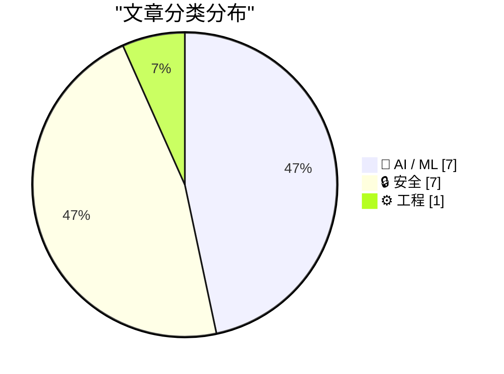
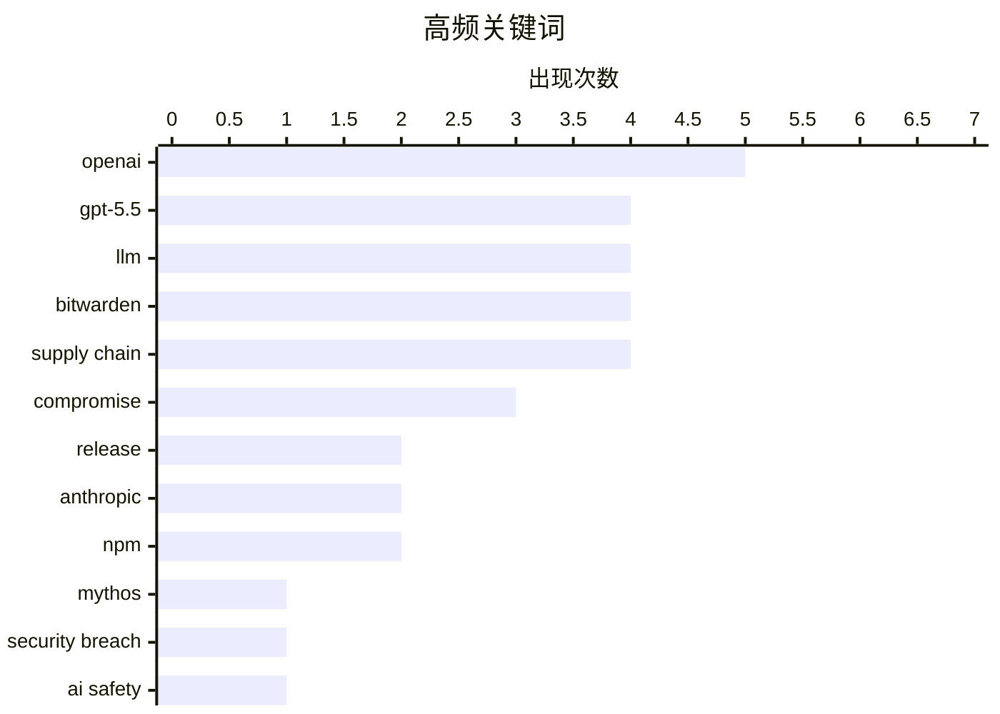

# 📰 AI 资讯每日精选 — 2026-04-24

> 汇聚 140+ 技术博客、X/Twitter、Hacker News、Reddit、Product Hunt、
> Lobste.rs、ClawFeed 日报及 GitHub Trending，经 AI 评分筛选。
>
> **本期内容**：🏆 今日必读 · 🌐 ClawFeed 日报 · 🔥 GitHub Trending · 📂 分类精选 · 🎨 设计与生成式 AI · 📊 数据概览

## 📝 今日看点

今日技术圈聚焦两大主线：AI模型能力跃迁与供应链安全危机。OpenAI发布GPT-5.5，宣称开启“新一类智能”，以自主工具调用和复杂任务处理能力为亮点，但API价格翻倍引发行业对成本与价值平衡的讨论。与此同时，安全领域接连爆出Bitwarden CLI被植入恶意代码、Anthropic的Claude Mythos模型遭未授权访问等事件，凸显开源生态与闭源模型管控面临的严峻挑战。此外，美国政府关于“对抗性蒸馏”的备忘录，预示着对开源模型监管可能进一步收紧，技术安全与开放性的博弈正在加剧。

---

## 🏆 今日必读

🥇 **GPT-5.5 发布**

[GPT-5.5](https://openai.com/index/introducing-gpt-5-5/) — Hacker News Best · 7 小时前 · 🤖 AI / ML

> OpenAI 正式发布 GPT-5.5，宣称其代表了“新一类智能”，能够自主切换多种工具以完成复杂任务。该模型在推理、规划和工具调用能力上相比 GPT-5 有显著提升，但 API 价格翻倍。OpenAI 强调 GPT-5.5 专为代理式（Agentic）工作流设计，可处理多步骤、跨系统的任务。核心结论是，GPT-5.5 标志着 AI 从单一对话模型向自主执行复杂任务的智能体演进。

💡 **为什么值得读**: 这是 OpenAI 最新旗舰模型的官方发布，直接展示了下一代 AI 的能力边界和定价策略，对技术选型和行业趋势判断至关重要。

🏷️ GPT-5.5, OpenAI, LLM, release

🥈 **Discord 群组中的未授权用户数周内持续访问 Anthropic 号称“超级危险”的 Claude Mythos 模型**

[Unauthorized Users in Discord Group Had Weekslong Access to Anthropic’s Supposedly-Super-Dangerous Claude Mythos Model](https://www.bloomberg.com/news/articles/2026-04-21/anthropic-s-mythos-model-is-being-accessed-by-unauthorized-users) — daringfireball.net · 7 小时前 · 🔒 安全

> 据 Bloomberg 报道，一群未授权用户通过一个私人在线论坛，在 Anthropic 宣布计划将 Mythos 模型有限开放给企业测试的当天，就获得了对该模型的访问权限。Anthropic 声称 Mythos 模型极其强大，能够发动危险的网络攻击。此次访问持续了数周，暴露了 Anthropic 在模型安全控制和发布流程上的严重漏洞。核心问题是，即便是最前沿、最危险的 AI 模型，其安全防护也可能被轻易绕过。

💡 **为什么值得读**: 该事件揭示了顶级 AI 公司在模型安全管控上的重大失败，对理解 AI 安全风险、供应链信任和模型发布策略具有警示意义。

🏷️ Anthropic, Mythos, security breach, AI safety

🥉 **关于近期 Claude Code 质量报告的更新**

[An update on recent Claude Code quality reports](https://www.anthropic.com/engineering/april-23-postmortem) — Hacker News Best · 7 小时前 · 🤖 AI / ML

> Anthropic 发布了一份事后分析报告，回应近期关于 Claude Code 代码生成质量的负面报告。报告承认在某些复杂场景下，Claude Code 生成的代码存在逻辑错误和安全隐患，尤其是在处理大型代码库和特定框架时。Anthropic 详细分析了问题根因，包括训练数据偏差和评估基准的局限性，并公布了已部署的修复措施。核心结论是，Anthropic 承诺将持续改进模型，并呼吁社区提供更多真实场景的反馈。

💡 **为什么值得读**: 这是 Anthropic 对自身产品缺陷的公开复盘，提供了关于 AI 代码生成模型当前局限性的第一手技术细节和修复思路。

🏷️ Claude, Anthropic, postmortem, quality

4️⃣ **Bitwarden CLI 在持续的 Checkmarx 供应链攻击中被攻陷**

[Bitwarden CLI compromised in ongoing Checkmarx supply chain campaign](https://socket.dev/blog/bitwarden-cli-compromised) — Hacker News Best · 10 小时前 · 🔒 安全

> 安全研究机构 Socket.dev 披露，Bitwarden 的 CLI 工具（npm 包 @bitwarden/cli）在版本 2026.4.0 中被植入恶意代码，这是 Checkmarx 发起的持续供应链攻击的一部分。恶意文件 bw1.js 会窃取 GitHub、npm、AWS、Azure、GCP、SSH 等凭证及环境变量，并能读取 GitHub Actions 运行器内存。该恶意软件还会尝试通过 npm 发布和 CI/CD 工作流进行横向传播。核心结论是，所有使用该版本的用户应立即检查并升级，此次攻击再次凸显了开源供应链安全的严峻形势。

💡 **为什么值得读**: 这是一起影响广泛的真实供应链攻击事件，直接涉及密码管理工具 Bitwarden，所有开发者和运维人员都必须了解其攻击手法和应对措施。

🏷️ Bitwarden, supply chain, compromise, CLI

5️⃣ **Bitwarden CLI 在持续的 Checkmarx 供应链攻击中被攻陷**

[Bitwarden CLI Compromised in Ongoing Checkmarx Supply Chain](https://www.reddit.com/r/programming/comments/1stoumz/bitwarden_cli_compromised_in_ongoing_checkmarx/) — r/programming · 8 小时前 · 🔒 安全

> Reddit r/programming 板块转载了 Bitwarden CLI 被攻陷的消息，指出 npm 包 @bitwarden/cli 版本 2026.4.0 被植入了恶意代码。攻击者通过 Checkmarx 供应链攻击，添加了 bw1.js 文件，用于窃取多种云服务和开发工具的凭证。该恶意软件还能读取 GitHub Actions 运行器内存，并试图通过 npm 和工作流进行自我传播。核心结论是，开发者需立即检查并更新 Bitwarden CLI，并警惕类似的供应链攻击。

💡 **为什么值得读**: 作为社区讨论帖，它汇集了开发者对此次安全事件的即时反应和排查建议，有助于了解实际影响和社区应对策略。

🏷️ supply chain, Bitwarden, npm, malware

---

## 🌐 ClawFeed 日报精选

> 来源：[ClawFeed](https://clawfeed.kevinhe.io) — AI 驱动的多源新闻聚合

### 🔥 今日头条

1. **OpenAI 把 Codex 从 coding tool 推向全工作流 agent 平台**
   今天最强主线就是 OpenAI 连续强化 Codex，新增 computer use、浏览器、image generation、memory、SSH devbox、并行 agents 和更多插件，目标已经不是“帮你写代码”，而是抢开发者与知识工作者的工作台入口。

2. **GPT-Rosalind 发布，frontier model 开始更明确切入生命科学**
   OpenAI 同步推出面向生命科学研究的 GPT-Rosalind，直接把能力包装到药物发现、基因组学、实验规划和转化医学流程，说明高价值垂直场景会越来越成为大模型产品化主战场。

3. **Claude Opus 4.7 刷新 agent 竞争强度**
   Anthropic 今天在社媒侧最强的产品信号是 Claude Opus 4.7，重点强调更稳的长任务执行、指令跟随和交付前自检。市场关注点继续从“聊天更像人”转向“能不能稳定干完复杂任务”。

4. **AI 安全和 cyber defense 持续升温**
   OpenAI 扩大 Trusted Access for Cyber，并开放更高信任级别团队申请 GPT-5.4-Cyber。Anthropic 则继续推进 Project Glasswing，把 Claude 往关键软件安全和基础设施防护场景里打，安全赛道已经明显进入平台级竞争。

5. **多模态 agent 和 world model 继续冒头**
   Google DeepMind 把 Gemini Robotics 接到 Spot 上，HeyGen 开源 HyperFrames，腾讯 HY-World-2.0 也被持续讨论。除了 coding agent，视频编辑、机器人执行、3D world generation 都在变成新一轮 agent 入口。

---

## 🔥 GitHub Trending

> 今日热门开源项目（全语言 + Python）

| # | 项目 | 描述 | ⭐ 总星 | 📈 今日 | 语言 |
|---|------|------|---------|---------|------|
| 1 | [Alishahryar1/free-claude-code](https://github.com/Alishahryar1/free-claude-code) 🤖 | Use claude-code for free in the terminal, VSCode extensio... | 5.6k | +1962 | Python |
| 2 | [Z4nzu/hackingtool](https://github.com/Z4nzu/hackingtool) | ALL IN ONE Hacking Tool For Hackers | 61.1k | +1383 | Python |
| 3 | [microsoft/markitdown](https://github.com/microsoft/markitdown) | Python tool for converting files and office documents to ... | 116.0k | +1083 | Python |
| 4 | [Fincept-Corporation/FinceptTerminal](https://github.com/Fincept-Corporation/FinceptTerminal) | FinceptTerminal is a modern finance application offering ... | 14.0k | +1039 | Python |
| 5 | [zilliztech/claude-context](https://github.com/zilliztech/claude-context) 🤖 | Code search MCP for Claude Code. Make entire codebase the... | 8.4k | +1011 | TypeScript |
| 6 | [AIDC-AI/Pixelle-Video](https://github.com/AIDC-AI/Pixelle-Video) 🤖 | 🚀 AI 全自动短视频引擎 | AI Fully Automated Short Video Engine | 6.3k | +992 | Python |
| 7 | [open-metadata/OpenMetadata](https://github.com/open-metadata/OpenMetadata) | OpenMetadata is a unified metadata platform for data disc... | 12.9k | +776 | TypeScript |
| 8 | [huggingface/ml-intern](https://github.com/huggingface/ml-intern) 🤖 | 🤗 ml-intern: an open-source ML engineer that reads paper... | 3.3k | +720 | Python |
| 9 | [sansan0/TrendRadar](https://github.com/sansan0/TrendRadar) 🤖 | ⭐AI-driven public opinion & trend monitor with multi-plat... | 54.9k | +650 | Python |
| 10 | [HKUDS/RAG-Anything](https://github.com/HKUDS/RAG-Anything) 🤖 | "RAG-Anything: All-in-One RAG Framework" | 18.2k | +590 | Python |
| 11 | [ruvnet/RuView](https://github.com/ruvnet/RuView) | π RuView: WiFi DensePose turns commodity WiFi signals int... | 49.8k | +429 | Rust |
| 12 | [Anil-matcha/Open-Generative-AI](https://github.com/Anil-matcha/Open-Generative-AI) 🤖 | Uncensored, open-source alternative to Higgsfield AI, Fre... | 7.0k | +316 | JavaScript |
| 13 | [open-webui/open-webui](https://github.com/open-webui/open-webui) 🤖 | User-friendly AI Interface (Supports Ollama, OpenAI API, ... | 133.7k | +312 | Python |
| 14 | [coreyhaines31/marketingskills](https://github.com/coreyhaines31/marketingskills) 🤖 | Marketing skills for Claude Code and AI agents. CRO, copy... | 23.8k | +285 | JavaScript |
| 15 | [mksglu/context-mode](https://github.com/mksglu/context-mode) 🤖 | Context window optimization for AI coding agents. Sandbox... | 9.4k | +238 | TypeScript |

---

## 🤖 AI / ML

### 1. GPT-5.5 发布

[GPT-5.5](https://openai.com/index/introducing-gpt-5-5/) — **Hacker News Best** · 7 小时前 · ⭐ 28/30

> OpenAI 正式发布 GPT-5.5，宣称其代表了“新一类智能”，能够自主切换多种工具以完成复杂任务。该模型在推理、规划和工具调用能力上相比 GPT-5 有显著提升，但 API 价格翻倍。OpenAI 强调 GPT-5.5 专为代理式（Agentic）工作流设计，可处理多步骤、跨系统的任务。核心结论是，GPT-5.5 标志着 AI 从单一对话模型向自主执行复杂任务的智能体演进。

🏷️ GPT-5.5, OpenAI, LLM, release

---

### 2. 关于近期 Claude Code 质量报告的更新

[An update on recent Claude Code quality reports](https://www.anthropic.com/engineering/april-23-postmortem) — **Hacker News Best** · 7 小时前 · ⭐ 27/30

> Anthropic 发布了一份事后分析报告，回应近期关于 Claude Code 代码生成质量的负面报告。报告承认在某些复杂场景下，Claude Code 生成的代码存在逻辑错误和安全隐患，尤其是在处理大型代码库和特定框架时。Anthropic 详细分析了问题根因，包括训练数据偏差和评估基准的局限性，并公布了已部署的修复措施。核心结论是，Anthropic 承诺将持续改进模型，并呼吁社区提供更多真实场景的反馈。

🏷️ Claude, Anthropic, postmortem, quality

---

### 3. GPT-5.5 发布

[Introducing GPT-5.5](https://www.reddit.com/r/singularity/comments/1stqev3/introducing_gpt55/) — **r/singularity** · 7 小时前 · ⭐ 27/30

> Reddit r/singularity 板块转发了 OpenAI 发布 GPT-5.5 的官方公告。社区成员正在热烈讨论该模型宣称的“新一类智能”以及 API 价格翻倍的影响。讨论焦点集中在 GPT-5.5 的代理能力、实际性能提升是否值得其高昂成本，以及对 AGI 发展路径的意义。核心结论是，GPT-5.5 的发布在技术社区引发了关于 AI 能力跃迁和商业化平衡的激烈辩论。

🏷️ GPT-5.5, OpenAI, LLM, release

---

### 4. OpenAI 发布 GPT-5.5，宣称“新一类智能”，API 价格翻倍

[OpenAI unveils GPT-5.5, claims a "new class of intelligence" at double the API price](https://the-decoder.com/openai-unveils-gpt-5-5-claims-a-new-class-of-intelligence-at-double-the-api-price/) — **The Decoder** · 6 小时前 · ⭐ 26/30

> The Decoder 报道，OpenAI 发布了 GPT-5.5，这是一款专为自主完成复杂任务而设计的代理式模型，能够自主切换多种工具。OpenAI 声称该模型代表了“新一类智能”，但其 API 价格是前代 GPT-5 的两倍。该模型的核心能力在于多步骤推理和跨系统工具调用，旨在解决需要长期规划和执行的任务。核心结论是，GPT-5.5 的性能提升伴随着显著的成本增加，其商业价值取决于能否在真实场景中兑现其代理能力。

🏷️ GPT-5.5, OpenAI, agentic, API

---

### 5. A pelican for GPT-5.5 via the semi-official Codex backdoor API

[A pelican for GPT-5.5 via the semi-official Codex backdoor API](https://simonwillison.net/2026/Apr/23/gpt-5-5/#atom-everything) — **simonwillison.net** · 5 小时前 · ⭐ 25/30

> <p><a href="https://openai.com/index/introducing-gpt-5-5/">GPT-5.5 is out</a>. It's available in OpenAI Codex and is rolling out to paid ChatGPT subscribers. I've had some preview access and found it 

🏷️ GPT-5.5, OpenAI, Codex, LLM

---

### 6. OpenAI releases open-source model that strips personal data from text

[OpenAI releases open-source model that strips personal data from text](https://the-decoder.com/openai-releases-open-source-model-that-strips-personal-data-from-text/) — **The Decoder** · 11 小时前 · ⭐ 25/30

> OpenAI has released Privacy Filter, an open-source model designed to detect and redact personal data in text.
The article OpenAI releases open-source model that strips personal data from text appeared

🏷️ privacy, open-source, data redaction, OpenAI

---

### 7. We benchmarked 18 LLMs on OCR (7k+ calls) — cheaper/old models oftentimes win. Full dataset + framework open-sourced. [R]

[We benchmarked 18 LLMs on OCR (7k+ calls) — cheaper/old models oftentimes win. Full dataset + framework open-sourced. [R]](https://www.reddit.com/r/MachineLearning/comments/1st9v81/we_benchmarked_18_llms_on_ocr_7k_calls_cheaperold/) — **r/MachineLearning** · 19 小时前 · ⭐ 25/30

> <!-- SC_OFF --><div class="md"><p><strong>TLDR;</strong> We were overpaying for OCR, so we compared flagship models with cheaper and older models. New mini-bench + leaderboard. Free tool to test your 

🏷️ OCR, LLM, benchmark, open source

---

## 🔒 安全

### 8. Discord 群组中的未授权用户数周内持续访问 Anthropic 号称“超级危险”的 Claude Mythos 模型

[Unauthorized Users in Discord Group Had Weekslong Access to Anthropic’s Supposedly-Super-Dangerous Claude Mythos Model](https://www.bloomberg.com/news/articles/2026-04-21/anthropic-s-mythos-model-is-being-accessed-by-unauthorized-users) — **daringfireball.net** · 7 小时前 · ⭐ 27/30

> 据 Bloomberg 报道，一群未授权用户通过一个私人在线论坛，在 Anthropic 宣布计划将 Mythos 模型有限开放给企业测试的当天，就获得了对该模型的访问权限。Anthropic 声称 Mythos 模型极其强大，能够发动危险的网络攻击。此次访问持续了数周，暴露了 Anthropic 在模型安全控制和发布流程上的严重漏洞。核心问题是，即便是最前沿、最危险的 AI 模型，其安全防护也可能被轻易绕过。

🏷️ Anthropic, Mythos, security breach, AI safety

---

### 9. Bitwarden CLI 在持续的 Checkmarx 供应链攻击中被攻陷

[Bitwarden CLI compromised in ongoing Checkmarx supply chain campaign](https://socket.dev/blog/bitwarden-cli-compromised) — **Hacker News Best** · 10 小时前 · ⭐ 27/30

> 安全研究机构 Socket.dev 披露，Bitwarden 的 CLI 工具（npm 包 @bitwarden/cli）在版本 2026.4.0 中被植入恶意代码，这是 Checkmarx 发起的持续供应链攻击的一部分。恶意文件 bw1.js 会窃取 GitHub、npm、AWS、Azure、GCP、SSH 等凭证及环境变量，并能读取 GitHub Actions 运行器内存。该恶意软件还会尝试通过 npm 发布和 CI/CD 工作流进行横向传播。核心结论是，所有使用该版本的用户应立即检查并升级，此次攻击再次凸显了开源供应链安全的严峻形势。

🏷️ Bitwarden, supply chain, compromise, CLI

---

### 10. Bitwarden CLI 在持续的 Checkmarx 供应链攻击中被攻陷

[Bitwarden CLI Compromised in Ongoing Checkmarx Supply Chain](https://www.reddit.com/r/programming/comments/1stoumz/bitwarden_cli_compromised_in_ongoing_checkmarx/) — **r/programming** · 8 小时前 · ⭐ 27/30

> Reddit r/programming 板块转载了 Bitwarden CLI 被攻陷的消息，指出 npm 包 @bitwarden/cli 版本 2026.4.0 被植入了恶意代码。攻击者通过 Checkmarx 供应链攻击，添加了 bw1.js 文件，用于窃取多种云服务和开发工具的凭证。该恶意软件还能读取 GitHub Actions 运行器内存，并试图通过 npm 和工作流进行自我传播。核心结论是，开发者需立即检查并更新 Bitwarden CLI，并警惕类似的供应链攻击。

🏷️ supply chain, Bitwarden, npm, malware

---

### 11. Bitwarden CLI 在持续的 Checkmarx 供应链攻击中被攻陷...

[Bitwarden CLI Compromised in Ongoing Checkmarx Supply Chain ...](https://www.reddit.com/r/programming/comments/1stxuqq/bitwarden_cli_compromised_in_ongoing_checkmarx/) — **r/programming** · 2 小时前 · ⭐ 27/30

> Reddit 用户发帖警告，Bitwarden CLI 的 npm 包 @bitwarden/cli 版本 2026.4.0 在 Checkmarx 供应链攻击中被攻陷。恶意文件 bw1.js 被添加，用于窃取 GitHub、npm、AWS、Azure、GCP、SSH 凭证及环境变量，并能读取 GitHub Actions 运行器内存。该恶意软件还会尝试通过 npm 发布和工作流进行横向传播。核心结论是，使用该版本的用户应立即检查系统，并升级到安全版本。

🏷️ Bitwarden, supply chain, npm, compromise

---

### 12. 美国政府关于“对抗性蒸馏”的备忘录——我们是否正走向对开源模型更严格的管控？

[US gov memo on “adversarial distillation” - are we heading toward tighter controls on open models?](https://www.reddit.com/r/LocalLLaMA/comments/1stmx00/us_gov_memo_on_adversarial_distillation_are_we/) — **r/LocalLLaMA** · 9 小时前 · ⭐ 27/30

> Reddit r/LocalLLaMA 社区讨论了一份美国政府备忘录，内容涉及“对抗性蒸馏”（Adversarial Distillation）技术。该技术可能被用于从闭源模型中提取能力，从而绕过安全限制。社区担忧这份备忘录预示着美国将加强对开源 AI 模型的管控，例如限制模型权重的发布或实施更严格的出口管制。核心问题是，开源 AI 社区与政府监管之间的张力正在加剧，开源模型的未来面临不确定性。

🏷️ adversarial distillation, regulation, open models, US gov

---

### 13. 调查揭露两起复杂的电信监控活动

[Investigation uncovers two sophisticated telecom surveillance campaigns](https://techcrunch.com/2026/04/23/surveillance-vendors-caught-abusing-access-to-telcos-to-track-peoples-phone-locations-researchers-say/) — **Hacker News Best** · 13 小时前 · ⭐ 26/30

> Citizen Lab 和 TechCrunch 联合调查揭露了两起复杂的电信监控活动，监控供应商滥用对电信运营商的访问权限，追踪手机用户的位置。这些活动涉及利用 SS7 和 Diameter 协议漏洞，以及通过恶意软件或内部人员获取的访问权限。研究人员发现，这些监控活动针对记者、人权活动人士和政治异见人士。核心结论是，电信基础设施的固有安全缺陷正被商业监控公司大规模利用，对全球隐私构成严重威胁。

🏷️ surveillance, telecom, Citizen Lab, campaign

---

### 14. Bitwarden CLI Compromised in Ongoing Checkmarx Supply Chain

[Bitwarden CLI Compromised in Ongoing Checkmarx Supply Chain](https://socket.dev/blog/bitwarden-cli-compromised) — **Lobste.rs** · 9 小时前 · ⭐ 26/30

> <p><a href="https://lobste.rs/s/x79usb/bitwarden_cli_compromised_ongoing">Comments</a></p>

🏷️ Bitwarden, supply chain, compromise, Checkmarx

---

## ⚙️ 工程

### 15. Google says 75 percent of its new code is now written by AI

[Google says 75 percent of its new code is now written by AI](https://the-decoder.com/google-says-75-percent-of-its-new-code-is-now-written-by-ai/) — **The Decoder** · 11 小时前 · ⭐ 25/30

> 75 percent of new code at Google is now generated by AI and then reviewed by human developers, the company says.
The article Google says 75 percent of its new code is now written by AI appeared first 

🏷️ Google, AI-generated code, software engineering, productivity

---

## 🎨 Design & Generative AI

### 🖼️ 生成式图片

- **[Automatic1111 还值得用吗？](https://www.reddit.com/r/StableDiffusion/comments/1stx14p/is_automatic1111_still_valid/)** — r/StableDiffusion · 3 小时前
  > 社区讨论从 Automatic1111 迁移到 Forged 等替代方案的经验。

- **[PixelDiT：NVIDIA 的像素级扩散 Transformer](https://www.reddit.com/r/StableDiffusion/comments/1stvxer/pixeldit_comfyui_wen/)** — r/StableDiffusion · 3 小时前
  > 无需 VAE 的像素扩散模型，已开源权重。

- **[Seedance 2 在 ComfyUI 中要求人脸验证](https://www.reddit.com/r/comfyui/comments/1stzdj2/facial_verification_required_for_using_realistic/)** — r/comfyui · 1 小时前
  > 生成逼真人像需面部验证，引发社区疑问。

- **[ComfyUI 子工作流功能上线](https://www.reddit.com/r/comfyui/comments/1stg0tv/introducing_subworkflows_reusable_workflows_in/)** — r/comfyui · 13 小时前
  > 可复用的子工作流 Beta 版，提升节点编排效率。

- **[ComfyUI 到 Blender 的 3D 资产工作流](https://www.reddit.com/r/comfyui/comments/1stwkwj/pushing_a_comfyui_blender_workflow_for_3d_assets/)** — r/comfyui · 3 小时前
  > 探索用 ComfyUI 生成 3D 资产并在 Blender 中精修。

- **[Illustrious & NoobAI 风格探索器](https://www.reddit.com/r/StableDiffusion/comments/1sti2u4/illustrious_noobai_style_explorer_5000_danbooru/)** — r/StableDiffusion · 12 小时前
  > 5000+ Danbooru 艺术家风格，免费开源，支持在线/离线使用。

- **[自制自回归模型尝试](https://www.reddit.com/r/StableDiffusion/comments/1str14t/decided_to_make_my_own_autoregressive_model/)** — r/StableDiffusion · 6 小时前
  > 社区用户分享自建自回归图像生成模型的探索。

- **[ComfyUI 中生成多张相同场景的图像](https://www.reddit.com/r/StableDiffusion/comments/1sthsgv/how_to_generate_the_exact_same_scene_across/)** — r/StableDiffusion · 12 小时前
  > 使用 z-image turbo 仅改变姿态，保持场景一致。

- **[ComfyUI 工作流导航器：免鼠标定位节点](https://www.reddit.com/r/StableDiffusion/comments/1st55e0/comfyuiworkflownavigator_find_an_exact_node_or/)** — r/StableDiffusion · 23 小时前
  > 快速搜索并跳转到指定节点或子图，提升操作效率。

- **[一键数据集制作工作流](https://www.reddit.com/r/comfyui/comments/1stgu3i/1_click_dataset_maker_workflow_klein_9b/)** — r/comfyui · 13 小时前
  > Klein 9b 工作流，配合 Ref Latent Controller 快速生成数据集。

- **[Omni Voice 语音克隆体验](https://www.reddit.com/r/comfyui/comments/1stq7p3/i_just_tried_omni_voice_and_holy_sht_its_good_for/)** — r/comfyui · 7 小时前
  > 比 QWEN TTS 更精准的语音克隆，但情感控制尚待完善。

### 🎬 生成式视频

- **[LTX 发布 HDR IC-LoRA 测试版](https://www.reddit.com/r/StableDiffusion/comments/1stlrer/ltx_just_dropped_an_hdr_iclora_beta_exr_output/)** — r/StableDiffusion · 9 小时前
  > 支持 EXR 输出的 HDR 模型，专为影视级 AI 视频管线设计。

- **[LTX-2.3 更新：文本/图像/音频转视频](https://www.reddit.com/r/comfyui/comments/1stils2/ltx23_updated_workflow_t2v_i2v_and_reference/)** — r/comfyui · 11 小时前
  > ComfyUI GGUF 工作流，支持文本、图像和参考音频生成视频。

- **[Kling 推出全球首个原生 4K 模式](https://www.reddit.com/r/singularity/comments/1sty8nt/kling_worlds_first_native_4k_mode/)** — r/singularity · 2 小时前
  > AI 视频生成进入 4K 时代，Kling 发布原生 4K 分辨率支持。

- **[erine image turbo + wan 2.2 视频生成对比](https://www.reddit.com/r/comfyui/comments/1sth18z/erine_image_turbo_fp8_wan_22_dasiwa_v10_with_and/)** — r/comfyui · 13 小时前
  > 展示有无自精炼采样器对低噪声视频生成效果的影响。

---

## 📊 数据概览

| 扫描源 | 抓取文章 | 时间范围 | 精选 |
|:---:|:---:|:---:|:---:|
| 110/140 | 4736 篇 → 220 篇 | 24h | **15 篇** |

### 分类分布



### 高频关键词



<details>
<summary>📈 纯文本关键词图（终端友好）</summary>

```
openai       │ ████████████████████ 5
gpt-5.5      │ ████████████████░░░░ 4
llm          │ ████████████████░░░░ 4
bitwarden    │ ████████████████░░░░ 4
supply chain │ ████████████████░░░░ 4
compromise   │ ████████████░░░░░░░░ 3
release      │ ████████░░░░░░░░░░░░ 2
anthropic    │ ████████░░░░░░░░░░░░ 2
npm          │ ████████░░░░░░░░░░░░ 2
mythos       │ ████░░░░░░░░░░░░░░░░ 1
```

</details>

### 🏷️ 话题标签

**openai**(5) · **gpt-5.5**(4) · **llm**(4) · bitwarden(4) · supply chain(4) · compromise(3) · release(2) · anthropic(2) · npm(2) · mythos(1) · security breach(1) · ai safety(1) · claude(1) · postmortem(1) · quality(1) · cli(1) · malware(1) · adversarial distillation(1) · regulation(1) · open models(1)

---

*生成于 2026-04-24 01:16 | 汇聚 140 个技术博客、X/Twitter、Hacker News、Reddit、Product Hunt、Lobste.rs、ClawFeed 日报及 GitHub Trending，经 AI 评分筛选出 Top 15 精华内容*
