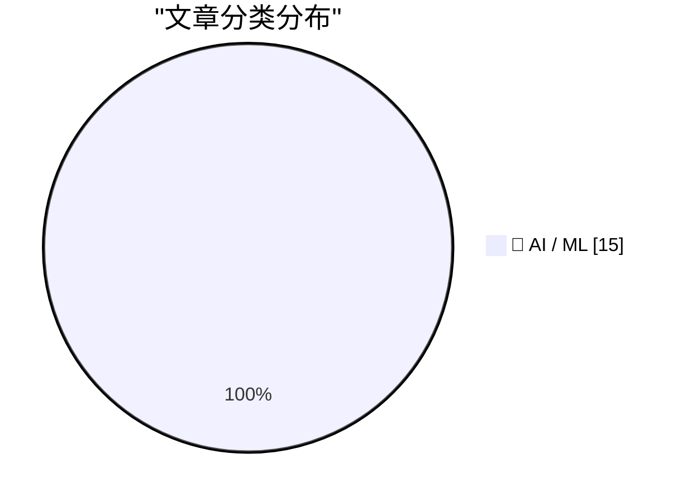
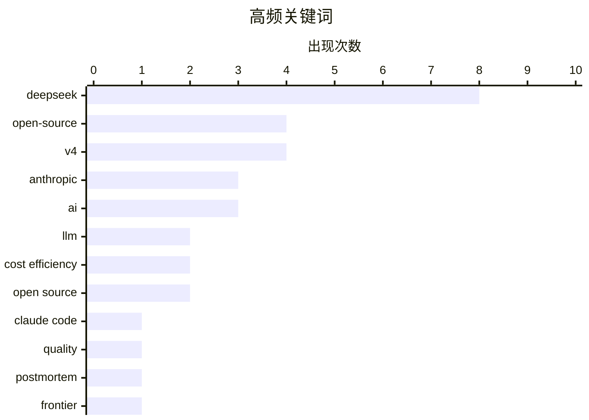

# 📰 AI 资讯每日精选 — 2026-04-25

> 汇聚 140+ 技术博客、X/Twitter、Hacker News、Reddit、Product Hunt、
> Lobste.rs、ClawFeed 日报及 GitHub Trending，经 AI 评分筛选。
>
> **本期内容**：🏆 今日必读 · 🌐 ClawFeed 日报 · 🔥 GitHub Trending · 📂 分类精选 · 🎨 设计与生成式 AI · 📊 数据概览

## 📝 今日看点

今日技术圈的核心焦点是DeepSeek V4系列的发布，其以百万token上下文和极低API定价，在性能逼近前沿的同时，对OpenAI、Anthropic等厂商形成了强烈的价格冲击。与此同时，Anthropic承认其Claude Code工具链存在质量缺陷，而OpenAI的GPT-5.5虽在基准测试中登顶，却面临涨价与幻觉问题，凸显出当前AI竞争正从单纯性能比拼转向成本与可靠性的综合博弈。此外，谷歌计划向Anthropic投资高达400亿美元，以及一篇关于深度学习理论正在形成的观点论文，共同预示着行业在资本与科学理论层面正进入更深层次的构建阶段。

---

## 🏆 今日必读

🥇 **关于近期 Claude Code 质量报告的更新**

[An update on recent Claude Code quality reports](https://simonwillison.net/2026/Apr/24/recent-claude-code-quality-reports/#atom-everything) — simonwillison.net · 22 小时前 · 🤖 AI / ML

> Anthropic 发布事后分析报告，承认过去两个月大量用户反馈 Claude Code 质量下降的问题确实存在。问题根源并非模型本身，而是 Claude Code 工具链中的三个独立缺陷，这些缺陷导致了复杂但实质性的影响。报告详细说明了这些问题的具体表现和修复措施。

💡 **为什么值得读**: 官方对用户反馈的正式回应和根因分析，对于依赖 Claude Code 的开发者具有直接参考价值。

🏷️ Claude Code, quality, postmortem, Anthropic

🥈 **DeepSeek V4 发布**

[DeepSeek v4](https://api-docs.deepseek.com/) — Hacker News Best · 21 小时前 · 🤖 AI / ML

> DeepSeek 发布了备受期待的 V4 系列首批两个预览模型：DeepSeek-V4-Pro 和 DeepSeek-V4-Flash。两个模型均为百万 token 上下文的混合专家（MoE）架构。该消息在 Hacker News 上获得 1780 分和 1387 条评论，引发社区高度关注。

💡 **为什么值得读**: AI 社区最热门话题之一，直接了解 DeepSeek 最新模型的核心规格和社区反响。

🏷️ DeepSeek, LLM, open-source, AI

🥉 **DeepSeek V4——接近前沿，价格仅为一小部分**

[DeepSeek V4 - almost on the frontier, a fraction of the price](https://simonwillison.net/2026/Apr/24/deepseek-v4/#atom-everything) — simonwillison.net · 18 小时前 · 🤖 AI / ML

> 中国 AI 实验室 DeepSeek 继去年 12 月发布 V3.2 后，推出了 V4 系列的两个预览模型：DeepSeek-V4-Pro 和 DeepSeek-V4-Flash。两个模型均采用百万 token 上下文的混合专家（MoE）架构，性能接近前沿水平，但价格远低于竞争对手。

💡 **为什么值得读**: 快速了解 DeepSeek V4 的定位、架构和性价比优势，适合关注模型选型的读者。

🏷️ DeepSeek, V4, AI, frontier

4️⃣ **被埋没的重点：DeepSeek V4 Flash 官方 API 价格在同级别模型中极其低廉**

[Buried lede: Deepseek v4 Flash is incredibly inexpensive from the official API for its weight category](https://www.reddit.com/r/LocalLLaMA/comments/1su5gj5/buried_lede_deepseek_v4_flash_is_incredibly/) — r/LocalLLaMA · 19 小时前 · 🤖 AI / ML

> Reddit 用户指出，DeepSeek V4 Flash 的官方 API 定价在其权重类别中极具竞争力。该帖子附有价格对比截图，强调这一关键信息在众多报道中被忽视。

💡 **为什么值得读**: 直接点出 DeepSeek V4 Flash 的核心卖点——极低的价格，对于预算敏感的开发者是重要参考。

🏷️ DeepSeek, V4 Flash, API pricing, cost efficiency

5️⃣ **当智能体 AI 推动竞争对手涨价和限制用量时，DeepSeek 以近乎免费的价格推出足够好的模型**

[As agentic AI pushes rivals to raise prices and cap usage, Deepseek ships a good-enough model for almost nothing](https://the-decoder.com/as-agentic-ai-pushes-rivals-to-raise-prices-and-cap-usage-deepseek-ships-a-good-enough-model-for-almost-nothing/) — The Decoder · 15 小时前 · 🤖 AI / ML

> DeepSeek 发布 V4-Pro 和 V4-Flash，参数规模高达 1.6 万亿，上下文窗口达百万 token。定价远低于 OpenAI、Google 和 Anthropic。随附的技术论文还揭示了训练数据、蒸馏和硬件细节。

💡 **为什么值得读**: 从行业竞争格局角度分析 DeepSeek 的战略意义，适合关注 AI 市场动态的读者。

🏷️ Deepseek, V4-Pro, open source, cost efficiency

---

## 🌐 ClawFeed 日报精选

> 来源：[ClawFeed](https://clawfeed.kevinhe.io) — AI 驱动的多源新闻聚合

### 🔥 今日头条

1. **OpenAI 把 Codex 从 coding tool 推向全工作流 agent 平台**
   今天最强主线就是 OpenAI 连续强化 Codex，新增 computer use、浏览器、image generation、memory、SSH devbox、并行 agents 和更多插件，目标已经不是“帮你写代码”，而是抢开发者与知识工作者的工作台入口。

2. **GPT-Rosalind 发布，frontier model 开始更明确切入生命科学**
   OpenAI 同步推出面向生命科学研究的 GPT-Rosalind，直接把能力包装到药物发现、基因组学、实验规划和转化医学流程，说明高价值垂直场景会越来越成为大模型产品化主战场。

3. **Claude Opus 4.7 刷新 agent 竞争强度**
   Anthropic 今天在社媒侧最强的产品信号是 Claude Opus 4.7，重点强调更稳的长任务执行、指令跟随和交付前自检。市场关注点继续从“聊天更像人”转向“能不能稳定干完复杂任务”。

4. **AI 安全和 cyber defense 持续升温**
   OpenAI 扩大 Trusted Access for Cyber，并开放更高信任级别团队申请 GPT-5.4-Cyber。Anthropic 则继续推进 Project Glasswing，把 Claude 往关键软件安全和基础设施防护场景里打，安全赛道已经明显进入平台级竞争。

5. **多模态 agent 和 world model 继续冒头**
   Google DeepMind 把 Gemini Robotics 接到 Spot 上，HeyGen 开源 HyperFrames，腾讯 HY-World-2.0 也被持续讨论。除了 coding agent，视频编辑、机器人执行、3D world generation 都在变成新一轮 agent 入口。

---

## 🔥 GitHub Trending

> 今日热门开源项目（全语言 + Python）

| # | 项目 | 描述 | ⭐ 总星 | 📈 今日 | 语言 |
|---|------|------|---------|---------|------|
| 1 | [huggingface/ml-intern](https://github.com/huggingface/ml-intern) 🤖 | 🤗 ml-intern: an open-source ML engineer that reads paper... | 5.3k | +2985 | Python |
| 2 | [Alishahryar1/free-claude-code](https://github.com/Alishahryar1/free-claude-code) 🤖 | Use claude-code for free in the terminal, VSCode extensio... | 8.8k | +2638 | Python |
| 3 | [Z4nzu/hackingtool](https://github.com/Z4nzu/hackingtool) | ALL IN ONE Hacking Tool For Hackers | 62.3k | +1378 | Python |
| 4 | [codecrafters-io/build-your-own-x](https://github.com/codecrafters-io/build-your-own-x) | Master programming by recreating your favorite technologi... | 494.7k | +991 | Markdown |
| 5 | [Anil-matcha/Open-Generative-AI](https://github.com/Anil-matcha/Open-Generative-AI) 🤖 | Uncensored, open-source alternative to Higgsfield AI, Fre... | 7.7k | +842 | JavaScript |
| 6 | [zilliztech/claude-context](https://github.com/zilliztech/claude-context) 🤖 | Code search MCP for Claude Code. Make entire codebase the... | 9.0k | +706 | TypeScript |
| 7 | [open-metadata/OpenMetadata](https://github.com/open-metadata/OpenMetadata) | OpenMetadata is a unified metadata platform for data disc... | 13.3k | +530 | TypeScript |
| 8 | [shiyu-coder/Kronos](https://github.com/shiyu-coder/Kronos) | Kronos: A Foundation Model for the Language of Financial ... | 21.3k | +451 | Python |
| 9 | [AIDC-AI/Pixelle-Video](https://github.com/AIDC-AI/Pixelle-Video) 🤖 | 🚀 AI 全自动短视频引擎 | AI Fully Automated Short Video Engine | 6.6k | +352 | Python |
| 10 | [dani-garcia/vaultwarden](https://github.com/dani-garcia/vaultwarden) | Unofficial Bitwarden compatible server written in Rust, f... | 59.2k | +268 | Rust |
| 11 | [Tracer-Cloud/opensre](https://github.com/Tracer-Cloud/opensre) 🤖 | Build your own AI SRE agents. The open source toolkit for... | 2.9k | +247 | Python |
| 12 | [unslothai/unsloth](https://github.com/unslothai/unsloth) 🤖 | Web UI for training and running open models like Gemma 4,... | 62.9k | +207 | Python |
| 13 | [Shubhamsaboo/awesome-llm-apps](https://github.com/Shubhamsaboo/awesome-llm-apps) 🤖 | 100+ AI Agent & RAG apps you can actually run — clone, cu... | 107.3k | +183 | Python |
| 14 | [ZhuLinsen/daily_stock_analysis](https://github.com/ZhuLinsen/daily_stock_analysis) 🤖 | LLM驱动的 A/H/美股智能分析器：多数据源行情 + 实时新闻 + LLM决策仪表盘 + 多渠道推送，零成本定时... | 31.3k | +173 | Python |
| 15 | [521xueweihan/HelloGitHub](https://github.com/521xueweihan/HelloGitHub) | 分享 GitHub 上有趣、入门级的开源项目。Share interesting, entry-level ope... | 152.9k | +172 | Python |

---

## 🤖 AI / ML

### 1. 关于近期 Claude Code 质量报告的更新

[An update on recent Claude Code quality reports](https://simonwillison.net/2026/Apr/24/recent-claude-code-quality-reports/#atom-everything) — **simonwillison.net** · 22 小时前 · ⭐ 28/30

> Anthropic 发布事后分析报告，承认过去两个月大量用户反馈 Claude Code 质量下降的问题确实存在。问题根源并非模型本身，而是 Claude Code 工具链中的三个独立缺陷，这些缺陷导致了复杂但实质性的影响。报告详细说明了这些问题的具体表现和修复措施。

🏷️ Claude Code, quality, postmortem, Anthropic

---

### 2. DeepSeek V4 发布

[DeepSeek v4](https://api-docs.deepseek.com/) — **Hacker News Best** · 21 小时前 · ⭐ 28/30

> DeepSeek 发布了备受期待的 V4 系列首批两个预览模型：DeepSeek-V4-Pro 和 DeepSeek-V4-Flash。两个模型均为百万 token 上下文的混合专家（MoE）架构。该消息在 Hacker News 上获得 1780 分和 1387 条评论，引发社区高度关注。

🏷️ DeepSeek, LLM, open-source, AI

---

### 3. DeepSeek V4——接近前沿，价格仅为一小部分

[DeepSeek V4 - almost on the frontier, a fraction of the price](https://simonwillison.net/2026/Apr/24/deepseek-v4/#atom-everything) — **simonwillison.net** · 18 小时前 · ⭐ 27/30

> 中国 AI 实验室 DeepSeek 继去年 12 月发布 V3.2 后，推出了 V4 系列的两个预览模型：DeepSeek-V4-Pro 和 DeepSeek-V4-Flash。两个模型均采用百万 token 上下文的混合专家（MoE）架构，性能接近前沿水平，但价格远低于竞争对手。

🏷️ DeepSeek, V4, AI, frontier

---

### 4. 被埋没的重点：DeepSeek V4 Flash 官方 API 价格在同级别模型中极其低廉

[Buried lede: Deepseek v4 Flash is incredibly inexpensive from the official API for its weight category](https://www.reddit.com/r/LocalLLaMA/comments/1su5gj5/buried_lede_deepseek_v4_flash_is_incredibly/) — **r/LocalLLaMA** · 19 小时前 · ⭐ 27/30

> Reddit 用户指出，DeepSeek V4 Flash 的官方 API 定价在其权重类别中极具竞争力。该帖子附有价格对比截图，强调这一关键信息在众多报道中被忽视。

🏷️ DeepSeek, V4 Flash, API pricing, cost efficiency

---

### 5. 当智能体 AI 推动竞争对手涨价和限制用量时，DeepSeek 以近乎免费的价格推出足够好的模型

[As agentic AI pushes rivals to raise prices and cap usage, Deepseek ships a good-enough model for almost nothing](https://the-decoder.com/as-agentic-ai-pushes-rivals-to-raise-prices-and-cap-usage-deepseek-ships-a-good-enough-model-for-almost-nothing/) — **The Decoder** · 15 小时前 · ⭐ 26/30

> DeepSeek 发布 V4-Pro 和 V4-Flash，参数规模高达 1.6 万亿，上下文窗口达百万 token。定价远低于 OpenAI、Google 和 Anthropic。随附的技术论文还揭示了训练数据、蒸馏和硬件细节。

🏷️ Deepseek, V4-Pro, open source, cost efficiency

---

### 6. 深度学习将会有科学理论

[There Will Be a Scientific Theory of Deep Learning [R]](https://www.reddit.com/r/MachineLearning/comments/1sun588/there_will_be_a_scientific_theory_of_deep/) — **r/MachineLearning** · 6 小时前 · ⭐ 26/30

> 一篇由 14 位作者共同撰写的观点论文，认为深度学习理论正在形成。论文汇集了近期研究中的五条证据线，描绘了这门新兴科学的轮廓。作者希望激发对大型学习系统为何以及如何工作的更科学研究。

🏷️ deep learning, theory, scientific, perspective

---

### 7. DeepSeek V4 Pro 已发布

[DeepSeek V4 Pro is out](https://www.reddit.com/r/singularity/comments/1su3l61/deepseek_v4_pro_is_out/) — **r/singularity** · 21 小时前 · ⭐ 26/30

> Reddit r/singularity 社区用户分享 DeepSeek V4 Pro 发布的消息，链接指向 Hugging Face 模型页面。

🏷️ DeepSeek, V4 Pro, release, open-source

---

### 8. DeepSeek-V4 发布：开源推动更便宜、更长上下文的 AI

[DeepSeek-V4 Drops: Open-Source Push Toward Cheaper, Long-Context AI.](https://www.reddit.com/r/singularity/comments/1su6zki/deepseekv4_drops_opensource_push_toward_cheaper/) — **r/singularity** · 18 小时前 · ⭐ 26/30

> Reddit r/singularity 社区讨论 DeepSeek V4 的发布，强调其开源策略推动更便宜、更长上下文的 AI 发展。

🏷️ DeepSeek, V4, open-source, long-context

---

### 9. GPT-5.5 在基准测试中登顶，但仍频繁出现幻觉，API 价格上涨 20%

[GPT-5.5 tops benchmarks but still hallucinates frequently and costs 20 percent more over the API](https://the-decoder.com/gpt-5-5-tops-benchmarks-but-still-hallucinates-frequently-and-costs-20-percent-more-over-the-api/) — **The Decoder** · 8 小时前 · ⭐ 25/30

> GPT-5.5 将 OpenAI 推回 AI 基准测试榜首，但 API 价格上涨了 20%，且仍存在频繁的幻觉问题。文章认为它仍然是专有模型中性价比最高的选择。

🏷️ GPT-5.5, benchmarks, hallucination, pricing

---

### 10. 谷歌计划向 Anthropic 投资高达 400 亿美元

[Google plans to invest up to $40B in Anthropic](https://www.bloomberg.com/news/articles/2026-04-24/google-plans-to-invest-up-to-40-billion-in-anthropic) — **Hacker News Best** · 8 小时前 · ⭐ 25/30

> 据 Bloomberg 报道，谷歌计划向 AI 公司 Anthropic 投资高达 400 亿美元。该消息在 Hacker News 上获得 243 分和 302 条评论。

🏷️ Google, Anthropic, investment, AI

---

### 11. Show HN: How LLMs Work – Interactive visual guide based on Karpathy's lecture

[Show HN: How LLMs Work – Interactive visual guide based on Karpathy's lecture](https://ynarwal.github.io/how-llms-work/) — **Hacker News Best** · 17 小时前 · ⭐ 25/30

> All content is based on Andrej Karpathy's "Intro to Large Language Models" lecture (youtube.com/watch?v=7xTGNNLPyMI). I downloaded the transcript and used Claude Code to generate the entire interactiv

🏷️ LLM, visual guide, Karpathy, education

---

### 12. DharmaOCR: Open-Source Specialized SLM (3B) + Cost–Performance Benchmark against LLMs and other open-sourced models [R]

[DharmaOCR: Open-Source Specialized SLM (3B) + Cost–Performance Benchmark against LLMs and other open-sourced models [R]](https://www.reddit.com/r/MachineLearning/comments/1sun6wt/dharmaocr_opensource_specialized_slm_3b/) — **r/MachineLearning** · 6 小时前 · ⭐ 25/30

> <!-- SC_OFF --><div class="md"><p>Hey everyone, we just open-sourced DharmaOCR on Hugging Face. Models and datasets are all public, free to use and experiment with.</p> <p>We also published the paper 

🏷️ OCR, SLM, open-source, benchmark

---

### 13. Anthropic admits to have made hosted models more stupid, proving the importance of open weight, local models

[Anthropic admits to have made hosted models more stupid, proving the importance of open weight, local models](https://www.reddit.com/r/LocalLLaMA/comments/1suef7t/anthropic_admits_to_have_made_hosted_models_more/) — **r/LocalLLaMA** · 11 小时前 · ⭐ 25/30

> <table> <tr><td> <a href="https://www.reddit.com/r/LocalLLaMA/comments/1suef7t/anthropic_admits_to_have_made_hosted_models_more/">  <!-- SC_OFF --><div class="md"><p><a href="https://huggingface.co/collections/deepseek-ai/deepseek-v4">https://huggingface.co/collections/deepseek-ai/deepseek-v4</a></p> </div><!-- SC_ON -->   submitt

🏷️ DeepSeek, V4, HuggingFace, model release

---

### 15. DeepSeek-v4 has a comical 384K max output capability

[DeepSeek-v4 has a comical 384K max output capability](https://www.reddit.com/r/LocalLLaMA/comments/1su9iio/deepseekv4_has_a_comical_384k_max_output/) — **r/LocalLLaMA** · 15 小时前 · ⭐ 25/30

> <table> <tr><td> <a href="https://www.reddit.com/r/LocalLLaMA/comments/1su9iio/deepseekv4_has_a_comical_384k_max_output/">  Deno AI Studio提供Windows桌面启动器，让用户在ComfyUI之前快速测试最新AI模型。

### 🖼️ 生成式图片

- **[Comfy获3000万美元融资，打造最佳开源创意AI工具](https://www.reddit.com/r/StableDiffusion/comments/1sumuc3/comfy_raises_30m_to_continue_building_the_best/)** — r/StableDiffusion · 6 小时前
  > Comfy宣布完成3000万美元融资，致力于在开源领域构建最强大的创意AI工具。

- **[Comfy组织融资公告AMA！下午3点PST直播](https://www.reddit.com/r/comfyui/comments/1sumsoh/comfy_org_funding_announcement_ama_live_at_3pm_pst/)** — r/comfyui · 6 小时前
  > Comfy团队为庆祝融资消息，将在Discord举办Reddit AMA直播，回答社区问题。

- **[Klein 9B蒸馏模型与五款云端API模型对比评测](https://www.reddit.com/r/StableDiffusion/comments/1su1mst/klein_9b_distilled_vs_five_different_cloud_api/)** — r/StableDiffusion · 22 小时前
  > 用户将Klein 9B蒸馏模型与五种主流云端API模型进行性能对比测试。

- **[这太疯狂了（图像生成2）](https://www.reddit.com/r/singularity/comments/1suetw1/this_is_getting_insane_image_gen_2/)** — r/singularity · 11 小时前
  > OpenAI新图像模型生成的两张图片引发社区惊叹，展示出惊人的生成效果。

- **[ComfyUI倒计时公告：新融资来了☠️☠️☠️☠️☠️](https://www.reddit.com/r/StableDiffusion/comments/1sumhs1/comfyuis_countdown_announcment_new_funding/)** — r/StableDiffusion · 6 小时前
  > ComfyUI发布神秘倒计时，暗示即将公布新一轮融资消息。

- **[ComfyUI预告“大动作”：开源创意AI即将迎来重大更新](https://www.reddit.com/r/StableDiffusion/comments/1su3c8z/comfyui_teasing_something_big_for_open_creative_ai/)** — r/StableDiffusion · 21 小时前
  > ComfyUI在社交媒体上暗示将有重大发布，引发社区对开源创意AI未来的期待。

- **[我的XY网格生成器、图像对比器和LoRA滑块节点发布](https://www.reddit.com/r/comfyui/comments/1su8rey/my_xy_grid_maker_image_comparer_and_lora_slider/)** — r/comfyui · 16 小时前
  > 作者分享自制的ComfyUI自定义节点，包括XY网格、图像对比和LoRA滑块工具。

- **[Comfy Wrapper扩展展示 / MCWW v2.1更新](https://www.reddit.com/r/StableDiffusion/comments/1su1rox/comfy_wrapper_extension_showcase_mcww_v21_update/)** — r/StableDiffusion · 22 小时前
  > Comfy Wrapper扩展迎来v2.1版本更新，带来更多功能和改进。

- **[FLUX.2 Klein身份特征迁移高级版发布](https://www.reddit.com/r/comfyui/comments/1su8cfb/flux2_klein_identity_feature_transfer_advanced/)** — r/comfyui · 17 小时前
  > FLUX.2推出Klein身份特征迁移高级功能，实现更精细的人物特征迁移控制。

- **[“大事件即将到来！”——社区反应两极分化](https://www.reddit.com/r/StableDiffusion/comments/1suu8p2/something_big_is_coming/)** — r/StableDiffusion · 1 小时前
  > ComfyUI的倒计时预告引发社区热议，部分用户认为宣传方式过于夸张。

- **[从SDXL ComfyUI工作流升级：哪些新模型完全支持ControlNet、IPAdapter和Inpainting？](https://www.reddit.com/r/StableDiffusion/comments/1sulw1o/upgrading_from_sdxl_comfyui_workflow_which_newer/)** — r/StableDiffusion · 7 小时前
  > 用户寻求从SDXL升级到新模型，希望找到完全兼容ControlNet、IPAdapter和Inpainting的解决方案。

### 🎬 生成式视频

- **[LTX发布HDR IC-LoRA测试版：支持EXR输出，专为专业制作管线设计](https://www.reddit.com/r/comfyui/comments/1su1n2b/ltx_just_dropped_an_hdr_iclora_beta_exr_output/)** — r/comfyui · 22 小时前
  > 开源视频领域迎来专业级工具，LTX-2.3推出HDR IC-LoRA，支持EXR格式输出，面向专业调色工作流。

- **[VR-Outpaint IC-LoRA for LTX2.3正式发布](https://www.reddit.com/r/StableDiffusion/comments/1sujnm3/vroutpaint_iclora_for_ltx23_released/)** — r/StableDiffusion · 8 小时前
  > 专为LTX2.3视频模型打造的360°视频外绘LoRA，支持VR场景扩展生成。

- **[VR-Outpaint IC-LoRA for LTX2.3视频模型发布](https://www.reddit.com/r/comfyui/comments/1sujor5/vroutpaint_iclora_for_ltx23_video_model_released/)** — r/comfyui · 8 小时前
  > 面向LTX2.3视频模型的360°外绘LoRA正式上线，支持VR视频内容扩展。

---

## 📊 数据概览

| 扫描源 | 抓取文章 | 时间范围 | 精选 |
|:---:|:---:|:---:|:---:|
| 112/140 | 4773 篇 → 222 篇 | 24h | **15 篇** |

### 分类分布



### 高频关键词



<details>
<summary>📈 纯文本关键词图（终端友好）</summary>

```
deepseek        │ ████████████████████ 8
open-source     │ ██████████░░░░░░░░░░ 4
v4              │ ██████████░░░░░░░░░░ 4
anthropic       │ ████████░░░░░░░░░░░░ 3
ai              │ ████████░░░░░░░░░░░░ 3
llm             │ █████░░░░░░░░░░░░░░░ 2
cost efficiency │ █████░░░░░░░░░░░░░░░ 2
open source     │ █████░░░░░░░░░░░░░░░ 2
claude code     │ ███░░░░░░░░░░░░░░░░░ 1
quality         │ ███░░░░░░░░░░░░░░░░░ 1
```

</details>

### 🏷️ 话题标签

**deepseek**(8) · **open-source**(4) · **v4**(4) · anthropic(3) · ai(3) · llm(2) · cost efficiency(2) · open source(2) · claude code(1) · quality(1) · postmortem(1) · frontier(1) · v4 flash(1) · api pricing(1) · v4-pro(1) · deep learning(1) · theory(1) · scientific(1) · perspective(1) · v4 pro(1)

---

*生成于 2026-04-25 00:13 | 汇聚 140 个技术博客、X/Twitter、Hacker News、Reddit、Product Hunt、Lobste.rs、ClawFeed 日报及 GitHub Trending，经 AI 评分筛选出 Top 15 精华内容*
