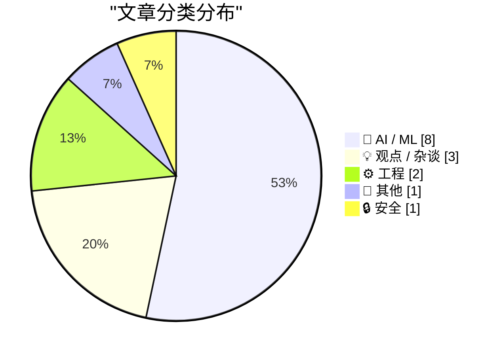
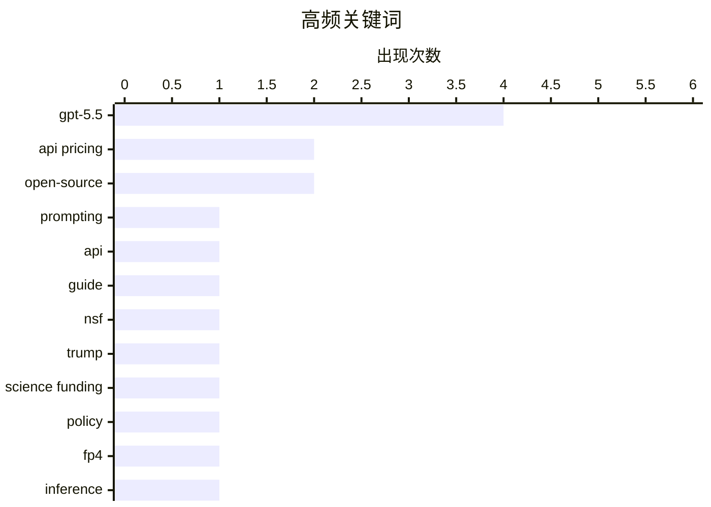

# 📰 AI 资讯每日精选 — 2026-04-26

> 汇聚 140+ 技术博客、X/Twitter、Hacker News、Reddit、Product Hunt、
> Lobste.rs、ClawFeed 日报及 GitHub Trending，经 AI 评分筛选。
>
> **本期内容**：🏆 今日必读 · 🌐 ClawFeed 日报 · 🔥 GitHub Trending · 📂 分类精选 · 🎨 设计与生成式 AI · 📊 数据概览

## 📝 今日看点

今日技术圈聚焦两大主线：AI 领域迎来 GPT-5.5 的全面升级，虽在基准测试中重回榜首，但幻觉问题未解、API 涨价 20%，同时 OpenAI 确认编程模型已与主模型合并，并发布新提示词指南；另一方面，AI 对就业市场的冲击有了量化证据——美联储研究显示程序员岗位增长近乎腰斩，公众对 AI 的敌意也在升温。此外，开源生态与监管博弈加剧：西班牙政府联手西甲封锁开源模型网站，而本地推理迎来 FP4 精度落地，Firefox 则集成 Brave 广告拦截引擎，技术自主与隐私保护成为新焦点。

---

## 🏆 今日必读

🥇 **GPT-5.5 提示词指南**

[GPT-5.5 prompting guide](https://simonwillison.net/2026/Apr/25/gpt-5-5-prompting-guide/#atom-everything) — simonwillison.net · 19 小时前 · 🤖 AI / ML

> OpenAI 发布了 GPT-5.5 的 API 及配套的提示词指南，提供了大量针对新模型的实用技巧。指南中推荐了一个巧妙的方法：对于需要长时间思考才能返回用户可见响应的应用，可以在提示词中加入特定指令来优化等待体验。文章详细介绍了如何利用 GPT-5.5 的新特性来提升输出质量和效率。

💡 **为什么值得读**: 这是官方发布的第一手提示词优化指南，能帮你立刻上手并榨干 GPT-5.5 的性能，避免用旧方法调教新模型。

🏷️ GPT-5.5, prompting, API, guide

🥈 **特朗普解雇美国国家科学基金会全部 24 名监督委员会成员**

[Trump fires all 24 members of the U.S. National Science Foundation](https://www.science.org/content/article/trump-fires-nsf-s-oversight-board) — Hacker News Best · 1 小时前 · 📝 其他

> 特朗普政府解雇了美国国家科学基金会（NSF）监督委员会的全部 24 名成员。这一举动直接影响了 NSF 的治理结构和监督机制，引发了关于科研独立性和政治干预的广泛讨论。该事件在 Hacker News 上获得了 191 个点赞和 54 条评论，成为当日热门话题。

💡 **为什么值得读**: 这是对美国科研管理体系的一次重大政治干预，直接关系到未来科研经费分配和学术自由，值得所有关注科技政策的人了解。

🏷️ NSF, Trump, science funding, policy

🥉 **FP4 推理在 llama.cpp (NVFP4) 和 ik_llama.cpp (MXFP4) 中终于落地**

[FP4 inference in llama.cpp (NVFP4) and ik_llama.cpp (MXFP4) landed - Finally](https://www.reddit.com/r/LocalLLaMA/comments/1svfjyv/fp4_inference_in_llamacpp_nvfp4_and_ik_llamacpp/) — r/LocalLLaMA · 8 小时前 · 🤖 AI / ML

> llama.cpp 和 ik_llama.cpp 项目终于实现了 FP4 精度推理，分别支持 NVFP4 和 MXFP4 格式。这意味着在本地运行大模型时，可以进一步降低显存占用和推理成本，同时保持可接受的模型质量。这是本地大模型推理在量化技术上的一次重要突破，让消费级显卡运行更大模型成为可能。

💡 **为什么值得读**: FP4 量化是本地大模型部署的下一个关键里程碑，这篇文章标志着它从理论走向了可用的代码实现，对自建 AI 的用户至关重要。

🏷️ FP4, inference, llama.cpp, quantization

4️⃣ **美联储研究：ChatGPT 发布后美国程序员就业增长近乎腰斩**

[US programmer job growth nearly halved since ChatGPT launched, Fed study finds](https://the-decoder.com/us-programmer-job-growth-nearly-halved-since-chatgpt-launched-fed-study-finds/) — The Decoder · 11 小时前 · 💡 观点 / 杂谈

> 美联储的一项新研究提供了量化证据，显示生成式 AI 已显著影响美国程序员的就业市场。自 ChatGPT 发布以来，程序员岗位的增长率几乎减半。该研究将程序员列为受生成式 AI 影响最大的职业群体之一，其日常工作方式已发生根本性改变。

💡 **为什么值得读**: 这是来自美联储的权威数据，而非坊间传闻，为“AI 抢走程序员工作”这一争论提供了确凿的统计证据，对职业规划有直接参考价值。

🏷️ programmer, job market, generative AI, employment

5️⃣ **Firefox 已集成 Brave 的广告拦截引擎**

[Firefox Has Integrated Brave's Adblock Engine](https://itsfoss.com/news/firefox-ships-brave-adblock-engine/) — Hacker News Best · 22 小时前 · ⚙️ 工程

> Firefox 浏览器正式集成了 Brave 开发的广告拦截引擎，大幅提升了其内置的隐私保护能力。这一整合意味着 Firefox 用户无需安装第三方扩展即可获得更高效的广告和跟踪器拦截体验。该新闻在 Hacker News 上获得了 373 个点赞和 220 条评论，反响热烈。

💡 **为什么值得读**: 两大浏览器在隐私保护上的强强联合，直接提升了数亿用户的浏览体验，是浏览器竞争格局中的一个重要事件。

🏷️ Firefox, adblock, Brave, privacy

---

## 🌐 ClawFeed 日报精选

> 来源：[ClawFeed](https://clawfeed.kevinhe.io) — AI 驱动的多源新闻聚合

### 🔥 今日头条

1. **OpenAI 把 Codex 从 coding tool 推向全工作流 agent 平台**
   今天最强主线就是 OpenAI 连续强化 Codex，新增 computer use、浏览器、image generation、memory、SSH devbox、并行 agents 和更多插件，目标已经不是“帮你写代码”，而是抢开发者与知识工作者的工作台入口。

2. **GPT-Rosalind 发布，frontier model 开始更明确切入生命科学**
   OpenAI 同步推出面向生命科学研究的 GPT-Rosalind，直接把能力包装到药物发现、基因组学、实验规划和转化医学流程，说明高价值垂直场景会越来越成为大模型产品化主战场。

3. **Claude Opus 4.7 刷新 agent 竞争强度**
   Anthropic 今天在社媒侧最强的产品信号是 Claude Opus 4.7，重点强调更稳的长任务执行、指令跟随和交付前自检。市场关注点继续从“聊天更像人”转向“能不能稳定干完复杂任务”。

4. **AI 安全和 cyber defense 持续升温**
   OpenAI 扩大 Trusted Access for Cyber，并开放更高信任级别团队申请 GPT-5.4-Cyber。Anthropic 则继续推进 Project Glasswing，把 Claude 往关键软件安全和基础设施防护场景里打，安全赛道已经明显进入平台级竞争。

5. **多模态 agent 和 world model 继续冒头**
   Google DeepMind 把 Gemini Robotics 接到 Spot 上，HeyGen 开源 HyperFrames，腾讯 HY-World-2.0 也被持续讨论。除了 coding agent，视频编辑、机器人执行、3D world generation 都在变成新一轮 agent 入口。

---

## 🔥 GitHub Trending

> 今日热门开源项目（全语言 + Python）

| # | 项目 | 描述 | ⭐ 总星 | 📈 今日 | 语言 |
|---|------|------|---------|---------|------|
| 1 | [Alishahryar1/free-claude-code](https://github.com/Alishahryar1/free-claude-code) 🤖 | Use claude-code for free in the terminal, VSCode extensio... | 11.5k | +4007 | Python |
| 2 | [codecrafters-io/build-your-own-x](https://github.com/codecrafters-io/build-your-own-x) | Master programming by recreating your favorite technologi... | 496.0k | +1432 | Markdown |
| 3 | [huggingface/ml-intern](https://github.com/huggingface/ml-intern) 🤖 | 🤗 ml-intern: an open-source ML engineer that reads paper... | 6.2k | +1240 | Python |
| 4 | [Z4nzu/hackingtool](https://github.com/Z4nzu/hackingtool) | ALL IN ONE Hacking Tool For Hackers | 63.8k | +1200 | Python |
| 5 | [mattpocock/skills](https://github.com/mattpocock/skills) 🤖 | My personal directory of skills, straight from my .claude... | 20.0k | +1139 | Shell |
| 6 | [PostHog/posthog](https://github.com/PostHog/posthog) 🤖 | 🦔 PostHog is an all-in-one developer platform for buildi... | 33.5k | +471 | Python |
| 7 | [shiyu-coder/Kronos](https://github.com/shiyu-coder/Kronos) | Kronos: A Foundation Model for the Language of Financial ... | 21.5k | +283 | Python |
| 8 | [HunxByts/GhostTrack](https://github.com/HunxByts/GhostTrack) | Useful tool to track location or mobile number | 8.8k | +273 | Python |
| 9 | [donnemartin/system-design-primer](https://github.com/donnemartin/system-design-primer) | Learn how to design large-scale systems. Prep for the sys... | 344.3k | +267 | Python |
| 10 | [luongnv89/claude-howto](https://github.com/luongnv89/claude-howto) 🤖 | A visual, example-driven guide to Claude Code — from basi... | 28.9k | +226 | Python |
| 11 | [alexzhang13/rlm](https://github.com/alexzhang13/rlm) | General plug-and-play inference library for Recursive Lan... | 3.9k | +225 | Python |
| 12 | [deepseek-ai/DeepEP](https://github.com/deepseek-ai/DeepEP) 🤖 | DeepEP: an efficient expert-parallel communication library | 9.5k | +189 | Cuda |
| 13 | [ComposioHQ/awesome-codex-skills](https://github.com/ComposioHQ/awesome-codex-skills) | A curated list of practical Codex skills for automating w... | 1.5k | +188 | Python |
| 14 | [open-webui/open-webui](https://github.com/open-webui/open-webui) 🤖 | User-friendly AI Interface (Supports Ollama, OpenAI API, ... | 134.1k | +180 | Python |
| 15 | [MemoriLabs/Memori](https://github.com/MemoriLabs/Memori) 🤖 | Memori is agent-native memory infrastructure. A LLM-agnos... | 13.9k | +124 | Python |

---

## 🤖 AI / ML

### 1. GPT-5.5 提示词指南

[GPT-5.5 prompting guide](https://simonwillison.net/2026/Apr/25/gpt-5-5-prompting-guide/#atom-everything) — **simonwillison.net** · 19 小时前 · ⭐ 27/30

> OpenAI 发布了 GPT-5.5 的 API 及配套的提示词指南，提供了大量针对新模型的实用技巧。指南中推荐了一个巧妙的方法：对于需要长时间思考才能返回用户可见响应的应用，可以在提示词中加入特定指令来优化等待体验。文章详细介绍了如何利用 GPT-5.5 的新特性来提升输出质量和效率。

🏷️ GPT-5.5, prompting, API, guide

---

### 2. FP4 推理在 llama.cpp (NVFP4) 和 ik_llama.cpp (MXFP4) 中终于落地

[FP4 inference in llama.cpp (NVFP4) and ik_llama.cpp (MXFP4) landed - Finally](https://www.reddit.com/r/LocalLLaMA/comments/1svfjyv/fp4_inference_in_llamacpp_nvfp4_and_ik_llamacpp/) — **r/LocalLLaMA** · 8 小时前 · ⭐ 27/30

> llama.cpp 和 ik_llama.cpp 项目终于实现了 FP4 精度推理，分别支持 NVFP4 和 MXFP4 格式。这意味着在本地运行大模型时，可以进一步降低显存占用和推理成本，同时保持可接受的模型质量。这是本地大模型推理在量化技术上的一次重要突破，让消费级显卡运行更大模型成为可能。

🏷️ FP4, inference, llama.cpp, quantization

---

### 3. 引用 Romain Huet：OpenAI 确认不再发布单独的 GPT-5.5-Codex 模型

[Quoting Romain Huet](https://simonwillison.net/2026/Apr/25/romain-huet/#atom-everything) — **simonwillison.net** · 12 小时前 · ⭐ 25/30

> OpenAI 产品负责人 Romain Huet 确认，自 GPT-5.4 起，Codex 编程模型已与主模型合并为单一系统。GPT-5.5 进一步强化了这一趋势，在智能编码、计算机使用等任务上表现强劲，因此 OpenAI 将不再发布单独的 GPT-5.5-Codex 模型。

🏷️ GPT-5.5, Codex, agentic coding

---

### 4. GPT-5.5 基准测试登顶，但幻觉依旧频繁，API 价格贵了 20%

[GPT-5.5 tops benchmarks but still hallucinates frequently and costs 20 percent more over the API](https://the-decoder.com/gpt-5-5-tops-benchmarks-but-still-hallucinates-frequently-and-costs-20-percent-more-over-the-api/) — **The Decoder** · 7 小时前 · ⭐ 24/30

> GPT-5.5 在多项 AI 基准测试中重回榜首，性能表现领先。然而，它仍然存在频繁的幻觉问题，且 API 价格相比前代上涨了 20%。文章认为，尽管涨价，GPT-5.5 在专有模型中依然是性价比最高的选择。

🏷️ GPT-5.5, benchmarks, hallucination, API pricing

---

### 5. Qwen3.6-27B beats much larger predecessor on most coding benchmarks

[Qwen3.6-27B beats much larger predecessor on most coding benchmarks](https://the-decoder.com/qwen3-6-27b-beats-much-larger-predecessor-on-most-coding-benchmarks/) — **The Decoder** · 11 小时前 · ⭐ 24/30

> Alibaba's new open-source model Qwen3.6-27B beats its 15-times-larger predecessor across coding benchmarks with just 27 billion parameters.
The article Qwen3.6-27B beats much larger predecessor on mos

🏷️ Qwen3.6, open-source, coding benchmarks, efficiency

---

### 6. OpenAI unveils GPT-5.5, claims a "new class of intelligence" at double the API price

[OpenAI unveils GPT-5.5, claims a "new class of intelligence" at double the API price](https://the-decoder.com/openai-unveils-gpt-5-5-claims-a-new-class-of-intelligence-at-double-the-api-price/) — **The Decoder** · 15 小时前 · ⭐ 24/30

> OpenAI has announced GPT-5.5, an agentic model designed to work through complex tasks autonomously by switching between multiple tools.
The article OpenAI unveils GPT-5.5, claims a "new class of intel

🏷️ GPT-5.5, agentic, API pricing, intelligence

---

### 7. Google pours up to $40 billion into ChatGPT rival Anthropic

[Google pours up to $40 billion into ChatGPT rival Anthropic](https://the-decoder.com/google-pours-up-to-40-billion-into-chatgpt-rival-anthropic/) — **The Decoder** · 15 小时前 · ⭐ 24/30

> Google is investing up to 40 billion dollars in Anthropic. Together with Amazon's pledge of 25 billion dollars, up to 65 billion dollars will flow into the AI company behind Claude in just a few weeks

🏷️ Google, Anthropic, investment, Claude

---

### 8. How Visual-Language-Action (VLA) Models Work [D]

[How Visual-Language-Action (VLA) Models Work [D]](https://www.reddit.com/r/MachineLearning/comments/1svhwtz/how_visuallanguageaction_vla_models_work_d/) — **r/MachineLearning** · 6 小时前 · ⭐ 24/30

> <table> <tr><td> <a href="https://www.reddit.com/r/MachineLearning/comments/1svhwtz/how_visuallanguageaction_vla_models_work_d/">  美联储的一项新研究提供了量化证据，显示生成式 AI 已显著影响美国程序员的就业市场。自 ChatGPT 发布以来，程序员岗位的增长率几乎减半。该研究将程序员列为受生成式 AI 影响最大的职业群体之一，其日常工作方式已发生根本性改变。

🏷️ programmer, job market, generative AI, employment

---

### 10. AI 行业发现公众对其充满敌意

[The AI Industry Is Discovering That the Public Hates It](https://newrepublic.com/article/209163/ai-industry-discovering-public-backlash) — **Hacker News Best** · 3 小时前 · ⭐ 25/30

> 文章指出，AI 行业正面临日益严重的公众反弹，人们普遍对 AI 的发展感到不安甚至厌恶。尽管行业巨头大力推广，但公众对隐私、就业替代和伦理问题的担忧持续升温。该话题在 Hacker News 上引发了 252 条激烈讨论，反映了社会对 AI 的复杂情绪。

🏷️ AI backlash, public opinion, trust, industry

---

### 11. I'm glad we have deepseek

[I'm glad we have deepseek](https://www.reddit.com/r/LocalLLaMA/comments/1suyu7a/im_glad_we_have_deepseek/) — **r/LocalLLaMA** · 22 小时前 · ⭐ 24/30

> <!-- SC_OFF --><div class="md"><p>other companies are slowly going away from open weight, not releasing base models, delaying open weight distribution, not releasing top models (this one I think is fa

🏷️ open-weight, DeepSeek, open-source, LLM

---

## ⚙️ 工程

### 12. Firefox 已集成 Brave 的广告拦截引擎

[Firefox Has Integrated Brave's Adblock Engine](https://itsfoss.com/news/firefox-ships-brave-adblock-engine/) — **Hacker News Best** · 22 小时前 · ⭐ 26/30

> Firefox 浏览器正式集成了 Brave 开发的广告拦截引擎，大幅提升了其内置的隐私保护能力。这一整合意味着 Firefox 用户无需安装第三方扩展即可获得更高效的广告和跟踪器拦截体验。该新闻在 Hacker News 上获得了 373 个点赞和 220 条评论，反响热烈。

🏷️ Firefox, adblock, Brave, privacy

---

### 13. Java 虚拟线程的“钉住”问题及 Java 24 中的修复

[Java Virtual Threads: The Pinning Problem and the Fix in Java 24](https://www.reddit.com/r/programming/comments/1svqsa4/java_virtual_threads_the_pinning_problem_and_the/) — **r/programming** · 1 小时前 · ⭐ 25/30

> 文章通过一个生产事故案例，揭示了 Java 21 引入的虚拟线程在同步块（synchronized）中会被“钉住”的严重问题，导致所有载体线程耗尽，应用挂起。Netflix 也遇到了完全相同的问题。文章详细分析了该问题的根源，并介绍了 Java 24 中针对此问题的修复方案。

🏷️ Java, virtual threads, pinning, Java 24

---

## 📝 其他

### 14. 特朗普解雇美国国家科学基金会全部 24 名监督委员会成员

[Trump fires all 24 members of the U.S. National Science Foundation](https://www.science.org/content/article/trump-fires-nsf-s-oversight-board) — **Hacker News Best** · 1 小时前 · ⭐ 27/30

> 特朗普政府解雇了美国国家科学基金会（NSF）监督委员会的全部 24 名成员。这一举动直接影响了 NSF 的治理结构和监督机制，引发了关于科研独立性和政治干预的广泛讨论。该事件在 Hacker News 上获得了 191 个点赞和 54 条评论，成为当日热门话题。

🏷️ NSF, Trump, science funding, policy

---

## 🔒 安全

### 15. 西班牙政府与西甲联赛联手封锁所有开源模型网站，Civitai 等无法访问

[The Spanish gov, along with LaLiga, has also blocked all open-source model websites right now, and I can't access civitai.com/civitai.red, Is there any way to bypass the block? (DNS servers are no longer working)](https://www.reddit.com/r/StableDiffusion/comments/1svebri/the_spanish_gov_along_with_laliga_has_also/) — **r/StableDiffusion** · 9 小时前 · ⭐ 25/30

> 西班牙政府联合西甲联赛（LaLiga）对 Civitai 等开源模型网站实施了全面封锁，DNS 解析已失效。用户正在寻求绕过封锁的方法，但常规的 DNS 更换已不起作用。这一事件引发了关于版权执法与开源社区访问自由的激烈讨论。

🏷️ censorship, DNS, open source, bypass

---

## 🎨 Design & Generative AI

### 🖼️ 生成式图片

- **[ComfyUI 命令面板 v1.0 发布](https://www.reddit.com/r/comfyui/comments/1sviinv/comfyui_command_palette_v10/)** — r/comfyui · 6 小时前
  > ✨ ComfyUI Command Palette v1.0 ✨

- **[Wan I2V v2.0 工作流全面升级](https://www.reddit.com/r/StableDiffusion/comments/1sv0kze/all_in_wan_i2v_v20_workflow_i2v_f2lf_svi_with/)** — r/StableDiffusion · 21 小时前
  > All in Wan I2V v2.0 workflow - I2V, F2LF, SVI with optional F2LF, NAG, LTX for V2A, Pulse of Motion, Lora Optimizer, CFG-Ctrl, 4 modes and more

- **[Anima 实验性 ControlNet-LLLite 实现](https://www.reddit.com/r/comfyui/comments/1svjae6/anima_experimental_controlnet_lllm/)** — r/comfyui · 6 小时前
  > Anima - experimental controlnet lllm

- **[单图生成可定制 2D 动画角色](https://www.reddit.com/r/comfyui/comments/1sve5id/one_image_in_2d_animated_and_customizable/)** — r/comfyui · 9 小时前
  > One image in - 2D animated and customizable character out

- **[WaTale：免费本地视觉小说引擎](https://www.reddit.com/r/StableDiffusion/comments/1svfo4q/watale_a_free_fully_local_visual_novel_engine/)** — r/StableDiffusion · 8 小时前
  > WaTale: A free, fully local visual novel engine (Powered by SD 1.5, LayerDiffuse, and ControlNet)

- **[ComfyUI 视觉风格选择器节点](https://www.reddit.com/r/StableDiffusion/comments/1svomye/visual_style_selector_node_for_comfyui_with_a/)** — r/StableDiffusion · 2 小时前
  > Visual Style Selector node for ComfyUI with a thumbnail gallery, favorites, and iterator mode

- **[ComfyUI 命令面板 v1.0 发布](https://www.reddit.com/r/StableDiffusion/comments/1svillr/comfyui_command_palette_v10/)** — r/StableDiffusion · 6 小时前
  > ComfyUI Command Palette v1.0 ✨

- **[ComfyUI 模型下载管理工具](https://www.reddit.com/r/StableDiffusion/comments/1svp98m/tired_of_the_manual_download_move_dance_i_built_a/)** — r/StableDiffusion · 2 小时前
  > Tired of the manual "Download & Move" dance? I built a tool to automate ComfyUI Model Management!

- **[为何没有高质量的地点 LORA？](https://www.reddit.com/r/StableDiffusion/comments/1svmvmm/why_are_there_really_no_location_loras/)** — r/StableDiffusion · 3 小时前
  > Why are there really no Location LORAs?

- **[社区工作流托管网站建设](https://www.reddit.com/r/comfyui/comments/1svr4pr/website_to_uploaded_workflows/)** — r/comfyui · 52 分钟前
  > Website to uploaded workflows

- **[ComfyUI 官方 Docker 镜像缺失](https://www.reddit.com/r/comfyui/comments/1sv4tj3/any_established_docker_container_image/)** — r/comfyui · 17 小时前
  > Any established Docker container image?

- **[ComfyUI 更新后 OOM 错误解决](https://www.reddit.com/r/comfyui/comments/1svix8a/oom_errors_after_comfy_update_and_how_im_getting/)** — r/comfyui · 6 小时前
  > OOM Errors after Comfy Update - and how I'm getting around them (16GB 5060)

- **[RunningHub API 用于生产应用？](https://www.reddit.com/r/comfyui/comments/1svpaxg/runninghub_api_for_production_app/)** — r/comfyui · 2 小时前
  > RunningHub API for production APP ?

- **[多镜头一致性生成探索](https://www.reddit.com/r/StableDiffusion/comments/1sv2iav/multishot_consistency/)** — r/StableDiffusion · 19 小时前
  > Multi-shot Consistency

### 🎬 生成式视频

- **[Runexx Movie Maker 工作流测试](https://www.reddit.com/r/StableDiffusion/comments/1sv8geh/test_of_runexx_movie_maker_comfyui_workflow_with/)** — r/StableDiffusion · 13 小时前
  > Test of Runexx Movie Maker Comfyui workflow with Prompt Relay Encode node integration

---

## 📊 数据概览

| 扫描源 | 抓取文章 | 时间范围 | 精选 |
|:---:|:---:|:---:|:---:|
| 110/140 | 4728 篇 → 186 篇 | 24h | **15 篇** |

### 分类分布



### 高频关键词



<details>
<summary>📈 纯文本关键词图（终端友好）</summary>

```
gpt-5.5         │ ████████████████████ 4
api pricing     │ ██████████░░░░░░░░░░ 2
open-source     │ ██████████░░░░░░░░░░ 2
prompting       │ █████░░░░░░░░░░░░░░░ 1
api             │ █████░░░░░░░░░░░░░░░ 1
guide           │ █████░░░░░░░░░░░░░░░ 1
nsf             │ █████░░░░░░░░░░░░░░░ 1
trump           │ █████░░░░░░░░░░░░░░░ 1
science funding │ █████░░░░░░░░░░░░░░░ 1
policy          │ █████░░░░░░░░░░░░░░░ 1
```

</details>

### 🏷️ 话题标签

**gpt-5.5**(4) · **api pricing**(2) · **open-source**(2) · prompting(1) · api(1) · guide(1) · nsf(1) · trump(1) · science funding(1) · policy(1) · fp4(1) · inference(1) · llama.cpp(1) · quantization(1) · programmer(1) · job market(1) · generative ai(1) · employment(1) · firefox(1) · adblock(1)

---

*生成于 2026-04-26 00:12 | 汇聚 140 个技术博客、X/Twitter、Hacker News、Reddit、Product Hunt、Lobste.rs、ClawFeed 日报及 GitHub Trending，经 AI 评分筛选出 Top 15 精华内容*
