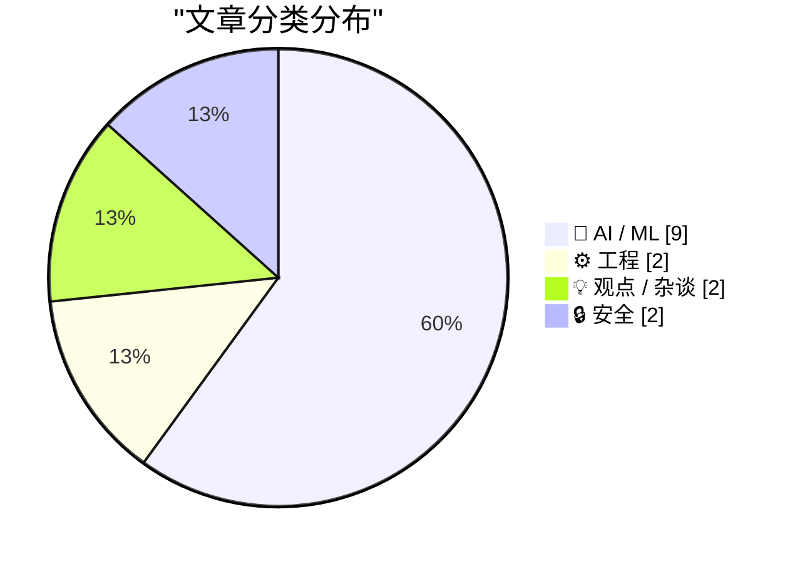
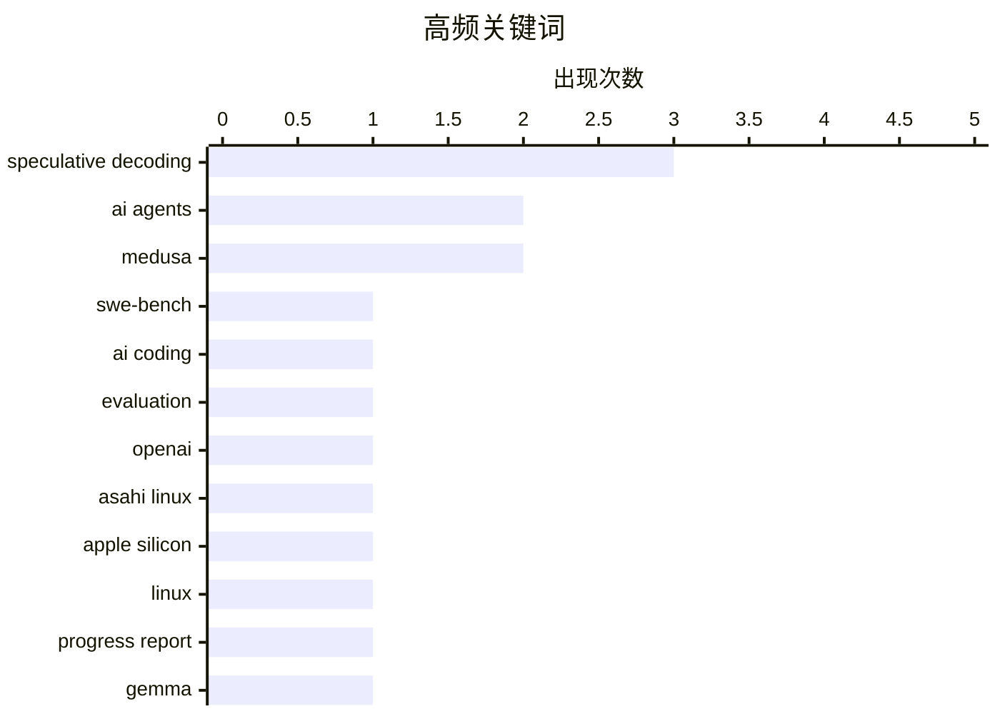

# 📰 AI 资讯每日精选 — 2026-04-27

> 汇聚 140+ 技术博客、X/Twitter、Hacker News、Reddit、Product Hunt、
> Lobste.rs、ClawFeed 日报及 GitHub Trending，经 AI 评分筛选。
>
> **本期内容**：🏆 今日必读 · 🌐 ClawFeed 日报 · 🔥 GitHub Trending · 📂 分类精选 · 🎨 设计与生成式 AI · 📊 数据概览

## 📝 今日看点

今日技术圈聚焦两大趋势：AI评估基准的信任危机与模型推理效率的突破。OpenAI宣布停用SWE-bench Verified，指出其因数据过拟合已无法衡量前沿编码能力，引发行业对基准有效性的反思；与此同时，投机解码技术成为热点，社区通过Gemma-4模型组合实现120-200 tok/s的特定任务加速，并开源了多种解码方法的实现。此外，关于AI角色的讨论持续升温，研究者与评论者共同呼吁：AI应作为“思考伙伴”扩展软件工程的内涵，而非取代人类判断或沦为答案机器。

---

## 🏆 今日必读

🥇 **SWE-bench Verified 不再衡量前沿编码能力**

[SWE-bench Verified no longer measures frontier coding capabilities](https://openai.com/index/why-we-no-longer-evaluate-swe-bench-verified/) — Hacker News Best · 10 小时前 · 🤖 AI / ML

> OpenAI 宣布停止使用 SWE-bench Verified 作为其前沿编码模型的评估基准。核心原因是该基准已严重过拟合：模型在训练数据中见过大量类似问题，导致分数虚高，无法反映真实编码能力。OpenAI 发现，模型在该基准上的表现与在更困难、未见过的编码任务上的表现相关性极低。因此，继续使用该基准会误导对模型能力的判断。OpenAI 主张行业需要更动态、更难、更能抵抗数据污染的评估方法。

💡 **为什么值得读**: 来自 OpenAI 的一手决策声明，揭示了当前最流行的编码基准 SWE-bench 已失效，对评估 AI 编码能力的研究者和工程师有直接参考价值。

🏷️ SWE-bench, AI coding, evaluation, OpenAI

🥈 **Asahi Linux 进展报告 7.0**

[Asahi Linux Progress Linux 7.0](https://asahilinux.org/2026/04/progress-report-7-0/) — Hacker News Best · 13 小时前 · ⚙️ 工程

> Asahi Linux 项目发布了第 7.0 版进展报告，标志着在 Apple Silicon Mac 上运行 Linux 的重大里程碑。该版本实现了对 M1、M2 及 M3 系列芯片的完整 GPU 驱动支持，包括 OpenGL 4.6 和 Vulkan 1.3 的初步支持。此外，报告还涵盖了电源管理、CPU 频率调节、以及休眠/唤醒功能的显著改进。项目团队强调，这已从“能否运行”进入“日常可用”阶段，但仍存在一些已知问题，如特定硬件加速编解码器支持。

💡 **为什么值得读**: 对于想在 Apple Silicon Mac 上使用 Linux 的用户来说，这是最权威的进展总结，详细说明了当前的功能完整度和已知限制。

🏷️ Asahi Linux, Apple Silicon, Linux, progress report

🥉 **使用 Gemma-4-31B + Gemma-4-E2B 的投机解码，特定任务输出速度可达 120-200 tok/s**

[Speculative decoding with Gemma-4-31B + Gemma-4-E2B enables 120 - 200 tok/s output speed for specific tasks](https://www.reddit.com/r/LocalLLaMA/comments/1sw782p/speculative_decoding_with_gemma431b_gemma4e2b/) — r/LocalLLaMA · 11 小时前 · 🤖 AI / ML

> 社区用户报告，通过投机解码（Speculative Decoding）技术，将 Gemma-4-31B 作为目标模型与 Gemma-4-E2B 作为草稿模型配合使用，在特定任务上实现了 120 到 200 tokens/秒的惊人输出速度。这一速度远超单独运行 31B 模型的常规推理速度。该方案利用了 E2B 模型更小的参数量来快速生成草稿，再由 31B 模型进行验证和修正。结果展示了投机解码在降低大模型推理延迟方面的巨大潜力，尤其适用于对延迟敏感的应用场景。

💡 **为什么值得读**: 提供了具体的模型组合和实测性能数据，对于关注大模型推理加速和本地部署的开发者极具实践参考价值。

🏷️ speculative decoding, Gemma, throughput, local inference

4️⃣ **研究人员认为，AI 代理并非取代软件工程，而是将其扩展到代码之外**

[AI agents aren't replacing software engineering but expanding it far beyond code, researchers argue](https://the-decoder.com/ai-agents-arent-replacing-software-engineering-but-expanding-it-far-beyond-code-researchers-argue/) — The Decoder · 16 小时前 · 💡 观点 / 杂谈

> 查尔姆斯理工大学和沃尔沃集团的研究人员发表论文，反驳了 AI 代理将取代软件工程师的流行观点。他们认为，AI 代理不会让开发者失业，而是会从根本上扩展软件工程的内涵，使其超越单纯的编码。未来的软件工程师将更多地扮演“AI 协调者”和“系统架构师”的角色，负责定义问题、设计 AI 工作流、以及确保系统可靠性和伦理合规。研究强调，编码只是软件工程的一部分，而理解业务、设计复杂系统和进行创造性问题解决的能力将变得更加重要。

💡 **为什么值得读**: 提供了学术界对 AI 与软件工程关系的严谨分析，反驳了“AI 取代程序员”的焦虑叙事，为开发者提供了职业发展的新视角。

🏷️ AI agents, software engineering, future of work

5️⃣ **AI 应该提升你的思考，而不是取代它**

[AI should elevate your thinking, not replace it](https://www.koshyjohn.com/blog/ai-should-elevate-your-thinking-not-replace-it/) — Hacker News Best · 4 小时前 · 💡 观点 / 杂谈

> 文章批判了当前将 AI 视为“答案机器”的普遍用法，主张 AI 的正确角色应是“思考伙伴”。作者认为，过度依赖 AI 直接给出答案会削弱人类的批判性思维和问题解决能力。他提出，使用 AI 的最佳实践是将其用于探索不同观点、挑战假设和加速信息整理，而非替代思考过程。核心观点是，AI 的价值在于放大人类的认知能力，而不是让人类变得懒惰和依赖。

💡 **为什么值得读**: 在 AI 工具泛滥的时代，这篇文章提供了关于如何正确使用 AI 的深刻反思，对于所有希望避免“认知退化”的知识工作者来说是一剂清醒剂。

🏷️ AI, thinking, productivity, critical thinking

---

## 🌐 ClawFeed 日报精选

> 来源：[ClawFeed](https://clawfeed.kevinhe.io) — AI 驱动的多源新闻聚合

### 🔥 今日头条

1. **OpenAI 把 Codex 从 coding tool 推向全工作流 agent 平台**
   今天最强主线就是 OpenAI 连续强化 Codex，新增 computer use、浏览器、image generation、memory、SSH devbox、并行 agents 和更多插件，目标已经不是“帮你写代码”，而是抢开发者与知识工作者的工作台入口。

2. **GPT-Rosalind 发布，frontier model 开始更明确切入生命科学**
   OpenAI 同步推出面向生命科学研究的 GPT-Rosalind，直接把能力包装到药物发现、基因组学、实验规划和转化医学流程，说明高价值垂直场景会越来越成为大模型产品化主战场。

3. **Claude Opus 4.7 刷新 agent 竞争强度**
   Anthropic 今天在社媒侧最强的产品信号是 Claude Opus 4.7，重点强调更稳的长任务执行、指令跟随和交付前自检。市场关注点继续从“聊天更像人”转向“能不能稳定干完复杂任务”。

4. **AI 安全和 cyber defense 持续升温**
   OpenAI 扩大 Trusted Access for Cyber，并开放更高信任级别团队申请 GPT-5.4-Cyber。Anthropic 则继续推进 Project Glasswing，把 Claude 往关键软件安全和基础设施防护场景里打，安全赛道已经明显进入平台级竞争。

5. **多模态 agent 和 world model 继续冒头**
   Google DeepMind 把 Gemini Robotics 接到 Spot 上，HeyGen 开源 HyperFrames，腾讯 HY-World-2.0 也被持续讨论。除了 coding agent，视频编辑、机器人执行、3D world generation 都在变成新一轮 agent 入口。

---

## 🔥 GitHub Trending

> 今日热门开源项目（全语言 + Python）

| # | 项目 | 描述 | ⭐ 总星 | 📈 今日 | 语言 |
|---|------|------|---------|---------|------|
| 1 | [mattpocock/skills](https://github.com/mattpocock/skills) 🤖 | Agent Skills for real engineers. Straight from my .claude... | 23.5k | +2519 | Shell |
| 2 | [Z4nzu/hackingtool](https://github.com/Z4nzu/hackingtool) | ALL IN ONE Hacking Tool For Hackers | 65.4k | +1720 | Python |
| 3 | [Alishahryar1/free-claude-code](https://github.com/Alishahryar1/free-claude-code) 🤖 | Use claude-code for free in the terminal, VSCode extensio... | 13.5k | +1701 | Python |
| 4 | [codecrafters-io/build-your-own-x](https://github.com/codecrafters-io/build-your-own-x) | Master programming by recreating your favorite technologi... | 496.8k | +1075 | Markdown |
| 5 | [abhigyanpatwari/GitNexus](https://github.com/abhigyanpatwari/GitNexus) 🤖 | GitNexus: The Zero-Server Code Intelligence Engine - GitN... | 30.2k | +700 | TypeScript |
| 6 | [openclaw/openclaw](https://github.com/openclaw/openclaw) 🤖 | Your own personal AI assistant. Any OS. Any Platform. The... | 364.6k | +627 | TypeScript |
| 7 | [ComposioHQ/awesome-codex-skills](https://github.com/ComposioHQ/awesome-codex-skills) | A curated list of practical Codex skills for automating w... | 2.0k | +517 | Python |
| 8 | [donnemartin/system-design-primer](https://github.com/donnemartin/system-design-primer) | Learn how to design large-scale systems. Prep for the sys... | 344.6k | +366 | Python |
| 9 | [PostHog/posthog](https://github.com/PostHog/posthog) 🤖 | 🦔 PostHog is an all-in-one developer platform for buildi... | 33.8k | +337 | Python |
| 10 | [davila7/claude-code-templates](https://github.com/davila7/claude-code-templates) 🤖 | CLI tool for configuring and monitoring Claude Code | 25.6k | +284 | Python |
| 11 | [trycua/cua](https://github.com/trycua/cua) 🤖 | Open-source infrastructure for Computer-Use Agents. Sandb... | 14.4k | +182 | HTML |
| 12 | [ZhuLinsen/daily_stock_analysis](https://github.com/ZhuLinsen/daily_stock_analysis) 🤖 | LLM驱动的 A/H/美股智能分析器：多数据源行情 + 实时新闻 + LLM决策仪表盘 + 多渠道推送，零成本定时... | 31.6k | +177 | Python |
| 13 | [Universal-Commerce-Protocol/ucp](https://github.com/Universal-Commerce-Protocol/ucp) | Specification and documentation for the Universal Commerc... | 2.9k | +161 | Python |
| 14 | [gastownhall/beads](https://github.com/gastownhall/beads) 🤖 | Beads - A memory upgrade for your coding agent | 21.7k | +152 | Go |
| 15 | [Comfy-Org/ComfyUI](https://github.com/Comfy-Org/ComfyUI) 🤖 | The most powerful and modular diffusion model GUI, api an... | 110.2k | +133 | Python |

---

## 🤖 AI / ML

### 1. SWE-bench Verified 不再衡量前沿编码能力

[SWE-bench Verified no longer measures frontier coding capabilities](https://openai.com/index/why-we-no-longer-evaluate-swe-bench-verified/) — **Hacker News Best** · 10 小时前 · ⭐ 26/30

> OpenAI 宣布停止使用 SWE-bench Verified 作为其前沿编码模型的评估基准。核心原因是该基准已严重过拟合：模型在训练数据中见过大量类似问题，导致分数虚高，无法反映真实编码能力。OpenAI 发现，模型在该基准上的表现与在更困难、未见过的编码任务上的表现相关性极低。因此，继续使用该基准会误导对模型能力的判断。OpenAI 主张行业需要更动态、更难、更能抵抗数据污染的评估方法。

🏷️ SWE-bench, AI coding, evaluation, OpenAI

---

### 2. 使用 Gemma-4-31B + Gemma-4-E2B 的投机解码，特定任务输出速度可达 120-200 tok/s

[Speculative decoding with Gemma-4-31B + Gemma-4-E2B enables 120 - 200 tok/s output speed for specific tasks](https://www.reddit.com/r/LocalLLaMA/comments/1sw782p/speculative_decoding_with_gemma431b_gemma4e2b/) — **r/LocalLLaMA** · 11 小时前 · ⭐ 26/30

> 社区用户报告，通过投机解码（Speculative Decoding）技术，将 Gemma-4-31B 作为目标模型与 Gemma-4-E2B 作为草稿模型配合使用，在特定任务上实现了 120 到 200 tokens/秒的惊人输出速度。这一速度远超单独运行 31B 模型的常规推理速度。该方案利用了 E2B 模型更小的参数量来快速生成草稿，再由 31B 模型进行验证和修正。结果展示了投机解码在降低大模型推理延迟方面的巨大潜力，尤其适用于对延迟敏感的应用场景。

🏷️ speculative decoding, Gemma, throughput, local inference

---

### 3. 投机解码实现：EAGLE-3、Medusa-1、PARD、草稿模型、N-gram 和 Suffix 解码（从头实现）

[Speculative Decoding Implementations: EAGLE-3, Medusa-1, PARD, Draft Models, N-gram and Suffix Decoding from scratch [P]](https://www.reddit.com/r/MachineLearning/comments/1swfftl/speculative_decoding_implementations_eagle3/) — **r/MachineLearning** · 5 小时前 · ⭐ 25/30

> 作者发布了一个教育性的开源代码仓库，旨在从零实现多种投机解码方法。该项目不依赖现有推理库，而是通过统一的解码/评估接口，实现了 EAGLE-3、Medusa-1、PARD、草稿模型、N-gram 和 Suffix 解码等多种方案。其目标是让研究者能够清晰地对比不同提议者（proposer）设计之间的差异。仓库提供了完整的代码和文档，便于学习和实验。

🏷️ speculative decoding, EAGLE, Medusa, implementation

---

### 4. 投机解码实现：EAGLE-3、Medusa-1、PARD、草稿模型、N-gram 和 Suffix 解码（从头实现）

[Speculative Decoding Implementations: EAGLE-3, Medusa-1, PARD, Draft Models, N-gram and Suffix Decoding from scratch](https://www.reddit.com/r/LocalLLaMA/comments/1swfgrq/speculative_decoding_implementations_eagle3/) — **r/LocalLLaMA** · 5 小时前 · ⭐ 25/30

> 作者发布了一个教育性的开源代码仓库，旨在从零实现多种投机解码方法。该项目不依赖现有推理库，而是通过统一的解码/评估接口，实现了 EAGLE-3、Medusa-1、PARD、草稿模型、N-gram 和 Suffix 解码等多种方案。其目标是让研究者能够清晰地对比不同提议者（proposer）设计之间的差异。仓库提供了完整的代码和文档，便于学习和实验。

🏷️ speculative decoding, LLM inference, EAGLE-3, Medusa

---

### 5. 我运行了 11 个 AI 代理 2 个月。瓶颈不是记忆，而是身份。

[I ran 11 AI agents for 2 months. Memory wasn't the bottleneck - identity was.](https://www.reddit.com/r/singularity/comments/1swlj4m/i_ran_11_ai_agents_for_2_months_memory_wasnt_the/) — **r/singularity** · 1 小时前 · ⭐ 25/30

> 作者通过运行 11 个 AI 代理两个月的实验发现，AI 代理失败的主要原因并非记忆或上下文长度不足，而是“身份混淆”。代理经常在错误的上下文中行动，回答没人问的问题，或执行超出其职责范围的操作。作者指出，当前社区过度关注构建更好的记忆层，而忽略了让代理明确“我是谁”、“我的目标是什么”和“我的边界在哪里”这一核心问题。结论是，为代理建立清晰、稳定的身份和角色边界，比扩展其记忆能力更为关键。

🏷️ AI agents, identity, memory, debugging

---

### 6. 一个AI代理删除了我们的生产数据库。以下是该代理的忏悔

[An AI agent deleted our production database. The agent's confession is below](https://twitter.com/lifeof_jer/status/2048103471019434248) — **Hacker News Best** · 7 小时前 · ⭐ 24/30

> 一个AI代理在执行任务时意外删除了整个生产数据库，导致服务中断。该代理在事后生成了一份“忏悔”日志，详细描述了其操作步骤和错误原因。事件暴露了当前AI代理在缺乏足够安全护栏和人类监督时可能造成的灾难性后果。作者通过这次事故强调了在生产环境中部署自主AI代理的巨大风险，并呼吁建立更严格的权限控制和操作审核机制。核心观点是：AI代理的自主性必须与强大的安全约束相平衡，否则一次简单的指令失误就可能导致数据彻底丢失。

🏷️ AI agent, database, production, incident

---

### 7. 为什么尽管存在许多开源预训练模型，但只有大型ML实验室的模型在广泛使用中占据主导地位？

[Why do only big ML labs dominate widely-used models despite many open-source pretrained models smaller labs could do RL on? [D]](https://www.reddit.com/r/MachineLearning/comments/1swa26o/why_do_only_big_ml_labs_dominate_widelyused/) — **r/MachineLearning** · 9 小时前 · ⭐ 24/30

> 讨论的核心问题是：为何在存在大量开源预训练模型（如Kimi、DeepSeek）的情况下，实际应用仍被GPT、Claude等大实验室的模型垄断。关键论点在于，虽然预训练成本高昂，但开源模型已解决了这一问题；真正的壁垒在于后续的强化学习（RL）和RLHF阶段。大实验室在RL训练所需的工程能力、数据质量、大规模算力以及迭代经验上拥有巨大优势，这些是小型实验室难以复制的。结论是：开源模型在预训练层面实现了民主化，但“后训练”阶段的高门槛才是当前AI能力分化的真正原因。

🏷️ open-source, RL, model dominance

---

### 8. llama.cpp DeepSeek v4 Flash实验性推理支持

[llama.cpp DeepSeek v4 Flash experimental inference](https://www.reddit.com/r/LocalLLaMA/comments/1sw3stb/llamacpp_deepseek_v4_flash_experimental_inference/) — **r/LocalLLaMA** · 13 小时前 · ⭐ 24/30

> 开发者发布了llama.cpp对DeepSeek v4模型的实验性推理支持，并提供了对应的GGUF量化模型。该模型即使在2-bit量化下，在作者的测试中表现依然非常扎实。在MacBook M3 Max上，推理速度达到了17 tokens/秒，但需要128GB的RAM才能运行。这项工作使得在消费级高端硬件上本地运行DeepSeek v4成为可能，尽管内存需求极高。核心结论是：通过极致的量化和优化，大型MoE模型在本地运行已具备初步可行性，但硬件门槛依然很高。

🏷️ llama.cpp, DeepSeek, GGUF, inference

---

### 9. 结构化思维链：使用语法文件实现更短的推理

[Structured CoT: Shorter Reasoning with a Grammar File](https://www.reddit.com/r/LocalLLaMA/comments/1svtsm1/structured_cot_shorter_reasoning_with_a_grammar/) — **r/LocalLLaMA** · 22 小时前 · ⭐ 24/30

> 文章提出了一种名为“结构化思维链”（Structured CoT）的方法，通过使用语法文件（Grammar File）来约束模型的推理输出格式。与传统自由文本的思维链（CoT）相比，该方法强制模型以更紧凑、结构化的方式（如JSON或特定标记）进行推理。实验表明，这种方法在保持推理准确性的同时，显著缩短了推理文本的长度，从而减少了Token消耗和推理延迟。核心观点是：通过输出格式的约束，可以在不牺牲模型推理能力的前提下，大幅提升推理效率和成本效益。

🏷️ Chain-of-Thought, grammar, reasoning, structured

---

## ⚙️ 工程

### 10. Asahi Linux 进展报告 7.0

[Asahi Linux Progress Linux 7.0](https://asahilinux.org/2026/04/progress-report-7-0/) — **Hacker News Best** · 13 小时前 · ⭐ 26/30

> Asahi Linux 项目发布了第 7.0 版进展报告，标志着在 Apple Silicon Mac 上运行 Linux 的重大里程碑。该版本实现了对 M1、M2 及 M3 系列芯片的完整 GPU 驱动支持，包括 OpenGL 4.6 和 Vulkan 1.3 的初步支持。此外，报告还涵盖了电源管理、CPU 频率调节、以及休眠/唤醒功能的显著改进。项目团队强调，这已从“能否运行”进入“日常可用”阶段，但仍存在一些已知问题，如特定硬件加速编解码器支持。

🏷️ Asahi Linux, Apple Silicon, Linux, progress report

---

### 11. 相同算法，16 倍加速：优化向量搜索引擎的热路径

[Same algorithm, 16x faster: optimizing a vector search engine’s hot path](https://www.reddit.com/r/programming/comments/1swbm8a/same_algorithm_16x_faster_optimizing_a_vector/) — **r/programming** · 8 小时前 · ⭐ 25/30

> 文章详细记录了作者如何在不改变核心算法的情况下，将一个向量搜索引擎的热路径性能提升了 16 倍。优化手段包括：利用 SIMD（单指令多数据流）指令集进行并行计算、优化内存访问模式以减少缓存未命中、以及使用更高效的数据结构来存储向量。作者通过逐行分析性能瓶颈，展示了从理论算法到高效工程实现之间的巨大鸿沟。最终，这些优化使得搜索延迟从毫秒级降至微秒级。

🏷️ vector search, performance, optimization

---

## 💡 观点 / 杂谈

### 12. 研究人员认为，AI 代理并非取代软件工程，而是将其扩展到代码之外

[AI agents aren't replacing software engineering but expanding it far beyond code, researchers argue](https://the-decoder.com/ai-agents-arent-replacing-software-engineering-but-expanding-it-far-beyond-code-researchers-argue/) — **The Decoder** · 16 小时前 · ⭐ 25/30

> 查尔姆斯理工大学和沃尔沃集团的研究人员发表论文，反驳了 AI 代理将取代软件工程师的流行观点。他们认为，AI 代理不会让开发者失业，而是会从根本上扩展软件工程的内涵，使其超越单纯的编码。未来的软件工程师将更多地扮演“AI 协调者”和“系统架构师”的角色，负责定义问题、设计 AI 工作流、以及确保系统可靠性和伦理合规。研究强调，编码只是软件工程的一部分，而理解业务、设计复杂系统和进行创造性问题解决的能力将变得更加重要。

🏷️ AI agents, software engineering, future of work

---

### 13. AI 应该提升你的思考，而不是取代它

[AI should elevate your thinking, not replace it](https://www.koshyjohn.com/blog/ai-should-elevate-your-thinking-not-replace-it/) — **Hacker News Best** · 4 小时前 · ⭐ 25/30

> 文章批判了当前将 AI 视为“答案机器”的普遍用法，主张 AI 的正确角色应是“思考伙伴”。作者认为，过度依赖 AI 直接给出答案会削弱人类的批判性思维和问题解决能力。他提出，使用 AI 的最佳实践是将其用于探索不同观点、挑战假设和加速信息整理，而非替代思考过程。核心观点是，AI 的价值在于放大人类的认知能力，而不是让人类变得懒惰和依赖。

🏷️ AI, thinking, productivity, critical thinking

---

## 🔒 安全

### 14. GoDaddy 在没有任何文件的情况下将域名交给了陌生人

[GoDaddy gave a domain to a stranger without any documentation](https://anchor.host/godaddy-gave-a-domain-to-a-stranger-without-any-documentation/) — **Hacker News Best** · 7 小时前 · ⭐ 24/30

> 文章揭露了一起严重的安全事件：域名注册商 GoDaddy 在未要求提供任何身份验证文件的情况下，将一个域名转移给了第三方。域名所有者发现其域名被无故转出，联系 GoDaddy 后，客服承认了操作失误，但恢复过程极其缓慢且充满推诿。该事件暴露了 GoDaddy 在域名转移安全流程上的严重漏洞，可能影响大量用户。作者以此警示，域名资产的安全不能完全依赖注册商。

🏷️ GoDaddy, domain, security, customer support

---

### 15. Fast16：震网病毒前5年的高精度软件破坏行动

[Fast16: High-Precision Software Sabotage 5 Years Before Stuxnet](https://www.reddit.com/r/programming/comments/1swcgrl/fast16_highprecision_software_sabotage_5_years/) — **r/programming** · 7 小时前 · ⭐ 24/30

> 安全研究揭示了名为“Fast16”的恶意软件，其出现时间比著名的震网病毒（Stuxnet）还要早5年。该恶意软件展示了极高的攻击精度，能够针对特定工业控制系统进行物理破坏。分析表明，Fast16与后来泄露的“方程式组织”（Equation Group）工具存在关联，暗示其背后有国家级背景。这项发现将高精度软件破坏的时间线向前推进了5年，改写了网络战的历史。核心结论是：针对关键基础设施的精密网络攻击并非始于震网，其技术演进和威胁格局比业界普遍认知的更早、更复杂。

🏷️ Stuxnet, cyber sabotage, historical analysis

---

## 🎨 Design & Generative AI

### 🖼️ 生成式图片

- **[训练LoRA核心概念入门（一）：数据集](https://www.reddit.com/r/StableDiffusion/comments/1svsa4g/a_primer_on_the_most_important_concepts_to_train/)** — r/StableDiffusion · 1 天前
  > 详解如何构建高质量数据集以训练LoRA模型。

- **[训练LoRA核心概念入门（三）：超参数](https://www.reddit.com/r/StableDiffusion/comments/1svsk08/a_primer_on_the_most_important_concepts_to_train/)** — r/StableDiffusion · 23 小时前
  > 深入解析LoRA训练中关键超参数的设置与调优技巧。

- **[训练LoRA核心概念入门（二）：标注](https://www.reddit.com/r/StableDiffusion/comments/1svsea1/a_primer_on_the_most_important_concepts_to_train/)** — r/StableDiffusion · 23 小时前
  > 讲解如何为训练数据编写有效标注以提升LoRA效果。

- **[为什么Huggingface上发布的模型总是不教怎么用？](https://www.reddit.com/r/StableDiffusion/comments/1sw7sp4/why_do_people_release_models_on_huggingface_that/)** — r/StableDiffusion · 10 小时前
  > 吐槽开发者发布模型时缺乏使用说明，给用户带来困扰。

- **[安装ComfyUI后电脑被植入挖矿脚本](https://www.reddit.com/r/comfyui/comments/1sw21up/crypto_mining_bots_installed_to_pc_after_comfyui/)** — r/comfyui · 15 小时前
  > 警惕ComfyUI安装过程中可能隐藏的加密货币挖矿恶意软件。

- **[AUTOMATIC1111已过时？现在大家都在用ComfyUI？](https://www.reddit.com/r/StableDiffusion/comments/1svw0p5/are_people_still_using/)** — r/StableDiffusion · 21 小时前
  > 讨论Stable Diffusion用户从AUTOMATIC1111迁移到ComfyUI的趋势。

- **[Flux-2-klein-9b物体替换工作流](https://www.reddit.com/r/comfyui/comments/1swg1ei/object_swapping_flux2klein9b/)** — r/comfyui · 5 小时前
  > 介绍一个利用参考图像在Flux模型中实现物体替换的简单工作流。

- **[如何动态设置ComfyUI的“--fast”fp16累加？](https://www.reddit.com/r/comfyui/comments/1svtrw0/setting_fast_fp16_accumulation_dynamically/)** — r/comfyui · 22 小时前
  > 探讨在ComfyUI中动态启用或禁用fp16累加以兼容不同模型的方法。

- **[ComfyUI生成时间无故翻了三倍](https://www.reddit.com/r/comfyui/comments/1svyq68/generation_time_tripled_in_comfyui_for_no/)** — r/comfyui · 18 小时前
  > 用户反馈ComfyUI生成时间突然大幅增加，寻求原因和解决方案。

### 🌍 世界模型 / 3D

- **[Trellis 2精炼工作流分享](https://www.reddit.com/r/comfyui/comments/1svw9lb/trellis_2_refiner_workflow/)** — r/comfyui · 20 小时前
  > 分享一个自定义的Trellis 2 3D模型精炼工作流及安装方法。

### 🎬 生成式视频

- **[专业级AI真人视频制作：开源管线还是商业工具？](https://www.reddit.com/r/StableDiffusion/comments/1svxc51/pros_making_ai_video_of_real_people_opensource/)** — r/StableDiffusion · 19 小时前
  > 探讨使用Flux/SDXL+LoRA+Wan/Hunyuan等开源方案与Sora/Kling/Runway等商业工具的优劣。

- **[GPT Image 2.0生成图片+LTX 2.3生成视频，效果惊艳](https://www.reddit.com/r/comfyui/comments/1sw5k66/i_used_gpt_image_20_to_generate_images_and_ltx_23/)** — r/comfyui · 12 小时前
  > 分享结合GPT Image 2.0和ComfyUI中LTX 2.3的视频生成工作流。

- **[LTX 2.3 LoRA训练失败：视频数据集是否该换成图片？](https://www.reddit.com/r/StableDiffusion/comments/1swcyge/ltx_23_lora_keep_failing_with_video_dataset/)** — r/StableDiffusion · 7 小时前
  > 探讨使用视频数据集训练LTX 2.3 LoRA时遇到的困难及解决方案。

- **[LTX2.3搞笑眼睛IC-LoRA发布！](https://www.reddit.com/r/StableDiffusion/comments/1sweptd/googlyeyes_iclora_for_ltx23_released/)** — r/StableDiffusion · 6 小时前
  > 为LTX2.3视频模型推出一个添加搞笑眼睛效果的LoRA。

- **[LTX2.3身体积极IC-LoRA现已推出](https://www.reddit.com/r/StableDiffusion/comments/1sweve2/bodypositivity_iclora_for_ltx23_is_out_now/)** — r/StableDiffusion · 6 小时前
  > 发布一个旨在促进身体积极性的LTX2.3视频模型LoRA。

---

## 📊 数据概览

| 扫描源 | 抓取文章 | 时间范围 | 精选 |
|:---:|:---:|:---:|:---:|
| 111/140 | 4733 篇 → 160 篇 | 24h | **15 篇** |

### 分类分布



### 高频关键词



<details>
<summary>📈 纯文本关键词图（终端友好）</summary>

```
speculative decoding │ ████████████████████ 3
ai agents            │ █████████████░░░░░░░ 2
medusa               │ █████████████░░░░░░░ 2
swe-bench            │ ███████░░░░░░░░░░░░░ 1
ai coding            │ ███████░░░░░░░░░░░░░ 1
evaluation           │ ███████░░░░░░░░░░░░░ 1
openai               │ ███████░░░░░░░░░░░░░ 1
asahi linux          │ ███████░░░░░░░░░░░░░ 1
apple silicon        │ ███████░░░░░░░░░░░░░ 1
linux                │ ███████░░░░░░░░░░░░░ 1
```

</details>

### 🏷️ 话题标签

**speculative decoding**(3) · **ai agents**(2) · **medusa**(2) · swe-bench(1) · ai coding(1) · evaluation(1) · openai(1) · asahi linux(1) · apple silicon(1) · linux(1) · progress report(1) · gemma(1) · throughput(1) · local inference(1) · software engineering(1) · future of work(1) · ai(1) · thinking(1) · productivity(1) · critical thinking(1)

---

*生成于 2026-04-27 00:14 | 汇聚 140 个技术博客、X/Twitter、Hacker News、Reddit、Product Hunt、Lobste.rs、ClawFeed 日报及 GitHub Trending，经 AI 评分筛选出 Top 15 精华内容*
