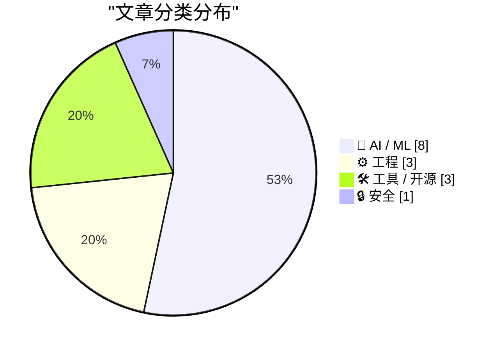
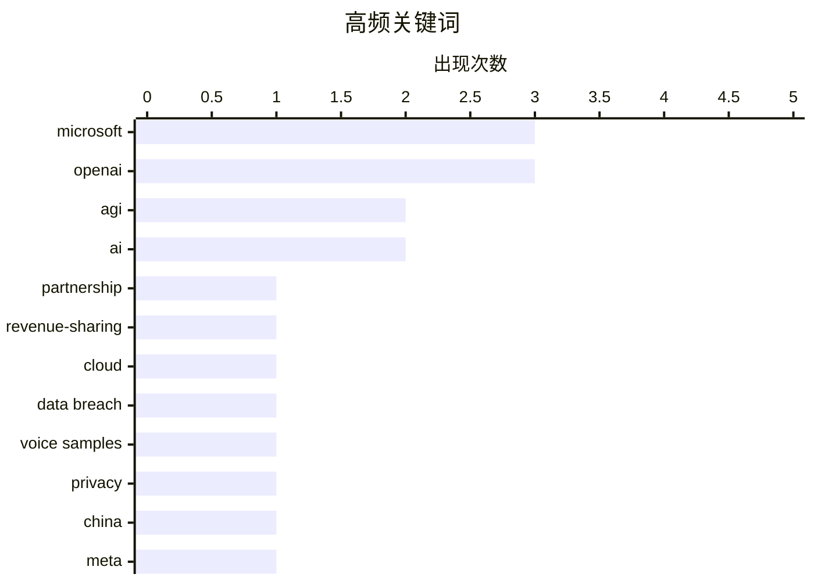

# 📰 AI 资讯每日精选 — 2026-04-28

> 汇聚 140+ 技术博客、X/Twitter、Hacker News、Reddit、Product Hunt、
> Lobste.rs、ClawFeed 日报及 GitHub Trending，经 AI 评分筛选。
>
> **本期内容**：🏆 今日必读 · 🌐 ClawFeed 日报 · 🔥 GitHub Trending · 📂 分类精选 · 🎨 设计与生成式 AI · 📊 数据概览

## 📝 今日看点

今日技术圈的核心动态集中在AI产业格局的剧烈重组与基础设施的加速扩张上。微软与OpenAI正式终结独家合作关系，标志着AI巨头从“绑定”走向“开放”，OpenAI得以自由选择云服务商，而备受争议的AGI条款也随之废止。与此同时，AI训练数据供应链的安全隐患浮出水面，Mercor公司4TB语音样本及4万名承包商信息遭窃，暴露出数据标注环节的脆弱性。此外，ASML正全力扩产EUV光刻机，以垄断姿态支撑AI芯片的算力需求，而中国首次直接阻止Meta收购AI初创公司Manus，凸显了地缘政治对技术资产流动的深刻影响。

---

## 🏆 今日必读

🥇 **微软与OpenAI终止独家及收入分成协议**

[Microsoft and OpenAI end their exclusive and revenue-sharing deal](https://www.bloomberg.com/news/articles/2026-04-27/microsoft-to-stop-sharing-revenue-with-main-ai-partner-openai) — Hacker News Best · 12 小时前 · 🤖 AI / ML

> 微软与OpenAI宣布结束长达数年的独家合作关系，并终止了原有的收入分成协议。根据新协议，OpenAI不再受限于微软的云服务，可以自由通过任何云提供商分发其产品。微软也失去了对OpenAI技术的独家许可权，同时备受争议的“AGI条款”（即若实现AGI则微软知识产权失效的条款）被正式移除。这一调整标志着两家公司从深度绑定转向更松散的合作关系，OpenAI获得了更大的商业自主权。

💡 **为什么值得读**: 这是AI行业最重要的商业合作关系的重大转折点，直接关系到未来GPT系列产品的分发渠道和云服务格局。

🏷️ Microsoft, OpenAI, partnership, revenue-sharing

🥈 **OpenAI与微软重写协议：不再独家，不再有AGI条款**

[OpenAI and Microsoft rewrite their deal: no more exclusivity, no more AGI clause](https://the-decoder.com/openai-and-microsoft-rewrite-their-deal-no-more-exclusivity-no-more-agi-clause/) — The Decoder · 11 小时前 · 🤖 AI / ML

> OpenAI与微软重新签署合作协议，核心变化包括：OpenAI不再被微软云服务独家绑定，可自由选择任何云提供商分发其AI产品；微软失去对OpenAI技术的独家许可权；备受争议的“AGI条款”（即若实现通用人工智能则微软权利失效）被彻底删除。新协议使OpenAI在商业运营上获得更大灵活性，微软则从独家合作伙伴转变为重要投资者和客户。

💡 **为什么值得读**: 详细解读了协议重写的具体条款变化，是理解微软与OpenAI关系未来走向的关键分析。

🏷️ OpenAI, Microsoft, AGI, cloud

🥉 **4TB语音样本从Mercor的4万名AI承包商处被盗**

[4TB of voice samples just stolen from 40k AI contractors at Mercor](https://app.oravys.com/blog/mercor-breach-2026) — Hacker News Best · 15 小时前 · 🔒 安全

> AI数据标注公司Mercor遭遇重大数据泄露，约4TB的语音样本被窃取，涉及4万名AI承包商。泄露的数据包括承包商录制的语音片段及其个人身份信息。此次事件暴露了AI训练数据供应链中的安全漏洞，尤其是大量依赖外包劳动力的数据采集环节。Mercor尚未公布具体攻击细节，但已通知受影响用户并启动调查。

💡 **为什么值得读**: 揭示了AI训练数据安全的一个重大现实威胁，对关注数据隐私和AI供应链安全的人具有警示意义。

🏷️ data breach, AI, voice samples, privacy

4️⃣ **中国阻止Meta以20亿美元收购AI初创公司Manus**

[China blocks Meta's $2 billion acquisition of AI startup Manus](https://the-decoder.com/china-blocks-metas-2-billion-acquisition-of-ai-startup-manus/) — The Decoder · 14 小时前 · 🤖 AI / ML

> 中国监管机构下令阻止Meta以20亿美元收购AI初创公司Manus的交易，并要求撤销已经完成的收购。此举发生在中美科技竞争加剧的背景下，Manus被认为拥有关键的AI技术资产。这是中国首次直接阻止一家美国科技巨头对中国AI公司的收购，标志着技术保护主义的进一步升级。

💡 **为什么值得读**: 这是中美AI地缘政治博弈的标志性事件，直接影响了全球AI并购格局和科技企业的跨境投资策略。

🏷️ China, Meta, acquisition, AI startup

5️⃣ **垄断AI最核心机器的公司正加速扩产**

[The company with a monopoly on AI's most critical machine is racing to build more](https://the-decoder.com/the-company-with-a-monopoly-on-ais-most-critical-machine-is-racing-to-build-more/) — The Decoder · 16 小时前 · ⚙️ 工程

> ASML计划大幅增加其极紫外（EUV）光刻机的产量，以应对AI芯片日益增长的需求。ASML目前是全球唯一能生产EUV光刻机的公司，这种机器是制造最先进AI芯片（如英伟达H100/B200）的必需品。据《华尔街日报》报道，ASML正面临来自台积电、三星和英特尔等客户的巨大订单压力，扩产计划旨在缓解AI芯片产能瓶颈。

💡 **为什么值得读**: 揭示了AI算力供应链最上游的瓶颈——EUV光刻机产能，对理解AI芯片短缺的根本原因至关重要。

🏷️ ASML, EUV, lithography, AI chips

---

## 🌐 ClawFeed 日报精选

> 来源：[ClawFeed](https://clawfeed.kevinhe.io) — AI 驱动的多源新闻聚合

### 🔥 今日头条

1. **OpenAI 把 Codex 从 coding tool 推向全工作流 agent 平台**
   今天最强主线就是 OpenAI 连续强化 Codex，新增 computer use、浏览器、image generation、memory、SSH devbox、并行 agents 和更多插件，目标已经不是“帮你写代码”，而是抢开发者与知识工作者的工作台入口。

2. **GPT-Rosalind 发布，frontier model 开始更明确切入生命科学**
   OpenAI 同步推出面向生命科学研究的 GPT-Rosalind，直接把能力包装到药物发现、基因组学、实验规划和转化医学流程，说明高价值垂直场景会越来越成为大模型产品化主战场。

3. **Claude Opus 4.7 刷新 agent 竞争强度**
   Anthropic 今天在社媒侧最强的产品信号是 Claude Opus 4.7，重点强调更稳的长任务执行、指令跟随和交付前自检。市场关注点继续从“聊天更像人”转向“能不能稳定干完复杂任务”。

4. **AI 安全和 cyber defense 持续升温**
   OpenAI 扩大 Trusted Access for Cyber，并开放更高信任级别团队申请 GPT-5.4-Cyber。Anthropic 则继续推进 Project Glasswing，把 Claude 往关键软件安全和基础设施防护场景里打，安全赛道已经明显进入平台级竞争。

5. **多模态 agent 和 world model 继续冒头**
   Google DeepMind 把 Gemini Robotics 接到 Spot 上，HeyGen 开源 HyperFrames，腾讯 HY-World-2.0 也被持续讨论。除了 coding agent，视频编辑、机器人执行、3D world generation 都在变成新一轮 agent 入口。

---

## 🔥 GitHub Trending

> 今日热门开源项目（全语言 + Python）

| # | 项目 | 描述 | ⭐ 总星 | 📈 今日 | 语言 |
|---|------|------|---------|---------|------|
| 1 | [mattpocock/skills](https://github.com/mattpocock/skills) 🤖 | Skills for Real Engineers. Straight from my .claude direc... | 30.4k | +5645 | Shell |
| 2 | [Alishahryar1/free-claude-code](https://github.com/Alishahryar1/free-claude-code) 🤖 | Use claude-code for free in the terminal, VSCode extensio... | 16.1k | +2949 | Python |
| 3 | [Z4nzu/hackingtool](https://github.com/Z4nzu/hackingtool) | ALL IN ONE Hacking Tool For Hackers | 67.1k | +1830 | Python |
| 4 | [abhigyanpatwari/GitNexus](https://github.com/abhigyanpatwari/GitNexus) 🤖 | GitNexus: The Zero-Server Code Intelligence Engine - GitN... | 31.6k | +1102 | TypeScript |
| 5 | [microsoft/VibeVoice](https://github.com/microsoft/VibeVoice) 🤖 | Open-Source Frontier Voice AI | 43.1k | +757 | Python |
| 6 | [ComposioHQ/awesome-codex-skills](https://github.com/ComposioHQ/awesome-codex-skills) | A curated list of practical Codex skills for automating w... | 2.8k | +638 | Python |
| 7 | [gastownhall/beads](https://github.com/gastownhall/beads) 🤖 | Beads - A memory upgrade for your coding agent | 22.2k | +498 | Go |
| 8 | [home-assistant/core](https://github.com/home-assistant/core) | 🏡 Open source home automation that puts local control an... | 86.8k | +460 | Python |
| 9 | [donnemartin/system-design-primer](https://github.com/donnemartin/system-design-primer) | Learn how to design large-scale systems. Prep for the sys... | 345.2k | +372 | Python |
| 10 | [HunxByts/GhostTrack](https://github.com/HunxByts/GhostTrack) | Useful tool to track location or mobile number | 9.7k | +348 | Python |
| 11 | [ZhuLinsen/daily_stock_analysis](https://github.com/ZhuLinsen/daily_stock_analysis) 🤖 | LLM驱动的 A/H/美股智能分析器：多数据源行情 + 实时新闻 + LLM决策仪表盘 + 多渠道推送，零成本定时... | 31.9k | +315 | Python |
| 12 | [sherlock-project/sherlock](https://github.com/sherlock-project/sherlock) | Hunt down social media accounts by username across social... | 82.6k | +266 | Python |
| 13 | [TauricResearch/TradingAgents](https://github.com/TauricResearch/TradingAgents) 🤖 | TradingAgents: Multi-Agents LLM Financial Trading Framework | 53.8k | +248 | Python |
| 14 | [nikopueringer/CorridorKey](https://github.com/nikopueringer/CorridorKey) | Perfect Green Screen Keys | 11.8k | +186 | Python |
| 15 | [penpot/penpot](https://github.com/penpot/penpot) | Penpot: The open-source design tool for design and code c... | 46.6k | +166 | Clojure |

---

## 🤖 AI / ML

### 1. 微软与OpenAI终止独家及收入分成协议

[Microsoft and OpenAI end their exclusive and revenue-sharing deal](https://www.bloomberg.com/news/articles/2026-04-27/microsoft-to-stop-sharing-revenue-with-main-ai-partner-openai) — **Hacker News Best** · 12 小时前 · ⭐ 28/30

> 微软与OpenAI宣布结束长达数年的独家合作关系，并终止了原有的收入分成协议。根据新协议，OpenAI不再受限于微软的云服务，可以自由通过任何云提供商分发其产品。微软也失去了对OpenAI技术的独家许可权，同时备受争议的“AGI条款”（即若实现AGI则微软知识产权失效的条款）被正式移除。这一调整标志着两家公司从深度绑定转向更松散的合作关系，OpenAI获得了更大的商业自主权。

🏷️ Microsoft, OpenAI, partnership, revenue-sharing

---

### 2. OpenAI与微软重写协议：不再独家，不再有AGI条款

[OpenAI and Microsoft rewrite their deal: no more exclusivity, no more AGI clause](https://the-decoder.com/openai-and-microsoft-rewrite-their-deal-no-more-exclusivity-no-more-agi-clause/) — **The Decoder** · 11 小时前 · ⭐ 27/30

> OpenAI与微软重新签署合作协议，核心变化包括：OpenAI不再被微软云服务独家绑定，可自由选择任何云提供商分发其AI产品；微软失去对OpenAI技术的独家许可权；备受争议的“AGI条款”（即若实现通用人工智能则微软权利失效）被彻底删除。新协议使OpenAI在商业运营上获得更大灵活性，微软则从独家合作伙伴转变为重要投资者和客户。

🏷️ OpenAI, Microsoft, AGI, cloud

---

### 3. 中国阻止Meta以20亿美元收购AI初创公司Manus

[China blocks Meta's $2 billion acquisition of AI startup Manus](https://the-decoder.com/china-blocks-metas-2-billion-acquisition-of-ai-startup-manus/) — **The Decoder** · 14 小时前 · ⭐ 26/30

> 中国监管机构下令阻止Meta以20亿美元收购AI初创公司Manus的交易，并要求撤销已经完成的收购。此举发生在中美科技竞争加剧的背景下，Manus被认为拥有关键的AI技术资产。这是中国首次直接阻止一家美国科技巨头对中国AI公司的收购，标志着技术保护主义的进一步升级。

🏷️ China, Meta, acquisition, AI startup

---

### 4. Prompt API

[The Prompt API](https://developer.chrome.com/docs/ai/prompt-api) — **Hacker News Best** · 23 小时前 · ⭐ 26/30

> Chrome团队发布了Prompt API，这是一个允许开发者直接在浏览器中调用大语言模型（LLM）的JavaScript接口。该API支持文本生成、摘要、分类等任务，无需后端服务器或外部API密钥。它基于浏览器内置的本地模型运行，确保用户数据隐私。开发者可以通过简单的JavaScript调用实现AI功能，例如自动补全、内容改写或智能搜索。

🏷️ Chrome, Prompt API, AI, browser

---

### 5. 我在生产环境中使用检索增强生成（RAG）时反复遇到的三个限制，已经快没辙了

[Three limitations I keep hitting with retrieval-augmented generation in production and I'm running out of ideas [D]](https://www.reddit.com/r/MachineLearning/comments/1swxx1v/three_limitations_i_keep_hitting_with/) — **r/MachineLearning** · 16 小时前 · ⭐ 26/30

> 作者在德国法律文档领域的RAG系统已运行数月，处理80%的查询表现良好，但遇到三个顽固问题：一是“分散问题”，当答案需要从8-10个不同文档中提取碎片化信息时，向量检索无法有效关联这些分散片段；二是“语义漂移”，长文档中不同段落语义差异大导致检索不准确；三是“时效性冲突”，新旧法规矛盾时RAG无法判断优先级。作者正在寻求社区解决方案。

🏷️ RAG, production, limitations, legal

---

### 6. 追踪现已废止的OpenAI-Microsoft AGI条款的历史

[Tracking the history of the now-deceased OpenAI Microsoft AGI clause](https://simonwillison.net/2026/Apr/27/now-deceased-agi-clause/#atom-everything) — **simonwillison.net** · 6 小时前 · ⭐ 25/30

> 作者详细追溯了微软与OpenAI合作中“AGI条款”的演变历史。该条款规定，一旦实现通用人工智能（AGI），微软对OpenAI技术的商业知识产权将自动失效。作者通过存档的OpenAI官网页面，追踪了该条款从2019年首次出现到2026年被移除的完整过程。文章展示了条款措辞的多次修改，以及最终在最新合作协议中被彻底删除。

🏷️ AGI, Microsoft, OpenAI, contract

---

### 7. Luce DFlash：在单张RTX 3090上，Qwen3.6-27B吞吐量提升至2倍

[Luce DFlash: Qwen3.6-27B at up to 2x throughput on a single RTX 3090](https://www.reddit.com/r/LocalLLaMA/comments/1sx8uok/luce_dflash_qwen3627b_at_up_to_2x_throughput_on_a/) — **r/LocalLLaMA** · 8 小时前 · ⭐ 25/30

> 该文章介绍了一种名为Luce DFlash的推理优化方案，能在单张RTX 3090上运行Qwen3.6-27B模型，并将吞吐量提升至原来的2倍。核心方法是通过改进FlashAttention和KV缓存管理，显著减少显存占用和计算瓶颈。实测数据表明，在相同硬件条件下，该方案相比标准推理框架实现了近2倍的tokens/s提升。作者认为，这种优化让消费级显卡运行更大模型成为可能，降低了本地部署大模型的门槛。

🏷️ Qwen3, inference, throughput, RTX 3090

---

### 8. 微软发布TRELLIS.2：开源40亿参数图像转3D模型，可生成高达1536³分辨率的PBR纹理资产，基于原生3D VAE实现16倍空间压缩

[Microsoft Presents "TRELLIS.2": An Open-Source, 4b-Parameter, Image-To-3D Model Producing Up To 1536³ PBR Textured Assets, Built On Native 3D VAES With 16× Spatial Compression, Delivering Efficient, Scalable, High-Fidelity Asset Generation.](https://www.reddit.com/r/LocalLLaMA/comments/1sxf2u0/microsoft_presents_trellis2_an_opensource/) — **r/LocalLLaMA** · 5 小时前 · ⭐ 25/30

> 微软推出的TRELLIS.2是一个40亿参数的开源图像转3D模型，能够从单张图片生成最高1536³体素分辨率的PBR（基于物理渲染）纹理3D资产。其核心技术是原生3D VAE，实现了16倍的空间压缩效率，大幅降低了计算和存储成本。该模型在生成质量、纹理细节和几何精度上显著优于前代及同类方法。作者认为，TRELLIS.2标志着开源3D生成领域在效率和保真度上迈出了重要一步。

🏷️ TRELLIS.2, 3D, image-to-3D, open-source

---

## ⚙️ 工程

### 9. 垄断AI最核心机器的公司正加速扩产

[The company with a monopoly on AI's most critical machine is racing to build more](https://the-decoder.com/the-company-with-a-monopoly-on-ais-most-critical-machine-is-racing-to-build-more/) — **The Decoder** · 16 小时前 · ⭐ 26/30

> ASML计划大幅增加其极紫外（EUV）光刻机的产量，以应对AI芯片日益增长的需求。ASML目前是全球唯一能生产EUV光刻机的公司，这种机器是制造最先进AI芯片（如英伟达H100/B200）的必需品。据《华尔街日报》报道，ASML正面临来自台积电、三星和英特尔等客户的巨大订单压力，扩产计划旨在缓解AI芯片产能瓶颈。

🏷️ ASML, EUV, lithography, AI chips

---

### 10. 图灵奖得主谈：数据抽象、迪杰斯特拉与分布式系统 | Barbara Liskov

[Turing Award Winner: Data Abstraction, Dijkstra, Distributed Systems | Barbara Liskov](https://www.reddit.com/r/programming/comments/1sx9v9e/turing_award_winner_data_abstraction_dijkstra/) — **r/programming** · 8 小时前 · ⭐ 25/30

> 图灵奖得主Barbara Liskov在访谈中回顾了她在数据抽象、分布式系统和编程语言领域的开创性工作。她分享了与Edsger Dijkstra的学术互动，以及Liskov替换原则的诞生背景。Liskov还讨论了分布式系统设计中的关键挑战，包括容错、一致性和可扩展性。她认为数据抽象是软件工程最重要的思想之一，并鼓励年轻研究者关注系统设计的根本问题。

🏷️ Turing Award, data abstraction, distributed systems, Barbara Liskov

---

### 11. Rust编译器是如何工作的（2025版）

[How Rust Compiles (2025)](https://www.youtube.com/watch?v=G1g6Me1FHmE) — **Lobste.rs** · 8 小时前 · ⭐ 25/30

> 该视频深入剖析了Rust编译器在2025年的内部工作原理，涵盖从源码解析、类型检查、借用检查到LLVM IR生成和优化的完整流程。重点介绍了最新的增量编译改进、并行编译策略以及MIR（中间表示）的优化进展。视频还讨论了Rust编译器团队如何应对复杂性和编译速度的挑战。作者认为，理解编译器工作流有助于开发者写出更高效的Rust代码。

🏷️ Rust, compiler, internals

---

## 🛠 工具 / 开源

### 12. GitHub Copilot将转向基于使用量的计费模式

[GitHub Copilot is moving to usage-based billing](https://github.blog/news-insights/company-news/github-copilot-is-moving-to-usage-based-billing/) — **Hacker News Best** · 9 小时前 · ⭐ 25/30

> GitHub宣布Copilot将从固定订阅费模式转向基于使用量的计费模式。新计费方案将根据代码补全次数、聊天交互次数等实际使用指标收费。此举旨在更公平地匹配不同开发者的使用强度，轻度用户可能降低费用，而重度用户成本可能上升。GitHub表示这是响应开发者反馈，提供更灵活付费选项的结果。

🏷️ GitHub Copilot, billing, usage-based

---

### 13. Qwen3.6-27B的vLLM Docker容器：搭配Lorbus AutoRound INT4量化与MTP推测解码，在2张RTX 3090上达到118 tokens/秒

[Simple to use vLLM Docker Container for Qwen3.6 27b with Lorbus AutoRound INT4 quant and MTP speculative decoding - 118 tokens/second on 2x 3090s](https://www.reddit.com/r/LocalLLaMA/comments/1sx3gsl/simple_to_use_vllm_docker_container_for_qwen36/) — **r/LocalLLaMA** · 12 小时前 · ⭐ 25/30

> 该文章提供了一个开箱即用的vLLM Docker容器，用于运行Qwen3.6-27B模型。通过Lorbus AutoRound INT4量化技术将模型精度压缩至4比特，并结合MTP（多令牌预测）推测解码，在2张RTX 3090上实现了118 tokens/秒的推理速度。该方案简化了部署流程，用户只需拉取容器即可运行。作者强调，这种组合在保持较高生成质量的同时，将推理延迟降低到接近实时交互的水平。

🏷️ vLLM, Docker, Qwen 3.6, speculative decoding

---

### 14. pip 26.1 新特性：锁文件与依赖冷却期

[What's new in pip 26.1 - lockfiles and dependency cooldowns](https://ichard26.github.io/blog/2026/04/whats-new-in-pip-26.1/) — **Lobste.rs** · 3 小时前 · ⭐ 25/30

> pip 26.1版本引入了两项重要功能：锁文件（lockfiles）支持和依赖冷却期（dependency cooldowns）。锁文件功能允许用户锁定项目依赖的精确版本，确保跨环境的一致性，类似于Poetry或Cargo的锁机制。依赖冷却期则是在安装失败后自动设置一个等待时间，避免反复尝试失败的依赖解析，提升安装稳定性。作者认为，这些改进使pip在依赖管理和可靠性上向现代包管理器看齐。

🏷️ pip, lockfiles, Python, dependency management

---

## 🔒 安全

### 15. 4TB语音样本从Mercor的4万名AI承包商处被盗

[4TB of voice samples just stolen from 40k AI contractors at Mercor](https://app.oravys.com/blog/mercor-breach-2026) — **Hacker News Best** · 15 小时前 · ⭐ 27/30

> AI数据标注公司Mercor遭遇重大数据泄露，约4TB的语音样本被窃取，涉及4万名AI承包商。泄露的数据包括承包商录制的语音片段及其个人身份信息。此次事件暴露了AI训练数据供应链中的安全漏洞，尤其是大量依赖外包劳动力的数据采集环节。Mercor尚未公布具体攻击细节，但已通知受影响用户并启动调查。

🏷️ data breach, AI, voice samples, privacy

---

## 🎨 Design & Generative AI

### 🖼️ 生成式图片

- **[Flux Kontext + ControlNet崩溃修复方案](https://www.reddit.com/r/comfyui/comments/1sxhxw0/custom_node_workflow_fix_for_flux_kontext/)** — r/comfyui · 3 小时前
  > 提供完整的双通道姿态工作流，解决形状不匹配导致的崩溃问题

- **[三款Triton融合ComfyUI节点发布](https://www.reddit.com/r/comfyui/comments/1swpwpd/3_new_nodes_tritonfused_comfyui_nodes_qwen3tts/)** — r/comfyui · 23 小时前
  > Qwen3-TTS、OmniVoice和Z-Image节点，采用自定义OpenAI Triton内核加速

- **[AURA：本地优先的Civitai管理工具](https://www.reddit.com/r/comfyui/comments/1sx99ee/open_source_aura_a_localfirst_management_vault/)** — r/comfyui · 8 小时前
  > 支持自动标签、元数据和浏览器集成的开源模型管理库

- **[Ernie-Turbo采样器/调度器全面测试](https://www.reddit.com/r/comfyui/comments/1sxgrfd/testing_all_samplershedulers_on_ernieturbo_lots/)** — r/comfyui · 4 小时前
  > 大量图片与笔记，对比不同采样器和调度器的效果

- **[PixlStash 1.1.0 本地图片管理服务器](https://www.reddit.com/r/comfyui/comments/1sx8qpb/pixlstash_110_is_now_available/)** — r/comfyui · 8 小时前
  > 开源、本地托管的图片管理服务器，用于组织AI生成图像

- **[ComfyUI Cloud API节点概念验证](https://www.reddit.com/r/comfyui/comments/1sx1p8n/created_a_very_basic_proof_of_concept_for_using/)** — r/comfyui · 13 小时前
  > 将ComfyUI云端API封装为本地节点的基本实现

- **[两年后回归：Stable Diffusion现状指南](https://www.reddit.com/r/StableDiffusion/comments/1sxbncv/lost_in_time_user_here/)** — r/StableDiffusion · 7 小时前
  > 为老用户梳理当前主流软件和工具的变化

- **[本地多模态嵌入模型值得尝试吗？](https://www.reddit.com/r/StableDiffusion/comments/1sxefwh/multimodal_embedding_models_running_locally_on/)** — r/StableDiffusion · 5 小时前
  > 探讨多模态嵌入模型作为LoRa补充的实用性和效果

- **[风格LoRa与角色LoRa冲突解决方案](https://www.reddit.com/r/StableDiffusion/comments/1sxlhis/mixing_style_lora_with_character_lora_in_comfyui/)** — r/StableDiffusion · 1 小时前
  > 在ComfyUI中如何避免风格和角色LoRa互相干扰

- **[Midjourney 8.1 实为 7.1 的再版](https://www.reddit.com/r/midjourney/comments/1sxcn81/midjourney_81_is_midjourney_71/)** — r/midjourney · 6 小时前
  > 用户质疑新版本缺乏实质性进化，认为只是旧版重命名

- **[用Vibe编码实现7个工作流自动运行](https://www.reddit.com/r/comfyui/comments/1sx5fje/i_vibecoded_getting_7_workflows_to_run/)** — r/comfyui · 10 小时前
  > 通过自动化串联多个不同提示和LoRA的工作流生成场景

- **[HappyHorse 1.0：四镜头动漫序列](https://www.reddit.com/r/StableDiffusion/comments/1sx7osx/happyhorse_10_four_shot_anime_sequence_with/)** — r/StableDiffusion · 9 小时前
  > 实现跨镜头角色一致性的动漫风格图像生成

- **[12GB显存下最佳角色LoRA模型推荐](https://www.reddit.com/r/StableDiffusion/comments/1sx4mhj/best_spicy_model_for_character_loras_and_12gb_vram/)** — r/StableDiffusion · 11 小时前
  > 对比ZIT、Flux Klein和Illustrious在显存限制下的表现

### 🎬 生成式视频

- **[开源本地音乐视频生成器](https://www.reddit.com/r/StableDiffusion/comments/1swx934/built_a_opensource_local_music_video_generator/)** — r/StableDiffusion · 17 小时前
  > 用SDXL、AnimateDiff和音频反应式GLSL着色器构建的完整音乐视频生成管线

- **[GooglyEyes IC-LoRA：为LTX2.3注入疯狂创意](https://www.reddit.com/r/comfyui/comments/1swptf4/googlyeyes_iclora_for_ltx23_finally_some_real/)** — r/comfyui · 23 小时前
  > 打破常规，为视频生成添加搞笑眼睛效果的LoRA模型

---

## 📊 数据概览

| 扫描源 | 抓取文章 | 时间范围 | 精选 |
|:---:|:---:|:---:|:---:|
| 112/140 | 4768 篇 → 205 篇 | 24h | **15 篇** |

### 分类分布



### 高频关键词



<details>
<summary>📈 纯文本关键词图（终端友好）</summary>

```
microsoft       │ ████████████████████ 3
openai          │ ████████████████████ 3
agi             │ █████████████░░░░░░░ 2
ai              │ █████████████░░░░░░░ 2
partnership     │ ███████░░░░░░░░░░░░░ 1
revenue-sharing │ ███████░░░░░░░░░░░░░ 1
cloud           │ ███████░░░░░░░░░░░░░ 1
data breach     │ ███████░░░░░░░░░░░░░ 1
voice samples   │ ███████░░░░░░░░░░░░░ 1
privacy         │ ███████░░░░░░░░░░░░░ 1
```

</details>

### 🏷️ 话题标签

**microsoft**(3) · **openai**(3) · **agi**(2) · ai(2) · partnership(1) · revenue-sharing(1) · cloud(1) · data breach(1) · voice samples(1) · privacy(1) · china(1) · meta(1) · acquisition(1) · ai startup(1) · asml(1) · euv(1) · lithography(1) · ai chips(1) · chrome(1) · prompt api(1)

---

*生成于 2026-04-28 01:23 | 汇聚 140 个技术博客、X/Twitter、Hacker News、Reddit、Product Hunt、Lobste.rs、ClawFeed 日报及 GitHub Trending，经 AI 评分筛选出 Top 15 精华内容*
