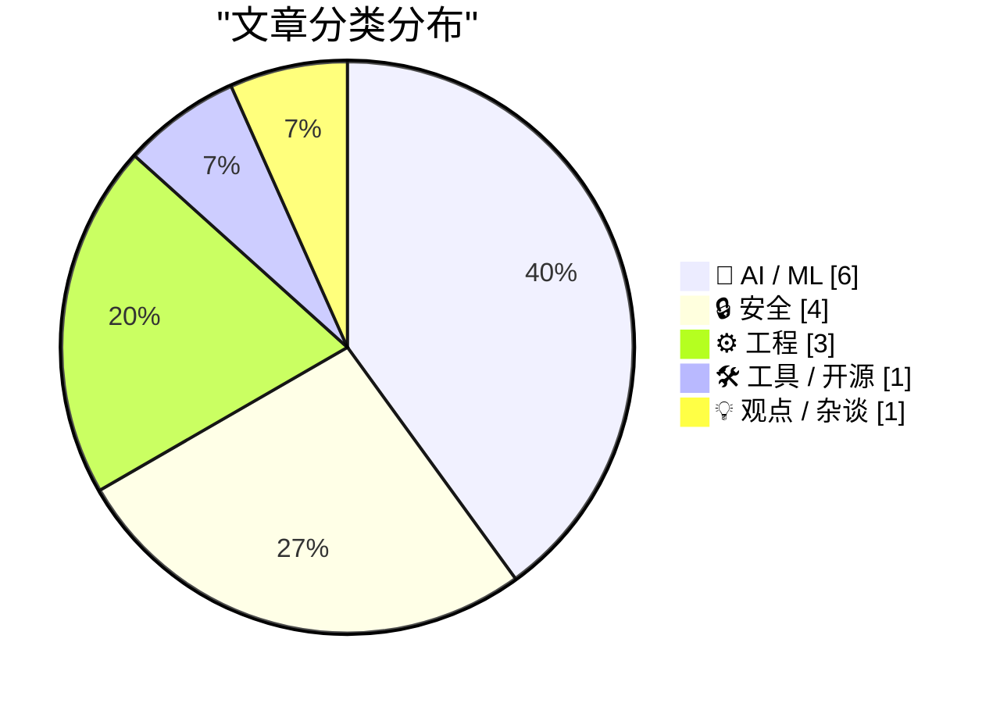
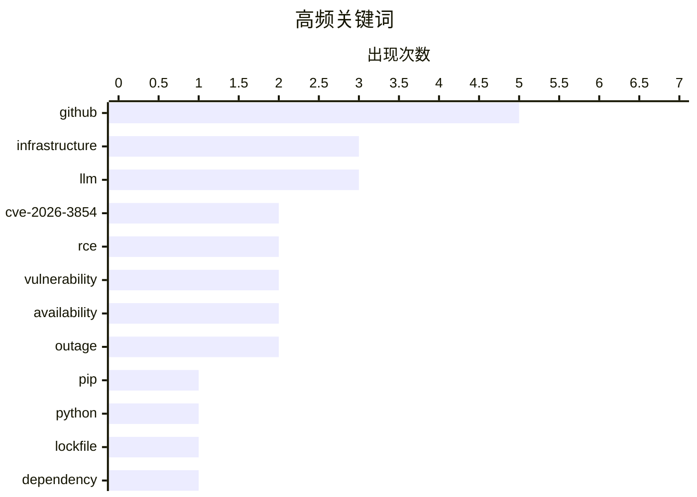

# 📰 AI 资讯每日精选 — 2026-04-29

> 汇聚 140+ 技术博客、X/Twitter、Hacker News、Reddit、Product Hunt、
> Lobste.rs、ClawFeed 日报及 GitHub Trending，经 AI 评分筛选。
>
> **本期内容**：🏆 今日必读 · 🌐 ClawFeed 日报 · 🔥 GitHub Trending · 📂 分类精选 · 🎨 设计与生成式 AI · 📊 数据概览

## 📝 今日看点

今日技术圈聚焦两大主线：安全领域因GitHub曝出严重远程代码执行漏洞（CVE-2026-3854）而拉响警报，该漏洞利用Actions工作流中的竞争条件实现攻击，引发对平台供应链安全的广泛讨论；AI产业则迎来格局变动，OpenAI终止与微软的独家合作，同时DeepMind联合创始人David Silver获11亿美元融资，押注无需人类数据的自学习AI路线，标志着行业正从“数据依赖”向“自主进化”方向加速分化。此外，工具链方面，pip 26.1引入锁文件与依赖冷却机制，进一步推动Python生态的工程化成熟。

---

## 🏆 今日必读

🥇 **研究人员发现 GitHub.com 远程代码执行漏洞 (CVE-2026-3854)**

[Researchers Find RCE Vulnerability in GitHub.com (CVE-2026-3854)](https://www.reddit.com/r/programming/comments/1syaqsc/researchers_find_rce_vulnerability_in_githubcom/) — r/programming · 6 小时前 · 🔒 安全

> Wiz 研究人员在 GitHub.com 中发现一个严重远程代码执行（RCE）漏洞，编号 CVE-2026-3854。该漏洞利用 GitHub Actions 工作流中的竞争条件，攻击者可通过精心构造的 Pull Request 触发恶意代码在 GitHub 基础设施上执行。漏洞根因在于工作流调度器在处理并发事件时存在时间窗口，允许未授权的代码注入。GitHub 已确认漏洞并部署了修复补丁，但该漏洞展示了 CI/CD 平台中复杂状态管理带来的安全挑战。

💡 **为什么值得读**: 了解 GitHub 核心基础设施的 RCE 漏洞细节，对 CI/CD 安全实践和平台级漏洞防御有重要参考价值。

🏷️ CVE-2026-3854, RCE, GitHub, vulnerability

🥈 **GitHub RCE 漏洞：CVE-2026-3854 深度解析**

[GitHub RCE Vulnerability: CVE-2026-3854 Breakdown](https://www.wiz.io/blog/github-rce-vulnerability-cve-2026-3854) — Lobste.rs · 6 小时前 · 🔒 安全

> Wiz 团队详细披露了 CVE-2026-3854 漏洞的技术细节，这是一个影响 GitHub.com 的远程代码执行漏洞。攻击链涉及利用 GitHub Actions 的 `workflow_run` 事件与 `pull_request_target` 触发器的组合，通过竞争条件绕过沙箱限制。研究人员演示了如何从公共仓库的 Pull Request 中获取 GitHub 内部服务的 shell 访问权限。该漏洞的严重性在于攻击者可以完全控制 GitHub 的构建环境，进而可能横向移动至其他内部系统。

💡 **为什么值得读**: 技术深度极高，包含完整的攻击链分析和 PoC 思路，适合安全研究人员和平台工程师深入理解 CI/CD 安全边界。

🏷️ GitHub, RCE, CVE-2026-3854, vulnerability

🥉 **pip 26.1 新特性：锁文件与依赖冷却机制**

[What's new in pip 26.1 - lockfiles and dependency cooldowns!](https://simonwillison.net/2026/Apr/28/pip-261/#atom-everything) — simonwillison.net · 20 小时前 · 🛠 工具 / 开源

> Python 包管理器 pip 发布 26.1 版本，引入两大核心功能：原生锁文件支持和依赖冷却机制。锁文件功能允许开发者锁定精确的依赖版本树，确保跨环境一致性，类似 npm 的 `package-lock.json`。依赖冷却机制则通过引入时间延迟，防止新发布的恶意包被立即自动安装，降低供应链攻击风险。该版本同时移除了对 Python 3.9 的支持，因其已于 2025 年 10 月结束生命周期。

💡 **为什么值得读**: pip 的锁文件功能是 Python 生态长期缺失的关键特性，对项目依赖管理和 CI/CD 可靠性有直接影响。

🏷️ pip, Python, lockfile, dependency

4️⃣ **DeepMind 的 David Silver 筹集 11 亿美元，打造无需人类数据即可学习的 AI**

[DeepMind's David Silver just raised $1.1B to build an AI that learns without human data](https://www.reddit.com/r/singularity/comments/1sxtuo0/deepminds_david_silver_just_raised_11b_to_build/) — r/singularity · 18 小时前 · 🤖 AI / ML

> DeepMind 联合创始人 David Silver 宣布完成 11 亿美元融资，用于开发一种全新的 AI 系统，该系统完全通过自我对弈和环境交互学习，无需任何人类标注数据。该项目旨在突破当前大语言模型对海量人类文本数据的依赖，回归强化学习的本质。Silver 认为，真正的通用智能应能从零开始自主发现世界规律，而非模仿人类已有知识。这笔融资是 AI 领域近年来规模最大的独立研究项目之一。

💡 **为什么值得读**: David Silver 是强化学习领域的奠基人之一，其无人类数据学习路线可能颠覆当前 AI 发展范式，值得关注。

🏷️ DeepMind, funding, AI, learning

5️⃣ **OpenAI 终止与微软的独家合作关系**

[OpenAI ends its exclusive partnership with Microsoft](https://www.reddit.com/r/singularity/comments/1sxynbi/openai_ends_its_exclusive_partnership_with/) — r/singularity · 13 小时前 · 🤖 AI / ML

> OpenAI 宣布结束与微软的独家云服务与投资协议，标志着双方长达数年的深度绑定关系发生重大转折。此前微软已向 OpenAI 投资超过 130 亿美元，并独家提供 Azure 算力。解绑后，OpenAI 将有权与其他云服务商合作，并可能自行建设算力基础设施。此举被视为 OpenAI 为即将到来的 IPO 做准备，以及应对日益增长的算力需求和监管审查。

💡 **为什么值得读**: 这是 AI 行业格局的关键转折点，直接影响微软和 OpenAI 的商业策略，以及整个云服务市场的竞争态势。

🏷️ OpenAI, Microsoft, partnership

---

## 🌐 ClawFeed 日报精选

> 来源：[ClawFeed](https://clawfeed.kevinhe.io) — AI 驱动的多源新闻聚合

### 🔥 今日头条

1. **OpenAI 把 Codex 从 coding tool 推向全工作流 agent 平台**
   今天最强主线就是 OpenAI 连续强化 Codex，新增 computer use、浏览器、image generation、memory、SSH devbox、并行 agents 和更多插件，目标已经不是“帮你写代码”，而是抢开发者与知识工作者的工作台入口。

2. **GPT-Rosalind 发布，frontier model 开始更明确切入生命科学**
   OpenAI 同步推出面向生命科学研究的 GPT-Rosalind，直接把能力包装到药物发现、基因组学、实验规划和转化医学流程，说明高价值垂直场景会越来越成为大模型产品化主战场。

3. **Claude Opus 4.7 刷新 agent 竞争强度**
   Anthropic 今天在社媒侧最强的产品信号是 Claude Opus 4.7，重点强调更稳的长任务执行、指令跟随和交付前自检。市场关注点继续从“聊天更像人”转向“能不能稳定干完复杂任务”。

4. **AI 安全和 cyber defense 持续升温**
   OpenAI 扩大 Trusted Access for Cyber，并开放更高信任级别团队申请 GPT-5.4-Cyber。Anthropic 则继续推进 Project Glasswing，把 Claude 往关键软件安全和基础设施防护场景里打，安全赛道已经明显进入平台级竞争。

5. **多模态 agent 和 world model 继续冒头**
   Google DeepMind 把 Gemini Robotics 接到 Spot 上，HeyGen 开源 HyperFrames，腾讯 HY-World-2.0 也被持续讨论。除了 coding agent，视频编辑、机器人执行、3D world generation 都在变成新一轮 agent 入口。

---

## 🔥 GitHub Trending

> 今日热门开源项目（全语言 + Python）

| # | 项目 | 描述 | ⭐ 总星 | 📈 今日 | 语言 |
|---|------|------|---------|---------|------|
| 1 | [mattpocock/skills](https://github.com/mattpocock/skills) 🤖 | Skills for Real Engineers. Straight from my .claude direc... | 37.5k | +7321 | Shell |
| 2 | [Alishahryar1/free-claude-code](https://github.com/Alishahryar1/free-claude-code) 🤖 | Use claude-code for free in the terminal, VSCode extensio... | 17.5k | +1741 | Python |
| 3 | [abhigyanpatwari/GitNexus](https://github.com/abhigyanpatwari/GitNexus) 🤖 | GitNexus: The Zero-Server Code Intelligence Engine - GitN... | 32.7k | +1607 | TypeScript |
| 4 | [microsoft/VibeVoice](https://github.com/microsoft/VibeVoice) 🤖 | Open-Source Frontier Voice AI | 44.8k | +1483 | Python |
| 5 | [HunxByts/GhostTrack](https://github.com/HunxByts/GhostTrack) | Useful tool to track location or mobile number | 10.6k | +967 | Python |
| 6 | [ComposioHQ/awesome-codex-skills](https://github.com/ComposioHQ/awesome-codex-skills) | A curated list of practical Codex skills for automating w... | 4.0k | +953 | Python |
| 7 | [TauricResearch/TradingAgents](https://github.com/TauricResearch/TradingAgents) 🤖 | TradingAgents: Multi-Agents LLM Financial Trading Framework | 54.4k | +932 | Python |
| 8 | [donnemartin/system-design-primer](https://github.com/donnemartin/system-design-primer) | Learn how to design large-scale systems. Prep for the sys... | 345.9k | +744 | Python |
| 9 | [iamgio/quarkdown](https://github.com/iamgio/quarkdown) | 🪐 Markdown with superpowers: from ideas to papers, prese... | 12.0k | +699 | Kotlin |
| 10 | [public-apis/public-apis](https://github.com/public-apis/public-apis) | A collective list of free APIs | 428.2k | +644 | Python |
| 11 | [CJackHwang/ds2api](https://github.com/CJackHwang/ds2api) 🤖 | Deepseek to API: A lightweight, high-performance full-sta... | 2.3k | +417 | Go |
| 12 | [davila7/claude-code-templates](https://github.com/davila7/claude-code-templates) 🤖 | CLI tool for configuring and monitoring Claude Code | 26.2k | +346 | Python |
| 13 | [ZhuLinsen/daily_stock_analysis](https://github.com/ZhuLinsen/daily_stock_analysis) 🤖 | LLM驱动的 A/H/美股智能分析器：多数据源行情 + 实时新闻 + LLM决策仪表盘 + 多渠道推送，零成本定时... | 32.2k | +278 | Python |
| 14 | [hsliuping/TradingAgents-CN](https://github.com/hsliuping/TradingAgents-CN) 🤖 | 基于多智能体LLM的中文金融交易框架 - TradingAgents中文增强版 | 25.0k | +193 | Python |
| 15 | [fspecii/ace-step-ui](https://github.com/fspecii/ace-step-ui) 🤖 | 🎵 The Ultimate Open Source Suno Alternative - Profession... | 1.7k | +162 | JavaScript |

---

## 🤖 AI / ML

### 1. DeepMind 的 David Silver 筹集 11 亿美元，打造无需人类数据即可学习的 AI

[DeepMind's David Silver just raised $1.1B to build an AI that learns without human data](https://www.reddit.com/r/singularity/comments/1sxtuo0/deepminds_david_silver_just_raised_11b_to_build/) — **r/singularity** · 18 小时前 · ⭐ 27/30

> DeepMind 联合创始人 David Silver 宣布完成 11 亿美元融资，用于开发一种全新的 AI 系统，该系统完全通过自我对弈和环境交互学习，无需任何人类标注数据。该项目旨在突破当前大语言模型对海量人类文本数据的依赖，回归强化学习的本质。Silver 认为，真正的通用智能应能从零开始自主发现世界规律，而非模仿人类已有知识。这笔融资是 AI 领域近年来规模最大的独立研究项目之一。

🏷️ DeepMind, funding, AI, learning

---

### 2. OpenAI 终止与微软的独家合作关系

[OpenAI ends its exclusive partnership with Microsoft](https://www.reddit.com/r/singularity/comments/1sxynbi/openai_ends_its_exclusive_partnership_with/) — **r/singularity** · 13 小时前 · ⭐ 27/30

> OpenAI 宣布结束与微软的独家云服务与投资协议，标志着双方长达数年的深度绑定关系发生重大转折。此前微软已向 OpenAI 投资超过 130 亿美元，并独家提供 Azure 算力。解绑后，OpenAI 将有权与其他云服务商合作，并可能自行建设算力基础设施。此举被视为 OpenAI 为即将到来的 IPO 做准备，以及应对日益增长的算力需求和监管审查。

🏷️ OpenAI, Microsoft, partnership

---

### 3. Introducing talkie：一个来自 1930 年代的 13B 复古语言模型

[Introducing talkie: a 13B vintage language model from 1930](https://simonwillison.net/2026/Apr/28/talkie/#atom-everything) — **simonwillison.net** · 22 小时前 · ⭐ 25/30

> 由 Nick Levine、David Duvenaud 和 Alec Radford（GPT、GPT-2、Whisper 作者）联合发布 talkie-1930-13b-base，一个 53.1GB 的 13B 参数语言模型。该模型使用 1930 年代及之前的英文文本训练，包括古登堡计划、历史报纸和手稿，旨在模拟那个时代的语言风格和知识水平。模型在 Hugging Face 上开源，展示了在有限历史数据上训练大模型的可能性，以及语言模型随时间演化的有趣特性。

🏷️ LLM, vintage, model, humor

---

### 4. 研究发现 AI 文本正使互联网变得更加同质化和异常乐观

[Researchers find AI text is making the internet more uniform and weirdly cheerful](https://the-decoder.com/researchers-find-ai-text-is-making-the-internet-more-uniform-and-weirdly-cheerful/) — **The Decoder** · 12 小时前 · ⭐ 25/30

> 研究人员对互联网档案馆的大量网站进行大规模分析，发现 AI 生成文本已广泛渗透网络内容。与普遍认知不同，AI 文本并未显著增加错误信息，而是导致内容风格趋于同质化，并表现出异常的积极乐观情绪。研究指出，AI 模型倾向于生成“安全”且正面的回复，导致网络讨论中负面和争议性内容减少，但同时也削弱了信息的多样性和批判性思考空间。

🏷️ AI text, web uniformity, content analysis, Internet Archive

---

### 5. The Structured Output Benchmark (SOB) - validates both JSON parse and value accuracy [R]

[The Structured Output Benchmark (SOB) - validates both JSON parse and value accuracy [R]](https://www.reddit.com/r/MachineLearning/comments/1syepnz/the_structured_output_benchmark_sob_validates/) — **r/MachineLearning** · 4 小时前 · ⭐ 25/30

> <!-- SC_OFF --><div class="md"><p>Current structured output benchmarks only validate pass rate for json schema and types, however more commonly the issue tends to be inaccurate json values.</p> <p>For

🏷️ structured output, benchmark, JSON, LLM

---

### 6. Talkie, a 13B LM trained exclusively on pre-1931 data

[Talkie, a 13B LM trained exclusively on pre-1931 data](https://www.reddit.com/r/singularity/comments/1sxp4ha/talkie_a_13b_lm_trained_exclusively_on_pre1931/) — **r/singularity** · 22 小时前 · ⭐ 25/30

> <!-- SC_OFF --><div class="md"><p>AI researchers (Nick Levine, David Duvenaud, Alec Radford) just released “talkie,” a 13B language model trained on 260B tokens of text from before 1931, so it basical

🏷️ LLM, training, data, research

---

## 🔒 安全

### 7. 研究人员发现 GitHub.com 远程代码执行漏洞 (CVE-2026-3854)

[Researchers Find RCE Vulnerability in GitHub.com (CVE-2026-3854)](https://www.reddit.com/r/programming/comments/1syaqsc/researchers_find_rce_vulnerability_in_githubcom/) — **r/programming** · 6 小时前 · ⭐ 29/30

> Wiz 研究人员在 GitHub.com 中发现一个严重远程代码执行（RCE）漏洞，编号 CVE-2026-3854。该漏洞利用 GitHub Actions 工作流中的竞争条件，攻击者可通过精心构造的 Pull Request 触发恶意代码在 GitHub 基础设施上执行。漏洞根因在于工作流调度器在处理并发事件时存在时间窗口，允许未授权的代码注入。GitHub 已确认漏洞并部署了修复补丁，但该漏洞展示了 CI/CD 平台中复杂状态管理带来的安全挑战。

🏷️ CVE-2026-3854, RCE, GitHub, vulnerability

---

### 8. GitHub RCE 漏洞：CVE-2026-3854 深度解析

[GitHub RCE Vulnerability: CVE-2026-3854 Breakdown](https://www.wiz.io/blog/github-rce-vulnerability-cve-2026-3854) — **Lobste.rs** · 6 小时前 · ⭐ 29/30

> Wiz 团队详细披露了 CVE-2026-3854 漏洞的技术细节，这是一个影响 GitHub.com 的远程代码执行漏洞。攻击链涉及利用 GitHub Actions 的 `workflow_run` 事件与 `pull_request_target` 触发器的组合，通过竞争条件绕过沙箱限制。研究人员演示了如何从公共仓库的 Pull Request 中获取 GitHub 内部服务的 shell 访问权限。该漏洞的严重性在于攻击者可以完全控制 GitHub 的构建环境，进而可能横向移动至其他内部系统。

🏷️ GitHub, RCE, CVE-2026-3854, vulnerability

---

### 9. 使用 eBPF 绕过深度包检测，无需 VPN 或代理

[Bypassing DPI with eBPF, no VPN or proxy needed](https://bora.sh/bypassing-dpi-with-ebpf/) — **Lobste.rs** · 12 小时前 · ⭐ 26/30

> 本文介绍了一种利用 eBPF（扩展伯克利包过滤器）技术绕过深度包检测（DPI）的方法，无需传统 VPN 或代理。核心原理是在内核层面动态修改 TCP 数据包的初始序列号（ISN）和窗口缩放因子，使 DPI 设备无法正确重组数据流，从而隐藏真实通信内容。该方法在 Linux 内核中通过 eBPF 程序实现，性能开销极低，且对上层应用完全透明。作者提供了完整的代码示例和性能基准测试数据。

🏷️ eBPF, DPI, bypass, networking

---

### 10. 经期追踪应用 Flo 被发现向 Meta 出售用户数据

[Period tracking app, Flo, found to be selling user data to Meta](https://femtechdesigndesk.substack.com/p/your-period-tracking-app-has-been) — **Hacker News Best** · 13 小时前 · ⭐ 25/30

> 调查揭露经期追踪应用 Flo 长期通过 Meta 的商业工具（如 Facebook SDK）向 Meta 传输用户敏感健康数据，包括经期周期、症状和用药记录。尽管 Flo 的隐私政策声称数据已匿名化，但分析显示 Meta 能够将数据与用户真实身份关联。该行为违反了 GDPR 和 HIPAA 等隐私法规，尤其因为经期数据在部分美国州已被用于限制堕胎权的法律案件中。Flo 拥有超过 5000 万月活用户。

🏷️ privacy, data selling, Meta, period tracking

---

## ⚙️ 工程

### 11. Ghostty 宣布离开 GitHub

[Ghostty is leaving GitHub](https://mitchellh.com/writing/ghostty-leaving-github) — **Hacker News Best** · 5 小时前 · ⭐ 26/30

> 知名终端模拟器 Ghostty 的创始人 Mitchell Hashimoto 宣布，该项目将完全迁移出 GitHub，包括代码仓库、Issue 跟踪和 CI/CD 流程。迁移原因是 GitHub 平台日益增长的集中化风险、Copilot 训练数据使用政策的不透明性，以及对微软收购后平台发展方向的不信任。Ghostty 将迁移至自托管的 Forgejo 实例，并采用 SourceHut 作为辅助协作平台。该决定在开源社区引发广泛讨论，成为去中心化运动的重要案例。

🏷️ GitHub, open source, infrastructure, Rust

---

### 12. An update on GitHub availability

[An update on GitHub availability](https://github.blog/news-insights/company-news/an-update-on-github-availability/) — **Hacker News Best** · 15 小时前 · ⭐ 25/30

> Article URL: https://github.blog/news-insights/company-news/an-update-on-github-availability/
Comments URL: https://news.ycombinator.com/item?id=47932422
Points: 307
# Comments: 207

🏷️ GitHub, availability, outage, infrastructure

---

### 13. An update on GitHub availability

[An update on GitHub availability](https://www.reddit.com/r/programming/comments/1sy00b7/an_update_on_github_availability/) — **r/programming** · 12 小时前 · ⭐ 25/30

> submitted by   <a href="https://www.reddit.com/user/Successful_Bowl2564"> /u/Successful_Bowl2564 </a> <br/> <span><a href="https://github.blog/news-insights/company-news/an-update-on-github-availabili

🏷️ GitHub, availability, outage, infrastructure

---

## 🛠 工具 / 开源

### 14. pip 26.1 新特性：锁文件与依赖冷却机制

[What's new in pip 26.1 - lockfiles and dependency cooldowns!](https://simonwillison.net/2026/Apr/28/pip-261/#atom-everything) — **simonwillison.net** · 20 小时前 · ⭐ 27/30

> Python 包管理器 pip 发布 26.1 版本，引入两大核心功能：原生锁文件支持和依赖冷却机制。锁文件功能允许开发者锁定精确的依赖版本树，确保跨环境一致性，类似 npm 的 `package-lock.json`。依赖冷却机制则通过引入时间延迟，防止新发布的恶意包被立即自动安装，降低供应链攻击风险。该版本同时移除了对 Python 3.9 的支持，因其已于 2025 年 10 月结束生命周期。

🏷️ pip, Python, lockfile, dependency

---

## 💡 观点 / 杂谈

### 15. I'm done with using local LLMs for coding

[I'm done with using local LLMs for coding](https://www.reddit.com/r/LocalLLaMA/comments/1sxqa2c/im_done_with_using_local_llms_for_coding/) — **r/LocalLLaMA** · 21 小时前 · ⭐ 25/30

> <!-- SC_OFF --><div class="md"><p>I think gave it a fair shot over the past few weeks, forcing myself to use local models for non-work tech asks. I use Claude Code at my job so that's what I'm compari

🏷️ local LLM, coding, Claude, Qwen

---

## 🎨 Design & Generative AI

### 🖼️ 生成式图片

- **[VibeComfy：基于ComfyUI的智能代理界面全新重构](https://www.reddit.com/r/comfyui/comments/1sxoris/vibecomfy_an_agentic_interface_for_building_on/)** — r/comfyui · 22 小时前
  > 根据1.0版反馈完全重建的ComfyUI代理式构建界面。

- **[书籍角色肖像生成器：用ComfyUI实现角色一致性生成](https://www.reddit.com/r/StableDiffusion/comments/1sy3c62/built_a_character_portrait_generator_that_reads/)** — r/StableDiffusion · 10 小时前
  > 通过RAG流水线和本地LLM，从书籍中识别角色并生成统一风格的肖像。

- **[AI工具包中的强化学习实现：个性化模型微调](https://www.reddit.com/r/StableDiffusion/comments/1syhp27/reinforcement_learning_implementation_in_ai/)** — r/StableDiffusion · 2 小时前
  > 利用强化学习直接引导模型输出偏好，实现比LoRA更个性化的微调。

- **[千次生成后总结：修复AI人脸缺陷的简单提示系统](https://www.reddit.com/r/comfyui/comments/1sxz97s/how_i_fixed_bad_ai_faces_after_1000_generations/)** — r/comfyui · 13 小时前
  > 分享一套经过大量实践验证的提示词系统，有效改善AI生成人脸的质量。

- **[Illustrious & NoobAI风格探索器：16000+画师风格免费开源](https://www.reddit.com/r/StableDiffusion/comments/1sy0slp/illustrious_noobai_style_explorer_now_with_16000/)** — r/StableDiffusion · 12 小时前
  > 支持在线/离线使用的海量Danbooru画师风格探索工具，完全免费开源。

- **[ComfyUI集成Sapiens2：Meta高分辨率视觉模型应用](https://www.reddit.com/r/comfyui/comments/1sxty24/comfy_ui_sapiens2/)** — r/comfyui · 18 小时前
  > 将Meta最新发布的Sapiens2高分辨率视觉模型接入ComfyUI工作流。

- **[Ernie Image Turbo + Z-Image Turbo 2 Pass工作流优化](https://www.reddit.com/r/comfyui/comments/1sxmzfv/ernie_image_turbo_zimage_turbo_2_pass_workflow/)** — r/comfyui · 1 天前
  > 针对Ernie图像问题，设计双通道工作流提升生成质量与稳定性。

- **[Ernie-Turbo采样器/调度器全面测试与笔记](https://www.reddit.com/r/StableDiffusion/comments/1sy4nxu/testing_all_samplershedulers_on_ernieturbo_notes/)** — r/StableDiffusion · 9 小时前
  > 系统测试Ernie-Turbo模型下所有采样器和调度器的组合效果。

- **[ComfyUI中的Z Image Omni节点发现与使用](https://www.reddit.com/r/StableDiffusion/comments/1sy3arq/z_image_omni_node_in_comfyui/)** — r/StableDiffusion · 10 小时前
  > 介绍ComfyUI中隐藏的Z Image Omni节点及其多功能应用。

- **[自定义ComfyUI人脸/头部交换节点：是否继续开发？](https://www.reddit.com/r/comfyui/comments/1sxwrbp/custom_comfyui_facehead_swap_node_worth/)** — r/comfyui · 15 小时前
  > 分享自研的人脸头部交换节点功能，征求社区对后续开发的建议。

- **[Ernie vs Qwen vs ZiT：百图大比拼测试](https://www.reddit.com/r/StableDiffusion/comments/1sy6a9k/ernie_vs_qwen_and_zit_big_test/)** — r/StableDiffusion · 9 小时前
  > 通过100张图像对比测试Ernie、Qwen和ZiT模型的生成效果差异。

### 🌍 世界模型 / 3D

- **[LingBot-World-Fast抢先体验：17 FPS的世界模型实测](https://www.reddit.com/r/StableDiffusion/comments/1sy80zc/got_early_access_access_to_lingbotworldfast_at_17/)** — r/StableDiffusion · 8 小时前
  > 快速世界模型LingBot-World-Fast达到17 FPS，带来实时交互新体验。

### 🎬 生成式视频

- **[老电影片段重制：基于LTX 2.3 IC LoRA的视频增强](https://www.reddit.com/r/StableDiffusion/comments/1sygmfa/remastering_old_movie_clips_powered_by_ltx_23_ic/)** — r/StableDiffusion · 2 小时前
  > 利用LTX 2.3 IC LoRA技术对经典老电影片段进行画质重制与修复。

- **[图像随音乐律动：ComfyUI + ACE-Step AI音乐联动](https://www.reddit.com/r/comfyui/comments/1sy46y4/make_images_react_to_music_in_comfyui_acestep_ai/)** — r/comfyui · 10 小时前
  > 在ComfyUI中实现图像根据音乐节奏动态响应的创意视频生成。

- **[LTX 2.3 Prompt Relay工作流在ComfyUI中的测试](https://www.reddit.com/r/comfyui/comments/1sxymd9/ltx_23_prompt_relay_workflow_test_in_comfyui/)** — r/comfyui · 13 小时前
  > 探索LTX 2.3的提示接力工作流在ComfyUI中的实际表现与效果。

---

## 📊 数据概览

| 扫描源 | 抓取文章 | 时间范围 | 精选 |
|:---:|:---:|:---:|:---:|
| 117/140 | 5350 篇 → 213 篇 | 24h | **15 篇** |

### 分类分布



### 高频关键词



<details>
<summary>📈 纯文本关键词图（终端友好）</summary>

```
github         │ ████████████████████ 5
infrastructure │ ████████████░░░░░░░░ 3
llm            │ ████████████░░░░░░░░ 3
cve-2026-3854  │ ████████░░░░░░░░░░░░ 2
rce            │ ████████░░░░░░░░░░░░ 2
vulnerability  │ ████████░░░░░░░░░░░░ 2
availability   │ ████████░░░░░░░░░░░░ 2
outage         │ ████████░░░░░░░░░░░░ 2
pip            │ ████░░░░░░░░░░░░░░░░ 1
python         │ ████░░░░░░░░░░░░░░░░ 1
```

</details>

### 🏷️ 话题标签

**github**(5) · **infrastructure**(3) · **llm**(3) · cve-2026-3854(2) · rce(2) · vulnerability(2) · availability(2) · outage(2) · pip(1) · python(1) · lockfile(1) · dependency(1) · deepmind(1) · funding(1) · ai(1) · learning(1) · openai(1) · microsoft(1) · partnership(1) · open source(1)

---

*生成于 2026-04-29 01:26 | 汇聚 140 个技术博客、X/Twitter、Hacker News、Reddit、Product Hunt、Lobste.rs、ClawFeed 日报及 GitHub Trending，经 AI 评分筛选出 Top 15 精华内容*
