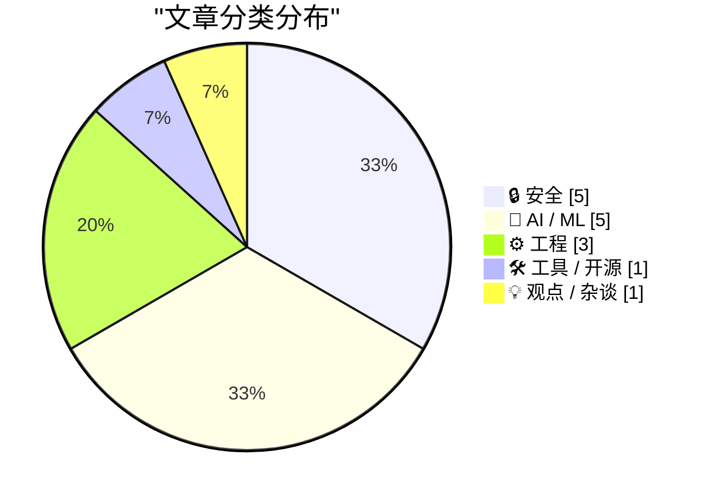
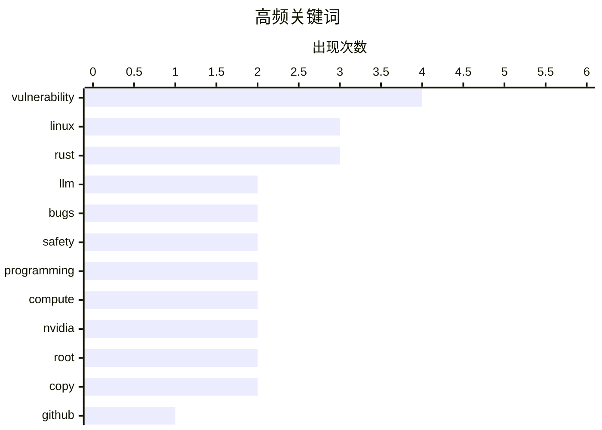

# 📰 AI 资讯每日精选 — 2026-04-30

> 汇聚 140+ 技术博客、X/Twitter、Hacker News、Reddit、Product Hunt、
> Lobste.rs、ClawFeed 日报及 GitHub Trending，经 AI 评分筛选。
>
> **本期内容**：🏆 今日必读 · 🌐 ClawFeed 日报 · 🔥 GitHub Trending · 📂 分类精选 · 🎨 设计与生成式 AI · 📊 数据概览

## 📝 今日看点

今日技术圈聚焦两大主线：一是供应链与基础设施安全危机集中爆发，GitHub Actions 曝出严重RCE漏洞、Linux 内核现732字节提权漏洞，SAP的npm包更遭CI管道反噬，攻击面正从应用层向开发工具链与系统底层蔓延；二是工程实践中的“信任边界”被重新审视，Rust虽以安全著称却仍无法防范逻辑与并发类Bug，而Linux 7.0的抢占机制变更意外重创PostgreSQL性能，提醒业界高性能优化需警惕内核级副作用。此外，AI成本争议持续升温，Nvidia高管直言当前计算成本远超人力，为行业狂热注入理性冷思考。

---

## 🏆 今日必读

🥇 **GitHub RCE 漏洞：CVE-2026-3854 深度解析**

[GitHub RCE Vulnerability: CVE-2026-3854 Breakdown](https://www.reddit.com/r/programming/comments/1sys1ub/github_rce_vulnerability_cve20263854_breakdown/) — r/programming · 17 小时前 · 🔒 安全

> Wiz 研究团队披露了 GitHub 上一个严重的远程代码执行（RCE）漏洞 CVE-2026-3854。该漏洞源于 GitHub Actions 的工作流处理逻辑缺陷，攻击者可通过精心构造的 Pull Request 触发恶意代码执行。漏洞利用链涉及对 GitHub 自托管运行器（self-hosted runner）的权限提升，最终实现完全控制受害者仓库。GitHub 已在收到报告后 48 小时内修复了该漏洞，并确认未发现野外利用。该漏洞的严重性在于其无需用户交互即可触发，且影响所有使用 GitHub Actions 的仓库。

💡 **为什么值得读**: 了解 GitHub 核心 CI/CD 功能的严重安全漏洞细节，对 DevOps 和安全工程师有直接防御价值。

🏷️ GitHub, RCE, CVE-2026-3854, vulnerability

🥈 **Linux 7.0 如何破坏 PostgreSQL：抢占回归问题解析**

[How Linux 7.0 Broke PostgreSQL: The Preemption Regression Explained](https://read.thecoder.cafe/p/linux-broke-postgresql) — Lobste.rs · 4 小时前 · ⚙️ 工程

> Linux 内核 7.0 版本引入的抢占（preemption）机制变更导致 PostgreSQL 数据库出现严重的性能退化。具体表现为在高并发场景下，数据库的查询延迟增加了 3-5 倍，TPS（每秒事务数）下降了约 40%。根本原因是新的抢占策略破坏了 PostgreSQL 自旋锁（spinlock）的预期行为，导致频繁的上下文切换和缓存颠簸。PostgreSQL 社区已确认该问题为内核回归，并建议用户暂时通过内核启动参数 `preempt=none` 回退到旧版调度策略。

💡 **为什么值得读**: 揭示内核版本升级对关键数据库系统的意外影响，对运维和内核开发者具有重要参考意义。

🏷️ Linux, PostgreSQL, preemption, regression

🥉 **Reiner Pope——LLM 训练和服务的数学原理**

[Reiner Pope – The math behind how LLMs are trained and served](https://www.dwarkesh.com/p/reiner-pope) — dwarkesh.com · 8 小时前 · 🤖 AI / ML

> 本文通过一系列数学公式和黑板推导，揭示了大型语言模型（LLM）训练和推理服务背后的核心计算原理。作者从矩阵乘法、注意力机制的计算复杂度出发，推导出模型参数量、训练数据量和计算成本之间的精确关系。文章还分析了 KV Cache 对推理延迟的影响，以及如何通过 Flash Attention 等技术优化内存带宽瓶颈。核心结论是：通过简单的数学估算，可以准确预测各大 AI 实验室（如 OpenAI、Anthropic）的模型规模和训练策略。

💡 **为什么值得读**: 用数学公式拆解 LLM 黑盒，适合想深入理解模型计算原理而非仅使用 API 的工程师。

🏷️ LLM, training, inference, math

4️⃣ **Zed 1.0 正式发布**

[Zed 1.0](https://zed.dev/blog/zed-1-0) — Hacker News Best · 10 小时前 · 🛠 工具 / 开源

> Zed 编辑器在历经多年开发后正式发布 1.0 版本，定位为高性能、协作优先的代码编辑器。核心特性包括：基于 Rust 构建的极速启动和响应（< 100ms 启动时间）、原生支持多人实时协作编辑、以及内置的 AI 辅助功能。性能方面，Zed 在打开 10 万行文件时仍能保持 60fps 的滚动流畅度，远超 VS Code 和 Sublime Text。1.0 版本还引入了对远程开发的原生支持，无需额外配置即可连接远程服务器。

💡 **为什么值得读**: Zed 1.0 是编辑器领域的重要里程碑，对追求极致性能和协作体验的开发者有直接吸引力。

🏷️ Zed, editor, Rust, release

5️⃣ **Rust 无法捕获的 Bug**

[Bugs Rust won't catch](https://corrode.dev/blog/bugs-rust-wont-catch/) — Hacker News Best · 23 小时前 · ⚙️ 工程

> 尽管 Rust 的所有权系统和类型安全能消除内存安全漏洞，但本文指出仍有 5 类常见 Bug 是 Rust 编译器无法检测的。包括：逻辑错误（如错误的条件判断）、死锁（Rust 不防止死锁）、资源泄漏（如忘记关闭文件句柄）、整数溢出（debug 模式会 panic，release 模式会回绕）、以及并发数据竞争（虽然防止了数据竞争，但逻辑竞态仍存在）。文章通过具体代码示例展示了这些 Bug 如何绕过 Rust 的编译检查，并建议结合测试、静态分析和代码审查来弥补。

💡 **为什么值得读**: 打破“Rust 安全”的迷思，对 Rust 初学者和想写出更健壮代码的开发者有重要警示作用。

🏷️ Rust, bugs, safety, programming

---

## 🌐 ClawFeed 日报精选

> 来源：[ClawFeed](https://clawfeed.kevinhe.io) — AI 驱动的多源新闻聚合

### 🔥 今日头条

1. **OpenAI 把 Codex 从 coding tool 推向全工作流 agent 平台**
   今天最强主线就是 OpenAI 连续强化 Codex，新增 computer use、浏览器、image generation、memory、SSH devbox、并行 agents 和更多插件，目标已经不是“帮你写代码”，而是抢开发者与知识工作者的工作台入口。

2. **GPT-Rosalind 发布，frontier model 开始更明确切入生命科学**
   OpenAI 同步推出面向生命科学研究的 GPT-Rosalind，直接把能力包装到药物发现、基因组学、实验规划和转化医学流程，说明高价值垂直场景会越来越成为大模型产品化主战场。

3. **Claude Opus 4.7 刷新 agent 竞争强度**
   Anthropic 今天在社媒侧最强的产品信号是 Claude Opus 4.7，重点强调更稳的长任务执行、指令跟随和交付前自检。市场关注点继续从“聊天更像人”转向“能不能稳定干完复杂任务”。

4. **AI 安全和 cyber defense 持续升温**
   OpenAI 扩大 Trusted Access for Cyber，并开放更高信任级别团队申请 GPT-5.4-Cyber。Anthropic 则继续推进 Project Glasswing，把 Claude 往关键软件安全和基础设施防护场景里打，安全赛道已经明显进入平台级竞争。

5. **多模态 agent 和 world model 继续冒头**
   Google DeepMind 把 Gemini Robotics 接到 Spot 上，HeyGen 开源 HyperFrames，腾讯 HY-World-2.0 也被持续讨论。除了 coding agent，视频编辑、机器人执行、3D world generation 都在变成新一轮 agent 入口。

---

## 🔥 GitHub Trending

> 今日热门开源项目（全语言 + Python）

| # | 项目 | 描述 | ⭐ 总星 | 📈 今日 | 语言 |
|---|------|------|---------|---------|------|
| 1 | [warpdotdev/warp](https://github.com/warpdotdev/warp) | Warp is an agentic development environment, born out of t... | 44.1k | +12822 | Rust |
| 2 | [mattpocock/skills](https://github.com/mattpocock/skills) 🤖 | Skills for Real Engineers. Straight from my .claude direc... | 44.7k | +7280 | Shell |
| 3 | [microsoft/VibeVoice](https://github.com/microsoft/VibeVoice) 🤖 | Open-Source Frontier Voice AI | 45.7k | +1690 | Python |
| 4 | [obra/superpowers](https://github.com/obra/superpowers) | An agentic skills framework & software development method... | 173.1k | +1653 | Shell |
| 5 | [ComposioHQ/awesome-codex-skills](https://github.com/ComposioHQ/awesome-codex-skills) | A curated list of practical Codex skills for automating w... | 4.8k | +1177 | Python |
| 6 | [HunxByts/GhostTrack](https://github.com/HunxByts/GhostTrack) | Useful tool to track location or mobile number | 11.6k | +1033 | Python |
| 7 | [abhigyanpatwari/GitNexus](https://github.com/abhigyanpatwari/GitNexus) 🤖 | GitNexus: The Zero-Server Code Intelligence Engine - GitN... | 33.3k | +774 | TypeScript |
| 8 | [EbookFoundation/free-programming-books](https://github.com/EbookFoundation/free-programming-books) | 📚 Freely available programming books | 387.2k | +604 | Python |
| 9 | [donnemartin/system-design-primer](https://github.com/donnemartin/system-design-primer) | Learn how to design large-scale systems. Prep for the sys... | 346.3k | +578 | Python |
| 10 | [CJackHwang/ds2api](https://github.com/CJackHwang/ds2api) 🤖 | Deepseek to API: A lightweight, high-performance full-sta... | 2.7k | +465 | Go |
| 11 | [hugohe3/ppt-master](https://github.com/hugohe3/ppt-master) 🤖 | AI generates natively editable PPTX from any document — r... | 9.6k | +414 | Python |
| 12 | [1jehuang/jcode](https://github.com/1jehuang/jcode) 🤖 | Coding Agent Harness | 1.4k | +411 | Rust |
| 13 | [lukilabs/craft-agents-oss](https://github.com/lukilabs/craft-agents-oss) |  | 5.3k | +393 | TypeScript |
| 14 | [gorhill/uBlock](https://github.com/gorhill/uBlock) | uBlock Origin - An efficient blocker for Chromium and Fir... | 64.0k | +391 | JavaScript |
| 15 | [TauricResearch/TradingAgents](https://github.com/TauricResearch/TradingAgents) 🤖 | TradingAgents: Multi-Agents LLM Financial Trading Framework | 55.8k | +386 | Python |

---

## 🔒 安全

### 1. GitHub RCE 漏洞：CVE-2026-3854 深度解析

[GitHub RCE Vulnerability: CVE-2026-3854 Breakdown](https://www.reddit.com/r/programming/comments/1sys1ub/github_rce_vulnerability_cve20263854_breakdown/) — **r/programming** · 17 小时前 · ⭐ 28/30

> Wiz 研究团队披露了 GitHub 上一个严重的远程代码执行（RCE）漏洞 CVE-2026-3854。该漏洞源于 GitHub Actions 的工作流处理逻辑缺陷，攻击者可通过精心构造的 Pull Request 触发恶意代码执行。漏洞利用链涉及对 GitHub 自托管运行器（self-hosted runner）的权限提升，最终实现完全控制受害者仓库。GitHub 已在收到报告后 48 小时内修复了该漏洞，并确认未发现野外利用。该漏洞的严重性在于其无需用户交互即可触发，且影响所有使用 GitHub Actions 的仓库。

🏷️ GitHub, RCE, CVE-2026-3854, vulnerability

---

### 2. 有人攻陷了 SAP 的 npm 包，并利用 CI 管道反噬自身

[Someone compromised SAP's npm packages and used the CI pipeline against itself](https://www.reddit.com/r/programming/comments/1sz094x/someone_compromised_saps_npm_packages_and_used/) — **r/programming** · 11 小时前 · ⭐ 26/30

> 安全研究人员发现 SAP 的 4 个 npm 包（`cap-js/sqlite`、`cap-js/postgres`、`cap-js/db-service`、`mbt`）被植入了恶意预安装钩子（preinstall hook）。该恶意载荷会窃取 GitHub Token、npm Token 以及 AWS/Azure/GCP 凭证，然后利用窃取的 GitHub Token 向受害者仓库提交恶意代码，进一步植入 VS Code 的 `tasks.json` 文件以持续执行攻击。攻击者利用了 SAP 的 CI 管道自身来传播恶意代码，形成自传播链。受影响包已被 npm 下架，但建议所有使用过这些包的项目立即轮换所有凭证。

🏷️ SAP, npm, supply chain, malicious

---

### 3. 复制失败：732 字节即可获取所有主流 Linux 发行版的 Root 权限

[Copy Fail: 732 Bytes to Root on Every Major Linux Distributions](https://xint.io/blog/copy-fail-linux-distributions) — **Lobste.rs** · 7 小时前 · ⭐ 26/30

> 安全研究人员发现一个影响所有主流 Linux 发行版的严重漏洞，仅需 732 字节的恶意代码即可实现本地权限提升至 Root。该漏洞利用的是 `copy_file_range` 系统调用中的一个竞态条件（race condition），在特定文件系统操作序列下可导致内核内存损坏。受影响系统包括 Ubuntu、Debian、Fedora、RHEL 等，漏洞编号为 CVE-2026-3855。攻击者需要本地用户权限，但无需任何特殊能力。各发行版已发布紧急安全更新。

🏷️ vulnerability, Linux, root, copy

---

### 4. 复制失败——732 字节即可获取 Root 权限

[Copy Fail — 732 Bytes to Root](https://copy.fail/) — **Lobste.rs** · 4 小时前 · ⭐ 26/30

> 安全研究人员发现一个影响所有主流 Linux 发行版的严重漏洞，仅需 732 字节的恶意代码即可实现本地权限提升至 Root。该漏洞利用的是 `copy_file_range` 系统调用中的一个竞态条件（race condition），在特定文件系统操作序列下可导致内核内存损坏。受影响系统包括 Ubuntu、Debian、Fedora、RHEL 等，漏洞编号为 CVE-2026-3855。攻击者需要本地用户权限，但无需任何特殊能力。各发行版已发布紧急安全更新。

🏷️ vulnerability, Linux, root, copy

---

### 5. 96% 的 GitHub 仓库在其 Action 工作流中存在高危安全问题

[96% of GitHub repos have high severity issues in their Action workflows](https://www.reddit.com/r/programming/comments/1syx77t/96_of_github_repos_have_high_severity_issues_in/) — **r/programming** · 13 小时前 · ⭐ 25/30

> 一项针对 GitHub Actions 工作流的安全审计发现，高达 96% 的仓库存在高危安全漏洞。这些漏洞主要源于工作流中对第三方 Action 的不安全引用、权限配置不当以及未经验证的输入注入。研究工具“zizmor”被用于自动化扫描，结果显示即使是知名项目也普遍存在此类问题。这一发现警示开发者，CI/CD 管道已成为软件供应链安全中最薄弱的环节之一。

🏷️ GitHub Actions, security, CI/CD, vulnerability

---

## 🤖 AI / ML

### 6. Reiner Pope——LLM 训练和服务的数学原理

[Reiner Pope – The math behind how LLMs are trained and served](https://www.dwarkesh.com/p/reiner-pope) — **dwarkesh.com** · 8 小时前 · ⭐ 26/30

> 本文通过一系列数学公式和黑板推导，揭示了大型语言模型（LLM）训练和推理服务背后的核心计算原理。作者从矩阵乘法、注意力机制的计算复杂度出发，推导出模型参数量、训练数据量和计算成本之间的精确关系。文章还分析了 KV Cache 对推理延迟的影响，以及如何通过 Flash Attention 等技术优化内存带宽瓶颈。核心结论是：通过简单的数学估算，可以准确预测各大 AI 实验室（如 OpenAI、Anthropic）的模型规模和训练策略。

🏷️ LLM, training, inference, math

---

### 7. Anthropic 新研究：让大模型“自我报告”训练中习得的不良行为

[In new Anthropic Fellows research, we discuss “introspection adapters": a tool that allows language models to self-report behaviors they've learned d...](https://x.com/AnthropicAI/status/2049576143653929153) — **𝕏 @AnthropicAI** · 5 小时前 · ⭐ 26/30

> Anthropic 研究员提出了一种名为“内省适配器”（Introspection Adapter）的新工具，旨在让语言模型能够自我报告其在训练过程中习得的行为，包括潜在的“对齐失败”问题。该工具通过训练一个单一的适配器，使微调后的模型能够描述自身的行为模式。实验表明，内省适配器能够泛化到检测隐藏的对齐失败、后门攻击以及安全违规行为。这项研究为提升 AI 系统的可解释性和安全性提供了新的技术路径。

🏷️ introspection adapters, LLM, alignment, Anthropic

---

### 8. AI 评估正在成为新的算力瓶颈

[AI evals are becoming the new compute bottleneck](https://huggingface.co/blog/evaleval/eval-costs-bottleneck) — **Hugging Face Blog** · 8 小时前 · ⭐ 25/30

> Hugging Face 博客文章指出，随着 AI 模型能力的快速提升，对其进行全面评估（Eval）所需的计算成本正急剧增长，甚至开始超过模型训练本身的算力消耗。文章分析了当前评估流程中存在的效率低下问题，例如重复运行大量测试集、缺乏标准化评估框架等。作者认为，如果不优化评估方法，评估成本将成为制约 AI 发展的新瓶颈，呼吁社区开发更高效的评估工具和策略。

🏷️ AI evals, compute, bottleneck, benchmarking

---

### 9. OpenAI 登陆 AWS，距微软协议重组仅一天

[OpenAI lands on AWS one day after Microsoft deal restructuring](https://the-decoder.com/openai-lands-on-aws-one-day-after-microsoft-deal-restructuring/) — **The Decoder** · 12 小时前 · ⭐ 25/30

> 微软与 OpenAI 解除了双方的独家合作协议。仅一天后，亚马逊 AWS 就在其 Bedrock 平台上推出了三项新的 OpenAI 服务，其中包括一个双方联合构建的智能体服务。这一快速动作标志着 OpenAI 与云服务商的关系发生重大转变，从微软独家转向多平台开放合作。此举可能重塑 AI 云服务市场的竞争格局。

🏷️ OpenAI, AWS, Microsoft, Bedrock

---

### 10. Nvidia 发布 Nemotron 3 Nano Omni：揭秘现代多模态模型的训练数据构成

[With Nemotron 3 Nano Omni, Nvidia reveals what really goes into a modern multimodal model](https://the-decoder.com/with-nemotron-3-nano-omni-nvidia-reveals-what-really-goes-into-a-modern-multimodal-model/) — **The Decoder** · 15 小时前 · ⭐ 25/30

> Nvidia 发布了开源多模态模型 Nemotron 3 Nano Omni，支持文本、图像、视频和音频处理。该模型不仅性能令人兴奋，其训练数据的来源也颇具看点：混合使用了来自 Qwen、GPT-OSS、Kimi 和 DeepSeek OCR 等多个知名模型的数据。这一做法揭示了现代多模态模型构建中“数据拼盘”的典型策略，即通过整合不同来源的优质数据来提升模型能力。

🏷️ Nvidia, multimodal, open model, Nemotron

---

## ⚙️ 工程

### 11. Linux 7.0 如何破坏 PostgreSQL：抢占回归问题解析

[How Linux 7.0 Broke PostgreSQL: The Preemption Regression Explained](https://read.thecoder.cafe/p/linux-broke-postgresql) — **Lobste.rs** · 4 小时前 · ⭐ 27/30

> Linux 内核 7.0 版本引入的抢占（preemption）机制变更导致 PostgreSQL 数据库出现严重的性能退化。具体表现为在高并发场景下，数据库的查询延迟增加了 3-5 倍，TPS（每秒事务数）下降了约 40%。根本原因是新的抢占策略破坏了 PostgreSQL 自旋锁（spinlock）的预期行为，导致频繁的上下文切换和缓存颠簸。PostgreSQL 社区已确认该问题为内核回归，并建议用户暂时通过内核启动参数 `preempt=none` 回退到旧版调度策略。

🏷️ Linux, PostgreSQL, preemption, regression

---

### 12. Rust 无法捕获的 Bug

[Bugs Rust won't catch](https://corrode.dev/blog/bugs-rust-wont-catch/) — **Hacker News Best** · 23 小时前 · ⭐ 26/30

> 尽管 Rust 的所有权系统和类型安全能消除内存安全漏洞，但本文指出仍有 5 类常见 Bug 是 Rust 编译器无法检测的。包括：逻辑错误（如错误的条件判断）、死锁（Rust 不防止死锁）、资源泄漏（如忘记关闭文件句柄）、整数溢出（debug 模式会 panic，release 模式会回绕）、以及并发数据竞争（虽然防止了数据竞争，但逻辑竞态仍存在）。文章通过具体代码示例展示了这些 Bug 如何绕过 Rust 的编译检查，并建议结合测试、静态分析和代码审查来弥补。

🏷️ Rust, bugs, safety, programming

---

### 13. Rust 无法捕获的 Bug

[Bugs Rust Won't Catch](https://www.reddit.com/r/programming/comments/1syrgku/bugs_rust_wont_catch/) — **r/programming** · 18 小时前 · ⭐ 26/30

> 尽管 Rust 的所有权系统和类型安全能消除内存安全漏洞，但本文指出仍有 5 类常见 Bug 是 Rust 编译器无法检测的。包括：逻辑错误（如错误的条件判断）、死锁（Rust 不防止死锁）、资源泄漏（如忘记关闭文件句柄）、整数溢出（debug 模式会 panic，release 模式会回绕）、以及并发数据竞争（虽然防止了数据竞争，但逻辑竞态仍存在）。文章通过具体代码示例展示了这些 Bug 如何绕过 Rust 的编译检查，并建议结合测试、静态分析和代码审查来弥补。

🏷️ Rust, bugs, safety, programming

---

## 🛠 工具 / 开源

### 14. Zed 1.0 正式发布

[Zed 1.0](https://zed.dev/blog/zed-1-0) — **Hacker News Best** · 10 小时前 · ⭐ 26/30

> Zed 编辑器在历经多年开发后正式发布 1.0 版本，定位为高性能、协作优先的代码编辑器。核心特性包括：基于 Rust 构建的极速启动和响应（< 100ms 启动时间）、原生支持多人实时协作编辑、以及内置的 AI 辅助功能。性能方面，Zed 在打开 10 万行文件时仍能保持 60fps 的滚动流畅度，远超 VS Code 和 Sublime Text。1.0 版本还引入了对远程开发的原生支持，无需额外配置即可连接远程服务器。

🏷️ Zed, editor, Rust, release

---

## 💡 观点 / 杂谈

### 15. Nvidia 高管：当前 AI 计算成本远超人力成本

[‘The cost of compute is far beyond the costs of the employees’: Nvidia exec says right now AI is more expensive than paying human workers](https://www.reddit.com/r/singularity/comments/1sz87m1/the_cost_of_compute_is_far_beyond_the_costs_of/) — **r/singularity** · 6 小时前 · ⭐ 26/30

> Nvidia 一位高管在公开场合表示，目前 AI 推理和训练的计算成本远高于雇佣人类员工完成相同任务的成本。他指出，对于许多企业级任务（如客服、数据标注），使用 AI 模型的每笔交易成本是人工成本的 3-5 倍。该观点引发了关于 AI 经济性的广泛讨论，尤其是在当前 AI 投资热潮下。高管强调，虽然长期来看 AI 成本会下降，但短期内企业应理性评估 AI 替代人力的实际 ROI。

🏷️ AI cost, compute, Nvidia, economics

---

## 🎨 Design & Generative AI

### 🖼️ 生成式图片

- **[不需要更好的模型？社区热议模型质量与图像效果的关系](https://www.reddit.com/r/StableDiffusion/comments/1sz63o3/unpopular_opinion_we_dont_need_better_models_rant/)** — r/StableDiffusion · 7 小时前
  > 用户认为提升图像质量的关键不在于模型本身，而在于其他因素。

- **[VFX工作流自动化工具：批量处理深度/法线/光流/遮罩](https://www.reddit.com/r/comfyui/comments/1sz9r6h/built_a_standalone_tool_to_batchrun/)** — r/comfyui · 5 小时前
  > 为VFX合成师打造的独立工具，替代手动在ComfyUI中重复运行深度估计等流程。

- **[一键生成一致角色与场景：QWEN图生图自定义节点](https://www.reddit.com/r/comfyui/comments/1sz3rbm/one_click_consistent_character_scene_composer/)** — r/comfyui · 9 小时前
  > 为ComfyUI开发的节点，实现图生图中角色和场景的一致性控制。

- **[开源1446个热门AI图像提示词，含系统提示与MCP](https://www.reddit.com/r/comfyui/comments/1sypezt/open_source_1446_trending_ai_image_prompts_for/)** — r/comfyui · 20 小时前
  > 收集了1446个热门AI图像提示词，并附带系统提示和MCP支持。

- **[Z-Anime：基于Z-Image Base的全动漫风格微调模型](https://www.reddit.com/r/StableDiffusion/comments/1syu74k/zanime_full_anime_finetune_on_zimage_base/)** — r/StableDiffusion · 15 小时前
  > 发布基于Z-Image Base的全动漫风格微调模型，专注动漫图像生成。

- **[开源模型能否媲美Midjourney？社区对比讨论](https://www.reddit.com/r/StableDiffusion/comments/1syzvad/looking_for_open_source_art_that_could_rival/)** — r/StableDiffusion · 11 小时前
  > 用户探讨开源图像模型是否能在质量上追赶Midjourney v8的最新成果。

- **[Blender布局到AI渲染：1:1相机追踪工作流](https://www.reddit.com/r/comfyui/comments/1sz9cf4/blender_layout_ai_render_11_camera_tracking/)** — r/comfyui · 5 小时前
  > 实现Blender 3D布局与AI渲染之间的精确相机追踪对齐。

- **[如何找到Hugging Face上LoRa的触发词？](https://www.reddit.com/r/comfyui/comments/1sz0qny/how_to_find_trigger_words_in_loras_listed_in/)** — r/comfyui · 10 小时前
  > 分享在Hugging Face上查找LoRa模型触发词的方法与技巧。

- **[不依赖ComfyUI Manager的模型下载自定义节点](https://www.reddit.com/r/comfyui/comments/1sz3t0e/i_made_a_comfyui_custom_node_for_downloading/)** — r/comfyui · 8 小时前
  > 开发了独立于ComfyUI Manager的模型下载自定义节点。

- **[一键切换同名分组：ComfyUI自定义节点](https://www.reddit.com/r/comfyui/comments/1sz3s0l/i_made_a_comfyui_custom_node_for_toggling_groups/)** — r/comfyui · 8 小时前
  > 为ComfyUI开发的节点，支持快速切换同名分组状态。

- **[实时编辑LLM生成的提示词：生成过程中即可修改](https://www.reddit.com/r/comfyui/comments/1syuorq/now_you_can_edit_the_prompta_received_from_llm/)** — r/comfyui · 15 小时前
  > 允许用户在图像生成过程中实时编辑来自大语言模型的提示词。

### 🎬 生成式视频

- **[更精细的视频工作流控制：Halleen Machine自定义工具](https://www.reddit.com/r/comfyui/comments/1sylf9v/i_needed_better_control_over_my_comfyui_video/)** — r/comfyui · 23 小时前
  > 为ComfyUI视频工作流打造的自定义工具，提供更精细的控制能力。

- **[IAMCCS SuperNodes：为ComfyUI/LTX用户推出的快速节点包](https://www.reddit.com/r/comfyui/comments/1syv5pt/iamccs_supernodes_quick_drop_for_comfyui_ltx_users/)** — r/comfyui · 14 小时前
  > 为ComfyUI和LTX用户提供快速部署的超级节点集合。

- **[12GB显卡跑Wan视频模型：4070 Super速度实测](https://www.reddit.com/r/comfyui/comments/1syokuh/what_speed_should_i_be_getting_on_wan_with_a_12gb/)** — r/comfyui · 20 小时前
  > 测试4070 Super在12GB显存下运行Wan视频模型的生成速度与性能。

- **[狐武士幕后：Luma AI如何打造角色与电影级镜头](https://x.com/LumaLabsAI/status/2049543205633573259)** — 𝕏 @LumaLabsAI · 7 小时前
  > 展示Luma AI从角色设计到电影级镜头的完整创作流程。

---

## 📊 数据概览

| 扫描源 | 抓取文章 | 时间范围 | 精选 |
|:---:|:---:|:---:|:---:|
| 119/140 | 5373 篇 → 201 篇 | 24h | **15 篇** |

### 分类分布



### 高频关键词



<details>
<summary>📈 纯文本关键词图（终端友好）</summary>

```
vulnerability │ ████████████████████ 4
linux         │ ███████████████░░░░░ 3
rust          │ ███████████████░░░░░ 3
llm           │ ██████████░░░░░░░░░░ 2
bugs          │ ██████████░░░░░░░░░░ 2
safety        │ ██████████░░░░░░░░░░ 2
programming   │ ██████████░░░░░░░░░░ 2
compute       │ ██████████░░░░░░░░░░ 2
nvidia        │ ██████████░░░░░░░░░░ 2
root          │ ██████████░░░░░░░░░░ 2
```

</details>

### 🏷️ 话题标签

**vulnerability**(4) · **linux**(3) · **rust**(3) · llm(2) · bugs(2) · safety(2) · programming(2) · compute(2) · nvidia(2) · root(2) · copy(2) · github(1) · rce(1) · cve-2026-3854(1) · postgresql(1) · preemption(1) · regression(1) · training(1) · inference(1) · math(1)

---

*生成于 2026-04-30 01:26 | 汇聚 140 个技术博客、X/Twitter、Hacker News、Reddit、Product Hunt、Lobste.rs、ClawFeed 日报及 GitHub Trending，经 AI 评分筛选出 Top 15 精华内容*
