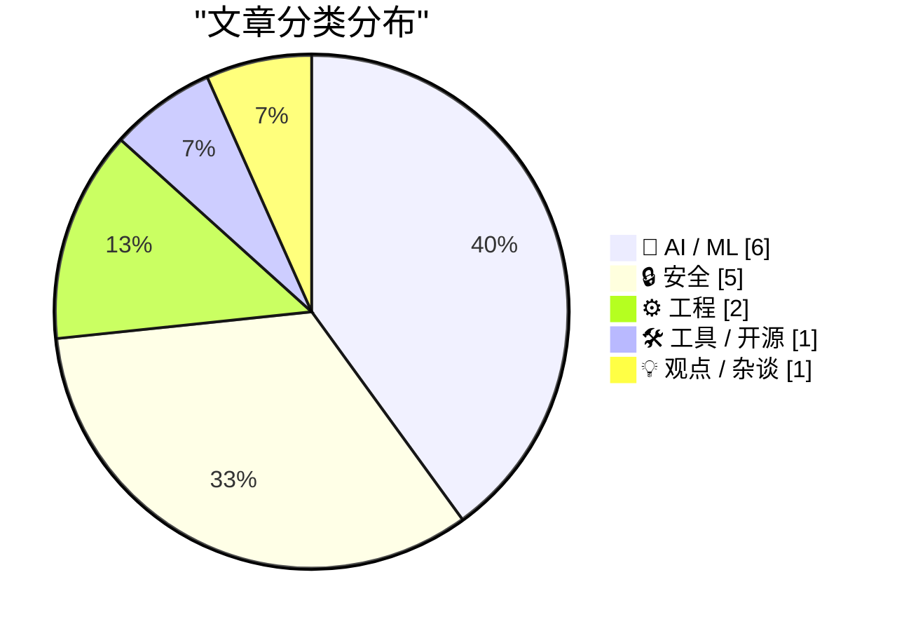
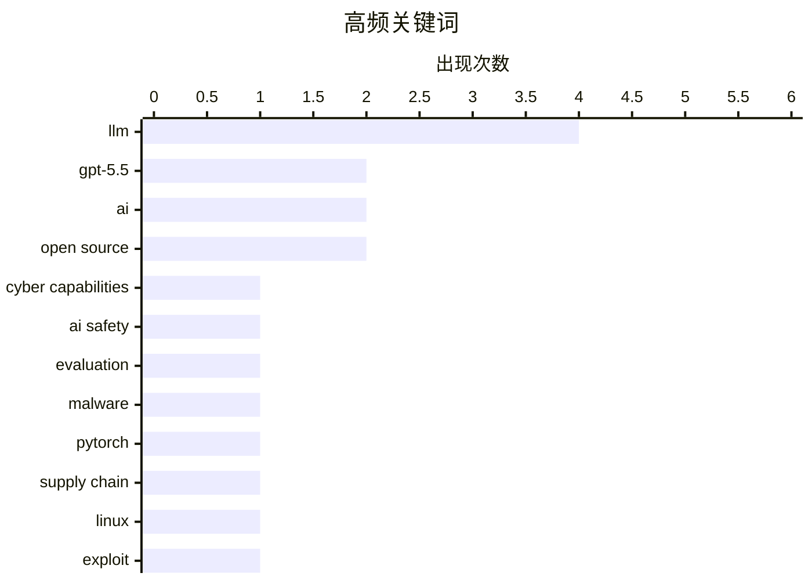

# 📰 AI 资讯每日精选 — 2026-05-01

> 汇聚 140+ 技术博客、X/Twitter、Hacker News、Reddit、Product Hunt、
> Lobste.rs、ClawFeed 日报及 GitHub Trending，经 AI 评分筛选。
>
> **本期内容**：🏆 今日必读 · 🌐 ClawFeed 日报 · 🔥 GitHub Trending · 📂 分类精选 · 🎨 设计与生成式 AI · 📊 数据概览

## 📝 今日看点

今日技术圈聚焦于AI安全与供应链风险的深度交织：英国AI安全研究所对GPT-5.5的评估揭示了前沿模型在网络安全漏洞发现上的能力边界，而PyTorch Lightning等主流AI工具链中植入的恶意软件，则敲响了开源生态安全的警钟。与此同时，业界对AI能力的认知正在回归理性，多篇文章批判了将大语言模型简单类比为“初级工程师”的误区，强调其统计模式与人类推理的本质差异。此外，从Linux内核“Copy Fail”漏洞到Discord因邮件通知引发的级联故障，基础设施的脆弱性依然是不可忽视的暗流。

---

## 🏆 今日必读

🥇 **英国AI安全研究所对OpenAI GPT-5.5网络能力的评估**

[Our evaluation of OpenAI's GPT-5.5 cyber capabilities](https://simonwillison.net/2026/Apr/30/gpt-55-cyber-capabilities/#atom-everything) — simonwillison.net · 2 小时前 · 🤖 AI / ML

> 英国AI安全研究所（AISI）发布了针对OpenAI GPT-5.5在网络安全漏洞发现能力上的评估报告。评估结果显示，GPT-5.5在寻找安全漏洞方面的能力与之前评估的Claude Mythos相当。与Mythos不同的是，GPT-5.5已经面向公众开放使用，这意味着其潜在的网络攻击能力可能被更广泛地利用。该评估是AISI对前沿AI模型进行系统性安全测试的一部分。

💡 **为什么值得读**: 这是官方安全机构对最新顶级AI模型网络攻击能力的权威评估，直接关系到AI安全政策和模型部署风险判断。

🏷️ GPT-5.5, cyber capabilities, AI safety, evaluation

🥈 **在PyTorch Lightning AI训练库中发现沙虫主题恶意软件**

[Shai-Hulud Themed Malware Found in the PyTorch Lightning AI Training Library](https://semgrep.dev/blog/2026/malicious-dependency-in-pytorch-lightning-used-for-ai-training/) — Hacker News Best · 9 小时前 · 🔒 安全

> 安全研究团队在流行的AI训练库PyTorch Lightning中发现了一个名为“Shai-Hulud”（沙虫）的恶意依赖包。该恶意软件被植入到PyTorch Lightning的依赖链中，可能影响使用该库进行AI训练的开发者。攻击者通过伪装成合法依赖包的方式，在AI开发生态系统中实施供应链攻击。该发现再次敲响了AI开源软件供应链安全的警钟。

💡 **为什么值得读**: 揭示了AI开发工具链中真实发生的供应链攻击案例，对任何使用PyTorch Lightning的AI团队都是直接的安全威胁预警。

🏷️ malware, PyTorch, supply chain, AI

🥉 **Copy Fail：一个影响自2017年以来所有Linux发行版的漏洞**

[Copy Fail: an exploit for all Linux distributions since 2017](https://www.reddit.com/r/programming/comments/1szrkre/copy_fail_an_exploit_for_all_linux_distributions/) — r/programming · 15 小时前 · 🔒 安全

> 安全研究人员披露了一个名为“Copy Fail”的漏洞，该漏洞影响自2017年以来的所有Linux发行版。该漏洞存在于Linux内核的copy_from_user()等关键内存拷贝函数中，攻击者可以利用它实现权限提升或信息泄露。由于该漏洞涉及内核基础功能，影响范围极其广泛，几乎覆盖了所有现代Linux系统。目前各发行版正在紧急推送安全补丁。

💡 **为什么值得读**: 这是一个影响所有Linux系统的通用内核漏洞，无论你是开发者、运维还是普通用户，都需要立即了解并修复。

🏷️ Linux, exploit, security, vulnerability

4️⃣ **大语言模型不是初级工程师**

[The LLM Is Not a Junior Engineer](https://jacobharr.is/personal/llm-not-junior-engineer) — Lobste.rs · 8 小时前 · 🤖 AI / ML

> 文章批判了将LLM（大语言模型）类比为“初级工程师”的常见观点。作者认为，LLM的工作方式与人类工程师有本质区别：LLM缺乏真正的理解、记忆和推理能力，其输出基于统计模式而非逻辑。将LLM视为初级工程师会导致对其能力的过度信任和错误使用，尤其是在需要深度技术判断和责任的场景中。作者呼吁业界重新审视LLM的角色定位，将其视为一种强大的工具而非替代品。

💡 **为什么值得读**: 挑战了业界流行的“LLM=初级工程师”叙事，提供了更深刻的视角来理解AI能力的边界和正确使用方式。

🏷️ LLM, engineering, junior, misconception

5️⃣ **反DDoS公司对巴西ISP发动大规模攻击**

[Anti-DDoS Firm Heaped Attacks on Brazilian ISPs](https://krebsonsecurity.com/2026/04/anti-ddos-firm-heaped-attacks-on-brazilian-isps/) — krebsonsecurity.com · 11 小时前 · 🔒 安全

> KrebsOnSecurity调查发现，一家专门提供DDoS防护的巴西科技公司，其网络被用于发动针对其他巴西网络运营商的大规模DDoS攻击。该公司的CEO声称恶意活动源于安全入侵，并怀疑是竞争对手为了抹黑公司形象所为。这一事件暴露了网络安全行业中“以子之矛攻子之盾”的黑色产业链，以及DDoS防护服务本身可能成为攻击源的风险。

💡 **为什么值得读**: 揭露了网络安全行业内部的阴暗面，一个反DDoS公司反而成为DDoS攻击的源头，极具讽刺和警示意义。

🏷️ DDoS, botnet, anti-DDoS, Brazil

---

## 🌐 ClawFeed 日报精选

> 来源：[ClawFeed](https://clawfeed.kevinhe.io) — AI 驱动的多源新闻聚合

### 🔥 今日头条

1. **OpenAI 把 Codex 从 coding tool 推向全工作流 agent 平台**
   今天最强主线就是 OpenAI 连续强化 Codex，新增 computer use、浏览器、image generation、memory、SSH devbox、并行 agents 和更多插件，目标已经不是“帮你写代码”，而是抢开发者与知识工作者的工作台入口。

2. **GPT-Rosalind 发布，frontier model 开始更明确切入生命科学**
   OpenAI 同步推出面向生命科学研究的 GPT-Rosalind，直接把能力包装到药物发现、基因组学、实验规划和转化医学流程，说明高价值垂直场景会越来越成为大模型产品化主战场。

3. **Claude Opus 4.7 刷新 agent 竞争强度**
   Anthropic 今天在社媒侧最强的产品信号是 Claude Opus 4.7，重点强调更稳的长任务执行、指令跟随和交付前自检。市场关注点继续从“聊天更像人”转向“能不能稳定干完复杂任务”。

4. **AI 安全和 cyber defense 持续升温**
   OpenAI 扩大 Trusted Access for Cyber，并开放更高信任级别团队申请 GPT-5.4-Cyber。Anthropic 则继续推进 Project Glasswing，把 Claude 往关键软件安全和基础设施防护场景里打，安全赛道已经明显进入平台级竞争。

5. **多模态 agent 和 world model 继续冒头**
   Google DeepMind 把 Gemini Robotics 接到 Spot 上，HeyGen 开源 HyperFrames，腾讯 HY-World-2.0 也被持续讨论。除了 coding agent，视频编辑、机器人执行、3D world generation 都在变成新一轮 agent 入口。

---

## 🔥 GitHub Trending

> 今日热门开源项目（全语言 + Python）

| # | 项目 | 描述 | ⭐ 总星 | 📈 今日 | 语言 |
|---|------|------|---------|---------|------|
| 1 | [warpdotdev/warp](https://github.com/warpdotdev/warp) | Warp is an agentic development environment, born out of t... | 49.3k | +8399 | Rust |
| 2 | [mattpocock/skills](https://github.com/mattpocock/skills) 🤖 | Skills for Real Engineers. Straight from my .claude direc... | 49.5k | +6187 | Shell |
| 3 | [TauricResearch/TradingAgents](https://github.com/TauricResearch/TradingAgents) 🤖 | TradingAgents: Multi-Agents LLM Financial Trading Framework | 57.8k | +2023 | Python |
| 4 | [obra/superpowers](https://github.com/obra/superpowers) | An agentic skills framework & software development method... | 174.6k | +1632 | Shell |
| 5 | [HunxByts/GhostTrack](https://github.com/HunxByts/GhostTrack) | Useful tool to track location or mobile number | 12.2k | +841 | Python |
| 6 | [soxoj/maigret](https://github.com/soxoj/maigret) | 🕵️‍♂️ Collect a dossier on a person by username from 300... | 20.8k | +730 | Python |
| 7 | [1jehuang/jcode](https://github.com/1jehuang/jcode) 🤖 | Coding Agent Harness | 1.9k | +675 | Rust |
| 8 | [ComposioHQ/awesome-codex-skills](https://github.com/ComposioHQ/awesome-codex-skills) | A curated list of practical Codex skills for automating w... | 5.2k | +567 | Python |
| 9 | [microsoft/VibeVoice](https://github.com/microsoft/VibeVoice) 🤖 | Open-Source Frontier Voice AI | 46.1k | +561 | Python |
| 10 | [EbookFoundation/free-programming-books](https://github.com/EbookFoundation/free-programming-books) | 📚 Freely available programming books | 387.4k | +442 | Python |
| 11 | [nikopueringer/CorridorKey](https://github.com/nikopueringer/CorridorKey) | Perfect Green Screen Keys | 12.6k | +358 | Python |
| 12 | [ghostty-org/ghostty](https://github.com/ghostty-org/ghostty) | 👻 Ghostty is a fast, feature-rich, and cross-platform te... | 52.9k | +341 | Zig |
| 13 | [public-apis/public-apis](https://github.com/public-apis/public-apis) | A collective list of free APIs | 429.5k | +322 | Python |
| 14 | [lukilabs/craft-agents-oss](https://github.com/lukilabs/craft-agents-oss) |  | 5.6k | +319 | TypeScript |
| 15 | [iamgio/quarkdown](https://github.com/iamgio/quarkdown) | 🪐 Markdown with superpowers: from ideas to papers, prese... | 13.1k | +177 | Kotlin |

---

## 🤖 AI / ML

### 1. 英国AI安全研究所对OpenAI GPT-5.5网络能力的评估

[Our evaluation of OpenAI's GPT-5.5 cyber capabilities](https://simonwillison.net/2026/Apr/30/gpt-55-cyber-capabilities/#atom-everything) — **simonwillison.net** · 2 小时前 · ⭐ 27/30

> 英国AI安全研究所（AISI）发布了针对OpenAI GPT-5.5在网络安全漏洞发现能力上的评估报告。评估结果显示，GPT-5.5在寻找安全漏洞方面的能力与之前评估的Claude Mythos相当。与Mythos不同的是，GPT-5.5已经面向公众开放使用，这意味着其潜在的网络攻击能力可能被更广泛地利用。该评估是AISI对前沿AI模型进行系统性安全测试的一部分。

🏷️ GPT-5.5, cyber capabilities, AI safety, evaluation

---

### 2. 大语言模型不是初级工程师

[The LLM Is Not a Junior Engineer](https://jacobharr.is/personal/llm-not-junior-engineer) — **Lobste.rs** · 8 小时前 · ⭐ 27/30

> 文章批判了将LLM（大语言模型）类比为“初级工程师”的常见观点。作者认为，LLM的工作方式与人类工程师有本质区别：LLM缺乏真正的理解、记忆和推理能力，其输出基于统计模式而非逻辑。将LLM视为初级工程师会导致对其能力的过度信任和错误使用，尤其是在需要深度技术判断和责任的场景中。作者呼吁业界重新审视LLM的角色定位，将其视为一种强大的工具而非替代品。

🏷️ LLM, engineering, junior, misconception

---

### 3. Claude Code在提交信息提及“OpenClaw”时拒绝执行或额外收费

[Claude Code refuses requests or charges extra if your commits mention "OpenClaw"](https://twitter.com/theo/status/2049645973350363168) — **Hacker News Best** · 10 小时前 · ⭐ 25/30

> 用户发现Anthropic的AI编程工具Claude Code在检测到Git提交信息中包含“OpenClaw”一词时，会出现异常行为：要么直接拒绝执行命令，要么在执行后收取额外费用。该现象引发了关于AI模型是否存在隐藏的“触发词”或“后门”的广泛讨论。目前Anthropic尚未对此事做出官方回应，社区正在热烈猜测其背后的原因。

🏷️ Claude, AI ethics, bias, LLM

---

### 4. Qwen-Scope: Official Sparse Autoencoders (SAEs) for Qwen 3.5 models

[Qwen-Scope: Official Sparse Autoencoders (SAEs) for Qwen 3.5 models](https://www.reddit.com/r/LocalLLaMA/comments/1szrbub/qwenscope_official_sparse_autoencoders_saes_for/) — **r/LocalLLaMA** · 15 小时前 · ⭐ 25/30

> <table> <tr><td> <a href="https://www.reddit.com/r/LocalLLaMA/comments/1szrbub/qwenscope_official_sparse_autoencoders_saes_for/">  <!-- SC_OFF --><div class="md"><p>I've spent the last few weeks running real multi-file coding tasks through small local models and small cloud models on free tiers. Wanted to share the failure points

🏷️ coding agent, local model, failure analysis, small LLM

---

### 6. GPT5.5 slightly outperformed Mythos on a multi-step cyber-attack simulation. One challenge that took a human expert 12 hrs took GPT-5.5 only 11 min at a $1.73 cost

[GPT5.5 slightly outperformed Mythos on a multi-step cyber-attack simulation. One challenge that took a human expert 12 hrs took GPT-5.5 only 11 min at a $1.73 cost](https://www.reddit.com/r/singularity/comments/1t02oxw/gpt55_slightly_outperformed_mythos_on_a_multistep/) — **r/singularity** · 8 小时前 · ⭐ 25/30

> <table> <tr><td> <a href="https://www.reddit.com/r/singularity/comments/1t02oxw/gpt55_slightly_outperformed_mythos_on_a_multistep/">  安全研究团队在流行的AI训练库PyTorch Lightning中发现了一个名为“Shai-Hulud”（沙虫）的恶意依赖包。该恶意软件被植入到PyTorch Lightning的依赖链中，可能影响使用该库进行AI训练的开发者。攻击者通过伪装成合法依赖包的方式，在AI开发生态系统中实施供应链攻击。该发现再次敲响了AI开源软件供应链安全的警钟。

🏷️ malware, PyTorch, supply chain, AI

---

### 8. Copy Fail：一个影响自2017年以来所有Linux发行版的漏洞

[Copy Fail: an exploit for all Linux distributions since 2017](https://www.reddit.com/r/programming/comments/1szrkre/copy_fail_an_exploit_for_all_linux_distributions/) — **r/programming** · 15 小时前 · ⭐ 27/30

> 安全研究人员披露了一个名为“Copy Fail”的漏洞，该漏洞影响自2017年以来的所有Linux发行版。该漏洞存在于Linux内核的copy_from_user()等关键内存拷贝函数中，攻击者可以利用它实现权限提升或信息泄露。由于该漏洞涉及内核基础功能，影响范围极其广泛，几乎覆盖了所有现代Linux系统。目前各发行版正在紧急推送安全补丁。

🏷️ Linux, exploit, security, vulnerability

---

### 9. 反DDoS公司对巴西ISP发动大规模攻击

[Anti-DDoS Firm Heaped Attacks on Brazilian ISPs](https://krebsonsecurity.com/2026/04/anti-ddos-firm-heaped-attacks-on-brazilian-isps/) — **krebsonsecurity.com** · 11 小时前 · ⭐ 26/30

> KrebsOnSecurity调查发现，一家专门提供DDoS防护的巴西科技公司，其网络被用于发动针对其他巴西网络运营商的大规模DDoS攻击。该公司的CEO声称恶意活动源于安全入侵，并怀疑是竞争对手为了抹黑公司形象所为。这一事件暴露了网络安全行业中“以子之矛攻子之盾”的黑色产业链，以及DDoS防护服务本身可能成为攻击源的风险。

🏷️ DDoS, botnet, anti-DDoS, Brazil

---

### 10. OpenAI为ChatGPT账户推出高级账户安全功能

[Now available for ChatGPT accounts: Advanced Account Security, a new opt-in setting for people at higher risk of digital attacks, with stronger protec...](https://x.com/OpenAI/status/2049902506881462613) — **𝕏 @OpenAI** · 8 小时前 · ⭐ 26/30

> OpenAI宣布为ChatGPT账户推出新的可选设置“高级账户安全”（Advanced Account Security）。该功能专为面临更高数字攻击风险的用户设计，提供了更强的保护措施，包括抗钓鱼登录和更安全的账户恢复流程。用户可以在设置中主动开启此功能，以增强账户的安全性。

🏷️ ChatGPT, account security, phishing-resistant, OpenAI

---

### 11. LinkedIn扫描6278个浏览器扩展并将结果加密嵌入每个请求

[LinkedIn scans for 6,278 extensions and encrypts the results into every request](https://404privacy.com/blog/linkedin-is-scanning-your-browser-extensions-this-is-how-they-use-the-data/) — **Hacker News Best** · 5 小时前 · ⭐ 25/30

> 隐私研究机构404 Privacy发现，LinkedIn会在用户访问其网站时扫描浏览器中安装的6278个已知扩展。扫描结果会被加密并作为请求的一部分发送到LinkedIn服务器。LinkedIn声称此举用于安全分析和反欺诈，但该行为引发了严重的隐私担忧，因为扩展信息可能泄露用户的软件配置、兴趣爱好甚至身份。该研究详细分析了LinkedIn如何收集和使用这些数据。

🏷️ privacy, browser extensions, LinkedIn, tracking

---

## ⚙️ 工程

### 12. 邮件太多：Discord 2026年3月25日语音服务宕机幕后

[You’ve Got (Too Much) Mail: Behind the Scenes of the 3/25/26 Voice Outage](https://www.reddit.com/r/programming/comments/1t06td1/youve_got_too_much_mail_behind_the_scenes_of_the/) — **r/programming** · 5 小时前 · ⭐ 26/30

> Discord官方详细复盘了2026年3月25日发生的严重语音服务中断事故。事故的根本原因是系统在处理大量入站邮件通知时，触发了某个内部服务的级联故障，导致语音服务器集群过载。文章深入分析了故障的传播路径、监控盲区以及事后采取的修复措施，包括限流、熔断和架构优化。这是一个典型的大规模分布式系统因“流量洪峰”导致雪崩的案例。

🏷️ Discord, outage, postmortem, scalability

---

### 13. Mozilla's opposition to Chrome's Prompt API

[Mozilla's opposition to Chrome's Prompt API](https://github.com/mozilla/standards-positions/issues/1213#issuecomment-4347988313) — **Hacker News Best** · 17 小时前 · ⭐ 25/30

> Article URL: https://github.com/mozilla/standards-positions/issues/1213#issuecomment-4347988313
Comments URL: https://news.ycombinator.com/item?id=47959463
Points: 581
# Comments: 215

🏷️ browser, API, Mozilla, Chrome

---

## 🛠 工具 / 开源

### 14. 一个仅用5000行Python实现的可破解ML编译器栈

[A Hackable ML Compiler Stack in 5,000 Lines of Python [P]](https://www.reddit.com/r/MachineLearning/comments/1t07zff/a_hackable_ml_compiler_stack_in_5000_lines_of/) — **r/MachineLearning** · 5 小时前 · ⭐ 26/30

> 作者从零开始构建了一个仅约5000行纯Python代码的机器学习编译器参考实现。该项目旨在解决现有ML编译器（如TVM、PyTorch Inductor）代码量庞大、难以理解的问题。它覆盖了ML编译器的核心设计，包括图优化、算子调度和代码生成等关键环节。这个项目为学习和研究ML编译器提供了一个轻量级、可读性极高的教学工具。

🏷️ ML compiler, Python, LLM, open source

---

## 💡 观点 / 杂谈

### 15. The Zig project's rationale for their anti-AI contribution policy

[The Zig project's rationale for their anti-AI contribution policy](https://simonwillison.net/2026/Apr/30/zig-anti-ai/) — **Hacker News Best** · 23 小时前 · ⭐ 25/30

> Article URL: https://simonwillison.net/2026/Apr/30/zig-anti-ai/
Comments URL: https://news.ycombinator.com/item?id=47957294
Points: 635
# Comments: 422

🏷️ Zig, AI, open source, policy

---

## 🎨 Design & Generative AI

### 🖥️ 生成式 UI

- **[Luma Agents：从目标到审美，全自动生成网站](https://x.com/LumaLabsAI/status/2049951480598466773)** — 𝕏 @LumaLabsAI · 4 小时前
  > Luma Agents可根据用户设定的目标和审美，自动生成网站的Hero区、文案、视觉和布局。

- **[ComfyUI iPad版：Apple Pencil鼠标插件](https://www.reddit.com/r/comfyui/comments/1szktj3/apple_pencil_support_for_ipad/)** — r/comfyui · 21 小时前
  > 利用Claude开发了一个插件，让Apple Pencil在iPad上充当鼠标，改善ComfyUI使用体验。

### 🖼️ 生成式图片

- **[ComfyUI自定义节点：云端GPU跑图无需本地显卡](https://www.reddit.com/r/comfyui/comments/1szlfqj/i_built_a_comfyui_custom_node_that_routes_your/)** — r/comfyui · 21 小时前
  > 一个ComfyUI自定义节点，可将工作流路由到Modal云端GPU，无需本地显卡即可运行。

- **[三周尝试修复AI皮肤纹理：负面提示词是死胡同](https://www.reddit.com/r/comfyui/comments/1szt9lk/i_spent_3_weeks_trying_to_fix_ai_skin_with/)** — r/comfyui · 14 小时前
  > 作者用三周时间尝试通过负面提示词修复AI生成皮肤的纹理问题，最终认为此方法无效。

- **[2026年4月ComfyUI更新汇总](https://www.reddit.com/r/comfyui/comments/1t0cy9m/comfyui_releases_you_missed_april_2026/)** — r/comfyui · 1 小时前
  > 盘点2026年4月ComfyUI的各类新发布，包括工作流管理、UI工具等，数量较上月翻倍。

- **[如何在ComfyUI中构建、运行和扩展高质量创作者工作流](https://developer.nvidia.com/blog/how-to-build-run-and-scale-high-quality-creator-workflows-in-comfyui/)** — NVIDIA Technical Blog · 9 小时前
  > NVIDIA技术博客介绍如何利用ComfyUI加速创意和可视化团队的资产生成流程。

- **[ComfyUI版本升级导致输出不一致问题](https://www.reddit.com/r/comfyui/comments/1t00b3n/comfyui_v0201_frontend_14215_producing_different/)** — r/comfyui · 9 小时前
  > 用户发现ComfyUI v0.20.1与v0.19.x在相同工作流、种子和LoRA下产生不同输出。

- **[盲测对比：Z-Image Turbo vs Klein 9B蒸馏模型](https://www.reddit.com/r/StableDiffusion/comments/1szjm1c/blind_realism_test_z_image_turbo_vs_klein_9b/)** — r/StableDiffusion · 22 小时前
  > 发起一项盲测，比较Z-Image Turbo和Klein 9B蒸馏模型在真实感方面的表现。

- **[Luma Agents：一键调整物体尺寸与比例](https://x.com/LumaLabsAI/status/2049985008920879594)** — 𝕏 @LumaLabsAI · 2 小时前
  > Luma Labs推出新功能，用户上传参考图并设定尺寸，Luma Agents自动完成缩放调整。

- **[Multi Injection：改进版身份迁移节点即将发布](https://www.reddit.com/r/StableDiffusion/comments/1szqdtl/multi_injection_incoming/)** — r/StableDiffusion · 16 小时前
  > 作者正在开发一个更强大的身份迁移节点，支持从多个参考图注入身份特征。

- **[Z-Image Turbo：多风格易用工作流与LoRA管理器](https://www.reddit.com/r/StableDiffusion/comments/1t067yk/zimage_turbo_easy_to_use_various_styles_lora/)** — r/StableDiffusion · 6 小时前
  > 分享一个Z-Image Turbo的易用工作流，包含多种风格和LoRA管理器及触发器。

- **[Mac M3 Max最佳Stable Diffusion UI选择对比](https://www.reddit.com/r/StableDiffusion/comments/1t07vum/best_stable_diffusion_ui_for_mac_m3_max_forge_neo/)** — r/StableDiffusion · 5 小时前
  > 对比Forge Neo、SDNext、SwarmUI和ComfyUI在Mac M3 Max上的表现，为用户提供选择建议。

- **[一个月从基础到面部细节与一致性（Z-Image Turbo）](https://www.reddit.com/r/comfyui/comments/1t0ea6v/my_one_month_journey_from_basic_to_this_face/)** — r/comfyui · 46 分钟前
  > 分享一个月内使用Z-Image Turbo在面部细节和一致性上的进步历程。

- **[10款模型背景干净度对比评测](https://www.reddit.com/r/StableDiffusion/comments/1szomwo/background_cleanliness_comparison_10_models/)** — r/StableDiffusion · 18 小时前
  > 对比10款文生图模型在背景干净度上的表现，指出许多模型背景存在噪点和脏污问题。

### 🎬 生成式视频

- **[Mocap Surgeon：视频转3D动作捕捉与清理节点](https://www.reddit.com/r/comfyui/comments/1sztd11/mocap_surgeon_videoto3d_motion_capture_and/)** — r/comfyui · 14 小时前
  > 一个用于Yedp Action Director的ComfyUI节点，支持视频到3D动作捕捉及动作清理。

---

## 📊 数据概览

| 扫描源 | 抓取文章 | 时间范围 | 精选 |
|:---:|:---:|:---:|:---:|
| 116/140 | 5347 篇 → 220 篇 | 24h | **15 篇** |

### 分类分布



### 高频关键词



<details>
<summary>📈 纯文本关键词图（终端友好）</summary>

```
llm                │ ████████████████████ 4
gpt-5.5            │ ██████████░░░░░░░░░░ 2
ai                 │ ██████████░░░░░░░░░░ 2
open source        │ ██████████░░░░░░░░░░ 2
cyber capabilities │ █████░░░░░░░░░░░░░░░ 1
ai safety          │ █████░░░░░░░░░░░░░░░ 1
evaluation         │ █████░░░░░░░░░░░░░░░ 1
malware            │ █████░░░░░░░░░░░░░░░ 1
pytorch            │ █████░░░░░░░░░░░░░░░ 1
supply chain       │ █████░░░░░░░░░░░░░░░ 1
```

</details>

### 🏷️ 话题标签

**llm**(4) · **gpt-5.5**(2) · **ai**(2) · open source(2) · cyber capabilities(1) · ai safety(1) · evaluation(1) · malware(1) · pytorch(1) · supply chain(1) · linux(1) · exploit(1) · security(1) · vulnerability(1) · engineering(1) · junior(1) · misconception(1) · ddos(1) · botnet(1) · anti-ddos(1)

---

*生成于 2026-05-01 01:30 | 汇聚 140 个技术博客、X/Twitter、Hacker News、Reddit、Product Hunt、Lobste.rs、ClawFeed 日报及 GitHub Trending，经 AI 评分筛选出 Top 15 精华内容*
