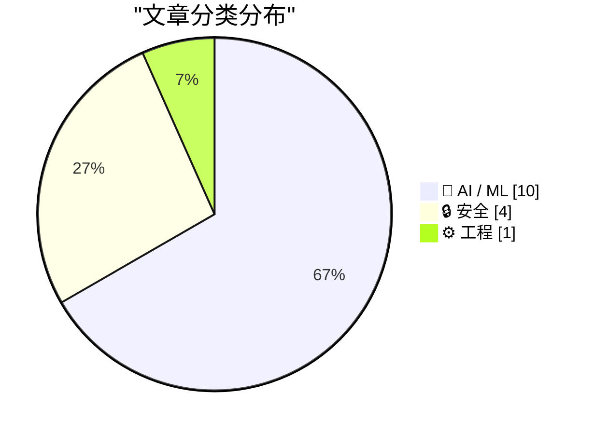
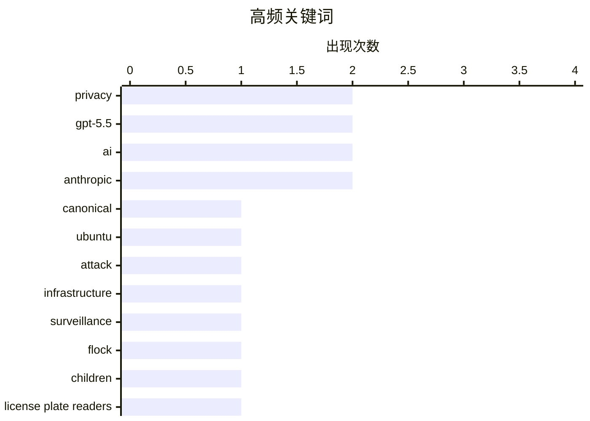

# 📰 AI 资讯每日精选 — 2026-05-02

> 汇聚 140+ 技术博客、X/Twitter、Hacker News、Reddit、Product Hunt、
> Lobste.rs、ClawFeed 日报及 GitHub Trending，经 AI 评分筛选。
>
> **本期内容**：🏆 今日必读 · 🌐 ClawFeed 日报 · 🔥 GitHub Trending · 📂 分类精选 · 🎨 设计与生成式 AI · 📊 数据概览

## 📝 今日看点

今日技术圈呈现两大焦点：AI 编程工具需求爆发式增长，Uber 四个月内烧光全年预算用于 Claude Code，同时 GPT-5.5 发布一周即成为史上最成功模型，API 收入增速翻倍；另一方面，安全与隐私危机持续发酵，Canonical 基础设施遭攻击宕机超一天，美国警察被曝多次滥用车牌读取器跟踪私人对象，监控公司 Flock 更因在儿童体操房内进行未公开的摄像头演示而引发争议。此外，AI 评估正取代训练成为新的计算瓶颈，而英国 NHS 关闭开源代码仓库的决定则标志着开源协作在公共领域遭遇重大倒退。

---

## 🏆 今日必读

🥇 **Canonical 正遭受攻击**

[Canonical is under attack](https://status.canonical.com/) — Lobste.rs · 4 小时前 · 🔒 安全

> Canonical（Ubuntu 的母公司）的基础设施已宕机超过一天，疑似遭受网络攻击。此次事件导致 Ubuntu 相关的软件包更新、镜像下载以及部分服务无法正常访问。Ars Technica 的报道确认了该事件的严重性，并指出这是近年来 Canonical 遭遇的最严重的中断之一。目前官方尚未公布具体的攻击细节和恢复时间表。

💡 **为什么值得读**: 如果你是 Ubuntu 用户或依赖 Canonical 基础设施的开发者，这篇文章能让你第一时间了解这次重大宕机事件的原因和影响范围。

🏷️ Canonical, Ubuntu, attack, infrastructure

🥈 **城市发现 Flock 在儿童体操房内访问摄像头作为销售演示，但仍续签了合同**

[City Learns Flock Accessed Cameras in Children's Gymnastics Room as a Sales Demo](https://www.404media.co/city-learns-flock-accessed-cameras-in-childrens-gymnastics-room-as-a-sales-pitch-demo-renews-contract-anyway/) — Hacker News Best · 6 小时前 · 🔒 安全

> 监控公司 Flock 被曝在未公开的情况下，将儿童体操房的摄像头接入其系统，作为向市政府推销产品的销售演示。尽管该行为引发了严重的隐私担忧，但该城市最终仍然与 Flock 续签了合同。此事件暴露了公共安全监控领域在销售流程和隐私保护上的巨大漏洞。

💡 **为什么值得读**: 这篇文章揭露了监控公司如何利用公共设施进行越界销售，对理解当前公共监控的隐私风险具有警示意义。

🏷️ privacy, surveillance, Flock, children

🥉 **警察至少 14 次使用车牌读取器跟踪恋爱对象**

[Police Have Used License Plate Readers at Least 14x to Stalk Romantic Interests](https://ij.org/police-have-reportedly-used-license-plate-readers-to-stalk-romantic-interests-at-least-14-times-in-recent-years/) — Hacker News Best · 9 小时前 · 🔒 安全

> 调查显示，美国警察在近年中至少 14 次滥用车牌读取器（LPR）数据，用于跟踪其恋爱或私人关系对象。这些行为涉及未经授权的个人目的查询，严重侵犯了公民隐私。该报告由司法研究所（IJ）发布，揭示了执法部门对监控工具的普遍滥用现象。

💡 **为什么值得读**: 这篇文章用具体案例和数据揭示了执法部门滥用监控技术的系统性风险，对关注公民隐私和执法权力边界的人至关重要。

🏷️ privacy, license plate readers, stalking, police

4️⃣ **Uber 在四个月内烧光了 2026 年全年的 AI 预算，全部用于 Claude Code**

[Uber torches 2026 AI budget on Claude Code in four months](https://www.briefs.co/news/uber-torches-entire-2026-ai-budget-on-claude-code-in-four-months/) — Hacker News Best · 9 小时前 · 🤖 AI / ML

> Uber 在短短四个月内，将其 2026 年全年的 AI 预算全部花费在 Anthropic 的 AI 编程工具 Claude Code 上。这一举动表明企业对 AI 辅助编程的需求极其旺盛，但也引发了关于预算管理和投资回报率的激烈讨论。该事件在 Hacker News 上获得了 365 个点赞和 423 条评论，成为社区热议焦点。

💡 **为什么值得读**: 这篇文章提供了一个极端案例，展示了企业对 AI 编程工具的疯狂投入，对于评估 AI 在软件开发中的实际成本和价值具有重要参考。

🏷️ Uber, Claude Code, AI budget, cost

5️⃣ **博客：AI 评估正在成为新的计算瓶颈**

[Blog: AI evals are becoming the new compute bottleneck](https://www.reddit.com/r/LocalLLaMA/comments/1t0ovtl/blog_ai_evals_are_becoming_the_new_compute/) — r/LocalLLaMA · 15 小时前 · 🤖 AI / ML

> 随着 AI 模型能力的提升，对模型进行准确、全面的评估（Eval）所需的计算资源正急剧增长，甚至开始超过模型训练本身的计算需求。文章指出，评估环节正在取代训练，成为 AI 研发流程中新的计算瓶颈。这迫使研究者和企业必须重新思考评估策略，以平衡成本与效果。

💡 **为什么值得读**: 这篇文章提出了一个被广泛忽视但日益严重的问题，对于从事 AI 模型开发、部署和成本优化的从业者具有前瞻性指导意义。

🏷️ AI evals, compute bottleneck, LLM evaluation

---

## 🌐 ClawFeed 日报精选

> 来源：[ClawFeed](https://clawfeed.kevinhe.io) — AI 驱动的多源新闻聚合

### 🔥 今日头条

1. **OpenAI 把 Codex 从 coding tool 推向全工作流 agent 平台**
   今天最强主线就是 OpenAI 连续强化 Codex，新增 computer use、浏览器、image generation、memory、SSH devbox、并行 agents 和更多插件，目标已经不是“帮你写代码”，而是抢开发者与知识工作者的工作台入口。

2. **GPT-Rosalind 发布，frontier model 开始更明确切入生命科学**
   OpenAI 同步推出面向生命科学研究的 GPT-Rosalind，直接把能力包装到药物发现、基因组学、实验规划和转化医学流程，说明高价值垂直场景会越来越成为大模型产品化主战场。

3. **Claude Opus 4.7 刷新 agent 竞争强度**
   Anthropic 今天在社媒侧最强的产品信号是 Claude Opus 4.7，重点强调更稳的长任务执行、指令跟随和交付前自检。市场关注点继续从“聊天更像人”转向“能不能稳定干完复杂任务”。

4. **AI 安全和 cyber defense 持续升温**
   OpenAI 扩大 Trusted Access for Cyber，并开放更高信任级别团队申请 GPT-5.4-Cyber。Anthropic 则继续推进 Project Glasswing，把 Claude 往关键软件安全和基础设施防护场景里打，安全赛道已经明显进入平台级竞争。

5. **多模态 agent 和 world model 继续冒头**
   Google DeepMind 把 Gemini Robotics 接到 Spot 上，HeyGen 开源 HyperFrames，腾讯 HY-World-2.0 也被持续讨论。除了 coding agent，视频编辑、机器人执行、3D world generation 都在变成新一轮 agent 入口。

---

## 🔥 GitHub Trending

> 今日热门开源项目（全语言 + Python）

| # | 项目 | 描述 | ⭐ 总星 | 📈 今日 | 语言 |
|---|------|------|---------|---------|------|
| 1 | [mattpocock/skills](https://github.com/mattpocock/skills) 🤖 | Skills for Real Engineers. Straight from my .claude direc... | 52.6k | +3645 | Shell |
| 2 | [warpdotdev/warp](https://github.com/warpdotdev/warp) | Warp is an agentic development environment, born out of t... | 51.5k | +3401 | Rust |
| 3 | [TauricResearch/TradingAgents](https://github.com/TauricResearch/TradingAgents) 🤖 | TradingAgents: Multi-Agents LLM Financial Trading Framework | 59.9k | +2112 | Python |
| 4 | [obra/superpowers](https://github.com/obra/superpowers) | An agentic skills framework & software development method... | 175.6k | +1096 | Shell |
| 5 | [public-apis/public-apis](https://github.com/public-apis/public-apis) | A collective list of free APIs | 430.0k | +716 | Python |
| 6 | [soxoj/maigret](https://github.com/soxoj/maigret) | 🕵️‍♂️ Collect a dossier on a person by username from 300... | 21.7k | +535 | Python |
| 7 | [1jehuang/jcode](https://github.com/1jehuang/jcode) 🤖 | Coding Agent Harness | 2.4k | +403 | Rust |
| 8 | [hugohe3/ppt-master](https://github.com/hugohe3/ppt-master) 🤖 | AI generates natively editable PPTX from any document — r... | 10.4k | +370 | Python |
| 9 | [browserbase/skills](https://github.com/browserbase/skills) 🤖 | Claude Agent SDK with a web browsing tool | 1.2k | +334 | JavaScript |
| 10 | [AIDC-AI/Pixelle-Video](https://github.com/AIDC-AI/Pixelle-Video) 🤖 | 🚀 AI 全自动短视频引擎 | AI Fully Automated Short Video Engine | 8.7k | +296 | Python |
| 11 | [nikopueringer/CorridorKey](https://github.com/nikopueringer/CorridorKey) | Perfect Green Screen Keys | 12.8k | +215 | Python |
| 12 | [Flowseal/zapret-discord-youtube](https://github.com/Flowseal/zapret-discord-youtube) |  | 27.0k | +145 | Batchfile |
| 13 | [google-research/timesfm](https://github.com/google-research/timesfm) | TimesFM (Time Series Foundation Model) is a pretrained ti... | 19.2k | +132 | Python |
| 14 | [github/awesome-copilot](https://github.com/github/awesome-copilot) 🤖 | Community-contributed instructions, agents, skills, and c... | 31.9k | +116 | Python |
| 15 | [simstudioai/sim](https://github.com/simstudioai/sim) 🤖 | Build, deploy, and orchestrate AI agents. Sim is the cent... | 28.2k | +56 | TypeScript |

---

## 🤖 AI / ML

### 1. Uber 在四个月内烧光了 2026 年全年的 AI 预算，全部用于 Claude Code

[Uber torches 2026 AI budget on Claude Code in four months](https://www.briefs.co/news/uber-torches-entire-2026-ai-budget-on-claude-code-in-four-months/) — **Hacker News Best** · 9 小时前 · ⭐ 26/30

> Uber 在短短四个月内，将其 2026 年全年的 AI 预算全部花费在 Anthropic 的 AI 编程工具 Claude Code 上。这一举动表明企业对 AI 辅助编程的需求极其旺盛，但也引发了关于预算管理和投资回报率的激烈讨论。该事件在 Hacker News 上获得了 365 个点赞和 423 条评论，成为社区热议焦点。

🏷️ Uber, Claude Code, AI budget, cost

---

### 2. 博客：AI 评估正在成为新的计算瓶颈

[Blog: AI evals are becoming the new compute bottleneck](https://www.reddit.com/r/LocalLLaMA/comments/1t0ovtl/blog_ai_evals_are_becoming_the_new_compute/) — **r/LocalLLaMA** · 15 小时前 · ⭐ 26/30

> 随着 AI 模型能力的提升，对模型进行准确、全面的评估（Eval）所需的计算资源正急剧增长，甚至开始超过模型训练本身的计算需求。文章指出，评估环节正在取代训练，成为 AI 研发流程中新的计算瓶颈。这迫使研究者和企业必须重新思考评估策略，以平衡成本与效果。

🏷️ AI evals, compute bottleneck, LLM evaluation

---

### 3. OpenAI：GPT-5.5 发布一周，已成为史上最强模型发布

[One week since the launch of GPT-5.5, and it’s already our strongest model launch yet. API revenue is growing more than 2x faster than any prior rele...](https://x.com/OpenAI/status/2050250926888468929) — **𝕏 @OpenAI** · 8 小时前 · ⭐ 26/30

> OpenAI 宣布 GPT-5.5 发布仅一周，已成为其历史上最成功的模型发布。API 收入增长速度是此前任何一次发布的两倍以上，其中 Codex 的营收在七天内翻了一番，主要得益于企业对智能编码工具需求的持续攀升。

🏷️ GPT-5.5, OpenAI, API, Codex

---

### 4. 八家科技巨头与五角大楼签约，在机密网络上打造“AI 优先的战斗力量”

[Eight tech giants sign Pentagon deals to build an "AI-first fighting force" across classified networks](https://the-decoder.com/eight-tech-giants-sign-pentagon-deals-to-build-an-ai-first-fighting-force-across-classified-networks/) — **The Decoder** · 8 小时前 · ⭐ 25/30

> 八家科技公司已与美国五角大楼签署协议，为机密军事网络提供 AI 能力，旨在构建“AI 优先的战斗力量”。值得注意的是，Anthropic 因拒绝接受使用条款并被标记为安全风险而缺席该名单。这标志着 AI 在军事领域的应用进入新阶段，同时也引发了关于伦理和安全的讨论。

🏷️ AI, military, Pentagon, Anthropic

---

### 5. ChatGPT 对哥布林的痴迷虽好笑，却指向了 AI 训练中的深层问题

[ChatGPT's goblin obsession may be hilarious, but it points to a deeper problem in AI training](https://the-decoder.com/chatgpts-goblin-obsession-may-be-hilarious-but-it-points-to-a-deeper-problem-in-ai-training/) — **The Decoder** · 11 小时前 · ⭐ 25/30

> ChatGPT 模型在回答中频繁出现“哥布林”、“小妖精”等奇幻生物，原因是在训练过程中一个错误的奖励信号导致模型过度学习。OpenAI 表示，这展示了微小且调校不当的训练激励如何产生意想不到的副作用，揭示了 AI 训练中奖励机制设计的脆弱性。

🏷️ ChatGPT, training, reward signal, hallucination

---

### 6. 英国 AI 安全研究所发现：GPT-5.5 在网络攻击测试中与 Claude Mythos 持平

[GPT-5.5 matches Claude Mythos in cyber attack tests, UK AI Security Institute finds](https://the-decoder.com/gpt-5-5-matches-claude-mythos-in-cyber-attack-tests-uk-ai-security-institute-finds/) — **The Decoder** · 14 小时前 · ⭐ 25/30

> 英国 AI 安全研究所（UK AISI）的测试显示，OpenAI 的 GPT-5.5 成为第二个能够自主完成完整网络攻击模拟的 AI 模型，其性能几乎与 Anthropic 的 Claude Mythos 持平。Claude Mythos 目前仍仅对少数群体开放，而 GPT-5.5 已通过 ChatGPT 和 API 广泛部署。

🏷️ GPT-5.5, cyber attack, AI security, Claude Mythos

---

### 7. Grok 4.3

[Grok 4.3](https://docs.x.ai/developers/models/grok-4.3) — **Hacker News Best** · 16 小时前 · ⭐ 25/30

> Article URL: https://docs.x.ai/developers/models/grok-4.3
Comments URL: https://news.ycombinator.com/item?id=47972447
Points: 372
# Comments: 498

🏷️ Grok, LLM, xAI, model release

---

### 8. I spent years building a 103B-token Usenet corpus (1980–2013) and finally documented it [P]

[I spent years building a 103B-token Usenet corpus (1980–2013) and finally documented it [P]](https://www.reddit.com/r/MachineLearning/comments/1t10xaf/i_spent_years_building_a_103btoken_usenet_corpus/) — **r/MachineLearning** · 7 小时前 · ⭐ 25/30

> <!-- SC_OFF --><div class="md"><p>For the past several years I've been quietly assembling and processing what I believe is one of the larger privately held pretraining corpora around... a complete Use

🏷️ Usenet, corpus, pretraining, dataset

---

### 9. Google Deepmind's "AI co-clinician" beats GPT-5.4 in blind doctor tests but still trails experienced physicians

[Google Deepmind's "AI co-clinician" beats GPT-5.4 in blind doctor tests but still trails experienced physicians](https://the-decoder.com/google-deepminds-ai-co-clinician-beats-gpt-5-4-in-blind-doctor-tests-but-still-trails-experienced-physicians/) — **The Decoder** · 15 小时前 · ⭐ 24/30

> Google Deepmind is building an "AI co-clinician" to help doctors care for patients. The system shows promising results in simulation studies but still trails experienced physicians. The research also 

🏷️ AI co-clinician, healthcare, GPT-5.4, Deepmind

---

### 10. Mistral's new flagship Medium 3.5 folds chat, reasoning, and code into one model

[Mistral's new flagship Medium 3.5 folds chat, reasoning, and code into one model](https://the-decoder.com/mistrals-new-flagship-medium-3-5-folds-chat-reasoning-and-code-into-one-model/) — **The Decoder** · 16 小时前 · ⭐ 24/30

> Mistral's new flagship, Mistral Medium 3.5, merges what used to be separate models for chat, reasoning, and code into a single product. The French company is also adding asynchronous cloud agents to i

🏷️ Mistral, Medium 3.5, multimodal, agents

---

## 🔒 安全

### 11. Canonical 正遭受攻击

[Canonical is under attack](https://status.canonical.com/) — **Lobste.rs** · 4 小时前 · ⭐ 27/30

> Canonical（Ubuntu 的母公司）的基础设施已宕机超过一天，疑似遭受网络攻击。此次事件导致 Ubuntu 相关的软件包更新、镜像下载以及部分服务无法正常访问。Ars Technica 的报道确认了该事件的严重性，并指出这是近年来 Canonical 遭遇的最严重的中断之一。目前官方尚未公布具体的攻击细节和恢复时间表。

🏷️ Canonical, Ubuntu, attack, infrastructure

---

### 12. 城市发现 Flock 在儿童体操房内访问摄像头作为销售演示，但仍续签了合同

[City Learns Flock Accessed Cameras in Children's Gymnastics Room as a Sales Demo](https://www.404media.co/city-learns-flock-accessed-cameras-in-childrens-gymnastics-room-as-a-sales-pitch-demo-renews-contract-anyway/) — **Hacker News Best** · 6 小时前 · ⭐ 26/30

> 监控公司 Flock 被曝在未公开的情况下，将儿童体操房的摄像头接入其系统，作为向市政府推销产品的销售演示。尽管该行为引发了严重的隐私担忧，但该城市最终仍然与 Flock 续签了合同。此事件暴露了公共安全监控领域在销售流程和隐私保护上的巨大漏洞。

🏷️ privacy, surveillance, Flock, children

---

### 13. 警察至少 14 次使用车牌读取器跟踪恋爱对象

[Police Have Used License Plate Readers at Least 14x to Stalk Romantic Interests](https://ij.org/police-have-reportedly-used-license-plate-readers-to-stalk-romantic-interests-at-least-14-times-in-recent-years/) — **Hacker News Best** · 9 小时前 · ⭐ 26/30

> 调查显示，美国警察在近年中至少 14 次滥用车牌读取器（LPR）数据，用于跟踪其恋爱或私人关系对象。这些行为涉及未经授权的个人目的查询，严重侵犯了公民隐私。该报告由司法研究所（IJ）发布，揭示了执法部门对监控工具的普遍滥用现象。

🏷️ privacy, license plate readers, stalking, police

---

### 14. Anthropic launches Claude Security to give defenders the same AI edge attackers already have

[Anthropic launches Claude Security to give defenders the same AI edge attackers already have](https://the-decoder.com/anthropic-launches-claude-security-to-give-defenders-the-same-ai-edge-attackers-already-have/) — **The Decoder** · 12 小时前 · ⭐ 24/30

> Anthropic wants to give cyber defenders an edge with Claude Security, drawing on the same offensive capabilities it recently deemed too dangerous to release in another model.
The article Anthropic lau

🏷️ Anthropic, Claude Security, cybersecurity, AI

---

## ⚙️ 工程

### 15. 英国国家医疗服务体系（NHS）向开源宣战

[NHS Goes To War Against Open Source](https://shkspr.mobi/blog/2026/05/nhs-goes-to-war-against-open-source/) — **shkspr.mobi** · 13 小时前 · ⭐ 25/30

> 英国 NHS 正准备关闭其几乎所有的开源代码仓库。作者曾任职于英国政府多个数字部门并大力倡导开源，对此举表示极度失望。NHS 的这一决定被认为是对过去多年开源协作成果的严重倒退，可能影响医疗系统的透明度和创新效率。

🏷️ NHS, open source, government, policy

---

## 🎨 Design & Generative AI

### 🖼️ 生成式图片

- **[缩小ComfyUI PNG文件而不丢失工作流的小工具](https://www.reddit.com/r/comfyui/comments/1t13wnk/i_made_a_small_windows_app_to_shrink_comfyui_pngs/)** — r/comfyui · 5 小时前
  > 一款Windows应用，可在不丢失工作流数据的情况下压缩ComfyUI生成的PNG图片。

- **[逃离ComfyUI依赖地狱的求助](https://www.reddit.com/r/comfyui/comments/1t12gsn/help_me_escape_the_dependency_hell/)** — r/comfyui · 6 小时前
  > 用户因频繁重装ComfyUI环境而苦恼，寻求管理依赖的有效策略。

- **[三步一键LoRA构建器：提取、标注、训练](https://www.reddit.com/r/StableDiffusion/comments/1t0yirq/built_a_3step_allinone_lora_builder_for_anima/)** — r/StableDiffusion · 8 小时前
  > 为Anima平台打造的集成式LoRA模型构建工具，简化了从数据提取到训练的全流程。

- **[复刻被封锁的高级面部细节工作流](https://www.reddit.com/r/comfyui/comments/1t12tz1/remade_the_gatekept_advanced_face_detail_workflow/)** — r/comfyui · 6 小时前
  > 重新制作了Z-Image Turbo中曾被限制访问的高级面部细节处理工作流。

- **[为ComfyUI打造的Plex式管理平台](https://www.reddit.com/r/comfyui/comments/1t1avym/i_made_the_plex_for_comfyui/)** — r/comfyui · 47 分钟前
  > 面向普通用户的项目，旨在简化ComfyUI节点操作，无需复杂连线即可使用。

- **[SenseNova U1信息图测试：密集文本处理更优](https://www.reddit.com/r/comfyui/comments/1t0gl9l/sensenova_u1_infographic_test_better_at_handling/)** — r/comfyui · 22 小时前
  > 测试显示SenseNova U1模型在处理密集文字信息图方面表现更佳。

- **[MMAudio音频生成模型适配苹果芯片](https://www.reddit.com/r/comfyui/comments/1t0up6n/mmaudio_on_apple_silicon/)** — r/comfyui · 11 小时前
  > MMAudio模型推出苹果Silicon兼容版本，仅需少量修改即可运行。

- **[安全提示词包v4.0：689种风格33类](https://www.reddit.com/r/StableDiffusion/comments/1t0q5hf/sfw_prompt_pack_v40/)** — r/StableDiffusion · 14 小时前
  > 更新版提示词包新增20种风格，涵盖相机角度、摄影姿势及暗黑奇幻主题。

- **[批量图像描述生成器桌面应用](https://www.reddit.com/r/StableDiffusion/comments/1t12ezt/batch_image_captioning_generator/)** — r/StableDiffusion · 6 小时前
  > 一款GUI工具，利用VLM/LLaVA模型批量生成图像描述文本。

- **[FLUX.2训练的火柴盒海报LoRA：每日生成2880种动物](https://www.reddit.com/r/StableDiffusion/comments/1t0s2ge/i_trained_a_matchboxposter_lora_on_flux2_running/)** — r/StableDiffusion · 12 小时前
  > 基于FLUX.2模型训练的LoRA，持续运行生成大量独特动物风格海报。

- **[Midjourney出问题？无法复现v6提示词与风格](https://www.reddit.com/r/midjourney/comments/1t0hynh/midjourney_busted_cant_replicate_v6_prompts_styles/)** — r/midjourney · 21 小时前
  > 用户反映Midjourney无法再生成与v6版本相同的提示词效果和风格。

### 🎬 生成式视频

- **[LTX-2.3提示中继：蒸馏版GGUF工作流](https://www.reddit.com/r/comfyui/comments/1t0uvm1/ltx23_prompt_relay_distilled_gguf_workflow/)** — r/comfyui · 10 小时前
  > 针对LTX-2.3视频生成模型的提示中继优化工作流，采用蒸馏GGUF格式。

- **[ComfyUI视频合并增强版插件](https://www.reddit.com/r/StableDiffusion/comments/1t0ndue/comfyui_video_combine_plus/)** — r/StableDiffusion · 16 小时前
  > ComfyUI插件，提供更强大的视频合并与处理功能。

- **[视频数据集工厂：ComfyUI工作流包](https://www.reddit.com/r/StableDiffusion/comments/1t18nbe/video_dataset_factory/)** — r/StableDiffusion · 2 小时前
  > 一套用于视频数据集创建和整理的ComfyUI工作流工具包。

- **[防止VAE显存溢出错误的小技巧](https://www.reddit.com/r/comfyui/comments/1t1516i/i_found_an_useful_trick_to_prevent_vae_oom_errors/)** — r/comfyui · 4 小时前
  > 针对LTX2.3视频生成中的VAE OOM问题，分享在RX 6800显卡上的有效解决方案。

---

## 📊 数据概览

| 扫描源 | 抓取文章 | 时间范围 | 精选 |
|:---:|:---:|:---:|:---:|
| 116/140 | 5321 篇 → 201 篇 | 24h | **15 篇** |

### 分类分布



### 高频关键词



<details>
<summary>📈 纯文本关键词图（终端友好）</summary>

```
privacy        │ ████████████████████ 2
gpt-5.5        │ ████████████████████ 2
ai             │ ████████████████████ 2
anthropic      │ ████████████████████ 2
canonical      │ ██████████░░░░░░░░░░ 1
ubuntu         │ ██████████░░░░░░░░░░ 1
attack         │ ██████████░░░░░░░░░░ 1
infrastructure │ ██████████░░░░░░░░░░ 1
surveillance   │ ██████████░░░░░░░░░░ 1
flock          │ ██████████░░░░░░░░░░ 1
```

</details>

### 🏷️ 话题标签

**privacy**(2) · **gpt-5.5**(2) · **ai**(2) · anthropic(2) · canonical(1) · ubuntu(1) · attack(1) · infrastructure(1) · surveillance(1) · flock(1) · children(1) · license plate readers(1) · stalking(1) · police(1) · uber(1) · claude code(1) · ai budget(1) · cost(1) · ai evals(1) · compute bottleneck(1)

---

*生成于 2026-05-02 01:20 | 汇聚 140 个技术博客、X/Twitter、Hacker News、Reddit、Product Hunt、Lobste.rs、ClawFeed 日报及 GitHub Trending，经 AI 评分筛选出 Top 15 精华内容*
