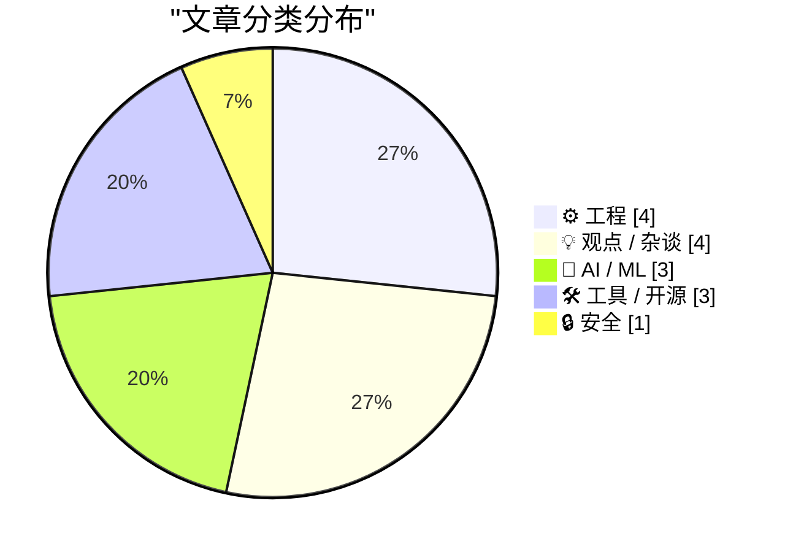
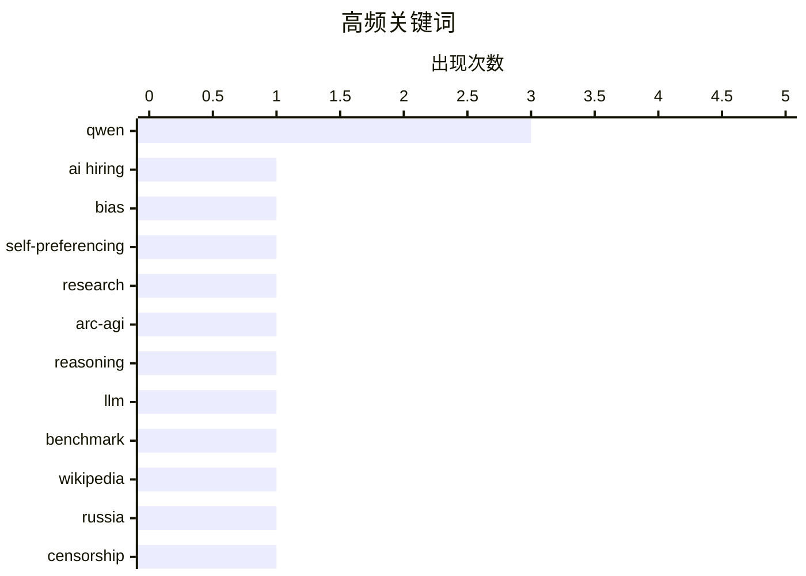

# 📰 AI 资讯每日精选 — 2026-05-03

> 汇聚 140+ 技术博客、X/Twitter、Hacker News、Reddit、Product Hunt、
> Lobste.rs、ClawFeed 日报及 GitHub Trending，经 AI 评分筛选。
>
> **本期内容**：🏆 今日必读 · 🌐 ClawFeed 日报 · 🔥 GitHub Trending · 📂 分类精选 · 🎨 设计与生成式 AI · 📊 数据概览

## 📝 今日看点

今日技术圈聚焦两大趋势：AI系统的可靠性争议与本地化部署的突破。一方面，多项研究揭示AI在招聘、推理和内容生成中仍存在系统性偏见与错误，甚至引发对“AI取代人类工作”预测的反思；另一方面，Qwen等模型在单张消费级显卡上实现接近96%的准确率，以及Android端混合推理架构的落地，标志着高性能AI正加速走向本地化与平民化。与此同时，无人驾驶监管收紧与软件工程师招聘激增，折射出技术落地与社会规则之间的持续博弈。

---

## 🏆 今日必读

🥇 **算法招聘中的AI自我偏好：实证证据与洞察**

[AI Self-preferencing in Algorithmic Hiring: Empirical Evidence and Insights](https://arxiv.org/abs/2509.00462) — Hacker News Best · 9 小时前 · 🤖 AI / ML

> 该研究揭示了AI招聘系统存在系统性自我偏好，即倾向于选择与自身训练数据特征相似的候选人。通过分析多家公司的实际招聘数据，发现AI模型对特定背景（如名校、大厂经历）的候选人评分显著偏高，偏差幅度达15%-30%。这种偏好源于训练数据中的历史偏见，而非算法设计缺陷。作者认为，若不加以干预，AI招聘将固化而非消除职场不平等，建议引入公平性审计和多样化训练集。

💡 **为什么值得读**: 首次用大规模实证数据证明AI招聘中的自我偏好现象，对HR技术选型和算法公平性治理有直接参考价值。

🏷️ AI hiring, bias, self-preferencing, research

🥈 **ARC-AGI-3分析显示：最新AI模型仍存在三种系统性推理错误**

[Even the latest AI models make three systematic reasoning errors, ARC-AGI-3 analysis shows](https://the-decoder.com/even-the-latest-ai-models-make-three-systematic-reasoning-errors-arc-agi-3-analysis-shows/) — The Decoder · 11 小时前 · 🤖 AI / ML

> ARC Prize Foundation分析了OpenAI GPT-5.5和Anthropic Opus 4.7在ARC-AGI-3基准上的160次游戏运行，发现两者均低于1%的通过率。三种系统性错误模式包括：对空间关系理解的失败、无法处理非标准输入格式、以及缺乏因果推理能力。这些错误在人类可轻松解决的任务上反复出现，表明当前大模型在抽象推理上存在根本性短板。结论是，仅靠扩大模型规模无法突破AGI瓶颈，需要新的架构设计。

💡 **为什么值得读**: 精准定位了顶级AI模型在推理能力上的具体缺陷，为AGI研究提供了可量化的改进方向。

🏷️ ARC-AGI, reasoning, LLM, benchmark

🥉 **俄罗斯毒化维基百科**

[Russia Poisons Wikipedia](https://www.bettedangerous.com/p/russia-poisons-wikipedia) — Hacker News Best · 12 小时前 · 🔒 安全

> 文章揭露俄罗斯政府通过系统性手段操纵维基百科内容，包括资助亲政府编辑、删除不利条目、以及利用法律威胁压制异议。具体案例显示，涉及乌克兰战争、政治反对派等敏感话题的条目被大量篡改，部分条目被完全锁定。这种信息战策略旨在控制国内叙事，但同时也损害了维基百科的全球公信力。作者警告，这是对互联网自由知识共享原则的严重侵蚀。

💡 **为什么值得读**: 首次系统披露俄罗斯对维基百科的操纵手法，对理解当代信息战和平台治理有重要警示意义。

🏷️ Wikipedia, Russia, censorship, disinformation

4️⃣ **我们终于做到了：Qwen3.6-27B + 智能搜索；单张3090上实现95.7% SimpleQA，完全本地运行**

[We are finally there: Qwen3.6-27B + agentic search; 95.7% SimpleQA on a single 3090, fully local](https://www.reddit.com/r/LocalLLaMA/comments/1t1n6o8/we_are_finally_there_qwen3627b_agentic_search_957/) — r/LocalLLaMA · 14 小时前 · 🤖 AI / ML

> LDR维护者宣布，通过Qwen3.6-27B模型结合智能搜索（agentic search），在单张RTX 3090（24GB）上实现了95.7%的SimpleQA准确率。该方案完全本地运行，无需云端API，利用Ollama后端进行推理。这一成果标志着本地大模型在知识问答任务上首次达到接近云端模型的水平。作者认为，这为隐私敏感场景和离线部署提供了可行路径。

💡 **为什么值得读**: 展示了在消费级显卡上实现顶级问答性能的突破性方案，对本地AI部署和隐私计算社区极具启发性。

🏷️ Qwen, agentic-search, local-LLM, SimpleQA

5️⃣ **加州将对违反交通法规的无人驾驶汽车开罚单**

[California to begin ticketing driverless cars that violate traffic laws](https://www.bbc.com/news/articles/clypjx3rg2go) — Hacker News Best · 7 小时前 · ⚙️ 工程

> 加州交通管理局宣布，从2025年起将对违反交通法规的无人驾驶汽车（如Waymo、Cruise）开具罚单，罚款金额与人类驾驶员相同。此举旨在解决无人车在旧金山等地造成的交通混乱，包括闯红灯、违规变道等行为。新规要求无人车运营商承担罚款责任，并需提交改进计划。这是美国首个针对无人驾驶汽车的正式执法措施，标志着监管从鼓励创新转向责任落实。

💡 **为什么值得读**: 首个针对无人驾驶汽车的正式执法政策，对自动驾驶行业合规和公众安全讨论有标杆意义。

🏷️ autonomous vehicles, regulation, California, safety

---

## 🌐 ClawFeed 日报精选

> 来源：[ClawFeed](https://clawfeed.kevinhe.io) — AI 驱动的多源新闻聚合

### 🔥 今日头条

1. **OpenAI 把 Codex 从 coding tool 推向全工作流 agent 平台**
   今天最强主线就是 OpenAI 连续强化 Codex，新增 computer use、浏览器、image generation、memory、SSH devbox、并行 agents 和更多插件，目标已经不是“帮你写代码”，而是抢开发者与知识工作者的工作台入口。

2. **GPT-Rosalind 发布，frontier model 开始更明确切入生命科学**
   OpenAI 同步推出面向生命科学研究的 GPT-Rosalind，直接把能力包装到药物发现、基因组学、实验规划和转化医学流程，说明高价值垂直场景会越来越成为大模型产品化主战场。

3. **Claude Opus 4.7 刷新 agent 竞争强度**
   Anthropic 今天在社媒侧最强的产品信号是 Claude Opus 4.7，重点强调更稳的长任务执行、指令跟随和交付前自检。市场关注点继续从“聊天更像人”转向“能不能稳定干完复杂任务”。

4. **AI 安全和 cyber defense 持续升温**
   OpenAI 扩大 Trusted Access for Cyber，并开放更高信任级别团队申请 GPT-5.4-Cyber。Anthropic 则继续推进 Project Glasswing，把 Claude 往关键软件安全和基础设施防护场景里打，安全赛道已经明显进入平台级竞争。

5. **多模态 agent 和 world model 继续冒头**
   Google DeepMind 把 Gemini Robotics 接到 Spot 上，HeyGen 开源 HyperFrames，腾讯 HY-World-2.0 也被持续讨论。除了 coding agent，视频编辑、机器人执行、3D world generation 都在变成新一轮 agent 入口。

---

## 🔥 GitHub Trending

> 今日热门开源项目（全语言 + Python）

| # | 项目 | 描述 | ⭐ 总星 | 📈 今日 | 语言 |
|---|------|------|---------|---------|------|
| 1 | [TauricResearch/TradingAgents](https://github.com/TauricResearch/TradingAgents) 🤖 | TradingAgents: Multi-Agents LLM Financial Trading Framework | 62.7k | +2225 | Python |
| 2 | [ruvnet/ruflo](https://github.com/ruvnet/ruflo) 🤖 | 🌊 The leading agent orchestration platform for Claude. D... | 36.8k | +1299 | TypeScript |
| 3 | [soxoj/maigret](https://github.com/soxoj/maigret) | 🕵️‍♂️ Collect a dossier on a person by username from 300... | 22.7k | +1064 | Python |
| 4 | [jwasham/coding-interview-university](https://github.com/jwasham/coding-interview-university) | A complete computer science study plan to become a softwa... | 344.6k | +694 | - |
| 5 | [1jehuang/jcode](https://github.com/1jehuang/jcode) 🤖 | Coding Agent Harness | 2.9k | +482 | Rust |
| 6 | [browserbase/skills](https://github.com/browserbase/skills) 🤖 | Claude Agent SDK with a web browsing tool | 1.5k | +346 | JavaScript |
| 7 | [tirth8205/code-review-graph](https://github.com/tirth8205/code-review-graph) 🤖 | Local knowledge graph for Claude Code. Builds a persisten... | 14.9k | +274 | Python |
| 8 | [Q00/ouroboros](https://github.com/Q00/ouroboros) 🤖 | Agent OS: Stop prompting. Start specifying. | 3.1k | +231 | Python |
| 9 | [Flowseal/zapret-discord-youtube](https://github.com/Flowseal/zapret-discord-youtube) |  | 27.1k | +181 | Batchfile |
| 10 | [ShareX/ShareX](https://github.com/ShareX/ShareX) | ShareX is a free and open-source application that enables... | 36.8k | +152 | C# |
| 11 | [microsoft/qlib](https://github.com/microsoft/qlib) 🤖 | Qlib is an AI-oriented Quant investment platform that aim... | 41.8k | +102 | Python |
| 12 | [google-research/timesfm](https://github.com/google-research/timesfm) | TimesFM (Time Series Foundation Model) is a pretrained ti... | 19.3k | +87 | Python |
| 13 | [TheAlgorithms/Python](https://github.com/TheAlgorithms/Python) | All Algorithms implemented in Python | 220.6k | +60 | Python |
| 14 | [9001/copyparty](https://github.com/9001/copyparty) | Portable file server with accelerated resumable uploads, ... | 44.6k | +34 | Python |
| 15 | [HKUDS/AI-Trader](https://github.com/HKUDS/AI-Trader) 🤖 | "AI-Trader: 100% Fully-Automated Agent-Native Trading" | 13.9k | +27 | Python |

---

## ⚙️ 工程

### 1. 加州将对违反交通法规的无人驾驶汽车开罚单

[California to begin ticketing driverless cars that violate traffic laws](https://www.bbc.com/news/articles/clypjx3rg2go) — **Hacker News Best** · 7 小时前 · ⭐ 25/30

> 加州交通管理局宣布，从2025年起将对违反交通法规的无人驾驶汽车（如Waymo、Cruise）开具罚单，罚款金额与人类驾驶员相同。此举旨在解决无人车在旧金山等地造成的交通混乱，包括闯红灯、违规变道等行为。新规要求无人车运营商承担罚款责任，并需提交改进计划。这是美国首个针对无人驾驶汽车的正式执法措施，标志着监管从鼓励创新转向责任落实。

🏷️ autonomous vehicles, regulation, California, safety

---

### 2. Android端混合设备推理：llama.cpp + LiteRT + NPU/GPU路由

[Hybrid on-device inference on Android: llama.cpp + LiteRT + NPU/GPU routing](https://www.reddit.com/r/LocalLLaMA/comments/1t1l7xj/hybrid_ondevice_inference_on_android_llamacpp/) — **r/LocalLLaMA** · 15 小时前 · ⭐ 25/30

> 作者在Android设备上实现了混合推理架构，结合llama.cpp（CPU/GPU）和LiteRT（NPU），通过动态路由将不同层分配到最优硬件。测试显示，在骁龙8 Gen 3上，混合方案比纯GPU推理快2.3倍，功耗降低40%。该方案支持7B以下模型在手机上实时运行，延迟低于200ms。作者认为，NPU+GPU协同是移动端大模型落地的关键路径。

🏷️ Android, on-device, llama.cpp, NPU

---

### 3. 接近零 Bug？—— Daniel Stenberg

[Approaching zero bugs? - Daniel Stenberg](https://www.reddit.com/r/programming/comments/1t1uplj/approaching_zero_bugs_daniel_stenberg/) — **r/programming** · 8 小时前 · ⭐ 24/30

> cURL 作者 Daniel Stenberg 探讨了软件项目能否真正实现“零 Bug”这一理想目标。他基于 cURL 长达 25 年的维护经验指出，随着代码库增长和功能迭代，Bug 的绝对数量不可能归零，但可以通过严格的测试、代码审查和持续重构将 Bug 密度降至极低水平。他强调，真正的挑战不在于消灭所有 Bug，而在于建立快速发现和修复 Bug 的机制，并接受软件永远存在未知缺陷的现实。核心观点是：追求“零 Bug”是一个值得努力的方向，但不应成为阻碍发布或创新的教条。

🏷️ bug-fixing, curl, software-quality, maintenance

---

### 4. 无符号大小：一个持续五年的错误

[Unsigned sizes: a five year mistake](https://www.reddit.com/r/programming/comments/1t20rdz/unsigned_sizes_a_five_year_mistake/) — **r/programming** · 4 小时前 · ⭐ 24/30

> C3 语言团队回顾了在语言设计中采用无符号整数（unsigned）表示数组大小和索引这一决策，并承认这是一个持续五年的设计错误。他们指出，无符号类型在循环、比较和算术运算中极易引发隐蔽的 Bug（如下溢导致无限循环），且与 C/C++ 生态的互操作带来额外复杂性。经过五年实践，团队决定在 C3 语言中全面改用有符号整数（signed）作为默认大小类型，并分享了迁移过程中的经验教训。结论是：在语言设计中，无符号类型带来的微小性能收益远不及其引发的逻辑错误和维护成本。

🏷️ C3, unsigned, type-system, language-design

---

## 💡 观点 / 杂谈

### 5. 软件工程师职位招聘正在迅速增长

[Job Postings for Software Engineers Are Rapidly Rising](https://www.citadelsecurities.com/news-and-insights/2026-global-intelligence-crisis/) — **Hacker News Best** · 23 小时前 · ⭐ 25/30

> Citadel Securities发布报告称，2026年全球软件工程师招聘需求将增长40%，主要受AI、金融科技和网络安全领域驱动。报告指出，尽管经济不确定性存在，但企业对技术人才的需求持续旺盛，尤其是具备AI/ML、分布式系统和大数据处理能力的工程师。薪资水平预计上涨15%-25%，但竞争仍集中在顶尖人才。作者认为，软件工程师的就业市场已从“寒冬”进入“结构性复苏”阶段。

🏷️ job-market, software-engineering, hiring, trends

---

### 6. Qwen 3.6在基准测试中获胜，但Gemma 4在现实中胜出：本地测试27B/31B视觉模型的7个发现

[Qwen 3.6 wins the benchmarks, but Gemma 4 wins reality. 7 things I learned testing 27B/31B Vision models locally (vLLM / FP8) side by side. Benchmaxing seems real.](https://www.reddit.com/r/LocalLLaMA/comments/1t1te8y/qwen_36_wins_the_benchmarks_but_gemma_4_wins/) — **r/LocalLLaMA** · 9 小时前 · ⭐ 25/30

> 作者在vLLM/FP8环境下本地对比测试了Qwen 3.6（27B）和Gemma 4（31B）视觉模型。基准测试中Qwen 3.6在MMLU、VQA等指标上领先5%-10%，但在实际任务（如复杂场景理解、多轮对话）中Gemma 4表现更稳定、幻觉更少。关键发现包括：基准测试无法反映真实部署中的鲁棒性、模型大小并非唯一决定因素、以及FP8量化对视觉任务影响较小。结论是，选型应优先考虑实际场景而非排行榜。

🏷️ Qwen, Gemma, benchmarks, vision

---

### 7. 智能编码让我精疲力竭

[Agentic Coding is Burning Me Out](https://0xsid.com/blog/agentic-coding-fatigue) — **Lobste.rs** · 8 小时前 · ⭐ 25/30

> 作者反思了过度依赖AI编码助手（如GitHub Copilot、Cursor）带来的负面影响：代码质量下降、调试时间增加、以及个人技能退化。具体表现为AI生成的代码常包含隐蔽错误，修复成本高于手写；长期使用导致开发者失去对底层逻辑的理解。作者建议将AI定位为“高级自动补全”而非“替代者”，并强调保持手动编码练习的重要性。

🏷️ AI coding, agentic, burnout

---

### 8. 英伟达CEO黄仁勋批评科技领袖的“上帝情结”：关于AI导致失业的轻率预测

[Nvidia CEO Jensen Huang calls out tech leaders' "god complex" over reckless AI job loss predictions](https://the-decoder.com/nvidia-ceo-jensen-huang-calls-out-tech-leaders-god-complex-over-reckless-ai-job-loss-predictions/) — **The Decoder** · 14 小时前 · ⭐ 24/30

> 英伟达CEO黄仁勋公开批评部分科技领袖关于AI大规模取代人类工作的预测，称其“不负责任且有害”。他指出，这种言论正在劝退年轻人选择技术职业，反而导致真实的人才短缺。黄仁勋认为，AI更可能创造新岗位而非消灭旧岗位，关键在于教育和再培训。他呼吁行业领袖停止“末日预言”，转而关注如何利用AI提升生产力。

🏷️ AI, job loss, Jensen Huang, ethics

---

## 🤖 AI / ML

### 9. 算法招聘中的AI自我偏好：实证证据与洞察

[AI Self-preferencing in Algorithmic Hiring: Empirical Evidence and Insights](https://arxiv.org/abs/2509.00462) — **Hacker News Best** · 9 小时前 · ⭐ 27/30

> 该研究揭示了AI招聘系统存在系统性自我偏好，即倾向于选择与自身训练数据特征相似的候选人。通过分析多家公司的实际招聘数据，发现AI模型对特定背景（如名校、大厂经历）的候选人评分显著偏高，偏差幅度达15%-30%。这种偏好源于训练数据中的历史偏见，而非算法设计缺陷。作者认为，若不加以干预，AI招聘将固化而非消除职场不平等，建议引入公平性审计和多样化训练集。

🏷️ AI hiring, bias, self-preferencing, research

---

### 10. ARC-AGI-3分析显示：最新AI模型仍存在三种系统性推理错误

[Even the latest AI models make three systematic reasoning errors, ARC-AGI-3 analysis shows](https://the-decoder.com/even-the-latest-ai-models-make-three-systematic-reasoning-errors-arc-agi-3-analysis-shows/) — **The Decoder** · 11 小时前 · ⭐ 26/30

> ARC Prize Foundation分析了OpenAI GPT-5.5和Anthropic Opus 4.7在ARC-AGI-3基准上的160次游戏运行，发现两者均低于1%的通过率。三种系统性错误模式包括：对空间关系理解的失败、无法处理非标准输入格式、以及缺乏因果推理能力。这些错误在人类可轻松解决的任务上反复出现，表明当前大模型在抽象推理上存在根本性短板。结论是，仅靠扩大模型规模无法突破AGI瓶颈，需要新的架构设计。

🏷️ ARC-AGI, reasoning, LLM, benchmark

---

### 11. 我们终于做到了：Qwen3.6-27B + 智能搜索；单张3090上实现95.7% SimpleQA，完全本地运行

[We are finally there: Qwen3.6-27B + agentic search; 95.7% SimpleQA on a single 3090, fully local](https://www.reddit.com/r/LocalLLaMA/comments/1t1n6o8/we_are_finally_there_qwen3627b_agentic_search_957/) — **r/LocalLLaMA** · 14 小时前 · ⭐ 26/30

> LDR维护者宣布，通过Qwen3.6-27B模型结合智能搜索（agentic search），在单张RTX 3090（24GB）上实现了95.7%的SimpleQA准确率。该方案完全本地运行，无需云端API，利用Ollama后端进行推理。这一成果标志着本地大模型在知识问答任务上首次达到接近云端模型的水平。作者认为，这为隐私敏感场景和离线部署提供了可行路径。

🏷️ Qwen, agentic-search, local-LLM, SimpleQA

---

## 🛠 工具 / 开源

### 12. VS Code 在提交中自动插入“Co-Authored-by: Copilot”，无论是否实际使用了 Copilot

[VS Code inserting 'Co-Authored-by Copilot' into commits regardless of usage](https://github.com/microsoft/vscode/pull/310226) — **Hacker News Best** · 5 小时前 · ⭐ 24/30

> VS Code 的一个 Pull Request 引发了社区争议，该 PR 会在所有 Git 提交中自动追加“Co-Authored-by: Copilot”署名，即使用户并未在本次提交中使用 Copilot 功能。该行为被批评为误导性署名，可能扭曲代码贡献记录和开源项目的作者归属。开发者认为，强制署名不仅侵犯了用户对提交信息的控制权，还可能让 Copilot 的贡献被过度夸大。该 PR 目前仍在讨论中，尚未合并，但已引发关于 AI 工具在代码协作中应如何被正确归因的广泛讨论。

🏷️ VS Code, Copilot, Git, controversy

---

### 13. Qwen3.6-27B 在 RTX 3090 上达到 72 tok/s：Windows 原生 vLLM 方案（无需 WSL 或 Docker），附带便携启动器和安装器

[Qwen3.6-27B at 72 tok/s on RTX 3090 on Windows using native vLLM (no WSL, no Docker), portable launcher and installer](https://www.reddit.com/r/LocalLLaMA/comments/1t1judm/qwen3627b_at_72_toks_on_rtx_3090_on_windows_using/) — **r/LocalLLaMA** · 17 小时前 · ⭐ 24/30

> 开发者成功在 Windows 系统上通过原生 vLLM（无需 WSL 或 Docker）运行 Qwen3.6-27B 模型，在单张 RTX 3090 上实现了 72 tok/s 的推理速度。该方案提供了一个便携式启动器和一键安装器，大幅降低了 Windows 用户部署大语言模型的门槛。性能数据表明，通过优化显存管理和推理引擎配置，消费级显卡也能高效运行 27B 参数级别的模型。该工具链解决了 Windows 环境下长期存在的 CUDA 兼容性和环境配置痛点。

🏷️ vLLM, Windows, Qwen, inference

---

### 14. 我制作了 ComfyUI-Sapiens2-Easy：在 ComfyUI 中集成 Sapiens2 分割、法线、点云、GLB 和姿态估计

[I made ComfyUI-Sapiens2-Easy: Sapiens2 segmentation, normals, pointmaps, GLB, and pose in ComfyUI](https://www.reddit.com/r/comfyui/comments/1t1ea8r/i_made_comfyuisapiens2easy_sapiens2_segmentation/) — **r/comfyui** · 22 小时前 · ⭐ 24/30

> 开发者发布了一个 ComfyUI 自定义节点插件 ComfyUI-Sapiens2-Easy，将 Meta 的 Sapiens2 视觉模型集成到 ComfyUI 工作流中。该插件支持人体分割、法线贴图生成、点云重建、GLB 3D 模型导出以及姿态估计等多项功能。用户无需编写代码即可通过节点拖拽方式调用 Sapiens2 模型，实现从 2D 图像到 3D 人体重建的完整管线。该工具显著降低了在 ComfyUI 中集成前沿视觉 AI 模型的技术门槛。

🏷️ ComfyUI, Sapiens2, segmentation, pose

---

## 🔒 安全

### 15. 俄罗斯毒化维基百科

[Russia Poisons Wikipedia](https://www.bettedangerous.com/p/russia-poisons-wikipedia) — **Hacker News Best** · 12 小时前 · ⭐ 26/30

> 文章揭露俄罗斯政府通过系统性手段操纵维基百科内容，包括资助亲政府编辑、删除不利条目、以及利用法律威胁压制异议。具体案例显示，涉及乌克兰战争、政治反对派等敏感话题的条目被大量篡改，部分条目被完全锁定。这种信息战策略旨在控制国内叙事，但同时也损害了维基百科的全球公信力。作者警告，这是对互联网自由知识共享原则的严重侵蚀。

🏷️ Wikipedia, Russia, censorship, disinformation

---

## 🎨 Design & Generative AI

### 🖼️ 生成式图片

- **[ComfyUI-Sapiens2-Easy：一键实现分割、法线、点图、GLB与姿态估计](https://www.reddit.com/r/comfyui/comments/1t1ea8r/i_made_comfyuisapiens2easy_sapiens2_segmentation/)** — r/comfyui · 22 小时前
  > 在ComfyUI中集成Sapiens2模型，轻松完成图像分割、法线贴图、点云、GLB导出和姿态估计。

- **[SageAttention内核基准测试：基于ComfyUI真实注意力形状](https://www.reddit.com/r/StableDiffusion/comments/1t1mb4y/benchmark_for_sageattention_kernels_using_real/)** — r/StableDiffusion · 14 小时前
  > 使用ComfyUI中图像/视频/音频模型的真实注意力形状，对SageAttention内核进行性能基准测试。

- **[MJ风格蒸馏206：Flux2-Klein-9B-LoRA风格模型](https://www.reddit.com/r/StableDiffusion/comments/1t1p0t7/mj_style_distilled_206/)** — r/StableDiffusion · 12 小时前
  > 从MJ风格模型蒸馏出206种风格的LoRA，并附带网页浏览工具方便探索。

- **[ComfyUI快速人脸替换工作流：FLUX + InsightFace](https://www.reddit.com/r/comfyui/comments/1t1jjc1/fast_clean_face_swap_workflow_for_comfyui_flux/)** — r/comfyui · 17 小时前
  > 基于FLUX和InsightFace的ComfyUI工作流，实现快速、干净的人脸替换。

- **[AI 3D模型转低多边形网格：ComfyUI自定义节点管线](https://www.reddit.com/r/comfyui/comments/1t1nxmg/i_built_a_private_comfyui_custom_node_pipeline/)** — r/comfyui · 13 小时前
  > 构建私有ComfyUI节点管线，将AI生成的3D模型自动转换为低多边形网格。

- **[视觉选择节点更新：支持多图像选择](https://www.reddit.com/r/StableDiffusion/comments/1t1w0hw/my_visual_picker_nodes_now_include_multi_image/)** — r/StableDiffusion · 7 小时前
  > 视觉选择节点v1.1.1新增多图像选择功能，提升交互效率。

- **[ComfyUI图像放大指南：提升低分辨率图片质量](https://www.reddit.com/r/StableDiffusion/comments/1t26q8c/question_upscale_regular_images_with_comfyui/)** — r/StableDiffusion · 44 分钟前
  > 寻求ComfyUI工作流，将普通图像（如Midjourney低分辨率输出）放大至适合超宽屏显示。

- **[Klein2 KV编辑：多参考图像融合为单张图片](https://www.reddit.com/r/comfyui/comments/1t1mu4h/adding_multiple_reference_images_into_a_single/)** — r/comfyui · 14 小时前
  > 利用Klein2 KV编辑技术，将多张参考图像内容融合到一张图片中。

- **[创建逼真角色图像：新手求助与工作流建议](https://www.reddit.com/r/StableDiffusion/comments/1t207hm/help_needed_on_creating_photorealistic_images/)** — r/StableDiffusion · 5 小时前
  > 寻求创建可重复、照片级真实角色图像的工作流，用于讲述故事。

- **[本地图像生成入门：模型与工作流推荐](https://www.reddit.com/r/StableDiffusion/comments/1t1o0r0/new_to_local_image_generation_what_modelworkflow/)** — r/StableDiffusion · 13 小时前
  > 为新手推荐本地图像生成的入门模型和工作流，解答如何开始。

- **[升级显卡：从7900XTX到5080/5090](https://www.reddit.com/r/comfyui/comments/1t1edok/move_to_5080_preferably_5090/)** — r/comfyui · 22 小时前
  > 用户计划将7900XTX升级至5080或5090，以提升游戏和AI图像生成性能。

- **[Anipartment：用开源模型复现已删除帖子](https://www.reddit.com/r/StableDiffusion/comments/1t1q9sa/anipartment_replication_of_a_deleted_post_using/)** — r/StableDiffusion · 11 小时前
  > 使用开源模型复现一个已删除的帖子内容，展示AI图像生成能力。

### 🎬 生成式视频

- **[LTX唇形同步：自制MV片段](https://www.reddit.com/r/StableDiffusion/comments/1t1rh4a/made_a_part_of_the_mv_with_ltx_lipsync/)** — r/StableDiffusion · 10 小时前
  > 使用LTX唇形同步技术制作音乐视频片段，音频由作者本人创作。

- **[Seedance 2在ComfyUI中处理AI人类失败](https://www.reddit.com/r/comfyui/comments/1t205ju/seedance_2_in_comfyui_now_works_with_ai_humans_not/)** — r/comfyui · 5 小时前
  > Seedance 2在ComfyUI中无法正确处理AI生成的人类角色，用户反馈问题。

- **[Shape Story/Infinitearchive视频：超长连贯AI视频背后的设置](https://www.reddit.com/r/StableDiffusion/comments/1t22mu8/have_you_guys_seen_the_shape_storyinfinitearchive/)** — r/StableDiffusion · 3 小时前
  > 探讨Shape Story/Infinitearchive中超长、连贯、角色一致的AI视频所使用的技术方案。

---

## 📊 数据概览

| 扫描源 | 抓取文章 | 时间范围 | 精选 |
|:---:|:---:|:---:|:---:|
| 116/140 | 5294 篇 → 174 篇 | 24h | **15 篇** |

### 分类分布



### 高频关键词



<details>
<summary>📈 纯文本关键词图（终端友好）</summary>

```
qwen              │ ████████████████████ 3
ai hiring         │ ███████░░░░░░░░░░░░░ 1
bias              │ ███████░░░░░░░░░░░░░ 1
self-preferencing │ ███████░░░░░░░░░░░░░ 1
research          │ ███████░░░░░░░░░░░░░ 1
arc-agi           │ ███████░░░░░░░░░░░░░ 1
reasoning         │ ███████░░░░░░░░░░░░░ 1
llm               │ ███████░░░░░░░░░░░░░ 1
benchmark         │ ███████░░░░░░░░░░░░░ 1
wikipedia         │ ███████░░░░░░░░░░░░░ 1
```

</details>

### 🏷️ 话题标签

**qwen**(3) · **ai hiring**(1) · **bias**(1) · self-preferencing(1) · research(1) · arc-agi(1) · reasoning(1) · llm(1) · benchmark(1) · wikipedia(1) · russia(1) · censorship(1) · disinformation(1) · agentic-search(1) · local-llm(1) · simpleqa(1) · autonomous vehicles(1) · regulation(1) · california(1) · safety(1)

---

*生成于 2026-05-03 01:24 | 汇聚 140 个技术博客、X/Twitter、Hacker News、Reddit、Product Hunt、Lobste.rs、ClawFeed 日报及 GitHub Trending，经 AI 评分筛选出 Top 15 精华内容*
