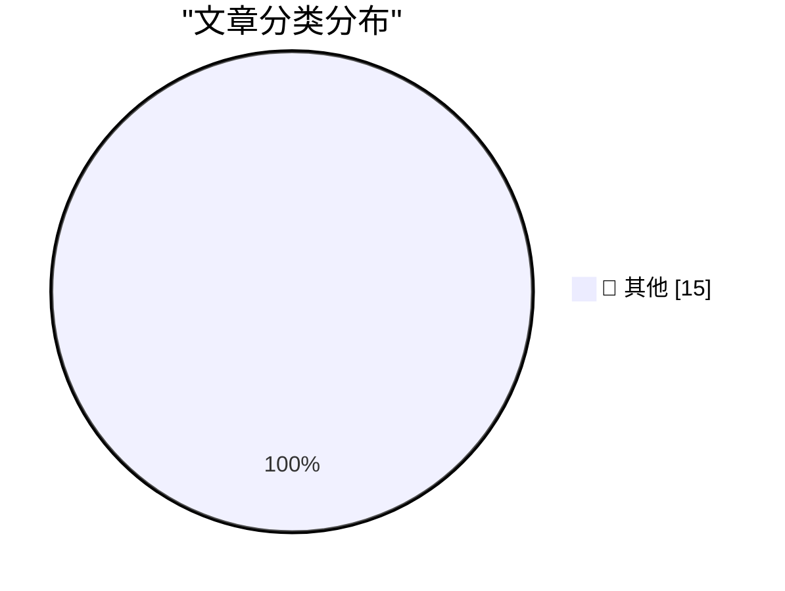

# 📰 AI 资讯每日精选 — 2026-05-05

> 汇聚 140+ 技术博客、X/Twitter、Hacker News、Reddit、Product Hunt、
> Lobste.rs、ClawFeed 日报及 GitHub Trending，经 AI 评分筛选。
>
> **本期内容**：🏆 今日必读 · 🌐 ClawFeed 日报 · 🔥 GitHub Trending · 📂 分类精选 · 🎨 设计与生成式 AI · 📊 数据概览

## 🏆 今日必读

🥇 **Quoting John Gruber**

[Quoting John Gruber](https://simonwillison.net/2026/May/5/john-gruber/#atom-everything) — simonwillison.net · 31 分钟前 · 📝 其他

> Quoting John Gruber

🥈 **Granite 4.1 3B SVG Pelican Gallery**

[Granite 4.1 3B SVG Pelican Gallery](https://simonwillison.net/2026/May/4/granite-41-3b-svg-pelican-gallery/#atom-everything) — simonwillison.net · 1 小时前 · 📝 其他

> Granite 4.1 3B SVG Pelican Gallery

🥉 **Quoting Andy Masley**

[Quoting Andy Masley](https://simonwillison.net/2026/May/4/andy-masley/#atom-everything) — simonwillison.net · 2 小时前 · 📝 其他

> Quoting Andy Masley

4️⃣ **April 2026 newsletter**

[April 2026 newsletter](https://simonwillison.net/2026/May/4/april-newsletter/#atom-everything) — simonwillison.net · 2 小时前 · 📝 其他

> April 2026 newsletter

5️⃣ **TRE Python binding — ReDoS robustness demo**

[TRE Python binding — ReDoS robustness demo](https://simonwillison.net/2026/May/4/tre-python-binding/#atom-everything) — simonwillison.net · 7 小时前 · 📝 其他

> TRE Python binding — ReDoS robustness demo

---

## 🌐 ClawFeed 日报精选

> 来源：[ClawFeed](https://clawfeed.kevinhe.io) — AI 驱动的多源新闻聚合

### 🔥 今日头条

1. **OpenAI 把 Codex 从 coding tool 推向全工作流 agent 平台**
   今天最强主线就是 OpenAI 连续强化 Codex，新增 computer use、浏览器、image generation、memory、SSH devbox、并行 agents 和更多插件，目标已经不是“帮你写代码”，而是抢开发者与知识工作者的工作台入口。

2. **GPT-Rosalind 发布，frontier model 开始更明确切入生命科学**
   OpenAI 同步推出面向生命科学研究的 GPT-Rosalind，直接把能力包装到药物发现、基因组学、实验规划和转化医学流程，说明高价值垂直场景会越来越成为大模型产品化主战场。

3. **Claude Opus 4.7 刷新 agent 竞争强度**
   Anthropic 今天在社媒侧最强的产品信号是 Claude Opus 4.7，重点强调更稳的长任务执行、指令跟随和交付前自检。市场关注点继续从“聊天更像人”转向“能不能稳定干完复杂任务”。

4. **AI 安全和 cyber defense 持续升温**
   OpenAI 扩大 Trusted Access for Cyber，并开放更高信任级别团队申请 GPT-5.4-Cyber。Anthropic 则继续推进 Project Glasswing，把 Claude 往关键软件安全和基础设施防护场景里打，安全赛道已经明显进入平台级竞争。

5. **多模态 agent 和 world model 继续冒头**
   Google DeepMind 把 Gemini Robotics 接到 Spot 上，HeyGen 开源 HyperFrames，腾讯 HY-World-2.0 也被持续讨论。除了 coding agent，视频编辑、机器人执行、3D world generation 都在变成新一轮 agent 入口。

---

## 🔥 GitHub Trending

> 今日热门开源项目（全语言 + Python）

| # | 项目 | 描述 | ⭐ 总星 | 📈 今日 | 语言 |
|---|------|------|---------|---------|------|
| 1 | [ruvnet/ruflo](https://github.com/ruvnet/ruflo) 🤖 | 🌊 The leading agent orchestration platform for Claude. D... | 41.4k | +2598 | TypeScript |
| 2 | [TauricResearch/TradingAgents](https://github.com/TauricResearch/TradingAgents) 🤖 | TradingAgents: Multi-Agents LLM Financial Trading Framework | 67.5k | +2182 | Python |
| 3 | [Hmbown/DeepSeek-TUI](https://github.com/Hmbown/DeepSeek-TUI) 🤖 | Coding agent for DeepSeek models that runs in your terminal | 4.0k | +1274 | Rust |
| 4 | [msitarzewski/agency-agents](https://github.com/msitarzewski/agency-agents) 🤖 | A complete AI agency at your fingertips - From frontend w... | 92.7k | +1189 | Shell |
| 5 | [AIDC-AI/Pixelle-Video](https://github.com/AIDC-AI/Pixelle-Video) 🤖 | 🚀 AI 全自动短视频引擎 | AI Fully Automated Short Video Engine | 10.9k | +1153 | Python |
| 6 | [soxoj/maigret](https://github.com/soxoj/maigret) | 🕵️‍♂️ Collect a dossier on a person by username from 300... | 24.8k | +1119 | Python |
| 7 | [1jehuang/jcode](https://github.com/1jehuang/jcode) 🤖 | Coding Agent Harness | 3.9k | +548 | Rust |
| 8 | [docusealco/docuseal](https://github.com/docusealco/docuseal) | Open source DocuSign alternative. Create, fill, and sign ... | 13.3k | +535 | Ruby |
| 9 | [czlonkowski/n8n-mcp](https://github.com/czlonkowski/n8n-mcp) 🤖 | A MCP for Claude Desktop / Claude Code / Windsurf / Curso... | 19.9k | +496 | TypeScript |
| 10 | [virattt/dexter](https://github.com/virattt/dexter) 🤖 | An autonomous agent for deep financial research | 23.2k | +409 | TypeScript |
| 11 | [browserbase/skills](https://github.com/browserbase/skills) 🤖 | Claude Agent SDK with a web browsing tool | 2.1k | +320 | JavaScript |
| 12 | [sansan0/TrendRadar](https://github.com/sansan0/TrendRadar) 🤖 | ⭐AI-driven public opinion & trend monitor with multi-plat... | 56.5k | +288 | Python |
| 13 | [fspecii/ace-step-ui](https://github.com/fspecii/ace-step-ui) 🤖 | 🎵 The Ultimate Open Source Suno Alternative - Profession... | 2.8k | +237 | JavaScript |
| 14 | [raullenchai/Rapid-MLX](https://github.com/raullenchai/Rapid-MLX) 🤖 | The fastest local AI engine for Apple Silicon. 4.2x faste... | 1.1k | +200 | Python |
| 15 | [LearningCircuit/local-deep-research](https://github.com/LearningCircuit/local-deep-research) 🤖 | ~95% on SimpleQA (e.g. Qwen3.6-27B on a 3090). Supports a... | 4.8k | +171 | Python |

---

## 📝 其他

### 1. Quoting John Gruber

[Quoting John Gruber](https://simonwillison.net/2026/May/5/john-gruber/#atom-everything) — **simonwillison.net** · 31 分钟前 · ⭐ 15/30

> Quoting John Gruber

---

### 2. Granite 4.1 3B SVG Pelican Gallery

[Granite 4.1 3B SVG Pelican Gallery](https://simonwillison.net/2026/May/4/granite-41-3b-svg-pelican-gallery/#atom-everything) — **simonwillison.net** · 1 小时前 · ⭐ 15/30

> Granite 4.1 3B SVG Pelican Gallery

---

### 3. Quoting Andy Masley

[Quoting Andy Masley](https://simonwillison.net/2026/May/4/andy-masley/#atom-everything) — **simonwillison.net** · 2 小时前 · ⭐ 15/30

> Quoting Andy Masley

---

### 4. April 2026 newsletter

[April 2026 newsletter](https://simonwillison.net/2026/May/4/april-newsletter/#atom-everything) — **simonwillison.net** · 2 小时前 · ⭐ 15/30

> April 2026 newsletter

---

### 5. TRE Python binding — ReDoS robustness demo

[TRE Python binding — ReDoS robustness demo](https://simonwillison.net/2026/May/4/tre-python-binding/#atom-everything) — **simonwillison.net** · 7 小时前 · ⭐ 15/30

> TRE Python binding — ReDoS robustness demo

---

### 6. Redis Array Playground

[Redis Array Playground](https://simonwillison.net/2026/May/4/redis-array/#atom-everything) — **simonwillison.net** · 9 小时前 · ⭐ 15/30

> Redis Array Playground

---

### 7. Paul Thurrott Might Write a Book on Markdown

[Paul Thurrott Might Write a Book on Markdown](https://www.thurrott.com/paul/334577/the-markdown-book-on-writing?utm_source=dlvr.it&amp;utm_medium=mastodon) — **daringfireball.net** · 2 小时前 · ⭐ 15/30

> Paul Thurrott Might Write a Book on Markdown

---

### 8. ★ Y Combinator’s Stake in OpenAI

[★ Y Combinator’s Stake in OpenAI](https://daringfireball.net/2026/05/y_combinators_stake_in_openai) — **daringfireball.net** · 2 小时前 · ⭐ 15/30

> ★ Y Combinator’s Stake in OpenAI

---

### 9. Google Owns a Big Chunk of Anthropic

[Google Owns a Big Chunk of Anthropic](https://www.nytimes.com/2025/03/11/technology/google-investment-anthropic.html?unlocked_article_code=1.f1A.eSTf.D5ECvk6f4DZ7) — **daringfireball.net** · 3 小时前 · ⭐ 15/30

> Google Owns a Big Chunk of Anthropic

---

### 10. App Store Search Ads and the Slippery Slope

[App Store Search Ads and the Slippery Slope](https://blog.thinktapwork.com/post/812803664980967425/ios-app-store-search-is-rotten) — **daringfireball.net** · 4 小时前 · ⭐ 15/30

> App Store Search Ads and the Slippery Slope

---

### 11. ‘Noir, Japan’s Hard-Boiled Bittersweet Answer to Oreos’

[‘Noir, Japan’s Hard-Boiled Bittersweet Answer to Oreos’](https://tokyopaladin.substack.com/p/the-japanese-oreo-noir-kills-the) — **daringfireball.net** · 5 小时前 · ⭐ 15/30

> ‘Noir, Japan’s Hard-Boiled Bittersweet Answer to Oreos’

---

### 12. Photoshop’s ‘Modern User Interface’ Sucks (and Doesn’t Feel Modern)

[Photoshop’s ‘Modern User Interface’ Sucks (and Doesn’t Feel Modern)](https://unsung.aresluna.org/photoshops-challenges-with-focus-pt-2/) — **daringfireball.net** · 6 小时前 · ⭐ 15/30

> Photoshop’s ‘Modern User Interface’ Sucks (and Doesn’t Feel Modern)

---

### 13. Anthropic Executive, One Year Ago: Fully AI Employees Are a Year Away

[Anthropic Executive, One Year Ago: Fully AI Employees Are a Year Away](https://www.axios.com/2025/04/22/ai-anthropic-virtual-employees-security) — **daringfireball.net** · 6 小时前 · ⭐ 15/30

> Anthropic Executive, One Year Ago: Fully AI Employees Are a Year Away

---

### 14. Commits on GitHub Are Up 14× Year-Over-Year

[Commits on GitHub Are Up 14× Year-Over-Year](https://daringfireball.net/linked/2026/03/13/amodei-ai-code-claim-chowder) — **daringfireball.net** · 10 小时前 · ⭐ 15/30

> Commits on GitHub Are Up 14× Year-Over-Year

---

### 15. ScopeXR — Cataract Surgery Using Apple Vision Pro Mixed Reality

[ScopeXR — Cataract Surgery Using Apple Vision Pro Mixed Reality](https://www.prnewswire.com/news-releases/sightmds-dr-eric-rosenberg-becomes-first-surgeon-in-the-world-to-perform-cataract-surgery-using-apple-vision-pro-mixed-reality-302754311.html) — **daringfireball.net** · 10 小时前 · ⭐ 15/30

> ScopeXR — Cataract Surgery Using Apple Vision Pro Mixed Reality

---

## 🎨 Design & Generative AI

### 🖼️ 生成式图片

- **[I trained an Aesthetic Anime Style LoRA for anima p3 using 20,000 highly curated anime images.](https://www.reddit.com/r/StableDiffusion/comments/1t34v42/i_trained_an_aesthetic_anime_style_lora_for_anima/)** — r/StableDiffusion · 22 小时前
  > I trained an Aesthetic Anime Style LoRA for anima p3 using 20,000 highly curated anime images.

- **[2.5D Fantasy Style LoRA for Anima – Trained in 1 hour](https://www.reddit.com/r/StableDiffusion/comments/1t3s0v3/25d_fantasy_style_lora_for_anima_trained_in_1_hour/)** — r/StableDiffusion · 5 小时前
  > 2.5D Fantasy Style LoRA for Anima – Trained in 1 hour

- **[GitHub: ComfyUI SenseNova U1 Released – Anyone Got It Working Yet for ComfyUI?](https://www.reddit.com/r/StableDiffusion/comments/1t3ns9g/github_comfyui_sensenova_u1_released_anyone_got/)** — r/StableDiffusion · 8 小时前
  > GitHub: ComfyUI SenseNova U1 Released – Anyone Got It Working Yet for ComfyUI?

- **[OneTrainer now supports Ernie LoRA](https://www.reddit.com/r/StableDiffusion/comments/1t3u8fn/onetrainer_now_supports_ernie_lora/)** — r/StableDiffusion · 4 小时前
  > OneTrainer now supports Ernie LoRA

- **[Six Helpful ComfyUI Custom Nodes](https://www.reddit.com/r/StableDiffusion/comments/1t3u6d2/six_helpful_comfyui_custom_nodes/)** — r/StableDiffusion · 4 小时前
  > Six Helpful ComfyUI Custom Nodes

- **[Would a 2nd hand custom built 2080 Ti 22GB vram be worth it? How usable would it be with ComfyUI? Or maybe even 2 pcs with NVLink? Can large models, like Wan2.2 be split with NVLink like it's 44GB, or will it always be 22GB for 1 model, and 22GB for another model (encoders, CLIP, anything else)?](https://www.reddit.com/r/StableDiffusion/comments/1t3n70l/would_a_2nd_hand_custom_built_2080_ti_22gb_vram/)** — r/StableDiffusion · 8 小时前
  > Would a 2nd hand custom built 2080 Ti 22GB vram be worth it? How usable would it be with ComfyUI? Or maybe even 2 pcs with NVLink? Can large models, like Wan2.2 be split with NVLink like it's 44GB, or will it always be 22GB for 1 model, and 22GB for another model (encoders, CLIP, anything else)?

- **[[Help] Flux.1 Dev LoRA failing to learn character identity (Ostris/AI-Toolkit)](https://www.reddit.com/r/StableDiffusion/comments/1t36u3f/help_flux1_dev_lora_failing_to_learn_character/)** — r/StableDiffusion · 21 小时前
  > [Help] Flux.1 Dev LoRA failing to learn character identity (Ostris/AI-Toolkit)

- **[ComfyUI: how to separate it into different storage drives?](https://www.reddit.com/r/StableDiffusion/comments/1t3dr5e/comfyui_how_to_separate_it_into_different_storage/)** — r/StableDiffusion · 14 小时前
  > ComfyUI: how to separate it into different storage drives?

- **[Brutal steampunk black and white realism - Midjourney](https://www.reddit.com/r/midjourney/comments/1t3ig8n/brutal_steampunk_black_and_white_realism/)** — r/midjourney · 11 小时前
  > Brutal steampunk black and white realism - Midjourney

- **[Burning man pink strange engine - Midjourney v 7](https://www.reddit.com/r/midjourney/comments/1t3crns/burning_man_pink_strange_engine_midjourney_v_7/)** — r/midjourney · 15 小时前
  > Burning man pink strange engine - Midjourney v 7

- **[Is Midjourney's Discord for people of a very narrow mindset?](https://www.reddit.com/r/midjourney/comments/1t3p126/is_midjourneys_discord_for_people_of_a_very/)** — r/midjourney · 7 小时前
  > Is Midjourney's Discord for people of a very narrow mindset?

- **[Finishing up this lora loader + complimentary clip text encoder . Releases today.](https://www.reddit.com/r/comfyui/comments/1t3c05a/finishing_up_this_lora_loader_complimentary_clip/)** — r/comfyui · 16 小时前
  > Finishing up this lora loader + complimentary clip text encoder . Releases today.

- **[4K test - Flux Klein + LTX 2.3 w/ camera control LoRA](https://www.reddit.com/r/comfyui/comments/1t3765p/4k_test_flux_klein_ltx_23_w_camera_control_lora/)** — r/comfyui · 21 小时前
  > 4K test - Flux Klein + LTX 2.3 w/ camera control LoRA

- **[I created an AI assistant ComfyUI custom node](https://www.reddit.com/r/comfyui/comments/1t3lmus/i_created_an_ai_assistant_comfyui_custom_node/)** — r/comfyui · 9 小时前
  > I created an AI assistant ComfyUI custom node

- **[How to use comfyui as backend easy ?](https://www.reddit.com/r/comfyui/comments/1t3naa3/how_to_use_comfyui_as_backend_easy/)** — r/comfyui · 8 小时前
  > How to use comfyui as backend easy ?

---

## 📊 数据概览

| 扫描源 | 抓取文章 | 时间范围 | 精选 |
|:---:|:---:|:---:|:---:|
| 118/140 | 5361 篇 → 217 篇 | 24h | **15 篇** |

### 分类分布

---

*生成于 2026-05-05 01:18 | 汇聚 140 个技术博客、X/Twitter、Hacker News、Reddit、Product Hunt、Lobste.rs、ClawFeed 日报及 GitHub Trending，经 AI 评分筛选出 Top 15 精华内容*
