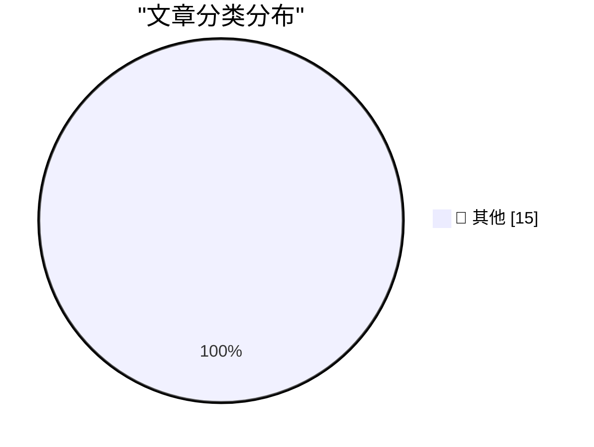

# 📰 AI 资讯每日精选 — 2026-05-06

> 汇聚 140+ 技术博客、X/Twitter、Hacker News、Reddit、Product Hunt、
> Lobste.rs、ClawFeed 日报及 GitHub Trending，经 AI 评分筛选。
>
> **本期内容**：🏆 今日必读 · 🌐 ClawFeed 日报 · 🔥 GitHub Trending · 📂 分类精选 · 🎨 设计与生成式 AI · 📊 数据概览

## 🏆 今日必读

🥇 **datasette-referrer-policy 0.1**

[datasette-referrer-policy 0.1](https://simonwillison.net/2026/May/5/datasette-referrer-policy/#atom-everything) — simonwillison.net · 1 小时前 · 📝 其他

> datasette-referrer-policy 0.1

🥈 **Our AI started a cafe in Stockholm**

[Our AI started a cafe in Stockholm](https://simonwillison.net/2026/May/5/our-ai-started-a-cafe-in-stockholm/#atom-everything) — simonwillison.net · 3 小时前 · 📝 其他

> Our AI started a cafe in Stockholm

🥉 **datasette-llm 0.1a7**

[datasette-llm 0.1a7](https://simonwillison.net/2026/May/5/datasette-llm/#atom-everything) — simonwillison.net · 23 小时前 · 📝 其他

> datasette-llm 0.1a7

4️⃣ **llm-echo 0.5a0**

[llm-echo 0.5a0](https://simonwillison.net/2026/May/5/llm-echo/#atom-everything) — simonwillison.net · 23 小时前 · 📝 其他

> llm-echo 0.5a0

5️⃣ **Apple Cuts More Mac Studio and Mac Mini RAM Options as Memory Shortage Worsens**

[Apple Cuts More Mac Studio and Mac Mini RAM Options as Memory Shortage Worsens](https://www.macrumors.com/2026/05/05/apple-mac-studio-mac-mini-ram-cuts/) — daringfireball.net · 41 分钟前 · 📝 其他

> Apple Cuts More Mac Studio and Mac Mini RAM Options as Memory Shortage Worsens

---

## 🌐 ClawFeed 日报精选

> 来源：[ClawFeed](https://clawfeed.kevinhe.io) — AI 驱动的多源新闻聚合

### 🔥 今日头条

1. **OpenAI 把 Codex 从 coding tool 推向全工作流 agent 平台**
   今天最强主线就是 OpenAI 连续强化 Codex，新增 computer use、浏览器、image generation、memory、SSH devbox、并行 agents 和更多插件，目标已经不是“帮你写代码”，而是抢开发者与知识工作者的工作台入口。

2. **GPT-Rosalind 发布，frontier model 开始更明确切入生命科学**
   OpenAI 同步推出面向生命科学研究的 GPT-Rosalind，直接把能力包装到药物发现、基因组学、实验规划和转化医学流程，说明高价值垂直场景会越来越成为大模型产品化主战场。

3. **Claude Opus 4.7 刷新 agent 竞争强度**
   Anthropic 今天在社媒侧最强的产品信号是 Claude Opus 4.7，重点强调更稳的长任务执行、指令跟随和交付前自检。市场关注点继续从“聊天更像人”转向“能不能稳定干完复杂任务”。

4. **AI 安全和 cyber defense 持续升温**
   OpenAI 扩大 Trusted Access for Cyber，并开放更高信任级别团队申请 GPT-5.4-Cyber。Anthropic 则继续推进 Project Glasswing，把 Claude 往关键软件安全和基础设施防护场景里打，安全赛道已经明显进入平台级竞争。

5. **多模态 agent 和 world model 继续冒头**
   Google DeepMind 把 Gemini Robotics 接到 Spot 上，HeyGen 开源 HyperFrames，腾讯 HY-World-2.0 也被持续讨论。除了 coding agent，视频编辑、机器人执行、3D world generation 都在变成新一轮 agent 入口。

---

## 🔥 GitHub Trending

> 今日热门开源项目（全语言 + Python）

| # | 项目 | 描述 | ⭐ 总星 | 📈 今日 | 语言 |
|---|------|------|---------|---------|------|
| 1 | [Hmbown/DeepSeek-TUI](https://github.com/Hmbown/DeepSeek-TUI) 🤖 | Coding agent for DeepSeek models that runs in your terminal | 7.5k | +2434 | Rust |
| 2 | [ruvnet/ruflo](https://github.com/ruvnet/ruflo) 🤖 | 🌊 The leading agent orchestration platform for Claude. D... | 43.7k | +2432 | TypeScript |
| 3 | [forrestchang/andrej-karpathy-skills](https://github.com/forrestchang/andrej-karpathy-skills) 🤖 | A single CLAUDE.md file to improve Claude Code behavior, ... | 114.0k | +2409 | - |
| 4 | [TauricResearch/TradingAgents](https://github.com/TauricResearch/TradingAgents) 🤖 | TradingAgents: Multi-Agents LLM Financial Trading Framework | 69.4k | +2223 | Python |
| 5 | [msitarzewski/agency-agents](https://github.com/msitarzewski/agency-agents) 🤖 | A complete AI agency at your fingertips - From frontend w... | 93.6k | +1218 | Shell |
| 6 | [public-apis/public-apis](https://github.com/public-apis/public-apis) | A collective list of free APIs | 432.2k | +935 | Python |
| 7 | [docusealco/docuseal](https://github.com/docusealco/docuseal) | Open source DocuSign alternative. Create, fill, and sign ... | 14.0k | +927 | Ruby |
| 8 | [soxoj/maigret](https://github.com/soxoj/maigret) | 🕵️‍♂️ Collect a dossier on a person by username from 300... | 25.5k | +855 | Python |
| 9 | [AIDC-AI/Pixelle-Video](https://github.com/AIDC-AI/Pixelle-Video) 🤖 | 🚀 AI 全自动短视频引擎 | AI Fully Automated Short Video Engine | 11.7k | +691 | Python |
| 10 | [virattt/dexter](https://github.com/virattt/dexter) 🤖 | An autonomous agent for deep financial research | 23.8k | +659 | TypeScript |
| 11 | [raullenchai/Rapid-MLX](https://github.com/raullenchai/Rapid-MLX) 🤖 | The fastest local AI engine for Apple Silicon. 4.2x faste... | 1.5k | +491 | Python |
| 12 | [cocoindex-io/cocoindex](https://github.com/cocoindex-io/cocoindex) | Incremental engine for long horizon agents 🌟 Star if you... | 8.4k | +438 | Python |
| 13 | [microsoft/markitdown](https://github.com/microsoft/markitdown) | Python tool for converting files and office documents to ... | 120.7k | +413 | Python |
| 14 | [jwasham/coding-interview-university](https://github.com/jwasham/coding-interview-university) | A complete computer science study plan to become a softwa... | 345.8k | +366 | - |
| 15 | [cheahjs/free-llm-api-resources](https://github.com/cheahjs/free-llm-api-resources) 🤖 | A list of free LLM inference resources accessible via API. | 20.1k | +344 | Python |

---

## 📝 其他

### 1. datasette-referrer-policy 0.1

[datasette-referrer-policy 0.1](https://simonwillison.net/2026/May/5/datasette-referrer-policy/#atom-everything) — **simonwillison.net** · 1 小时前 · ⭐ 15/30

> datasette-referrer-policy 0.1

---

### 2. Our AI started a cafe in Stockholm

[Our AI started a cafe in Stockholm](https://simonwillison.net/2026/May/5/our-ai-started-a-cafe-in-stockholm/#atom-everything) — **simonwillison.net** · 3 小时前 · ⭐ 15/30

> Our AI started a cafe in Stockholm

---

### 3. datasette-llm 0.1a7

[datasette-llm 0.1a7](https://simonwillison.net/2026/May/5/datasette-llm/#atom-everything) — **simonwillison.net** · 23 小时前 · ⭐ 15/30

> datasette-llm 0.1a7

---

### 4. llm-echo 0.5a0

[llm-echo 0.5a0](https://simonwillison.net/2026/May/5/llm-echo/#atom-everything) — **simonwillison.net** · 23 小时前 · ⭐ 15/30

> llm-echo 0.5a0

---

### 5. Apple Cuts More Mac Studio and Mac Mini RAM Options as Memory Shortage Worsens

[Apple Cuts More Mac Studio and Mac Mini RAM Options as Memory Shortage Worsens](https://www.macrumors.com/2026/05/05/apple-mac-studio-mac-mini-ram-cuts/) — **daringfireball.net** · 41 分钟前 · ⭐ 15/30

> Apple Cuts More Mac Studio and Mac Mini RAM Options as Memory Shortage Worsens

---

### 6. Apple Settles Class Action Lawsuit Over AI Features That Were Advertised but Didn’t Ship for $250 Million

[Apple Settles Class Action Lawsuit Over AI Features That Were Advertised but Didn’t Ship for $250 Million](https://9to5mac.com/2026/05/05/apple-reaches-250m-settlement-over-siri-delays-users-could-get-up-to-95-per-device/) — **daringfireball.net** · 48 分钟前 · ⭐ 15/30

> Apple Settles Class Action Lawsuit Over AI Features That Were Advertised but Didn’t Ship for $250 Million

---

### 7. The Pentagon Pegs the Cost of the Iran War, So Far, at $25 Billion

[The Pentagon Pegs the Cost of the Iran War, So Far, at $25 Billion](https://politicalwire.com/2026/04/29/iran-war-has-cost-25-billion-so-far/) — **daringfireball.net** · 3 小时前 · ⭐ 15/30

> The Pentagon Pegs the Cost of the Iran War, So Far, at $25 Billion

---

### 8. ★ Software as the Product of Obsession Times Voice

[★ Software as the Product of Obsession Times Voice](https://daringfireball.net/2026/05/software_as_the_product_of_obsession_times_voice) — **daringfireball.net** · 4 小时前 · ⭐ 15/30

> ★ Software as the Product of Obsession Times Voice

---

### 9. Pedometer++ 8.0

[Pedometer++ 8.0](https://david-smith.org/blog/2026/04/29/maps-on-watchos/) — **daringfireball.net** · 7 小时前 · ⭐ 15/30

> Pedometer++ 8.0

---

### 10. [Sponsor] WorkOS: Ready to Sell to Enterprise? Your Product Is Ready, Your Auth Infrastructure Isn’t.

[[Sponsor] WorkOS: Ready to Sell to Enterprise? Your Product Is Ready, Your Auth Infrastructure Isn’t.](https://workos.com/?utm_source=daringfireball&amp;utm_medium=newsletter&amp;utm_campaign=q22026) — **daringfireball.net** · 22 小时前 · ⭐ 15/30

> [Sponsor] WorkOS: Ready to Sell to Enterprise? Your Product Is Ready, Your Auth Infrastructure Isn’t.

---

### 11. Chess Peace

[Chess Peace](https://chesspeace.app/) — **daringfireball.net** · 23 小时前 · ⭐ 15/30

> Chess Peace

---

### 12. Adobe’s ‘Modern’ User Interface Is Just Webpages

[Adobe’s ‘Modern’ User Interface Is Just Webpages](https://pxlnv.com/linklog/adobe-modern-user-interface/) — **daringfireball.net** · 23 小时前 · ⭐ 15/30

> Adobe’s ‘Modern’ User Interface Is Just Webpages

---

### 13. Pluralistic: The three armies fighting for the post-American world (05 May 2026)

[Pluralistic: The three armies fighting for the post-American world (05 May 2026)](https://pluralistic.net/2026/05/05/three-is-a-magic-number/) — **pluralistic.net** · 12 小时前 · ⭐ 15/30

> Pluralistic: The three armies fighting for the post-American world (05 May 2026)

---

### 14. RSS Feeds Send Me More Traffic Than Google

[RSS Feeds Send Me More Traffic Than Google](https://shkspr.mobi/blog/2026/05/rss-feeds-send-me-more-traffic-than-google/) — **shkspr.mobi** · 13 小时前 · ⭐ 15/30

> RSS Feeds Send Me More Traffic Than Google

---

### 15. A dispute over the TAB key highlights a mismatch between Microsoft and IBM organizational structures

[A dispute over the TAB key highlights a mismatch between Microsoft and IBM organizational structures](https://devblogs.microsoft.com/oldnewthing/20260505-00/?p=112298) — **devblogs.microsoft.com/oldnewthing** · 11 小时前 · ⭐ 15/30

> A dispute over the TAB key highlights a mismatch between Microsoft and IBM organizational structures

---

## 🎨 Design & Generative AI

### 🖼️ 生成式图片

- **[Converting 2D animations to 3D with LTX 2.3 Lora](https://www.reddit.com/r/StableDiffusion/comments/1t4a0r5/converting_2d_animations_to_3d_with_ltx_23_lora/)** — r/StableDiffusion · 16 小时前
  > Converting 2D animations to 3D with LTX 2.3 Lora

- **[Wireframe - Flux.2 Klein 9b style LORA](https://www.reddit.com/r/StableDiffusion/comments/1t4udu2/wireframe_flux2_klein_9b_style_lora/)** — r/StableDiffusion · 2 小时前
  > Wireframe - Flux.2 Klein 9b style LORA

- **[My LTX 2.3 LoRA Training Journey: Fighting for VRAM even with a 5090](https://www.reddit.com/r/StableDiffusion/comments/1t4bbsi/my_ltx_23_lora_training_journey_fighting_for_vram/)** — r/StableDiffusion · 14 小时前
  > My LTX 2.3 LoRA Training Journey: Fighting for VRAM even with a 5090

- **[Local Dream 2.4.3 - SDXL support, tag autocomplete and more](https://www.reddit.com/r/StableDiffusion/comments/1t4d7ix/local_dream_243_sdxl_support_tag_autocomplete_and/)** — r/StableDiffusion · 13 小时前
  > Local Dream 2.4.3 - SDXL support, tag autocomplete and more

- **[Which model do you recommend for consistent partial / targeted img2img editing in ComfyUI?](https://www.reddit.com/r/StableDiffusion/comments/1t4dso0/which_model_do_you_recommend_for_consistent/)** — r/StableDiffusion · 12 小时前
  > Which model do you recommend for consistent partial / targeted img2img editing in ComfyUI?

- **[I built a dual-monitor image curator for sorting large Stable Diffusion output folders (looking for feedback)](https://www.reddit.com/r/StableDiffusion/comments/1t4rx5r/i_built_a_dualmonitor_image_curator_for_sorting/)** — r/StableDiffusion · 4 小时前
  > I built a dual-monitor image curator for sorting large Stable Diffusion output folders (looking for feedback)

- **[Install Stable Diffusion WebUI Forge easily on Windows: portable one-click installer for Forge Classic + Forge Neo](https://www.reddit.com/r/StableDiffusion/comments/1t4wkr4/install_stable_diffusion_webui_forge_easily_on/)** — r/StableDiffusion · 1 小时前
  > Install Stable Diffusion WebUI Forge easily on Windows: portable one-click installer for Forge Classic + Forge Neo

- **[Searching for a Lora of that style](https://www.reddit.com/r/StableDiffusion/comments/1t4xcpd/searching_for_a_lora_of_that_style/)** — r/StableDiffusion · 52 分钟前
  > Searching for a Lora of that style

- **[MidJourney v8.1 + Personalisation Workflow | Consistent sci-fi frames into a full cinematic UI film](https://www.reddit.com/r/midjourney/comments/1t4g0vp/midjourney_v81_personalisation_workflow/)** — r/midjourney · 11 小时前
  > MidJourney v8.1 + Personalisation Workflow | Consistent sci-fi frames into a full cinematic UI film

- **[Creepy realistic horror clown, freakshow dark circus - Midjourney Raw](https://www.reddit.com/r/midjourney/comments/1t4boov/creepy_realistic_horror_clown_freakshow_dark/)** — r/midjourney · 14 小时前
  > Creepy realistic horror clown, freakshow dark circus - Midjourney Raw

- **[LTX-2.3 + Union Control LoRA (8GB VRAM)](https://www.reddit.com/r/comfyui/comments/1t427g9/ltx23_union_control_lora_8gb_vram/)** — r/comfyui · 23 小时前
  > LTX-2.3 + Union Control LoRA (8GB VRAM)

- **[Which model for img2img with facial consistency](https://www.reddit.com/r/comfyui/comments/1t4l42g/which_model_for_img2img_with_facial_consistency/)** — r/comfyui · 8 小时前
  > Which model for img2img with facial consistency

- **[LoRA trigger words](https://www.reddit.com/r/comfyui/comments/1t46e9b/lora_trigger_words/)** — r/comfyui · 19 小时前
  > LoRA trigger words

- **[New Update to ComfyUI AI assistant](https://www.reddit.com/r/comfyui/comments/1t4hyxe/new_update_to_comfyui_ai_assistant/)** — r/comfyui · 10 小时前
  > New Update to ComfyUI AI assistant

- **[ComfyUI: how to separate it into different storage drives?](https://www.reddit.com/r/comfyui/comments/1t4jed1/comfyui_how_to_separate_it_into_different_storage/)** — r/comfyui · 9 小时前
  > ComfyUI: how to separate it into different storage drives?

---

## 📊 数据概览

| 扫描源 | 抓取文章 | 时间范围 | 精选 |
|:---:|:---:|:---:|:---:|
| 118/140 | 5357 篇 → 228 篇 | 24h | **15 篇** |

### 分类分布

---

*生成于 2026-05-06 01:18 | 汇聚 140 个技术博客、X/Twitter、Hacker News、Reddit、Product Hunt、Lobste.rs、ClawFeed 日报及 GitHub Trending，经 AI 评分筛选出 Top 15 精华内容*
