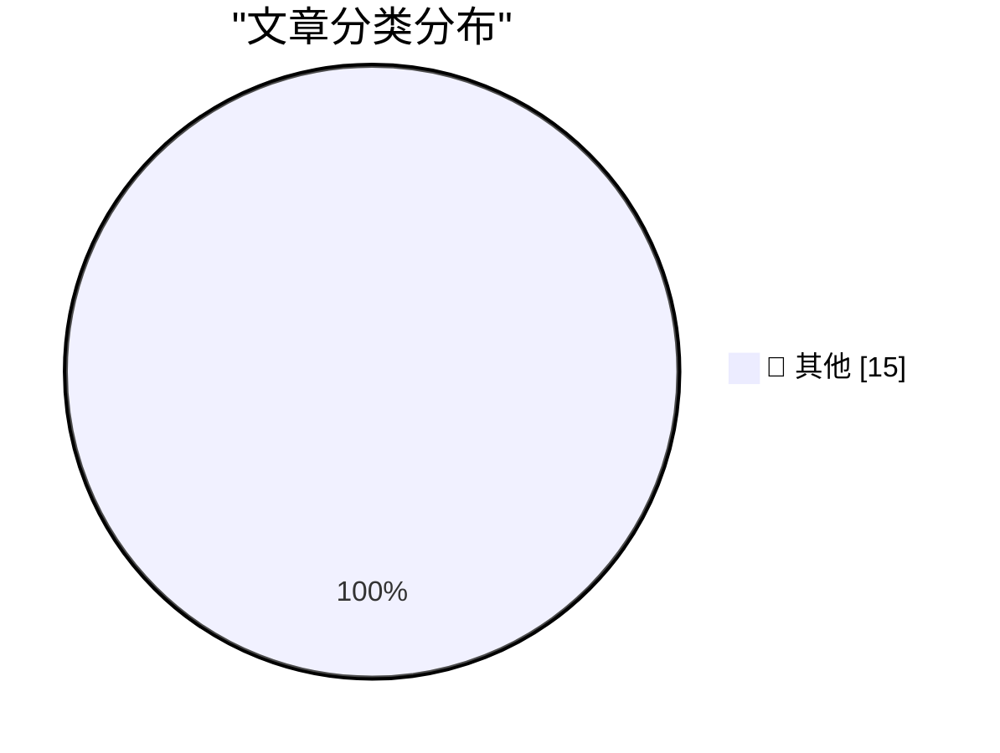

# 📰 AI 资讯每日精选 — 2026-05-07

> 汇聚 140+ 技术博客、X/Twitter、Hacker News、Reddit、Product Hunt、
> Lobste.rs、ClawFeed 日报及 GitHub Trending，经 AI 评分筛选。
>
> **本期内容**：🏆 今日必读 · 🌐 ClawFeed 日报 · 🔥 GitHub Trending · 📂 分类精选 · 🎨 设计与生成式 AI · 📊 数据概览

## 🏆 今日必读

🥇 **Live blog: Code w/ Claude 2026**

[Live blog: Code w/ Claude 2026](https://simonwillison.net/2026/May/6/code-w-claude-2026/#atom-everything) — simonwillison.net · 9 小时前 · 📝 其他

> Live blog: Code w/ Claude 2026

🥈 **Vibe coding and agentic engineering are getting closer than I'd like**

[Vibe coding and agentic engineering are getting closer than I'd like](https://simonwillison.net/2026/May/6/vibe-coding-and-agentic-engineering/#atom-everything) — simonwillison.net · 11 小时前 · 📝 其他

> Vibe coding and agentic engineering are getting closer than I'd like

🥉 **Broadcast Booths Around Baseball Tip Their Caps to John Sterling**

[Broadcast Booths Around Baseball Tip Their Caps to John Sterling](https://www.mlb.com/news/broadcast-booths-around-baseball-mirror-john-sterling-signature-calls) — daringfireball.net · 4 小时前 · 📝 其他

> Broadcast Booths Around Baseball Tip Their Caps to John Sterling

4️⃣ **Claris CEO Ryan McCann on FileMaker in the Age of Agentic Coding**

[Claris CEO Ryan McCann on FileMaker in the Age of Agentic Coding](https://www.claris.com/blog/2026/how-claris-is-building-for-what-comes-next) — daringfireball.net · 5 小时前 · 📝 其他

> Claris CEO Ryan McCann on FileMaker in the Age of Agentic Coding

5️⃣ **Luca Maestri Runs the Cafeteria**

[Luca Maestri Runs the Cafeteria](https://www.apple.com/leadership/luca-maestri/) — daringfireball.net · 5 小时前 · 📝 其他

> Luca Maestri Runs the Cafeteria

---

## 🌐 ClawFeed 日报精选

> 来源：[ClawFeed](https://clawfeed.kevinhe.io) — AI 驱动的多源新闻聚合

### 🔥 今日头条

1. **OpenAI 把 Codex 从 coding tool 推向全工作流 agent 平台**
   今天最强主线就是 OpenAI 连续强化 Codex，新增 computer use、浏览器、image generation、memory、SSH devbox、并行 agents 和更多插件，目标已经不是“帮你写代码”，而是抢开发者与知识工作者的工作台入口。

2. **GPT-Rosalind 发布，frontier model 开始更明确切入生命科学**
   OpenAI 同步推出面向生命科学研究的 GPT-Rosalind，直接把能力包装到药物发现、基因组学、实验规划和转化医学流程，说明高价值垂直场景会越来越成为大模型产品化主战场。

3. **Claude Opus 4.7 刷新 agent 竞争强度**
   Anthropic 今天在社媒侧最强的产品信号是 Claude Opus 4.7，重点强调更稳的长任务执行、指令跟随和交付前自检。市场关注点继续从“聊天更像人”转向“能不能稳定干完复杂任务”。

4. **AI 安全和 cyber defense 持续升温**
   OpenAI 扩大 Trusted Access for Cyber，并开放更高信任级别团队申请 GPT-5.4-Cyber。Anthropic 则继续推进 Project Glasswing，把 Claude 往关键软件安全和基础设施防护场景里打，安全赛道已经明显进入平台级竞争。

5. **多模态 agent 和 world model 继续冒头**
   Google DeepMind 把 Gemini Robotics 接到 Spot 上，HeyGen 开源 HyperFrames，腾讯 HY-World-2.0 也被持续讨论。除了 coding agent，视频编辑、机器人执行、3D world generation 都在变成新一轮 agent 入口。

---

## 🔥 GitHub Trending

> 今日热门开源项目（全语言 + Python）

| # | 项目 | 描述 | ⭐ 总星 | 📈 今日 | 语言 |
|---|------|------|---------|---------|------|
| 1 | [Hmbown/DeepSeek-TUI](https://github.com/Hmbown/DeepSeek-TUI) 🤖 | Coding agent for DeepSeek models that runs in your terminal | 14.1k | +6175 | Rust |
| 2 | [ruvnet/ruflo](https://github.com/ruvnet/ruflo) 🤖 | 🌊 The leading agent orchestration platform for Claude. D... | 45.3k | +2192 | TypeScript |
| 3 | [AIDC-AI/Pixelle-Video](https://github.com/AIDC-AI/Pixelle-Video) 🤖 | 🚀 AI 全自动短视频引擎 | AI Fully Automated Short Video Engine | 12.7k | +1239 | Python |
| 4 | [D4Vinci/Scrapling](https://github.com/D4Vinci/Scrapling) | 🕷️ An adaptive Web Scraping framework that handles every... | 46.3k | +1125 | Python |
| 5 | [addyosmani/agent-skills](https://github.com/addyosmani/agent-skills) 🤖 | Production-grade engineering skills for AI coding agents. | 30.6k | +800 | Shell |
| 6 | [Arindam200/awesome-ai-apps](https://github.com/Arindam200/awesome-ai-apps) 🤖 | A collection of projects showcasing RAG, agents, workflow... | 11.8k | +799 | Python |
| 7 | [docusealco/docuseal](https://github.com/docusealco/docuseal) | Open source DocuSign alternative. Create, fill, and sign ... | 14.9k | +774 | Ruby |
| 8 | [virattt/dexter](https://github.com/virattt/dexter) 🤖 | An autonomous agent for deep financial research | 24.4k | +666 | TypeScript |
| 9 | [public-apis/public-apis](https://github.com/public-apis/public-apis) | A collective list of free APIs | 432.7k | +661 | Python |
| 10 | [anthropics/financial-services](https://github.com/anthropics/financial-services) |  | 9.2k | +641 | Python |
| 11 | [LearningCircuit/local-deep-research](https://github.com/LearningCircuit/local-deep-research) 🤖 | ~95% on SimpleQA (e.g. Qwen3.6-27B on a 3090). Supports a... | 5.7k | +532 | Python |
| 12 | [bwya77/vscode-dark-islands](https://github.com/bwya77/vscode-dark-islands) | VSCode theme based off the easemate IDE and Jetbrains isl... | 8.2k | +503 | PowerShell |
| 13 | [cocoindex-io/cocoindex](https://github.com/cocoindex-io/cocoindex) | Incremental engine for long horizon agents 🌟 Star if you... | 8.6k | +364 | Python |
| 14 | [bytedance/deer-flow](https://github.com/bytedance/deer-flow) | An open-source long-horizon SuperAgent harness that resea... | 65.5k | +337 | Python |
| 15 | [shiyu-coder/Kronos](https://github.com/shiyu-coder/Kronos) | Kronos: A Foundation Model for the Language of Financial ... | 23.2k | +234 | Python |

---

## 📝 其他

### 1. Live blog: Code w/ Claude 2026

[Live blog: Code w/ Claude 2026](https://simonwillison.net/2026/May/6/code-w-claude-2026/#atom-everything) — **simonwillison.net** · 9 小时前 · ⭐ 15/30

> Live blog: Code w/ Claude 2026

---

### 2. Vibe coding and agentic engineering are getting closer than I'd like

[Vibe coding and agentic engineering are getting closer than I'd like](https://simonwillison.net/2026/May/6/vibe-coding-and-agentic-engineering/#atom-everything) — **simonwillison.net** · 11 小时前 · ⭐ 15/30

> Vibe coding and agentic engineering are getting closer than I'd like

---

### 3. Broadcast Booths Around Baseball Tip Their Caps to John Sterling

[Broadcast Booths Around Baseball Tip Their Caps to John Sterling](https://www.mlb.com/news/broadcast-booths-around-baseball-mirror-john-sterling-signature-calls) — **daringfireball.net** · 4 小时前 · ⭐ 15/30

> Broadcast Booths Around Baseball Tip Their Caps to John Sterling

---

### 4. Claris CEO Ryan McCann on FileMaker in the Age of Agentic Coding

[Claris CEO Ryan McCann on FileMaker in the Age of Agentic Coding](https://www.claris.com/blog/2026/how-claris-is-building-for-what-comes-next) — **daringfireball.net** · 5 小时前 · ⭐ 15/30

> Claris CEO Ryan McCann on FileMaker in the Age of Agentic Coding

---

### 5. Luca Maestri Runs the Cafeteria

[Luca Maestri Runs the Cafeteria](https://www.apple.com/leadership/luca-maestri/) — **daringfireball.net** · 5 小时前 · ⭐ 15/30

> Luca Maestri Runs the Cafeteria

---

### 6. Asimov's three laws are merely a suggestion

[Asimov's three laws are merely a suggestion](https://idiallo.com/blog/asimov-three-laws-dont-work-with-ai?src=feed) — **idiallo.com** · 13 小时前 · ⭐ 15/30

> Asimov's three laws are merely a suggestion

---

### 7. Pluralistic: In praise of vultures (06 May 2026)

[Pluralistic: In praise of vultures (06 May 2026)](https://pluralistic.net/2026/05/06/champerty-loves-company/) — **pluralistic.net** · 15 小时前 · ⭐ 15/30

> Pluralistic: In praise of vultures (06 May 2026)

---

### 8. Why not have changes in API behavior depend on the SDK you link against?

[Why not have changes in API behavior depend on the SDK you link against?](https://devblogs.microsoft.com/oldnewthing/20260506-00/?p=112303) — **devblogs.microsoft.com/oldnewthing** · 11 小时前 · ⭐ 15/30

> Why not have changes in API behavior depend on the SDK you link against?

---

### 9. Triangular analog of the squircle

[Triangular analog of the squircle](https://www.johndcook.com/blog/2026/05/06/triangular-analog-of-the-squircle/) — **johndcook.com** · 5 小时前 · ⭐ 15/30

> Triangular analog of the squircle

---

### 10. Unified config files

[Unified config files](https://www.johndcook.com/blog/2026/05/06/unified-config-files/) — **johndcook.com** · 8 小时前 · ⭐ 15/30

> Unified config files

---

### 11. The mythology of category theory

[The mythology of category theory](https://www.johndcook.com/blog/2026/05/06/category-mythology/) — **johndcook.com** · 13 小时前 · ⭐ 15/30

> The mythology of category theory

---

### 12. The war between fast and legitimate is here

[The war between fast and legitimate is here](https://www.joanwestenberg.com/the-war-between-fast-and-legitimate-is-here/) — **joanwestenberg.com** · 6 分钟前 · ⭐ 15/30

> The war between fast and legitimate is here

---

### 13. Revisiting the 2015 Open Source Census

[Revisiting the 2015 Open Source Census](https://nesbitt.io/2026/05/06/revisiting-the-2015-open-source-census.html) — **nesbitt.io** · 15 小时前 · ⭐ 15/30

> Revisiting the 2015 Open Source Census

---

### 14. New Logic for Programmers (and the future of this newsletter)

[New Logic for Programmers (and the future of this newsletter)](https://buttondown.com/hillelwayne/archive/new-logic-for-programmers-and-the-future-of-this/) — **buttondown.com/hillelwayne** · 8 小时前 · ⭐ 15/30

> New Logic for Programmers (and the future of this newsletter)

---

### 15. Am I Meant To Be Impressed?

[Am I Meant To Be Impressed?](https://www.wheresyoured.at/am-i-meant-to-be-impressed/) — **wheresyoured.at** · 10 小时前 · ⭐ 15/30

> Am I Meant To Be Impressed?

---

## 🎨 Design & Generative AI

### 🖼️ 生成式图片

- **[Anyone else tried this RefineAnything LoRA? Pretty impressed so far](https://www.reddit.com/r/StableDiffusion/comments/1t5n9nz/anyone_else_tried_this_refineanything_lora_pretty/)** — r/StableDiffusion · 5 小时前
  > Anyone else tried this RefineAnything LoRA? Pretty impressed so far

- **[Ernie Image Lora training - my take](https://www.reddit.com/r/StableDiffusion/comments/1t5spbi/ernie_image_lora_training_my_take/)** — r/StableDiffusion · 2 小时前
  > Ernie Image Lora training - my take

- **[3 hours of lora training completely wasted on Runpod. Any alternatives?](https://www.reddit.com/r/StableDiffusion/comments/1t5hw7p/3_hours_of_lora_training_completely_wasted_on/)** — r/StableDiffusion · 8 小时前
  > 3 hours of lora training completely wasted on Runpod. Any alternatives?

- **[[Z-Image] REALSTAGRAM_ZIMG — subtle realism LoRA for Z-Image Turbo (works with any character LoRA)](https://www.reddit.com/r/StableDiffusion/comments/1t5lodo/zimage_realstagram_zimg_subtle_realism_lora_for/)** — r/StableDiffusion · 6 小时前
  > [Z-Image] REALSTAGRAM_ZIMG — subtle realism LoRA for Z-Image Turbo (works with any character LoRA)

- **[[WIP] ComfyUI Powered Klein 2 KV Edit i2i plugin (Chromium)](https://www.reddit.com/r/StableDiffusion/comments/1t5rofv/wip_comfyui_powered_klein_2_kv_edit_i2i_plugin/)** — r/StableDiffusion · 3 小时前
  > [WIP] ComfyUI Powered Klein 2 KV Edit i2i plugin (Chromium)

- **[What's your tool of the trade For training SDXL checkpoints & Lora's?](https://www.reddit.com/r/StableDiffusion/comments/1t5qgnz/whats_your_tool_of_the_trade_for_training_sdxl/)** — r/StableDiffusion · 3 小时前
  > What's your tool of the trade For training SDXL checkpoints & Lora's?

- **[Release: LoRA Lister + Trigger happy: local LoRA stacks, list testing, and prompt sync *Link inside*](https://www.reddit.com/r/comfyui/comments/1t5dpxw/release_lora_lister_trigger_happy_local_lora/)** — r/comfyui · 11 小时前
  > Release: LoRA Lister + Trigger happy: local LoRA stacks, list testing, and prompt sync *Link inside*

- **[Beginner question, how do wildcards work in ComfyUI?](https://www.reddit.com/r/comfyui/comments/1t5fw9u/beginner_question_how_do_wildcards_work_in_comfyui/)** — r/comfyui · 10 小时前
  > Beginner question, how do wildcards work in ComfyUI?

- **[ComfyUI desktop cannot load checkpoint, eventhough I put them in the right folder](https://www.reddit.com/r/comfyui/comments/1t5l4up/comfyui_desktop_cannot_load_checkpoint_eventhough/)** — r/comfyui · 7 小时前
  > ComfyUI desktop cannot load checkpoint, eventhough I put them in the right folder

- **[Trying to train a huge style LORA](https://www.reddit.com/r/comfyui/comments/1t5frml/trying_to_train_a_huge_style_lora/)** — r/comfyui · 10 小时前
  > Trying to train a huge style LORA

- **[why I can't find better inpaint than 2 years old SDXL epicrealism??](https://www.reddit.com/r/comfyui/comments/1t5bams/why_i_cant_find_better_inpaint_than_2_years_old/)** — r/comfyui · 13 小时前
  > why I can't find better inpaint than 2 years old SDXL epicrealism??

- **[Running ComfyUI Desktop on an external hard drive on a Mac laptop?](https://www.reddit.com/r/comfyui/comments/1t5r4f1/running_comfyui_desktop_on_an_external_hard_drive/)** — r/comfyui · 3 小时前
  > Running ComfyUI Desktop on an external hard drive on a Mac laptop?

- **[Building a dedicated AI pipeline for 3DOOH Screen Adaptations (ComfyUI / Blender / RTX 5070)](https://www.reddit.com/r/comfyui/comments/1t58bwi/building_a_dedicated_ai_pipeline_for_3dooh_screen/)** — r/comfyui · 15 小时前
  > Building a dedicated AI pipeline for 3DOOH Screen Adaptations (ComfyUI / Blender / RTX 5070)

---

## 📊 数据概览

| 扫描源 | 抓取文章 | 时间范围 | 精选 |
|:---:|:---:|:---:|:---:|
| 114/140 | 5287 篇 → 209 篇 | 24h | **15 篇** |

### 分类分布

---

*生成于 2026-05-07 01:24 | 汇聚 140 个技术博客、X/Twitter、Hacker News、Reddit、Product Hunt、Lobste.rs、ClawFeed 日报及 GitHub Trending，经 AI 评分筛选出 Top 15 精华内容*
