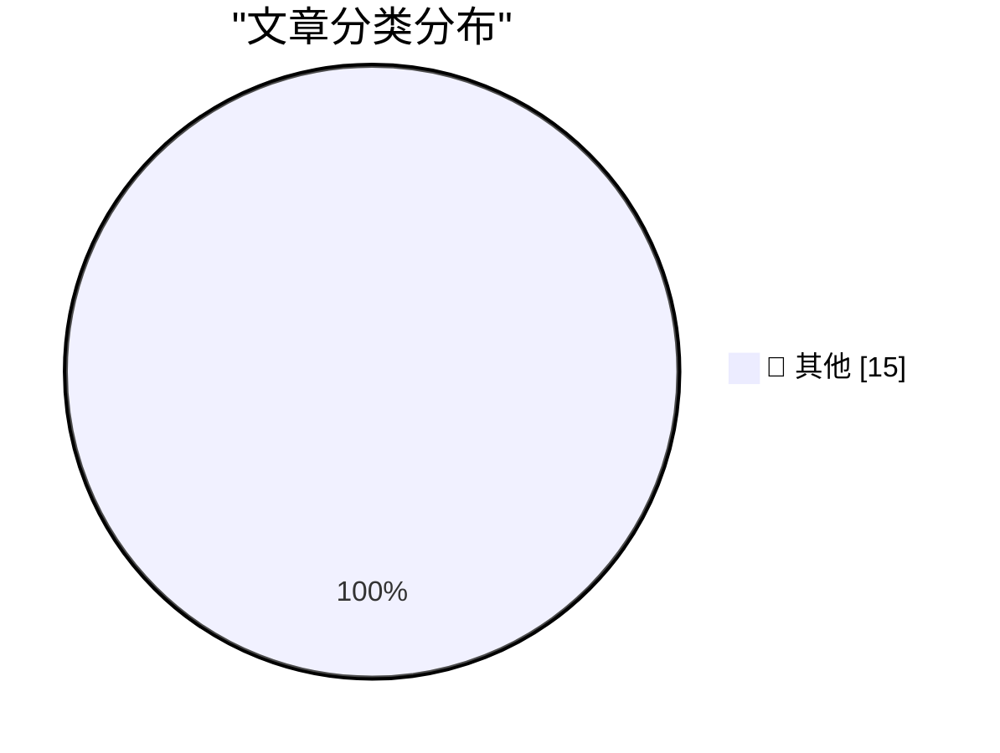

# 📰 AI 资讯每日精选 — 2026-05-08

> 汇聚 140+ 技术博客、X/Twitter、Hacker News、Reddit、Product Hunt、
> Lobste.rs、ClawFeed 日报及 GitHub Trending，经 AI 评分筛选。
>
> **本期内容**：🏆 今日必读 · 🌐 ClawFeed 日报 · 🔥 GitHub Trending · 📂 分类精选 · 🎨 设计与生成式 AI · 📊 数据概览

## 🏆 今日必读

🥇 **llm-gemini 0.31**

[llm-gemini 0.31](https://simonwillison.net/2026/May/7/llm-gemini/#atom-everything) — simonwillison.net · 5 小时前 · 📝 其他

> llm-gemini 0.31

🥈 **Big Words**

[Big Words](https://simonwillison.net/2026/May/7/big-words/#atom-everything) — simonwillison.net · 6 小时前 · 📝 其他

> Big Words

🥉 **Behind the Scenes Hardening Firefox with Claude Mythos Preview**

[Behind the Scenes Hardening Firefox with Claude Mythos Preview](https://simonwillison.net/2026/May/7/firefox-claude-mythos/#atom-everything) — simonwillison.net · 7 小时前 · 📝 其他

> Behind the Scenes Hardening Firefox with Claude Mythos Preview

4️⃣ **Notes on the xAI/Anthropic data center deal**

[Notes on the xAI/Anthropic data center deal](https://simonwillison.net/2026/May/7/xai-anthropic/#atom-everything) — simonwillison.net · 8 小时前 · 📝 其他

> Notes on the xAI/Anthropic data center deal

5️⃣ **GitHub Repo Stats**

[GitHub Repo Stats](https://simonwillison.net/2026/May/7/github-repo-stats/#atom-everything) — simonwillison.net · 18 小时前 · 📝 其他

> GitHub Repo Stats

---

## 🌐 ClawFeed 日报精选

> 来源：[ClawFeed](https://clawfeed.kevinhe.io) — AI 驱动的多源新闻聚合

### 🔥 今日头条

1. **OpenAI 把 Codex 从 coding tool 推向全工作流 agent 平台**
   今天最强主线就是 OpenAI 连续强化 Codex，新增 computer use、浏览器、image generation、memory、SSH devbox、并行 agents 和更多插件，目标已经不是“帮你写代码”，而是抢开发者与知识工作者的工作台入口。

2. **GPT-Rosalind 发布，frontier model 开始更明确切入生命科学**
   OpenAI 同步推出面向生命科学研究的 GPT-Rosalind，直接把能力包装到药物发现、基因组学、实验规划和转化医学流程，说明高价值垂直场景会越来越成为大模型产品化主战场。

3. **Claude Opus 4.7 刷新 agent 竞争强度**
   Anthropic 今天在社媒侧最强的产品信号是 Claude Opus 4.7，重点强调更稳的长任务执行、指令跟随和交付前自检。市场关注点继续从“聊天更像人”转向“能不能稳定干完复杂任务”。

4. **AI 安全和 cyber defense 持续升温**
   OpenAI 扩大 Trusted Access for Cyber，并开放更高信任级别团队申请 GPT-5.4-Cyber。Anthropic 则继续推进 Project Glasswing，把 Claude 往关键软件安全和基础设施防护场景里打，安全赛道已经明显进入平台级竞争。

5. **多模态 agent 和 world model 继续冒头**
   Google DeepMind 把 Gemini Robotics 接到 Spot 上，HeyGen 开源 HyperFrames，腾讯 HY-World-2.0 也被持续讨论。除了 coding agent，视频编辑、机器人执行、3D world generation 都在变成新一轮 agent 入口。

---

## 🔥 GitHub Trending

> 今日热门开源项目（全语言 + Python）

| # | 项目 | 描述 | ⭐ 总星 | 📈 今日 | 语言 |
|---|------|------|---------|---------|------|
| 1 | [Hmbown/DeepSeek-TUI](https://github.com/Hmbown/DeepSeek-TUI) 🤖 | Coding agent for DeepSeek models that runs in your terminal | 18.9k | +5799 | Rust |
| 2 | [addyosmani/agent-skills](https://github.com/addyosmani/agent-skills) 🤖 | Production-grade engineering skills for AI coding agents. | 33.0k | +3062 | Shell |
| 3 | [anthropics/financial-services](https://github.com/anthropics/financial-services) |  | 11.8k | +1343 | Python |
| 4 | [VectifyAI/PageIndex](https://github.com/VectifyAI/PageIndex) 🤖 | 📑 PageIndex: Document Index for Vectorless, Reasoning-ba... | 29.6k | +943 | Python |
| 5 | [docusealco/docuseal](https://github.com/docusealco/docuseal) | Open source DocuSign alternative. Create, fill, and sign ... | 15.6k | +900 | Ruby |
| 6 | [z-lab/dflash](https://github.com/z-lab/dflash) 🤖 | DFlash: Block Diffusion for Flash Speculative Decoding | 3.5k | +671 | Python |
| 7 | [cheahjs/free-llm-api-resources](https://github.com/cheahjs/free-llm-api-resources) 🤖 | A list of free LLM inference resources accessible via API. | 20.9k | +564 | Python |
| 8 | [LearningCircuit/local-deep-research](https://github.com/LearningCircuit/local-deep-research) 🤖 | ~95% on SimpleQA (e.g. Qwen3.6-27B on a 3090). Supports a... | 6.3k | +559 | Python |
| 9 | [InsForge/InsForge](https://github.com/InsForge/InsForge) 🤖 | InsForge is a Postgres-based backend with auth, storage, ... | 8.9k | +460 | TypeScript |
| 10 | [aaif-goose/goose](https://github.com/aaif-goose/goose) 🤖 | an open source, extensible AI agent that goes beyond code... | 44.5k | +390 | Rust |
| 11 | [freemocap/freemocap](https://github.com/freemocap/freemocap) | Free Motion Capture for Everyone 💀✨ | 8.1k | +256 | Python |
| 12 | [github/spec-kit](https://github.com/github/spec-kit) | 💫 Toolkit to help you get started with Spec-Driven Devel... | 93.2k | +244 | Python |
| 13 | [Augani/openreel-video](https://github.com/Augani/openreel-video) | OpenReel Video - Professional browser-based video editor.... | 1.7k | +233 | TypeScript |
| 14 | [PriorLabs/TabPFN](https://github.com/PriorLabs/TabPFN) | ⚡ TabPFN: Foundation Model for Tabular Data ⚡ | 6.8k | +230 | Python |
| 15 | [decolua/9router](https://github.com/decolua/9router) 🤖 | 🆓 Unlimited FREE AI coding. Connect Claude Code, Codex, ... | 4.6k | +149 | JavaScript |

---

## 📝 其他

### 1. llm-gemini 0.31

[llm-gemini 0.31](https://simonwillison.net/2026/May/7/llm-gemini/#atom-everything) — **simonwillison.net** · 5 小时前 · ⭐ 15/30

> llm-gemini 0.31

---

### 2. Big Words

[Big Words](https://simonwillison.net/2026/May/7/big-words/#atom-everything) — **simonwillison.net** · 6 小时前 · ⭐ 15/30

> Big Words

---

### 3. Behind the Scenes Hardening Firefox with Claude Mythos Preview

[Behind the Scenes Hardening Firefox with Claude Mythos Preview](https://simonwillison.net/2026/May/7/firefox-claude-mythos/#atom-everything) — **simonwillison.net** · 7 小时前 · ⭐ 15/30

> Behind the Scenes Hardening Firefox with Claude Mythos Preview

---

### 4. Notes on the xAI/Anthropic data center deal

[Notes on the xAI/Anthropic data center deal](https://simonwillison.net/2026/May/7/xai-anthropic/#atom-everything) — **simonwillison.net** · 8 小时前 · ⭐ 15/30

> Notes on the xAI/Anthropic data center deal

---

### 5. GitHub Repo Stats

[GitHub Repo Stats](https://simonwillison.net/2026/May/7/github-repo-stats/#atom-everything) — **simonwillison.net** · 18 小时前 · ⭐ 15/30

> GitHub Repo Stats

---

### 6. Prolost Watches 1.0

[Prolost Watches 1.0](https://prolost.com/blog/prolostwatches) — **daringfireball.net** · 3 小时前 · ⭐ 15/30

> Prolost Watches 1.0

---

### 7. The Greatest Match Cut in Cinematic History, Improved by Amazon Prime

[The Greatest Match Cut in Cinematic History, Improved by Amazon Prime](https://bsky.app/profile/gethill.bsky.social/post/3ml6fyfv7kc2l) — **daringfireball.net** · 10 小时前 · ⭐ 15/30

> The Greatest Match Cut in Cinematic History, Improved by Amazon Prime

---

### 8. Pluralistic: Bubbles are REALLY evil (07 May 2026)

[Pluralistic: Bubbles are REALLY evil (07 May 2026)](https://pluralistic.net/2026/05/07/dump-the-pumpers/) — **pluralistic.net** · 17 小时前 · ⭐ 15/30

> Pluralistic: Bubbles are REALLY evil (07 May 2026)

---

### 9. I've found just the right paper for my Bottom Hole problem

[I've found just the right paper for my Bottom Hole problem](https://shkspr.mobi/blog/2026/05/ive-found-just-the-right-paper-for-my-bottom-hole-problem/) — **shkspr.mobi** · 13 小时前 · ⭐ 15/30

> I've found just the right paper for my Bottom Hole problem

---

### 10. When you upgrade your resource strings to Unicode, don’t forget to specify the L prefix

[When you upgrade your resource strings to Unicode, don’t forget to specify the L prefix](https://devblogs.microsoft.com/oldnewthing/20260507-00/?p=112307) — **devblogs.microsoft.com/oldnewthing** · 11 小时前 · ⭐ 15/30

> When you upgrade your resource strings to Unicode, don’t forget to specify the L prefix

---

### 11. Smoothed polygons

[Smoothed polygons](https://www.johndcook.com/blog/2026/05/07/smoothed-polygons/) — **johndcook.com** · 7 小时前 · ⭐ 15/30

> Smoothed polygons

---

### 12. Free as in Tribbles

[Free as in Tribbles](https://nesbitt.io/2026/05/07/free-as-in-tribbles.html) — **nesbitt.io** · 15 小时前 · ⭐ 15/30

> Free as in Tribbles

---

### 13. How Long Do We Wait for New Inventions?

[How Long Do We Wait for New Inventions?](https://www.construction-physics.com/p/how-long-do-we-wait-for-new-inventions) — **construction-physics.com** · 10 小时前 · ⭐ 15/30

> How Long Do We Wait for New Inventions?

---

### 14. Intel Pentium II introduced May 7, 1997

[Intel Pentium II introduced May 7, 1997](https://dfarq.homeip.net/intel-pentium-ii-introduced-may-7-1997/?utm_source=rss&#038;utm_medium=rss&#038;utm_campaign=intel-pentium-ii-introduced-may-7-1997) — **dfarq.homeip.net** · 14 小时前 · ⭐ 15/30

> Intel Pentium II introduced May 7, 1997

---

### 15. Monitor your devices with LibreNMS on FreeBSD

[Monitor your devices with LibreNMS on FreeBSD](https://it-notes.dragas.net/2026/05/07/monitor-your-services-with-librenms-on-freebsd/) — **it-notes.dragas.net** · 14 小时前 · ⭐ 15/30

> Monitor your devices with LibreNMS on FreeBSD

---

## 🎨 Design & Generative AI

### 🖼️ 生成式图片

- **[So Far This is My Favorite Use-Case for LTX 2.3/ComfyUI](https://www.reddit.com/r/StableDiffusion/comments/1t64gni/so_far_this_is_my_favorite_usecase_for_ltx/)** — r/StableDiffusion · 16 小时前
  > So Far This is My Favorite Use-Case for LTX 2.3/ComfyUI

- **[CleanFreak - one-click "tidy by role" for ComfyUI — loaders / encoders / samplers / decoders each get their own column. 1200+ nodes pre-classified. Connections preserved.](https://www.reddit.com/r/StableDiffusion/comments/1t6exwi/cleanfreak_oneclick_tidy_by_role_for_comfyui/)** — r/StableDiffusion · 9 小时前
  > CleanFreak - one-click "tidy by role" for ComfyUI — loaders / encoders / samplers / decoders each get their own column. 1200+ nodes pre-classified. Connections preserved.

- **[I just tried Reactor's open source world model demo, here are my thoughts](https://www.reddit.com/r/StableDiffusion/comments/1t6qfff/i_just_tried_reactors_open_source_world_model/)** — r/StableDiffusion · 2 小时前
  > I just tried Reactor's open source world model demo, here are my thoughts

- **["Lighthouse" mode for ComfyUI — click any node and the rest of the workflow lights up by graph distance. Direct dependencies red, then orange, yellow, green, blue, violet.](https://www.reddit.com/r/StableDiffusion/comments/1t6ox12/lighthouse_mode_for_comfyui_click_any_node_and/)** — r/StableDiffusion · 3 小时前
  > "Lighthouse" mode for ComfyUI — click any node and the rest of the workflow lights up by graph distance. Direct dependencies red, then orange, yellow, green, blue, violet.

- **[Acestep.cpp can now outpaint](https://www.reddit.com/r/StableDiffusion/comments/1t6psua/acestepcpp_can_now_outpaint/)** — r/StableDiffusion · 2 小时前
  > Acestep.cpp can now outpaint

- **[Multi angle Lora for flux Klein](https://www.reddit.com/r/StableDiffusion/comments/1t64brq/multi_angle_lora_for_flux_klein/)** — r/StableDiffusion · 17 小时前
  > Multi angle Lora for flux Klein

- **[comfyui-lora-FindingLora - a Lora Loader with fuzzy search, one click chaining, bookmarks and triggers.](https://www.reddit.com/r/StableDiffusion/comments/1t6bf7b/comfyuilorafindinglora_a_lora_loader_with_fuzzy/)** — r/StableDiffusion · 11 小时前
  > comfyui-lora-FindingLora - a Lora Loader with fuzzy search, one click chaining, bookmarks and triggers.

- **[Anyone run ComfyUI in a Hyper-V VM?](https://www.reddit.com/r/StableDiffusion/comments/1t62b5r/anyone_run_comfyui_in_a_hyperv_vm/)** — r/StableDiffusion · 18 小时前
  > Anyone run ComfyUI in a Hyper-V VM?

- **[As a traditional oil painter, I used Midjourney as my new canvas to build an 84-minute Dark Fantasy film. Here is the trailer:](https://www.reddit.com/r/midjourney/comments/1t6dw1h/as_a_traditional_oil_painter_i_used_midjourney_as/)** — r/midjourney · 9 小时前
  > As a traditional oil painter, I used Midjourney as my new canvas to build an 84-minute Dark Fantasy film. Here is the trailer:

- **[Qwen 3.5 in ComfyUI + Align Tool & Pixaroma Nodes Updates (Ep16)](https://www.reddit.com/r/comfyui/comments/1t6dcfq/qwen_35_in_comfyui_align_tool_pixaroma_nodes/)** — r/comfyui · 10 小时前
  > Qwen 3.5 in ComfyUI + Align Tool & Pixaroma Nodes Updates (Ep16)

- **[Riel Studio — ComfyUI inside Blender (Working in progress)](https://www.reddit.com/r/comfyui/comments/1t6jbrq/riel_studio_comfyui_inside_blender_working_in/)** — r/comfyui · 6 小时前
  > Riel Studio — ComfyUI inside Blender (Working in progress)

- **[Why are there two different ComfyUI-Manager's?](https://www.reddit.com/r/comfyui/comments/1t6qiaz/why_are_there_two_different_comfyuimanagers/)** — r/comfyui · 2 小时前
  > Why are there two different ComfyUI-Manager's?

- **[Naming Lora's so that they do not load in comfyui](https://www.reddit.com/r/comfyui/comments/1t6ppq3/naming_loras_so_that_they_do_not_load_in_comfyui/)** — r/comfyui · 2 小时前
  > Naming Lora's so that they do not load in comfyui

- **[FREE Swin2SR + Real-ESRGAN + GFPGAN API for ComfyUI workflows - useknockout](https://www.reddit.com/r/comfyui/comments/1t6r123/free_swin2sr_realesrgan_gfpgan_api_for_comfyui/)** — r/comfyui · 1 小时前
  > FREE Swin2SR + Real-ESRGAN + GFPGAN API for ComfyUI workflows - useknockout

- **[New to comfyui, I have question about custom nodes.](https://www.reddit.com/r/comfyui/comments/1t5xwbu/new_to_comfyui_i_have_question_about_custom_nodes/)** — r/comfyui · 22 小时前
  > New to comfyui, I have question about custom nodes.

---

## 📊 数据概览

| 扫描源 | 抓取文章 | 时间范围 | 精选 |
|:---:|:---:|:---:|:---:|
| 105/140 | 4254 篇 → 202 篇 | 24h | **15 篇** |

### 分类分布

---

*生成于 2026-05-08 01:26 | 汇聚 140 个技术博客、X/Twitter、Hacker News、Reddit、Product Hunt、Lobste.rs、ClawFeed 日报及 GitHub Trending，经 AI 评分筛选出 Top 15 精华内容*
