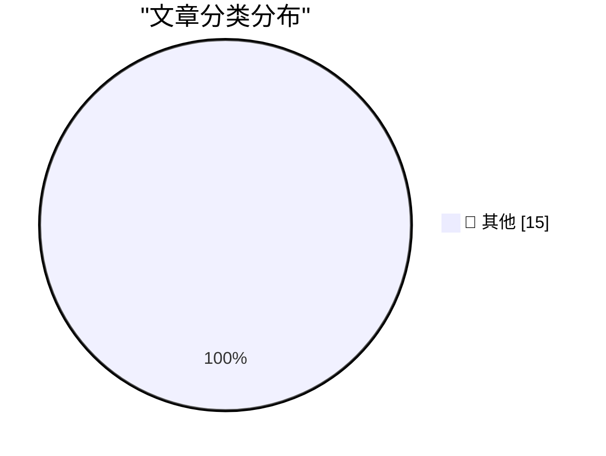

# 📰 AI 资讯每日精选 — 2026-05-09

> 汇聚 140+ 技术博客、X/Twitter、Hacker News、Reddit、Product Hunt、
> Lobste.rs、ClawFeed 日报及 GitHub Trending，经 AI 评分筛选。
>
> **本期内容**：🏆 今日必读 · 🌐 ClawFeed 日报 · 🔥 GitHub Trending · 📂 分类精选 · 🎨 设计与生成式 AI · 📊 数据概览

## 🏆 今日必读

🥇 **Quoting Luke Curley**

[Quoting Luke Curley](https://simonwillison.net/2026/May/9/luke-curley/#atom-everything) — simonwillison.net · 19 分钟前 · 📝 其他

> Quoting Luke Curley

🥈 **Using Claude Code: The Unreasonable Effectiveness of HTML**

[Using Claude Code: The Unreasonable Effectiveness of HTML](https://simonwillison.net/2026/May/8/unreasonable-effectiveness-of-html/#atom-everything) — simonwillison.net · 4 小时前 · 📝 其他

> Using Claude Code: The Unreasonable Effectiveness of HTML

🥉 **HomePod mini feels like magic, but it's just good timing**

[HomePod mini feels like magic, but it's just good timing](https://www.jeffgeerling.com/blog/2026/homepod-mini-feels-like-magic--but-it-s-just-good-timing/) — jeffgeerling.com · 11 小时前 · 📝 其他

> HomePod mini feels like magic, but it's just good timing

4️⃣ **Canvas Breach Disrupts Schools & Colleges Nationwide**

[Canvas Breach Disrupts Schools & Colleges Nationwide](https://krebsonsecurity.com/2026/05/canvas-breach-disrupts-schools-colleges-nationwide/) — krebsonsecurity.com · 22 小时前 · 📝 其他

> Canvas Breach Disrupts Schools & Colleges Nationwide

5️⃣ **Hi stranger**

[Hi stranger](https://idiallo.com/blog/hi?src=feed) — idiallo.com · 11 小时前 · 📝 其他

> Hi stranger

---

## 🌐 ClawFeed 日报精选

> 来源：[ClawFeed](https://clawfeed.kevinhe.io) — AI 驱动的多源新闻聚合

### 🔥 今日头条

1. **OpenAI 把 Codex 从 coding tool 推向全工作流 agent 平台**
   今天最强主线就是 OpenAI 连续强化 Codex，新增 computer use、浏览器、image generation、memory、SSH devbox、并行 agents 和更多插件，目标已经不是“帮你写代码”，而是抢开发者与知识工作者的工作台入口。

2. **GPT-Rosalind 发布，frontier model 开始更明确切入生命科学**
   OpenAI 同步推出面向生命科学研究的 GPT-Rosalind，直接把能力包装到药物发现、基因组学、实验规划和转化医学流程，说明高价值垂直场景会越来越成为大模型产品化主战场。

3. **Claude Opus 4.7 刷新 agent 竞争强度**
   Anthropic 今天在社媒侧最强的产品信号是 Claude Opus 4.7，重点强调更稳的长任务执行、指令跟随和交付前自检。市场关注点继续从“聊天更像人”转向“能不能稳定干完复杂任务”。

4. **AI 安全和 cyber defense 持续升温**
   OpenAI 扩大 Trusted Access for Cyber，并开放更高信任级别团队申请 GPT-5.4-Cyber。Anthropic 则继续推进 Project Glasswing，把 Claude 往关键软件安全和基础设施防护场景里打，安全赛道已经明显进入平台级竞争。

5. **多模态 agent 和 world model 继续冒头**
   Google DeepMind 把 Gemini Robotics 接到 Spot 上，HeyGen 开源 HyperFrames，腾讯 HY-World-2.0 也被持续讨论。除了 coding agent，视频编辑、机器人执行、3D world generation 都在变成新一轮 agent 入口。

---

## 🔥 GitHub Trending

> 今日热门开源项目（全语言 + Python）

| # | 项目 | 描述 | ⭐ 总星 | 📈 今日 | 语言 |
|---|------|------|---------|---------|------|
| 1 | [Hmbown/DeepSeek-TUI](https://github.com/Hmbown/DeepSeek-TUI) 🤖 | Coding agent for DeepSeek models that runs in your terminal | 21.8k | +3731 | Rust |
| 2 | [anthropics/financial-services](https://github.com/anthropics/financial-services) |  | 15.2k | +3660 | Python |
| 3 | [addyosmani/agent-skills](https://github.com/addyosmani/agent-skills) 🤖 | Production-grade engineering skills for AI coding agents. | 35.4k | +1893 | Shell |
| 4 | [decolua/9router](https://github.com/decolua/9router) 🤖 | Unlimited FREE AI coding. Connect Claude Code, Codex, Cur... | 5.6k | +1052 | JavaScript |
| 5 | [datawhalechina/hello-agents](https://github.com/datawhalechina/hello-agents) | 📚 《从零开始构建智能体》——从零开始的智能体原理与实践教程 | 44.6k | +667 | Python |
| 6 | [LearningCircuit/local-deep-research](https://github.com/LearningCircuit/local-deep-research) 🤖 | ~95% on SimpleQA (e.g. Qwen3.6-27B on a 3090). Supports a... | 6.7k | +559 | Python |
| 7 | [CloakHQ/CloakBrowser](https://github.com/CloakHQ/CloakBrowser) | Stealth Chromium that passes every bot detection test. Dr... | 3.0k | +526 | Python |
| 8 | [z-lab/dflash](https://github.com/z-lab/dflash) 🤖 | DFlash: Block Diffusion for Flash Speculative Decoding | 3.9k | +379 | Python |
| 9 | [freemocap/freemocap](https://github.com/freemocap/freemocap) | Free Motion Capture for Everyone 💀✨ | 8.3k | +272 | Python |
| 10 | [HKUDS/AI-Trader](https://github.com/HKUDS/AI-Trader) 🤖 | "AI-Trader: 100% Fully-Automated Agent-Native Trading" | 14.6k | +202 | Python |
| 11 | [cheahjs/free-llm-api-resources](https://github.com/cheahjs/free-llm-api-resources) 🤖 | A list of free LLM inference resources accessible via API. | 21.1k | +177 | Python |
| 12 | [PaddlePaddle/PaddleOCR](https://github.com/PaddlePaddle/PaddleOCR) 🤖 | Turn any PDF or image document into structured data for y... | 77.4k | +134 | Python |
| 13 | [lobehub/lobehub](https://github.com/lobehub/lobehub) 🤖 | The ultimate space for work and life — to find, build, an... | 76.5k | +125 | TypeScript |
| 14 | [flutter/skills](https://github.com/flutter/skills) |  | 1.7k | +118 | Dart |
| 15 | [anthropics/claude-plugins-official](https://github.com/anthropics/claude-plugins-official) 🤖 | Official, Anthropic-managed directory of high quality Cla... | 18.9k | +108 | Python |

---

## 📝 其他

### 1. Quoting Luke Curley

[Quoting Luke Curley](https://simonwillison.net/2026/May/9/luke-curley/#atom-everything) — **simonwillison.net** · 19 分钟前 · ⭐ 15/30

> Quoting Luke Curley

---

### 2. Using Claude Code: The Unreasonable Effectiveness of HTML

[Using Claude Code: The Unreasonable Effectiveness of HTML](https://simonwillison.net/2026/May/8/unreasonable-effectiveness-of-html/#atom-everything) — **simonwillison.net** · 4 小时前 · ⭐ 15/30

> Using Claude Code: The Unreasonable Effectiveness of HTML

---

### 3. HomePod mini feels like magic, but it's just good timing

[HomePod mini feels like magic, but it's just good timing](https://www.jeffgeerling.com/blog/2026/homepod-mini-feels-like-magic--but-it-s-just-good-timing/) — **jeffgeerling.com** · 11 小时前 · ⭐ 15/30

> HomePod mini feels like magic, but it's just good timing

---

### 4. Canvas Breach Disrupts Schools & Colleges Nationwide

[Canvas Breach Disrupts Schools & Colleges Nationwide](https://krebsonsecurity.com/2026/05/canvas-breach-disrupts-schools-colleges-nationwide/) — **krebsonsecurity.com** · 22 小时前 · ⭐ 15/30

> Canvas Breach Disrupts Schools & Colleges Nationwide

---

### 5. Hi stranger

[Hi stranger](https://idiallo.com/blog/hi?src=feed) — **idiallo.com** · 11 小时前 · ⭐ 15/30

> Hi stranger

---

### 6. Pluralistic: Lee Lai's "Cannon" (08 May 2026)

[Pluralistic: Lee Lai's "Cannon" (08 May 2026)](https://pluralistic.net/2026/05/08/gung-gung/) — **pluralistic.net** · 13 小时前 · ⭐ 15/30

> Pluralistic: Lee Lai's "Cannon" (08 May 2026)

---

### 7. Developing more confidence when tracking renames via Read­Directory­ChangesW

[Developing more confidence when tracking renames via Read­Directory­ChangesW](https://devblogs.microsoft.com/oldnewthing/20260508-00/?p=112310) — **devblogs.microsoft.com/oldnewthing** · 11 小时前 · ⭐ 15/30

> Developing more confidence when tracking renames via Read­Directory­ChangesW

---

### 8. Calculating curvature

[Calculating curvature](https://www.johndcook.com/blog/2026/05/08/calculating-curvature/) — **johndcook.com** · 11 小时前 · ⭐ 15/30

> Calculating curvature

---

### 9. Weekend at Bernie’s

[Weekend at Bernie’s](https://nesbitt.io/2026/05/08/weekend-at-bernies.html) — **nesbitt.io** · 15 小时前 · ⭐ 15/30

> Weekend at Bernie’s

---

### 10. David Reich – Why the Bronze Age was an inflection point in human evolution

[David Reich – Why the Bronze Age was an inflection point in human evolution](https://www.dwarkesh.com/p/david-reich-2) — **dwarkesh.com** · 8 小时前 · ⭐ 15/30

> David Reich – Why the Bronze Age was an inflection point in human evolution

---

### 11. Premium: AI's Circular Psychosis

[Premium: AI's Circular Psychosis](https://www.wheresyoured.at/premium-ais-circular-psychosis/) — **wheresyoured.at** · 10 小时前 · ⭐ 15/30

> Premium: AI's Circular Psychosis

---

### 12. This Week on The Analog Antiquarian

[This Week on The Analog Antiquarian](https://www.filfre.net/2026/05/this-week-on-the-analog-antiquarian/) — **filfre.net** · 9 小时前 · ⭐ 15/30

> This Week on The Analog Antiquarian

---

### 13. Dell buys Alienware, May 8, 2006

[Dell buys Alienware, May 8, 2006](https://dfarq.homeip.net/dell-buys-alienware-may-8-2006/?utm_source=rss&#038;utm_medium=rss&#038;utm_campaign=dell-buys-alienware-may-8-2006) — **dfarq.homeip.net** · 14 小时前 · ⭐ 15/30

> Dell buys Alienware, May 8, 2006

---

### 14. George Orwell's review of Russel's Power: A New Social Analysis

[George Orwell's review of Russel's Power: A New Social Analysis](https://berthub.eu/articles/posts/orwell-review-bertrand-russells-power/) — **berthub.eu** · 4 小时前 · ⭐ 15/30

> George Orwell's review of Russel's Power: A New Social Analysis

---

### 15. CyberSecQwen-4B: Why Defensive Cyber Needs Small, Specialized, Locally-Runnable Models

[CyberSecQwen-4B: Why Defensive Cyber Needs Small, Specialized, Locally-Runnable Models](https://huggingface.co/blog/lablab-ai-amd-developer-hackathon/cybersecqwen-4b) — **Hugging Face Blog** · 7 小时前 · ⭐ 15/30

> CyberSecQwen-4B: Why Defensive Cyber Needs Small, Specialized, Locally-Runnable Models

---

## 🎨 Design & Generative AI

### 🖼️ 生成式图片

- **[Why is it that 3 years old SDXL is still the best base for porn checkpoints, where the best ones on civitai produce materially better images than the z image or flux porn checkpoints in terms of realism and skin texture?](https://www.reddit.com/r/StableDiffusion/comments/1t71cs5/why_is_it_that_3_years_old_sdxl_is_still_the_best/)** — r/StableDiffusion · 17 小时前
  > Why is it that 3 years old SDXL is still the best base for porn checkpoints, where the best ones on civitai produce materially better images than the z image or flux porn checkpoints in terms of realism and skin texture?

- **[Revisiting WAN 2.2 for real-person realism, consented LoRA, retuned settings](https://www.reddit.com/r/StableDiffusion/comments/1t7cnaj/revisiting_wan_22_for_realperson_realism/)** — r/StableDiffusion · 9 小时前
  > Revisiting WAN 2.2 for real-person realism, consented LoRA, retuned settings

- **[Spent 3 training rounds trying to get a Jean-Léon Gérôme lora to retain fini surfaces](https://www.reddit.com/r/StableDiffusion/comments/1t7kpic/spent_3_training_rounds_trying_to_get_a_jeanléon/)** — r/StableDiffusion · 4 小时前
  > Spent 3 training rounds trying to get a Jean-Léon Gérôme lora to retain fini surfaces

- **[LTX 2.3 ID-LoRA with First-Last Frame](https://www.reddit.com/r/StableDiffusion/comments/1t71x0r/ltx_23_idlora_with_firstlast_frame/)** — r/StableDiffusion · 16 小时前
  > LTX 2.3 ID-LoRA with First-Last Frame

- **[Using Codex to drive ComfyUI server. Fully automatic sequence and batch generations](https://www.reddit.com/r/comfyui/comments/1t6wdcd/using_codex_to_drive_comfyui_server_fully/)** — r/comfyui · 21 小时前
  > Using Codex to drive ComfyUI server. Fully automatic sequence and batch generations

- **[Create automated AI music videos with my full LTX 2.3 workflow for ComfyUI. FREE and LOCAL](https://www.reddit.com/r/comfyui/comments/1t7ohql/create_automated_ai_music_videos_with_my_full_ltx/)** — r/comfyui · 1 小时前
  > Create automated AI music videos with my full LTX 2.3 workflow for ComfyUI. FREE and LOCAL

- **[WAN 2.2 + character LoRA for video — my workflow for animating AI influencer characters consistently](https://www.reddit.com/r/comfyui/comments/1t7g4nh/wan_22_character_lora_for_video_my_workflow_for/)** — r/comfyui · 7 小时前
  > WAN 2.2 + character LoRA for video — my workflow for animating AI influencer characters consistently

- **[I built a skill based tool for codex and other agents to create media using comfyui](https://www.reddit.com/r/comfyui/comments/1t71cnh/i_built_a_skill_based_tool_for_codex_and_other/)** — r/comfyui · 17 小时前
  > I built a skill based tool for codex and other agents to create media using comfyui

- **[Is there a pause or coolf off node for comfyui? Just for to lessen GPU heat?](https://www.reddit.com/r/comfyui/comments/1t6v4uc/is_there_a_pause_or_coolf_off_node_for_comfyui/)** — r/comfyui · 22 小时前
  > Is there a pause or coolf off node for comfyui? Just for to lessen GPU heat?

- **[Oficial Comfyui cloud vs others like runpod?](https://www.reddit.com/r/comfyui/comments/1t7jgc3/oficial_comfyui_cloud_vs_others_like_runpod/)** — r/comfyui · 5 小时前
  > Oficial Comfyui cloud vs others like runpod?

- **[Local AI image/video generation like Kling motion control — what tools, and will 16GB RAM + NVIDIA work?](https://www.reddit.com/r/comfyui/comments/1t736x4/local_ai_imagevideo_generation_like_kling_motion/)** — r/comfyui · 15 小时前
  > Local AI image/video generation like Kling motion control — what tools, and will 16GB RAM + NVIDIA work?

---

## 📊 数据概览

| 扫描源 | 抓取文章 | 时间范围 | 精选 |
|:---:|:---:|:---:|:---:|
| 115/140 | 5281 篇 → 194 篇 | 24h | **15 篇** |

### 分类分布

---

*生成于 2026-05-09 01:23 | 汇聚 140 个技术博客、X/Twitter、Hacker News、Reddit、Product Hunt、Lobste.rs、ClawFeed 日报及 GitHub Trending，经 AI 评分筛选出 Top 15 精华内容*
