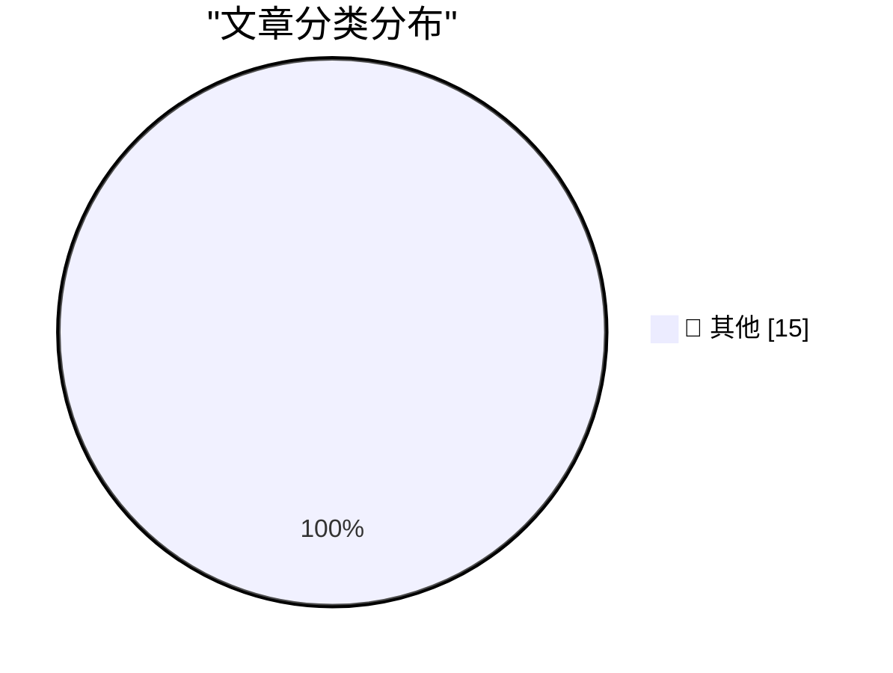

# 📰 AI 资讯每日精选 — 2026-05-10

> 汇聚 140+ 技术博客、X/Twitter、Hacker News、Reddit、Product Hunt、
> Lobste.rs、ClawFeed 日报及 GitHub Trending，经 AI 评分筛选。
>
> **本期内容**：🏆 今日必读 · 🌐 ClawFeed 日报 · 🔥 GitHub Trending · 📂 分类精选 · 🎨 设计与生成式 AI · 📊 数据概览

## 🏆 今日必读

🥇 **Pluralistic: Trump's fruitless search for a goreable ox (09 May 2026)**

[Pluralistic: Trump's fruitless search for a goreable ox (09 May 2026)](https://pluralistic.net/2026/05/09/cossie-livvie-crissie/) — pluralistic.net · 12 小时前 · 📝 其他

> Pluralistic: Trump's fruitless search for a goreable ox (09 May 2026)

🥈 **Book Review: The Names by Florence Knapp ★★⯪☆☆**

[Book Review: The Names by Florence Knapp ★★⯪☆☆](https://shkspr.mobi/blog/2026/05/book-review-the-names-by-florence-knapp/) — shkspr.mobi · 13 小时前 · 📝 其他

> Book Review: The Names by Florence Knapp ★★⯪☆☆

🥉 **The Mismeasure of Open Source**

[The Mismeasure of Open Source](https://nesbitt.io/2026/05/09/the-mismeasure-of-open-source.html) — nesbitt.io · 15 小时前 · 📝 其他

> The Mismeasure of Open Source

4️⃣ **Reading List 05/09/2026**

[Reading List 05/09/2026](https://www.construction-physics.com/p/reading-list-05092026) — construction-physics.com · 13 小时前 · 📝 其他

> Reading List 05/09/2026

5️⃣ **The Real Singularity is the Friends We Made Along the Way**

[The Real Singularity is the Friends We Made Along the Way](https://geohot.github.io//blog/jekyll/update/2026/05/09/real-singularity.html) — geohot.github.io · 18 小时前 · 📝 其他

> The Real Singularity is the Friends We Made Along the Way

---

## 🌐 ClawFeed 日报精选

> 来源：[ClawFeed](https://clawfeed.kevinhe.io) — AI 驱动的多源新闻聚合

### 🔥 今日头条

1. **OpenAI 把 Codex 从 coding tool 推向全工作流 agent 平台**
   今天最强主线就是 OpenAI 连续强化 Codex，新增 computer use、浏览器、image generation、memory、SSH devbox、并行 agents 和更多插件，目标已经不是“帮你写代码”，而是抢开发者与知识工作者的工作台入口。

2. **GPT-Rosalind 发布，frontier model 开始更明确切入生命科学**
   OpenAI 同步推出面向生命科学研究的 GPT-Rosalind，直接把能力包装到药物发现、基因组学、实验规划和转化医学流程，说明高价值垂直场景会越来越成为大模型产品化主战场。

3. **Claude Opus 4.7 刷新 agent 竞争强度**
   Anthropic 今天在社媒侧最强的产品信号是 Claude Opus 4.7，重点强调更稳的长任务执行、指令跟随和交付前自检。市场关注点继续从“聊天更像人”转向“能不能稳定干完复杂任务”。

4. **AI 安全和 cyber defense 持续升温**
   OpenAI 扩大 Trusted Access for Cyber，并开放更高信任级别团队申请 GPT-5.4-Cyber。Anthropic 则继续推进 Project Glasswing，把 Claude 往关键软件安全和基础设施防护场景里打，安全赛道已经明显进入平台级竞争。

5. **多模态 agent 和 world model 继续冒头**
   Google DeepMind 把 Gemini Robotics 接到 Spot 上，HeyGen 开源 HyperFrames，腾讯 HY-World-2.0 也被持续讨论。除了 coding agent，视频编辑、机器人执行、3D world generation 都在变成新一轮 agent 入口。

---

## 🔥 GitHub Trending

> 今日热门开源项目（全语言 + Python）

| # | 项目 | 描述 | ⭐ 总星 | 📈 今日 | 语言 |
|---|------|------|---------|---------|------|
| 1 | [anthropics/financial-services](https://github.com/anthropics/financial-services) |  | 17.4k | +3281 | Python |
| 2 | [addyosmani/agent-skills](https://github.com/addyosmani/agent-skills) 🤖 | Production-grade engineering skills for AI coding agents. | 37.4k | +3009 | Shell |
| 3 | [datawhalechina/hello-agents](https://github.com/datawhalechina/hello-agents) | 📚 《从零开始构建智能体》——从零开始的智能体原理与实践教程 | 45.7k | +1197 | Python |
| 4 | [CloakHQ/CloakBrowser](https://github.com/CloakHQ/CloakBrowser) | Stealth Chromium that passes every bot detection test. Dr... | 4.0k | +1167 | Python |
| 5 | [decolua/9router](https://github.com/decolua/9router) 🤖 | Unlimited FREE AI coding. Connect Claude Code, Codex, Cur... | 6.5k | +1031 | JavaScript |
| 6 | [github/spec-kit](https://github.com/github/spec-kit) | 💫 Toolkit to help you get started with Spec-Driven Devel... | 94.4k | +811 | Python |
| 7 | [HKUDS/AI-Trader](https://github.com/HKUDS/AI-Trader) 🤖 | "AI-Trader: 100% Fully-Automated Agent-Native Trading" | 15.1k | +646 | Python |
| 8 | [masterking32/MasterDnsVPN](https://github.com/masterking32/MasterDnsVPN) | Advanced DNS tunneling VPN for censorship bypass, optimiz... | 2.5k | +597 | Go |
| 9 | [bytedance/UI-TARS-desktop](https://github.com/bytedance/UI-TARS-desktop) 🤖 | The Open-Source Multimodal AI Agent Stack: Connecting Cut... | 31.4k | +552 | TypeScript |
| 10 | [lsdefine/GenericAgent](https://github.com/lsdefine/GenericAgent) 🤖 | Self-evolving agent: grows skill tree from 3.3K-line seed... | 10.3k | +538 | Python |
| 11 | [rohitg00/agentmemory](https://github.com/rohitg00/agentmemory) 🤖 | #1 Persistent memory for AI coding agents based on real-w... | 3.4k | +533 | TypeScript |
| 12 | [playcanvas/supersplat](https://github.com/playcanvas/supersplat) | 3D Gaussian Splat Editor | 6.3k | +514 | TypeScript |
| 13 | [LearningCircuit/local-deep-research](https://github.com/LearningCircuit/local-deep-research) 🤖 | ~95% on SimpleQA (e.g. Qwen3.6-27B on a 3090). Supports a... | 7.0k | +322 | Python |
| 14 | [datawhalechina/easy-vibe](https://github.com/datawhalechina/easy-vibe) | 💻 vibe coding 2026 | Your first modern programming cours... | 8.5k | +294 | JavaScript |
| 15 | [Lordog/dive-into-llms](https://github.com/Lordog/dive-into-llms) | 《动手学大模型Dive into LLMs》系列编程实践教程 | 36.5k | +160 | Jupyter Notebook |

---

## 📝 其他

### 1. Pluralistic: Trump's fruitless search for a goreable ox (09 May 2026)

[Pluralistic: Trump's fruitless search for a goreable ox (09 May 2026)](https://pluralistic.net/2026/05/09/cossie-livvie-crissie/) — **pluralistic.net** · 12 小时前 · ⭐ 15/30

> Pluralistic: Trump's fruitless search for a goreable ox (09 May 2026)

---

### 2. Book Review: The Names by Florence Knapp ★★⯪☆☆

[Book Review: The Names by Florence Knapp ★★⯪☆☆](https://shkspr.mobi/blog/2026/05/book-review-the-names-by-florence-knapp/) — **shkspr.mobi** · 13 小时前 · ⭐ 15/30

> Book Review: The Names by Florence Knapp ★★⯪☆☆

---

### 3. The Mismeasure of Open Source

[The Mismeasure of Open Source](https://nesbitt.io/2026/05/09/the-mismeasure-of-open-source.html) — **nesbitt.io** · 15 小时前 · ⭐ 15/30

> The Mismeasure of Open Source

---

### 4. Reading List 05/09/2026

[Reading List 05/09/2026](https://www.construction-physics.com/p/reading-list-05092026) — **construction-physics.com** · 13 小时前 · ⭐ 15/30

> Reading List 05/09/2026

---

### 5. The Real Singularity is the Friends We Made Along the Way

[The Real Singularity is the Friends We Made Along the Way](https://geohot.github.io//blog/jekyll/update/2026/05/09/real-singularity.html) — **geohot.github.io** · 18 小时前 · ⭐ 15/30

> The Real Singularity is the Friends We Made Along the Way

---

### 6. "OncoAgent: A Dual-Tier Multi-Agent Framework for Privacy-Preserving Oncology Clinical Decision Support"

["OncoAgent: A Dual-Tier Multi-Agent Framework for Privacy-Preserving Oncology Clinical Decision Support"](https://huggingface.co/blog/lablab-ai-amd-developer-hackathon/oncoagent-official-paper) — **Hugging Face Blog** · 7 小时前 · ⭐ 15/30

> "OncoAgent: A Dual-Tier Multi-Agent Framework for Privacy-Preserving Oncology Clinical Decision Support"

---

### 7. Fields Medalist says ChatGPT 5.5 Pro delivered "PhD-level" math research in under two hours with zero human help

[Fields Medalist says ChatGPT 5.5 Pro delivered "PhD-level" math research in under two hours with zero human help](https://the-decoder.com/fields-medalist-says-chatgpt-5-5-pro-delivered-phd-level-math-research-in-under-two-hours-with-zero-human-help/) — **The Decoder** · 10 小时前 · ⭐ 15/30

> Fields Medalist says ChatGPT 5.5 Pro delivered "PhD-level" math research in under two hours with zero human help

---

### 8. Broadcom reportedly won't build OpenAI's custom chip unless Microsoft buys 40 percent of them

[Broadcom reportedly won't build OpenAI's custom chip unless Microsoft buys 40 percent of them](https://the-decoder.com/broadcom-reportedly-wont-build-openais-custom-chip-unless-microsoft-buys-40-percent-of-them/) — **The Decoder** · 14 小时前 · ⭐ 15/30

> Broadcom reportedly won't build OpenAI's custom chip unless Microsoft buys 40 percent of them

---

### 9. Google's "Preferred Sources" feature is a free pass for more garbage in search

[Google's "Preferred Sources" feature is a free pass for more garbage in search](https://the-decoder.com/googles-preferred-sources-feature-is-a-free-pass-for-more-garbage-in-search/) — **The Decoder** · 14 小时前 · ⭐ 15/30

> Google's "Preferred Sources" feature is a free pass for more garbage in search

---

### 10. Pseudoscientific emotion AI is invading the workplace, an Atlantic report shows

[Pseudoscientific emotion AI is invading the workplace, an Atlantic report shows](https://the-decoder.com/pseudoscientific-emotion-ai-is-invading-the-workplace-an-atlantic-report-shows/) — **The Decoder** · 18 小时前 · ⭐ 15/30

> Pseudoscientific emotion AI is invading the workplace, an Atlantic report shows

---

### 11. Meta's embrace of A.I. is making its employees miserable

[Meta's embrace of A.I. is making its employees miserable](https://www.nytimes.com/2026/05/08/technology/meta-ai-employees-miserable.html) — **Hacker News Best** · 6 小时前 · ⭐ 15/30

> Meta's embrace of A.I. is making its employees miserable

---

### 12. I’ve banned query strings

[I’ve banned query strings](https://chrismorgan.info/no-query-strings) — **Hacker News Best** · 8 小时前 · ⭐ 15/30

> I’ve banned query strings

---

### 13. GrapheneOS fixes Android VPN leak Google refused to patch

[GrapheneOS fixes Android VPN leak Google refused to patch](https://cyberinsider.com/grapheneos-fixes-android-vpn-leak-google-refused-to-patch/) — **Hacker News Best** · 11 小时前 · ⭐ 15/30

> GrapheneOS fixes Android VPN leak Google refused to patch

---

### 14. The hypocrisy of cyberlibertarianism

[The hypocrisy of cyberlibertarianism](https://matduggan.com/the-intolerable-hypocrisy-of-cyberlibertarianism/) — **Hacker News Best** · 11 小时前 · ⭐ 15/30

> The hypocrisy of cyberlibertarianism

---

### 15. Internet Archive Switzerland

[Internet Archive Switzerland](https://blog.archive.org/2026/05/06/internet-archive-switzerland-expanding-a-global-mission-to-preserve-knowledge/) — **Hacker News Best** · 13 小时前 · ⭐ 15/30

> Internet Archive Switzerland

---

## 🎨 Design & Generative AI

### 🖼️ 生成式图片

- **[IMG Dataset Refiner v4.0 Pro - The Ultimate Dataset Engineering Suite for LoRAs (Flux, SDXL, etc...)](https://www.reddit.com/r/StableDiffusion/comments/1t7ttp0/img_dataset_refiner_v40_pro_the_ultimate_dataset/)** — r/StableDiffusion · 21 小时前
  > IMG Dataset Refiner v4.0 Pro - The Ultimate Dataset Engineering Suite for LoRAs (Flux, SDXL, etc...)

- **[SenseNova U1 ComfyUI Node: 8-step LoRA support and GGUF VRAM/RAM optimization tips](https://www.reddit.com/r/StableDiffusion/comments/1t85a60/sensenova_u1_comfyui_node_8step_lora_support_and/)** — r/StableDiffusion · 11 小时前
  > SenseNova U1 ComfyUI Node: 8-step LoRA support and GGUF VRAM/RAM optimization tips

- **[Teal Dark - Flux.2 Klein 9b style/aesthetic LORA](https://www.reddit.com/r/StableDiffusion/comments/1t8bn7f/teal_dark_flux2_klein_9b_styleaesthetic_lora/)** — r/StableDiffusion · 7 小时前
  > Teal Dark - Flux.2 Klein 9b style/aesthetic LORA

- **[Wan 2.2 with LTX 2.3 ID-LoRA](https://www.reddit.com/r/StableDiffusion/comments/1t8qloh/wan_22_with_ltx_23_idlora/)** — r/StableDiffusion · 1 小时前
  > Wan 2.2 with LTX 2.3 ID-LoRA

- **[What is the best workflow for captioning/tagging images for training a LoRA on Anima Preview 3?](https://www.reddit.com/r/StableDiffusion/comments/1t84gdt/what_is_the_best_workflow_for_captioningtagging/)** — r/StableDiffusion · 12 小时前
  > What is the best workflow for captioning/tagging images for training a LoRA on Anima Preview 3?

- **[Windows or Linux For Local Ai mainly Comfyui, LM-studio, Ostris-Ai toolkit and very rarely N8N and ollama](https://www.reddit.com/r/StableDiffusion/comments/1t864mo/windows_or_linux_for_local_ai_mainly_comfyui/)** — r/StableDiffusion · 11 小时前
  > Windows or Linux For Local Ai mainly Comfyui, LM-studio, Ostris-Ai toolkit and very rarely N8N and ollama

- **[Music video created solely with Midjourney](https://www.reddit.com/r/midjourney/comments/1t8qfp6/music_video_created_solely_with_midjourney/)** — r/midjourney · 1 小时前
  > Music video created solely with Midjourney

- **[Any ideas when video gen will be getting an update? It's absolutely rubbish even compared to sora 1. Every other model has left it in the dust.](https://www.reddit.com/r/midjourney/comments/1t8cgy1/any_ideas_when_video_gen_will_be_getting_an/)** — r/midjourney · 7 小时前
  > Any ideas when video gen will be getting an update? It's absolutely rubbish even compared to sora 1. Every other model has left it in the dust.

- **[The Sense Nova U1 now supports ComfyUI nodes](https://www.reddit.com/r/comfyui/comments/1t84ihw/the_sense_nova_u1_now_supports_comfyui_nodes/)** — r/comfyui · 12 小时前
  > The Sense Nova U1 now supports ComfyUI nodes

- **[Wan 2.7, HappyHorse, Veo 3.1, Seedance 2.0 on 8 prompts. None of them won everything](https://www.reddit.com/r/comfyui/comments/1t7t0kl/wan_27_happyhorse_veo_31_seedance_20_on_8_prompts/)** — r/comfyui · 22 小时前
  > Wan 2.7, HappyHorse, Veo 3.1, Seedance 2.0 on 8 prompts. None of them won everything

- **[SmartGallery DAM: The missing link between your ComfyUI generations and professional delivery. Free & Open Source.](https://www.reddit.com/r/comfyui/comments/1t86hs4/smartgallery_dam_the_missing_link_between_your/)** — r/comfyui · 10 小时前
  > SmartGallery DAM: The missing link between your ComfyUI generations and professional delivery. Free & Open Source.

- **[LTX IC Lora Training on Images](https://www.reddit.com/r/comfyui/comments/1t7xhht/ltx_ic_lora_training_on_images/)** — r/comfyui · 18 小时前
  > LTX IC Lora Training on Images

- **[I notice with Flux Klein that using some Lora basically turns it into Wan2.2 in face consistency (Scene cuts) for I2I. I haven't used LTX2.3 in awhile. I think LTX2.3 struggles a lot with face consistency? Have you found some tricks?](https://www.reddit.com/r/comfyui/comments/1t8kkqj/i_notice_with_flux_klein_that_using_some_lora/)** — r/comfyui · 5 小时前
  > I notice with Flux Klein that using some Lora basically turns it into Wan2.2 in face consistency (Scene cuts) for I2I. I haven't used LTX2.3 in awhile. I think LTX2.3 struggles a lot with face consistency? Have you found some tricks?

- **[ComfyUI portable AMD - libtorchaudio.pyd error on launch](https://www.reddit.com/r/comfyui/comments/1t89fd6/comfyui_portable_amd_libtorchaudiopyd_error_on/)** — r/comfyui · 9 小时前
  > ComfyUI portable AMD - libtorchaudio.pyd error on launch

---

## 📊 数据概览

| 扫描源 | 抓取文章 | 时间范围 | 精选 |
|:---:|:---:|:---:|:---:|
| 118/140 | 5352 篇 → 168 篇 | 24h | **15 篇** |

### 分类分布

---

*生成于 2026-05-10 01:27 | 汇聚 140 个技术博客、X/Twitter、Hacker News、Reddit、Product Hunt、Lobste.rs、ClawFeed 日报及 GitHub Trending，经 AI 评分筛选出 Top 15 精华内容*
