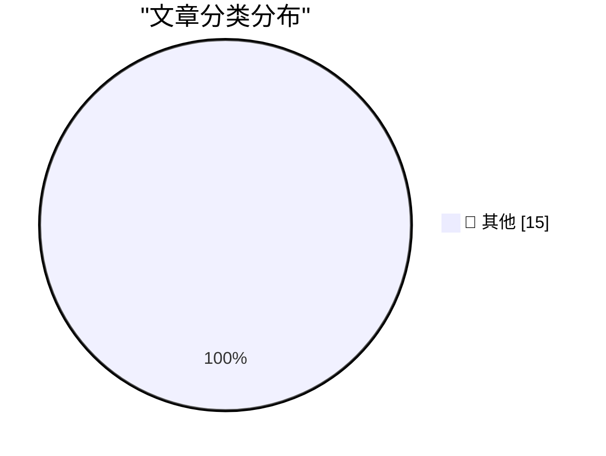

# 📰 AI 资讯每日精选 — 2026-05-11

> 汇聚 140+ 技术博客、X/Twitter、Hacker News、Reddit、Product Hunt、
> Lobste.rs、ClawFeed 日报及 GitHub Trending，经 AI 评分筛选。
>
> **本期内容**：🏆 今日必读 · 🌐 ClawFeed 日报 · 🔥 GitHub Trending · 📂 分类精选 · 🎨 设计与生成式 AI · 📊 数据概览

## 🏆 今日必读

🥇 **Quoting New York Times Editors’ Note**

[Quoting New York Times Editors’ Note](https://simonwillison.net/2026/May/10/new-york-times-editors-note/#atom-everything) — simonwillison.net · 1 小时前 · 📝 其他

> Quoting New York Times Editors’ Note

🥈 **Quoting Andrew Quinn**

[Quoting Andrew Quinn](https://simonwillison.net/2026/May/10/andrew-quinn/#atom-everything) — simonwillison.net · 10 小时前 · 📝 其他

> Quoting Andrew Quinn

🥉 **WorkOS**

[WorkOS](https://workos.com/?utm_source=daringfireball&amp;utm_medium=newsletter&amp;utm_campaign=q22026) — daringfireball.net · 11 小时前 · 📝 其他

> WorkOS

4️⃣ **Meta to Start Capturing Employee Mouse Movements, Keystrokes for AI Training Data**

[Meta to Start Capturing Employee Mouse Movements, Keystrokes for AI Training Data](https://www.reuters.com/sustainability/boards-policy-regulation/meta-start-capturing-employee-mouse-movements-keystrokes-ai-training-data-2026-04-21/) — daringfireball.net · 11 小时前 · 📝 其他

> Meta to Start Capturing Employee Mouse Movements, Keystrokes for AI Training Data

5️⃣ **[RSS Club] A Sneak Preview of Upcoming Posts**

[[RSS Club] A Sneak Preview of Upcoming Posts](https://shkspr.mobi/blog/2026/05/rss-club-a-sneak-preview-of-upcoming-posts/) — shkspr.mobi · 13 小时前 · 📝 其他

> [RSS Club] A Sneak Preview of Upcoming Posts

---

## 🌐 ClawFeed 日报精选

> 来源：[ClawFeed](https://clawfeed.kevinhe.io) — AI 驱动的多源新闻聚合

📋 ClawFeed 日报 | 2026-05-10

注：聚合本日 4 期 4h digest（id 419 / 426 / 427 / 428，覆盖 00:00-19:59 SGT）。**5/10 是 ISO Week 19 收尾日 + Dario 7 个月一人公司时间锚 + OpenAI Realtime/Codex 全天 receipts 高密度爆发**。20:00-23:59 SGT 信号将进明天首档 4h digest。

## 🔥 今日头条（Top 5）

1. **Dario Amodei: "第一个 $10 亿一人公司还有 7 个月会出现"**
   @AYi_AInotes 转译 Anthropic CEO 公开判断。配 5/6 Andrew Wilkinson 一人 40+ 公司 case + 5/9 YC Personal Software is coming 双频道定调，"$1B 一人公司"主线被 Anthropic CEO 加上具体时间锚（2026 年内）。这是本周这条主线最强的时间定钉。来源: https://x.com/AYi_AInotes/status/2053317162664673306

2. **Greg Brockman 自做 GPT-Realtime-2 Chrome 实时翻译扩展**
   OpenAI President 个人 vibe coding 演示：Chormex 扩展跑在任何 Chrome 内播音频之上（YouTube/直播/会议/演讲），sub-second 实时翻译。"absolutely surreal"。配 5/8 Realtime API 三连发布 + @OpenAIDevs CRM voice workflow，**Realtime API 从模型发布 → 总裁亲自 ship 应用，48-72 小时落地节拍快得罕见**。来源: https://x.com/gdb/status/2053134883040514350

3. **DeepSeek V4 Pro 在 EasyRouter 2.5 折，价格仅 Sonnet 4.6 的 1/17，"硅谷开发者主动找中国模型"**
   @FuSheng_0306：输入 $0.435/1M，输出 $0.87/1M，缓存 $0.0035/1M，性能对标 Sonnet 4.6。配 5/8 DeepSeek 估值 $7B/$50B 信号 + 5/9 路由层标准化语境，**"中国 SOTA 模型成本套利"叙事在硅谷 dev 圈出现 demand-side 拉动 receipts**。来源: https://x.com/FuSheng_0306/status/2053278850910736521

4. **COCO Landing AI Agents in SEA — The Real Playbook（自家公告）**
   @CocoAIxyz 官方 — CharliehuAI 与 Cui Qiang (Cui Niu Club founder/CEO) 深度对谈，"500+ paying customers in 2 months across SEA, most of them aren't who you'd expect"。**自家信号**，团队对外把"东南亚 AI agent 落地"做成 distinct playbook。来源: https://x.com/CocoAIxyz/status/2053309026805719060

5. **Coinbase = AI native 金融基础设施叙事完整成型**
   @wublockchain12 长文拆解 — USDC 流动性 + Base 结算 + x402/MPP AI 代理支付 + CDP/AgentKit + Agentic Market 开发者生态形成"四层稳定币-支付-钱包-发现"协同网络。2031 估值预期 $3000 量级。Coinbase 不再被估值为单纯加密交易所——配 5/9 Kraken 收 Reap、Solana × Google Cloud Pay.sh、TON agentic 叙事，**stablecoin × agent 支付层全周完整收尾**。来源: https://x.com/wublockchain12/status/2053044292902592934

---

## 📰 今日核心主题（聚类）

### 主题 1: "$1B 一人公司"主线被 Anthropic CEO 时间锚定
- Dario "7 个月内出现"（id 427）
- @itsalexvacca **ColdIQ ($7M+ ARR / 70 clients / 30+ team / Bootstrapped)** 三年 AI-native services 案例（id 426）
- @IndieDevHailey 方糖 OPC 一人公司 9-Skill 集 15.4k stars（id 419）
- @lxfater "万事皆可 Skill"（id 427）
- @gregisenberg "AI agents 能做事之后哪些 business models 跑得通" thread（id 427）
- @KKaWSB AI 视频外包流水线 = 套利配方（id 427）
- @servasyy_ai 引 Karpathy "Remove yourself as the bottleneck"（id 427）
- @RealHanyaHu 19 岁中国学生 $20 Claude → YouTube 躺赚（id 426）
- @levie "Agents 降进入门槛"（id 426）

### 主题 2: OpenAI Realtime API + Codex Chrome 全天用户 receipts 爆发
- 总裁 @gdb 自做 Chrome 翻译（id 419 + 428 两次）
- @oragnes Codex Chrome 24h 实测 "原地起飞"（id 426）
- @servasyy_ai Codex × GPT Image 2 端到端自做 3D App（id 428）
- @Saccc_c Codex + HyperFrames 一句 prompt 直出 Nike 视频（id 426）
- @OpenAIDevs GPT-Realtime-2 → CRM workflow 语音（id 427）
- @aigclink 实时语音 → 白板可视化（id 419）
- **节拍**：5/8 模型发布 → 5/9 第一波厂商 receipts → 5/10 总裁亲自 ship + 24h 用户 receipts 持续。**这是 OpenAI 全季最快的产品迭代节奏**。

### 主题 3: Skill methodology 官方三件套定型
- Perplexity 开源 agent skill 内部手册（id 427）+ research.perplexity.ai 文章公开
- 配 5/6 Anthropic 33 页 Skill 教程 + 5/9 Perplexity 内部 handbook
- @VincentLogic "4 组顶级 Skills 决定 Agent 生产力"（id 419 + id 426 carryover）
- @lxfater "万事皆可 Skill"（id 427）
- **Anthropic + Perplexity + Cursor 形成 official skill methodology 三件套**

### 主题 4: 中国 AI 战略 split — 收缩 vs 出海
- 字节跳动砍 30% AI 应用线（id 419）：猫箱 / 星绘 / 海外 Dreamina 部分线，**只留豆包及其相关**
- DeepSeek V4 Pro EasyRouter 2.5 折 1/17 价格，硅谷主动找（id 428）
- @fankaishuoai "国内做 C 端 AI 产品基本没戏"（id 419）+ "做医生智能体 99% 做诊疗，但中国医生付钱要 SCI"（id 426）
- @PANews "AI 中转站灰产链三问"（id 426）
- **巨头收敛到 hero product + 模型出海卖低价 + C 端被 super app 圈死 = 中国 AI 三向 split 同日浮现**

### 主题 5: VLM × 经典 CV / 本地 LLM 经济配方
- Qwen3.6-35B-A3B Object Detection ODinW 50.8 + @nash_su 配方"标注用 Qwen，推理跑 Yolo"（id 428）
- @jun_song Mac Studio M1 Max 64GB 跑 Qwen3.6-35b-mlx-4bit 60+ tok/s（id 428）
- @ivanfioravanti follow-up：fp16 over bf16（M3 硬件 native）（id 428）
- @TinyFish Claude Code WebSearch 提速 3x+（1分52秒 → 35秒）（id 426）
- **共同主线：Cost-aware AI engineering 进入 hands-on 实战层**

### 主题 6: agent 金融基础设施完整成型
- Coinbase 四层 agentic infra 估值重构（id 427）
- @0xCryptoSam TON P2P stablecoin + agentic transactions 1B MAU 渠道（id 428）
- @minara prediction market AI stack 上线 Hyperliquid（id 428）
- @GracyBitget Consensus 一周见 BlackRock / Franklin Templeton / Jane Street（id 427）
- @0xMovez Jane Street AI Engineer 16 分钟内部 LLM trading 讲座（id 426）
- **stablecoin × agent × institutional 三向全部到位**

### 主题 7: AI 安全 / 对齐稀缺透明度
- OpenAI Chain of Thought monitors 官方披露：避免 RL 中惩罚 misaligned reasoning，承认"limited amount of accidental CoT grading affected released models"（id 427）
- frontier lab 在 alignment 上罕见的明文承认

### 主题 8: AI 史 milestone
- AlphaGo 10 周年（id 428）：Demis 与 Lee Sedol 重聚 + 与 Shin Jin-seo 下特别 Go match。回望 AlphaGo 跳跃 vs 当下 agent 跳跃的对照

---

## 🔖 累计 Bookmarks 精选
**本日 4 期 bookmarks 列表（20 条）连续与昨日 7 档完全相同——scrape 层 bug 几乎确定**（bookmark endpoint 没拉到新数据）。建议本周开 clawfeed issue 跟踪 fix。

## 🔍 Deep Dive
本日无 mark 标记（marks.json pending=0），跳过。

---

## 👀 推荐关注（4 档去重）

| 账号 | 价值锚点 |
|---|---|
| @gdb | OpenAI President，本日两档出现：自做 Chrome 翻译 + 高层亲自 ship side project 稀缺信号 |
| @AYi_AInotes | Dario / OpenAI / Anthropic 一手访谈翻译，本日"$1B 一人公司"7 月时间锚 |
| @berryxia | AI agent 论文 + 厂商手册第一时间转译，本日 Perplexity skill 手册质量高 |
| @servasyy_ai | Karpathy bottleneck + agent memory infra 路径思考密度高，配 Codex × Image 2 实战 |
| @oran_ge | 中国 AI 行业内部消息源，本日字节砍 30% 一手 |
| @CocoAIxyz | 自家公司账号，本日 SEA playbook 对外公告 |
| @itsalexvacca | AI-native services bootstrap 三年实战派，ColdIQ 数据完整披露 |
| @jun_song | Apple Silicon 本地推理 hands-on / 量化 perf 数据 |
| @FuSheng_0306 | 中国模型出海 + EasyRouter 套利信号 ground truth |
| @nash_su | 国内 AI infra 实战派，VLM × 经典 CV 组合配方源头 |

提醒：上述未通过浏览器逐一核实是否已关注，**Kevin 操作前请先在 Following 里搜一下**避免重复加关注。

## 🧹 建议取关
本日 4 档 followingSample 35 / followingProfiles 24 仍全部 bio 字段为空（连续 7 档）。**Scrape 层 bug 已堆 7 档**——followingProfiles 应带 bio + last_active_at + tweets_30d 后才能做严肃判断。等 fix。

---

## 💤 当日重复噪音模式

- **Elon Musk 频道日常**（4 档反复 filter）：Tesla AI Vision airbags / Tesla 全队事故数据 / Grok 升级 email+Notion / Starship V3 / "Bitches Money No Taxes Party"。Elon 这类 PR/单句 meme 内容已成结构性噪音。
- **政治宗教**（多档）：@narendramodi Tamil Nadu 政治 + Art of Living 仪式；@Selkis_2028 Nick Fuentes 政治表态；@anthemhayek 狗图。
- **NFTCPS AiToEarn 营销文**（连续 7 档 filter）：自媒体核武器营销 carryover，建议 mute or block。
- **空投撸毛 / 卖课**：@btclaomao6 1000U 滚仓 / @cryptoalphago 港股打新 / @ChanningSu Kaio 空投 / @0xKevin00 支付宝纳指购买清单。
- **生活段子 / 韭菜文学**：@Cristiano Herbalife 广告 / @xtony1314 人生感悟 / @teslayoda 韭菜文学 / @illaDaProducer 球鞋 / @t_sanguinetti Aston Martin / @krishashok 印度奶 vs 意大利奶酪 / @Hotpot01 meme 币行情。
- **空文 / 单句 meme**：@RaminNasibov / @ashwingop / @dotey / @trq212 / 多个空 status。
---

## 🔥 GitHub Trending

> 今日热门开源项目（全语言 + Python）

| # | 项目 | 描述 | ⭐ 总星 | 📈 今日 | 语言 |
|---|------|------|---------|---------|------|
| 1 | [NousResearch/hermes-agent](https://github.com/NousResearch/hermes-agent) 🤖 | The agent that grows with you | 142.6k | +1496 | Python |
| 2 | [anthropics/financial-services](https://github.com/anthropics/financial-services) |  | 18.9k | +1449 | Python |
| 3 | [affaan-m/everything-claude-code](https://github.com/affaan-m/everything-claude-code) 🤖 | The agent harness performance optimization system. Skills... | 178.2k | +1081 | JavaScript |
| 4 | [addyosmani/agent-skills](https://github.com/addyosmani/agent-skills) 🤖 | Production-grade engineering skills for AI coding agents. | 38.5k | +1065 | Shell |
| 5 | [decolua/9router](https://github.com/decolua/9router) 🤖 | Unlimited FREE AI coding. Connect Claude Code, Codex, Cur... | 7.3k | +803 | JavaScript |
| 6 | [datawhalechina/hello-agents](https://github.com/datawhalechina/hello-agents) | 📚 《从零开始构建智能体》——从零开始的智能体原理与实践教程 | 46.5k | +748 | Python |
| 7 | [bytedance/UI-TARS-desktop](https://github.com/bytedance/UI-TARS-desktop) 🤖 | The Open-Source Multimodal AI Agent Stack: Connecting Cut... | 32.1k | +669 | TypeScript |
| 8 | [datawhalechina/easy-vibe](https://github.com/datawhalechina/easy-vibe) | 💻 vibe coding 2026 | Your first modern Coding course for... | 9.2k | +635 | JavaScript |
| 9 | [playcanvas/supersplat](https://github.com/playcanvas/supersplat) | 3D Gaussian Splat Editor | 6.8k | +579 | TypeScript |
| 10 | [anthropics/skills](https://github.com/anthropics/skills) 🤖 | Public repository for Agent Skills | 131.6k | +509 | Python |
| 11 | [CloakHQ/CloakBrowser](https://github.com/CloakHQ/CloakBrowser) | Stealth Chromium that passes every bot detection test. Dr... | 4.8k | +496 | Python |
| 12 | [jundot/omlx](https://github.com/jundot/omlx) 🤖 | LLM inference server with continuous batching & SSD cachi... | 13.3k | +185 | Python |
| 13 | [lsdefine/GenericAgent](https://github.com/lsdefine/GenericAgent) 🤖 | Self-evolving agent: grows skill tree from 3.3K-line seed... | 10.5k | +174 | Python |
| 14 | [open-webui/open-webui](https://github.com/open-webui/open-webui) 🤖 | User-friendly AI Interface (Supports Ollama, OpenAI API, ... | 136.5k | +174 | Python |
| 15 | [HKUDS/AI-Trader](https://github.com/HKUDS/AI-Trader) 🤖 | "AI-Trader: 100% Fully-Automated Agent-Native Trading" | 15.6k | +163 | Python |

---

## 📝 其他

### 1. Quoting New York Times Editors’ Note

[Quoting New York Times Editors’ Note](https://simonwillison.net/2026/May/10/new-york-times-editors-note/#atom-everything) — **simonwillison.net** · 1 小时前 · ⭐ 15/30

> Quoting New York Times Editors’ Note

---

### 2. Quoting Andrew Quinn

[Quoting Andrew Quinn](https://simonwillison.net/2026/May/10/andrew-quinn/#atom-everything) — **simonwillison.net** · 10 小时前 · ⭐ 15/30

> Quoting Andrew Quinn

---

### 3. WorkOS

[WorkOS](https://workos.com/?utm_source=daringfireball&amp;utm_medium=newsletter&amp;utm_campaign=q22026) — **daringfireball.net** · 11 小时前 · ⭐ 15/30

> WorkOS

---

### 4. Meta to Start Capturing Employee Mouse Movements, Keystrokes for AI Training Data

[Meta to Start Capturing Employee Mouse Movements, Keystrokes for AI Training Data](https://www.reuters.com/sustainability/boards-policy-regulation/meta-start-capturing-employee-mouse-movements-keystrokes-ai-training-data-2026-04-21/) — **daringfireball.net** · 11 小时前 · ⭐ 15/30

> Meta to Start Capturing Employee Mouse Movements, Keystrokes for AI Training Data

---

### 5. [RSS Club] A Sneak Preview of Upcoming Posts

[[RSS Club] A Sneak Preview of Upcoming Posts](https://shkspr.mobi/blog/2026/05/rss-club-a-sneak-preview-of-upcoming-posts/) — **shkspr.mobi** · 13 小时前 · ⭐ 15/30

> [RSS Club] A Sneak Preview of Upcoming Posts

---

### 6. The linear algebra of bit twiddling

[The linear algebra of bit twiddling](https://www.johndcook.com/blog/2026/05/10/the-linear-algebra-of-bit-twiddling/) — **johndcook.com** · 6 小时前 · ⭐ 15/30

> The linear algebra of bit twiddling

---

### 7. Reverse engineering Mersenne Twister with Linear Algebra

[Reverse engineering Mersenne Twister with Linear Algebra](https://www.johndcook.com/blog/2026/05/10/reverse-mersenne-twister/) — **johndcook.com** · 8 小时前 · ⭐ 15/30

> Reverse engineering Mersenne Twister with Linear Algebra

---

### 8. Madame Semver Will See You Now

[Madame Semver Will See You Now](https://nesbitt.io/2026/05/10/madame-semver-will-see-you-now.html) — **nesbitt.io** · 15 小时前 · ⭐ 15/30

> Madame Semver Will See You Now

---

### 9. Welcoming the Costa Rican Government to Have I Been Pwned

[Welcoming the Costa Rican Government to Have I Been Pwned](https://www.troyhunt.com/welcoming-the-costa-rican-government-to-have-i-been-pwned/) — **troyhunt.com** · 1 小时前 · ⭐ 15/30

> Welcoming the Costa Rican Government to Have I Been Pwned

---

### 10. Weekly Update 503

[Weekly Update 503](https://www.troyhunt.com/weekly-update-503/) — **troyhunt.com** · 1 小时前 · ⭐ 15/30

> Weekly Update 503

---

### 11. MachinaCheck: Building a Multi-Agent CNC Manufacturability System on AMD MI300X

[MachinaCheck: Building a Multi-Agent CNC Manufacturability System on AMD MI300X](https://huggingface.co/blog/lablab-ai-amd-developer-hackathon/machinacheck) — **Hugging Face Blog** · 6 小时前 · ⭐ 15/30

> MachinaCheck: Building a Multi-Agent CNC Manufacturability System on AMD MI300X

---

### 12. AI agents can now hack computers and copy themselves, and they're getting better fast

[AI agents can now hack computers and copy themselves, and they're getting better fast](https://the-decoder.com/ai-agents-can-now-hack-computers-and-copy-themselves-and-theyre-getting-better-fast/) — **The Decoder** · 13 小时前 · ⭐ 15/30

> AI agents can now hack computers and copy themselves, and they're getting better fast

---

### 13. Anthropic and OpenAI sit down with religious leaders to seek ethical advice

[Anthropic and OpenAI sit down with religious leaders to seek ethical advice](https://the-decoder.com/anthropic-and-openai-sit-down-with-religious-leaders-to-seek-ethical-advice/) — **The Decoder** · 14 小时前 · ⭐ 15/30

> Anthropic and OpenAI sit down with religious leaders to seek ethical advice

---

### 14. ByteDance plans over $30 billion for AI expansion, bets big on Chinese chips

[ByteDance plans over $30 billion for AI expansion, bets big on Chinese chips](https://the-decoder.com/bytedance-plans-over-30-billion-for-ai-expansion-bets-big-on-chinese-chips/) — **The Decoder** · 15 小时前 · ⭐ 15/30

> ByteDance plans over $30 billion for AI expansion, bets big on Chinese chips

---

### 15. METR says it can barely measure Claude Mythos, Palo Alto Networks warns of autonomous AI attackers

[METR says it can barely measure Claude Mythos, Palo Alto Networks warns of autonomous AI attackers](https://the-decoder.com/metr-says-it-can-barely-measure-claude-mythos-palo-alto-networks-warns-of-autonomous-ai-attackers/) — **The Decoder** · 16 小时前 · ⭐ 15/30

> METR says it can barely measure Claude Mythos, Palo Alto Networks warns of autonomous AI attackers

---

## 🎨 Design & Generative AI

### 🖼️ 生成式图片

- **[Hi-Dream 01 Out : 2k Images in 20seconds on a 4090 (fp8 dev) ComfyUI](https://www.reddit.com/r/StableDiffusion/comments/1t8ypmd/hidream_01_out_2k_images_in_20seconds_on_a_4090/)** — r/StableDiffusion · 19 小时前
  > Hi-Dream 01 Out : 2k Images in 20seconds on a 4090 (fp8 dev) ComfyUI

- **[OSTRIS about HiDream-O1 LoRA on ToolKit](https://www.reddit.com/r/StableDiffusion/comments/1t9h7ps/ostris_about_hidreamo1_lora_on_toolkit/)** — r/StableDiffusion · 5 小时前
  > OSTRIS about HiDream-O1 LoRA on ToolKit

- **[Releasing -Better Skin v1 - LoRA for FLUX.2 Klein Base 9B](https://www.reddit.com/r/StableDiffusion/comments/1t9anzt/releasing_better_skin_v1_lora_for_flux2_klein/)** — r/StableDiffusion · 9 小时前
  > Releasing -Better Skin v1 - LoRA for FLUX.2 Klein Base 9B

- **[HiDream o1 Comfyui Custom Node](https://www.reddit.com/r/StableDiffusion/comments/1t8v36u/hidream_o1_comfyui_custom_node/)** — r/StableDiffusion · 22 小时前
  > HiDream o1 Comfyui Custom Node

- **[Is AI Toolkit the only trainer with support for Flux Klein Edit lora training?](https://www.reddit.com/r/StableDiffusion/comments/1t8yz8w/is_ai_toolkit_the_only_trainer_with_support_for/)** — r/StableDiffusion · 19 小时前
  > Is AI Toolkit the only trainer with support for Flux Klein Edit lora training?

- **[Has anyone tried inpaint with anima in forge neo ?](https://www.reddit.com/r/StableDiffusion/comments/1t8wrzb/has_anyone_tried_inpaint_with_anima_in_forge_neo/)** — r/StableDiffusion · 21 小时前
  > Has anyone tried inpaint with anima in forge neo ?

- **[Mother’s day. by MidJourney💛](https://www.reddit.com/r/midjourney/comments/1t9f2q7/mothers_day_by_midjourney/)** — r/midjourney · 6 小时前
  > Mother’s day. by MidJourney💛

- **[Has Midjourney been Slower than usual?](https://www.reddit.com/r/midjourney/comments/1t961gh/has_midjourney_been_slower_than_usual/)** — r/midjourney · 12 小时前
  > Has Midjourney been Slower than usual?

- **[Comfyui Tutorial: LTX 2.3 Video Reasoning LoRA make AI Motion Actually](https://www.reddit.com/r/comfyui/comments/1t96ixr/comfyui_tutorial_ltx_23_video_reasoning_lora_make/)** — r/comfyui · 12 小时前
  > Comfyui Tutorial: LTX 2.3 Video Reasoning LoRA make AI Motion Actually

- **[I built a free tool that installs ComfyUI on any cloud GPU in one command and saves your whole setup between sessions. Open source.](https://www.reddit.com/r/comfyui/comments/1t9gls9/i_built_a_free_tool_that_installs_comfyui_on_any/)** — r/comfyui · 5 小时前
  > I built a free tool that installs ComfyUI on any cloud GPU in one command and saves your whole setup between sessions. Open source.

- **[Run ComfyUI workflows inside After Effects using text layers as prompts](https://www.reddit.com/r/comfyui/comments/1t90ktg/run_comfyui_workflows_inside_after_effects_using/)** — r/comfyui · 17 小时前
  > Run ComfyUI workflows inside After Effects using text layers as prompts

- **[Tested my anime character workflow with 80+ SFW outputs — notes on what actually improved consistency in ComfyUI](https://www.reddit.com/r/comfyui/comments/1t92g3c/tested_my_anime_character_workflow_with_80_sfw/)** — r/comfyui · 15 小时前
  > Tested my anime character workflow with 80+ SFW outputs — notes on what actually improved consistency in ComfyUI

- **[ControlNet Tile for Anima?](https://www.reddit.com/r/comfyui/comments/1t9g7ce/controlnet_tile_for_anima/)** — r/comfyui · 6 小时前
  > ControlNet Tile for Anima?

- **[Best ComfyUI workflow for creating a consistent historical card deck?](https://www.reddit.com/r/comfyui/comments/1t9k2gl/best_comfyui_workflow_for_creating_a_consistent/)** — r/comfyui · 3 小时前
  > Best ComfyUI workflow for creating a consistent historical card deck?

- **[[img2img?] Im looking for a workflow to change a picture of a landscape into a different style, with a lora.](https://www.reddit.com/r/comfyui/comments/1t95t2g/img2img_im_looking_for_a_workflow_to_change_a/)** — r/comfyui · 12 小时前
  > [img2img?] Im looking for a workflow to change a picture of a landscape into a different style, with a lora.

---

## 📊 数据概览

| 扫描源 | 抓取文章 | 时间范围 | 精选 |
|:---:|:---:|:---:|:---:|
| 117/140 | 5320 篇 → 164 篇 | 24h | **15 篇** |

### 分类分布

---

*生成于 2026-05-11 01:32 | 汇聚 140 个技术博客、X/Twitter、Hacker News、Reddit、Product Hunt、Lobste.rs、ClawFeed 日报及 GitHub Trending，经 AI 评分筛选出 Top 15 精华内容*
