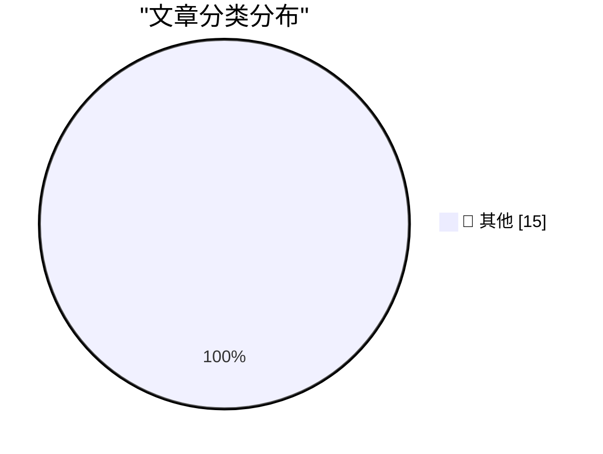

# 📰 AI 资讯每日精选 — 2026-05-13

> 汇聚 140+ 技术博客、X/Twitter、Hacker News、Reddit、Product Hunt、
> Lobste.rs、ClawFeed 日报及 GitHub Trending，经 AI 评分筛选。
>
> **本期内容**：🏆 今日必读 · 🌐 ClawFeed 日报 · 🔥 GitHub Trending · 📂 分类精选 · 🎨 设计与生成式 AI · 📊 数据概览

## 🏆 今日必读

🥇 **datasette 1.0a29**

[datasette 1.0a29](https://simonwillison.net/2026/May/12/datasette/#atom-everything) — simonwillison.net · 1 小时前 · 📝 其他

> datasette 1.0a29

🥈 **Quoting Mo Bitar**

[Quoting Mo Bitar](https://simonwillison.net/2026/May/12/mo-bitar/#atom-everything) — simonwillison.net · 2 小时前 · 📝 其他

> Quoting Mo Bitar

🥉 **Quoting Mitchell Hashimoto**

[Quoting Mitchell Hashimoto](https://simonwillison.net/2026/May/12/mitchell-hashimoto/#atom-everything) — simonwillison.net · 3 小时前 · 📝 其他

> Quoting Mitchell Hashimoto

4️⃣ **llm 0.32a2**

[llm 0.32a2](https://simonwillison.net/2026/May/12/llm/#atom-everything) — simonwillison.net · 7 小时前 · 📝 其他

> llm 0.32a2

5️⃣ **Bambu Lab is abusing the open source social contract**

[Bambu Lab is abusing the open source social contract](https://www.jeffgeerling.com/blog/2026/bambu-lab-abusing-open-source-social-contract/) — jeffgeerling.com · 11 小时前 · 📝 其他

> Bambu Lab is abusing the open source social contract

---

## 🌐 ClawFeed 日报精选

> 来源：[ClawFeed](https://clawfeed.kevinhe.io) — AI 驱动的多源新闻聚合

📋 ClawFeed 日报 | 2026-05-10

注：聚合本日 4 期 4h digest（id 419 / 426 / 427 / 428，覆盖 00:00-19:59 SGT）。**5/10 是 ISO Week 19 收尾日 + Dario 7 个月一人公司时间锚 + OpenAI Realtime/Codex 全天 receipts 高密度爆发**。20:00-23:59 SGT 信号将进明天首档 4h digest。

## 🔥 今日头条（Top 5）

1. **Dario Amodei: "第一个 $10 亿一人公司还有 7 个月会出现"**
   @AYi_AInotes 转译 Anthropic CEO 公开判断。配 5/6 Andrew Wilkinson 一人 40+ 公司 case + 5/9 YC Personal Software is coming 双频道定调，"$1B 一人公司"主线被 Anthropic CEO 加上具体时间锚（2026 年内）。这是本周这条主线最强的时间定钉。来源: https://x.com/AYi_AInotes/status/2053317162664673306

2. **Greg Brockman 自做 GPT-Realtime-2 Chrome 实时翻译扩展**
   OpenAI President 个人 vibe coding 演示：Chormex 扩展跑在任何 Chrome 内播音频之上（YouTube/直播/会议/演讲），sub-second 实时翻译。"absolutely surreal"。配 5/8 Realtime API 三连发布 + @OpenAIDevs CRM voice workflow，**Realtime API 从模型发布 → 总裁亲自 ship 应用，48-72 小时落地节拍快得罕见**。来源: https://x.com/gdb/status/2053134883040514350

3. **DeepSeek V4 Pro 在 EasyRouter 2.5 折，价格仅 Sonnet 4.6 的 1/17，"硅谷开发者主动找中国模型"**
   @FuSheng_0306：输入 $0.435/1M，输出 $0.87/1M，缓存 $0.0035/1M，性能对标 Sonnet 4.6。配 5/8 DeepSeek 估值 $7B/$50B 信号 + 5/9 路由层标准化语境，**"中国 SOTA 模型成本套利"叙事在硅谷 dev 圈出现 demand-side 拉动 receipts**。来源: https://x.com/FuSheng_0306/status/2053278850910736521

4. **COCO Landing AI Agents in SEA — The Real Playbook（自家公告）**
   @CocoAIxyz 官方 — CharliehuAI 与 Cui Qiang (Cui Niu Club founder/CEO) 深度对谈，"500+ paying customers in 2 months across SEA, most of them aren't who you'd expect"。**自家信号**，团队对外把"东南亚 AI agent 落地"做成 distinct playbook。来源: https://x.com/CocoAIxyz/status/2053309026805719060

5. **Coinbase = AI native 金融基础设施叙事完整成型**
   @wublockchain12 长文拆解 — USDC 流动性 + Base 结算 + x402/MPP AI 代理支付 + CDP/AgentKit + Agentic Market 开发者生态形成"四层稳定币-支付-钱包-发现"协同网络。2031 估值预期 $3000 量级。Coinbase 不再被估值为单纯加密交易所——配 5/9 Kraken 收 Reap、Solana × Google Cloud Pay.sh、TON agentic 叙事，**stablecoin × agent 支付层全周完整收尾**。来源: https://x.com/wublockchain12/status/2053044292902592934

---

## 📰 今日核心主题（聚类）

### 主题 1: "$1B 一人公司"主线被 Anthropic CEO 时间锚定
- Dario "7 个月内出现"（id 427）
- @itsalexvacca **ColdIQ ($7M+ ARR / 70 clients / 30+ team / Bootstrapped)** 三年 AI-native services 案例（id 426）
- @IndieDevHailey 方糖 OPC 一人公司 9-Skill 集 15.4k stars（id 419）
- @lxfater "万事皆可 Skill"（id 427）
- @gregisenberg "AI agents 能做事之后哪些 business models 跑得通" thread（id 427）
- @KKaWSB AI 视频外包流水线 = 套利配方（id 427）
- @servasyy_ai 引 Karpathy "Remove yourself as the bottleneck"（id 427）
- @RealHanyaHu 19 岁中国学生 $20 Claude → YouTube 躺赚（id 426）
- @levie "Agents 降进入门槛"（id 426）

### 主题 2: OpenAI Realtime API + Codex Chrome 全天用户 receipts 爆发
- 总裁 @gdb 自做 Chrome 翻译（id 419 + 428 两次）
- @oragnes Codex Chrome 24h 实测 "原地起飞"（id 426）
- @servasyy_ai Codex × GPT Image 2 端到端自做 3D App（id 428）
- @Saccc_c Codex + HyperFrames 一句 prompt 直出 Nike 视频（id 426）
- @OpenAIDevs GPT-Realtime-2 → CRM workflow 语音（id 427）
- @aigclink 实时语音 → 白板可视化（id 419）
- **节拍**：5/8 模型发布 → 5/9 第一波厂商 receipts → 5/10 总裁亲自 ship + 24h 用户 receipts 持续。**这是 OpenAI 全季最快的产品迭代节奏**。

### 主题 3: Skill methodology 官方三件套定型
- Perplexity 开源 agent skill 内部手册（id 427）+ research.perplexity.ai 文章公开
- 配 5/6 Anthropic 33 页 Skill 教程 + 5/9 Perplexity 内部 handbook
- @VincentLogic "4 组顶级 Skills 决定 Agent 生产力"（id 419 + id 426 carryover）
- @lxfater "万事皆可 Skill"（id 427）
- **Anthropic + Perplexity + Cursor 形成 official skill methodology 三件套**

### 主题 4: 中国 AI 战略 split — 收缩 vs 出海
- 字节跳动砍 30% AI 应用线（id 419）：猫箱 / 星绘 / 海外 Dreamina 部分线，**只留豆包及其相关**
- DeepSeek V4 Pro EasyRouter 2.5 折 1/17 价格，硅谷主动找（id 428）
- @fankaishuoai "国内做 C 端 AI 产品基本没戏"（id 419）+ "做医生智能体 99% 做诊疗，但中国医生付钱要 SCI"（id 426）
- @PANews "AI 中转站灰产链三问"（id 426）
- **巨头收敛到 hero product + 模型出海卖低价 + C 端被 super app 圈死 = 中国 AI 三向 split 同日浮现**

### 主题 5: VLM × 经典 CV / 本地 LLM 经济配方
- Qwen3.6-35B-A3B Object Detection ODinW 50.8 + @nash_su 配方"标注用 Qwen，推理跑 Yolo"（id 428）
- @jun_song Mac Studio M1 Max 64GB 跑 Qwen3.6-35b-mlx-4bit 60+ tok/s（id 428）
- @ivanfioravanti follow-up：fp16 over bf16（M3 硬件 native）（id 428）
- @TinyFish Claude Code WebSearch 提速 3x+（1分52秒 → 35秒）（id 426）
- **共同主线：Cost-aware AI engineering 进入 hands-on 实战层**

### 主题 6: agent 金融基础设施完整成型
- Coinbase 四层 agentic infra 估值重构（id 427）
- @0xCryptoSam TON P2P stablecoin + agentic transactions 1B MAU 渠道（id 428）
- @minara prediction market AI stack 上线 Hyperliquid（id 428）
- @GracyBitget Consensus 一周见 BlackRock / Franklin Templeton / Jane Street（id 427）
- @0xMovez Jane Street AI Engineer 16 分钟内部 LLM trading 讲座（id 426）
- **stablecoin × agent × institutional 三向全部到位**

### 主题 7: AI 安全 / 对齐稀缺透明度
- OpenAI Chain of Thought monitors 官方披露：避免 RL 中惩罚 misaligned reasoning，承认"limited amount of accidental CoT grading affected released models"（id 427）
- frontier lab 在 alignment 上罕见的明文承认

### 主题 8: AI 史 milestone
- AlphaGo 10 周年（id 428）：Demis 与 Lee Sedol 重聚 + 与 Shin Jin-seo 下特别 Go match。回望 AlphaGo 跳跃 vs 当下 agent 跳跃的对照

---

## 🔖 累计 Bookmarks 精选
**本日 4 期 bookmarks 列表（20 条）连续与昨日 7 档完全相同——scrape 层 bug 几乎确定**（bookmark endpoint 没拉到新数据）。建议本周开 clawfeed issue 跟踪 fix。

## 🔍 Deep Dive
本日无 mark 标记（marks.json pending=0），跳过。

---

## 👀 推荐关注（4 档去重）

| 账号 | 价值锚点 |
|---|---|
| @gdb | OpenAI President，本日两档出现：自做 Chrome 翻译 + 高层亲自 ship side project 稀缺信号 |
| @AYi_AInotes | Dario / OpenAI / Anthropic 一手访谈翻译，本日"$1B 一人公司"7 月时间锚 |
| @berryxia | AI agent 论文 + 厂商手册第一时间转译，本日 Perplexity skill 手册质量高 |
| @servasyy_ai | Karpathy bottleneck + agent memory infra 路径思考密度高，配 Codex × Image 2 实战 |
| @oran_ge | 中国 AI 行业内部消息源，本日字节砍 30% 一手 |
| @CocoAIxyz | 自家公司账号，本日 SEA playbook 对外公告 |
| @itsalexvacca | AI-native services bootstrap 三年实战派，ColdIQ 数据完整披露 |
| @jun_song | Apple Silicon 本地推理 hands-on / 量化 perf 数据 |
| @FuSheng_0306 | 中国模型出海 + EasyRouter 套利信号 ground truth |
| @nash_su | 国内 AI infra 实战派，VLM × 经典 CV 组合配方源头 |

提醒：上述未通过浏览器逐一核实是否已关注，**Kevin 操作前请先在 Following 里搜一下**避免重复加关注。

## 🧹 建议取关
本日 4 档 followingSample 35 / followingProfiles 24 仍全部 bio 字段为空（连续 7 档）。**Scrape 层 bug 已堆 7 档**——followingProfiles 应带 bio + last_active_at + tweets_30d 后才能做严肃判断。等 fix。

---

## 💤 当日重复噪音模式

- **Elon Musk 频道日常**（4 档反复 filter）：Tesla AI Vision airbags / Tesla 全队事故数据 / Grok 升级 email+Notion / Starship V3 / "Bitches Money No Taxes Party"。Elon 这类 PR/单句 meme 内容已成结构性噪音。
- **政治宗教**（多档）：@narendramodi Tamil Nadu 政治 + Art of Living 仪式；@Selkis_2028 Nick Fuentes 政治表态；@anthemhayek 狗图。
- **NFTCPS AiToEarn 营销文**（连续 7 档 filter）：自媒体核武器营销 carryover，建议 mute or block。
- **空投撸毛 / 卖课**：@btclaomao6 1000U 滚仓 / @cryptoalphago 港股打新 / @ChanningSu Kaio 空投 / @0xKevin00 支付宝纳指购买清单。
- **生活段子 / 韭菜文学**：@Cristiano Herbalife 广告 / @xtony1314 人生感悟 / @teslayoda 韭菜文学 / @illaDaProducer 球鞋 / @t_sanguinetti Aston Martin / @krishashok 印度奶 vs 意大利奶酪 / @Hotpot01 meme 币行情。
- **空文 / 单句 meme**：@RaminNasibov / @ashwingop / @dotey / @trq212 / 多个空 status。
---

## 🔥 GitHub Trending

> 今日热门开源项目（全语言 + Python）

| # | 项目 | 描述 | ⭐ 总星 | 📈 今日 | 语言 |
|---|------|------|---------|---------|------|
| 1 | [mattpocock/skills](https://github.com/mattpocock/skills) 🤖 | Skills for Real Engineers. Straight from my .claude direc... | 76.1k | +3867 | Shell |
| 2 | [NousResearch/hermes-agent](https://github.com/NousResearch/hermes-agent) 🤖 | The agent that grows with you | 146.9k | +2465 | Python |
| 3 | [CloakHQ/CloakBrowser](https://github.com/CloakHQ/CloakBrowser) | Stealth Chromium that passes every bot detection test. Dr... | 7.9k | +1606 | Python |
| 4 | [github/spec-kit](https://github.com/github/spec-kit) | 💫 Toolkit to help you get started with Spec-Driven Devel... | 97.3k | +1299 | Python |
| 5 | [yikart/AiToEarn](https://github.com/yikart/AiToEarn) 🤖 | Let's use AI to Earn! | 11.9k | +1282 | TypeScript |
| 6 | [rohitg00/agentmemory](https://github.com/rohitg00/agentmemory) 🤖 | #1 Persistent memory for AI coding agents based on real-w... | 5.9k | +1048 | TypeScript |
| 7 | [tinyhumansai/openhuman](https://github.com/tinyhumansai/openhuman) 🤖 | Your Personal AI super intelligence. Private, Simple and ... | 2.8k | +1014 | Rust |
| 8 | [millionco/react-doctor](https://github.com/millionco/react-doctor) 🤖 | Your agent writes bad React. This catches it | 8.8k | +788 | TypeScript |
| 9 | [rasbt/LLMs-from-scratch](https://github.com/rasbt/LLMs-from-scratch) 🤖 | Implement a ChatGPT-like LLM in PyTorch from scratch, ste... | 93.8k | +772 | Jupyter Notebook |
| 10 | [datawhalechina/hello-agents](https://github.com/datawhalechina/hello-agents) | 📚 《从零开始构建智能体》——从零开始的智能体原理与实践教程 | 48.3k | +599 | Python |
| 11 | [HKUDS/AI-Trader](https://github.com/HKUDS/AI-Trader) 🤖 | "AI-Trader: 100% Fully-Automated Agent-Native Trading" | 16.6k | +229 | Python |
| 12 | [666ghj/MiroFish](https://github.com/666ghj/MiroFish) | A Simple and Universal Swarm Intelligence Engine, Predict... | 60.3k | +218 | Python |
| 13 | [jundot/omlx](https://github.com/jundot/omlx) 🤖 | LLM inference server with continuous batching & SSD cachi... | 13.8k | +173 | Python |
| 14 | [BerriAI/litellm](https://github.com/BerriAI/litellm) 🤖 | Python SDK, Proxy Server (AI Gateway) to call 100+ LLM AP... | 46.7k | +147 | Python |
| 15 | [anonfaded/FadCam](https://github.com/anonfaded/FadCam) | Open-source, ad-free Android multimedia recorder with bac... | 2.2k | +116 | Java |

---

## 📝 其他

### 1. datasette 1.0a29

[datasette 1.0a29](https://simonwillison.net/2026/May/12/datasette/#atom-everything) — **simonwillison.net** · 1 小时前 · ⭐ 15/30

> datasette 1.0a29

---

### 2. Quoting Mo Bitar

[Quoting Mo Bitar](https://simonwillison.net/2026/May/12/mo-bitar/#atom-everything) — **simonwillison.net** · 2 小时前 · ⭐ 15/30

> Quoting Mo Bitar

---

### 3. Quoting Mitchell Hashimoto

[Quoting Mitchell Hashimoto](https://simonwillison.net/2026/May/12/mitchell-hashimoto/#atom-everything) — **simonwillison.net** · 3 小时前 · ⭐ 15/30

> Quoting Mitchell Hashimoto

---

### 4. llm 0.32a2

[llm 0.32a2](https://simonwillison.net/2026/May/12/llm/#atom-everything) — **simonwillison.net** · 7 小时前 · ⭐ 15/30

> llm 0.32a2

---

### 5. Bambu Lab is abusing the open source social contract

[Bambu Lab is abusing the open source social contract](https://www.jeffgeerling.com/blog/2026/bambu-lab-abusing-open-source-social-contract/) — **jeffgeerling.com** · 11 小时前 · ⭐ 15/30

> Bambu Lab is abusing the open source social contract

---

### 6. Patch Tuesday, May 2026 Edition

[Patch Tuesday, May 2026 Edition](https://krebsonsecurity.com/2026/05/patch-tuesday-may-2026-edition/) — **krebsonsecurity.com** · 3 小时前 · ⭐ 15/30

> Patch Tuesday, May 2026 Edition

---

### 7. Kagi Snaps

[Kagi Snaps](https://help.kagi.com/kagi/features/snaps.html) — **daringfireball.net** · 4 小时前 · ⭐ 15/30

> Kagi Snaps

---

### 8. Seriously, Give Kagi a Try

[Seriously, Give Kagi a Try](https://daringfireball.net/2025/04/try_switching_to_kagi) — **daringfireball.net** · 4 小时前 · ⭐ 15/30

> Seriously, Give Kagi a Try

---

### 9. Search Ads as a Vector for Travel Scams

[Search Ads as a Vector for Travel Scams](https://www.wsj.com/lifestyle/travel/the-simple-travel-scam-that-cost-a-seasoned-traveler-over-12-000-7d317f20?st=WDTpv5) — **daringfireball.net** · 5 小时前 · ⭐ 15/30

> Search Ads as a Vector for Travel Scams

---

### 10. Teresa Ribera Visited the U.S. and No One Noticed

[Teresa Ribera Visited the U.S. and No One Noticed](https://www.politico.eu/article/eu-big-tech-rulebook-shifting-digital-economy-ribera-dma-pulse-forum/) — **daringfireball.net** · 5 小时前 · ⭐ 15/30

> Teresa Ribera Visited the U.S. and No One Noticed

---

### 11. Broadcasters Urge EU to Use the DMA to Go After Smart TV Platforms, None of Which Are From European Companies

[Broadcasters Urge EU to Use the DMA to Go After Smart TV Platforms, None of Which Are From European Companies](https://www.reuters.com/sustainability/boards-policy-regulation/eu-digital-rules-should-apply-big-techs-smart-tvs-broadcasters-tell-antitrust-2026-03-23/) — **daringfireball.net** · 5 小时前 · ⭐ 15/30

> Broadcasters Urge EU to Use the DMA to Go After Smart TV Platforms, None of Which Are From European Companies

---

### 12. New DMA Compliance Features for EU Users in iOS 26.5 (and Perhaps the EU Has Finally Come to Their Senses on Tech Regulation)

[New DMA Compliance Features for EU Users in iOS 26.5 (and Perhaps the EU Has Finally Come to Their Senses on Tech Regulation)](https://www.macrumors.com/2026/05/11/ios-26-5-eu-third-party-wearable-changes/) — **daringfireball.net** · 6 小时前 · ⭐ 15/30

> New DMA Compliance Features for EU Users in iOS 26.5 (and Perhaps the EU Has Finally Come to Their Senses on Tech Regulation)

---

### 13. Pluralistic: A fascist paradigm (12 May 2026)

[Pluralistic: A fascist paradigm (12 May 2026)](https://pluralistic.net/2026/05/12/donella-meadows/) — **pluralistic.net** · 18 小时前 · ⭐ 15/30

> Pluralistic: A fascist paradigm (12 May 2026)

---

### 14. Initialize and print 128-bit integers in C

[Initialize and print 128-bit integers in C](https://www.johndcook.com/blog/2026/05/12/c-128-bit-int/) — **johndcook.com** · 13 小时前 · ⭐ 15/30

> Initialize and print 128-bit integers in C

---

### 15. Hacking the lehmer64 RNG

[Hacking the lehmer64 RNG](https://www.johndcook.com/blog/2026/05/12/hacking-the-lehmer64-rng/) — **johndcook.com** · 14 小时前 · ⭐ 15/30

> Hacking the lehmer64 RNG

---

## 🎨 Design & Generative AI

### 🖼️ 生成式图片

- **[Dad why is my sisters name Lora?](https://www.reddit.com/r/LocalLLaMA/comments/1tbemwa/dad_why_is_my_sisters_name_lora/)** — r/LocalLLaMA · 4 小时前
  > Dad why is my sisters name Lora?

- **[ComfyUI Support for HiDream-01-Image Released](https://www.reddit.com/r/StableDiffusion/comments/1tapxvf/comfyui_support_for_hidream01image_released/)** — r/StableDiffusion · 21 小时前
  > ComfyUI Support for HiDream-01-Image Released

- **[Disponibilizei meu Workflow Chroma V48 DC (v48 Best Midjourney style model)](https://www.reddit.com/r/StableDiffusion/comments/1tb1uza/disponibilizei_meu_workflow_chroma_v48_dc_v48/)** — r/StableDiffusion · 11 小时前
  > Disponibilizei meu Workflow Chroma V48 DC (v48 Best Midjourney style model)

- **[I combined FLUX Fill with ControlNet for structured inpainting](https://www.reddit.com/r/StableDiffusion/comments/1tb5v89/i_combined_flux_fill_with_controlnet_for/)** — r/StableDiffusion · 9 小时前
  > I combined FLUX Fill with ControlNet for structured inpainting

- **[Anybody else find Klein image generation on Musubi-Tuner or Ai-Toolkit is FAR superior compared to ComfyUI or Forge Neo?](https://www.reddit.com/r/StableDiffusion/comments/1tb4hy1/anybody_else_find_klein_image_generation_on/)** — r/StableDiffusion · 10 小时前
  > Anybody else find Klein image generation on Musubi-Tuner or Ai-Toolkit is FAR superior compared to ComfyUI or Forge Neo?

- **[I built a local GUI + AI builder for creating ComfyUI custom node packs](https://www.reddit.com/r/StableDiffusion/comments/1tbk8zv/i_built_a_local_gui_ai_builder_for_creating/)** — r/StableDiffusion · 40 分钟前
  > I built a local GUI + AI builder for creating ComfyUI custom node packs

- **[Midjourney made me realize I had ideas, just not visual vocabulary](https://www.reddit.com/r/midjourney/comments/1tawmi2/midjourney_made_me_realize_i_had_ideas_just_not/)** — r/midjourney · 15 小时前
  > Midjourney made me realize I had ideas, just not visual vocabulary

- **[is Midjourney a fork of Stable Diffusion?](https://www.reddit.com/r/midjourney/comments/1tb21qv/is_midjourney_a_fork_of_stable_diffusion/)** — r/midjourney · 11 小时前
  > is Midjourney a fork of Stable Diffusion?

- **[One-click workflow JSON extraction from any ComfyUI PNG (local, no upload)](https://www.reddit.com/r/comfyui/comments/1tapamb/oneclick_workflow_json_extraction_from_any/)** — r/comfyui · 22 小时前
  > One-click workflow JSON extraction from any ComfyUI PNG (local, no upload)

- **[How can you learn comfyui if all workflows are different?](https://www.reddit.com/r/comfyui/comments/1tb4rrq/how_can_you_learn_comfyui_if_all_workflows_are/)** — r/comfyui · 10 小时前
  > How can you learn comfyui if all workflows are different?

- **[Best workflow for opacity-safe img2img editing? (FLUX Klein 9B / ComfyUI)](https://www.reddit.com/r/comfyui/comments/1tbd4p1/best_workflow_for_opacitysafe_img2img_editing/)** — r/comfyui · 5 小时前
  > Best workflow for opacity-safe img2img editing? (FLUX Klein 9B / ComfyUI)

- **[Is it possible to use comfyui from another device online? (Not local)](https://www.reddit.com/r/comfyui/comments/1tb7ro4/is_it_possible_to_use_comfyui_from_another_device/)** — r/comfyui · 8 小时前
  > Is it possible to use comfyui from another device online? (Not local)

- **[ightweight Web UI for ComfyUI (Flux, Pony, Wan2.2, Inpainting) with auto-prompting](https://www.reddit.com/r/comfyui/comments/1tbdev7/ightweight_web_ui_for_comfyui_flux_pony_wan22/)** — r/comfyui · 5 小时前
  > ightweight Web UI for ComfyUI (Flux, Pony, Wan2.2, Inpainting) with auto-prompting

---

## 📊 数据概览

| 扫描源 | 抓取文章 | 时间范围 | 精选 |
|:---:|:---:|:---:|:---:|
| 118/140 | 5362 篇 → 209 篇 | 24h | **15 篇** |

### 分类分布

---

*生成于 2026-05-13 01:29 | 汇聚 140 个技术博客、X/Twitter、Hacker News、Reddit、Product Hunt、Lobste.rs、ClawFeed 日报及 GitHub Trending，经 AI 评分筛选出 Top 15 精华内容*
