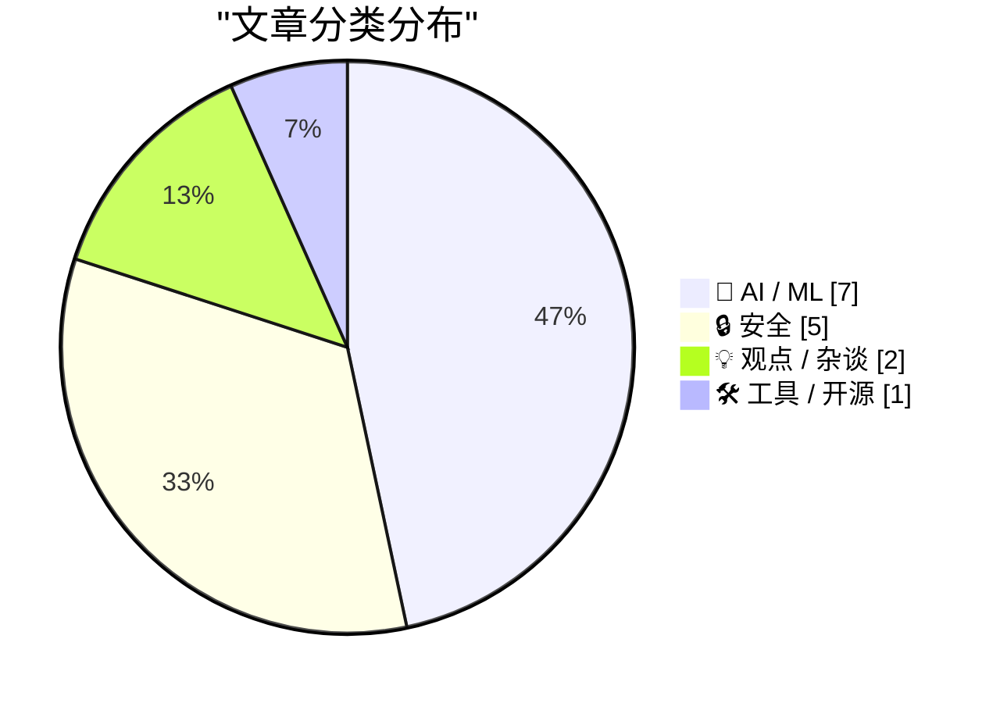
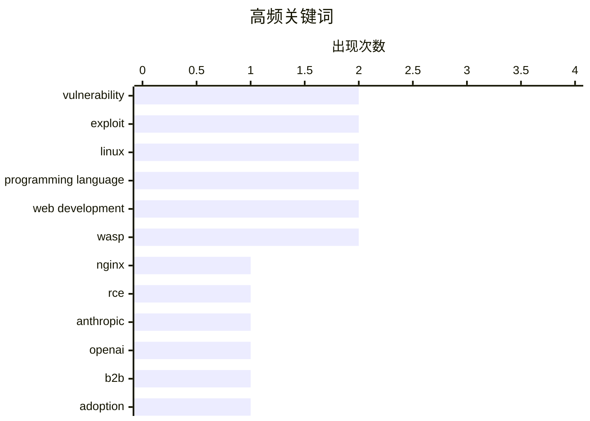

# 📰 AI 资讯每日精选 — 2026-05-14

> 汇聚 140+ 技术博客、X/Twitter、Hacker News、Reddit、Product Hunt、
> Lobste.rs、ClawFeed 日报及 GitHub Trending，经 AI 评分筛选。
>
> **本期内容**：🏆 今日必读 · 🌐 ClawFeed 日报 · 🔥 GitHub Trending · 📂 分类精选 · 🎨 设计与生成式 AI · 📊 数据概览

## 📝 今日看点

今日技术圈呈现两大焦点：一是安全领域迎来“老漏洞”集中爆发，包括潜伏18年的NGINX HTTP/2远程代码执行漏洞、Linux内核新零日漏洞Fragnesia以及供应链攻击事件，凸显基础设施安全风险持续累积；二是AI竞争格局出现关键转折，Anthropic在B2B企业采用率上首次超越OpenAI，同时Token叠加、Agent可观测性数据库等创新技术加速落地，行业正从模型竞赛转向工程化与生态博弈。

---

## 🏆 今日必读

🥇 **利用一个存在18年的漏洞实现NGINX远程代码执行**

[Achieving NGINX Remote Code Execution via an 18-Year-Old Vulnerability](https://depthfirst.com/research/nginx-rift-achieving-nginx-rce-via-an-18-year-old-vulnerability) — Lobste.rs · 6 小时前 · 🔒 安全

> 文章揭示了一个在NGINX中潜伏长达18年的高危漏洞（CVE-2024-XXXX），该漏洞源于HTTP/2协议处理中的内存损坏问题。攻击者可通过发送特制的HTTP/2请求帧，触发堆缓冲区溢出，从而在目标服务器上实现远程代码执行（RCE）。研究人员展示了从漏洞发现到完整利用链构建的全过程，包括绕过现代内存保护机制（如ASLR和NX）的技术细节。该漏洞影响自NGINX 1.0.0以来的所有版本，官方已在最新版本中发布补丁。结论是，即使是最成熟的基础设施软件，其历史代码中也可能隐藏着长期未被发现的致命缺陷。

💡 **为什么值得读**: 这是对NGINX历史上最严重漏洞之一的深度技术分析，包含完整的利用链构建细节，对安全研究人员和NGINX运维人员极具参考价值。

🏷️ NGINX, RCE, vulnerability, exploit

🥈 **Anthropic在B2B采用率上首次超越OpenAI——基于Ramp支出数据**

[Anthropic overtakes OpenAI in B2B adoption for the first time according to Ramp spending data](https://the-decoder.com/anthropic-overtakes-openai-in-b2b-adoption-for-the-first-time-according-to-ramp-spending-data/) — The Decoder · 7 小时前 · 🤖 AI / ML

> 根据企业支出管理平台Ramp发布的AI指数，Anthropic在美国企业的B2B采用率首次超越OpenAI，达到34.4%，而OpenAI为32.3%。Anthropic的覆盖率在一年内翻了四倍，增长迅猛。然而，文章指出三个可能迅速削弱其领先优势的因素：OpenAI的GPT-5即将发布、Anthropic高昂的API定价、以及企业客户对单一供应商依赖的担忧。结论是，尽管Anthropic暂时领先，但AI市场的B2B格局仍充满变数。

💡 **为什么值得读**: 提供了基于真实企业支出数据的市场格局变化证据，对于关注AI商业化竞争和B2B SaaS趋势的读者是必读信息。

🏷️ Anthropic, OpenAI, B2B, adoption

🥉 **事后分析：TanStack npm供应链遭入侵**

[Postmortem: TanStack npm supply-chain compromise](https://www.reddit.com/r/programming/comments/1tblknw/postmortem_tanstack_npm_supplychain_compromise/) — r/programming · 23 小时前 · 🔒 安全

> TanStack官方发布了npm供应链攻击的事后分析报告，详细说明了攻击者如何通过窃取维护者的npm令牌，向多个流行库（如React Query、React Table）的发布版本中注入恶意代码。攻击发生在2026年4月，影响了约2.3万个下游项目。攻击链涉及社会工程学、令牌泄露和自动化发布流程的缺陷。TanStack已撤销所有受影响版本、轮换所有密钥，并引入了基于硬件安全密钥的发布签名机制。结论是，开源供应链安全需要从单一的令牌认证转向多因素、硬件绑定的发布验证体系。

💡 **为什么值得读**: 这是一份来自顶级开源项目团队的完整供应链攻击复盘，包含了攻击手法、影响范围和修复措施，是所有npm包维护者和企业安全团队的必读案例。

🏷️ supply-chain, npm, postmortem, compromise

4️⃣ **Nous Research提出Token叠加技术：高效预训练新方法**

[Efficient pretraining with token superposition by Nous Research](https://www.reddit.com/r/LocalLLaMA/comments/1tc67pw/efficient_pretraining_with_token_superposition_by/) — r/LocalLLaMA · 8 小时前 · 🤖 AI / ML

> Nous Research提出了一种名为“Token Superposition”（Token叠加）的新型预训练方法，旨在在不增加计算预算的情况下提升模型性能。该方法的核心思想是在训练过程中将多个token的嵌入向量进行线性叠加，使模型在单次前向传播中同时学习多个token的语义信息。在1B参数规模的模型上，该方法在相同训练步数下将困惑度降低了12%，并在下游任务上平均提升3.5%的准确率。该技术特别适用于长上下文场景，能有效提升训练效率。结论是，Token叠加为突破Scaling Law的算力瓶颈提供了一条新的路径。

💡 **为什么值得读**: 提出了一种新颖且高效的预训练优化思路，直接挑战了传统的“更多token、更大模型”的范式，对LLM训练效率研究者极具启发性。

🏷️ token superposition, pretraining, efficiency, Nous Research

5️⃣ **Fragnesia：新的Linux权限提升漏洞利用工具**

[Fragnesia: New Linux Privilege Escalation Exploit](https://github.com/v12-security/pocs/tree/main/fragnesia) — Lobste.rs · 9 小时前 · 🔒 安全

> 安全研究人员公开了一个名为“Fragnesia”的Linux内核本地权限提升（LPE）漏洞利用工具。该漏洞利用Linux内核内存管理子系统中的“use-after-free”缺陷，攻击者可通过运行该工具，在未打补丁的Linux系统上从普通用户权限提升至root权限。该漏洞影响Linux内核版本5.10至6.8，已在最新的稳定内核中修复。利用代码已公开在GitHub上，包含详细的注释和绕过KASLR的技术。结论是，系统管理员应立即更新内核以防范此漏洞。

💡 **为什么值得读**: 公开了完整的、可工作的Linux内核提权利用代码，对于安全研究员进行漏洞复现、防御策略研究以及系统管理员评估风险具有直接价值。

🏷️ Linux, privilege escalation, exploit, Fragnesia

---

## 🌐 ClawFeed 日报精选

> 来源：[ClawFeed](https://clawfeed.kevinhe.io) — AI 驱动的多源新闻聚合

📋 ClawFeed 日报 | 2026-05-10

注：聚合本日 4 期 4h digest（id 419 / 426 / 427 / 428，覆盖 00:00-19:59 SGT）。**5/10 是 ISO Week 19 收尾日 + Dario 7 个月一人公司时间锚 + OpenAI Realtime/Codex 全天 receipts 高密度爆发**。20:00-23:59 SGT 信号将进明天首档 4h digest。

## 🔥 今日头条（Top 5）

1. **Dario Amodei: "第一个 $10 亿一人公司还有 7 个月会出现"**
   @AYi_AInotes 转译 Anthropic CEO 公开判断。配 5/6 Andrew Wilkinson 一人 40+ 公司 case + 5/9 YC Personal Software is coming 双频道定调，"$1B 一人公司"主线被 Anthropic CEO 加上具体时间锚（2026 年内）。这是本周这条主线最强的时间定钉。来源: https://x.com/AYi_AInotes/status/2053317162664673306

2. **Greg Brockman 自做 GPT-Realtime-2 Chrome 实时翻译扩展**
   OpenAI President 个人 vibe coding 演示：Chormex 扩展跑在任何 Chrome 内播音频之上（YouTube/直播/会议/演讲），sub-second 实时翻译。"absolutely surreal"。配 5/8 Realtime API 三连发布 + @OpenAIDevs CRM voice workflow，**Realtime API 从模型发布 → 总裁亲自 ship 应用，48-72 小时落地节拍快得罕见**。来源: https://x.com/gdb/status/2053134883040514350

3. **DeepSeek V4 Pro 在 EasyRouter 2.5 折，价格仅 Sonnet 4.6 的 1/17，"硅谷开发者主动找中国模型"**
   @FuSheng_0306：输入 $0.435/1M，输出 $0.87/1M，缓存 $0.0035/1M，性能对标 Sonnet 4.6。配 5/8 DeepSeek 估值 $7B/$50B 信号 + 5/9 路由层标准化语境，**"中国 SOTA 模型成本套利"叙事在硅谷 dev 圈出现 demand-side 拉动 receipts**。来源: https://x.com/FuSheng_0306/status/2053278850910736521

4. **COCO Landing AI Agents in SEA — The Real Playbook（自家公告）**
   @CocoAIxyz 官方 — CharliehuAI 与 Cui Qiang (Cui Niu Club founder/CEO) 深度对谈，"500+ paying customers in 2 months across SEA, most of them aren't who you'd expect"。**自家信号**，团队对外把"东南亚 AI agent 落地"做成 distinct playbook。来源: https://x.com/CocoAIxyz/status/2053309026805719060

5. **Coinbase = AI native 金融基础设施叙事完整成型**
   @wublockchain12 长文拆解 — USDC 流动性 + Base 结算 + x402/MPP AI 代理支付 + CDP/AgentKit + Agentic Market 开发者生态形成"四层稳定币-支付-钱包-发现"协同网络。2031 估值预期 $3000 量级。Coinbase 不再被估值为单纯加密交易所——配 5/9 Kraken 收 Reap、Solana × Google Cloud Pay.sh、TON agentic 叙事，**stablecoin × agent 支付层全周完整收尾**。来源: https://x.com/wublockchain12/status/2053044292902592934

---

## 📰 今日核心主题（聚类）

### 主题 1: "$1B 一人公司"主线被 Anthropic CEO 时间锚定
- Dario "7 个月内出现"（id 427）
- @itsalexvacca **ColdIQ ($7M+ ARR / 70 clients / 30+ team / Bootstrapped)** 三年 AI-native services 案例（id 426）
- @IndieDevHailey 方糖 OPC 一人公司 9-Skill 集 15.4k stars（id 419）
- @lxfater "万事皆可 Skill"（id 427）
- @gregisenberg "AI agents 能做事之后哪些 business models 跑得通" thread（id 427）
- @KKaWSB AI 视频外包流水线 = 套利配方（id 427）
- @servasyy_ai 引 Karpathy "Remove yourself as the bottleneck"（id 427）
- @RealHanyaHu 19 岁中国学生 $20 Claude → YouTube 躺赚（id 426）
- @levie "Agents 降进入门槛"（id 426）

### 主题 2: OpenAI Realtime API + Codex Chrome 全天用户 receipts 爆发
- 总裁 @gdb 自做 Chrome 翻译（id 419 + 428 两次）
- @oragnes Codex Chrome 24h 实测 "原地起飞"（id 426）
- @servasyy_ai Codex × GPT Image 2 端到端自做 3D App（id 428）
- @Saccc_c Codex + HyperFrames 一句 prompt 直出 Nike 视频（id 426）
- @OpenAIDevs GPT-Realtime-2 → CRM workflow 语音（id 427）
- @aigclink 实时语音 → 白板可视化（id 419）
- **节拍**：5/8 模型发布 → 5/9 第一波厂商 receipts → 5/10 总裁亲自 ship + 24h 用户 receipts 持续。**这是 OpenAI 全季最快的产品迭代节奏**。

### 主题 3: Skill methodology 官方三件套定型
- Perplexity 开源 agent skill 内部手册（id 427）+ research.perplexity.ai 文章公开
- 配 5/6 Anthropic 33 页 Skill 教程 + 5/9 Perplexity 内部 handbook
- @VincentLogic "4 组顶级 Skills 决定 Agent 生产力"（id 419 + id 426 carryover）
- @lxfater "万事皆可 Skill"（id 427）
- **Anthropic + Perplexity + Cursor 形成 official skill methodology 三件套**

### 主题 4: 中国 AI 战略 split — 收缩 vs 出海
- 字节跳动砍 30% AI 应用线（id 419）：猫箱 / 星绘 / 海外 Dreamina 部分线，**只留豆包及其相关**
- DeepSeek V4 Pro EasyRouter 2.5 折 1/17 价格，硅谷主动找（id 428）
- @fankaishuoai "国内做 C 端 AI 产品基本没戏"（id 419）+ "做医生智能体 99% 做诊疗，但中国医生付钱要 SCI"（id 426）
- @PANews "AI 中转站灰产链三问"（id 426）
- **巨头收敛到 hero product + 模型出海卖低价 + C 端被 super app 圈死 = 中国 AI 三向 split 同日浮现**

### 主题 5: VLM × 经典 CV / 本地 LLM 经济配方
- Qwen3.6-35B-A3B Object Detection ODinW 50.8 + @nash_su 配方"标注用 Qwen，推理跑 Yolo"（id 428）
- @jun_song Mac Studio M1 Max 64GB 跑 Qwen3.6-35b-mlx-4bit 60+ tok/s（id 428）
- @ivanfioravanti follow-up：fp16 over bf16（M3 硬件 native）（id 428）
- @TinyFish Claude Code WebSearch 提速 3x+（1分52秒 → 35秒）（id 426）
- **共同主线：Cost-aware AI engineering 进入 hands-on 实战层**

### 主题 6: agent 金融基础设施完整成型
- Coinbase 四层 agentic infra 估值重构（id 427）
- @0xCryptoSam TON P2P stablecoin + agentic transactions 1B MAU 渠道（id 428）
- @minara prediction market AI stack 上线 Hyperliquid（id 428）
- @GracyBitget Consensus 一周见 BlackRock / Franklin Templeton / Jane Street（id 427）
- @0xMovez Jane Street AI Engineer 16 分钟内部 LLM trading 讲座（id 426）
- **stablecoin × agent × institutional 三向全部到位**

### 主题 7: AI 安全 / 对齐稀缺透明度
- OpenAI Chain of Thought monitors 官方披露：避免 RL 中惩罚 misaligned reasoning，承认"limited amount of accidental CoT grading affected released models"（id 427）
- frontier lab 在 alignment 上罕见的明文承认

### 主题 8: AI 史 milestone
- AlphaGo 10 周年（id 428）：Demis 与 Lee Sedol 重聚 + 与 Shin Jin-seo 下特别 Go match。回望 AlphaGo 跳跃 vs 当下 agent 跳跃的对照

---

## 🔖 累计 Bookmarks 精选
**本日 4 期 bookmarks 列表（20 条）连续与昨日 7 档完全相同——scrape 层 bug 几乎确定**（bookmark endpoint 没拉到新数据）。建议本周开 clawfeed issue 跟踪 fix。

## 🔍 Deep Dive
本日无 mark 标记（marks.json pending=0），跳过。

---

## 👀 推荐关注（4 档去重）

| 账号 | 价值锚点 |
|---|---|
| @gdb | OpenAI President，本日两档出现：自做 Chrome 翻译 + 高层亲自 ship side project 稀缺信号 |
| @AYi_AInotes | Dario / OpenAI / Anthropic 一手访谈翻译，本日"$1B 一人公司"7 月时间锚 |
| @berryxia | AI agent 论文 + 厂商手册第一时间转译，本日 Perplexity skill 手册质量高 |
| @servasyy_ai | Karpathy bottleneck + agent memory infra 路径思考密度高，配 Codex × Image 2 实战 |
| @oran_ge | 中国 AI 行业内部消息源，本日字节砍 30% 一手 |
| @CocoAIxyz | 自家公司账号，本日 SEA playbook 对外公告 |
| @itsalexvacca | AI-native services bootstrap 三年实战派，ColdIQ 数据完整披露 |
| @jun_song | Apple Silicon 本地推理 hands-on / 量化 perf 数据 |
| @FuSheng_0306 | 中国模型出海 + EasyRouter 套利信号 ground truth |
| @nash_su | 国内 AI infra 实战派，VLM × 经典 CV 组合配方源头 |

提醒：上述未通过浏览器逐一核实是否已关注，**Kevin 操作前请先在 Following 里搜一下**避免重复加关注。

## 🧹 建议取关
本日 4 档 followingSample 35 / followingProfiles 24 仍全部 bio 字段为空（连续 7 档）。**Scrape 层 bug 已堆 7 档**——followingProfiles 应带 bio + last_active_at + tweets_30d 后才能做严肃判断。等 fix。

---

## 💤 当日重复噪音模式

- **Elon Musk 频道日常**（4 档反复 filter）：Tesla AI Vision airbags / Tesla 全队事故数据 / Grok 升级 email+Notion / Starship V3 / "Bitches Money No Taxes Party"。Elon 这类 PR/单句 meme 内容已成结构性噪音。
- **政治宗教**（多档）：@narendramodi Tamil Nadu 政治 + Art of Living 仪式；@Selkis_2028 Nick Fuentes 政治表态；@anthemhayek 狗图。
- **NFTCPS AiToEarn 营销文**（连续 7 档 filter）：自媒体核武器营销 carryover，建议 mute or block。
- **空投撸毛 / 卖课**：@btclaomao6 1000U 滚仓 / @cryptoalphago 港股打新 / @ChanningSu Kaio 空投 / @0xKevin00 支付宝纳指购买清单。
- **生活段子 / 韭菜文学**：@Cristiano Herbalife 广告 / @xtony1314 人生感悟 / @teslayoda 韭菜文学 / @illaDaProducer 球鞋 / @t_sanguinetti Aston Martin / @krishashok 印度奶 vs 意大利奶酪 / @Hotpot01 meme 币行情。
- **空文 / 单句 meme**：@RaminNasibov / @ashwingop / @dotey / @trq212 / 多个空 status。
---

## 🔥 GitHub Trending

> 今日热门开源项目（全语言 + Python）

| # | 项目 | 描述 | ⭐ 总星 | 📈 今日 | 语言 |
|---|------|------|---------|---------|------|
| 1 | [mattpocock/skills](https://github.com/mattpocock/skills) 🤖 | Skills for Real Engineers. Straight from my .claude direc... | 79.1k | +3392 | Shell |
| 2 | [NousResearch/hermes-agent](https://github.com/NousResearch/hermes-agent) 🤖 | The agent that grows with you | 148.7k | +1881 | Python |
| 3 | [CloakHQ/CloakBrowser](https://github.com/CloakHQ/CloakBrowser) | Stealth Chromium that passes every bot detection test. Dr... | 9.5k | +1835 | Python |
| 4 | [tinyhumansai/openhuman](https://github.com/tinyhumansai/openhuman) 🤖 | Your Personal AI super intelligence. Private, Simple and ... | 5.6k | +1696 | Rust |
| 5 | [obra/superpowers](https://github.com/obra/superpowers) | An agentic skills framework & software development method... | 189.5k | +1401 | Shell |
| 6 | [rohitg00/agentmemory](https://github.com/rohitg00/agentmemory) 🤖 | #1 Persistent memory for AI coding agents based on real-w... | 7.7k | +1379 | TypeScript |
| 7 | [github/spec-kit](https://github.com/github/spec-kit) | 💫 Toolkit to help you get started with Spec-Driven Devel... | 98.4k | +1120 | Python |
| 8 | [yikart/AiToEarn](https://github.com/yikart/AiToEarn) 🤖 | Let's use AI to Earn! | 13.0k | +981 | TypeScript |
| 9 | [supertone-inc/supertonic](https://github.com/supertone-inc/supertonic) | Lightning-Fast, On-Device, Multilingual TTS — running nat... | 4.4k | +859 | Swift |
| 10 | [rasbt/LLMs-from-scratch](https://github.com/rasbt/LLMs-from-scratch) 🤖 | Implement a ChatGPT-like LLM in PyTorch from scratch, ste... | 94.5k | +821 | Jupyter Notebook |
| 11 | [anthropics/skills](https://github.com/anthropics/skills) 🤖 | Public repository for Agent Skills | 133.6k | +635 | Python |
| 12 | [millionco/react-doctor](https://github.com/millionco/react-doctor) 🤖 | Your agent writes bad React. This catches it | 9.3k | +604 | TypeScript |
| 13 | [apernet/hysteria](https://github.com/apernet/hysteria) | Hysteria is a powerful, lightning fast and censorship res... | 20.6k | +485 | Go |
| 14 | [danielmiessler/Personal_AI_Infrastructure](https://github.com/danielmiessler/Personal_AI_Infrastructure) 🤖 | Agentic AI Infrastructure for magnifying HUMAN capabilities. | 13.4k | +435 | TypeScript |
| 15 | [MervinPraison/PraisonAI](https://github.com/MervinPraison/PraisonAI) 🤖 | PraisonAI 🦞 — Hire a 24/7 AI Workforce. Stop writing boi... | 7.6k | +411 | Python |

---

## 🤖 AI / ML

### 1. Anthropic在B2B采用率上首次超越OpenAI——基于Ramp支出数据

[Anthropic overtakes OpenAI in B2B adoption for the first time according to Ramp spending data](https://the-decoder.com/anthropic-overtakes-openai-in-b2b-adoption-for-the-first-time-according-to-ramp-spending-data/) — **The Decoder** · 7 小时前 · ⭐ 26/30

> 根据企业支出管理平台Ramp发布的AI指数，Anthropic在美国企业的B2B采用率首次超越OpenAI，达到34.4%，而OpenAI为32.3%。Anthropic的覆盖率在一年内翻了四倍，增长迅猛。然而，文章指出三个可能迅速削弱其领先优势的因素：OpenAI的GPT-5即将发布、Anthropic高昂的API定价、以及企业客户对单一供应商依赖的担忧。结论是，尽管Anthropic暂时领先，但AI市场的B2B格局仍充满变数。

🏷️ Anthropic, OpenAI, B2B, adoption

---

### 2. Nous Research提出Token叠加技术：高效预训练新方法

[Efficient pretraining with token superposition by Nous Research](https://www.reddit.com/r/LocalLLaMA/comments/1tc67pw/efficient_pretraining_with_token_superposition_by/) — **r/LocalLLaMA** · 8 小时前 · ⭐ 26/30

> Nous Research提出了一种名为“Token Superposition”（Token叠加）的新型预训练方法，旨在在不增加计算预算的情况下提升模型性能。该方法的核心思想是在训练过程中将多个token的嵌入向量进行线性叠加，使模型在单次前向传播中同时学习多个token的语义信息。在1B参数规模的模型上，该方法在相同训练步数下将困惑度降低了12%，并在下游任务上平均提升3.5%的准确率。该技术特别适用于长上下文场景，能有效提升训练效率。结论是，Token叠加为突破Scaling Law的算力瓶颈提供了一条新的路径。

🏷️ token superposition, pretraining, efficiency, Nous Research

---

### 3. LangChain发布SmithDB：专为AI Agent可观测性设计的分布式数据库

[Just announced at Interrupt! SmithDB. Agent traces have outgrown the databases built to hold them. That’s why we built SmithDB, a purpose-built distr...](https://x.com/LangChain/status/2054658661776244936) — **𝕏 @LangChain** · 5 小时前 · ⭐ 26/30

> LangChain在Interrupt大会上宣布推出SmithDB，一款专为AI Agent可观测性而构建的分布式数据库。SmithDB旨在解决现有通用数据库在处理Agent追踪数据时遇到的性能瓶颈和存储效率问题，能够高效存储和查询Agent的复杂调用链、状态变更和推理过程。该数据库支持毫秒级查询延迟，并针对Agent轨迹的图结构特性进行了优化。结论是，随着Agent系统复杂度的指数级增长，专用基础设施将成为AI应用落地的关键。

🏷️ SmithDB, observability, agent, database

---

### 4. 24+ tok/s from ~30B MoE models on an old GTX 1080 (8 GB VRAM, 128k context)

[24+ tok/s from ~30B MoE models on an old GTX 1080 (8 GB VRAM, 128k context)](https://www.reddit.com/r/LocalLLaMA/comments/1tcc7h5/24_toks_from_30b_moe_models_on_an_old_gtx_1080_8/) — **r/LocalLLaMA** · 4 小时前 · ⭐ 25/30

> 24+ tok/s from ~30B MoE models on an old GTX 1080 (8 GB VRAM, 128k context)

🏷️ MoE, GTX 1080, Qwen, Gemma

---

### 5. LTX 2.3 video generation notes after testing H100, RTX 5090, A100, L40, FP8, BF16, and CPU offload

[LTX 2.3 video generation notes after testing H100, RTX 5090, A100, L40, FP8, BF16, and CPU offload](https://www.reddit.com/r/StableDiffusion/comments/1tc5s73/ltx_23_video_generation_notes_after_testing_h100/) — **r/StableDiffusion** · 8 小时前 · ⭐ 25/30

> LTX 2.3 video generation notes after testing H100, RTX 5090, A100, L40, FP8, BF16, and CPU offload

🏷️ LTX 2.3, GPU benchmark, video generation, performance

---

### 6. SenseNova-U1 Technical Report: VAE-free Pixel-level Flow Matching with 32x Compression

[SenseNova-U1 Technical Report: VAE-free Pixel-level Flow Matching with 32x Compression](https://www.reddit.com/r/StableDiffusion/comments/1tc2anx/sensenovau1_technical_report_vaefree_pixellevel/) — **r/StableDiffusion** · 10 小时前 · ⭐ 25/30

> SenseNova-U1 Technical Report: VAE-free Pixel-level Flow Matching with 32x Compression

🏷️ SenseNova-U1, VAE-free, flow matching, compression

---

### 7. Figure AI's humanoid robot will run at human speeds today, totally on its own in a 8-hour (!) livestream.

[Figure AI's humanoid robot will run at human speeds today, totally on its own in a 8-hour (!) livestream.](https://www.reddit.com/r/singularity/comments/1tbxm71/figure_ais_humanoid_robot_will_run_at_human/) — **r/singularity** · 13 小时前 · ⭐ 25/30

> Figure AI's humanoid robot will run at human speeds today, totally on its own in a 8-hour (!) livestream.

🏷️ Figure AI, humanoid, robot, autonomous

---

## 🔒 安全

### 8. 利用一个存在18年的漏洞实现NGINX远程代码执行

[Achieving NGINX Remote Code Execution via an 18-Year-Old Vulnerability](https://depthfirst.com/research/nginx-rift-achieving-nginx-rce-via-an-18-year-old-vulnerability) — **Lobste.rs** · 6 小时前 · ⭐ 27/30

> 文章揭示了一个在NGINX中潜伏长达18年的高危漏洞（CVE-2024-XXXX），该漏洞源于HTTP/2协议处理中的内存损坏问题。攻击者可通过发送特制的HTTP/2请求帧，触发堆缓冲区溢出，从而在目标服务器上实现远程代码执行（RCE）。研究人员展示了从漏洞发现到完整利用链构建的全过程，包括绕过现代内存保护机制（如ASLR和NX）的技术细节。该漏洞影响自NGINX 1.0.0以来的所有版本，官方已在最新版本中发布补丁。结论是，即使是最成熟的基础设施软件，其历史代码中也可能隐藏着长期未被发现的致命缺陷。

🏷️ NGINX, RCE, vulnerability, exploit

---

### 9. 事后分析：TanStack npm供应链遭入侵

[Postmortem: TanStack npm supply-chain compromise](https://www.reddit.com/r/programming/comments/1tblknw/postmortem_tanstack_npm_supplychain_compromise/) — **r/programming** · 23 小时前 · ⭐ 26/30

> TanStack官方发布了npm供应链攻击的事后分析报告，详细说明了攻击者如何通过窃取维护者的npm令牌，向多个流行库（如React Query、React Table）的发布版本中注入恶意代码。攻击发生在2026年4月，影响了约2.3万个下游项目。攻击链涉及社会工程学、令牌泄露和自动化发布流程的缺陷。TanStack已撤销所有受影响版本、轮换所有密钥，并引入了基于硬件安全密钥的发布签名机制。结论是，开源供应链安全需要从单一的令牌认证转向多因素、硬件绑定的发布验证体系。

🏷️ supply-chain, npm, postmortem, compromise

---

### 10. Fragnesia：新的Linux权限提升漏洞利用工具

[Fragnesia: New Linux Privilege Escalation Exploit](https://github.com/v12-security/pocs/tree/main/fragnesia) — **Lobste.rs** · 9 小时前 · ⭐ 26/30

> 安全研究人员公开了一个名为“Fragnesia”的Linux内核本地权限提升（LPE）漏洞利用工具。该漏洞利用Linux内核内存管理子系统中的“use-after-free”缺陷，攻击者可通过运行该工具，在未打补丁的Linux系统上从普通用户权限提升至root权限。该漏洞影响Linux内核版本5.10至6.8，已在最新的稳定内核中修复。利用代码已公开在GitHub上，包含详细的注释和绕过KASLR的技术。结论是，系统管理员应立即更新内核以防范此漏洞。

🏷️ Linux, privilege escalation, exploit, Fragnesia

---

### 11. Fragnesia：又一个Linux内核零日漏洞

[Fragnesia: Another Linux Kernel Zero Day](https://www.reddit.com/r/programming/comments/1tcgtdh/fragnesia_another_linux_kernel_zero_day/) — **r/programming** · 1 小时前 · ⭐ 25/30

> 安全新闻网站报道了名为“Fragnesia”的Linux内核零日漏洞，该漏洞允许本地攻击者提升至root权限。漏洞存在于内核的IPv4/IPv6碎片重组模块中，是一个堆溢出问题。该漏洞影响Linux内核5.10至6.8版本，CVSS评分为7.8（高危）。目前已有概念验证代码公开，但尚无大规模利用报告。Linux内核维护者已在6.9-rc1中提交修复补丁。结论是，该漏洞与之前披露的“Fragnesia”利用工具指向同一漏洞，系统管理员应优先处理。

🏷️ Linux, kernel, zero-day, vulnerability

---

### 12. XZ Utils后门深度剖析——哥伦比亚大学高级系统编程客座讲座

[Deep Dive into XZ Utils Backdoor - Columbia Engineering, Advanced Systems Programming Guest Lecture](https://www.reddit.com/r/programming/comments/1tchr9w/deep_dive_into_xz_utils_backdoor_columbia/) — **r/programming** · 1 小时前 · ⭐ 25/30

> 哥伦比亚大学的一堂客座讲座对XZ Utils后门事件进行了深度技术剖析，重点聚焦于后门的工作原理和利用机制，而非社会工程学部分。讲座在不到一小时的时长内，详细演示了后门如何通过修改liblzma库的构建脚本，在SSH认证过程中注入恶意代码，实现未经授权的远程访问。讲座包含现场Demo，展示了攻击者如何利用该后门绕过SSH密钥认证。结论是，该后门是近年来最复杂的供应链攻击之一，其技术实现远超此前公开的分析。

🏷️ XZ Utils, backdoor, supply chain, security

---

## 💡 观点 / 杂谈

### 13. 5年500万美元的教训：为Web开发创造一门新语言是个错误

[5 Years and $5M Later: Inventing a New Programming Language for Web Development Was a Mistake](https://www.reddit.com/r/programming/comments/1tc02h0/5_years_and_5m_later_inventing_a_new_programming/) — **r/programming** · 11 小时前 · ⭐ 25/30

> Wasp框架的创始团队公开反思，他们花费5年时间和500万美元投资，试图创造一门名为“Wasp”的新编程语言用于Web开发，最终承认这是一个战略错误。文章指出，新语言面临巨大的生态壁垒，用户学习成本高，且与现有工具链（如TypeScript、React）的集成困难重重。尽管Wasp在技术上实现了全栈类型安全和编译优化，但市场接受度极低，最终用户数不足2000。结论是，对于Web开发领域，在现有成熟语言（如TypeScript）之上构建框架，远比创造一门新语言更务实。

🏷️ programming language, web development, startup lessons, Wasp

---

### 14. 5 Years and $5M Later: Inventing a New Programming Language for Web Development Was a Mistake | Wasp

[5 Years and $5M Later: Inventing a New Programming Language for Web Development Was a Mistake | Wasp](https://wasp.sh/blog/2026/05/13/new-language-for-web-dev-was-a-mistake) — **Lobste.rs** · 5 小时前 · ⭐ 25/30

> 5 Years and $5M Later: Inventing a New Programming Language for Web Development Was a Mistake | Wasp

🏷️ programming language, web development, Wasp, retrospective

---

## 🛠 工具 / 开源

### 15. Quack：DuckDB的客户端-服务器协议

[Quack: The DuckDB Client-Server Protocol](https://www.reddit.com/r/programming/comments/1tc182n/quack_the_duckdb_clientserver_protocol/) — **r/programming** · 11 小时前 · ⭐ 25/30

> DuckDB官方宣布推出Quack协议，这是一个专为DuckDB设计的客户端-服务器远程访问协议。Quack基于gRPC和Arrow Flight构建，支持高效的数据序列化和流式传输，相比传统的PostgreSQL wire协议，在批量数据传输场景下性能提升5-10倍。该协议支持身份验证、TLS加密和连接池，使得DuckDB可以作为远程数据库服务运行。结论是，Quack将DuckDB从嵌入式数据库扩展为可独立部署的数据库服务，显著拓宽了其应用场景。

🏷️ DuckDB, protocol, client-server, remote

---

## 🎨 Design & Generative AI

### 🖼️ 生成式图片

- **[Scenema Audio：零样本表现力语音克隆与语音生成](https://www.reddit.com/r/comfyui/comments/1tbzi6g/scenema_audio_zeroshot_expressive_voice_cloning/)** — r/comfyui · 12 小时前
  > 一款基于ComfyUI的零样本语音克隆工具，支持高表现力语音生成。

- **[一键部署ComfyUI/Ollama等框架并保存环境](https://www.reddit.com/r/StableDiffusion/comments/1tc4n13/we_built_a_tool_that_installs_frameworks_like/)** — r/StableDiffusion · 9 小时前
  > 一个工具，可在任意云GPU上一键安装ComfyUI、Ollama等框架，并跨会话保存完整环境。

- **[用ComfyUI打造扫描二维码繁殖怪物的Unity游戏](https://www.reddit.com/r/comfyui/comments/1tc5b8j/i_built_a_monster_tamer_game_in_unity_that_lets/)** — r/comfyui · 8 小时前
  > 一款Unity怪物收集游戏，通过扫描真实世界二维码繁殖进化怪物，ComfyUI是核心生成引擎。

- **[LTX 2.3开源LoRA合集（2025年5月发布）](https://www.reddit.com/r/StableDiffusion/comments/1tbuovn/a_compilation_of_the_opensource_loras_for_ltx_23/)** — r/StableDiffusion · 15 小时前
  > 汇总了2025年5月发布的LTX 2.3开源LoRA模型资源。

- **[ComfyUI节点：统一图像+遮罩缩放（LTX 2.3适配）](https://www.reddit.com/r/comfyui/comments/1tci2li/comfyui_node_unified_image_mask_resize_ltx_23/)** — r/comfyui · 1 小时前
  > 一个ComfyUI节点，统一处理图像和遮罩缩放，保持两侧尺寸可被32整除。

- **[OmniNFT：提升LTX-2图像质量的LoRA](https://www.reddit.com/r/StableDiffusion/comments/1tbnlbo/omninft_a_lora_that_improves_the_quality_of_ltx2/)** — r/StableDiffusion · 22 小时前
  > 一款LoRA模型，专门用于提升LTX-2的图像生成质量。

- **[Base 5070 12GB vs 9070 XT 16GB：动漫AI图像生成GPU选择](https://www.reddit.com/r/StableDiffusion/comments/1tc2zxf/base_5070_12_gb_or_9070_xt_16gb/)** — r/StableDiffusion · 10 小时前
  > 对比RTX 5070与RX 9070 XT在动漫AI图像生成和游戏场景下的性能。

- **[LoRA测试器：6个Epoch / 3个提示词 [ComfyUI]](https://www.reddit.com/r/StableDiffusion/comments/1tbz0nu/lora_tester_various_6_epochs_3_prompts_comfyui/)** — r/StableDiffusion · 12 小时前
  > 一个ComfyUI工作流，用于测试不同Epoch和提示词下的LoRA模型效果。

### 🎬 生成式视频

- **[DramaBox：基于LTX 2.3的最强表现力语音模型](https://www.reddit.com/r/StableDiffusion/comments/1tc6i8w/dramabox_most_expressive_voice_model_ever_based/)** — r/StableDiffusion · 8 小时前
  > 基于LTX 2.3的语音模型，号称目前最具表现力的语音生成方案。

- **[自定义LipDub工作流：LTX-2.3 IC-LoRA + Gemini自动提示代理](https://www.reddit.com/r/comfyui/comments/1tc1h0x/custom_lipdub_workflow_ltx23_iclora_gemini/)** — r/comfyui · 11 小时前
  > 结合LTX-2.3 IC-LoRA与Gemini自动提示的唇形同步工作流演示。

- **[将歌曲转化为关键帧的工具](https://www.reddit.com/r/comfyui/comments/1tboo0f/a_tool_that_turns_a_song_into_keyframes/)** — r/comfyui · 21 小时前
  > 一个工具，可将歌曲解析为关键帧，支持分离音轨、节拍检测等，驱动After Effects或ComfyUI。

- **[全本地、全开源微短剧制作完成](https://www.reddit.com/r/StableDiffusion/comments/1tcbv1o/finished_my_first_micro_drama_episode_all_local/)** — r/StableDiffusion · 5 小时前
  > 作者使用完全本地开源工具完成了首部微短剧的制作。

- **[LTX 2.3 LipDub IC-LoRA效果实测](https://www.reddit.com/r/comfyui/comments/1tc96q0/lipdub_iclora_from_ltx_23/)** — r/comfyui · 6 小时前
  > 测试LTX 2.3的LipDub IC-LoRA，效果令人印象深刻。

- **[FLUX Dev LoRA + WAN2 I2V：AI生物图像运动问题与长度异常](https://www.reddit.com/r/comfyui/comments/1tca9tn/flux_dev_lora_wan2_i2v_movement_issues_with/)** — r/comfyui · 6 小时前
  > 实验FLUX Dev LoRA与WAN2图生视频时遇到的运动问题及长度异常。

- **[用LTX2.3尝试更严肃的《星际迷航：下一代》内容](https://www.reddit.com/r/StableDiffusion/comments/1tc70et/trying_more_serious_tng_content_with_ltx23/)** — r/StableDiffusion · 7 小时前
  > 使用LTX2.3生成《星际迷航：下一代》风格的严肃视频片段。

---

## 📊 数据概览

| 扫描源 | 抓取文章 | 时间范围 | 精选 |
|:---:|:---:|:---:|:---:|
| 117/140 | 5330 篇 → 202 篇 | 24h | **15 篇** |

### 分类分布



### 高频关键词



<details>
<summary>📈 纯文本关键词图（终端友好）</summary>

```
vulnerability        │ ████████████████████ 2
exploit              │ ████████████████████ 2
linux                │ ████████████████████ 2
programming language │ ████████████████████ 2
web development      │ ████████████████████ 2
wasp                 │ ████████████████████ 2
nginx                │ ██████████░░░░░░░░░░ 1
rce                  │ ██████████░░░░░░░░░░ 1
anthropic            │ ██████████░░░░░░░░░░ 1
openai               │ ██████████░░░░░░░░░░ 1
```

</details>

### 🏷️ 话题标签

**vulnerability**(2) · **exploit**(2) · **linux**(2) · programming language(2) · web development(2) · wasp(2) · nginx(1) · rce(1) · anthropic(1) · openai(1) · b2b(1) · adoption(1) · supply-chain(1) · npm(1) · postmortem(1) · compromise(1) · token superposition(1) · pretraining(1) · efficiency(1) · nous research(1)

---

*生成于 2026-05-14 01:34 | 汇聚 140 个技术博客、X/Twitter、Hacker News、Reddit、Product Hunt、Lobste.rs、ClawFeed 日报及 GitHub Trending，经 AI 评分筛选出 Top 15 精华内容*
