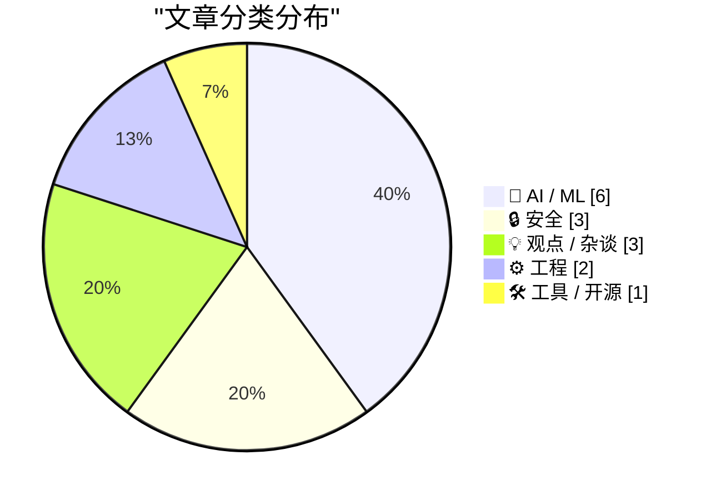
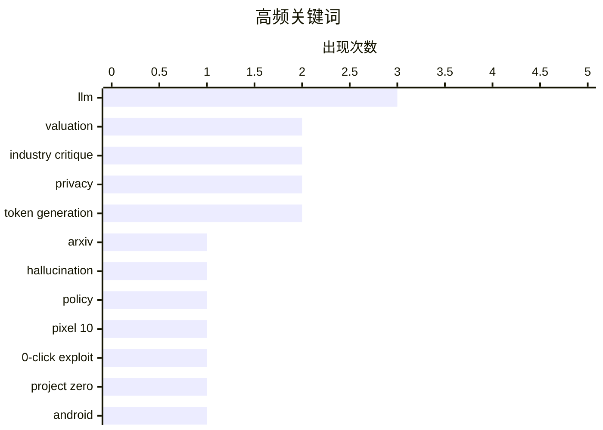

# 📰 AI 资讯每日精选 — 2026-05-16

> 汇聚 140+ 技术博客、X/Twitter、Hacker News、Reddit、Product Hunt、
> Lobste.rs、ClawFeed 日报及 GitHub Trending，经 AI 评分筛选。
>
> **本期内容**：🏆 今日必读 · 🌐 ClawFeed 日报 · 🔥 GitHub Trending · 📂 分类精选 · 🎨 设计与生成式 AI · 📊 数据概览

## 📝 今日看点

今日技术圈呈现三大焦点：AI领域泡沫化争议与安全治理并行，arXiv对LLM生成错误论文实施封禁，同时Anthropic估值暴涨至9000亿美元超越OpenAI，折射出行业狂热与理性反思的激烈碰撞；安全方面，零点击漏洞链与VPN指纹识别问题凸显移动端与隐私工具的脆弱性；工程领域，Bun的Rust重写被曝内存安全缺陷，再次引发对“安全语言”实际落地的质疑。

---

## 🏆 今日必读

🥇 **arXiv 对包含无法辩驳的 LLM 生成错误（如幻觉引用或结果）的论文实施一年封禁**

[arXiv implements 1-year ban for papers containing incontrovertible evidence of unchecked LLM-generated errors, such as hallucinated references or results. [N]](https://www.reddit.com/r/MachineLearning/comments/1tdje2d/arxiv_implements_1year_ban_for_papers_containing/) — r/MachineLearning · 22 小时前 · 🤖 AI / ML

> arXiv 平台宣布，对提交的论文中若包含无法辩驳的、由大语言模型（LLM）生成的错误（例如虚构的参考文献或实验结果），将对作者实施为期一年的提交禁令。该政策由 cs.LG 版块版主 Thomas G. Dietterich 在社交媒体上公布，旨在维护学术诚信。禁令依据 arXiv 的行为准则，要求每位署名作者对论文内容负全责。此举直接针对当前 AI 辅助写作中泛滥的“幻觉”问题，是学术预印本平台首次采取如此严厉的惩罚措施。核心观点是，作者必须为论文中所有内容（包括 AI 生成部分）的真实性负责，否则将面临长期禁投。

💡 **为什么值得读**: 这是学术出版界针对 AI 幻觉问题祭出的最严厉规则之一，所有使用 LLM 辅助写作的研究者都应了解这一红线。

🏷️ arXiv, LLM, hallucination, policy

🥈 **针对 Pixel 10 的零点击漏洞利用链**

[A 0-click exploit chain for the Pixel 10](https://projectzero.google/2026/05/pixel-10-exploit.html) — Hacker News Best · 11 小时前 · 🔒 安全

> Google Project Zero 团队披露了一条针对 Pixel 10 手机的零点击（0-click）漏洞利用链，攻击者无需用户任何交互即可完全控制设备。该漏洞链涉及多个组件，包括基带处理器和内核驱动中的严重缺陷。Project Zero 在报告中详细分析了漏洞原理、利用步骤以及 Google 的修复补丁。结论是，现代移动设备的攻击面依然巨大，尤其是基带等底层组件，需要厂商持续投入安全加固。

💡 **为什么值得读**: 来自顶级安全团队 Project Zero 的完整漏洞分析，展示了零点击攻击的完整路径，对移动安全从业者和 Pixel 用户极具参考价值。

🏷️ Pixel 10, 0-click exploit, Project Zero, Android

🥉 **付费内容：假如……我们正处于 AI 泡沫中？（第一部分）**

[Premium: What If...We're In An AI Bubble? (Part 1)](https://www.wheresyoured.at/premium-what-if-were-in-an-ai-bubble-part-1/) — wheresyoured.at · 8 小时前 · 💡 观点 / 杂谈

> 文章质疑当前围绕 AI 的许多乐观预测，认为这些预测建立在错误的线性外推之上。作者指出，将当前模型的能力直接等同于通用人工智能（AGI）即将到来，并由此推导出“永久底层阶级”等社会灾难性结论，是缺乏依据的。文章认为，AI 在构建软件公司或完成计算机工作方面的实际能力被严重高估。核心观点是，当前 AI 热潮存在显著的泡沫特征，许多关于其颠覆性影响的论断需要被审慎审视。

💡 **为什么值得读**: 在一片 AI 狂热中提供了冷静的批判性视角，适合希望了解 AI 泡沫论据和潜在风险的读者。

🏷️ AI bubble, valuation, industry critique

4️⃣ **我认为现在有整个公司处于 AI 精神错乱状态**

[I believe there are entire companies right now under AI psychosis](https://twitter.com/mitchellh/status/2055380239711457578) — Hacker News Best · 4 小时前 · 💡 观点 / 杂谈

> 知名开发者 Mitchell Hashimoto 在社交媒体上直言，观察到许多科技公司正陷入“AI 精神错乱”（AI psychosis）状态。他认为这些公司盲目地将 AI 集成到产品中，而不考虑其实际价值、可靠性或对用户体验的负面影响。这种趋势导致资源浪费和产品方向错误。核心观点是，行业需要回归理性，AI 应该被用作解决具体问题的工具，而非万能的信仰。

💡 **为什么值得读**: 来自业界顶级技术领袖的尖锐批评，一针见血地指出了当前 AI 应用中的非理性现象，发人深省。

🏷️ AI hype, psychosis, industry critique

5️⃣ **美国司法部要求苹果和谷歌解锁超过 10 万名汽车改装应用的用户信息**

[U.S. DOJ demands Apple and Google unmask over 100k users of car-tinkering app](https://macdailynews.com/2026/05/15/u-s-doj-demands-apple-and-google-unmask-over-100000-users-of-popular-car-tinkering-app-in-emissions-crackdown/) — Hacker News Best · 7 小时前 · 🔒 安全

> 美国司法部（DOJ）在针对排放作弊的打击行动中，向苹果和谷歌发出法律命令，要求其披露一款热门汽车改装应用超过 10 万名用户的身份信息。该应用据称被用于修改车辆排放控制系统以绕过环保法规。此举引发了关于用户隐私、政府监控权力以及科技公司数据合规义务的激烈讨论。核心观点是，政府在环保执法中正采取前所未有的手段，大规模要求科技公司交出用户数据。

💡 **为什么值得读**: 涉及隐私、执法与科技巨头三方博弈的重大事件，10 万用户级别的数据请求规模史无前例，值得关注。

🏷️ DOJ, privacy, car-tinkering, unmasking

---

## 🌐 ClawFeed 日报精选

> 来源：[ClawFeed](https://clawfeed.kevinhe.io) — AI 驱动的多源新闻聚合

📋 ClawFeed 日报 | 2026-05-15

注：聚合本日 6 期 4h digest（id 442 00:00 / 443 04:00 / 444 08:00 / 445 12:00 / 446 16:00 / 448 20:00，覆盖 00:00-23:59 SGT 完整）。**5/15 是美国 AI infra 政策级 systemic risk 落槌 + Codex 进 ChatGPT mobile 全用户 native 入口 + Anthropic 政策白皮书→社区反弹→Gates 善行 24h 叙事三连 + 国产 AI infra 一周四连 + 多 agent workspaces 范式具象化的一天。**

## 🔥 今日头条（Top 5）

1. **Sanders + AOC 联手提交 bill 暂停所有 AI 数据中心建设（美国 AI infra 政策级 systemic risk）**
   20:00 档 @elonmusk 转：**300+ 本地议案已提交，2026 年规划的数据中心半数面临延期或取消**。每个数据中心带数十亿美元当地经济。这不是 framework / 论文层的"AI 监管"，是直接砍 capacity——**近期 LLM 算力供给侧最大的政策变数**，配 04:00 档 Anthropic US-China 白皮书同主题（"美国必须保持 frontier AI 领先"），意味着 frontier lab 的政策博弈会更激烈。来源: https://x.com/elonmusk/status/2054979419736035680

2. **Codex × ChatGPT mobile app 对全 ChatGPT 用户开放（含免费版 + Go 套餐）**
   20:00 档 @dotey + @gdb 同步：iOS + 安卓 preview 全 ChatGPT 用户可用。手机端不是 coding，是 Codex 远程控制窗口（Codex 仍跑在 Mac mini / 笔记本 / devbox）。@gdb 定位"universal agent usage 大进步"——OpenAI 把 coding agent 从付费工具 → **全 ChatGPT 用户 native 入口**。配 08:00 档 Codex 进 ChatGPT mobile 首次曝光 + 16:00 档 AlexFinn "iPad + Codex = 最佳 vibe coding 设备" → 三档接力推 Codex 主线产品 native 集成叙事。来源: https://x.com/dotey/status/2055029251762422196 + https://x.com/gdb/status/2055034165968384099

3. **Anthropic 政策三连：白皮书 → 社区反弹 → Gates 善行公关（24h 三阶段叙事）**
   04:00 档：发 US-China AI 竞争白皮书，公开"美国与民主盟友在 frontier AI 上保持领先"——frontier lab 罕见政策级声明。12:00 档：圈内集体反弹——@BrianRoemmele "Pure EA Ends-Justify-the-Means Theater" + @MatthewBerman "absolute BS and attempted regulatory capture" + @TheAhmadOsman "malicious, fear mongering company"，集中在"regulatory capture"和"EA 中心化"两点开火。16:00 档：Anthropic × Gates Foundation $200M 合作宣布——**24h 内把"为人类做善事"narrative 拿出来回应反弹**。是本日最具叙事张力的连续 anchor。来源: https://x.com/AnthropicAI/status/2054987444664377374 + https://x.com/AnthropicAI/status/2054941901900611787

4. **国产 AI infra 一周四连——同日 4 个独立 receipts 落地**
   00:00 档：**Ring-2.6-1T**（蚂蚁 AntLingAGI trillion-scale 开源 thinking model，agent workflows / coding / long-horizon tasks / enterprise automation 全场景）+ **Kimi Web Bridge**（Moonshot 浏览器扩展进入 agent computer-use 赛道，支持 Kimi Code CLI / Claude Code / Cursor / Codex / Hermes 多 runtime）。04:00 档：**腾讯 TencentDB-Agent-Memory** 开源——团队 6 个月做 agent memory 系统解决长会话 context lost。08:00 档：**China Mobile JT-35B-Flash**（基础设施运营商入场专有 35B 模型，Artificial Analysis Intelligence Index 36）。**国产 AI infra 周节奏密集，从开源 1T 模型 / 浏览器 agent / agent memory / 运营商垂直模型四个方向同周落地。**来源: https://x.com/AntLingAGI/status/2054946616734523505

5. **Solo founder 2026 团队范式 = dedicated AI workspaces 多 agent 分工**
   20:00 档 @hasantoxr "不是一个巨型 AI assistant，而是一组各司其职的 AI workspaces" + @billtheinvestor 同档具体配方："**Codex 负责构建 / Claude Code 负责审查 / Hermes 负责编排交接 = 三智能体一看板无需人工**"。配 04:00 档 PrajwalTomar "非技术创始人 30 天 vibe coded 70k lines + 15 人内部 daily 用 + 每人省 4-6h/天" + 12:00 档 levie "AI 让角色边界 jumbled up" + 08:00 档 runes_leo Karpathy 4 条原则中文 distillation——**"一人 + AI 团队"范式从"超级助手" → "分工协作 workspaces"具象化**。Golutra "Agent 版 Slack"开源（16:00 档）作为 UI 形态对应。来源: https://x.com/hasantoxr/status/2054955495358890115 + https://x.com/billtheinvestor/status/2055012594520625601

## 📰 当日核心主题

- **美国 AI infra 政策级 systemic risk 落槌** — Sanders/AOC 数据中心 bill + Anthropic US-China 白皮书 + 社区 regulatory capture 反弹，三股力量同日交汇。
- **Codex 三档接力 native 集成** — mobile app 全用户开放 + iPad vibe coding 设备 + 主线产品入口位（08/16/20 档）。
- **Anthropic 24h 政策叙事三阶段** — 白皮书 → 反弹 → Gates 善行公关，frontier lab 公关张力本日最强。
- **国产 AI infra 一周四连** — 蚂蚁 Ring-2.6-1T / Moonshot Kimi Web Bridge / 腾讯 Agent Memory / 中国移动 JT-35B-Flash 同日 4 个独立 receipts。
- **Multi-agent workspaces 范式具象化** — hasantoxr framing + billtheinvestor 配方（Codex+CC+Hermes）+ Golutra Slack-like UI + Karpathy 4 原则 = 一人多 agent 协作落地路径。
- **AI dev tool CLI 化加速第 N 周** — Grok Build (xAI agentic CLI) + Notion ntn + Warp 开源 oz-skills 15 套 + AYi_AInotes "为 agent 设计 dev tool 不是为人"。
- **Hinton 警告中文圈二次扩散** — @0xCheshire 中文首发 + @luoyonghao 罗永浩转发，AI 教父警告通过华语顶流账号进中文圈。
- **AI brain fry / 角色边界破坏研究** — rohanpaul_ai HBR 研究（特别打击 high performers）+ levie "AI 让角色 adjacencies 探索" + 罗永浩入驻 X 触发华语流量瓜分讨论。
- **Agent payment infra 跨方向落地** — Sequoia 押注 Turnkey + USDR RISE 稳定币 + Bitget 墨西哥合规 + Base agentic arc + XRP × Virtuals + Coinbase 生态 + LI.FI Monad validator。
- **垂直 AI OS 持续涌出** — PLAN0（建筑业 / $20B 项目，"Bloomberg of construction"）+ TakeCareOS（护理机构 AI-first OS）+ Korso（制造业 coordination）+ Syncless（企业人 + Agent 协作）。
- **罗永浩入驻 X 引发华语 AI 圈反应** — AirdropAlchemis "好事是边界拓宽 + 原创内容更值钱，坏事是华语区基础流量被进一步瓜分" + CuiMao "关注 sama 但没关注 Dario" + hylarucoder "阿莫代 vs 老罗谐音梗" — 华语 AI 圈对罗永浩入驻反应敏锐。

## 🔖 累计 Bookmark 精选

⚠️ **Bookmarks 列表连续 10 档同样 20 条未更新（scrape bookmark endpoint bug 已 10+ 天）。本周必须开 clawfeed issue 跟踪修复。** 本日报跳过 bookmark 区。

## 👀 推荐关注（去重汇总）

**国产 AI infra 源头**
- **@AntLingAGI** — 蚂蚁 Ling AGI 开源模型官号（Ring 系列），跟踪国产 trillion-scale 路线必备
- **@Kimi_Moonshot** — Moonshot 官号，Web Bridge 首发渠道
- **@ArtificialAnlys** — AI 性能 benchmark 独立第三方，JT-35B-Flash 评测首发

**Frontier lab + 政策**
- **@AnthropicAI** — 政策白皮书首发，frontier lab 政策定位 source of truth
- **@BrianRoemmele** — AI 政策辩论 + EA 批评视角

**深度产品 / 工程**
- **@AYi_AInotes** — Anthropic / OpenAI 一手 + 产品思路深度分析（Notion CLI 设计哲学）
- **@PaulRBerg** — Notion CLI 作者，infra dev 视角观察 SaaS → CLI 化
- **@runes_leo** — Karpathy 思想中文 distillation 高质量源
- **@hasantoxr** — solo founder + AI workspaces 工作模式实战派

**叙事 / 研究 / VC**
- **@0xCheshire** — Hinton 演讲中文 distillation 首发
- **@rohanpaul_ai** — HBR 类研究的 AI 应用观察源（AI brain fry 首发）
- **@DoveyWanCN** — fintech / corporate VC 视角应用到 AI 时代高密度框架

## 💤 当日重复噪音模式

- **Modi BRICS / 政治长篇连续多档** — 已成结构性背景噪音，不再单独列。
- **Elon meme / 段子** — 每档 1-2 条（书 / Christopher Nolan / Oscars / 单字 reply），结构性背景。
- **Crypto 段子集群** — 罗永浩入驻 X 触发的"瓜分流量"段子（@huoshan007 / @sfce2025 / @AirdropAlchemis 多轮）+ crypto 投资段子（@itsthatgigi / @gold_burger 100 倍 / @aixbt_agent duck chain / @mdzzi PURR + HYPE）。
- **followingProfiles bio 字段连续多档为空** — scrape bug carryover，本周一开 clawfeed issue。
- **Bookmark endpoint 缓存** — 连续 10 档同 20 条，10+ 天未变，**必开 issue**。
- **AI 中转站 / 灰产推文** — 多档零星出现（NFTCPS Claude 内容核弹 + 300+ paywall + WebRTC 翻墙教程 / drjingle 中转站价格 / suraj_sharma14 The Bridge 招募），noise pattern 持续。
- **12:00 档 social 互动短回复 占比异常**（约 25%）— 5/15 第 3 档 feed 中 "awesome / 怎么不拉我进群 / Pretty fool"等 朋友圈式短回复明显增多，可能是 X 推荐算法变化或 Following 集合 noise drift，需后续档观察。

---

聚合 4h digests: 442 (00:00) / 443 (04:00) / 444 (08:00) / 445 (12:00) / 446 (16:00) / 448 (20:00)
覆盖时段: 2026-05-15 00:00-23:59 SGT（完整 6 档）

注：448 是 5/15 20:00 4h 的 backfill insert（cron 跑了 234s 成功生成 markdown，但 DB INSERT 遗漏，在 daily 聚合前补齐）。
---

## 🔥 GitHub Trending

> 今日热门开源项目（全语言 + Python）

| # | 项目 | 描述 | ⭐ 总星 | 📈 今日 | 语言 |
|---|------|------|---------|---------|------|
| 1 | [mattpocock/skills](https://github.com/mattpocock/skills) 🤖 | Skills for Real Engineers. Straight from my .claude direc... | 85.0k | +3132 | Shell |
| 2 | [ruvnet/RuView](https://github.com/ruvnet/RuView) | π RuView turns commodity WiFi signals into real-time spat... | 57.5k | +1859 | Rust |
| 3 | [obra/superpowers](https://github.com/obra/superpowers) | An agentic skills framework & software development method... | 192.8k | +1648 | Shell |
| 4 | [tinyhumansai/openhuman](https://github.com/tinyhumansai/openhuman) 🤖 | Your Personal AI super intelligence. Private, Simple and ... | 9.1k | +1271 | Rust |
| 5 | [CloakHQ/CloakBrowser](https://github.com/CloakHQ/CloakBrowser) | Stealth Chromium that passes every bot detection test. Dr... | 11.9k | +1205 | Python |
| 6 | [github/spec-kit](https://github.com/github/spec-kit) | 💫 Toolkit to help you get started with Spec-Driven Devel... | 100.2k | +921 | Python |
| 7 | [supertone-inc/supertonic](https://github.com/supertone-inc/supertonic) | Lightning-Fast, On-Device, Multilingual TTS — running nat... | 6.1k | +719 | Swift |
| 8 | [anthropics/skills](https://github.com/anthropics/skills) 🤖 | Public repository for Agent Skills | 135.2k | +689 | Python |
| 9 | [K-Dense-AI/scientific-agent-skills](https://github.com/K-Dense-AI/scientific-agent-skills) 🤖 | A set of ready to use Agent Skills for research, science,... | 22.5k | +646 | Python |
| 10 | [oven-sh/bun](https://github.com/oven-sh/bun) | Incredibly fast JavaScript runtime, bundler, test runner,... | 90.6k | +448 | Rust |
| 11 | [joeseesun/qiaomu-anything-to-notebooklm](https://github.com/joeseesun/qiaomu-anything-to-notebooklm) 🤖 | Claude Skill: Multi-source content processor for Notebook... | 2.7k | +438 | Python |
| 12 | [shiyu-coder/Kronos](https://github.com/shiyu-coder/Kronos) | Kronos: A Foundation Model for the Language of Financial ... | 25.1k | +372 | Python |
| 13 | [NVIDIA-AI-Blueprints/video-search-and-summarization](https://github.com/NVIDIA-AI-Blueprints/video-search-and-summarization) 🤖 | Suite of reference architectures for building GPU-acceler... | 1.2k | +308 | Python |
| 14 | [influxdata/telegraf](https://github.com/influxdata/telegraf) 🤖 | Agent for collecting, processing, aggregating, and writin... | 17.4k | +212 | Go |
| 15 | [opendatalab/MinerU](https://github.com/opendatalab/MinerU) 🤖 | Transforms complex documents like PDFs and Office docs in... | 63.2k | +143 | Python |

---

## 🤖 AI / ML

### 1. arXiv 对包含无法辩驳的 LLM 生成错误（如幻觉引用或结果）的论文实施一年封禁

[arXiv implements 1-year ban for papers containing incontrovertible evidence of unchecked LLM-generated errors, such as hallucinated references or results. [N]](https://www.reddit.com/r/MachineLearning/comments/1tdje2d/arxiv_implements_1year_ban_for_papers_containing/) — **r/MachineLearning** · 22 小时前 · ⭐ 28/30

> arXiv 平台宣布，对提交的论文中若包含无法辩驳的、由大语言模型（LLM）生成的错误（例如虚构的参考文献或实验结果），将对作者实施为期一年的提交禁令。该政策由 cs.LG 版块版主 Thomas G. Dietterich 在社交媒体上公布，旨在维护学术诚信。禁令依据 arXiv 的行为准则，要求每位署名作者对论文内容负全责。此举直接针对当前 AI 辅助写作中泛滥的“幻觉”问题，是学术预印本平台首次采取如此严厉的惩罚措施。核心观点是，作者必须为论文中所有内容（包括 AI 生成部分）的真实性负责，否则将面临长期禁投。

🏷️ arXiv, LLM, hallucination, policy

---

### 2. Orthrus-Qwen3-8B：在 Qwen3-8B 上实现最高 7.8 倍 tokens/forward，冻结主干网络，输出分布可证明一致

[Orthrus-Qwen3-8B : up to 7.8×tokens/forward on Qwen3-8B, frozen backbone, provably identical output distribution](https://www.reddit.com/r/LocalLLaMA/comments/1te5xpu/orthrusqwen38b_up_to_78tokensforward_on_qwen38b/) — **r/LocalLLaMA** · 6 小时前 · ⭐ 26/30

> 研究团队提出 Orthrus-Qwen3-8B 方法，在不改变 Qwen3-8B 模型主干网络（frozen backbone）的前提下，将前向传播的 token 处理速度提升了最高 7.8 倍。该方法通过一种创新的并行解码架构实现，并且数学上证明了其输出分布与原始模型完全一致，即不损失任何生成质量。这项技术对于在本地部署大语言模型（LocalLLaMA）的用户意义重大，能显著降低推理延迟。核心观点是，通过巧妙的架构设计，可以在不牺牲模型能力的前提下实现数量级的推理加速。

🏷️ Qwen3, inference speed, Orthrus, token generation

---

### 3. 自我对弈帮助 AI 在围棋上达到超人类水平，为何对 LLM 无效？研究者找到了解决方案

[Self-play helped AI achieve superhuman performance in Go, so why hasn’t it done the same for LLMs? Researchers have found a solution.](https://www.reddit.com/r/singularity/comments/1tdm02f/selfplay_helped_ai_achieve_superhuman_performance/) — **r/singularity** · 20 小时前 · ⭐ 26/30

> 自我对弈（Self-play）是 AlphaGo 等模型取得超人类表现的关键，但在大语言模型（LLM）上效果不佳，现有方法在增加计算量后性能提升很快达到瓶颈。研究者提出了一种名为“SGS”（Self-Generated Scenarios）的新框架，通过让一个“猜想者”模型为“求解者”模型生成难度递增且多样化的任务，打破了这一瓶颈。实验表明，SGS 方法在数学推理、代码生成等任务上显著超越了传统的自我对弈和直接微调方法。核心观点是，LLM 自我对弈失败的原因在于任务生成缺乏有效引导，而 SGS 通过动态生成合适难度的任务解决了这一问题。

🏷️ self-play, LLM, superhuman, research

---

### 4. Anthropic 9000 亿美元估值将使其首次超越 OpenAI

[Anthropic's $900 billion valuation would make it more valuable than OpenAI for the first time](https://the-decoder.com/anthropics-900-billion-valuation-would-make-it-more-valuable-than-openai-for-the-first-time/) — **The Decoder** · 8 小时前 · ⭐ 25/30

> AI 公司 Anthropic 正在进行新一轮 300 亿美元的融资，其估值将飙升至 9000 亿美元，首次超过竞争对手 OpenAI。推动估值暴涨的核心是其年化收入已接近 450 亿美元，自 2024 年底以来增长了五倍。这笔巨额融资距离上一轮同等规模的融资仅过去三个月，显示出资本市场对 Anthropic 及其 Claude 模型的极度追捧。核心观点是，Anthropic 凭借惊人的营收增长速度，在估值上已取代 OpenAI 成为 AI 领域最值钱的私营公司。

🏷️ Anthropic, valuation, funding, AI industry

---

### 5. Microsoft pulls Claude Code licenses and pushes developers back toward its own AI tool

[Microsoft pulls Claude Code licenses and pushes developers back toward its own AI tool](https://the-decoder.com/microsoft-pulls-claude-code-licenses-and-pushes-developers-back-toward-its-own-ai-tool/) — **The Decoder** · 12 小时前 · ⭐ 25/30

> Thousands of Microsoft developers used Anthropic's Claude Code for programming. Now the company is revoking licenses and betting on GitHub Copilot CLI.
The article Microsoft pulls Claude Code licenses

🏷️ Claude Code, GitHub Copilot, Microsoft, developer tools

---

### 6. Orthrus: Memory-Efficient Parallel Token Generation via Dual-View Diffusion [R]

[Orthrus: Memory-Efficient Parallel Token Generation via Dual-View Diffusion [R]](https://www.reddit.com/r/MachineLearning/comments/1te2x04/orthrus_memoryefficient_parallel_token_generation/) — **r/MachineLearning** · 8 小时前 · ⭐ 25/30

> <table> <tr><td> <a href="https://www.reddit.com/r/MachineLearning/comments/1te2x04/orthrus_memoryefficient_parallel_token_generation/">  Google Project Zero 团队披露了一条针对 Pixel 10 手机的零点击（0-click）漏洞利用链，攻击者无需用户任何交互即可完全控制设备。该漏洞链涉及多个组件，包括基带处理器和内核驱动中的严重缺陷。Project Zero 在报告中详细分析了漏洞原理、利用步骤以及 Google 的修复补丁。结论是，现代移动设备的攻击面依然巨大，尤其是基带等底层组件，需要厂商持续投入安全加固。

🏷️ Pixel 10, 0-click exploit, Project Zero, Android

---

### 8. 美国司法部要求苹果和谷歌解锁超过 10 万名汽车改装应用的用户信息

[U.S. DOJ demands Apple and Google unmask over 100k users of car-tinkering app](https://macdailynews.com/2026/05/15/u-s-doj-demands-apple-and-google-unmask-over-100000-users-of-popular-car-tinkering-app-in-emissions-crackdown/) — **Hacker News Best** · 7 小时前 · ⭐ 26/30

> 美国司法部（DOJ）在针对排放作弊的打击行动中，向苹果和谷歌发出法律命令，要求其披露一款热门汽车改装应用超过 10 万名用户的身份信息。该应用据称被用于修改车辆排放控制系统以绕过环保法规。此举引发了关于用户隐私、政府监控权力以及科技公司数据合规义务的激烈讨论。核心观点是，政府在环保执法中正采取前所未有的手段，大规模要求科技公司交出用户数据。

🏷️ DOJ, privacy, car-tinkering, unmasking

---

### 9. Mullvad 出口 IP 具有惊人的可识别性

[Mullvad exit IPs are surprisingly identifying](https://tmctmt.com/posts/mullvad-exit-ips-as-a-fingerprinting-vector/) — **Hacker News Best** · 22 小时前 · ⭐ 26/30

> 一项安全研究发现，知名 VPN 服务 Mullvad 的出口 IP 地址具有独特的指纹特征，可以被用于追踪和识别用户。该研究分析了 Mullvad 的 IP 分配策略和网络行为模式，发现其出口 IP 在特定条件下会暴露用户的连接时间和会话特征。这使得网站或服务提供商有可能将 VPN 用户与特定活动关联起来，削弱了 VPN 的匿名性承诺。核心观点是，即使使用信誉良好的 VPN，其出口 IP 本身也可能成为新的追踪向量。

🏷️ VPN, privacy, fingerprinting, Mullvad

---

## 💡 观点 / 杂谈

### 10. 付费内容：假如……我们正处于 AI 泡沫中？（第一部分）

[Premium: What If...We're In An AI Bubble? (Part 1)](https://www.wheresyoured.at/premium-what-if-were-in-an-ai-bubble-part-1/) — **wheresyoured.at** · 8 小时前 · ⭐ 26/30

> 文章质疑当前围绕 AI 的许多乐观预测，认为这些预测建立在错误的线性外推之上。作者指出，将当前模型的能力直接等同于通用人工智能（AGI）即将到来，并由此推导出“永久底层阶级”等社会灾难性结论，是缺乏依据的。文章认为，AI 在构建软件公司或完成计算机工作方面的实际能力被严重高估。核心观点是，当前 AI 热潮存在显著的泡沫特征，许多关于其颠覆性影响的论断需要被审慎审视。

🏷️ AI bubble, valuation, industry critique

---

### 11. 我认为现在有整个公司处于 AI 精神错乱状态

[I believe there are entire companies right now under AI psychosis](https://twitter.com/mitchellh/status/2055380239711457578) — **Hacker News Best** · 4 小时前 · ⭐ 26/30

> 知名开发者 Mitchell Hashimoto 在社交媒体上直言，观察到许多科技公司正陷入“AI 精神错乱”（AI psychosis）状态。他认为这些公司盲目地将 AI 集成到产品中，而不考虑其实际价值、可靠性或对用户体验的负面影响。这种趋势导致资源浪费和产品方向错误。核心观点是，行业需要回归理性，AI 应该被用作解决具体问题的工具，而非万能的信仰。

🏷️ AI hype, psychosis, industry critique

---

### 12. We are retiring our bug bounty program

[We are retiring our bug bounty program](https://turso.tech/blog/the-wonders-of-ai) — **Hacker News Best** · 11 小时前 · ⭐ 25/30

> Article URL: https://turso.tech/blog/the-wonders-of-ai
Comments URL: https://news.ycombinator.com/item?id=48148391
Points: 345
# Comments: 273

🏷️ bug bounty, AI, security, retirement

---

## ⚙️ 工程

### 13. Bun 的 Rust 重写：代码库未通过基础 miri 检查，在安全 Rust 中允许未定义行为

[Bun Rust rewrite: "codebase fails basic miri checks, allows for UB in safe rust"](https://github.com/oven-sh/bun/issues/30719) — **Hacker News Best** · 8 小时前 · ⭐ 26/30

> JavaScript 运行时 Bun 的 Rust 重写版本被发现存在严重的内存安全问题。社区开发者指出，其代码库未能通过 Rust 的官方未定义行为检测工具 miri 的基本检查，这意味着在标记为“安全”（safe）的 Rust 代码中实际存在未定义行为（UB）。该问题在 GitHub 上引发了关于 Bun 代码质量、Rust 安全保证边界以及项目重写决策的广泛讨论。核心观点是，即使使用 Rust 语言，如果不严格遵守其安全规范，同样无法避免内存安全漏洞。

🏷️ Bun, Rust, undefined behavior, rewrite

---

### 14. Built a fully offline suitcase robot around a Jetson Orin NX SUPER 16GB. Gemma 4 E4B, ~200ms cached TTFT, 30+ sensors, no WiFi/BT/cellular. He has opinions.

[Built a fully offline suitcase robot around a Jetson Orin NX SUPER 16GB. Gemma 4 E4B, ~200ms cached TTFT, 30+ sensors, no WiFi/BT/cellular. He has opinions.](https://www.reddit.com/r/LocalLLaMA/comments/1tdz5gr/built_a_fully_offline_suitcase_robot_around_a/) — **r/LocalLLaMA** · 10 小时前 · ⭐ 25/30

> <table> <tr><td> <a href="https://www.reddit.com/r/LocalLLaMA/comments/1tdz5gr/built_a_fully_offline_suitcase_robot_around_a/">  Article URL: https://github.com/Andyyyy64/whichllm
Comments URL: https://news.ycombinator.com/item?id=48146369
Points: 277
# Comments: 63

🏷️ LLM, benchmark, hardware, local

---

## 🎨 Design & Generative AI

### 🖥️ 生成式 UI

- **[桌面工具：用自然语言搜索1300+ ComfyUI工作流，实时抓取YouTube和CivitAI](https://www.reddit.com/r/comfyui/comments/1tduj04/i_built_a_desktop_tool_that_lets_you_search_1300/)** — r/comfyui · 13 小时前
  > 基于Claude AI的桌面应用，支持语义搜索工作流并自动发现新资源。

- **[Comfy-flow.com：因OpenArt下架社区工作流而自建的工作流平台](https://www.reddit.com/r/StableDiffusion/comments/1tdli7a/i_made_comfyflowcom_because_openartai_dispossed/)** — r/StableDiffusion · 21 小时前
  > 为替代OpenArt而创建的ComfyUI工作流社区网站。

- **[本地LLM节点未冻结：插件让AI思考过程可视化](https://www.reddit.com/r/comfyui/comments/1tduw90/your_local_llm_node_isnt_frozen_the_ai_is/)** — r/comfyui · 12 小时前
  > 为ComfyUI开发的插件，显示本地大模型节点的实时推理状态。

- **[DramaBox更新：ComfyUI中的 expressive TTS 与语音克隆](https://www.reddit.com/r/comfyui/comments/1te0r2k/dramabox_expressive_tts_with_voice_cloning/)** — r/comfyui · 9 小时前
  > 在ComfyUI中集成富有表现力的文本转语音和声音克隆功能。

- **[为ComfyUI用户打造的前端图像修补工具](https://www.reddit.com/r/comfyui/comments/1te92if/i_made_a_frontend_inpainting_tool_for_comfyui/)** — r/comfyui · 4 小时前
  > 一款面向ComfyUI用户的交互式前端内绘工具。

- **[stable-diffusion-webui-codex v0.3.0-beta 已上线（含正确链接）](https://www.reddit.com/r/StableDiffusion/comments/1te4zvv/stablediffusionwebuicodex_v030beta_is_live_now/)** — r/StableDiffusion · 6 小时前
  > Stable Diffusion WebUI的Codex插件更新至beta版。

- **[ImagePadToMultiple节点：填充而非拉伸不匹配的图像尺寸](https://www.reddit.com/r/comfyui/comments/1tdjoxm/imagepadtomultiple_comfyui_node_pads_nonmatching/)** — r/comfyui · 22 小时前
  > ComfyUI节点用于将不同尺寸图像填充至统一尺寸，避免变形。

### 🖼️ 生成式图片

- **[刻意遗忘：LoRA过拟合的五种迹象与Qwen-Image链式对比](https://www.reddit.com/r/StableDiffusion/comments/1te9fcg/position_paper_paired_ab_forgetting_on_purpose/)** — r/StableDiffusion · 4 小时前
  > 一篇关于LoRA过拟合检测的立场论文，附带A/B对比实验。

- **[Nano Banana Pro三API提供商对比：同一ComfyUI工作流下的质量与成本](https://www.reddit.com/r/comfyui/comments/1tdtzh5/tested_nano_banana_pro_across_3_api_providers_in/)** — r/comfyui · 13 小时前
  > 在ComfyUI中测试三家API的Nano Banana Pro模型，200张图后给出性价比分析。

- **[FLUX Klein 9B像素空间模型：ComfyUI节点发布](https://www.reddit.com/r/StableDiffusion/comments/1tdqv7y/flux_klein_9b_pixel_space_comfyui_nodes/)** — r/StableDiffusion · 16 小时前
  > 为FLUX Klein 9B像素空间模型开发的ComfyUI自定义节点。

- **[Anima LoRA无法学习角色风格：多次训练后的困惑](https://www.reddit.com/r/StableDiffusion/comments/1tdobjq/anima_loras_cant_learn_the_characters_style_no/)** — r/StableDiffusion · 18 小时前
  > 用户反馈Anima LoRA能学角色外形但无法保留风格，寻求调参建议。

- **[终于用SDXL生成一致的32x32 RPG像素精灵](https://www.reddit.com/r/comfyui/comments/1tdml7u/i_finally_got_sdxl_generating_consistent_32x32/)** — r/comfyui · 20 小时前
  > 通过自定义ComfyUI工作流实现SDXL稳定输出复古RPG像素图。

- **[告别塑料感皮肤！FLUX Klein 9B Better Skin v2发布](https://www.reddit.com/r/StableDiffusion/comments/1tdkvb2/begone_plastic_flux_skin_better_skin_v2/)** — r/StableDiffusion · 21 小时前
  > 针对FLUX Klein 9B模型的皮肤质感优化LoRA，消除塑料感。

### 🎬 生成式视频

- **[开源ComfyUI运动编辑器：修复AI动画的“卡顿”问题](https://www.reddit.com/r/comfyui/comments/1tdwd7g/we_built_a_custom_comfyui_motioneditor_and/)** — r/comfyui · 11 小时前
  > 自研ComfyUI运动编辑与重定向工具，解决AI生成角色动画的抖动缺陷。

- **[Wan 2.2 Remix：无审查视频生成的最佳选择？](https://www.reddit.com/r/StableDiffusion/comments/1tdhm3j/wan_22_remix_is_the_best_for_uncensored_video_or/)** — r/StableDiffusion · 1 天前
  > 讨论Wan 2.2 Remix在无限制视频生成方面的表现及替代方案。

---

## 📊 数据概览

| 扫描源 | 抓取文章 | 时间范围 | 精选 |
|:---:|:---:|:---:|:---:|
| 117/140 | 5330 篇 → 193 篇 | 24h | **15 篇** |

### 分类分布



### 高频关键词



<details>
<summary>📈 纯文本关键词图（终端友好）</summary>

```
llm               │ ████████████████████ 3
valuation         │ █████████████░░░░░░░ 2
industry critique │ █████████████░░░░░░░ 2
privacy           │ █████████████░░░░░░░ 2
token generation  │ █████████████░░░░░░░ 2
arxiv             │ ███████░░░░░░░░░░░░░ 1
hallucination     │ ███████░░░░░░░░░░░░░ 1
policy            │ ███████░░░░░░░░░░░░░ 1
pixel 10          │ ███████░░░░░░░░░░░░░ 1
0-click exploit   │ ███████░░░░░░░░░░░░░ 1
```

</details>

### 🏷️ 话题标签

**llm**(3) · **valuation**(2) · **industry critique**(2) · privacy(2) · token generation(2) · arxiv(1) · hallucination(1) · policy(1) · pixel 10(1) · 0-click exploit(1) · project zero(1) · android(1) · ai bubble(1) · ai hype(1) · psychosis(1) · doj(1) · car-tinkering(1) · unmasking(1) · bun(1) · rust(1)

---

*生成于 2026-05-16 01:26 | 汇聚 140 个技术博客、X/Twitter、Hacker News、Reddit、Product Hunt、Lobste.rs、ClawFeed 日报及 GitHub Trending，经 AI 评分筛选出 Top 15 精华内容*
