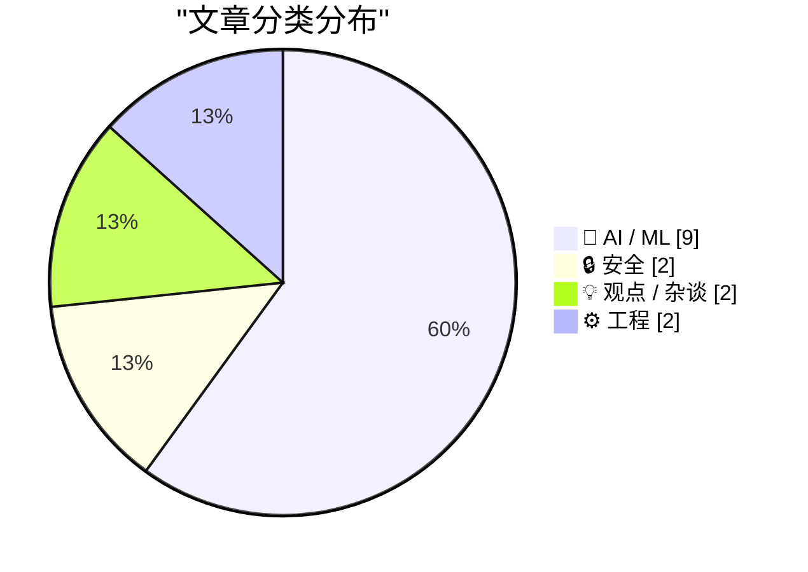
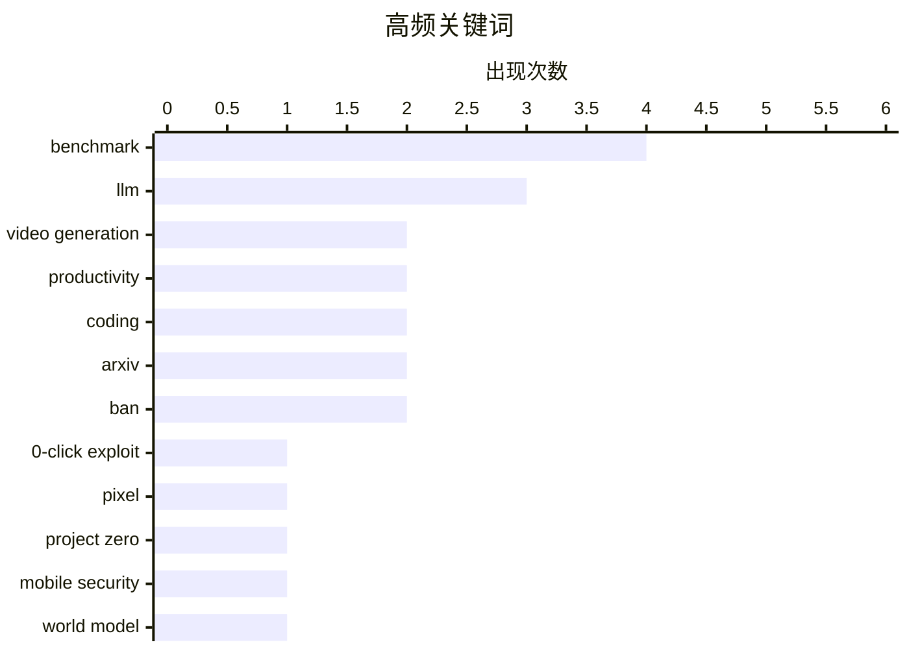

# 📰 AI 资讯每日精选 — 2026-05-17

> 汇聚 140+ 技术博客、X/Twitter、Hacker News、Reddit、Product Hunt、
> Lobste.rs、ClawFeed 日报及 GitHub Trending，经 AI 评分筛选。
>
> **本期内容**：🏆 今日必读 · 🌐 ClawFeed 日报 · 🔥 GitHub Trending · 📂 分类精选 · 🎨 设计与生成式 AI · 📊 数据概览

## 📝 今日看点

今日技术圈聚焦两大趋势：AI安全攻防进入新阶段，零点击漏洞利用链与AI自主开发浏览器漏洞的能力双双突破，标志着攻击自动化与防御复杂性同步升级；同时，开源世界模型与高效训练技术成为AI基础设施的竞争焦点，NVIDIA的SANA-WM和Nous Research的Token Superposition技术分别从生成质量与训练效率上推动行业边界。此外，关于“编码不再是瓶颈”的讨论引发对软件工程岗位价值的深层反思，而ArXiv对AI生成垃圾论文的封禁政策则凸显学术诚信面临的新挑战。

---

## 🏆 今日必读

🥇 **Google Project Zero：针对 Pixel 10 的零点击漏洞利用链——当一扇门关闭时，一扇窗会打开**

[Google Project Zero: A 0-click exploit chain for the Pixel 10: When a Door Closes, a Window Opens](https://www.reddit.com/r/programming/comments/1tf42e3/google_project_zero_a_0click_exploit_chain_for/) — r/programming · 5 小时前 · 🔒 安全

> Google Project Zero 团队披露了针对 Pixel 10 手机的一条完整零点击漏洞利用链。该攻击链通过蓝牙和 Wi-Fi 协议栈中的多个漏洞，无需用户任何交互即可实现远程代码执行。攻击者利用了一个已修复的蓝牙栈漏洞作为入口，随后通过 Wi-Fi 固件中的漏洞提权并持久化。文章详细分析了每个漏洞的技术细节、利用方法以及 Google 在 Android 安全模型中的修复措施。结论是，尽管单个漏洞的修复在持续进行，但攻击者总能找到新的攻击面，安全防御是一场永无止境的猫鼠游戏。

💡 **为什么值得读**: 来自 Google 顶级安全团队的真实零点击攻击链分析，是理解移动设备攻防前沿技术的必读案例。

🏷️ 0-click exploit, Pixel, Project Zero, mobile security

🥈 **SANA-WM：一个 2.6B 参数的开源世界模型，可生成 1 分钟 720p 视频**

[SANA-WM, a 2.6B open-source world model for 1-minute 720p video](https://nvlabs.github.io/Sana/WM/) — Hacker News Best · 13 小时前 · 🤖 AI / ML

> NVIDIA 实验室发布了 SANA-WM，一个仅有 26 亿参数的开源世界模型，能够生成长达 1 分钟、分辨率为 720p 的视频。该模型在视频生成质量和物理世界模拟能力上取得了突破，显著降低了世界模型的计算门槛。与同类闭源模型相比，SANA-WM 在保持高视觉质量的同时，参数量仅为十分之一甚至更少。这一成果使得在消费级硬件上运行世界模型成为可能，为机器人模拟、自动驾驶和内容创作等领域提供了新的基础工具。

💡 **为什么值得读**: 首个能在消费级硬件上运行的开源长视频世界模型，大幅降低了高质量视频生成和物理模拟的门槛。

🏷️ world model, video generation, open-source

🥉 **Strix Halo 上的 Llama.cpp MTP 基准测试：27B 模型显著加速，35B 模型表现不一**

[Strix Halo Llama.cpp MTP Benchmarks: 27B Gets Much Faster, 35B Is Mixed](https://www.reddit.com/r/LocalLLaMA/comments/1teypb8/strix_halo_llamacpp_mtp_benchmarks_27b_gets_much/) — r/LocalLLaMA · 8 小时前 · 🤖 AI / ML

> 在 AMD Strix Halo 平台上对 Qwen3.6 模型进行的 Llama.cpp 多令牌预测（MTP）基准测试显示，27B 参数模型在单轮 15k 上下文测试中，生成速度从 7.63 t/s 提升至 16.15 t/s，加速比高达 111.77%，总耗时缩短 11.5%。然而，35B 参数模型的 MTP 版本表现则好坏参半，在某些场景下反而更慢。测试表明 MTP 技术对内存带宽和模型架构高度敏感，并非对所有规模模型都能带来一致收益。结论是，MTP 在特定硬件和模型组合下能带来巨大性能提升，但需要针对性优化。

💡 **为什么值得读**: 提供了 Strix Halo 这一新硬件上 MTP 技术的真实性能数据，对在 AMD 平台部署大模型的开发者极具参考价值。

🏷️ MTP, benchmark, Strix Halo, performance

4️⃣ **作为一名 Staff Engineer，我在 2026 年如何使用 LLM**

[How I use LLMs as a staff engineer in 2026](https://seangoedecke.com/how-i-use-llms-in-2026/) — seangoedecke.com · 1 小时前 · 🤖 AI / ML

> 作者作为资深工程师，分享了 2026 年使用 LLM 的实践经验，与一年前的用法相比有了显著进化。核心用途包括：作为智能自动补全工具、在陌生领域编写短期战术性代码（但必须由领域专家审查）、大量编写一次性研究代码、通过提问学习新主题（如 Unity 引擎），以及作为最后的调试手段。作者强调，LLM 并未取代工程师的决策和审查能力，而是极大地加速了探索和原型阶段。核心观点是，LLM 是强大的生产力放大器，但关键判断和架构决策仍需人类工程师主导。

💡 **为什么值得读**: 来自资深工程师的真实工作流分享，展示了 LLM 在高级工程角色中的实际边界和最佳实践，而非空谈理论。

🏷️ LLM, staff engineer, productivity, coding

5️⃣ **新基准测试显示 Claude Mythos 和 GPT-5.5 能自主开发真实浏览器漏洞利用**

[New benchmark shows Claude Mythos and GPT-5.5 can develop real browser exploits autonomously](https://the-decoder.com/new-benchmark-shows-claude-mythos-and-gpt-5-5-can-develop-real-browser-exploits-autonomously/) — The Decoder · 12 小时前 · 🔒 安全

> 卡内基梅隆大学的研究人员构建了一个新基准，测试 AI 代理在利用 Google V8 引擎真实漏洞时的能力。结果显示，Claude Mythos 在自主开发浏览器漏洞利用方面大幅领先 GPT-5.5，但其运行成本是后者的 12 倍。该基准测试评估了 AI 从发现漏洞到编写完整利用代码的全流程自动化能力。研究结论指出，虽然顶级 AI 模型已具备开发真实漏洞利用的能力，但高昂的成本和较低的可靠性使其目前仍无法构成大规模实际威胁。

💡 **为什么值得读**: 首次量化了顶级 AI 模型在真实漏洞利用开发上的能力差距与成本权衡，对理解 AI 安全风险至关重要。

🏷️ AI agent, browser exploit, benchmark, V8

---

## 🌐 ClawFeed 日报精选

> 来源：[ClawFeed](https://clawfeed.kevinhe.io) — AI 驱动的多源新闻聚合

📋 ClawFeed 日报 | 2026-05-16

注：聚合本日 6 期 4h digest（id 450 00:00 跨日 / 451 04:00 / 452 08:00 / 453 12:00 / 454 16:00 / 455 20:00，覆盖 00:00-23:59 SGT 完整）。**5/16 是 Anthropic 第 4 个 vertical（PwC × Big-4 咨询）+ 中美 AI 政策长论文叠加 CLARITY Act 立法通过+ Circle Agent Stack 上线（stablecoin 巨头入场）+ Agent infra 一周端到端整合 + Jane Street 已成 AI 公司 + frontier lab finance vertical 双路径 + Onchain AI inference 双巨头格局成形 的一天。**

## 🔥 今日头条（Top 5）

1. **PwC × Anthropic 战略联盟扩大 — 咨询业护城河失血**（20:00）
   全球数十万 PwC 员工部署 Claude + 培训 3 万专业人员 + **保险承保从 10 周压到 10 天（提速 70%）**。"咨询行业护城河 = 工时计费。Claude 一上，工时这事自己就没了。" **Anthropic 本周第 4 个 vertical**——Legal (5/14) + Gates Foundation $200M (5/15) + SMB (5/16 04:00) + 本档 Big-4 咨询。**首个非软件 vertical 的具体生产率数字**（70%），比 framework / 白皮书类公告更实。来源: https://x.com/feed-thread

2. **Anthropic 中美 AI 竞争长论文 + Trump 访华窗口期 + CLARITY Act 立法通过**（08:00 + 16:00）
   16:00 档 Anthropic 论文 framing "两个 systemic 漏洞 + 18 个月战略窗口"，发布时机正赶上特朗普访华。同日 08:00 档美参议院银行委员会通过 **CLARITY Act 15-9**——数字资产市场结构监管框架，划清 SEC vs CFTC。配 5/15 Anthropic regulatory capture 反弹叙事 + 5/16 00:00 档"行业自写规则"反框架，**"frontier lab + crypto 共同的行业-立法博弈本周从舆论进入立法实质"**。来源: https://x.com/AnthropicAI

3. **Circle Agent Stack 上线 — agent commerce 基础设施 milestone**（16:00）
   @circle / @jerallaire 推出 **Agent Wallets + Skills + Marketplace + USDC Nanopayments for AI Agents** 完整一站式。**stablecoin 巨头正式入场 agent infra**。配 04:00 AgentPhone (YC, $2T 电信业 rebuild for agents) + 08:00 AgentKey by Chainbase (web search/scrape) + Franklin npm (on-chain wallet) + Infini API (virtual cards bulk) + 12:00 12306-mcp + Google Skills + 飞书 CLI 万星，**Agent infra 一周从单点产品 → 端到端 stack 整合**。来源: https://x.com/circle

4. **Frontier lab 双路径向 finance 垂直纵深**（00:00 + 08:00）
   00:00 档：**ChatGPT Personal Finance**（Pro preview）— 连金融账户 + 资金流可视化 + 自然语言查询，"they just killed like 200 startups"。08:00 档：**Claude Code × Financial Datasets MCP 原生接入** — 17,000+ 股票 + 30 年财务底稿 + SEC 原档，60 秒一键连。**OpenAI 走 consumer（个人金融连账户）/ Anthropic 走 dev（Claude Code + MCP + 数据库）**——本周两大 frontier lab 同向 finance 但路径分化。中文圈反应转 "金融/理财/财务行业 血洗" + "Trading Agents 死一片"焦虑（12:00/16:00）+ "把财务交给 OpenAI 真的放心吗"隐私反弹（08:00）。

5. **Jane Street 已变 tech/AI 公司 + DeepSeek 把 Harness 提到组织级**（20:00 + 16:00）
   Jane Street **4,032 GPU 数据中心 in Texas（多处）+ 3,500 员工产 Q1 $16B trading revenue + $10B net income**——对比 Goldman 46,000 员工产 $5.6B 净利润 = **单位人力净利 ~16x**。HFT 巨头进入"frontier-lab 之外的另一类大算力买家"。16:00 档 **DeepSeek 招 Agent Harness PM** — JD 直接写"团队使命：Model + Harness = Agent"，把 5/11 chenchengpro Harness Engineering (42→78% 仅换 harness) 发现**官方化为团队/角色/产品**。**"AI 大算力买家 + harness 路径"两条主线本日同步生产化**。

## 📰 当日核心主题（聚类视角）

- **Anthropic 周节奏密度本年最高** — 政策三连（5/15 白皮书 → EA 反弹 → Gates）+ 中美 AI 论文 + PwC × Big-4 咨询 4th vertical，每天一个公关 anchor
- **Agent infra 一周端到端整合**（AgentPhone telecom / Franklin wallet / Infini cards / Circle stack / Aethir Claw MaaS / 12306 MCP / Google Skills / OpenCLI multi-runtime）
- **CLARITY Act + "industry-capture 反框架" + Anthropic regulatory capture 反弹** = 行业-立法博弈三连，**5/16 立法实质化**
- **/goal pattern + Skill ecosystem 跨 runtime 标准化** — Claude Code / Codex / Hermes / Cursor / 飞书 CLI（万星）/ Google 13 skills 开源 / Warp oz-skills 15 套 / html-anything 75 Skills
- **Google 本周对 agent ecosystem 投入密度最高** — Google Skills 开源 + Google Health AI Coach + Health Gemma 在 startups 渗透
- **新加坡外长公开演示 Nanoclaw** — sovereign-level 官方背书 agent 基础设施（vs Apple Mulberry 退缩）
- **国产 AI infra 一周四连**（5/15）+ 飞书 CLI 万星 + 12306-mcp + 罗永浩话题二轮持续
- **Multi-agent workspaces 范式具象化** — hasantoxr framing + billtheinvestor 配方（Codex 构建 / CC 审查 / Hermes 编排）+ Golutra Slack-like + @oran_ge "coordinator + specialist 3-5 tools 不互聊"实战原则 + Cresta FDE 角色
- **Agent agency / observability** — DJ Claude (Haiku 4.5) "自主辞职"事件 + AgentPokerClub "AI 分析人胜过分析牌"行为标签 → behavior pattern identification 阶段
- **Onchain AI inference 双巨头格局成形** — Venice **50-80B token/day** ARR $12-14M + Chutes DeFi tokenomics + 4 个挑战者
- **Stablecoin 从加密内部 → 全球商业资金 infra 主线** — USD1 / strkBTC / ARC / Seismic / Circle USDC Nanopayments
- **Solo founder + AI 收益数据案例叠加** — 18 岁 30 天 $52K (Claude+ElevenLabs+CapCut) + WisMe 浏览器 AI 记忆 + Astrocade 2000 万 (5/15) + Mark II $159 (5/15)
- **Frontier lab 招聘 demographic 扩大** — OpenAI 新加坡中文 DevRel + DeepSeek Harness PM + Cresta FDE + Anthropic $3,850/周 给 no-AI-experience（5/15）= "前线 + 工程化 + 中文"三向倾斜
- **Hinton 警告中文圈扩散** — @0xCheshire 中文首发 + 罗永浩转发（5/15）+ Tsinghua AI health 接受度研究（5/16 20:00）
- **Coach 内部用 Claude Code case study** — Anthropic CFO Krishna Rao 播客："Finance Team 用 Claude Code 一年 as digital teammate"
- **个人 AI 记忆 + 浏览器集成案例 surface** — WisMe Chrome 扩展 + Hermes per-task memory write（5/15 hasantoxr "早用越值钱"）
- **HTML / 视频 / 3D / 设计 dev tool 持续开源化** — Violin 视频翻译 Skill / html-anything 75 Skills / Image→3D 5min / Reachy Mini 机器人 HF 开源 / beautiful-mermaid SVG+ASCII

## 🔖 累计 Bookmark 精选

⚠️ **Bookmarks 列表连续 16 档同样 20 条未更新（scrape bookmark endpoint bug 16 天）。本周必开 clawfeed issue 跟踪修复。** 本日报跳过 bookmark 区。

## 👀 推荐关注（去重汇总）

**Frontier lab + 政策 + agent infra**
- **@AnthropicAI** — 政策白皮书 + vertical 系列首发渠道
- **@circle / @jerallaire** — agent commerce 基础设施 milestone
- **@VivianBala**（新加坡外长）— sovereign-level agent 生态背书 source
- **@BrianRoemmele** — AI 政策辩论 + regulatory capture 批评

**Agent ecosystem / infra entries**
- **@ChainbaseHQ Labs**（AgentKey） — agent web access entry
- **@blockrun (Franklin)** — agent on-chain wallet npm 模式
- **@VeniceAI / Chutes**（@rayonprotocol） — onchain LLM serving 双巨头跟踪源
- **@AgentPokerClub** — agent behavior pattern observability 早期 case
- **@wisme.ai** — personal AI 记忆 + 浏览器集成深度产品（对 Routine #26/#32 直接参考）

**深度产品 / 工程实战**
- **@oran_ge** — multi-agent orchestration 实战原则
- **@AYi_AInotes** — 产品思路深度（Notion CLI 设计哲学）
- **@hasantoxr** — solo founder + workspaces 范式实战派
- **@runes_leo** — Karpathy 思想中文 distillation 高质量
- **@PaulRBerg** — Notion CLI 作者，SaaS → CLI 化趋势
- **@ericjang11** — AI primitives 反向工程教育源

**叙事 / 研究 / 中文圈**
- **@AntLingAGI** — 蚂蚁 Ring 开源 trillion-scale 路线
- **@Kimi_Moonshot** — Web Bridge 首发
- **@ArtificialAnlys** — AI 性能 benchmark 独立第三方
- **@0xCheshire** — Hinton 演讲中文首发
- **@rohanpaul_ai** — HBR 类 AI 应用研究
- **@FinanceYF5** — AI startup / consumer 案例追踪
- **@DoveyWanCN** — fintech / corporate VC × AI 框架

## 💤 当日重复噪音模式

- **Modi/Trump/Xi/CCP 政治长篇** — 连续 5-7 档背景噪音
- **罗永浩 X 真假预测 / 流量瓜分 / 段子** — 5 档连续，话题热度接近顶
- **$LIN/$APD/$AAPL/$NVDA 13F 持仓段子** — 多档同 framing 重复
- **ChatGPT Personal Finance 焦虑段子集群** — "killed 200 startups / 行业血洗 / 把财务交给 OpenAI 真的放心吗"，5+ 推同主题
- **vivo X300 / Coldcard MK5 / French Theory wokism / DEI Academy Awards** — 政治文化型推连档 carryover
- **"Stop Hiring Humans" billboard dystopian 段子** — 反 AI narrative 重复推
- **DJ Claude meme 零星多档** — main signal 后衍生段子，已 split
- **followingProfiles bio 字段连续 16 档为空** — scrape bug 持续，**必开 issue**
- **Bookmark endpoint 连续 16 档同 20 条** — scrape bug，**必开 issue**
- **GPT Image 2 系列推**（泳装选购图鉴 / 各种 rendering） — 同套图反复推
- **新结构性 noise**：PUBG 育儿金 + AI 解雇 + dystopian billboard = "AI 时代社会议题" 集中出现——下周 macro 类目下做合并 vs 单追 review

---

聚合 4h digests: 450 (00:00 跨日 5/15→5/16) / 451 (04:00) / 452 (08:00) / 453 (12:00) / 454 (16:00) / 455 (20:00)
覆盖时段: 2026-05-16 00:00-23:59 SGT（完整 6 档）

注：本日 4h 信号比例平均 ~55%（08:00 档干货密度最高 ~60% / 00:00 跨日档最低 ~40%）。Anthropic 政策叙事 + agent infra stack + frontier lab vertical 落地 + HFT 大算力买家 是本日 4 条主轴。
---

## 🔥 GitHub Trending

> 今日热门开源项目（全语言 + Python）

| # | 项目 | 描述 | ⭐ 总星 | 📈 今日 | 语言 |
|---|------|------|---------|---------|------|
| 1 | [tinyhumansai/openhuman](https://github.com/tinyhumansai/openhuman) 🤖 | Your Personal AI super intelligence. Private, Simple and ... | 10.8k | +1549 | Rust |
| 2 | [obra/superpowers](https://github.com/obra/superpowers) | An agentic skills framework & software development method... | 194.0k | +1305 | Shell |
| 3 | [ruvnet/RuView](https://github.com/ruvnet/RuView) | π RuView turns commodity WiFi signals into real-time spat... | 58.4k | +1010 | Rust |
| 4 | [anthropics/skills](https://github.com/anthropics/skills) 🤖 | Public repository for Agent Skills | 135.8k | +900 | Python |
| 5 | [supertone-inc/supertonic](https://github.com/supertone-inc/supertonic) | Lightning-Fast, On-Device, Multilingual TTS — running nat... | 6.9k | +749 | Swift |
| 6 | [K-Dense-AI/scientific-agent-skills](https://github.com/K-Dense-AI/scientific-agent-skills) 🤖 | A set of ready to use Agent Skills for research, science,... | 23.2k | +673 | Python |
| 7 | [colbymchenry/codegraph](https://github.com/colbymchenry/codegraph) 🤖 | Pre-indexed code knowledge graph for Claude Code — fewer ... | 2.5k | +416 | TypeScript |
| 8 | [oven-sh/bun](https://github.com/oven-sh/bun) | Incredibly fast JavaScript runtime, bundler, test runner,... | 91.2k | +397 | Rust |
| 9 | [HKUDS/CLI-Anything](https://github.com/HKUDS/CLI-Anything) 🤖 | "CLI-Anything: Making ALL Software Agent-Native" -- CLI-H... | 35.1k | +333 | Python |
| 10 | [Anil-matcha/Open-Generative-AI](https://github.com/Anil-matcha/Open-Generative-AI) 🤖 | Open-source alternative to AI video platforms — Free AI i... | 14.5k | +317 | JavaScript |
| 11 | [dograh-hq/dograh](https://github.com/dograh-hq/dograh) 🤖 | Open Source Voice Agent Platform | 1.3k | +287 | Python |
| 12 | [NVIDIA-AI-Blueprints/video-search-and-summarization](https://github.com/NVIDIA-AI-Blueprints/video-search-and-summarization) 🤖 | Suite of reference architectures for building GPU-acceler... | 1.3k | +235 | Python |
| 13 | [BigBodyCobain/Shadowbroker](https://github.com/BigBodyCobain/Shadowbroker) 🤖 | Open-source intelligence for the global theater. Track ev... | 6.6k | +165 | Python |
| 14 | [luongnv89/claude-howto](https://github.com/luongnv89/claude-howto) 🤖 | A visual, example-driven guide to Claude Code — from basi... | 33.2k | +165 | Python |
| 15 | [rossant/awesome-math](https://github.com/rossant/awesome-math) | A curated list of awesome mathematics resources | 15.3k | +116 | Python |

---

## 🤖 AI / ML

### 1. SANA-WM：一个 2.6B 参数的开源世界模型，可生成 1 分钟 720p 视频

[SANA-WM, a 2.6B open-source world model for 1-minute 720p video](https://nvlabs.github.io/Sana/WM/) — **Hacker News Best** · 13 小时前 · ⭐ 27/30

> NVIDIA 实验室发布了 SANA-WM，一个仅有 26 亿参数的开源世界模型，能够生成长达 1 分钟、分辨率为 720p 的视频。该模型在视频生成质量和物理世界模拟能力上取得了突破，显著降低了世界模型的计算门槛。与同类闭源模型相比，SANA-WM 在保持高视觉质量的同时，参数量仅为十分之一甚至更少。这一成果使得在消费级硬件上运行世界模型成为可能，为机器人模拟、自动驾驶和内容创作等领域提供了新的基础工具。

🏷️ world model, video generation, open-source

---

### 2. Strix Halo 上的 Llama.cpp MTP 基准测试：27B 模型显著加速，35B 模型表现不一

[Strix Halo Llama.cpp MTP Benchmarks: 27B Gets Much Faster, 35B Is Mixed](https://www.reddit.com/r/LocalLLaMA/comments/1teypb8/strix_halo_llamacpp_mtp_benchmarks_27b_gets_much/) — **r/LocalLLaMA** · 8 小时前 · ⭐ 27/30

> 在 AMD Strix Halo 平台上对 Qwen3.6 模型进行的 Llama.cpp 多令牌预测（MTP）基准测试显示，27B 参数模型在单轮 15k 上下文测试中，生成速度从 7.63 t/s 提升至 16.15 t/s，加速比高达 111.77%，总耗时缩短 11.5%。然而，35B 参数模型的 MTP 版本表现则好坏参半，在某些场景下反而更慢。测试表明 MTP 技术对内存带宽和模型架构高度敏感，并非对所有规模模型都能带来一致收益。结论是，MTP 在特定硬件和模型组合下能带来巨大性能提升，但需要针对性优化。

🏷️ MTP, benchmark, Strix Halo, performance

---

### 3. 作为一名 Staff Engineer，我在 2026 年如何使用 LLM

[How I use LLMs as a staff engineer in 2026](https://seangoedecke.com/how-i-use-llms-in-2026/) — **seangoedecke.com** · 1 小时前 · ⭐ 26/30

> 作者作为资深工程师，分享了 2026 年使用 LLM 的实践经验，与一年前的用法相比有了显著进化。核心用途包括：作为智能自动补全工具、在陌生领域编写短期战术性代码（但必须由领域专家审查）、大量编写一次性研究代码、通过提问学习新主题（如 Unity 引擎），以及作为最后的调试手段。作者强调，LLM 并未取代工程师的决策和审查能力，而是极大地加速了探索和原型阶段。核心观点是，LLM 是强大的生产力放大器，但关键判断和架构决策仍需人类工程师主导。

🏷️ LLM, staff engineer, productivity, coding

---

### 4. Nous Research 发布 Token Superposition 训练技术，可将 2.7B 至 10B 参数模型的预训练速度提升高达 2.5 倍

[Nous Research Releases Token Superposition Training to Speed Up LLM Pre-Training by Up to 2.5x Across 270M to 10B Parameter Models](https://www.reddit.com/r/singularity/comments/1teoiq0/nous_research_releases_token_superposition/) — **r/singularity** · 16 小时前 · ⭐ 26/30

> Nous Research 发布了 Token Superposition Training (TST) 技术，这是一种能显著减少大语言模型预训练时间的方法。在 2.7 亿到 100 亿参数规模的模型上测试，TST 可将预训练墙钟时间加速最高 2.5 倍。该方法通过让模型在训练过程中同时学习多个 token 的叠加表示，从而更高效地利用计算资源。TST 无需修改模型架构即可应用，与现有训练框架兼容。结论是，TST 为降低大模型训练成本提供了一种实用且高效的方案。

🏷️ token superposition, pre-training, LLM, speedup

---

### 5. ArXiv 将对提交 AI 生成垃圾论文的作者实施一年封禁

[ArXiv to Ban Researchers for a Year if They Submit AI Slop](https://www.404media.co/new-arxiv-rules-ai-generated-papers-ban/) — **daringfireball.net** · 6 小时前 · ⭐ 25/30

> 预印本平台 ArXiv 更新了其政策，明确将对提交包含 AI 生成不当内容（如抄袭、错误引用、误导性内容）的论文作者进行处罚。计算机科学板块主席 Thomas Dietterich 宣布，如果提交的论文中存在“无可辩驳的证据”表明使用了生成式 AI 工具并导致了上述问题，作者将被禁止在一年内提交新论文。该政策旨在遏制日益泛滥的 AI 生成低质量学术论文，维护学术诚信。

🏷️ ArXiv, AI slop, ban, research

---

### 6. 新基准证实 AI 视频生成器视觉效果惊艳，但仍无法理解世界物理规律

[New benchmark confirms AI video generators look stunning but still can't reason about the world](https://the-decoder.com/new-benchmark-confirms-ai-video-generators-look-stunning-but-still-cant-reason-about-the-world/) — **The Decoder** · 14 小时前 · ⭐ 25/30

> 新发布的 WorldReasonBench 基准测试不再评估视频画质，而是专门测试视频生成器对物理和逻辑合理性的理解。字节跳动的 Seedance 2.0 在测试中领先，超越 Veo 3.1 和 Sora 2，商业模型得分约为开源模型的两倍。所有模型在逻辑推理类别上的表现都远差于其他类别。结论是，尽管视频生成在视觉上已以假乱真，但从像素生成器到真正的世界模型这一跨越仍未实现。

🏷️ video generation, benchmark, reasoning, physics

---

### 7. 研究人员训练出仅用 12.5% 专家即可达到接近完整性能的 AI 模型

[Researchers train AI model that hits near-full performance with just 12.5 percent of its experts](https://the-decoder.com/researchers-train-ai-model-that-hits-near-full-performance-with-just-12-5-percent-of-its-experts/) — **The Decoder** · 17 小时前 · ⭐ 25/30

> 艾伦人工智能研究所和加州大学伯克利分校的研究人员构建了 EMO 模型，这是一种混合专家模型，其专家按内容领域而非词类型进行专业化分工。这使得在推理时可以移除四分之三的专家，而性能仅下降约一个百分点。这一突破首次让混合专家模型在内存受限的设备上变得实用。结论是，通过领域专业化，MoE 模型可以在保持高性能的同时大幅降低部署成本。

🏷️ mixture-of-experts, efficiency, domain specialization

---

### 8. 对 Arxiv 提议的一年封禁期的强烈反对令人费解

[Backlash against Arxiv's proposed 1 year ban is genuinely perplexing. [D]](https://www.reddit.com/r/MachineLearning/comments/1tens5n/backlash_against_arxivs_proposed_1_year_ban_is/) — **r/MachineLearning** · 17 小时前 · ⭐ 25/30

> 文章讨论了对 Arxiv 提议对发表包含幻觉引用等明显 LLM/GenAI 痕迹论文的作者实施一年封禁的强烈反对声浪。作者认为这种反对令人费解，因为该政策旨在维护学术诚信，打击低质量、自动生成的垃圾论文。关键论点在于，反对者可能低估了 LLM 生成内容对学术出版质量的侵蚀，而一年封禁是相对温和的威慑手段。核心观点是：学术界必须采取果断措施来遏制 AI 生成虚假学术内容的趋势。

🏷️ Arxiv, LLM, hallucination, ban

---

### 9. 在 Strix Halo、RTX 3090 和 RTX 5070 上运行相同模型，只为获得我自己的数据

[Ran the same models across Strix Halo, RTX 3090, and RTX 5070 because I wanted my own numbers](https://www.reddit.com/r/LocalLLaMA/comments/1tf9iyk/ran_the_same_models_across_strix_halo_rtx_3090/) — **r/LocalLLaMA** · 1 小时前 · ⭐ 25/30

> 作者为获得硬件间的公平对比，构建了一套测试框架，在 Strix Halo、RTX 3090 和 RTX 5070 三台设备上进行了 55 次推理速度测试。测试覆盖了从 0.35B 到 35B-A3B（MoE）的模型，使用了五种后端（rocm, vulkan, cpu, cuda, vllm-cuda），并包含短提示聊天、长上下文 RAG、代码生成和并发代理等四种工作负载。所有运行结果均以 YAML 格式公开。结论是：不同硬件在不同模型大小和工作负载下的性能差异巨大，实际选型必须基于具体场景。

🏷️ benchmark, Strix-Halo, RTX-3090, inference

---

## 🔒 安全

### 10. Google Project Zero：针对 Pixel 10 的零点击漏洞利用链——当一扇门关闭时，一扇窗会打开

[Google Project Zero: A 0-click exploit chain for the Pixel 10: When a Door Closes, a Window Opens](https://www.reddit.com/r/programming/comments/1tf42e3/google_project_zero_a_0click_exploit_chain_for/) — **r/programming** · 5 小时前 · ⭐ 28/30

> Google Project Zero 团队披露了针对 Pixel 10 手机的一条完整零点击漏洞利用链。该攻击链通过蓝牙和 Wi-Fi 协议栈中的多个漏洞，无需用户任何交互即可实现远程代码执行。攻击者利用了一个已修复的蓝牙栈漏洞作为入口，随后通过 Wi-Fi 固件中的漏洞提权并持久化。文章详细分析了每个漏洞的技术细节、利用方法以及 Google 在 Android 安全模型中的修复措施。结论是，尽管单个漏洞的修复在持续进行，但攻击者总能找到新的攻击面，安全防御是一场永无止境的猫鼠游戏。

🏷️ 0-click exploit, Pixel, Project Zero, mobile security

---

### 11. 新基准测试显示 Claude Mythos 和 GPT-5.5 能自主开发真实浏览器漏洞利用

[New benchmark shows Claude Mythos and GPT-5.5 can develop real browser exploits autonomously](https://the-decoder.com/new-benchmark-shows-claude-mythos-and-gpt-5-5-can-develop-real-browser-exploits-autonomously/) — **The Decoder** · 12 小时前 · ⭐ 26/30

> 卡内基梅隆大学的研究人员构建了一个新基准，测试 AI 代理在利用 Google V8 引擎真实漏洞时的能力。结果显示，Claude Mythos 在自主开发浏览器漏洞利用方面大幅领先 GPT-5.5，但其运行成本是后者的 12 倍。该基准测试评估了 AI 从发现漏洞到编写完整利用代码的全流程自动化能力。研究结论指出，虽然顶级 AI 模型已具备开发真实漏洞利用的能力，但高昂的成本和较低的可靠性使其目前仍无法构成大规模实际威胁。

🏷️ AI agent, browser exploit, benchmark, V8

---

## 💡 观点 / 杂谈

### 12. “编码从来不是瓶颈”这一说法实际上对就业是利空

[‘Coding Was Never the Bottleneck’ Is Actually Bearish for Employment](https://www.reddit.com/r/singularity/comments/1tegzvj/coding_was_never_the_bottleneck_is_actually/) — **r/singularity** · 22 小时前 · ⭐ 26/30

> 文章反驳了“AI 加速编码但整体生产力提升不大，因为瓶颈在会议和协调”的乐观观点。作者指出，如果编码不再是瓶颈，那么软件工程中剩下的“高价值”工作（如需求分析、架构设计、跨团队协调）将更少地依赖初级工程师。当 AI 能完成大部分编码后，公司可能只需要少数资深工程师来处理这些“瓶颈”工作，从而大幅减少对大量中级和初级工程师的需求。结论是，这种观点实际上暗示了软件工程岗位将向更少、更资深的极端分化，对整体就业市场是利空。

🏷️ coding, productivity, employment, AI impact

---

### 13. “无法阻止这种事”，只有这个包管理器才经常出这种事

[‘No Way To Prevent This,’ Says Only Package Manager Where This Regularly Happens | Kevin Patel](https://www.reddit.com/r/programming/comments/1temt7r/no_way_to_prevent_this_says_only_package_manager/) — **r/programming** · 17 小时前 · ⭐ 25/30

> 文章讽刺性地批评了 npm 生态中频繁发生的恶意包注入事件。作者指出，npm 作为唯一一个此类事件屡见不鲜的包管理器，其官方回应却总是推卸责任，声称“无法阻止”。文章对比了其他语言生态（如 Rust 的 Cargo、Go 的模块系统）在供应链安全上的主动防御措施，认为 npm 的问题根源在于其设计哲学和治理缺失。核心观点是：npm 并非无法阻止，而是缺乏阻止的意愿和架构设计。

🏷️ package manager, security, supply chain, satire

---

## ⚙️ 工程

### 14. Cloudflare 重新架构其 Workflows 控制平面，并发实例数从 4,500 提升至 50,000

[Cloudflare rearchitected their Workflows control plane to handle 50,000 concurrent instances (up from 4,500)](https://www.reddit.com/r/programming/comments/1tehbf7/cloudflare_rearchitected_their_workflows_control/) — **r/programming** · 22 小时前 · ⭐ 25/30

> Cloudflare 宣布对其 Workflows 产品的控制平面进行了重大架构重构，将最大并发实例数从 4,500 提升至 50,000，提升了超过 10 倍。核心方案是将原本的单体式控制平面拆分为基于 Durable Objects 的分布式架构，实现了更细粒度的状态管理和水平扩展。该重构还显著降低了延迟，并提高了系统在面对突发流量时的稳定性。结论是：通过采用正确的分布式计算模型，可以在不牺牲一致性的前提下实现数量级的性能飞跃。

🏷️ Cloudflare, Workflows, scalability, architecture

---

### 15. 我构建了一个自定义 NVENC 编码器桥，通过以太网 LAN 将 FLUX 2 模型拆分到两张 GPU 上运行

[I built a custom NVENC encoder bridge to split FLUX 2 Models across two GPUs over Ethernet LAN (example: 5090 + laptop 4090 spreading model layers over two machines via Eth = 4.4s per image). Completely bypasses the need for NVLink. Multi GPU in one PC supported, Wifi 6 works very well also.](https://www.reddit.com/r/StableDiffusion/comments/1tegs83/i_built_a_custom_nvenc_encoder_bridge_to_split/) — **r/StableDiffusion** · 23 小时前 · ⭐ 25/30

> 作者开发了一个自定义 NVENC 编码器桥，实现了将 FLUX 2 模型跨以太网 LAN 拆分到两张 GPU（如 RTX 5090 + 笔记本 RTX 4090）上运行，无需 NVLink 即可实现 4.4 秒/张的生成速度。该方案也支持单机多 GPU，并验证了 Wi-Fi 6 网络下同样表现良好。核心方案是通过高效的编码器桥接层，将模型层分布在不同机器上，利用网络传输中间结果。结论是：通过软件层面的优化，可以低成本地利用多台设备的 GPU 资源来运行大型生成模型。

🏷️ NVENC, multi-GPU, FLUX, Ethernet

---

## 🎨 Design & Generative AI

### 🖼️ 生成式图片

- **[WorkflowX-Configurator：一键切换ComfyUI工作流配置](https://www.reddit.com/r/comfyui/comments/1tenopx/i_released_workflowxconfigurator_one_shot/)** — r/comfyui · 17 小时前
  > 发布WorkflowX-Configurator自定义节点，支持一键设置/获取键值对，创建多工作流配置并通过简单切换选择配置。

- **[WorkflowX-Configurator更新：无需重新连线即可切换工作流预设](https://www.reddit.com/r/comfyui/comments/1texin1/update_workflowxconfigurator_a_comfyui_custom/)** — r/comfyui · 9 小时前
  > ComfyUI自定义节点包更新，支持切换工作流预设、LoRA、检查点等参数，无需重新连线，一键选择配置文件动态路由。

- **[CLIP加载自定义节点：支持FP8存储节省显存](https://www.reddit.com/r/comfyui/comments/1teojku/clip_load_custom_node_that_allows_fp8_storage/)** — r/comfyui · 16 小时前
  > 新发布的ComfyUI自定义节点允许CLIP模型以FP8格式存储，避免默认的FP16/BF16上转换，节省显存。

- **[RTX 5070 Ti 16GB显存下生成速度极慢](https://www.reddit.com/r/comfyui/comments/1tf753j/extremely_slow_generation_on_rtx_5070_ti_16gb/)** — r/comfyui · 3 小时前
  > 用户报告在RTX 5070 Ti 16GB显存配置下，ComfyUI生成速度异常缓慢，单次生成耗时约75秒。

- **[为ComfyUI打造的极简Web界面](https://www.reddit.com/r/StableDiffusion/comments/1tevovo/i_made_an_overly_simplified_web_ui_for_comfyui/)** — r/StableDiffusion · 10 小时前
  > 开发者制作了一个高度简化的ComfyUI Web UI，旨在降低使用门槛。

- **[Comfyflow：发现与分享ComfyUI工作流的平台](https://www.reddit.com/r/comfyui/comments/1tegzf9/comfyflow_discover_share_comfyui_workflows/)** — r/comfyui · 22 小时前
  > 一个由社区用户创建的ComfyUI工作流分享平台，旨在避免商业化后停止共享的问题。

- **[不同训练工具对LoRA效果的影响对比](https://www.reddit.com/r/StableDiffusion/comments/1tf166z/training_tool_impact_on_resulting_loras/)** — r/StableDiffusion · 7 小时前
  > 用户对比kohya-ss、onetrainer、ai-toolkit等SDXL训练工具，探讨哪种工具能生成更优的LoRA模型。

- **[AsymFlux.2 Klein 9B：低显存工作流升级版](https://www.reddit.com/r/comfyui/comments/1tesex4/asymflux2_klein_9b_low_vram_workflow/)** — r/comfyui · 13 小时前
  > Flux Klein 9B模型迎来升级，推出AsymFlux.2版本，专为低显存环境优化。

- **[INSTARAW 2.0全部工作流发布：极致真实感图像生成](https://www.reddit.com/r/comfyui/comments/1tf8m3q/instaraw_20_all_workflows_release/)** — r/comfyui · 2 小时前
  > 发布包含14个ComfyUI工作流的INSTARAW 2.0包，专注于生成超写实图像并绕过AI检测器。

### 🌍 世界模型 / 3D

- **[SANA-WM：开源2.6B参数世界模型，生成1分钟720p视频](https://nvlabs.github.io/Sana/WM/)** — Hacker News Best · 13 小时前
  > NVIDIA实验室发布SANA-WM，一个26亿参数的开源世界模型，可生成长达1分钟、720p分辨率的视频。

### 🎬 生成式视频

- **[ControlFoley集成ComfyUI：从视频/图像生成同步音效](https://www.reddit.com/r/comfyui/comments/1tewthf/github_sgunfathercomfyuicontrolfoley_神棍/)** — r/comfyui · 10 小时前
  > 基于小米研究院ControlFoley项目，在ComfyUI中实现从视频、图像和文本提示生成同步拟音音效。

- **[低显存下最佳唇形同步模型推荐](https://www.reddit.com/r/StableDiffusion/comments/1tf550j/best_lip_sync_model_for_low_vram/)** — r/StableDiffusion · 4 小时前
  > 用户寻求在6GB显存（RTX 3060）下可用的唇形同步模型，要求生成时间合理，分辨率可低至256x256。

- **[LTX 2.3风格增强LoRA教程：生成电影级视频](https://www.reddit.com/r/comfyui/comments/1tetelj/comfyui_tutorial_ltx_23_style_enhancer_lora_for/)** — r/comfyui · 12 小时前
  > ComfyUI教程展示如何使用LTX 2.3风格增强LoRA，在6GB显存下生成1920x1080分辨率的电影感视频，耗时20分钟。

- **[LTX是否支持角色+场景参考图实现一致视频生成？](https://www.reddit.com/r/StableDiffusion/comments/1tf0jv1/does_ltx_support_character_scene_reference_images/)** — r/StableDiffusion · 7 小时前
  > 用户询问LTX能否像Kling和Seedance 2那样，通过上传角色和场景参考图像生成风格一致的视频。

- **[Seedance 2.0电影级时间冻结效果ComfyUI工作流](https://www.reddit.com/r/comfyui/comments/1tev0ey/cinematic_time_freeze_effect_seedance_20_comfyui/)** — r/comfyui · 11 小时前
  > 分享Seedance 2.0的ComfyUI工作流，实现电影中常见的“时间冻结”特效。

---

## 📊 数据概览

| 扫描源 | 抓取文章 | 时间范围 | 精选 |
|:---:|:---:|:---:|:---:|
| 118/140 | 5362 篇 → 179 篇 | 24h | **15 篇** |

### 分类分布



### 高频关键词



<details>
<summary>📈 纯文本关键词图（终端友好）</summary>

```
benchmark        │ ████████████████████ 4
llm              │ ███████████████░░░░░ 3
video generation │ ██████████░░░░░░░░░░ 2
productivity     │ ██████████░░░░░░░░░░ 2
coding           │ ██████████░░░░░░░░░░ 2
arxiv            │ ██████████░░░░░░░░░░ 2
ban              │ ██████████░░░░░░░░░░ 2
0-click exploit  │ █████░░░░░░░░░░░░░░░ 1
pixel            │ █████░░░░░░░░░░░░░░░ 1
project zero     │ █████░░░░░░░░░░░░░░░ 1
```

</details>

### 🏷️ 话题标签

**benchmark**(4) · **llm**(3) · **video generation**(2) · productivity(2) · coding(2) · arxiv(2) · ban(2) · 0-click exploit(1) · pixel(1) · project zero(1) · mobile security(1) · world model(1) · open-source(1) · mtp(1) · strix halo(1) · performance(1) · staff engineer(1) · ai agent(1) · browser exploit(1) · v8(1)

---

*生成于 2026-05-17 01:33 | 汇聚 140 个技术博客、X/Twitter、Hacker News、Reddit、Product Hunt、Lobste.rs、ClawFeed 日报及 GitHub Trending，经 AI 评分筛选出 Top 15 精华内容*
