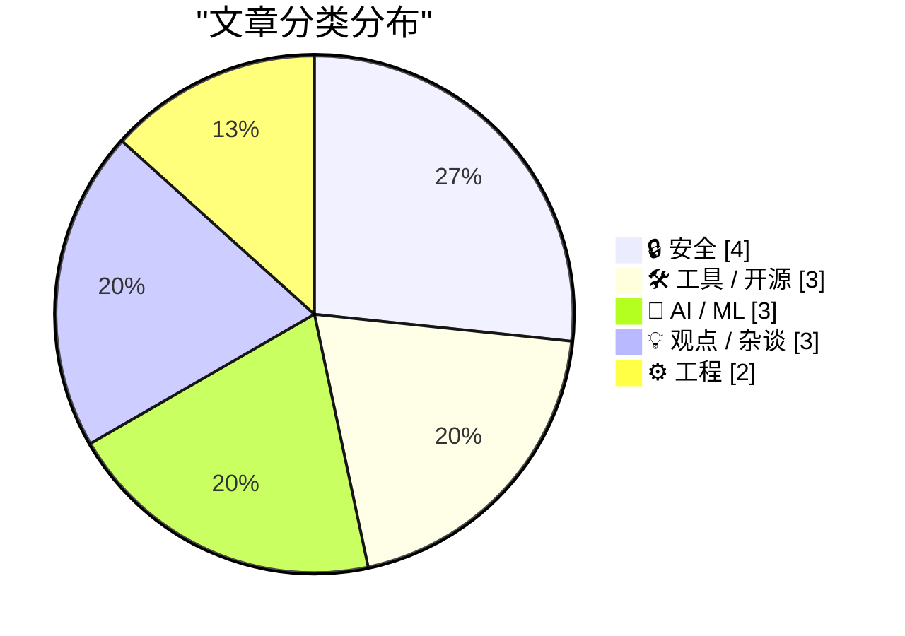
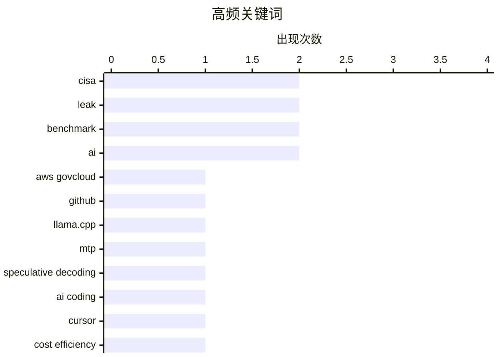

# 📰 AI 资讯每日精选 — 2026-05-19

> 汇聚 140+ 技术博客、X/Twitter、Hacker News、Reddit、Product Hunt、
> Lobste.rs、ClawFeed 日报及 GitHub Trending，经 AI 评分筛选。
>
> **本期内容**：🏆 今日必读 · 🌐 ClawFeed 日报 · 🔥 GitHub Trending · 📂 分类精选 · 🎨 设计与生成式 AI · 📊 数据概览

## 📝 今日看点

今日技术圈聚焦两大主线：一是AI推理效率与成本的结构性突破，llama.cpp的多令牌预测技术实现2倍以上加速，Cursor基于Kimi K2.5的编程模型以极低成本匹敌顶级闭源模型，标志着本地化、低成本AI正加速落地；二是AI引发的安全与就业双重震荡，CISA承包商在GitHub泄露高权限政府云密钥暴露了基础设施管理的脆弱性，而Anthropic CEO与多位业界领袖则警告AI将导致GDP飙升与失业率超10%并存的史无前例局面，精英企业的劳动力优势正被技术瓦解。

---

## 🏆 今日必读

🥇 **CISA管理员在GitHub上泄露了AWS GovCloud密钥**

[CISA Admin Leaked AWS GovCloud Keys on Github](https://krebsonsecurity.com/2026/05/cisa-admin-leaked-aws-govcloud-keys-on-github/) — krebsonsecurity.com · 4 小时前 · 🔒 安全

> 一名CISA（网络安全与基础设施安全局）的承包商在公开的GitHub仓库中暴露了多个高权限AWS GovCloud账户及大量内部系统的凭证。该仓库包含CISA内部构建、测试和部署软件的详细文件。安全专家称，这是近年来最严重的政府数据泄露事件之一。泄露的密钥直到上周末才被移除。

💡 **为什么值得读**: 揭示了政府机构在云安全与代码托管方面的重大疏漏，对理解国家级安全风险有直接警示意义。

🏷️ CISA, AWS GovCloud, leak, GitHub

🥈 **llama.cpp MTP支持已落地：Qwen3.6 27B在Strix Halo上达到2.44倍加速，在RTX 3090上达到2.17倍**

[llama.cpp MTP support landed - Qwen3.6 27B at 2.44× on a Strix Halo, 2.17× on a RTX 3090 rig](https://www.reddit.com/r/LocalLLaMA/comments/1tgxau6/llamacpp_mtp_support_landed_qwen36_27b_at_244_on/) — r/LocalLLaMA · 6 小时前 · ⚙️ 工程

> llama.cpp主线于5月16日合并了MTP（多令牌预测）推测解码的PR #22673。测试显示，Qwen3.6 27B模型在Strix Halo（Framework Desktop, ROCm 7.0.2）上，Q8_0量化下速度从7.4 tok/s提升至18.1 tok/s（2.44倍）；在单张RTX 3090（CUDA 12.9）上，Q4_K_M量化下速度从38.7 tok/s提升至59.5 tok/s（1.54倍）。该技术通过并行预测多个后续令牌显著提升推理速度。

💡 **为什么值得读**: 提供了MTP推测解码在主流硬件上的实测性能数据，对本地大模型部署和推理优化有直接参考价值。

🏷️ llama.cpp, MTP, speculative decoding, benchmark

🥉 **Cursor的Composer 2.5在基准测试中匹配Opus 4.7和GPT-5.5，但成本仅为其一小部分**

[Cursor's Composer 2.5 matches Opus 4.7 and GPT-5.5 benchmarks at a fraction of the cost](https://the-decoder.com/cursors-composer-2-5-matches-opus-4-7-and-gpt-5-5-benchmarks-at-a-fraction-of-the-cost/) — The Decoder · 8 小时前 · 🛠 工具 / 开源

> Cursor发布了基于Kimi K2.5构建的AI编程模型Composer 2.5，其训练使用的合成任务量是前代的25倍。该模型在多项基准测试中与Opus 4.7和GPT-5.5性能持平，但推理成本显著降低。这表明通过大规模合成数据训练，可以在不依赖顶级基础模型的情况下实现同等编码能力。

💡 **为什么值得读**: 展示了AI编程领域“低成本高性能”的新范式，对开发者选型和成本控制有重要参考意义。

🏷️ AI coding, benchmark, Cursor, cost efficiency

4️⃣ **Witchcraft：基于SQLite的快速本地语义搜索**

[Witchcraft, fast local semantic search on top of SQLite [P]](https://www.reddit.com/r/MachineLearning/comments/1tgqyo8/witchcraft_fast_local_semantic_search_on_top_of/) — r/MachineLearning · 9 小时前 · 🛠 工具 / 开源

> Dropbox开源了Witchcraft，这是一个用安全Rust语言从头实现的语义搜索引擎，基于Stanford的XTR-Warp算法。它使用单文件SQLite数据库作为后端存储，特别适合客户端本地部署。该项目实现了高效的本地语义搜索能力，无需依赖外部云服务。

💡 **为什么值得读**: 为需要离线或本地语义搜索的应用（如个人知识库、边缘设备）提供了一个轻量级、可嵌入的开源解决方案。

🏷️ semantic search, SQLite, Dropbox, open source

5️⃣ **我训练了TIME：在Qwen模型上实现短上下文触发的思考，而非过度思考**

[I trained TIME: short context-triggered thinking on Qwen model instead of overthinking](https://www.reddit.com/r/LocalLLaMA/comments/1tg90pu/i_trained_time_short_contexttriggered_thinking_on/) — r/LocalLLaMA · 23 小时前 · 🤖 AI / ML

> 作者以个人项目起步，训练了Qwen3模型实现TIME（短上下文触发思考）机制，该成果意外被ACL 2026接收为独立论文。TIME的核心是让模型仅在需要时进行短促思考，而非在回答开头生成冗长的推理块。它解决了模型“过度思考”的问题，在保持推理质量的同时显著缩短了输出长度。

💡 **为什么值得读**: 提出了一种新颖的“按需思考”训练方法，对提升推理效率和减少计算浪费有实际价值，且已被顶级会议认可。

🏷️ thinking, training, Qwen, ACL

---

## 🌐 ClawFeed 日报精选

> 来源：[ClawFeed](https://clawfeed.kevinhe.io) — AI 驱动的多源新闻聚合

📅 ClawFeed Daily | 2026-05-18 SGT

聚合源：6 档 4h digest（ids 464 / 466 / 467 / 468 / 469 / 470）
窗口：5/18 00:00 → 19:59 SGT（覆盖 5/17 20:00 → 5/18 19:59 跨日完整周日）
scrape stats：feed 27-58 / 4h，bookmarks **累计 28 档 = 7 天断流 milestone**（critical bug carry，本档必修第 N 次）

---

## 🔥 当日全场最重要 5 条

1. **Hermes Agent v0.14.0 "The Foundation Release"** —— @Teknium 一档全 ship：xAI Supergrok & Premium+ account access / Codex as runtime backend for OpenAI models / LINE as new gateway messenger / Native video generation / "Huge performance increases"。**本档 + 本周 + 本月 anchor 级**——5/11 NousResearch OpenRouter token #1 → 5/17 00:00 xAI×Hermes 战略联盟 → 5/17 08:00 商品化 → 5/18 00:00 `hermes auth add xai-oauth` user command → **本档官方 v0.14.0 全面 native 化**。一周内从签约 → 用户命令 → 正式 release 完整闭环。开源 agent ecosystem 历史性 release。（来自 467 / 5/18 08:00 SGT）https://x.com/Teknium

2. **Anthropic 官方 ship `claude-code-setup` plugin — "把 Claude Code 从'还不错的工具'变成真正的 AI 开发环境"** —— @servasyy_ai：自动 scan project → 推荐 hooks / skills / MCP servers / subagents 一键编排。**首个 frontier-lab 官方一键 Claude Code 全栈编排器**——把 5/16 Warp oz-skills + Google 13 skills + 5/17 gdb 亲 ship Skill + Pixelpoint Animate Skill + 5/18 04:00 7 PPT Skill 系列分散开源 → frontier lab 官方一键 install 收口。**Skill economy 进入"frontier lab 端到端 orchestrator" 阶段**。（来自 468 / 5/18 12:00 SGT）https://x.com/servasyy_ai

3. **xAI 视觉/agent 栈一周 4 档 anchor 全栈打通** —— 跨档 macro anchor：
   - 5/17 Grok Build CLI 入场（carryover）
   - 5/18 08:00 Grok automations 路线图首曝（Email Auto-Responder / Daily Stock Tracker / Task Extractor）
   - 5/18 12:00 Grok 加 native 视频理解（"upload entire videos to Grok and have it analyze, summarize, translate"）
   - 5/18 20:00 Grok Build CLI native `/imagine` + `/imagine-video` 命令首发（"First CLI tool with native video and image generation"）
   
   **video/image gen 从 SaaS / model API → CLI 一级原语，xAI 是 read 侧首个全栈视频 multimodal 实装**。来源: @elonmusk 多档。

4. **Vercel 发布 Zero — "为 Agent 设计的系统编程语言"** —— @shao__meng 转 Vercel Labs：**"Introducing Zero — The programming language for agents. A systems language that's faster, smaller, and easier for agents to use and repair. Explicit capabilities. JSON diagnostics. Typed safe fixes. Made for agents on day zero."** **frontier-infra 公司公开为 agent ship 一门 day-zero 全新系统语言**（不是 framework / SDK）。配 5/17 Harness Engineering 子学科化 + agent-native 工具栈细分主线，**agent-native 语言层级首次出现**。github.com/vercel-labs/zero。（来自 464 / 5/18 00:00 SGT）

5. **OpenAI Codex 正在加 realtime voice mode — "Her" 时刻 build 中** —— @MaxForAI：OpenAI 在 Codex 客户端代码中静默 build realtime voice mode，**1,536 行 Rust 已在 repo，只等 server flip switch**。"You talk, the model talks back, a background agent does the actual coding while it narrates."**Codex 多档接力 native 集成的下一棒**——5/16 mobile preview → 5/17 ChatGPT mobile 全用户 → 5/18 multi-machine SSH → 本档 voice 模式 build 中。frontier lab 第一个把"voice + agent coding" 同步 native 落地。（来自 466 / 5/18 04:00 SGT）

---

## 📰 当日核心主题（跨档聚类）

### A. Agent-native infrastructure layer 命名学全栈成型
一周内 frontier-lab 在多个 stack layer 同时下钉：
- **语言层**：Vercel Zero
- **memory 层**：Garry Tan GBrain（8 层个人 agent memory，非 RAG）
- **release/runtime 层**：Hermes v0.14.0
- **orchestrator 层**：Anthropic claude-code-setup plugin
- **interaction 层**：OpenAI Codex voice mode build / Codex multi-machine SSH / 跨国手机控制东京服务器
- **attention 层**：NousResearch Lighthouse Attention（512K context 17× faster）

→ **Agent stack 不再缺哪一层"还没人做"。每层都有 anchor。**

### B. Skill economy "永动机"结构成型
**双向 anchor 同档出现**：
- **Top-down**: Anthropic claude-code-setup 自动推荐 skill 给用户
- **Bottom-up**: Codex 反向蒸馏 user chronicle → 4 个 skill 自动生成（@MaxForAI 实测）

→ **Skill 经济从"作者写 → 推送给用户" → "frontier 推荐 + 用户挖 → 永动机"**。

旁支落地：7 PPT Skill 一日测评 / 微信读书 Skill / narrator-ai-cli-skill（一句话生成电影解说视频）/ Codex+PPT+HyperFrames+Listenhub+即梦多 skill 流水线做带动效视频（@op7418）。

### C. Reasoning paradigm 渗透传统 ML 任务
本周 frontier research line 一周三档 paper：
- **NousResearch Lighthouse Attention**（5/18 00:00）— 长 context 17× faster
- **Google Nexus**（5/18 12:00）— forecasting as reasoning + events
- **OpenDeep**（5/18 16:00）— test-time compute "parallel thinking" 范式 impl

→ **reasoning 从 longer-chain → parallel + event-aware + 长 context 三维扩展**，渗透 forecasting / attention / time-series ML 等传统任务。

### D. Frontier-lab 范式三角辩论 macro 持续 + 新公关张力
- **上层 CEO 反共识三角**：Sam Altman（one-man billion dollar）/ Dario Amodei（software becomes cheap or free）/ Yann LeCun（无世界模型 = 不可靠 agent）— carryover 5/17
- **本日新增 incumbent miss 视角**：Former MSFT VP "Microsoft missed AI wave"（$37.5B/quarter spend / <3.3% M365 Copilot 付费 / Win11 scale-back）
- **下层 public backlash anchor**：AI 在大学毕业典礼演讲被全场嘘（"booed out of the stadium"）
- **Karpathy 范式具象**：2026 hiring filter = "用 Claude Code 做安全 Twitter clone + 真 agents 用它"

→ **2026 AI 公关张力本周三档 anchor**：上层 frontier CEO 反共识 + incumbent miss 自反思 + 下层 public 抵触。

### E. Stablecoin / Tokenization 主流金融机构 narrative 落地
- **BlackRock CEO Larry Fink**: "tokenize every financial asset"
- **JP Morgan**: 第二只 tokenized money market fund（MONY 之后 5 个月）
- **Binance**: BTC/USD1 永续合约 100x 杠杆，盈亏/资金费率全 USD1 计算（**稳定币原生 derivatives**）
- **XRPL 3.1.3 主网升级** 97% validator approval（NFT/vaults/lending）

→ **"tokenization" 从 crypto-native discourse → 主流金融 CEO-level 用语；稳定币从 settlement → margin/collateral/derivatives 全栈 native 化**。

### F. Web3 security 一周三档 incident
- **Verus-Ethereum 桥被盗 $11.5M**（伪造 Merkle proof 攻击，closed-source bridge 信任 weakness）
- **AirdropAlert breach claim**（用户名/邮箱/钱包地址泄露）
- **5/17 Mythos/ExploitGym AI security**（carryover）

→ **Cross-chain bridge + 数据 breach + AI security 三维度**，Web3 supply chain 风险信号一周聚集。

### G. Creator economy × crypto sponsorship 估价信号
- **Coinbase $25M 收购 UpOnly NFT podcast IP** = $3.125M/集 × 8 集（vs Joe Rogan Spotify $250M total）
- **配 5/17 Solo + AI 月入 5w 案例 + Cursor 50人 $20亿** —— creator 头部 IP 估价从 traditional media → crypto-funded 模型新 benchmark

### H. Sovereign / 政策 + 跨境 fintech
- **新加坡外长维文医生**演讲 AI Engineer Singapore（5/18 00:00 carryover）
- **Wise + 港卡 + 跨境 X 创作者收益**（@PhyrexNi）跨境 fintech 个人 case study
- **国产硬件出海 framework**：YC demo day → 深圳 8 周硬件之旅（@hyhieu226 转 @zacharyvalles）

---

## 🔖 累计 bookmark 精选

**🚨 Bookmark scrape bug 累计 28 档 = 7 天断流 milestone**（同 20 条 cache 未刷新）—— clawfeed_scrape.js bookmarks fetch path 已多次 surface 必修，hxa-routine issue 必开。Deep-dive / mark 系统输入断流近一周。

本档**无 bookmark 信号可展开**，等修复后回补。

---

## 👀 推荐关注汇总（去重）

**Agent infrastructure / release 源**：
- **@Teknium** — Hermes / NousResearch release-channel 第一手（v0.14.0 changelog publisher）
- **@servasyy_ai** — Anthropic / Claude Code 官方 release / plugin 第一手中文 surface
- **@MaxForAI** — OpenAI / Codex 客户端 build 实验 + skill 自蒸馏 prompt 输出
- **@oran_ge** — multi-agent orchestration + skill 实战 + Cola/OpenClaw 生态 anchor 持续输出
- **@AYi_AInotes** — Garry Tan GBrain 中文首发 + YC / OpenAI / Anthropic 节奏中文最快源
- **@KSimback** — Hermes 用户实操社区源（xAI × Hermes 落地命令首发账号）
- **@shao__meng** — Vercel Zero / Pixelpoint Animate Skill 双锚，agent-native infra 命名学持续输出

**Frontier research 源**：
- **@teortaxesTex** — frontier paper 实装 + vibecoding 实战（本日 OpenDeep parallel-thinking anchor）
- **@sairahul1** — Anthropic / frontier lab product talk + production engineering distillation

**Macro / strategy 源**：
- **@kimmonismus** — incumbent (MSFT/etc) miss thesis 持续 surface，macro AI strategy 数据驱动
- **@dcbuilder** — 加密 + 主流金融机构 tokenization narrative 跟踪源（Fink/JPM 等机构高管引用 + 数据点）

**Solo infra / 实操配置**：
- **@michael_chomsky** — solo/micro infra 实操配置 share（Litestream + SQLite 等小而精栈）
- **@FakeMaidenMaker** — 中文圈 info aggregator inventory 持续输出
- **@PhyrexNi** — 跨境支付 / fintech 卡片个人深度 case study

**Web3 security / breach**：
- **@evilcos** — SlowMist 创始人，Web3 supply chain / breach 跟踪首选源
- **@DailyDarkWeb** — Web3 breach + threat actor underground 持续 tracking
- **@StarPlatinum_** — creator economy + crypto sponsorship pricing 数据型账号

提醒：上述未通过浏览器逐一核实是否已关注，**Kevin 操作前请先在 Following 里搜一下**避免重复加关注。

---

## 💤 当日重复噪音模式（不是单条吐槽）

跨档结构性 carryover 噪音：
- **Modi 印度政治系列**（@narendramodi）5+ 档反复（北极星勋章 / 印度访瑞典文化 / 印度文化）—— 已是 macro 背景 noise
- **Bitcoin 套牢情绪叠层**（@Wangduanniao / @Baili1018 投顾 / @Nazarick_eth）— 多档币圈周末情绪
- **罗永浩段子系列**（@MINGJUNBJ / @liuxiaoling933 / 罗永浩 fanboy 帖）多档 carry
- **派出所暖闻**（@taozi0929 / @paizhangeth）多档
- **WeChat 拉新 spam**（@AlexanderTw33ts / @MohsinI13658106 等）carry 多档
- **Elon 单条段子**（@elonmusk）— 5/18 Grok 主线之外仍有 0.05% SpaceX 段子 / 1B downloads PR 等非 anchor 单条
- **Pokémon TCG / 怀旧个人帖** carry 多档

**结构性 sample 异常 note**（非账号建议）：
- 5/18 00:00 档：feed 58 中 @CMGS1988 7 条 + @janleike 12 条，single-account over-representation ~33%——followingSample 注入策略调优点
- 5/18 16:00 档：noise 占比 **88%（37/42）= 本月最低 signal density 12%**，亚洲下午周日 mode 满
- 5/18 20:00 档：noise 占比 85%，周日傍晚 mode 正常
- 整体周日 noise 比例普遍较工作日高（亚洲晚上 anchor 反弹但 EU 下午 + US 凌晨 noise 重）

**触发性 mute 建议**（5/18 08:00 档已 surface）：@cryptoquick 反 trans 政治帖触发性别政治边线，Kevin 可考虑手动 mute。

---

跨日完整覆盖 5/17 20:00 → 5/18 19:59 SGT（6 档 4h）。**今日 macro anchor：Hermes v0.14.0 / Anthropic claude-code-setup / xAI 视觉栈 4 档全栈 / Vercel Zero / Codex voice mode**——5 件都是 frontier-lab + open-source ecosystem 同向 anchor，agent-native stack 命名学全栈成型。**Bookmarks scrape bug 7 天断流，hxa-routine issue 必开第一优先**。下一档跨日首档（5/19 00:00 SGT）覆盖 US 工作日下午段，预期 noise 占比下降 + signal anchor 回升。
---

## 🔥 GitHub Trending

> 今日热门开源项目（全语言 + Python）

| # | 项目 | 描述 | ⭐ 总星 | 📈 今日 | 语言 |
|---|------|------|---------|---------|------|
| 1 | [tinyhumansai/openhuman](https://github.com/tinyhumansai/openhuman) 🤖 | Your Personal AI super intelligence. Private, Simple and ... | 17.4k | +3941 | Rust |
| 2 | [Imbad0202/academic-research-skills](https://github.com/Imbad0202/academic-research-skills) 🤖 | Academic Research Skills for Claude Code: research → writ... | 11.8k | +1439 | Python |
| 3 | [CloakHQ/CloakBrowser](https://github.com/CloakHQ/CloakBrowser) | Stealth Chromium that passes every bot detection test. Dr... | 15.3k | +1420 | Python |
| 4 | [tech-leads-club/agent-skills](https://github.com/tech-leads-club/agent-skills) 🤖 | The secure, validated skill registry for professional AI ... | 4.1k | +1244 | TypeScript |
| 5 | [HKUDS/CLI-Anything](https://github.com/HKUDS/CLI-Anything) 🤖 | "CLI-Anything: Making ALL Software Agent-Native" -- CLI-H... | 36.7k | +1049 | Python |
| 6 | [microsoft/ai-agents-for-beginners](https://github.com/microsoft/ai-agents-for-beginners) 🤖 | 12 Lessons to Get Started Building AI Agents | 63.5k | +1012 | Jupyter Notebook |
| 7 | [BigBodyCobain/Shadowbroker](https://github.com/BigBodyCobain/Shadowbroker) 🤖 | Open-source intelligence for the global theater. Track ev... | 7.7k | +767 | Python |
| 8 | [supertone-inc/supertonic](https://github.com/supertone-inc/supertonic) | Lightning-Fast, On-Device, Multilingual TTS — running nat... | 8.4k | +715 | Swift |
| 9 | [ruvnet/RuView](https://github.com/ruvnet/RuView) | π RuView turns commodity WiFi signals into real-time spat... | 59.9k | +700 | Rust |
| 10 | [plausible/analytics](https://github.com/plausible/analytics) | Open source, privacy-first web analytics. Lightweight, co... | 26.0k | +638 | Elixir |
| 11 | [dograh-hq/dograh](https://github.com/dograh-hq/dograh) 🤖 | Open Source Voice Agent Platform | 2.2k | +616 | Python |
| 12 | [K-Dense-AI/scientific-agent-skills](https://github.com/K-Dense-AI/scientific-agent-skills) 🤖 | A set of ready to use Agent Skills for research, science,... | 24.4k | +609 | Python |
| 13 | [Light-Heart-Labs/DreamServer](https://github.com/Light-Heart-Labs/DreamServer) 🤖 | Local AI anywhere, for everyone — LLM inference, chat UI,... | 1.5k | +458 | Python |
| 14 | [humanlayer/12-factor-agents](https://github.com/humanlayer/12-factor-agents) 🤖 | What are the principles we can use to build LLM-powered s... | 20.6k | +399 | TypeScript |
| 15 | [NVlabs/Sana](https://github.com/NVlabs/Sana) 🤖 | SANA: Efficient High-Resolution Image Synthesis with Line... | 6.5k | +387 | Python |

---

## 🔒 安全

### 1. CISA管理员在GitHub上泄露了AWS GovCloud密钥

[CISA Admin Leaked AWS GovCloud Keys on Github](https://krebsonsecurity.com/2026/05/cisa-admin-leaked-aws-govcloud-keys-on-github/) — **krebsonsecurity.com** · 4 小时前 · ⭐ 27/30

> 一名CISA（网络安全与基础设施安全局）的承包商在公开的GitHub仓库中暴露了多个高权限AWS GovCloud账户及大量内部系统的凭证。该仓库包含CISA内部构建、测试和部署软件的详细文件。安全专家称，这是近年来最严重的政府数据泄露事件之一。泄露的密钥直到上周末才被移除。

🏷️ CISA, AWS GovCloud, leak, GitHub

---

### 2. CISA管理员在GitHub上泄露了AWS GovCloud密钥

[CISA Admin Leaked AWS GovCloud Keys on Github](https://krebsonsecurity.com/2026/05/cisa-admin-leaked-aws-govcloud-keys-on-github/) — **Lobste.rs** · 3 小时前 · ⭐ 26/30

> 该链接指向Lobste.rs上关于同一事件的讨论页面。核心内容与索引0相同：一名CISA承包商在公开GitHub仓库中泄露了高权限AWS GovCloud账户和内部系统凭证，被安全专家称为近年来最严重的政府数据泄露事件之一。

🏷️ CISA, AWS, GovCloud, leak

---

### 3. Anthropic 将向全球金融监管机构通报 Claude Mythos 发现的网络缺陷

[Anthropic to brief global financial regulators on cyber flaws found by Claude Mythos](https://the-decoder.com/anthropic-to-brief-global-financial-regulators-on-cyber-flaws-found-by-claude-mythos/) — **The Decoder** · 12 小时前 · ⭐ 25/30

> Anthropic 计划向主要国家的财政部和中央银行通报其新 AI 模型 Claude Mythos Preview 发现的全球金融系统网络安全防御漏洞。该模型通过自主探索，识别出了传统渗透测试难以发现的系统性风险，包括跨机构支付清算链中的隐蔽攻击面。Anthropic 此举旨在将 AI 发现的安全漏洞直接反馈给政策制定者，推动监管层面的防御升级。文章指出，这标志着 AI 从被动辅助工具转变为主动发现关键基础设施漏洞的“红队”角色。

🏷️ cybersecurity, financial system, Anthropic, vulnerability

---

### 4. Project Glasswing：Mythos 向我们展示的东西

[Project Glasswing: what Mythos showed us](https://blog.cloudflare.com/cyber-frontier-models/) — **Hacker News Best** · 12 小时前 · ⭐ 25/30

> Cloudflare 通过“Project Glasswing”项目，利用其 AI 模型 Mythos 对全球互联网基础设施进行了大规模安全审计。Mythos 发现了多个隐藏在 CDN 边缘节点和 DNS 解析链中的零日漏洞，这些漏洞可能被用于大规模 DDoS 放大攻击。文章详细展示了 Mythos 如何通过模拟攻击路径，发现了传统安全扫描工具无法覆盖的逻辑缺陷。Cloudflare 认为，AI 驱动的主动式安全审计将成为未来网络防御的核心手段，并已据此修复了相关基础设施。

🏷️ Cloudflare, AI, security, cyber

---

## 🛠 工具 / 开源

### 5. Cursor的Composer 2.5在基准测试中匹配Opus 4.7和GPT-5.5，但成本仅为其一小部分

[Cursor's Composer 2.5 matches Opus 4.7 and GPT-5.5 benchmarks at a fraction of the cost](https://the-decoder.com/cursors-composer-2-5-matches-opus-4-7-and-gpt-5-5-benchmarks-at-a-fraction-of-the-cost/) — **The Decoder** · 8 小时前 · ⭐ 26/30

> Cursor发布了基于Kimi K2.5构建的AI编程模型Composer 2.5，其训练使用的合成任务量是前代的25倍。该模型在多项基准测试中与Opus 4.7和GPT-5.5性能持平，但推理成本显著降低。这表明通过大规模合成数据训练，可以在不依赖顶级基础模型的情况下实现同等编码能力。

🏷️ AI coding, benchmark, Cursor, cost efficiency

---

### 6. Witchcraft：基于SQLite的快速本地语义搜索

[Witchcraft, fast local semantic search on top of SQLite [P]](https://www.reddit.com/r/MachineLearning/comments/1tgqyo8/witchcraft_fast_local_semantic_search_on_top_of/) — **r/MachineLearning** · 9 小时前 · ⭐ 26/30

> Dropbox开源了Witchcraft，这是一个用安全Rust语言从头实现的语义搜索引擎，基于Stanford的XTR-Warp算法。它使用单文件SQLite数据库作为后端存储，特别适合客户端本地部署。该项目实现了高效的本地语义搜索能力，无需依赖外部云服务。

🏷️ semantic search, SQLite, Dropbox, open source

---

### 7. 复兴 PapersWithCode（由 Hugging Face 主导）

[Reviving PapersWithCode (by Hugging Face) [P]](https://www.reddit.com/r/MachineLearning/comments/1tgmwqr/reviving_paperswithcode_by_hugging_face_p/) — **r/MachineLearning** · 12 小时前 · ⭐ 25/30

> Hugging Face 开源团队宣布将复兴 PapersWithCode 平台，旨在解决该平台因维护不足导致的数据陈旧和链接失效问题。新版本将深度集成 Hugging Face Hub，实现论文、代码仓库和模型卡片的自动关联与版本同步。核心改进包括引入社区驱动的论文评审机制和自动化的实验结果复现验证管道。Hugging Face 计划通过开放 API 和数据集，让研究者能更便捷地追踪 SOTA 结果和复现论文。此举意在重建一个活跃、可信的机器学习研究成果共享生态。

🏷️ PapersWithCode, Hugging Face, research, reproducibility

---

## 🤖 AI / ML

### 8. 我训练了TIME：在Qwen模型上实现短上下文触发的思考，而非过度思考

[I trained TIME: short context-triggered thinking on Qwen model instead of overthinking](https://www.reddit.com/r/LocalLLaMA/comments/1tg90pu/i_trained_time_short_contexttriggered_thinking_on/) — **r/LocalLLaMA** · 23 小时前 · ⭐ 26/30

> 作者以个人项目起步，训练了Qwen3模型实现TIME（短上下文触发思考）机制，该成果意外被ACL 2026接收为独立论文。TIME的核心是让模型仅在需要时进行短促思考，而非在回答开头生成冗长的推理块。它解决了模型“过度思考”的问题，在保持推理质量的同时显著缩短了输出长度。

🏷️ thinking, training, Qwen, ACL

---

### 9. 五分钟回顾LLM领域的过去六个月

[The last six months in LLMs in five minutes](https://simonwillison.net/2026/May/19/5-minute-llms/#atom-everything) — **simonwillison.net** · 27 分钟前 · ⭐ 25/30

> Simon Willison在PyCon US 2026上做了五分钟的闪电演讲，并发布了带注释的幻灯片。内容涵盖了过去六个月LLM领域的关键进展，包括模型发布、工具链更新和最佳实践。演讲使用了其自制的注释演示工具。

🏷️ LLM, PyCon, lightning talk, slides

---

### 10. 使用 LoRA/DoRA 微调 NVIDIA Cosmos Predict 2.5 用于机器人视频生成

[Fine-Tuning NVIDIA Cosmos Predict 2.5 with LoRA/DoRA for Robot Video Generation](https://huggingface.co/blog/nvidia/cosmos-fine-tuning-for-robot-video-generation) — **Hugging Face Blog** · 9 小时前 · ⭐ 25/30

> 文章介绍了如何利用 LoRA 和 DoRA 等参数高效微调技术，在机器人领域微调 NVIDIA 的 Cosmos Predict 2.5 世界模型。核心方案是冻结预训练模型的大部分权重，仅训练少量适配器参数，从而在消费级 GPU（如 RTX 4090）上即可完成微调。通过微调，模型能够学习特定机器人平台的运动学和动力学特征，生成更符合实际物理规律的预测视频。实验表明，微调后的模型在机器人抓取、移动等任务上的视频预测准确率显著提升，且训练成本相比全参数微调降低了 90% 以上。作者认为，这种轻量级微调范式将极大降低世界模型在机器人领域落地的门槛。

🏷️ NVIDIA Cosmos, LoRA, robot video generation, fine-tuning

---

## 💡 观点 / 杂谈

### 11. 埃隆·马斯克在与山姆·奥特曼和OpenAI的法庭诉讼中败诉

[Elon Musk loses court battle against Sam Altman and OpenAI after 3-week trial](https://www.reddit.com/r/singularity/comments/1tgung8/elon_musk_loses_court_battle_against_sam_altman/) — **r/singularity** · 7 小时前 · ⭐ 26/30

> 经过三周的庭审，埃隆·马斯克在与山姆·奥特曼及OpenAI的法律纠纷中败诉。法院驳回了马斯克关于OpenAI背离其非营利初衷的指控。该判决意味着OpenAI当前的营利性转型和运营模式得到了法律认可。

🏷️ Elon Musk, OpenAI, court battle, Sam Altman

---

### 12. Dario Amodei：AI将导致极高的GDP增长和极高的失业率，这是前所未有的组合，失业率可能超过10%

[Dario Amodei: AI Will Lead To Very High GDP Growth And Very High Unemployment, A Combination Never Seen Before, 10%+ Unemployment Rate Is Possible](https://www.reddit.com/r/singularity/comments/1tgyv3s/dario_amodei_ai_will_lead_to_very_high_gdp_growth/) — **r/singularity** · 5 小时前 · ⭐ 26/30

> Anthropic CEO Dario Amodei预测，AI将带来前所未有的经济现象：极高的GDP增长与极高的失业率并存。他认为失业率可能达到10%以上，因为AI在创造巨大财富的同时，会大规模替代人类工作岗位。这种“高增长、高失业”的组合在历史上从未出现过。

🏷️ Dario Amodei, AI, unemployment, GDP growth

---

### 13. 如果AI消除了高技能工作的劳动力约束，精英企业的优势会怎样？

[If AI removes the labor constraint on high-skill work, what happens to the advantage of elite firms?](https://www.reddit.com/r/singularity/comments/1th6lrs/if_ai_removes_the_labor_constraint_on_highskill/) — **r/singularity** · 1 小时前 · ⭐ 26/30

> 文章以Citadel CEO Ken Griffin的观察为引：AI代理在几天内完成了以往需要金融博士团队数月的高技能工作。核心问题是：当AI显著减少高技能工作的劳动力约束时，精英企业（如顶级对冲基金、律所）的竞争优势是否会被压缩？文章探讨了人才壁垒降低后，行业格局可能发生的根本性变化。

🏷️ AI agents, labor, finance, automation

---

## ⚙️ 工程

### 14. llama.cpp MTP支持已落地：Qwen3.6 27B在Strix Halo上达到2.44倍加速，在RTX 3090上达到2.17倍

[llama.cpp MTP support landed - Qwen3.6 27B at 2.44× on a Strix Halo, 2.17× on a RTX 3090 rig](https://www.reddit.com/r/LocalLLaMA/comments/1tgxau6/llamacpp_mtp_support_landed_qwen36_27b_at_244_on/) — **r/LocalLLaMA** · 6 小时前 · ⭐ 27/30

> llama.cpp主线于5月16日合并了MTP（多令牌预测）推测解码的PR #22673。测试显示，Qwen3.6 27B模型在Strix Halo（Framework Desktop, ROCm 7.0.2）上，Q8_0量化下速度从7.4 tok/s提升至18.1 tok/s（2.44倍）；在单张RTX 3090（CUDA 12.9）上，Q4_K_M量化下速度从38.7 tok/s提升至59.5 tok/s（1.54倍）。该技术通过并行预测多个后续令牌显著提升推理速度。

🏷️ llama.cpp, MTP, speculative decoding, benchmark

---

### 15. 浏览器标签页中的类 Linux 内核——BrowserPod 架构深度解析

[A Linux-like kernel in a browser tab - deep dive in the BrowserPod architecture](https://www.reddit.com/r/programming/comments/1tgknix/a_linuxlike_kernel_in_a_browser_tab_deep_dive_in/) — **r/programming** · 13 小时前 · ⭐ 25/30

> 文章深入剖析了 BrowserPod 的架构设计，该方案能在浏览器标签页中运行一个完整的类 Linux 内核。核心技术是通过 WebAssembly 和 JavaScript 模拟硬件层，包括中断控制器、内存管理单元和虚拟文件系统。BrowserPod 并非简单的 Linux 模拟器，而是实现了进程调度、信号处理和网络栈等内核核心功能。作者详细解释了如何通过异步 I/O 和事件循环机制，在浏览器单线程限制下实现多任务并发。该方案已在生产环境中用于运行无服务器函数和边缘计算任务。

🏷️ browser, kernel, WebAssembly, architecture

---

## 🎨 Design & Generative AI

### 🖥️ 生成式 UI

- **[ComfyUI-Mobile-Frontend v2.6.0发布：新增无限生成模式](https://www.reddit.com/r/comfyui/comments/1tgc5yj/comfyuimobilefrontend_v260_released/)** — r/comfyui · 20 小时前
  > 移动端ComfyUI前端更新，带来无限生成模式等新功能。

- **[PixlStash 1.2：图像管理服务器新增ComfyUI节点与更优UI](https://www.reddit.com/r/comfyui/comments/1tgxbe4/pixlstash_12_easy_sharing_cleaner_ui_faster/)** — r/comfyui · 6 小时前
  > 图像管理工具更新，支持更易分享、更快的后台处理和ComfyUI集成。

- **[AI聊天机器人正融入Stable Diffusion创意工作流](https://www.reddit.com/r/StableDiffusion/comments/1tgq0ua/feels_like_ai_chatbot_tools_in_2026_are_becoming/)** — r/StableDiffusion · 10 小时前
  > 越来越多用户将AI聊天工具用于提示词优化、场景构思和工作流规划。

### 🖼️ 生成式图片

- **[在AMD RX 9060 XT上训练肖像LoRA：原生Linux实战记录](https://www.reddit.com/r/StableDiffusion/comments/1tgggrv/training_a_portrait_lora_on_amd_rx_9060_xt_rdna4/)** — r/StableDiffusion · 16 小时前
  > 详细记录在AMD新显卡上训练LoRA的全过程，包括失败与修复经验。

- **[Olm Liquify：ComfyUI中的Photoshop风格液化编辑器](https://www.reddit.com/r/comfyui/comments/1tgk7np/olm_liquify_an_interactive_photoshopstyle_liquify/)** — r/comfyui · 13 小时前
  > 在ComfyUI中实现交互式图像液化编辑工具，类似Photoshop的液化功能。

- **[ComfyUI自动化商业产品管线：从原始输入到多角度奢华资产](https://www.reddit.com/r/comfyui/comments/1tgjkc4/automated_commercial_product_pipeline_in_comfyui/)** — r/comfyui · 14 小时前
  > 利用Qwen-Image-Edit实现产品图像自动化处理，生成多角度一致的高质量素材。

- **[角色LoRA工具：GridLoraTester发布](https://www.reddit.com/r/StableDiffusion/comments/1tgvjev/character_lora_tool_gridloratester/)** — r/StableDiffusion · 7 小时前
  > 一个用于测试和对比角色LoRA效果的网格化工具，简化模型评估流程。

- **[StableBeaT：用2万首Trap/Rap节拍训练AI音乐生成模型](https://www.reddit.com/r/comfyui/comments/1tgl1zj/stablebeat_sao_i_used_20000_traprap_beats/)** — r/comfyui · 13 小时前
  > 基于大量节拍数据训练AI模型，用于生成特定风格的背景音乐。

- **[将Imagen 4蒸馏为Illustrious 2.0的LoRA：效果不佳求指点](https://www.reddit.com/r/StableDiffusion/comments/1th114r/trying_to_distill_the_soontobesunset_imagen_4_to/)** — r/StableDiffusion · 4 小时前
  > 尝试将即将下线的Imagen 4模型知识迁移到LoRA中，但结果不理想。

### 🌍 世界模型 / 3D

- **[Agora-1：多智能体世界模型](https://www.reddit.com/r/singularity/comments/1th07bg/agora1_the_multiagent_world_model/)** — r/singularity · 5 小时前
  > 一个多智能体协作的世界模型，可用于交互式场景模拟。

- **[Sub-JEPA：简单修复LeCun团队LeWorldModel，持续提升性能](https://www.reddit.com/r/MachineLearning/comments/1tgn3bz/subjepa_a_simple_fix_to_lecun_groups_leworldmodel/)** — r/MachineLearning · 11 小时前
  > 提出Sub-JEPA方法，改进LeCun团队的世界模型训练稳定性和表现。

### 🎬 生成式视频

- **[用LoRA/DoRA微调NVIDIA Cosmos Predict 2.5生成机器人视频](https://huggingface.co/blog/nvidia/cosmos-fine-tuning-for-robot-video-generation)** — Hugging Face Blog · 9 小时前
  > 介绍如何通过微调NVIDIA的Cosmos模型来生成机器人动作视频。

- **[一键生成6种印度语言的本地化视频广告（ComfyUI工作流）](https://www.reddit.com/r/comfyui/comments/1tgir36/built_a_comfyui_workflow_that_turns_one_english/)** — r/comfyui · 14 小时前
  > 用单个英文提示词生成多语言视频广告，保留相同画面并添加本地语音。

- **[LTX Director使用指南：在ComfyUI中创建高级LTX 2.3视频](https://www.reddit.com/r/StableDiffusion/comments/1tgyrsa/how_to_use_ltx_director_a_free_tool_for_creating/)** — r/StableDiffusion · 5 小时前
  > 介绍免费工具LTX Director，用于在ComfyUI中制作高级AI视频。

- **[LTX Director改变ComfyUI：AI视频预编辑器登场](https://www.reddit.com/r/comfyui/comments/1tgkokp/ltx_director_changes_comfyui_forever_ai_prevideo/)** — r/comfyui · 13 小时前
  > LTX Director作为AI视频预编辑器，为LTX-2.3视频创作带来革命性变化。

---

## 📊 数据概览

| 扫描源 | 抓取文章 | 时间范围 | 精选 |
|:---:|:---:|:---:|:---:|
| 117/140 | 5356 篇 → 218 篇 | 24h | **15 篇** |

### 分类分布



### 高频关键词



<details>
<summary>📈 纯文本关键词图（终端友好）</summary>

```
cisa                 │ ████████████████████ 2
leak                 │ ████████████████████ 2
benchmark            │ ████████████████████ 2
ai                   │ ████████████████████ 2
aws govcloud         │ ██████████░░░░░░░░░░ 1
github               │ ██████████░░░░░░░░░░ 1
llama.cpp            │ ██████████░░░░░░░░░░ 1
mtp                  │ ██████████░░░░░░░░░░ 1
speculative decoding │ ██████████░░░░░░░░░░ 1
ai coding            │ ██████████░░░░░░░░░░ 1
```

</details>

### 🏷️ 话题标签

**cisa**(2) · **leak**(2) · **benchmark**(2) · ai(2) · aws govcloud(1) · github(1) · llama.cpp(1) · mtp(1) · speculative decoding(1) · ai coding(1) · cursor(1) · cost efficiency(1) · semantic search(1) · sqlite(1) · dropbox(1) · open source(1) · thinking(1) · training(1) · qwen(1) · acl(1)

---

*生成于 2026-05-19 01:37 | 汇聚 140 个技术博客、X/Twitter、Hacker News、Reddit、Product Hunt、Lobste.rs、ClawFeed 日报及 GitHub Trending，经 AI 评分筛选出 Top 15 精华内容*
