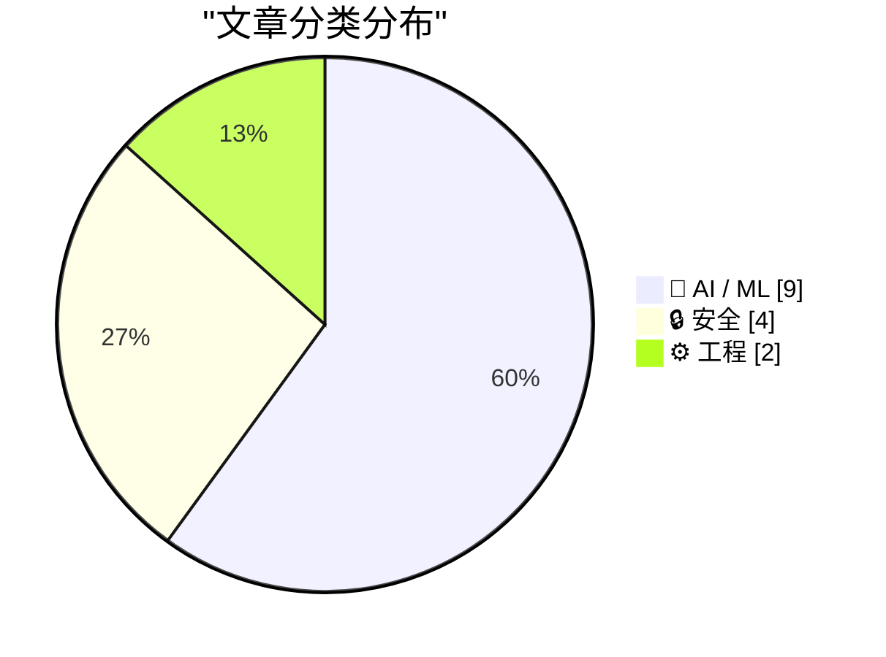
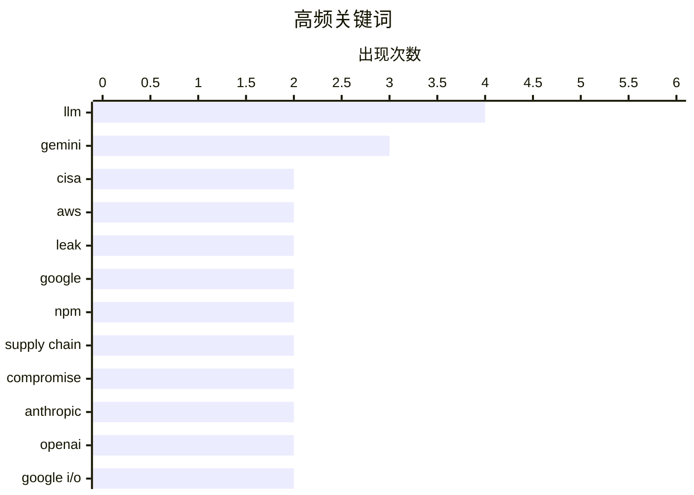

# 📰 AI 资讯每日精选 — 2026-05-20

> 汇聚 140+ 技术博客、X/Twitter、Hacker News、Reddit、Product Hunt、
> Lobste.rs、ClawFeed 日报及 GitHub Trending，经 AI 评分筛选。
>
> **本期内容**：🏆 今日必读 · 🌐 ClawFeed 日报 · 🔥 GitHub Trending · 📂 分类精选 · 🎨 设计与生成式 AI · 📊 数据概览

## 📝 今日看点

今日技术圈聚焦两大主线：AI人才争夺战与供应链安全危机。一方面，顶级研究员Andrej Karpathy选择加入Anthropic而非老东家OpenAI，同时Google发布Gemini 3.5 Flash等新模型，标志着大模型竞争进入“关键成型期”；另一方面，安全事件频发——CISA管理员在GitHub上泄露了高权限AWS GovCloud密钥，314个npm包在22分钟内被植入恶意代码，暴露出从政府机构到开源生态的防护漏洞。AI的加速落地与安全防线的频频失守，构成了今日技术圈最鲜明的反差。

---

## 🏆 今日必读

🥇 **CISA管理员在GitHub上泄露了AWS GovCloud密钥**

[CISA Admin Leaked AWS GovCloud Keys on GitHub](https://krebsonsecurity.com/2026/05/cisa-admin-leaked-aws-govcloud-keys-on-github/) — Hacker News Best · 17 小时前 · 🔒 安全

> 美国网络安全和基础设施安全局（CISA）的一名管理员意外将AWS GovCloud的访问密钥上传到了GitHub公共仓库。这些密钥具有高权限，可访问美国政府专用的云环境。安全研究员在发现后立即通知了CISA，密钥在数小时内被撤销。事件暴露了即使是顶级安全机构也存在内部流程和培训的漏洞，凸显了云密钥管理和自动化扫描的重要性。

💡 **为什么值得读**: 真实发生的顶级安全机构内部泄密案例，对任何涉及云基础设施和密钥管理的团队都有直接警示意义。

🏷️ CISA, AWS, leak, GovCloud

🥈 **Gemini 3.5 Flash**

[Gemini 3.5 Flash](https://blog.google/innovation-and-ai/models-and-research/gemini-models/gemini-3-5/) — Hacker News Best · 7 小时前 · 🤖 AI / ML

> Google发布了新一代模型Gemini 3.5 Flash，主打更快的推理速度和更低的成本。该模型在多项基准测试中性能显著提升，尤其在代码生成和多模态理解方面。Google还推出了配套的API和开发者工具，旨在降低AI应用的门槛。此举被视为Google在AI模型竞赛中对标OpenAI GPT系列和Anthropic Claude系列的最新回应。

💡 **为什么值得读**: Google最新旗舰模型的发布，直接关系到AI开发者的技术选型和成本考量。

🏷️ Gemini, LLM, Google, model

🥉 **Mini Shai-Hulud再次来袭：314个npm包被攻陷**

[Mini Shai-Hulud Strikes Again: 314 npm Packages Compromised](https://safedep.io/mini-shai-hulud-strikes-again-314-npm-packages-compromised/) — Hacker News Best · 20 小时前 · 🔒 安全

> 安全公司披露了一起大规模供应链攻击，314个npm包被植入恶意代码。攻击者通过窃取维护者账号，在22分钟内发布了631个恶意版本。恶意代码会窃取AWS密钥、GitHub令牌、npm凭证、SSH密钥、数据库连接串、Docker和Kubernetes配置等敏感信息。如果检测到Docker套接字暴露，它还能逃逸容器获取宿主机权限。受影响的包包括@antv、echarts-for-react、size-sensor和timeago.js等流行库。

💡 **为什么值得读**: 大规模供应链攻击的详细技术分析，所有使用npm的开发者都应立即检查自己的依赖树。

🏷️ npm, supply chain, malware, compromise

4️⃣ **CISA意外在GitHub上泄露了自己的密钥**

[CISA accidentally leaked their own keys on GitHub](https://www.reddit.com/r/programming/comments/1thze09/cisa_accidentally_leaked_their_own_keys_on_github/) — r/programming · 5 小时前 · 🔒 安全

> 与Index 0事件相同，CISA管理员在GitHub上泄露了AWS GovCloud密钥。该事件在r/programming社区引发热议，讨论焦点集中在安全机构自身的安全实践上。评论者指出，即使是最敏感的环境，人为错误和缺乏自动化防护依然是最大风险。

💡 **为什么值得读**: 社区讨论视角，可以了解开发者对安全机构泄密事件的真实反应和反思。

🏷️ CISA, leak, AWS, GitHub

5️⃣ **著名AI研究员Andrej Karpathy选择Anthropic而非老东家OpenAI，重返前沿LLM研究**

[Prominent AI researcher Andrej Karpathy picks Anthropic over former home OpenAI to get back into frontier LLM research](https://the-decoder.com/prominent-ai-researcher-andrej-karpathy-picks-anthropic-over-former-home-openai-to-get-back-into-frontier-llm-research/) — The Decoder · 7 小时前 · 🤖 AI / ML

> AI领域顶级研究员Andrej Karpathy宣布加入Anthropic。作为OpenAI创始成员和特斯拉Autopilot架构师，他表示希望重返研发一线，并称未来几年是LLM前沿的“关键成型期”。他选择Anthropic而非回归OpenAI，被解读为对OpenAI当前战略方向的一次明确否定，对Anthropic则是重大人才胜利。

💡 **为什么值得读**: AI领域顶级人才流动的风向标事件，直接反映了两家头部AI公司当前战略和文化的差异。

🏷️ Andrej Karpathy, Anthropic, OpenAI, LLM

---

## 🌐 ClawFeed 日报精选

> 来源：[ClawFeed](https://clawfeed.kevinhe.io) — AI 驱动的多源新闻聚合

📅 ClawFeed Daily | 2026-05-19 SGT

聚合源：8 档 4h digest（ids 469 / 470 / 472 / 473 / 474 / 475 / 476 / 477）
窗口：5/19 00:00 → 19:59 SGT（覆盖 5/18 12:00 → 5/19 19:59 跨日完整周一）
scrape stats：feed 27-42 / 4h，bookmarks **累计 34 档 = 8.4 天断流**（scrape bug carryover，hxa-routine issue 必修）

---

## 🔥 当日全场最重要 5 条

1. **Anthropic 一周 plugin → connector → SDK/MCP 并购 → managed sandbox 四档闭环** —— 四档联动 macro anchor：
   - 5/19 08:00：Anthropic 收购 **@stainlessapi**（SDK + MCP server platform）—— "每个 Anthropic SDK 从 API 最早期就由 Stainless 驱动"，**SDK/MCP 工具链并表**。
   - 5/19 12:00 Code with Claude London 现场：**Claude Managed Agents 上线 self-hosted sandboxes（public beta）+ MCP tunnels（research preview）**——企业 agent 在自有 perimeter 内运行 + MCP 隧道穿越，**enterprise perimeter 信任边界 Anthropic 直打**。
   - 前接 5/19 00:00 Mintlify Claude Connector + 5/18 12:00 claude-code-setup orchestrator。

   **Anthropic 一周四层扩张完整闭环**：orchestrator → connector → SDK/MCP 内化 → enterprise sandbox。**MCP 协议生态 = Anthropic 并购标的**（stainlessapi 并表），开发者 tooling 从"用第三方"→"自有资产"。（来自 475 / 476）

2. **xAI 视觉/agent/算力 栈一周 8 档全景闭合 + Cursor 收购叙事** —— 跨档联动：
   - 469：Grok native 视频理解（"upload entire videos to Grok"）
   - 470：Grok Build CLI /imagine + /imagine-video native 首发
   - 472：Grok Build CLI Beta 一句命令 install（SuperGrok Heavy 独占）
   - 473：Grok Imagine Agent mode 4 分钟全 agent 视频生成
   - 477：**mark_k surface Cursor Composer 下一代 = Grok-based，Composer 3 疑似 Grok 1.5T on Colossus 2，"xAI 收购 Cursor done deal 越来越像"，联合 SpaceXAI 10× compute 训练新模型**
   - 477：Grok Build 日更 + beta 测评 "如果质量接近 Opus 4.7 就 steamroll 竞争"

   **xAI 战略四层闭环首次完整图谱**：Colossus 2（算力）→ Grok 1.5T（模型）→ Cursor（IDE）→ Grok Build（agent tool）。video-gen 从 prompt-image → 4 分钟 agent-driven 长视频本周完整闭环。（来自 469 / 470 / 472 / 473 / 477）

3. **Anthropic acquires Stainless + 5/19 08:00 档 4 大 anchor 密度峰值（Cursor Composer 2.5 + Tencent Ardot + Grok Imagine Agent + 翁家翌 Heuristic Learning）** ——
   - **Cursor Composer 2.5 partially trained on Colossus 2，免费用量一周翻倍**——coding-agent 模型层 frontier-coding-model × frontier-compute 直接绑定第一档具体 release。
   - **Tencent Ardot — AI-native design agent platform**，day-zero 通过 MCP 与 CodeBuddy / Cursor / Claude Code 协议互通——**中国 frontier-infra 公司首次正式入场 agent-native UI tooling**，MCP-native 工具生态中国子线。
   - **OpenAI 翁家翌 — Heuristic Learning (HL) 反共识范式**——frontier lab 内部 post-training infra lead 公开提反共识，配一周 reasoning paradigm 扩展 paper 链（Lighthouse / Nexus / OpenDeep / ECHO / MOOSE-Star）。
   - **Manus Scheduled Tasks 2.0 — 上下文延续 scheduling**，agent 时间维度 native 化从"时间触发" → "上下文延续"范式升级。

   （来自 472 / 473 / 474 / 475）

4. **Leopold Aschenbrenner $2.25亿 → $136.8亿 一年多 + AI 数据中心电力持仓三件套公开拆解** —— @web3annie：
   - **Bloom Energy ($BE)**：固体燃料电池在数据中心旁直接发电，不依赖电网
   - **CleanSpark ($CLSK)**：比特币矿工转型，矿场 = 现成电力 + 机房
   - **Riot Platforms ($RIOT)**：矿工转 AI 数据中心
   
   **"AI 算力 = 电力 = 矿工/能源 IPO"** 的资本市场 thesis 60× 回报实证——Leopold Situational Awareness 论具体化为三只 ticker，配 TSMC 三层蛋糕 + NVIDIA Vera @SpaceX + Starship V3 全栈升级 + AI DC 铜缆 → 光纤 deep dive，**算力侧 macro layer 一周最高密度日**。（来自 476）

5. **Web3 cross-chain security incident 一周 4 档联动 + Zylos-dashboard 首发上线** ——
   **Web3 security 一周 4 档**（三档 carryover + 本日新增）：
   - 469 carryover：Verus-Ethereum 桥被盗 $11.5M（伪造 Merkle proof）
   - 472 carryover：Aave $2.3亿 RCA（跨链桥 116,500 假 rsETH 凭空"印"出）
   - 475：Echo Protocol on Monad（admin 私钥单点沦陷，evilcos @SlowMist 现场喊话"没救了"）
   - 新公链 Monad 首波规模化 attack，Curvance 借贷被次生影响

   配 477 **第一方产品 anchor：Zylos-dashboard 登陆 Claude runtime——实时可观测 + ops 控制界面首发**（@CocoAIxyz 发布，session restart / model swap / auto-switch 全覆盖），与同日 managed sandboxes + Stainless SDK 并购构成 "runtime 可见性 + 执行层 + 企业 perimeter" 完整三层。（来自 475 / 477）

---

## 📰 当日核心主题（跨档聚类）

### A. "Anthropic 一周闭环" — dev tooling 从用第三方到并购内化
**8 档跨日连续 anchor 的最密集主线**：
- plugin（claude-code-setup orchestrator，5/18 12:00 carryover）
- connector（Mintlify Claude Connector，5/19 00:00）
- SDK/MCP 内化（Stainless 并购，5/19 08:00）
- enterprise sandbox + MCP tunnel（Code with Claude London，5/19 12:00）
- developer event chain（Code with Claude London → Google I/O 5/20 → Solana Cohort 4 Demo Day）

→ **Anthropic 用四步把 developer tooling 从"开源社区散点" → "官方一键编排 + 企业 perimeter 直打"**，MCP 协议变成 Anthropic 并购战略核心资产。

### B. xAI = 算力 + 模型 + IDE + agent 四层战略闭环
- **算力**：Colossus 2（百万 H100-equivalent）+ SpaceXAI 联合 10× compute
- **模型**：Grok 1.5T 训练中，Composer 3 候选
- **IDE**：Cursor（疑似收购 done deal，Composer 2.5 已部分 Colossus 2 trained）
- **agent tool**：Grok Build 日更 beta，speed 优势对标 Opus 4.7，/imagine + /imagine-video native

→ **xAI 不再只是 "Twitter AI lab"**，是 compute → model → coding IDE → agent pipeline 的纵向一体化战略，与 Anthropic 的 "tooling layer 并购" 路径形成 2026 frontier lab 战略分叉：xAI 纵向 vs Anthropic 横向。

### C. Agent 具身化三层图谱完整（本日首次全层并进）
- **cloud-agent**：Browse.sh（browserbase 开源最大 web-agent skill catalog，474 档）
- **enterprise-agent**：Claude Managed Agents self-hosted sandboxes（476 档）
- **local-desktop-agent**：Agent-desktop GitHub 开源（"开软件/点按钮/填表/跨 App/接管桌面"，477 档）

→ **agent 具身化路径三层并进**，从 SaaS-side 爬虫（Browse.sh）→ 企业 perimeter 内沙盒（managed sandboxes）→ 本地桌面全接管（Agent-desktop），"办公室 8 小时点鼠标白领替代"叙事在本日三层完整出现。

### D. "AI 算力 = 电力" thesis — 资本侧最具体一日
- Leopold $136.8亿持仓拆解（Bloom Energy + CleanSpark + Riot）
- NVIDIA Vera CPU at SpaceX（计算硬件 sovereign 化）
- Starship V3 全栈升级（SpaceX 航天 + Starlink 基础设施）
- AI DC 铜缆 → 光纤（物理层演化技术 macro，474 档）
- TSMC 三层蛋糕（carryover 5/18）

→ **"算力 = 电力 = 矿工/能源 IPO = 60× 回报"**，Leopold Aschenbrenner Situational Awareness 论首次被具体 ticker 映射，是 2026 AI 资本市场 thesis 公开化程度最高的一日。

### E. "vibe coding 实证" 闭环 — 教程层 → 商业产品复刻
- 5/19 12:00：easy-vibe GitHub 12.5k stars（"先让你体验到结果"教程 entry）
- 5/19 16:00 477：**berryxia Cursor + Claude 2小时复刻 $149 Three.js 热带海洋系统**（31 转推爆发，"SaaS 已死，Agent 称王"）
- 配 5/18 多档：Solo + AI 月入 5w / @coreyganim $1M AI business 2026 / Codex 公众号文章 770 篇 10 分钟批量下载

→ **从"会描述需求就能做应用"（教育层）→ "2小时复刻 $149 商业产品"（实操实证层）本日闭环**，vibe coding 叙事从 twitter meme 进入中文圈爆发 viral 节点。

### F. Post-training 范式扩展 — 一周 5 档 paper 链
- NousResearch Lighthouse Attention（5/18 00:00）
- Google Nexus forecasting-as-reasoning（5/18 12:00 carryover）
- OpenDeep parallel-thinking（5/18 16:00 carryover）
- ECHO agent RL env-token prediction（5/19 00:00 472 档）
- **MiroMind MOOSE-Star ICML 2026**（5/19 08:00 475 档）—— "post-train for scientific discovery，物理化学生物跨学科假设生成"，中国大厂（盛大）ICML 首次入场

→ **reasoning paradigm 一周扩展到 5 个维度**：longer-chain → parallel → event-aware → env-token prediction → 科学发现假设生成，post-training 不再只为 math/code。

### G. Tokenization 从 narrative → 实际产品
- AEON $8M（yzilabs 领投）—— agentic economy settlement layer（475 档）
- **PolynomialFi Openstock 上线**——"用 USDC 在 ETH/Base/Solana 订阅港股 IPO"（$877M HKEX listing，$3M cap 10h 窗口）（476 档）
- harpaljadeja："deposits closed already?" —— $3M cap 被秒填信号

→ **tokenization 从 Fink/JPM CEO-level narrative（5/18）→ 具体产品实操（5/19）**，USDC 订阅港股 IPO 是稳定币 native 金融产品最直接 landing。

### H. Frontier lab event chain 三档密集
- Code with Claude London（5/19 当日现场）
- **Google I/O 2026 开播**（5/20 10am PT，Demis + Sundar 双双 on the way）
- Solana Cohort 4 Demo Day NYC（5/20）

→ **5/19-20 是 2026 年 frontier event 密度最高两日**，I/O 2026 内容余波将扩散到 5/20 档。Google Nexus paper 后 I/O 节奏值得重点关注。

---

## 🔖 累计 bookmark 精选

**🚨 Bookmark scrape bug 累计 34 档 = 8.4 天断流**（同 20 条 cache 未刷新）——clawfeed_scrape.js bookmarks fetch path 8 天未修。hxa-routine issue 必开第一优先。

本档**无新 bookmark 信号**（stale 20 条缓存自 5/4 起未刷新，包含 arrakis_ai / turingou wanman.ai #14 / levie Era of Context / cline Kanban / yangyi Google Stitch / oragnes Pika + Skills / idoubicc open-agent-sdk 等），等修复后回补。

---

## 👀 推荐关注汇总（去重，跨 8 档）

**Agent infrastructure / release 源**：
- **@claudeai** — Code with Claude London 现场 release（managed sandboxes + MCP tunnel），Anthropic 一手发布频道
- **@CocoAIxyz / @CharliehuAI** — Zylos-dashboard 首发发布方 + Human-AI ratio "5% framing" 命名学输出
- **@browserbase** — Browse.sh open-source web-agent skill catalog 最大目录第一手
- **@firecrawl** — Agent orchestrator CTF hiring $1M，agent job market 实证 anchor
- **@ManusAI** — Scheduled Tasks 2.0 官方 channel，agent OS 时间维度产品

**xAI / Coding agent 源**：
- **@mark_k** — Cursor Composer 下代 Grok-based + xAI 战略四层图谱 surface，coding-agent 战略分析第一手
- **@MaxForAI** — Tencent Ardot 中文圈第一手 + Anthropic L6+ only 信号 + OpenAI 客户端 build 实验持续输出

**Frontier research 源**：
- **@elliotchen100** — MiroMind MOOSE-Star ICML 2026 中文翻译 + EverMe personal memory 预热
- **@indigox** — 翁家翌 Heuristic Learning 中文首发 + OpenAI post-training frontier research 翻译
- **@novasarc01** + **@DimitrisPapail** — ECHO agent RL frontier paper 实时对话双账号

**Multi-agent / fleet 范式**：
- **@runes_leo** — Hermes control room thesis 中文圈命名学（control plane / runbook / 人工审批边界）
- **@vista8** — 飞书 bot-to-bot @skill 开源，agent-to-agent A2A 中文 IM 首批实操

**Macro / strategy / capital 源**：
- **@web3annie** — Leopold Aschenbrenner 持仓拆解 + AI 数据中心电力路径中文首发
- **@DoveyWan** — Founder identity crisis macro + crypto × AI 跨界 + "回 lab" 趋势数据
- **@shao__meng** — TRAE Top 10 Skills 使用数据 + Vercel Zero + Pixelpoint 持续 surface

**Vibe coding / Solo**：
- **@berryxia** — 2h $149 Three.js 复刻中文圈 vibe coding 传播节点（31 转推）
- **@ajs6888** — 中文圈 agent-desktop 开源发现者 + 桌面接管叙事早期 surface

**Web3 security / DeFi**：
- **@evilcos** — SlowMist，Web3 supply chain incident 跟踪 anchor（Verus + Echo Protocol on Monad）
- **@balance0014** — Aave $2.3亿 RCA 中文圈拆解
- **@PolynomialFi** — Tokenized IPO subscription 实际产品 channel（Openstock）
- **@Kathydotxyz** — Cloudflare-for-agent-identity thesis，agent identity layer 首次命名

提醒：上述未通过浏览器逐一核实是否已关注，**Kevin 操作前请先在 Following 里搜一下**避免重复加关注。

---

## 💤 当日重复噪音模式（跨档结构性）

- **Modi 印度政治系列**（@narendramodi）——8 档全程 carryover（北极星勋章 / 印度文化 / India-Sweden / Norway King / Keralam / "Mother Earth" 哲学段子）第 11 档累积，**Kevin 可直接 mute 该账号**，几乎无 signal 贡献
- **Bitcoin 套牢 / 一句 reply spam**——@xiaomustock / @OliverYeung6 币圈情绪 + "血流成河" 多档，@bankrbot TA bot 自动回复，空帖 spam（@ccy1871 "hi" / @MookieNFT "hello"）
- **罗永浩/段子系列** carryover（@MINGJUNBJ / @liuxiaoling933）+ 日本 MV PR（@asunarococo）
- **quack 打卡圈**（@crico41 / @Soft6161 / @KieranOnBase）——Discord-native 账号 Twitter 段子 noise
- **印度 KOL 跟评**（@KeralaBxOffce / @jobzachariah）+ 印度政治（@bhaumikgowande）多档 carryover
- **Elon 单条段子帖**（stats meme / FSD 小迭代 / GRANDPA's FREE ADVICE）vs 真 anchor 比例 ~3:1

**Signal density 趋势（全日 8 档）**：
- 469（12:00-15:59 5/18）：~12% — 周日下午 noise 88% 历史新高
- 470（16:00-19:59 5/18）：~13% — 周日傍晚 normal
- 472（20:00-23:59 5/18）：~37% — 跨日首段回升
- 473（00:00-03:59 5/19）：~52% — 深夜亚洲/EU 晚段 anchor 峰值
- 474（04:00-07:59 5/19）：~59% — 早班通勤 anchor 集中
- 475（08:00-11:59 5/19）：~52% — 亚洲上午密集
- 476（12:00-15:59 5/19）：~43% — 亚洲下午段噪音回升
- 477（16:00-19:59 5/19）：~35% — 亚洲晚间低质跟评上升

→ **周日遗留 noise 压制前 2 档（12%/13%），工作日清晨 474 档信号密度全日最高（59%）**；全日加权平均 signal density ~38%，高于 5/18 周日均值（~25%）。

---

跨日完整覆盖 5/18 12:00 → 5/19 19:59 SGT（8 档 4h）。**今日全场 macro anchor：Anthropic 一周 dev tooling 闭环 / xAI 四层战略图谱 / agent 具身化三层并进 / AI 算力 = 电力 thesis 资本实证 / vibe coding 实证爆发**——5 件都是 frontier-lab + capital-market 同向高密度信号，工作日回归后 anchor 质量全面回升。**Google I/O 2026 已开播，明日 5/20 档预期 I/O 余波密集 + Solana Cohort 4 Demo Day NYC 同日**。**Bookmarks scrape bug 累计 34 档 = 8.4 天，hxa-routine issue 必开第一优先**。
---

## 🔥 GitHub Trending

> 今日热门开源项目（全语言 + Python）

| # | 项目 | 描述 | ⭐ 总星 | 📈 今日 | 语言 |
|---|------|------|---------|---------|------|
| 1 | [tinyhumansai/openhuman](https://github.com/tinyhumansai/openhuman) 🤖 | Your Personal AI super intelligence. Private, Simple and ... | 21.3k | +3973 | Rust |
| 2 | [Imbad0202/academic-research-skills](https://github.com/Imbad0202/academic-research-skills) 🤖 | Academic Research Skills for Claude Code: research → writ... | 14.2k | +3164 | Python |
| 3 | [multica-ai/andrej-karpathy-skills](https://github.com/multica-ai/andrej-karpathy-skills) 🤖 | A single CLAUDE.md file to improve Claude Code behavior, ... | 138.1k | +1955 | - |
| 4 | [colbymchenry/codegraph](https://github.com/colbymchenry/codegraph) 🤖 | Pre-indexed code knowledge graph for Claude Code, Codex, ... | 6.7k | +1850 | TypeScript |
| 5 | [obra/superpowers](https://github.com/obra/superpowers) | An agentic skills framework & software development method... | 198.4k | +1623 | Shell |
| 6 | [rohitg00/agentmemory](https://github.com/rohitg00/agentmemory) 🤖 | #1 Persistent memory for AI coding agents based on real-w... | 14.2k | +1609 | TypeScript |
| 7 | [CloakHQ/CloakBrowser](https://github.com/CloakHQ/CloakBrowser) | Stealth Chromium that passes every bot detection test. Dr... | 16.6k | +1463 | Python |
| 8 | [msitarzewski/agency-agents](https://github.com/msitarzewski/agency-agents) 🤖 | A complete AI agency at your fingertips - From frontend w... | 101.7k | +1120 | Shell |
| 9 | [HKUDS/CLI-Anything](https://github.com/HKUDS/CLI-Anything) 🤖 | "CLI-Anything: Making ALL Software Agent-Native" -- CLI-H... | 37.7k | +1038 | Python |
| 10 | [ZhuLinsen/daily_stock_analysis](https://github.com/ZhuLinsen/daily_stock_analysis) 🤖 | LLM驱动的 A/H/美股智能分析：多数据源行情 + 实时新闻 + LLM决策仪表盘 + 多渠道推送，零成本定时运... | 37.8k | +891 | Python |
| 11 | [microsoft/ai-agents-for-beginners](https://github.com/microsoft/ai-agents-for-beginners) 🤖 | 12 Lessons to Get Started Building AI Agents | 64.4k | +818 | Jupyter Notebook |
| 12 | [humanlayer/12-factor-agents](https://github.com/humanlayer/12-factor-agents) 🤖 | What are the principles we can use to build LLM-powered s... | 21.2k | +736 | TypeScript |
| 13 | [rtk-ai/rtk](https://github.com/rtk-ai/rtk) 🤖 | CLI proxy that reduces LLM token consumption by 60-90% on... | 50.9k | +704 | Rust |
| 14 | [anthropics/skills](https://github.com/anthropics/skills) 🤖 | Public repository for Agent Skills | 137.7k | +667 | Python |
| 15 | [BigBodyCobain/Shadowbroker](https://github.com/BigBodyCobain/Shadowbroker) 🤖 | Open-source intelligence for the global theater. Track ev... | 8.3k | +580 | Python |

---

## 🤖 AI / ML

### 1. Gemini 3.5 Flash

[Gemini 3.5 Flash](https://blog.google/innovation-and-ai/models-and-research/gemini-models/gemini-3-5/) — **Hacker News Best** · 7 小时前 · ⭐ 27/30

> Google发布了新一代模型Gemini 3.5 Flash，主打更快的推理速度和更低的成本。该模型在多项基准测试中性能显著提升，尤其在代码生成和多模态理解方面。Google还推出了配套的API和开发者工具，旨在降低AI应用的门槛。此举被视为Google在AI模型竞赛中对标OpenAI GPT系列和Anthropic Claude系列的最新回应。

🏷️ Gemini, LLM, Google, model

---

### 2. 著名AI研究员Andrej Karpathy选择Anthropic而非老东家OpenAI，重返前沿LLM研究

[Prominent AI researcher Andrej Karpathy picks Anthropic over former home OpenAI to get back into frontier LLM research](https://the-decoder.com/prominent-ai-researcher-andrej-karpathy-picks-anthropic-over-former-home-openai-to-get-back-into-frontier-llm-research/) — **The Decoder** · 7 小时前 · ⭐ 26/30

> AI领域顶级研究员Andrej Karpathy宣布加入Anthropic。作为OpenAI创始成员和特斯拉Autopilot架构师，他表示希望重返研发一线，并称未来几年是LLM前沿的“关键成型期”。他选择Anthropic而非回归OpenAI，被解读为对OpenAI当前战略方向的一次明确否定，对Anthropic则是重大人才胜利。

🏷️ Andrej Karpathy, Anthropic, OpenAI, LLM

---

### 3. Google I/O发布：新模型、永不眠的云代理和重新设计的Gemini应用

[Google's I/O announcements: new models, a cloud agent that never sleeps, and a redesigned Gemini app](https://the-decoder.com/googles-i-o-announcements-new-models-a-cloud-agent-that-never-sleeps-and-a-redesigned-gemini-app/) — **The Decoder** · 7 小时前 · ⭐ 26/30

> Google在I/O开发者大会上发布了一系列AI产品。核心亮点包括：新模型Gemini 3.5 Flash、多模态模型Gemini Omni，以及一个名为Gemini Spark的7x24小时云端个人代理。Gemini应用也获得了重大界面和功能更新。这些发布标志着Google正全面加速其AI生态布局，从模型层到应用层全面对标竞争对手。

🏷️ Google I/O, Gemini, AI agent, multimodal

---

### 4. 我已加入Anthropic

[I’ve joined Anthropic](https://twitter.com/karpathy/status/2056753169888334312) — **Hacker News Best** · 10 小时前 · ⭐ 26/30

> Andrej Karpathy通过社交媒体宣布加入Anthropic。该消息在Hacker News上获得超过1100分和近500条评论，成为当日最热门话题。评论者普遍认为这是Anthropic在人才争夺战中的重大胜利，并推测Karpathy的加入将极大增强Anthropic在基础模型研究和安全方面的实力。

🏷️ Anthropic, Karpathy, AI, hiring

---

### 5. 我构建了一个工具，实时展示GPT-2在生成每个token时的“思考”过程：3D概念激活图

[I built a tool that shows you what GPT-2 is "thinking" in real-time as it generates 3D graph of concept activations per token [R]](https://www.reddit.com/r/MachineLearning/comments/1thwad9/i_built_a_tool_that_shows_you_what_gpt2_is/) — **r/MachineLearning** · 6 小时前 · ⭐ 25/30

> 作者在机械可解释性领域进行探索，构建了名为AXON的工具。该工具在GPT-2生成每个token时，通过稀疏自编码器（SAE）将残差流分解为人类可理解的特征（如“欧洲地理”、“首都城市”、“法语”），并通过WebSocket实时传输到浏览器，以3D图形展示。这为理解大模型内部工作机制提供了直观的视觉化手段。

🏷️ mechanistic interpretability, GPT-2, sparse autoencoder, visualization

---

### 6. Google I/O 2026 - Livestream

[Google I/O 2026 - Livestream](https://www.reddit.com/r/singularity/comments/1tht500/google_io_2026_livestream/) — **r/singularity** · 8 小时前 · ⭐ 25/30

> <table> <tr><td> <a href="https://www.reddit.com/r/singularity/comments/1tht500/google_io_2026_livestream/">  Introducing OpenAI Guaranteed Capacity: a new offering that enables customers to guarantee long-term access to OpenAI compute.<br><br>We’ve made long-term investments in infrastructure, partnerships, 

🏷️ OpenAI, compute, capacity, enterprise

---

### 8. We’re adding new ways for people to identify AI-generated images and understand where they came from. In addition to C2PA Content Credentials, images...

[We’re adding new ways for people to identify AI-generated images and understand where they came from. In addition to C2PA Content Credentials, images...](https://x.com/OpenAI/status/2056793648571011232) — **𝕏 @OpenAI** · 7 小时前 · ⭐ 25/30

> We’re adding new ways for people to identify AI-generated images and understand where they came from. <br><br>In addition to C2PA Content Credentials, images now also contain a SynthID watermark, and 

🏷️ AI-generated, watermark, C2PA, SynthID

---

### 9. Gemini 3.5 Flash: more expensive, but Google plan to use it for everything

[Gemini 3.5 Flash: more expensive, but Google plan to use it for everything](https://simonwillison.net/2026/May/19/gemini-35-flash/#atom-everything) — **simonwillison.net** · 2 小时前 · ⭐ 24/30

> <p>Today at Google I/O, Google <a href="https://blog.google/innovation-and-ai/models-and-research/gemini-models/gemini-3-5/">released Gemini 3.5 Flash</a>. This one skipped the <code>-preview</code> m

🏷️ Gemini, Google, LLM, release

---

## 🔒 安全

### 10. CISA管理员在GitHub上泄露了AWS GovCloud密钥

[CISA Admin Leaked AWS GovCloud Keys on GitHub](https://krebsonsecurity.com/2026/05/cisa-admin-leaked-aws-govcloud-keys-on-github/) — **Hacker News Best** · 17 小时前 · ⭐ 28/30

> 美国网络安全和基础设施安全局（CISA）的一名管理员意外将AWS GovCloud的访问密钥上传到了GitHub公共仓库。这些密钥具有高权限，可访问美国政府专用的云环境。安全研究员在发现后立即通知了CISA，密钥在数小时内被撤销。事件暴露了即使是顶级安全机构也存在内部流程和培训的漏洞，凸显了云密钥管理和自动化扫描的重要性。

🏷️ CISA, AWS, leak, GovCloud

---

### 11. Mini Shai-Hulud再次来袭：314个npm包被攻陷

[Mini Shai-Hulud Strikes Again: 314 npm Packages Compromised](https://safedep.io/mini-shai-hulud-strikes-again-314-npm-packages-compromised/) — **Hacker News Best** · 20 小时前 · ⭐ 27/30

> 安全公司披露了一起大规模供应链攻击，314个npm包被植入恶意代码。攻击者通过窃取维护者账号，在22分钟内发布了631个恶意版本。恶意代码会窃取AWS密钥、GitHub令牌、npm凭证、SSH密钥、数据库连接串、Docker和Kubernetes配置等敏感信息。如果检测到Docker套接字暴露，它还能逃逸容器获取宿主机权限。受影响的包包括@antv、echarts-for-react、size-sensor和timeago.js等流行库。

🏷️ npm, supply chain, malware, compromise

---

### 12. CISA意外在GitHub上泄露了自己的密钥

[CISA accidentally leaked their own keys on GitHub](https://www.reddit.com/r/programming/comments/1thze09/cisa_accidentally_leaked_their_own_keys_on_github/) — **r/programming** · 5 小时前 · ⭐ 27/30

> 与Index 0事件相同，CISA管理员在GitHub上泄露了AWS GovCloud密钥。该事件在r/programming社区引发热议，讨论焦点集中在安全机构自身的安全实践上。评论者指出，即使是最敏感的环境，人为错误和缺乏自动化防护依然是最大风险。

🏷️ CISA, leak, AWS, GitHub

---

### 13. 314个npm包被攻陷，包括@antv、echarts-for-react、size-sensor、timeago.js

[314 npm packages just got compromised, 271 @antv, echarts-for-react, size-sensor, timeago.js](https://www.reddit.com/r/programming/comments/1thcanx/314_npm_packages_just_got_compromised_271_antv/) — **r/programming** · 20 小时前 · ⭐ 26/30

> atool维护者账号被黑，攻击者在22分钟内向314个包推送了631个恶意版本。恶意代码会窃取AWS密钥、GitHub令牌、npm凭证、SSH密钥、数据库连接串、Docker配置和Kubernetes令牌。如果Docker套接字暴露，恶意代码还能逃逸容器获取特权访问。受影响的包包括@antv、echarts-for-react、size-sensor和timeago.js等广泛使用的库。

🏷️ npm, supply chain, compromise, credentials

---

## ⚙️ 工程

### 14. LLM代理EDIT工具的替代方案

[Alternatives for the EDIT tool of LLM agents](http://antirez.com/news/166) — **antirez.com** · 18 小时前 · ⭐ 25/30

> 作者在开发DS4项目的本地推理代理时，发现当前流行的EDIT工具存在效率问题，因为它强制LLM输出旧版本内容。他探讨了更高效的替代方案，并提出了一个有趣的权衡：使用CRC32校验和来替代完整内容比对，以节省宝贵的token。文章讨论了在token受限的本地推理场景下，如何通过优化工具设计来提升代理性能。

🏷️ LLM, agent, EDIT, CRC32

---

### 15. How we used Quint to find over 10 bugs in SQLite while hardening Turso

[How we used Quint to find over 10 bugs in SQLite while hardening Turso](https://turso.tech/blog/how-we-used-quint-to-find-over-10-bugs-in-sqlite) — **Lobste.rs** · 9 小时前 · ⭐ 25/30

> <p><a href="https://lobste.rs/s/maqmo2/how_we_used_quint_find_over_10_bugs_sqlite">Comments</a></p>

🏷️ SQLite, formal verification, Quint, Turso

---

## 🎨 Design & Generative AI

### 🖼️ 生成式图片

- **[ComfyUI + PyTorch 在 AMD ROCm 7.2 上的安装指南](https://www.reddit.com/r/StableDiffusion/comments/1th9x3x/installing_comfyui_pytorch_for_amd_rocm_72_using/)** — r/StableDiffusion · 22 小时前
  > 使用官方驱动在 AMD ROCm 7.2 上安装 ComfyUI 和 PyTorch 的详细步骤。

- **[Windows 应用：将模型权重常驻内存，加速模型切换](https://www.reddit.com/r/comfyui/comments/1thwwzp/i_built_a_windows_app_that_pins_your_model/)** — r/comfyui · 6 小时前
  > 一款 Windows 应用可将模型权重固定在 RAM 中，避免每次切换时重复加载磁盘。

- **[LumiPic：SDR 转 HDR 的 LoRA 模型，支持 Qwen 与 Kline](https://www.reddit.com/r/StableDiffusion/comments/1thc7m8/lumipic_oumoumads_ltx_lora_fame_sdrhdr_conversion/)** — r/StableDiffusion · 21 小时前
  > Oumoumad 推出 LumiPic LoRA，可将 SDR 图像转换为 HDR，适用于 Qwen 及即将推出的 Kline Base 4/9。

- **[优化 ComfyUI 工作流：集成 Ollama 辅助提示词](https://www.reddit.com/r/comfyui/comments/1ti6qct/ive_worked_to_optimize_this_workflow_and_add/)** — r/comfyui · 16 分钟前
  > 通过优化工作流并接入 Ollama，提升 ComfyUI 中提示词生成的效率与质量。

- **[2026 年 LoRA 训练最佳设置：Ostris AI Toolkit + Z-Image Turbo](https://www.reddit.com/r/StableDiffusion/comments/1th8nk2/2026_best_settings_when_training_lora_using/)** — r/StableDiffusion · 23 小时前
  > 基于 Ostris AI Toolkit 和 Z-Image Turbo，分享训练 LoRA 的最佳参数配置。

- **[TikTok 色彩分析一键 ComfyUI 工作流：生成 Dior 风格时尚板](https://www.reddit.com/r/comfyui/comments/1thorqo/the_tiktok_color_analysis_trend_but_as_a_onenode/)** — r/comfyui · 11 小时前
  > 输入一张肖像，即可自动生成包含最佳配色、肤色、妆容、珠宝和衣橱建议的 4K 时尚板。

- **[ComfyUI 云服务评测：Turbo 模型与多平台对比](https://www.reddit.com/r/comfyui/comments/1thov4r/review_of_comfyui_cloud/)** — r/comfyui · 11 小时前
  > 分享使用 ComfyUI 云服务 4-5 个月的经验，对比 fal.ai、Gemini 和 Grok 的生成效果。

### 🌍 世界模型 / 3D

- **[Agora-1：将《黄金眼》变为四玩家 AI 模拟世界](https://the-decoder.com/agora-1-turns-the-n64-classic-goldeneye-into-a-playable-ai-simulation-for-four-players/)** — The Decoder · 11 小时前
  > Odyssey 发布 Agora-1 世界模型，支持四名玩家在 AI 生成的《黄金眼》场景中实时互动。

- **[Agora-1：可游玩的多智能体世界模型](https://www.producthunt.com/products/odyssey-5)** — Product Hunt · 21 小时前
  > Odyssey 推出的 Agora-1 是一款支持多玩家同时交互的 AI 世界模型。

- **[草莓的高斯泼溅 3D 重建展示](https://superspl.at/scene/84df8849)** — Hacker News Best · 14 小时前
  > 通过高斯泼溅技术对草莓进行 3D 重建，展示高精度场景渲染效果。

### 🎬 生成式视频

- **[LTX2.3 OmniNFT RL-LoRA：视频与音频完美同步](https://www.reddit.com/r/StableDiffusion/comments/1thxd1p/kijai_just_uploaded_ltx23_omninft_rllora_for/)** — r/StableDiffusion · 6 小时前
  > Kijai 上传的 LTX2.3 OmniNFT RL-LoRA 可生成高质量视频与音频，并实现精准唇形同步。

- **[RL LoRA 提升 LTX2.3 视频连贯性与质量](https://www.reddit.com/r/StableDiffusion/comments/1ti3jar/rl_lora_for_ltx23_it_greatly_increases_coherence/)** — r/StableDiffusion · 2 小时前
  > 新 RL LoRA 大幅增强 LTX2.3 视频的连贯性，减少伪影，提升整体画质。

- **[WAN 2.2 多段视频提示词 ComfyUI 节点](https://www.reddit.com/r/comfyui/comments/1ti1n2a/i_made_3_comfyui_nodes_for_wan_22_multisegment/)** — r/comfyui · 3 小时前
  > 为 WAN 2.2 长视频分段生成打造的三款 ComfyUI 节点，自动优化提示词。

- **[ComfyUI 教程：低显存实现 LTX 2.3 逼真 AI 唇形配音](https://www.reddit.com/r/comfyui/comments/1thm9k6/comfyui_tutorial_realistic_ai_lip_sync_dubbing/)** — r/comfyui · 12 小时前
  > 仅需 6GB 显存和 16GB 内存，即可用 LTX 2.3 LORA 完成高质量 AI 唇形同步配音。

- **[Wan2.2 与 LTX2.3：本地视频生成模型对比推荐](https://www.reddit.com/r/comfyui/comments/1thhqdl/wan22_vs_ltx23_which_video_generation_model_do/)** — r/comfyui · 16 小时前
  > 在 RTX 3060 12GB 上对比 Wan2.2 和 LTX2.3，探讨哪款视频生成模型更适合本地运行。

---

## 📊 数据概览

| 扫描源 | 抓取文章 | 时间范围 | 精选 |
|:---:|:---:|:---:|:---:|
| 116/140 | 5369 篇 → 228 篇 | 24h | **15 篇** |

### 分类分布



### 高频关键词



<details>
<summary>📈 纯文本关键词图（终端友好）</summary>

```
llm          │ ████████████████████ 4
gemini       │ ███████████████░░░░░ 3
cisa         │ ██████████░░░░░░░░░░ 2
aws          │ ██████████░░░░░░░░░░ 2
leak         │ ██████████░░░░░░░░░░ 2
google       │ ██████████░░░░░░░░░░ 2
npm          │ ██████████░░░░░░░░░░ 2
supply chain │ ██████████░░░░░░░░░░ 2
compromise   │ ██████████░░░░░░░░░░ 2
anthropic    │ ██████████░░░░░░░░░░ 2
```

</details>

### 🏷️ 话题标签

**llm**(4) · **gemini**(3) · **cisa**(2) · aws(2) · leak(2) · google(2) · npm(2) · supply chain(2) · compromise(2) · anthropic(2) · openai(2) · google i/o(2) · govcloud(1) · model(1) · malware(1) · github(1) · andrej karpathy(1) · ai agent(1) · multimodal(1) · karpathy(1)

---

*生成于 2026-05-20 01:38 | 汇聚 140 个技术博客、X/Twitter、Hacker News、Reddit、Product Hunt、Lobste.rs、ClawFeed 日报及 GitHub Trending，经 AI 评分筛选出 Top 15 精华内容*
