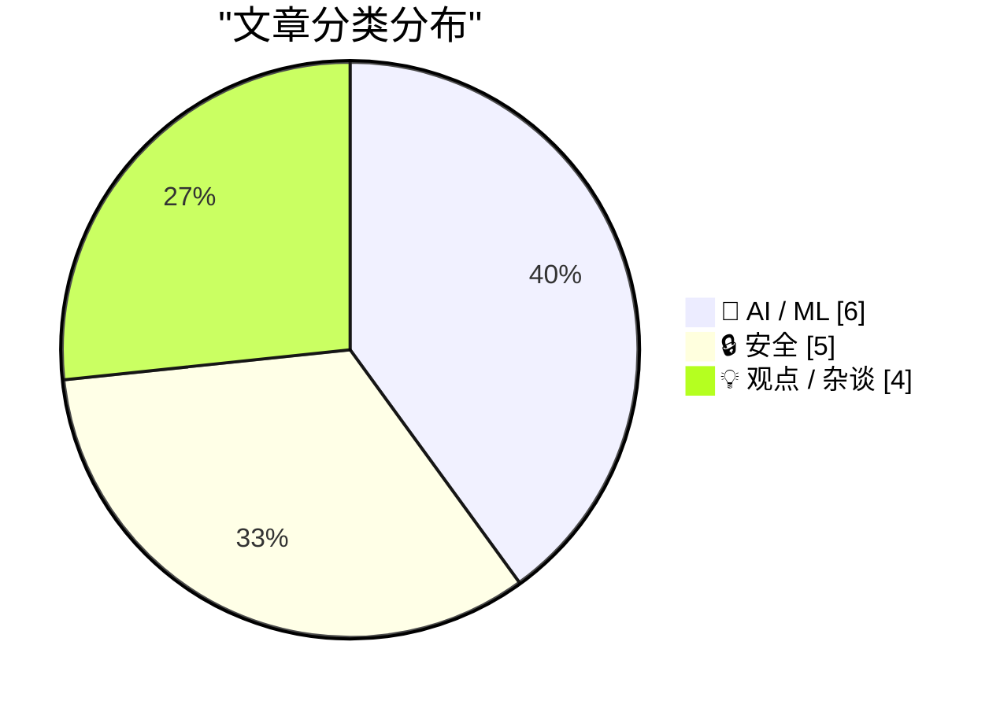
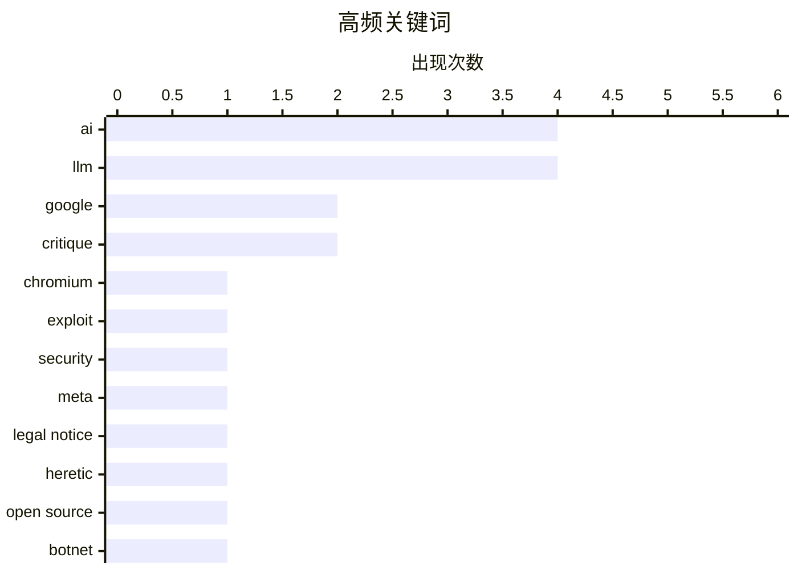

# 📰 AI 资讯每日精选 — 2026-05-22

> 汇聚 140+ 技术博客、X/Twitter、Hacker News、Reddit、Product Hunt、
> Lobste.rs、ClawFeed 日报及 GitHub Trending，经 AI 评分筛选。
>
> **本期内容**：🏆 今日必读 · 🌐 ClawFeed 日报 · 🔥 GitHub Trending · 📂 分类精选 · 🎨 设计与生成式 AI · 📊 数据概览

## 📝 今日看点

今日技术圈的核心议题集中在两大方向：一是安全领域的连锁危机，从谷歌主动公开Chromium高危漏洞利用代码，到大规模CI/CD自动化后门攻击（Megalodon）在数小时内污染数千个GitHub仓库，再到物联网僵尸网络控制者被捕，表明攻击面正从终端向开发供应链全面蔓延；二是AI能力的突破与争议并行，OpenAI模型首次推翻数学界近80年未解猜想登上顶级期刊，同时Anthropic被质疑通过会计手段制造“盈利”假象，而关于AI是否构成“大规模未经授权的抄袭”的伦理争论也愈发激烈。

---

## 🏆 今日必读

🥇 **谷歌发布漏洞利用代码，威胁数百万Chromium用户**

[Google publishes exploit code threatening millions of Chromium users](https://www.reddit.com/r/programming/comments/1tj77ww/google_publishes_exploit_code_threatening/) — r/programming · 22 小时前 · 🔒 安全

> 谷歌安全团队公开发布了针对Chromium内核的漏洞利用代码，该漏洞影响数百万Chrome及基于Chromium的浏览器用户。该漏洞允许攻击者绕过浏览器的沙箱保护机制，在用户设备上执行任意代码。谷歌在发布补丁后立即公开了PoC代码，这一做法引发了安全社区关于“负责任的披露”原则的激烈争论。文章指出，虽然此举旨在推动用户尽快更新，但也为恶意攻击者提供了现成的攻击武器。核心结论是：浏览器厂商在公开漏洞细节时，需要在透明度和用户安全之间找到更谨慎的平衡。

💡 **为什么值得读**: 了解谷歌这一争议性安全策略背后的技术细节与行业影响，对评估自身浏览器安全风险至关重要。

🏷️ Chromium, exploit, security, Google

🥈 **Heretic项目收到Meta的法律通知**

[Heretic has been served a legal notice by Meta, Inc.](https://www.reddit.com/r/LocalLLaMA/comments/1tjmvx6/heretic_has_been_served_a_legal_notice_by_meta_inc/) — r/LocalLLaMA · 10 小时前 · 🔒 安全

> 开源项目Heretic的维护者收到了Meta委托法律服务机构发送的正式法律通知。Heretic项目声称其所有活动均完全合规，但未透露通知的具体内容。该事件发生在Meta持续打击第三方访问其平台数据的背景下，此前Meta已对多个类似项目采取法律行动。文章暗示，Meta可能指控Heretic违反了其服务条款或涉及数据抓取行为。核心观点是：大型科技公司正通过法律手段收紧对平台数据的控制，开源和自由软件项目面临日益严峻的法律风险。

💡 **为什么值得读**: 对于关注开源合规、数据抓取法律边界以及科技巨头与社区项目冲突的读者，这是最新的标志性案例。

🏷️ Meta, legal notice, Heretic, open source

🥉 **涉嫌Kimwolf僵尸网络控制者“Dort”在美加两国被捕并被起诉**

[Alleged Kimwolf Botmaster ‘Dort’ Arrested, Charged in U.S. and Canada](https://krebsonsecurity.com/2026/05/alleged-kimwolf-botmaster-dort-arrested-charged-in-u-s-and-canada/) — krebsonsecurity.com · 3 小时前 · 🔒 安全

> 加拿大警方逮捕了一名23岁的渥太华男子，指控其构建并运营了名为Kimwolf的物联网僵尸网络。该僵尸网络在过去六个月内感染了数百万台设备，用于发动一系列大规模分布式拒绝服务（DDoS）攻击。KrebsOnSecurity在2026年2月公开指认了该嫌疑人，随后其发起了针对作者和一名安全研究员的DDoS、人肉搜索和报假警（swatting）报复行动。该嫌疑人目前在美国和加拿大均面临刑事指控。核心结论是：执法机构对大型僵尸网络运营者的跨国追捕正在加速，但报复性攻击也凸显了安全研究人员面临的人身风险。

💡 **为什么值得读**: 详细还原了从发现、公开指认到跨国抓捕的完整安全事件链条，对理解物联网安全威胁和网络犯罪执法有直接参考价值。

🏷️ botnet, DDoS, IoT, arrest

4️⃣ **Anthropic的“盈利”骗局**

[Anthropic's "Profitability" Swindle](https://www.wheresyoured.at/anthropics-profitability-swindle/) — wheresyoured.at · 8 小时前 · 🤖 AI / ML

> 《华尔街日报》报道称Anthropic即将实现首个盈利季度，预计第二季度营收将翻倍至109亿美元，并实现EBITDA盈利。文章作者对此提出强烈质疑，认为这种“盈利”是通过会计手段和烧钱换增长的模式制造的假象。作者指出，Anthropic的巨额营收增长主要来自微软和亚马逊等战略投资者的云服务承诺和算力支持，而非可持续的独立商业收入。核心观点是：AI初创公司所谓的“盈利”故事，本质上是资本游戏和财务包装，投资者和公众不应被表面数字所迷惑。

💡 **为什么值得读**: 深度拆解了AI明星公司Anthropic的财务数据，揭示了营收暴增背后的资本运作真相，对理解AI行业泡沫有重要警示意义。

🏷️ Anthropic, profitability, AI, finance

5️⃣ **首个登上顶级数学期刊的AI证明诞生，这不会是最后一个**

[The first AI proof worthy of math's top journal landed and it won't be the last](https://the-decoder.com/openai-shifts-the-boundary-of-automated-reasoning-with-a-milestone-in-ai-mathematics-that-experts-are-now-unpacking/) — The Decoder · 9 小时前 · 🤖 AI / ML

> OpenAI的一个推理模型成功推翻了一个自1946年以来悬而未决的数学家保罗·埃尔德什关于单位距离几何的猜想，过程中使用了专家们未曾预料到的代数数论工具。菲尔兹奖得主蒂莫西·高尔斯称其为“AI数学的里程碑”，并警告“人类可能已经进入了一个在解决数学问题上难以与AI竞争的时期”。该成果已被顶级数学期刊接受发表，标志着AI在数学研究领域从辅助工具向独立发现者的转变。核心结论是：AI已经具备了在纯数学领域做出突破性贡献的能力，数学研究的范式正在被根本性地改变。

💡 **为什么值得读**: 这是AI首次在顶级数学期刊上发表原创性研究成果，标志着AI推理能力的质变，对数学界和AI领域都具有里程碑意义。

🏷️ OpenAI, mathematics, reasoning, breakthrough

---

## 🔥 GitHub Trending

> 今日热门开源项目（全语言 + Python）

| # | 项目 | 描述 | ⭐ 总星 | 📈 今日 | 语言 |
|---|------|------|---------|---------|------|
| 1 | [colbymchenry/codegraph](https://github.com/colbymchenry/codegraph) 🤖 | Pre-indexed code knowledge graph for Claude Code, Codex, ... | 13.6k | +4294 | TypeScript |
| 2 | [multica-ai/andrej-karpathy-skills](https://github.com/multica-ai/andrej-karpathy-skills) 🤖 | A single CLAUDE.md file to improve Claude Code behavior, ... | 143.3k | +2614 | - |
| 3 | [Imbad0202/academic-research-skills](https://github.com/Imbad0202/academic-research-skills) 🤖 | Academic Research Skills for Claude Code: research → writ... | 18.2k | +2579 | Python |
| 4 | [NousResearch/hermes-agent](https://github.com/NousResearch/hermes-agent) 🤖 | The agent that grows with you | 161.6k | +2056 | Python |
| 5 | [obra/superpowers](https://github.com/obra/superpowers) | An agentic skills framework & software development method... | 201.6k | +1576 | Shell |
| 6 | [rohitg00/ai-engineering-from-scratch](https://github.com/rohitg00/ai-engineering-from-scratch) 🤖 | Learn it. Build it. Ship it for others. | 10.8k | +1333 | Python |
| 7 | [truelockmc/streambert](https://github.com/truelockmc/streambert) | A cross-platform Electron Desktop App to stream and downl... | 4.0k | +1094 | JavaScript |
| 8 | [msitarzewski/agency-agents](https://github.com/msitarzewski/agency-agents) 🤖 | A complete AI agency at your fingertips - From frontend w... | 103.7k | +1018 | Shell |
| 9 | [trimstray/the-book-of-secret-knowledge](https://github.com/trimstray/the-book-of-secret-knowledge) | A collection of inspiring lists, manuals, cheatsheets, bl... | 222.5k | +756 | - |
| 10 | [rmyndharis/OpenWA](https://github.com/rmyndharis/OpenWA) | Free, Open Source, Self-Hosted WhatsApp API Gateway | 5.4k | +730 | TypeScript |
| 11 | [anthropics/claude-plugins-official](https://github.com/anthropics/claude-plugins-official) 🤖 | Official, Anthropic-managed directory of high quality Cla... | 22.5k | +682 | Python |
| 12 | [Lum1104/Understand-Anything](https://github.com/Lum1104/Understand-Anything) 🤖 | Graphs that teach &gt; graphs that impress. Turn any code... | 16.7k | +666 | TypeScript |
| 13 | [HKUDS/CLI-Anything](https://github.com/HKUDS/CLI-Anything) 🤖 | "CLI-Anything: Making ALL Software Agent-Native" -- CLI-H... | 39.1k | +656 | Python |
| 14 | [HKUDS/ViMax](https://github.com/HKUDS/ViMax) | "ViMax: Agentic Video Generation (Director, Screenwriter,... | 6.5k | +537 | Python |
| 15 | [multica-ai/multica](https://github.com/multica-ai/multica) 🤖 | The open-source managed agents platform. Turn coding agen... | 30.8k | +534 | Go |

---

## 🤖 AI / ML

### 1. Anthropic的“盈利”骗局

[Anthropic's "Profitability" Swindle](https://www.wheresyoured.at/anthropics-profitability-swindle/) — **wheresyoured.at** · 8 小时前 · ⭐ 26/30

> 《华尔街日报》报道称Anthropic即将实现首个盈利季度，预计第二季度营收将翻倍至109亿美元，并实现EBITDA盈利。文章作者对此提出强烈质疑，认为这种“盈利”是通过会计手段和烧钱换增长的模式制造的假象。作者指出，Anthropic的巨额营收增长主要来自微软和亚马逊等战略投资者的云服务承诺和算力支持，而非可持续的独立商业收入。核心观点是：AI初创公司所谓的“盈利”故事，本质上是资本游戏和财务包装，投资者和公众不应被表面数字所迷惑。

🏷️ Anthropic, profitability, AI, finance

---

### 2. 首个登上顶级数学期刊的AI证明诞生，这不会是最后一个

[The first AI proof worthy of math's top journal landed and it won't be the last](https://the-decoder.com/openai-shifts-the-boundary-of-automated-reasoning-with-a-milestone-in-ai-mathematics-that-experts-are-now-unpacking/) — **The Decoder** · 9 小时前 · ⭐ 26/30

> OpenAI的一个推理模型成功推翻了一个自1946年以来悬而未决的数学家保罗·埃尔德什关于单位距离几何的猜想，过程中使用了专家们未曾预料到的代数数论工具。菲尔兹奖得主蒂莫西·高尔斯称其为“AI数学的里程碑”，并警告“人类可能已经进入了一个在解决数学问题上难以与AI竞争的时期”。该成果已被顶级数学期刊接受发表，标志着AI在数学研究领域从辅助工具向独立发现者的转变。核心结论是：AI已经具备了在纯数学领域做出突破性贡献的能力，数学研究的范式正在被根本性地改变。

🏷️ OpenAI, mathematics, reasoning, breakthrough

---

### 3. Qwen 3.7 Max在SWE-Bench Pro上取得60.6%的分数

[Qwen 3.7 Max scores 60.6% on SWE-Bench Pro](https://www.reddit.com/r/singularity/comments/1tj95nl/qwen_37_max_scores_606_on_swebench_pro/) — **r/singularity** · 21 小时前 · ⭐ 26/30

> 阿里通义千问团队发布的最新模型Qwen 3.7 Max在SWE-Bench Pro基准测试中取得了60.6%的得分。SWE-Bench Pro是评估AI模型解决真实世界软件工程问题能力的权威基准，包含从GitHub issue到PR修复的完整任务。该分数显著超越了此前公开的最佳成绩，标志着AI在自动化编程和代码修复能力上的又一次重大突破。核心结论是：Qwen 3.7 Max在复杂软件工程任务上的表现，已经接近甚至超越了部分初级开发工程师的水平。

🏷️ Qwen, SWE-Bench, LLM, coding

---

### 4. Masked Diffusion Language Models are Strong and Steerable Text-Based World Models for Agentic RL [R]

[Masked Diffusion Language Models are Strong and Steerable Text-Based World Models for Agentic RL [R]](https://www.reddit.com/r/MachineLearning/comments/1tj9tna/masked_diffusion_language_models_are_strong_and/) — **r/MachineLearning** · 21 小时前 · ⭐ 25/30

> <!-- SC_OFF --><div class="md"><p>Autoregressive LLM world models factorize next-state generation left-to-right, preventing them from conditioning on globally interdependent anchors (tool schemas, tra

🏷️ diffusion, world model, RL, steerable

---

### 5. Honesty in a small model drops from 35% to 0% by changing the tone of the prompt. Sharing the findings.

[Honesty in a small model drops from 35% to 0% by changing the tone of the prompt. Sharing the findings.](https://www.reddit.com/r/LocalLLaMA/comments/1tjmswd/honesty_in_a_small_model_drops_from_35_to_0_by/) — **r/LocalLLaMA** · 10 小时前 · ⭐ 25/30

> <!-- SC_OFF --><div class="md"><p>My paper got published today at Arxiv. It raises questions about how language models behave when the framing of a request shifts. </p> <p>Small open-source AI models 

🏷️ honesty, prompt-engineering, small-model, arXiv

---

### 6. Interesting paper advocates for quantized prefilling and precise decoding

[Interesting paper advocates for quantized prefilling and precise decoding](https://www.reddit.com/r/LocalLLaMA/comments/1tjvl4h/interesting_paper_advocates_for_quantized/) — **r/LocalLLaMA** · 5 小时前 · ⭐ 25/30

> <table> <tr><td> <a href="https://www.reddit.com/r/LocalLLaMA/comments/1tjvl4h/interesting_paper_advocates_for_quantized/">  谷歌安全团队公开发布了针对Chromium内核的漏洞利用代码，该漏洞影响数百万Chrome及基于Chromium的浏览器用户。该漏洞允许攻击者绕过浏览器的沙箱保护机制，在用户设备上执行任意代码。谷歌在发布补丁后立即公开了PoC代码，这一做法引发了安全社区关于“负责任的披露”原则的激烈争论。文章指出，虽然此举旨在推动用户尽快更新，但也为恶意攻击者提供了现成的攻击武器。核心结论是：浏览器厂商在公开漏洞细节时，需要在透明度和用户安全之间找到更谨慎的平衡。

🏷️ Chromium, exploit, security, Google

---

### 8. Heretic项目收到Meta的法律通知

[Heretic has been served a legal notice by Meta, Inc.](https://www.reddit.com/r/LocalLLaMA/comments/1tjmvx6/heretic_has_been_served_a_legal_notice_by_meta_inc/) — **r/LocalLLaMA** · 10 小时前 · ⭐ 27/30

> 开源项目Heretic的维护者收到了Meta委托法律服务机构发送的正式法律通知。Heretic项目声称其所有活动均完全合规，但未透露通知的具体内容。该事件发生在Meta持续打击第三方访问其平台数据的背景下，此前Meta已对多个类似项目采取法律行动。文章暗示，Meta可能指控Heretic违反了其服务条款或涉及数据抓取行为。核心观点是：大型科技公司正通过法律手段收紧对平台数据的控制，开源和自由软件项目面临日益严峻的法律风险。

🏷️ Meta, legal notice, Heretic, open source

---

### 9. 涉嫌Kimwolf僵尸网络控制者“Dort”在美加两国被捕并被起诉

[Alleged Kimwolf Botmaster ‘Dort’ Arrested, Charged in U.S. and Canada](https://krebsonsecurity.com/2026/05/alleged-kimwolf-botmaster-dort-arrested-charged-in-u-s-and-canada/) — **krebsonsecurity.com** · 3 小时前 · ⭐ 26/30

> 加拿大警方逮捕了一名23岁的渥太华男子，指控其构建并运营了名为Kimwolf的物联网僵尸网络。该僵尸网络在过去六个月内感染了数百万台设备，用于发动一系列大规模分布式拒绝服务（DDoS）攻击。KrebsOnSecurity在2026年2月公开指认了该嫌疑人，随后其发起了针对作者和一名安全研究员的DDoS、人肉搜索和报假警（swatting）报复行动。该嫌疑人目前在美国和加拿大均面临刑事指控。核心结论是：执法机构对大型僵尸网络运营者的跨国追捕正在加速，但报复性攻击也凸显了安全研究人员面临的人身风险。

🏷️ botnet, DDoS, IoT, arrest

---

### 10. 通过CI工作流大规模后门GitHub仓库（Megalodon攻击）

[mass github repo backdooring via CI workflows(Megalodon)](https://www.reddit.com/r/programming/comments/1tjro3p/mass_github_repo_backdooring_via_ci/) — **r/programming** · 8 小时前 · ⭐ 26/30

> 一场自动化攻击活动在短短六小时内向5561个GitHub仓库推送了超过5700个恶意提交。攻击者使用一次性账号和伪造的提交作者名（如build-bot、auto-ci、pipeline-bot），提交信息伪装成“ci: add build optimization step”等常规CI优化内容，与日常CI噪音几乎无法区分。这些恶意提交在CI工作流中植入了后门，实现了对受影响仓库的供应链攻击。核心结论是：这种高度自动化和伪装的攻击方式，使得传统的基于提交行为异常的检测手段完全失效，开源软件供应链安全面临前所未有的挑战。

🏷️ GitHub, CI/CD, supply chain, backdoor

---

### 11. US Cyber Command races to deploy AI on top-secret networks

[US Cyber Command races to deploy AI on top-secret networks](https://the-decoder.com/us-cyber-command-races-to-deploy-ai-on-top-secret-networks/) — **The Decoder** · 10 小时前 · ⭐ 25/30

> US Cyber Command has launched a task force to run AI models from OpenAI, Google, and others on the most classified Pentagon and NSA networks. The trigger: AI systems like Anthropic's Claude Mythos can

🏷️ AI, cyber command, vulnerability, national security

---

## 💡 观点 / 杂谈

### 12. 谷歌的“反重力”诱饵调包计

[Google's Antigravity bait and switch](https://www.0xsid.com/blog/antigravity-bait-n-switch) — **Hacker News Best** · 11 小时前 · ⭐ 26/30

> 文章揭露了谷歌在云服务产品中使用的“诱饵调包”营销策略。谷歌通过宣传极具吸引力的“反重力”低价或免费服务（如特定云功能或API）来吸引开发者，但在用户投入时间和资源进行集成后，突然宣布该服务即将关闭或大幅涨价，迫使客户迁移到更昂贵的替代方案。作者列举了多个谷歌产品（如Google Reader、Stadia、特定云API）的类似案例，指出这是一种系统性的商业行为。核心观点是：开发者不应信任谷歌的长期产品承诺，在技术选型时必须考虑供应商锁定和业务连续性风险。

🏷️ Google, antigravity, bait and switch, critique

---

### 13. AI只是规模更大的未经授权的抄袭

[AI is just unauthorised plagiarism at a bigger scale](https://axelk.ee/ai-is-just-unauthorised-plagiarism-at-a-bigger-scale/) — **Hacker News Best** · 11 小时前 · ⭐ 26/30

> 文章从法律和伦理角度论证，当前主流的大语言模型本质上是在进行“规模更大的未经授权的抄袭”。作者认为，AI模型在未经原创作者许可、未支付报酬的情况下，抓取并学习了海量受版权保护的内容，然后通过统计重组生成“新”内容，这不符合合理使用的定义。文章反驳了“AI学习与人类学习无异”的观点，指出AI的复制和重组规模与人类完全不同，且直接替代了原创者的市场。核心结论是：AI公司不应享有使用他人作品进行商业开发的特殊豁免权，现行版权法必须得到严格执行。

🏷️ AI, plagiarism, copyright, ethics

---

### 14. 关于AI辅助编程的十二种错误认知

[Twelve Ways to Be Wrong About AI-Assisted Coding](https://third-bit.com/2026/05/20/twelve-ways-to-be-wrong/) — **Lobste.rs** · 22 小时前 · ⭐ 26/30

> 文章系统性地列举并驳斥了关于AI辅助编程的十二种常见错误认知，例如“AI会取代所有程序员”、“AI生成的代码无需审查”、“AI能理解业务逻辑”等。作者从实际工程经验出发，分析了每种错误认知背后的思维陷阱及其可能导致的工程灾难。文章强调，AI是强大的工具，但过度依赖或错误理解其能力边界会带来严重的代码质量和安全隐患。核心观点是：只有清醒认识到AI的局限性和正确使用方式，才能真正发挥其在软件开发中的价值。

🏷️ AI-assisted coding, LLM, software development

---

### 15. Throwing AI-generated walls of text into conversations

[Throwing AI-generated walls of text into conversations](https://noslopgrenade.com/) — **Hacker News Best** · 16 小时前 · ⭐ 25/30

> Article URL: https://noslopgrenade.com/
Comments URL: https://news.ycombinator.com/item?id=48219992
Points: 485
# Comments: 288

🏷️ AI, LLM, communication, critique

---

## 🎨 Design & Generative AI

### 🖼️ 生成式图片

- **[ComfyUI模型加载速度大幅提升](https://www.reddit.com/r/comfyui/comments/1tjf3e7/big_model_loading_time_speedup_update_guys/)** — r/comfyui · 16 小时前
  > 通过多线程磁盘加载优化，显著缩短ComfyUI中大模型的加载时间。

- **[Stable Audio 3.0 登陆ComfyUI：从音效到长音乐曲](https://www.reddit.com/r/comfyui/comments/1tj7afx/stable_audio_30_day0_support_in_comfyui_from/)** — r/comfyui · 22 小时前
  > ComfyUI现已支持Stable Audio 3.0，可生成从短音效到更长、更富音乐性的音频轨道。

- **[Krea 2 即将开源](https://www.reddit.com/r/StableDiffusion/comments/1tjnwgo/krea_2_will_be_open_source/)** — r/StableDiffusion · 10 小时前
  > AI图像生成工具Krea 2宣布将开源，引发社区关注。

- **[无需训练LoRA，用参考图控制FLUX.2](https://www.reddit.com/r/StableDiffusion/comments/1tjqssg/control_flux2_with_reference_images_instead_of/)** — r/StableDiffusion · 8 小时前
  > 演示如何通过参考图像直接控制FLUX.2生成结果，省去LoRA训练步骤。

- **[Flux 2 Klein 工作流分享](https://www.reddit.com/r/comfyui/comments/1tji1c9/flux_2_klein_destiled_my_workflow_following/)** — r/comfyui · 13 小时前
  > 应网友要求，分享Flux 2 Klein模型的高效工作流配置。

- **[ComfyUI新增可视化折叠功能，整理大型工作流](https://www.reddit.com/r/StableDiffusion/comments/1tjca6s/i_added_a_visual_fold_feature_for_organizing/)** — r/StableDiffusion · 18 小时前
  > 为ComfyUI添加视觉折叠功能，帮助用户组织和管理复杂的大型工作流。

- **[ComfyUI插件生态乱象：需要自己的警察](https://www.reddit.com/r/comfyui/comments/1tjt784/this_program_needs_its_own_police_force/)** — r/comfyui · 7 小时前
  > 用户吐槽ComfyUI第三方插件质量参差不齐，导致程序崩溃和系统混乱。

- **[RTX 5090用户也推荐：Anima Base小模型惊喜不断](https://www.reddit.com/r/StableDiffusion/comments/1tjymfl/as_someone_who_can_already_run_most_of_the_larger/)** — r/StableDiffusion · 4 小时前
  > 尽管参数仅2B，Anima Base模型在高质量硬件上仍表现出色，值得一试。

- **[Dramabox本地运行更简单：独立应用+LoRA工具](https://www.reddit.com/r/StableDiffusion/comments/1tjpnrz/i_made_dramabox_easier_to_run_locally_with_a/)** — r/StableDiffusion · 9 小时前
  > 推出Dramabox的独立本地运行应用，内置LoRA工具，降低使用门槛。

- **[Gemma 4 + ComfyUI新节点：提示词输入更简单](https://www.reddit.com/r/comfyui/comments/1tjneuj/gemma_4_new_comfyui_nodes_that_make_prompting/)** — r/comfyui · 10 小时前
  > 介绍Gemma 4模型及ComfyUI新节点，让提示词编写更轻松高效。

- **[Ernie-Image提示词增强器：3804个样本训练](https://www.reddit.com/r/comfyui/comments/1tjh8ul/ernieimage_prompt_enhancer/)** — r/comfyui · 14 小时前
  > 基于3804个详细样本训练的Ernie-Image提示词增强器，提升图像生成质量。

- **[SageAttention当前评价如何？](https://www.reddit.com/r/comfyui/comments/1tjojvj/whats_the_current_take_on_sageattention/)** — r/comfyui · 9 小时前
  > 用户讨论SageAttention在ComfyUI中的兼容性和实际加速效果，存在安装风险。

- **[SAM3加入ComfyUI-Angelo：采样/修复/精炼一体](https://www.reddit.com/r/StableDiffusion/comments/1tjp4ir/sam3_added_to_comfyuiangelo/)** — r/StableDiffusion · 9 小时前
  > SAM3模型现已集成到ComfyUI-Angelo节点中，支持采样、修复和精炼功能。

### 🌍 世界模型 / 3D

- **[掩码扩散语言模型：强可控的文本世界模型](https://www.reddit.com/r/MachineLearning/comments/1tj9tna/masked_diffusion_language_models_are_strong_and/)** — r/MachineLearning · 21 小时前
  > 提出一种基于掩码扩散的语言模型，用于强化学习中的文本世界建模，克服自回归模型对全局依赖的局限性。

- **[单图→白模→纹理3D角色：ComfyUI+Hunyuan3D-2完整流程](https://www.reddit.com/r/comfyui/comments/1tjkxd8/single_photo_white_mesh_textured_3d_character/)** — r/comfyui · 11 小时前
  > 展示从单张照片生成白色网格模型，再到带纹理3D角色的完整ComfyUI管道，并分享调试中的Bug。

---

## 📊 数据概览

| 扫描源 | 抓取文章 | 时间范围 | 精选 |
|:---:|:---:|:---:|:---:|
| 118/140 | 5418 篇 → 231 篇 | 24h | **15 篇** |

### 分类分布



### 高频关键词



<details>
<summary>📈 纯文本关键词图（终端友好）</summary>

```
ai           │ ████████████████████ 4
llm          │ ████████████████████ 4
google       │ ██████████░░░░░░░░░░ 2
critique     │ ██████████░░░░░░░░░░ 2
chromium     │ █████░░░░░░░░░░░░░░░ 1
exploit      │ █████░░░░░░░░░░░░░░░ 1
security     │ █████░░░░░░░░░░░░░░░ 1
meta         │ █████░░░░░░░░░░░░░░░ 1
legal notice │ █████░░░░░░░░░░░░░░░ 1
heretic      │ █████░░░░░░░░░░░░░░░ 1
```

</details>

### 🏷️ 话题标签

**ai**(4) · **llm**(4) · **google**(2) · critique(2) · chromium(1) · exploit(1) · security(1) · meta(1) · legal notice(1) · heretic(1) · open source(1) · botnet(1) · ddos(1) · iot(1) · arrest(1) · anthropic(1) · profitability(1) · finance(1) · openai(1) · mathematics(1)

---

*生成于 2026-05-22 01:37 | 汇聚 140 个技术博客、X/Twitter、Hacker News、Reddit、Product Hunt、Lobste.rs、ClawFeed 日报及 GitHub Trending，经 AI 评分筛选出 Top 15 精华内容*
