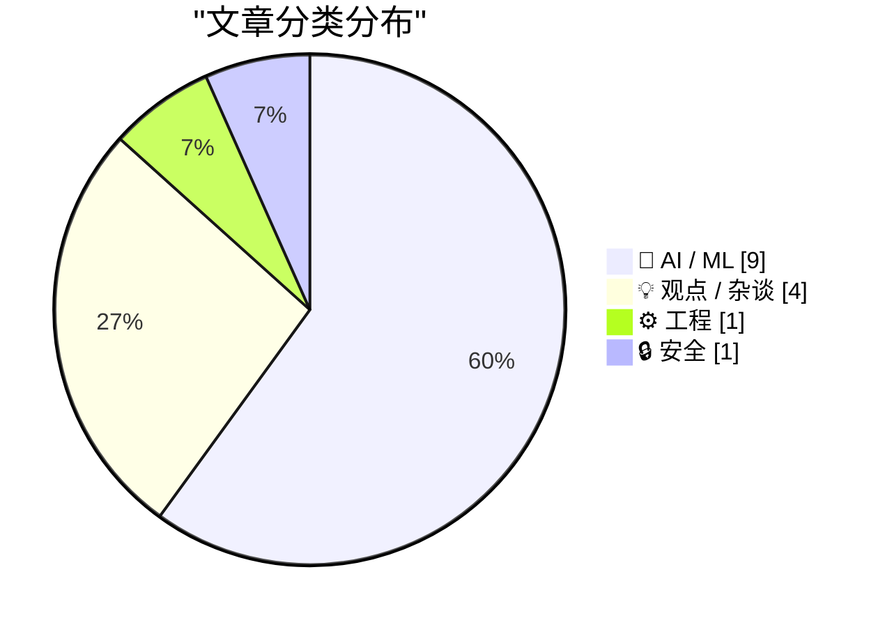
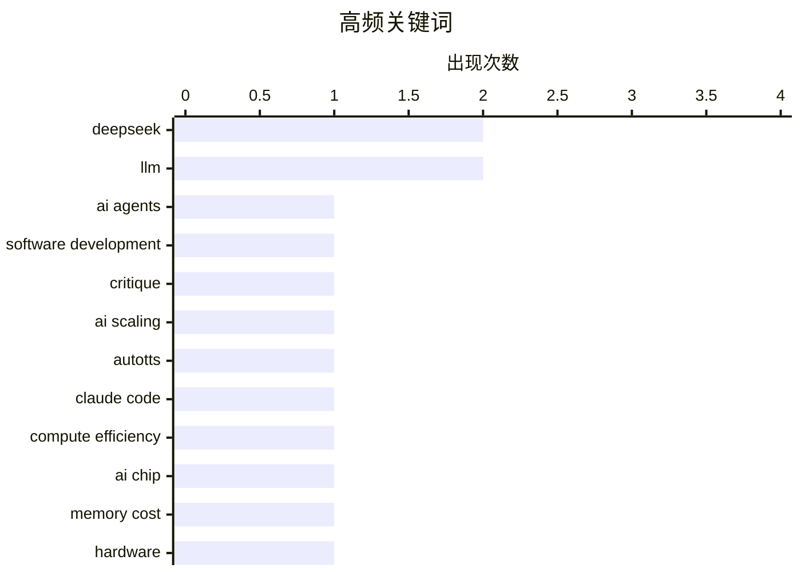

# 📰 AI 资讯每日精选 — 2026-05-25

> 汇聚 140+ 技术博客、X/Twitter、Hacker News、Reddit、Product Hunt、
> Lobste.rs、ClawFeed 日报及 GitHub Trending，经 AI 评分筛选。
>
> **本期内容**：🏆 今日必读 · 🌐 ClawFeed 日报 · 🔥 GitHub Trending · 📂 分类精选 · 🎨 设计与生成式 AI · 📊 数据概览

## 📝 今日看点

今日技术圈的核心议题围绕AI智能体的价值与风险展开激烈辩论：一方面，DeepSeek与Google DeepMind展示了智能体在编码、数学推理和成本优化上的惊人潜力，甚至发现了人类难以设计的高效算法；另一方面，多位专家发出严厉警告，认为将AI智能体引入软件开发可能代价高昂，其输出的代码看似合理却暗藏错误，且不应被当作真正的架构师来使用。与此同时，AI硬件成本结构正在发生根本性转变——内存已占据AI芯片组件成本的近三分之二，数据搬运和存储正取代计算成为主导瓶颈，这预示着未来芯片架构与定价策略将迎来深刻调整。

---

## 🏆 今日必读

🥇 **永恒的Sloptember**

[The Eternal Sloptember](https://geohot.github.io//blog/jekyll/update/2026/05/24/the-eternal-sloptember.html) — geohot.github.io · 18 小时前 · 💡 观点 / 杂谈

> 作者断言，将AI智能体引入软件开发将是该领域历史上代价最昂贵的错误之一。AI智能体本质上是一个高度精密的统计模型，旨在模仿编程的分布，而非真正进行编程。它们输出的代码看似合理，但实际上是错误的，并且随着模型精度的提高，这种错误越来越难以被人类检测到。作者的核心观点是，AI智能体无法真正编程，其表面上的进步只会掩盖更深层次的软件工程风险。

💡 **为什么值得读**: 这是一篇观点鲜明、极具争议性的批判文章，能帮助读者从反面审视当前AI编程智能体的热潮，避免盲目跟风。

🏷️ AI agents, software development, critique

🥈 **研究人员让Claude Code发现了人类可能不会设计的AI扩展算法**

[Researchers let Claude Code discover AI scaling algorithms that humans probably wouldn't have designed](https://the-decoder.com/researchers-let-claude-code-discover-ai-scaling-algorithms-that-humans-probably-wouldnt-have-designed/) — The Decoder · 17 小时前 · 🤖 AI / ML

> 来自马里兰大学、谷歌、Meta等机构的研究人员，利用AutoTTS框架让一个编码智能体独立发现了用于AI推理的控制算法。该算法相比标准的自一致性方法，在保持相同准确率的同时，将计算量削减了约70%。整个搜索过程仅花费40美元和160分钟。这项研究展示了AI自主发现高效算法的潜力，其成本和效率远超人类手动设计。

💡 **为什么值得读**: 该案例以极低的成本（40美元）和惊人的性能提升（70%算力削减），实证了AI自主发现算法的巨大潜力，极具启发性和参考价值。

🏷️ AI scaling, AutoTTS, Claude Code, compute efficiency

🥉 **内存成本已占AI芯片组件成本的近三分之二**

[Memory has grown to nearly two-thirds of AI chip component costs](https://epoch.ai/data-insights/ai-chip-component-cost-shares) — Hacker News Best · 9 小时前 · 🤖 AI / ML

> 最新数据显示，在AI芯片的组件成本中，内存（HBM等）的占比已增长到近三分之二。这一趋势凸显了在AI计算中，数据搬运和存储的成本正成为主导，而非计算单元本身。这将对未来AI芯片的架构设计和成本优化策略产生深远影响。

💡 **为什么值得读**: 该数据洞察直击AI硬件成本结构的关键变化，对于理解AI基础设施的投资方向和芯片设计趋势至关重要。

🏷️ AI chip, memory cost, hardware, component cost

4️⃣ **DeepSeek将对其旗舰AI模型永久降价75%**

[DeepSeek to Make Permanent 75% Discount on Flagship AI Model](https://www.bloomberg.com/news/articles/2026-05-23/deepseek-to-make-permanent-75-discount-on-flagship-ai-model) — Hacker News Best · 11 小时前 · 🤖 AI / ML

> 据彭博社报道，DeepSeek宣布对其旗舰AI模型实施永久性75%的价格折扣。这一激进的定价策略旨在通过大幅降低使用成本来抢占市场份额，并可能引发AI模型服务领域的新一轮价格战。此举对竞争对手和整个AI应用生态都将产生重大影响。

💡 **为什么值得读**: 这是一条重要的行业动态，直接关系到AI服务的定价趋势和市场竞争格局，对开发者和企业选型有直接影响。

🏷️ DeepSeek, pricing, AI model, discount

5️⃣ **DeepSeek Reasonix：具有高缓存命中率和低成本的DeepSeek原生编码智能体**

[DeepSeek reasonix, DeepSeek native coding agent with high caching and low cost](https://esengine.github.io/DeepSeek-Reasonix/) — Hacker News Best · 12 小时前 · 🤖 AI / ML

> DeepSeek推出了名为Reasonix的原生编码智能体，其核心优势在于高缓存命中率和极低的运行成本。结合DeepSeek V4 Pro模型永久降价的背景，Reasonix旨在提供一种经济高效的AI编程解决方案。该产品可能进一步加剧AI编码工具市场的竞争。

💡 **为什么值得读**: 该产品结合了DeepSeek的降价策略，展示了AI编程工具在成本优化上的新方向，对于关注AI开发工具性价比的读者很有价值。

🏷️ DeepSeek, coding agent, LLM, cost

---

## 🔥 GitHub Trending

> 今日热门开源项目（全语言 + Python）

| # | 项目 | 描述 | ⭐ 总星 | 📈 今日 | 语言 |
|---|------|------|---------|---------|------|
| 1 | [Lum1104/Understand-Anything](https://github.com/Lum1104/Understand-Anything) 🤖 | Graphs that teach &gt; graphs that impress. Turn any code... | 26.1k | +3999 | TypeScript |
| 2 | [colbymchenry/codegraph](https://github.com/colbymchenry/codegraph) 🤖 | Pre-indexed code knowledge graph for Claude Code, Codex, ... | 22.1k | +3003 | TypeScript |
| 3 | [multica-ai/andrej-karpathy-skills](https://github.com/multica-ai/andrej-karpathy-skills) 🤖 | A single CLAUDE.md file to improve Claude Code behavior, ... | 152.2k | +2551 | - |
| 4 | [rohitg00/ai-engineering-from-scratch](https://github.com/rohitg00/ai-engineering-from-scratch) 🤖 | Learn it. Build it. Ship it for others. | 16.1k | +1853 | Python |
| 5 | [anthropics/claude-plugins-official](https://github.com/anthropics/claude-plugins-official) 🤖 | Official, Anthropic-managed directory of high quality Cla... | 27.3k | +1173 | Python |
| 6 | [mukul975/Anthropic-Cybersecurity-Skills](https://github.com/mukul975/Anthropic-Cybersecurity-Skills) 🤖 | 754 structured cybersecurity skills for AI agents · Mappe... | 8.4k | +930 | Python |
| 7 | [manaflow-ai/cmux](https://github.com/manaflow-ai/cmux) 🤖 | Ghostty-based macOS terminal with vertical tabs and notif... | 19.0k | +696 | Swift |
| 8 | [multica-ai/multica](https://github.com/multica-ai/multica) 🤖 | The open-source managed agents platform. Turn coding agen... | 32.5k | +585 | TypeScript |
| 9 | [Alishahryar1/free-claude-code](https://github.com/Alishahryar1/free-claude-code) 🤖 | Use claude-code for free in the terminal, VSCode extensio... | 29.2k | +553 | Python |
| 10 | [anthropics/knowledge-work-plugins](https://github.com/anthropics/knowledge-work-plugins) 🤖 | Open source repository of plugins primarily intended for ... | 14.1k | +550 | Python |
| 11 | [codecrafters-io/build-your-own-x](https://github.com/codecrafters-io/build-your-own-x) | Master programming by recreating your favorite technologi... | 504.3k | +550 | Markdown |
| 12 | [yt-dlp/yt-dlp](https://github.com/yt-dlp/yt-dlp) | A feature-rich command-line audio/video downloader | 165.4k | +526 | Python |
| 13 | [Fincept-Corporation/FinceptTerminal](https://github.com/Fincept-Corporation/FinceptTerminal) | FinceptTerminal is a modern finance application offering ... | 23.5k | +462 | Python |
| 14 | [earendil-works/pi](https://github.com/earendil-works/pi) 🤖 | AI agent toolkit: coding agent CLI, unified LLM API, TUI ... | 54.0k | +456 | TypeScript |
| 15 | [D4Vinci/Scrapling](https://github.com/D4Vinci/Scrapling) | 🕷️ An adaptive Web Scraping framework that handles every... | 53.9k | +310 | Python |

---

## 🤖 AI / ML

### 1. 研究人员让Claude Code发现了人类可能不会设计的AI扩展算法

[Researchers let Claude Code discover AI scaling algorithms that humans probably wouldn't have designed](https://the-decoder.com/researchers-let-claude-code-discover-ai-scaling-algorithms-that-humans-probably-wouldnt-have-designed/) — **The Decoder** · 17 小时前 · ⭐ 26/30

> 来自马里兰大学、谷歌、Meta等机构的研究人员，利用AutoTTS框架让一个编码智能体独立发现了用于AI推理的控制算法。该算法相比标准的自一致性方法，在保持相同准确率的同时，将计算量削减了约70%。整个搜索过程仅花费40美元和160分钟。这项研究展示了AI自主发现高效算法的潜力，其成本和效率远超人类手动设计。

🏷️ AI scaling, AutoTTS, Claude Code, compute efficiency

---

### 2. 内存成本已占AI芯片组件成本的近三分之二

[Memory has grown to nearly two-thirds of AI chip component costs](https://epoch.ai/data-insights/ai-chip-component-cost-shares) — **Hacker News Best** · 9 小时前 · ⭐ 26/30

> 最新数据显示，在AI芯片的组件成本中，内存（HBM等）的占比已增长到近三分之二。这一趋势凸显了在AI计算中，数据搬运和存储的成本正成为主导，而非计算单元本身。这将对未来AI芯片的架构设计和成本优化策略产生深远影响。

🏷️ AI chip, memory cost, hardware, component cost

---

### 3. DeepSeek将对其旗舰AI模型永久降价75%

[DeepSeek to Make Permanent 75% Discount on Flagship AI Model](https://www.bloomberg.com/news/articles/2026-05-23/deepseek-to-make-permanent-75-discount-on-flagship-ai-model) — **Hacker News Best** · 11 小时前 · ⭐ 26/30

> 据彭博社报道，DeepSeek宣布对其旗舰AI模型实施永久性75%的价格折扣。这一激进的定价策略旨在通过大幅降低使用成本来抢占市场份额，并可能引发AI模型服务领域的新一轮价格战。此举对竞争对手和整个AI应用生态都将产生重大影响。

🏷️ DeepSeek, pricing, AI model, discount

---

### 4. DeepSeek Reasonix：具有高缓存命中率和低成本的DeepSeek原生编码智能体

[DeepSeek reasonix, DeepSeek native coding agent with high caching and low cost](https://esengine.github.io/DeepSeek-Reasonix/) — **Hacker News Best** · 12 小时前 · ⭐ 26/30

> DeepSeek推出了名为Reasonix的原生编码智能体，其核心优势在于高缓存命中率和极低的运行成本。结合DeepSeek V4 Pro模型永久降价的背景，Reasonix旨在提供一种经济高效的AI编程解决方案。该产品可能进一步加剧AI编码工具市场的竞争。

🏷️ DeepSeek, coding agent, LLM, cost

---

### 5. Google DeepMind的AI智能体自主解决了353个开放数学问题中的9个

[Google DeepMind's Al agent autonomously solved 9 of 353 open Erdos problems in mathematics, at a cost of a few hundred dollars per problem.](https://www.reddit.com/r/singularity/comments/1tmjdru/google_deepminds_al_agent_autonomously_solved_9/) — **r/singularity** · 7 小时前 · ⭐ 26/30

> Google DeepMind的AI智能体在数学领域取得突破，自主解决了353个开放Erdos问题中的9个，每个问题的解决成本仅为几百美元。这标志着AI在自动化科学发现，特别是解决复杂数学难题方面迈出了重要一步，展示了其超越人类直觉的潜力。

🏷️ DeepMind, AI agent, mathematics, Erdos problems

---

### 6. 为什么你不应该在Copilot、Gemini等AI工具中保留默认模型选择

[Why you shouldn't leave model selection on default in Copilot, Gemini and other AI tools](https://the-decoder.com/why-you-shouldnt-leave-model-selection-on-default-in-copilot-gemini-and-other-ai-tools/) — **The Decoder** · 15 小时前 · ⭐ 25/30

> 数学家Adam Kucharski的实验发现，当使用默认模型时，微软Copilot在分析数据时会凭空捏造国家间的差异。当向Copilot输入仅标签不同的相同数据集时，它输出了详细的刻板印象而非准确结果。研究表明，虽然更高级的“思考”模型能识别这种陷阱，但前提是用户知道何时该切换模型。这警示用户，依赖AI工具的默认设置可能导致严重的数据分析错误。

🏷️ AI bias, Copilot, model selection, data analysis

---

### 7. BitCPM-CANN：在昇腾NPU上进行原生1.58比特大语言模型训练

[BitCPM-CANN: Native 1.58-Bit Large Language Model Training on Ascend NPU](https://www.reddit.com/r/LocalLLaMA/comments/1tmf63y/bitcpmcann_native_158bit_large_language_model/) — **r/LocalLLaMA** · 10 小时前 · ⭐ 25/30

> 该研究提出了BitCPM-CANN，一个在华为昇腾NPU平台上进行1.58比特（三值）量化感知训练（QAT）的系统性方案。研究旨在解决极端低位宽LLM的两个实际难题：三值权重是否能保持复杂推理任务的能力，以及如何在昇腾NPU上高效实现。这项工作为在国产AI芯片上部署超低比特大模型提供了关键技术路径。

🏷️ 1.58-bit, ternary, Ascend NPU, training

---

### 8. 关于“赛博模型”（Mythos/5.5）是否名副其实的有趣文章：你需要了解的、正在震动华盛顿的AI模型

[Interesting article about the cyber models (mythos/5.5) living up to the hype: What to know about the AI models that are jolting Washington](https://www.reddit.com/r/singularity/comments/1tmduxh/interesting_article_about_the_cyber_models/) — **r/singularity** · 11 小时前 · ⭐ 25/30

> 文章聚焦于Anthropic和OpenAI最新发布的“赛博模型”（Mythos/5.5系列），这些模型在能力上实现了巨大飞跃，引发了华盛顿政策圈的震动。关键论点在于，这些模型在复杂推理、自主编程和长期任务执行上显著超越了前代，例如在SWE-bench编程测试中得分接近90%。文章指出，这些进步引发了美国政府对国家安全、就业市场颠覆以及AI失控风险的紧急讨论。结论是，这些模型并非炒作，其实际能力已足以迫使政策制定者重新审视AI监管框架。

🏷️ Anthropic, OpenAI, cyber models, Washington

---

### 9. 视觉大模型 vs. OCR：面向长文档（含图表、图片、表格）的问答基准测试

[Vision-capable LLMs vs. OCR for long-document (including charts, images, tables, etc.) QA](https://www.reddit.com/r/LocalLLaMA/comments/1tm0800/visioncapable_llms_vs_ocr_for_longdocument/) — **r/LocalLLaMA** · 22 小时前 · ⭐ 24/30

> 该研究对比了“直接让视觉大模型读取PDF”与“传统OCR管线”在长文档问答上的表现。测试基于MMLongBench-Doc数据集中的30份图像密集型PDF，共171个问题，统一使用Claude Sonnet 4.5作为底层LLM。结果显示，视觉大模型在包含图表和复杂排版的文档上准确率显著高于OCR管线，但处理超长文档时仍存在上下文窗口限制和幻觉问题。结论是，对于图像密集型长文档，直接使用视觉大模型是更优方案，但需要配合分块策略来克服长度限制。

🏷️ vision LLM, OCR, document QA, benchmark

---

## 💡 观点 / 杂谈

### 10. 永恒的Sloptember

[The Eternal Sloptember](https://geohot.github.io//blog/jekyll/update/2026/05/24/the-eternal-sloptember.html) — **geohot.github.io** · 18 小时前 · ⭐ 26/30

> 作者断言，将AI智能体引入软件开发将是该领域历史上代价最昂贵的错误之一。AI智能体本质上是一个高度精密的统计模型，旨在模仿编程的分布，而非真正进行编程。它们输出的代码看似合理，但实际上是错误的，并且随着模型精度的提高，这种错误越来越难以被人类检测到。作者的核心观点是，AI智能体无法真正编程，其表面上的进步只会掩盖更深层次的软件工程风险。

🏷️ AI agents, software development, critique

---

### 11. Claude不是你的架构师。别再让它假装了

[Claude is not your architect. Stop letting it pretend](https://www.hollandtech.net/claude-is-not-your-architect/) — **Hacker News Best** · 7 小时前 · ⭐ 25/30

> 文章批评了将Claude等AI工具当作软件架构师来使用的做法。作者认为，AI模型缺乏对项目全局、业务上下文和长期可维护性的真正理解，其生成的架构方案往往是表面合理但实际有缺陷的。核心观点是，开发者应主导架构设计，AI只能作为辅助编码和生成草稿的工具，而不能替代人类的架构决策。

🏷️ Claude, AI architecture, software design, over-reliance

---

### 12. 你真的希望美国“赢得”AI竞赛吗？

[Do you really want the US to “win” AI?](https://www.reddit.com/r/singularity/comments/1tms6va/do_you_really_want_the_us_to_win_ai/) — **r/singularity** · 1 小时前 · ⭐ 25/30

> 文章质疑了“美国必须在AI竞赛中获胜”这一主流叙事的合理性。作者George Hotz（Geohot）认为，将AI发展视为国家间的零和博弈是危险的，会导致技术封闭、军事化应用加速以及全球合作破裂。他提出，真正的“胜利”不应是某个国家垄断AI能力，而是确保AI技术安全、开源且惠及全人类。结论是，追求“美国赢”的叙事最终可能导致所有人都输，尤其是当AI被用于制造自主武器或加剧社会不平等时。

🏷️ AI, geopolitics, regulation, ethics

---

### 13. 引用Armin Ronacher：关于AI生成的低质量Issue问题

[Quoting Armin Ronacher](https://simonwillison.net/2026/May/24/armin-ronacher/#atom-everything) — **simonwillison.net** · 6 小时前 · ⭐ 23/30

> Armin Ronacher（Flask作者）指出当前开源项目面临的一个最令人沮丧的失败模式：用户提交的Issue不再使用自己的语言。用户将观察到的某个问题扔给“Clanker”（指AI聊天机器人），AI用充满自信但通常不准确的措辞重写了问题，导致结论完全是猜测。结果就是，维护者面对的是对根本原因的胡乱猜测、虚假的最小复现步骤以及大量无意义的噪音。结论是，这种AI生成的Issue正在严重消耗开源维护者的精力，并降低问题追踪系统的质量。

🏷️ LLM, issue tracking, OSS, quality

---

## ⚙️ 工程

### 14. hipEngine：为RDNA3（Strix Halo, 7900 XTX）提供快速原生Qwen 3.6推理

[hipEngine: Fast Native Qwen 3.6 Inference for RDNA3 (Strix Halo, 7900 XTX)](https://www.reddit.com/r/LocalLLaMA/comments/1tmq4s6/hipengine_fast_native_qwen_36_inference_for_rdna3/) — **r/LocalLLaMA** · 3 小时前 · ⭐ 26/30

> 开发者发布了hipEngine，一个基于AGPLv3协议开源、专为AMD RDNA3架构（如Strix Halo和7900 XTX）优化的ROCm原生本地LLM推理引擎。该项目旨在通过编写自定义RDNA3内核，最大化Qwen 3.6 MoE模型的推理速度。这是对AMD GPU生态在AI推理领域能力的一次重要探索和性能提升。

🏷️ RDNA3, inference, Qwen, GPU kernel

---

## 🔒 安全

### 15. 人类听不见的声音可隐藏在YouTube视频、播客或音乐中，秘密触发AI语音助手执行未经授权的命令

[Inaudible sounds to humans can be hidden in YouTube videos, podcasts, or music and used to secretly trigger AI voice assistants into carrying out unauthorized commands without the user noticing, exposing a new class of “auditory prompt injection” attacks against popular tools](https://www.reddit.com/r/singularity/comments/1tmb7mz/inaudible_sounds_to_humans_can_be_hidden_in/) — **r/singularity** · 12 小时前 · ⭐ 24/30

> 文章揭示了一种新型“听觉提示注入”攻击：攻击者可将人耳无法听见的超声波频率嵌入YouTube视频、播客或音乐中。当用户播放这些内容时，附近的AI语音助手（如Siri、Alexa）会接收到隐藏指令，从而在用户不知情的情况下执行转账、打开门锁或泄露隐私等操作。研究发现，现有主流语音助手均未对此类攻击设防，且攻击成功率超过90%。结论是，这种隐蔽攻击对智能家居和移动设备构成了严重的安全威胁，亟需新的音频输入过滤机制。

🏷️ auditory injection, AI voice, prompt injection, security

---

## 🎨 Design & Generative AI

### 🖼️ 生成式图片

- **[ComfyUI前端大汇总：48款工具一览](https://www.reddit.com/r/StableDiffusion/comments/1tm25k8/48_frontends_for_comfy/)** — r/StableDiffusion · 20 小时前
  > 更新了ComfyUI的48个前端界面列表，数量较五个月前翻倍。

- **[MooshieUI：新手友好的ComfyUI前端](https://www.reddit.com/r/StableDiffusion/comments/1tmchg1/mooshieui_a_beginnerfriendly_comfyui_frontend/)** — r/StableDiffusion · 11 小时前
  > 专为初学者设计的ComfyUI界面，内置强大的Anima动画支持。

- **[ComfyUI工作流：Stable Audio 3音乐生成](https://www.reddit.com/r/comfyui/comments/1tmc90d/comfyui_workflow_for_the_new_stable_audio_3_small/)** — r/comfyui · 12 小时前
  > 分享用于Stable Audio 3小型音乐模型的新ComfyUI工作流。

- **[自建WebUI：与Comfy后端实时同步](https://www.reddit.com/r/comfyui/comments/1tm70tb/i_created_an_webui_interface_in_sync_with_the/)** — r/comfyui · 16 小时前
  > 开发了一个与ComfyUI后端同步的Web界面，提升操作便捷性。

- **[微软Lens模型：为何用水印图片训练？](https://www.reddit.com/r/StableDiffusion/comments/1tmspf4/microsoft_lens_why_train_models_on_images_with/)** — r/StableDiffusion · 1 小时前
  > 质疑微软Lens模型使用带水印图片训练的做法，引发版权讨论。

- **[自建WebUI：Comfy后端同步版](https://www.reddit.com/r/StableDiffusion/comments/1tm6yyr/i_created_an_webui_interface_in_sync_with_the/)** — r/StableDiffusion · 16 小时前
  > 发布与ComfyUI后端同步的Web界面，提供GitHub链接。

- **[WebUI更新：视觉优化与Comfy后端同步](https://www.reddit.com/r/StableDiffusion/comments/1tmtmfs/update_corrections_and_visual_update_of_my_web_ui/)** — r/StableDiffusion · 47 分钟前
  > 对自建WebUI进行修正和视觉升级，保持与Comfy后端同步。

- **[ComfyUI采样工具：快速风格切换](https://www.reddit.com/r/StableDiffusion/comments/1tm6wbt/comfyui_samplingutils_plus_klein_9b_for_quick/)** — r/StableDiffusion · 16 小时前
  > 推出ComfyUI_SamplingUtils节点，结合Klein_9B实现快速风格变换。

- **[ComfyUI-Flux2Klein增强器最终版](https://www.reddit.com/r/StableDiffusion/comments/1tmmvyh/comfyuiflux2kleinenhancer_final_i_promise/)** — r/StableDiffusion · 5 小时前
  > 发布Flux2Klein增强器的最终版本，优化图像风格迁移效果。

- **[Flux Klein 9B参考条件：如何提升效果？](https://www.reddit.com/r/StableDiffusion/comments/1tmejgc/rererence_conditioning_reference_image_in_flux/)** — r/StableDiffusion · 10 小时前
  > 探讨在ComfyUI中优化Flux Klein 9B参考图像条件控制的方法。

- **[EHDarkMuse ES V2：逐细胞再生控制](https://www.reddit.com/r/comfyui/comments/1tmeo6n/ehdarkmuse_es_v2_percell_regeneration_full/)** — r/comfyui · 10 小时前
  > 新版工具实现逐细胞级别的图像再生，提供完全构图控制能力。

- **[SDXL LoRA训练2026年已死？](https://www.reddit.com/r/StableDiffusion/comments/1tmpx0u/sdxl_lora_training_in_2026_is_dead/)** — r/StableDiffusion · 3 小时前
  > 用户反映SDXL LoRA训练工具集体失效，Kohya和OneTrainer均报错。

### 🎬 生成式视频

- **[LongCat视频头像1.5版发布](https://www.reddit.com/r/StableDiffusion/comments/1tm5oxh/longcatvideoavatar_15_release/)** — r/StableDiffusion · 17 小时前
  > 美团LongCat项目推出视频头像生成新版本，支持更逼真的动态效果。

- **[LTX 2.3唇形同步：依赖语音效果](https://www.reddit.com/r/StableDiffusion/comments/1tmpjkw/ltx_23_lip_synchronization_depending_on_the_voice/)** — r/StableDiffusion · 3 小时前
  > 测试发现LTX 2.3的唇形同步效果因语音音频不同而差异显著。

- **[LTX Director首次测试](https://www.reddit.com/r/comfyui/comments/1tmsvon/first_test_with_ltx_director/)** — r/comfyui · 1 小时前
  > 用户分享对LTX Director视频生成工具的初次测试体验。

---

## 📊 数据概览

| 扫描源 | 抓取文章 | 时间范围 | 精选 |
|:---:|:---:|:---:|:---:|
| 118/140 | 5396 篇 → 164 篇 | 24h | **15 篇** |

### 分类分布



### 高频关键词



<details>
<summary>📈 纯文本关键词图（终端友好）</summary>

```
deepseek             │ ████████████████████ 2
llm                  │ ████████████████████ 2
ai agents            │ ██████████░░░░░░░░░░ 1
software development │ ██████████░░░░░░░░░░ 1
critique             │ ██████████░░░░░░░░░░ 1
ai scaling           │ ██████████░░░░░░░░░░ 1
autotts              │ ██████████░░░░░░░░░░ 1
claude code          │ ██████████░░░░░░░░░░ 1
compute efficiency   │ ██████████░░░░░░░░░░ 1
ai chip              │ ██████████░░░░░░░░░░ 1
```

</details>

### 🏷️ 话题标签

**deepseek**(2) · **llm**(2) · **ai agents**(1) · software development(1) · critique(1) · ai scaling(1) · autotts(1) · claude code(1) · compute efficiency(1) · ai chip(1) · memory cost(1) · hardware(1) · component cost(1) · pricing(1) · ai model(1) · discount(1) · coding agent(1) · cost(1) · rdna3(1) · inference(1)

---

*生成于 2026-05-25 01:39 | 汇聚 140 个技术博客、X/Twitter、Hacker News、Reddit、Product Hunt、Lobste.rs、ClawFeed 日报及 GitHub Trending，经 AI 评分筛选出 Top 15 精华内容*
