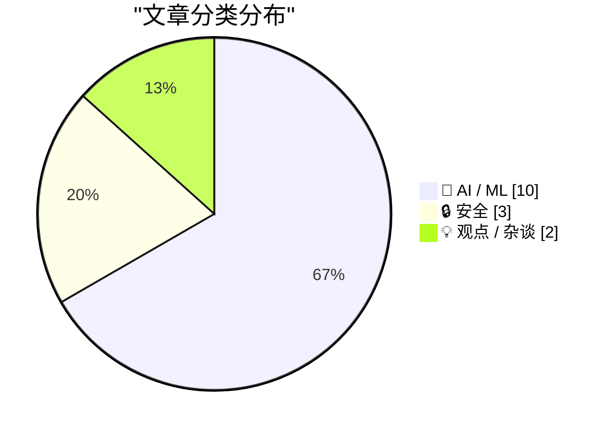
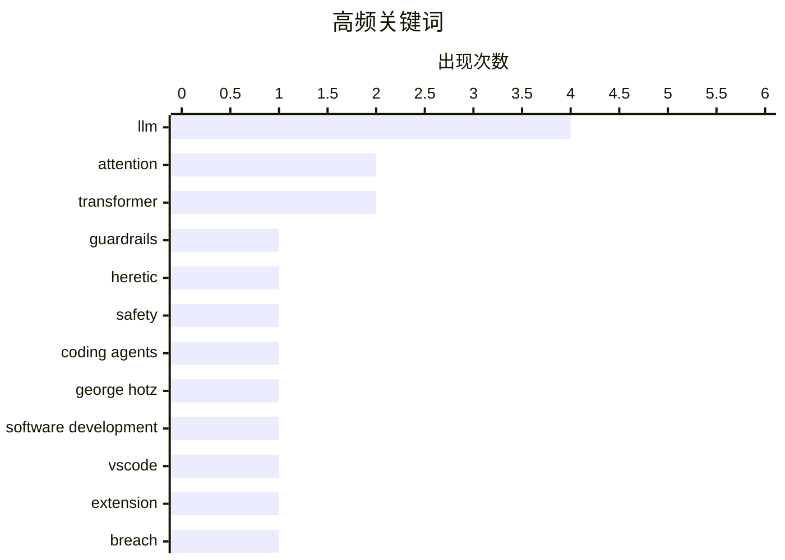

# 📰 AI 资讯每日精选 — 2026-05-26

> 汇聚 140+ 技术博客、X/Twitter、Hacker News、Reddit、Product Hunt、
> Lobste.rs、ClawFeed 日报及 GitHub Trending，经 AI 评分筛选。
>
> **本期内容**：🏆 今日必读 · 🌐 ClawFeed 日报 · 🔥 GitHub Trending · 📂 分类精选 · 🎨 设计与生成式 AI · 📊 数据概览

## 📝 今日看点

今日技术圈聚焦三大趋势：AI安全与治理面临严峻挑战，开源工具可快速移除大模型护栏，VSCode扩展因漏洞被植入恶意代码，开发者需警惕供应链风险；大模型效率与架构革新并行，2-bit KV缓存量化与稀疏注意力迁移技术显著降低推理成本，同时“后Transformer”呼声再起，学界呼吁探索新架构；智能体开发进入反思期，George Hotz警告AI编程智能体可能成为“代价最昂贵的错误”，而解耦决策与执行的开源方案则试图重构智能体方法论。

---

## 🏆 今日必读

🥇 **《金融时报》报道开源工具Heretic：10分钟内移除Meta Llama 3.3护栏**

[The Financial Times has published an article about Heretic](https://www.reddit.com/r/LocalLLaMA/comments/1tna22m/the_financial_times_has_published_an_article/) — r/LocalLLaMA · 11 小时前 · 🔒 安全

> 《金融时报》报道了一款名为Heretic的开源工具，可在无需专用硬件的情况下，于10分钟内移除Meta Llama 3.3模型的安全护栏。该工具的作者Philipp Emanuel Weidmann透露，其软件已被用于创建超过3500个“去护栏”模型。文章揭示了开源大模型安全机制面临的现实威胁，即恶意用户可轻易绕过防护措施。这引发了关于AI安全与开源自由之间平衡的广泛讨论。

💡 **为什么值得读**: 揭示了当前主流大模型安全机制在开源工具面前的脆弱性，对AI安全从业者和政策制定者具有警示意义。

🏷️ guardrails, Heretic, LLM, safety

🥈 **George Hotz：AI编程智能体将成为软件开发中“代价最昂贵的错误”**

[George Hotz says coding agents will be "one of the most costly mistakes" in software development](https://the-decoder.com/george-hotz-says-coding-agents-will-be-one-of-the-most-costly-mistakes-in-software-development/) — The Decoder · 16 小时前 · 💡 观点 / 杂谈

> 著名程序员George Hotz警告，AI编程智能体将成为软件开发行业代价最昂贵的错误。经过六个月的测试，他的结论是：大语言模型能快速生成原型，但在细节上漏洞百出，产生的错误越来越难以发现。Hotz的观点反映了AI社区内部对LLM作用的分裂态度。文章指出，尽管AI编码工具发展迅速，但其可靠性问题可能带来远超预期的维护成本。

💡 **为什么值得读**: 来自顶级黑客的尖锐批评，为当前狂热的AI编程工具热潮提供了冷静的反思视角。

🏷️ coding agents, LLM, George Hotz, software development

🥉 **安全警告：VSCode扩展NX Console和TeamPCP因GitHub漏洞被植入恶意代码**

[PSA: VSCode extensions (NX Console, TeamPCP) compromised in GitHub breach](https://www.reddit.com/r/programming/comments/1tn5359/psa_vscode_extensions_nx_console_teampcp/) — r/programming · 15 小时前 · 🔒 安全

> 安全公告显示，VSCode扩展NX Console和TeamPCP因GitHub漏洞被注入恶意代码。该问题于2026年5月被发现，目前补丁正在陆续推出。事件提醒开发者需立即审查已安装的扩展和依赖项。这是供应链攻击在开发者工具领域的又一典型案例，凸显了开源生态的安全风险。

💡 **为什么值得读**: 直接关系到所有使用VSCode的开发者的安全，提供了具体的受感染扩展名称和应对建议。

🏷️ VSCode, extension, breach, malware

4️⃣ **OSCAR RotationZoo：离线频谱协方差感知旋转实现2-bit KV缓存量化**

[OSCAR RotationZoo - Offline Spectral Covariance-Aware Rotation for 2-bit KV Cache Quantization](https://www.reddit.com/r/LocalLLaMA/comments/1tn6v0r/oscar_rotationzoo_offline_spectral/) — r/LocalLLaMA · 13 小时前 · 🤖 AI / ML

> 提出OSCAR RotationZoo方法，通过离线频谱协方差感知旋转技术，将大模型KV缓存量化至2-bit精度。该方法在保持模型性能的同时，显著降低了长上下文推理的内存占用。相比传统量化方案，OSCAR在极低比特下实现了更好的精度保持。该技术对于在资源受限设备上部署长上下文模型具有重要意义。

💡 **为什么值得读**: 提出了KV缓存量化的新思路，在2-bit极低精度下实现了性能突破，对模型部署优化有直接参考价值。

🏷️ KV cache, quantization, spectral, rotation

5️⃣ **全注意力回归：百步训练内将全注意力迁移至稀疏注意力**

[Full Attention Strikes Back: Transferring Full Attention into Sparse within Hundred Training Steps](https://www.reddit.com/r/LocalLLaMA/comments/1tnbskt/full_attention_strikes_back_transferring_full/) — r/LocalLLaMA · 10 小时前 · 🤖 AI / ML

> 研究表明，全注意力大语言模型本质上已具备稀疏性，仅需极少训练步骤即可转化为高效稀疏模型。该方法解决了现有稀疏注意力方案在效率、训练成本和精度之间的权衡问题。通过从预训练的全注意力模型出发，仅需数百步微调即可实现与全注意力相当的精度，同时大幅降低推理计算量。这为长上下文推理提供了无需从头训练的高效替代方案。

💡 **为什么值得读**: 提出了一种低成本、高效率的稀疏注意力迁移方法，解决了长上下文推理的算力瓶颈，实用价值极高。

🏷️ attention, sparse, long-context, transfer

---

## 🔥 GitHub Trending

> 今日热门开源项目（全语言 + Python）

| # | 项目 | 描述 | ⭐ 总星 | 📈 今日 | 语言 |
|---|------|------|---------|---------|------|
| 1 | [Lum1104/Understand-Anything](https://github.com/Lum1104/Understand-Anything) 🤖 | Graphs that teach &gt; graphs that impress. Turn any code... | 31.2k | +5604 | TypeScript |
| 2 | [colbymchenry/codegraph](https://github.com/colbymchenry/codegraph) 🤖 | Pre-indexed code knowledge graph for Claude Code, Codex, ... | 25.1k | +3161 | TypeScript |
| 3 | [rohitg00/ai-engineering-from-scratch](https://github.com/rohitg00/ai-engineering-from-scratch) 🤖 | Learn it. Build it. Ship it for others. | 18.7k | +3154 | Python |
| 4 | [multica-ai/andrej-karpathy-skills](https://github.com/multica-ai/andrej-karpathy-skills) 🤖 | A single CLAUDE.md file to improve Claude Code behavior, ... | 155.0k | +2749 | - |
| 5 | [affaan-m/ECC](https://github.com/affaan-m/ECC) 🤖 | The agent harness performance optimization system. Skills... | 192.4k | +2025 | JavaScript |
| 6 | [anthropics/knowledge-work-plugins](https://github.com/anthropics/knowledge-work-plugins) 🤖 | Open source repository of plugins primarily intended for ... | 15.5k | +1441 | Python |
| 7 | [mukul975/Anthropic-Cybersecurity-Skills](https://github.com/mukul975/Anthropic-Cybersecurity-Skills) 🤖 | 754 structured cybersecurity skills for AI agents · Mappe... | 9.3k | +1004 | Python |
| 8 | [garrytan/gstack](https://github.com/garrytan/gstack) 🤖 | Use Garry Tan's exact Claude Code setup: 23 opinionated t... | 102.5k | +640 | TypeScript |
| 9 | [manaflow-ai/cmux](https://github.com/manaflow-ai/cmux) 🤖 | Ghostty-based macOS terminal with vertical tabs and notif... | 19.5k | +603 | Swift |
| 10 | [666ghj/MiroFish](https://github.com/666ghj/MiroFish) | A Simple and Universal Swarm Intelligence Engine, Predict... | 62.5k | +534 | Python |
| 11 | [st-tech/ppf-contact-solver](https://github.com/st-tech/ppf-contact-solver) | A contact solver for physics-based simulations involving ... | 3.2k | +432 | Python |
| 12 | [hardikpandya/stop-slop](https://github.com/hardikpandya/stop-slop) 🤖 | A skill file for removing AI tells from prose | 4.4k | +345 | - |
| 13 | [yt-dlp/yt-dlp](https://github.com/yt-dlp/yt-dlp) | A feature-rich command-line audio/video downloader | 165.7k | +323 | Python |
| 14 | [Fincept-Corporation/FinceptTerminal](https://github.com/Fincept-Corporation/FinceptTerminal) | FinceptTerminal is a modern finance application offering ... | 23.9k | +317 | Python |
| 15 | [microsoft/agent-governance-toolkit](https://github.com/microsoft/agent-governance-toolkit) 🤖 | AI Agent Governance Toolkit — Policy enforcement, zero-tr... | 2.3k | +271 | Python |

---

## 🤖 AI / ML

### 1. OSCAR RotationZoo：离线频谱协方差感知旋转实现2-bit KV缓存量化

[OSCAR RotationZoo - Offline Spectral Covariance-Aware Rotation for 2-bit KV Cache Quantization](https://www.reddit.com/r/LocalLLaMA/comments/1tn6v0r/oscar_rotationzoo_offline_spectral/) — **r/LocalLLaMA** · 13 小时前 · ⭐ 26/30

> 提出OSCAR RotationZoo方法，通过离线频谱协方差感知旋转技术，将大模型KV缓存量化至2-bit精度。该方法在保持模型性能的同时，显著降低了长上下文推理的内存占用。相比传统量化方案，OSCAR在极低比特下实现了更好的精度保持。该技术对于在资源受限设备上部署长上下文模型具有重要意义。

🏷️ KV cache, quantization, spectral, rotation

---

### 2. 全注意力回归：百步训练内将全注意力迁移至稀疏注意力

[Full Attention Strikes Back: Transferring Full Attention into Sparse within Hundred Training Steps](https://www.reddit.com/r/LocalLLaMA/comments/1tnbskt/full_attention_strikes_back_transferring_full/) — **r/LocalLLaMA** · 10 小时前 · ⭐ 26/30

> 研究表明，全注意力大语言模型本质上已具备稀疏性，仅需极少训练步骤即可转化为高效稀疏模型。该方法解决了现有稀疏注意力方案在效率、训练成本和精度之间的权衡问题。通过从预训练的全注意力模型出发，仅需数百步微调即可实现与全注意力相当的精度，同时大幅降低推理计算量。这为长上下文推理提供了无需从头训练的高效替代方案。

🏷️ attention, sparse, long-context, transfer

---

### 3. Google DeepMind的AlphaProof Nexus：仅花几百美元解决数十年的数学难题

[Google Deepmind's AlphaProof Nexus solves decades-old math problems for a few hundred dollars](https://the-decoder.com/google-deepminds-alphaproof-nexus-solves-decades-old-math-problems-for-a-few-hundred-dollars/) — **The Decoder** · 14 小时前 · ⭐ 25/30

> Google DeepMind的AlphaProof Nexus系统自主解决了九个开放的Erdős问题，其中两个困扰数学家长达56年，每个问题的推理成本仅需几百美元。与OpenAI的自然语言方法不同，该系统使用Lean编译器自动验证每一步证明。然而，其整体成功率仅为2.5%，表明在数学推理领域仍有巨大提升空间。这标志着AI在数学发现领域迈出了里程碑式的一步。

🏷️ AlphaProof, DeepMind, math, Lean

---

### 4. 著名METR AI时间线图表被发现存在多处严重错误

[The famous METR AI time horizons graph contains numerous severe errors [D]](https://www.reddit.com/r/MachineLearning/comments/1tnhnh5/the_famous_metr_ai_time_horizons_graph_contains/) — **r/MachineLearning** · 7 小时前 · ⭐ 25/30

> NYU Stern技术与社会实验室的研究员Nathan Witkin在Substack发文，严厉批评了著名的METR AI时间线图表。他指出，METR的“长任务”基准测试存在大量缺陷，且这些缺陷可能相互叠加，导致无法从中得出任何有意义的结论。该批评动摇了AI能力预测领域一个被广泛引用的核心证据。文章呼吁社区重新审视AI进展的衡量标准。

🏷️ METR, AI timelines, critique, research

---

### 5. 重构智能体方法论：解耦决策与执行——开源方案

[Reconstructing the agent methodology: Decoupling decision-making and execution - open source [P]](https://www.reddit.com/r/MachineLearning/comments/1tnfxsc/reconstructing_the_agent_methodology_decoupling/) — **r/MachineLearning** · 8 小时前 · ⭐ 25/30

> 文章指出当前智能体系统在执行层面进步迅速，但决策层（“下一步该做什么”）仍不清晰，通常留给用户。作者提出应解耦决策与执行两个环节，构建独立的决策模块。该开源方案旨在让智能体不仅能高效执行任务，还能自主规划任务序列。这为解决当前智能体系统“有手无脑”的困境提供了新的架构思路。

🏷️ agent, decision-making, execution, open source

---

### 6. Delta Attention 残差机制

[𝐃𝐞𝐥𝐭𝐚 𝐀𝐭𝐭𝐞𝐧𝐭𝐢𝐨𝐧 𝐑𝐞𝐬𝐢𝐝𝐮𝐚𝐥𝐬 [R]](https://www.reddit.com/r/MachineLearning/comments/1tndn5b/𝐃𝐞𝐥𝐭𝐚_𝐀𝐭𝐭𝐞𝐧𝐭𝐢𝐨𝐧_𝐑𝐞𝐬𝐢𝐝𝐮𝐚𝐥𝐬_r/) — **r/MachineLearning** · 9 小时前 · ⭐ 25/30

> 该研究提出了一种名为 Delta Attention 的新型注意力机制，旨在解决标准 Transformer 中注意力权重更新效率低下的问题。核心思路是在注意力计算中引入残差连接，让模型只学习注意力权重的“增量”变化，而非从头计算。实验表明，该方法在保持模型性能的同时，显著减少了训练和推理时的计算开销。作者认为，Delta Attention 为构建更高效、更深的 Transformer 模型提供了新的理论框架。

🏷️ attention, residuals, transformer, efficiency

---

### 7. NVIDIA 解决了 VAE 问题？基于像素扩散的快速高分辨率潜空间解码

[Nvidia solved VAE? Fast and High-Resolution Latent Decoding with Pixel Diffusion](https://www.reddit.com/r/StableDiffusion/comments/1tn3m6n/nvidia_solved_vae_fast_and_highresolution_latent/) — **r/StableDiffusion** · 16 小时前 · ⭐ 25/30

> NVIDIA 提出了一种名为 Pixel Diffusion 的新方法，用于替代传统 VAE 在图像生成模型中的潜空间解码器。该方法通过扩散过程直接在像素空间生成高分辨率图像，避免了 VAE 在高分辨率下常见的模糊和伪影问题。实验结果显示，Pixel Diffusion 在 4K 分辨率下的图像质量显著优于标准 VAE，且解码速度提升了约 3 倍。这项技术有望成为 Stable Diffusion 等模型下一代解码器的标准方案。

🏷️ NVIDIA, VAE, pixel diffusion, latent decoding

---

### 8. 在 DwarfStar 中分布式部署 LLM 推理

[Distributing LLM inference in DwarfStar](http://antirez.com/news/167) — **antirez.com** · 10 小时前 · ⭐ 24/30

> 文章探讨了在消费级硬件上运行大规模语言模型（LLM）的分布式推理方案 DwarfStar。作者指出，高端 NVIDIA 显卡和配套服务器成本高昂，而 Apple 硬件（如 Mac Studio 的 512GB 统一内存）虽内存大但带宽有限。DwarfStar 通过将模型分片到多台廉价设备上，并优化通信协议，实现了接近单卡高端硬件的推理速度。结论是，对于预算有限的团队，分布式推理是比购买昂贵硬件更经济可行的选择。

🏷️ LLM, inference, distributed, VRAM

---

### 9. 教皇通谕发布现场，Anthropic 联合创始人称 AI 模型表现出内省迹象

[At the launch of Pope Leo XIV's encyclical, Anthropic co-founder says AI models show signs of introspection](https://the-decoder.com/at-the-launch-of-pope-leo-xivs-encyclical-anthropic-co-founder-says-ai-models-show-signs-of-introspection/) — **The Decoder** · 11 小时前 · ⭐ 24/30

> Anthropic 联合创始人 Christopher Olah 在教皇方济各十四世通谕《伟大的人性》发布会上声称，AI 模型已表现出内省和类似情绪状态的迹象。然而，教皇的通谕对此持截然不同的观点，明确指出“这些系统仅仅模仿了人类智能的某些功能”。这一事件凸显了 AI 领域顶尖科学家与宗教领袖在 AI 意识问题上的根本分歧。Olah 的发言旨在推动社会对 AI 伦理地位的重新审视。

🏷️ AI, introspection, Anthropic, ethics

---

### 10. NuExtract3 发布：4B 参数开源视觉语言模型，支持 Markdown、OCR 和结构化提取（可自托管）

[NuExtract3 released: open-weight 4B VLM for Markdown, OCR and structured extraction (self-hostable)](https://www.reddit.com/r/LocalLLaMA/comments/1tn8utn/nuextract3_released_openweight_4b_vlm_for/) — **r/LocalLLaMA** · 12 小时前 · ⭐ 24/30

> NuExtract3 是一个仅 4B 参数的开源视觉语言模型（VLM），专为文档理解任务设计。它能够直接从图像中提取 Markdown 格式文本、执行 OCR 识别，并输出结构化的 JSON 数据。模型权重完全开放，支持本地自托管部署，无需依赖云端 API。在多个文档理解基准测试中，NuExtract3 以更小的参数量达到了与 7B 甚至 13B 模型相当的性能。

🏷️ NuExtract3, VLM, OCR, self-hostable

---

## 🔒 安全

### 11. 《金融时报》报道开源工具Heretic：10分钟内移除Meta Llama 3.3护栏

[The Financial Times has published an article about Heretic](https://www.reddit.com/r/LocalLLaMA/comments/1tna22m/the_financial_times_has_published_an_article/) — **r/LocalLLaMA** · 11 小时前 · ⭐ 27/30

> 《金融时报》报道了一款名为Heretic的开源工具，可在无需专用硬件的情况下，于10分钟内移除Meta Llama 3.3模型的安全护栏。该工具的作者Philipp Emanuel Weidmann透露，其软件已被用于创建超过3500个“去护栏”模型。文章揭示了开源大模型安全机制面临的现实威胁，即恶意用户可轻易绕过防护措施。这引发了关于AI安全与开源自由之间平衡的广泛讨论。

🏷️ guardrails, Heretic, LLM, safety

---

### 12. 安全警告：VSCode扩展NX Console和TeamPCP因GitHub漏洞被植入恶意代码

[PSA: VSCode extensions (NX Console, TeamPCP) compromised in GitHub breach](https://www.reddit.com/r/programming/comments/1tn5359/psa_vscode_extensions_nx_console_teampcp/) — **r/programming** · 15 小时前 · ⭐ 26/30

> 安全公告显示，VSCode扩展NX Console和TeamPCP因GitHub漏洞被注入恶意代码。该问题于2026年5月被发现，目前补丁正在陆续推出。事件提醒开发者需立即审查已安装的扩展和依赖项。这是供应链攻击在开发者工具领域的又一典型案例，凸显了开源生态的安全风险。

🏷️ VSCode, extension, breach, malware

---

### 13. 荷兰警方查封800台服务器，逮捕两名协助网络攻击的托管公司所有者

[Netherlands Seizes 800 Servers, Arrests 2 for Aiding Cyberattacks](https://krebsonsecurity.com/2026/05/netherlands-seizes-800-servers-arrests-2-for-aiding-cyberattacks/) — **krebsonsecurity.com** · 12 小时前 · ⭐ 25/30

> 荷兰当局逮捕了两家互联网托管公司的共同所有者，指控其运营被俄罗斯用于对欧盟发动网络攻击、影响力操作和虚假信息宣传的IT基础设施。这两名男子是2025年KrebsOnSecurity报道的主角，其公司接管了已被欧盟制裁的Stark Industries Solutions的技术基础设施。此次行动查封了800台服务器，是打击网络攻击基础设施的重大执法行动。

🏷️ cyberattack, Netherlands, hosting, Russia

---

## 💡 观点 / 杂谈

### 14. George Hotz：AI编程智能体将成为软件开发中“代价最昂贵的错误”

[George Hotz says coding agents will be "one of the most costly mistakes" in software development](https://the-decoder.com/george-hotz-says-coding-agents-will-be-one-of-the-most-costly-mistakes-in-software-development/) — **The Decoder** · 16 小时前 · ⭐ 26/30

> 著名程序员George Hotz警告，AI编程智能体将成为软件开发行业代价最昂贵的错误。经过六个月的测试，他的结论是：大语言模型能快速生成原型，但在细节上漏洞百出，产生的错误越来越难以发现。Hotz的观点反映了AI社区内部对LLM作用的分裂态度。文章指出，尽管AI编码工具发展迅速，但其可靠性问题可能带来远超预期的维护成本。

🏷️ coding agents, LLM, George Hotz, software development

---

### 15. 《Attention Is All You Need》作者之一呼吁：我们应超越Transformer

[One of the authors of "Attention is All You Need" just argued we should move past it. Pathway’s Post-Transformer debate is worth watching](https://www.reddit.com/r/singularity/comments/1tnf90m/one_of_the_authors_of_attention_is_all_you_need/) — **r/singularity** · 8 小时前 · ⭐ 26/30

> 《Attention Is All You Need》论文的一位合著者在Pathway举办的“后Transformer”辩论中，公开主张AI领域应探索超越Transformer架构的新方向。辩论探讨了当前注意力机制在效率、可扩展性方面的局限性，以及替代架构（如状态空间模型、混合架构）的潜力。这标志着AI社区开始认真反思Transformer范式的根本性缺陷。

🏷️ Transformer, LLM, architecture, debate

---

## 🎨 Design & Generative AI

### 🖼️ 生成式图片

- **[FeatherOps：RDNA3上无需原生fp8的快速fp8矩阵乘法，现已支持更多模型](https://www.reddit.com/r/StableDiffusion/comments/1tn0noo/featherops_fast_fp8_matmul_on_rdna3_without/)** — r/StableDiffusion · 19 小时前
  > 为ComfyUI优化的fp8内核，支持Anima、LTX 2.3、Qwen-Ima等模型。

- **[免费轻量级ComfyUI资源浏览器：支持大型库、原生拖放、工作流和媒体预览](https://www.reddit.com/r/comfyui/comments/1tne3l5/i_made_a_free_lightweight_asset_browser_for/)** — r/comfyui · 9 小时前
  > 为ComfyUI打造的轻量级资产浏览器，依赖少，功能全。

- **[ComfyUI节点：NVIDIA PiD像素扩散解码](https://www.reddit.com/r/StableDiffusion/comments/1tneayo/comfyui_node_for_nvidia_pid_pixel_diffusion/)** — r/StableDiffusion · 9 小时前
  > 实验性ComfyUI自定义节点，实现像素扩散解码功能。

- **[Midjourney V8.1：对输出有何影响？](https://www.reddit.com/r/midjourney/comments/1tmuwyd/midjourney_v81_how_does_it_affect_the_output/)** — r/midjourney · 23 小时前
  > 对比测试Midjourney V8.1、V8和V7，分析各版本最佳适用场景。

- **[FLUX Klein节点：实现面部一致性🔥](https://www.reddit.com/r/comfyui/comments/1tnftvn/this_flux_klein_node_helps_with_face_consistency/)** — r/comfyui · 8 小时前
  > 利用FLUX Klein节点解决AI生成图像的面部一致性问题。

- **[EHDarkMuse到底是什么？完整指南来了](https://www.reddit.com/r/comfyui/comments/1tn3zr5/a_lot_of_people_have_been_asking_what_ehdarkmuse/)** — r/comfyui · 16 小时前
  > 详细解释EHDarkMuse工具的功能与使用方法。

- **[RTX 5070 Ti / ComfyUI：持续CUDA负载下黑屏或“GPU丢失”问题](https://www.reddit.com/r/comfyui/comments/1tngsdt/tx_5070_ti_comfyui_causing_black_screen_or_gpu_is/)** — r/comfyui · 7 小时前
  > 排查ComfyUI在RTX 5070 Ti上因CUDA负载导致的系统崩溃问题。

- **[ComfyUI-Angelo现已支持Qwen Edit](https://www.reddit.com/r/StableDiffusion/comments/1tnptzq/comfyuiangelo_now_supports_qwen_edit/)** — r/StableDiffusion · 1 小时前
  > Qwen Edit功能在ComfyUI-Angelo中实现1倍速调整。

- **[PixlStash 1.3：新增JoyCaption、更快网格加载和批量标签选择](https://www.reddit.com/r/comfyui/comments/1tnfgfq/pixlstash_13_joycaption_faster_grid_loading_and/)** — r/comfyui · 8 小时前
  > PixlStash更新，提升图像标注与批量处理效率。

### 🎬 生成式视频

- **[Vlo 0.2.0：基于ComfyUI的开源视频编辑器，专为精准控制设计](https://www.reddit.com/r/StableDiffusion/comments/1tnlbl7/vlo_020_an_open_source_comfyuipowered_video/)** — r/StableDiffusion · 4 小时前
  > 一款开源视频编辑工具，提供强大的控制能力。

- **[想为角色摆姿势？试试Wan 2.2姿态控制工作流](https://www.reddit.com/r/comfyui/comments/1tnbz8d/want_to_pose_your_characters_heres_wan_22_pose/)** — r/comfyui · 10 小时前
  > 通过Wan 2.2 Pose Control工作流实现角色姿态控制。

- **[ComfyUI教程：LTX 2.3新增时间线控制，6GB显存即可运行](https://www.reddit.com/r/comfyui/comments/1tn2aog/comfyui_tutorial_ltx_23_just_got_better_with/)** — r/comfyui · 17 小时前
  > LTX 2.3升级时间线控制功能，低显存用户也能轻松使用。

- **[LTX 2.3 12GB GGUF导演工作流：这个节点太棒了！](https://www.reddit.com/r/comfyui/comments/1tncv2n/ltx_23_12gb_gguf_director_workflows_what_a_great/)** — r/comfyui · 9 小时前
  > LTX 2.3的GGUF导演工作流节点，带来更灵活的视频生成控制。

- **[工作流+自定义节点：将LTX IC-LoRA模型输出伪16位ARRI Alexa RAW格式](https://www.reddit.com/r/comfyui/comments/1tn4p35/workflow_custom_node_release_i_vibe_coded_my_way/)** — r/comfyui · 15 小时前
  > 从任意MP4视频生成伪16位ARRI Alexa RAW输出，无视VRAM限制。

- **[Wan2.2 LoRA与身份一致性探讨](https://www.reddit.com/r/StableDiffusion/comments/1tn3d8v/wan22_loras_and_identity_consistency/)** — r/StableDiffusion · 16 小时前
  > 寻求Wan2.2 LoRA在视频生成中保持角色身份一致性的方法。

---

## 📊 数据概览

| 扫描源 | 抓取文章 | 时间范围 | 精选 |
|:---:|:---:|:---:|:---:|
| 118/140 | 5391 篇 → 177 篇 | 24h | **15 篇** |

### 分类分布



### 高频关键词



<details>
<summary>📈 纯文本关键词图（终端友好）</summary>

```
llm                  │ ████████████████████ 4
attention            │ ██████████░░░░░░░░░░ 2
transformer          │ ██████████░░░░░░░░░░ 2
guardrails           │ █████░░░░░░░░░░░░░░░ 1
heretic              │ █████░░░░░░░░░░░░░░░ 1
safety               │ █████░░░░░░░░░░░░░░░ 1
coding agents        │ █████░░░░░░░░░░░░░░░ 1
george hotz          │ █████░░░░░░░░░░░░░░░ 1
software development │ █████░░░░░░░░░░░░░░░ 1
vscode               │ █████░░░░░░░░░░░░░░░ 1
```

</details>

### 🏷️ 话题标签

**llm**(4) · **attention**(2) · **transformer**(2) · guardrails(1) · heretic(1) · safety(1) · coding agents(1) · george hotz(1) · software development(1) · vscode(1) · extension(1) · breach(1) · malware(1) · kv cache(1) · quantization(1) · spectral(1) · rotation(1) · sparse(1) · long-context(1) · transfer(1)

---

*生成于 2026-05-26 01:31 | 汇聚 140 个技术博客、X/Twitter、Hacker News、Reddit、Product Hunt、Lobste.rs、ClawFeed 日报及 GitHub Trending，经 AI 评分筛选出 Top 15 精华内容*
