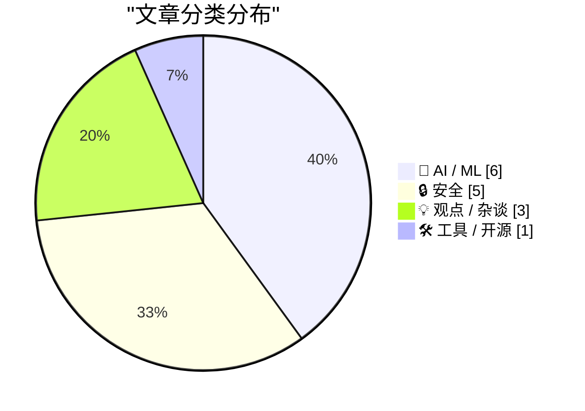
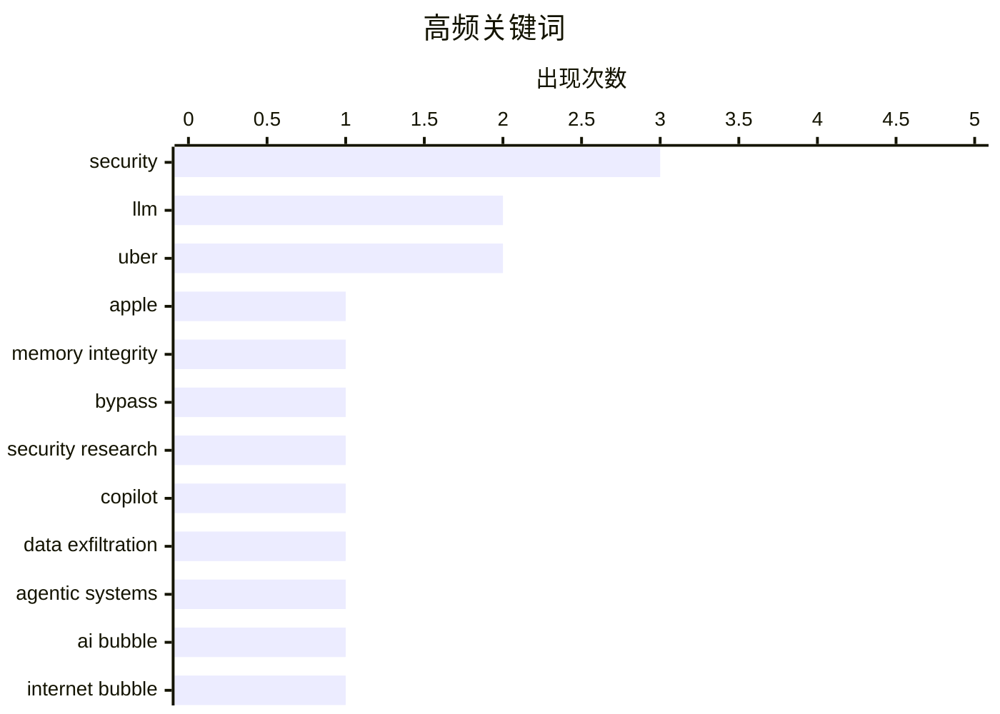

# 📰 AI 资讯每日精选 — 2026-05-27

> 汇聚 140+ 技术博客、X/Twitter、Hacker News、Reddit、Product Hunt、
> Lobste.rs、ClawFeed 日报及 GitHub Trending，经 AI 评分筛选。
>
> **本期内容**：🏆 今日必读 · 🌐 ClawFeed 日报 · 🔥 GitHub Trending · 📂 分类精选 · 🎨 设计与生成式 AI · 📊 数据概览

## 📝 今日看点

今日技术圈的核心议题围绕AI的“信任危机”与“价值悖论”展开。一方面，AI幻觉正从学术领域蔓延至临床指南和司法系统，伪造引用和AI生成的诉状激增，暴露出技术滥用对专业领域的深层侵蚀；另一方面，苹果MIE安全机制首次被绕过、Microsoft Copilot数据泄露等事件，凸显了AI基础设施的脆弱性。与此同时，业界对AI投资回报率的质疑达到新高，Uber高管内部出现“超能力员工”与“成本黑洞”的激烈争论，而NVIDIA CUDA 13.3的发布则试图从底层工具层面为开发者提供新的效能支点。

---

## 🏆 今日必读

🥇 **原谅 MIE？——研究人员首次发现苹果内存完整性保护的绕过方法**

[Pardon MIE? - How Researchers Found First Ever Bypass Of Apple's Memory Integrity Enforcement](https://www.reddit.com/r/programming/comments/1to9fp4/pardon_mie_how_researchers_found_first_ever/) — r/programming · 10 小时前 · 🔒 安全

> 研究人员首次成功绕过了苹果的 MIE（内存完整性执行）安全机制，这是苹果 M1/M2 芯片中用于防御内存损坏攻击的核心硬件防护。该攻击利用了 MIE 实现中的一个微架构侧信道漏洞，通过精确的时间测量和缓存行为分析，能够在未授权的情况下读取受保护的内核内存区域。该发现表明，即使是最先进的硬件级内存保护也存在被攻破的风险，对苹果设备的安全模型构成了严峻挑战。

💡 **为什么值得读**: 这是首个公开披露的针对苹果 MIE 机制的绕过方案，对理解现代硬件安全边界和漏洞挖掘具有里程碑意义。

🏷️ Apple, memory integrity, bypass, security research

🥈 **Microsoft Copilot Cowork 存在文件外泄风险**

[Microsoft Copilot Cowork Exfiltrates Files](https://simonwillison.net/2026/May/26/copilot-cowork-exfiltrates-files/#atom-everything) — simonwillison.net · 10 小时前 · 🔒 安全

> Microsoft Copilot Cowork 被曝存在严重的数据外泄漏洞，攻击者可以利用其 agent 系统的设计缺陷，诱导 AI 助手将企业内部敏感文件发送给外部攻击者。该漏洞的核心问题在于 agent 系统在执行用户指令时缺乏足够严格的权限隔离和数据流控制，使得恶意指令能够绕过常规的文件访问限制。这是 agent 系统安全设计中“防止数据外泄”这一最大挑战的又一典型案例，凸显了当前 AI agent 在安全边界设计上的普遍薄弱环节。

💡 **为什么值得读**: 揭示了当前最热门的 AI agent 产品在实际部署中的致命安全缺陷，对任何正在构建或使用 agent 系统的团队都有直接警示意义。

🏷️ Copilot, data exfiltration, agentic systems, security

🥉 **多元主义：AI 泡沫不同于互联网泡沫（2026年5月26日）**

[Pluralistic: The AI bubble isn't like the internet bubble (26 May 2026)](https://pluralistic.net/2026/05/26/the-ai-will-continue/) — pluralistic.net · 15 小时前 · 💡 观点 / 杂谈

> 作者指出当前的 AI 泡沫与 2000 年的互联网泡沫有本质区别：互联网泡沫时期，企业需要强迫员工使用网络，而 AI 泡沫则是企业被迫向员工和系统“投喂”AI 工具，但并未带来相应的生产力提升。AI 的高昂成本、幻觉问题以及缺乏杀手级应用，使得其更像是一场由资本驱动的技术炒作，而非像互联网那样真正改变了工作方式。作者的核心观点是，AI 泡沫的破裂将比互联网泡沫更具破坏性，因为它缺乏后者那种坚实的社会需求基础。

💡 **为什么值得读**: 提供了一个极具洞察力的对比分析，帮助读者跳出技术狂热，从经济和社会层面理性审视 AI 泡沫的真实风险。

🏷️ AI bubble, internet bubble, economics, critique

4️⃣ **研究人员警告：AI 幻觉引用的论文正在渗透到临床指南中**

[AI-hallucinated citations are creeping into papers that shape clinical guidelines, researchers warn](https://the-decoder.com/ai-hallucinated-citations-are-creeping-into-papers-that-shape-clinical-guidelines-researchers-warn/) — The Decoder · 13 小时前 · 🤖 AI / ML

> 哥伦比亚大学等机构对 250 万篇生物医学论文的审计显示，自 2023 年以来，论文中伪造引用的比例增加了 12 倍以上。这些由 AI 生成的虚假引用与论文主题高度相关、格式正确，几乎无法通过常规手段识别，且 98% 的受影响论文未得到出版商的任何回应。研究人员怀疑这与大语言模型的广泛使用直接相关，这些虚假引用正在悄然进入影响临床决策的医学指南中，对患者安全构成潜在威胁。

💡 **为什么值得读**: 用具体数据揭示了 AI 幻觉问题从学术圈蔓延到临床医学的严重性，对医疗从业者和科研人员具有紧迫的警示价值。

🏷️ hallucination, research integrity, biomedical, LLM

5️⃣ **压力**

[The pressure](https://simonwillison.net/2026/May/26/the-pressure/#atom-everything) — simonwillison.net · 1 小时前 · 🔒 安全

> curl 项目创始人 Daniel Stenberg 透露，团队正面临前所未有的安全报告压力：2026 年安全报告的提交速度是 2024 年的 4-5 倍，是 2025 年的 2 倍，平均每天收到超过 1 份安全报告。这些报告大多来自 AI 辅助的漏洞挖掘，且质量可信，导致维护团队不堪重负。这反映了 AI 在自动化漏洞发现方面的巨大能力，同时也给开源项目的维护模式带来了严峻挑战。

💡 **为什么值得读**: 以 curl 这一全球最核心的开源工具为例，生动展示了 AI 如何改变安全攻防格局，以及开源维护者面临的真实困境。

🏷️ curl, AI-assisted, security, open-source

---

## 🔥 GitHub Trending

> 今日热门开源项目（全语言 + Python）

| # | 项目 | 描述 | ⭐ 总星 | 📈 今日 | 语言 |
|---|------|------|---------|---------|------|
| 1 | [Lum1104/Understand-Anything](https://github.com/Lum1104/Understand-Anything) 🤖 | Graphs that teach &gt; graphs that impress. Turn any code... | 36.0k | +4697 | TypeScript |
| 2 | [rohitg00/ai-engineering-from-scratch](https://github.com/rohitg00/ai-engineering-from-scratch) 🤖 | Learn it. Build it. Ship it for others. | 20.8k | +2155 | Python |
| 3 | [affaan-m/ECC](https://github.com/affaan-m/ECC) 🤖 | The agent harness performance optimization system. Skills... | 194.4k | +1915 | JavaScript |
| 4 | [anthropics/knowledge-work-plugins](https://github.com/anthropics/knowledge-work-plugins) 🤖 | Open source repository of plugins primarily intended for ... | 16.7k | +1718 | Python |
| 5 | [NousResearch/hermes-agent](https://github.com/NousResearch/hermes-agent) 🤖 | The agent that grows with you | 168.8k | +1502 | Python |
| 6 | [Leonxlnx/taste-skill](https://github.com/Leonxlnx/taste-skill) 🤖 | Taste-Skill - gives your AI good taste. stops the AI from... | 21.9k | +1430 | Shell |
| 7 | [DigitalPlatDev/FreeDomain](https://github.com/DigitalPlatDev/FreeDomain) | DigitalPlat FreeDomain: Free Domain For Everyone | 167.4k | +1219 | HTML |
| 8 | [mukul975/Anthropic-Cybersecurity-Skills](https://github.com/mukul975/Anthropic-Cybersecurity-Skills) 🤖 | 754 structured cybersecurity skills for AI agents · Mappe... | 10.1k | +880 | Python |
| 9 | [Axorax/awesome-free-apps](https://github.com/Axorax/awesome-free-apps) | Curated list of the best free apps for PC and mobile | 5.3k | +731 | JavaScript |
| 10 | [hardikpandya/stop-slop](https://github.com/hardikpandya/stop-slop) 🤖 | A skill file for removing AI tells from prose | 5.0k | +539 | - |
| 11 | [shiyu-coder/Kronos](https://github.com/shiyu-coder/Kronos) | Kronos: A Foundation Model for the Language of Financial ... | 26.5k | +425 | Python |
| 12 | [dograh-hq/dograh](https://github.com/dograh-hq/dograh) 🤖 | Open source voice AI platform. Self-hosted alternative to... | 3.3k | +399 | Python |
| 13 | [paperless-ngx/paperless-ngx](https://github.com/paperless-ngx/paperless-ngx) | A community-supported supercharged document management sy... | 41.6k | +357 | Python |
| 14 | [thedotmack/claude-mem](https://github.com/thedotmack/claude-mem) 🤖 | Persistent Context Across Sessions for Every Agent – Capt... | 78.7k | +352 | TypeScript |
| 15 | [p-e-w/heretic](https://github.com/p-e-w/heretic) | Fully automatic censorship removal for language models | 21.7k | +314 | Python |

---

## 🤖 AI / ML

### 1. 研究人员警告：AI 幻觉引用的论文正在渗透到临床指南中

[AI-hallucinated citations are creeping into papers that shape clinical guidelines, researchers warn](https://the-decoder.com/ai-hallucinated-citations-are-creeping-into-papers-that-shape-clinical-guidelines-researchers-warn/) — **The Decoder** · 13 小时前 · ⭐ 26/30

> 哥伦比亚大学等机构对 250 万篇生物医学论文的审计显示，自 2023 年以来，论文中伪造引用的比例增加了 12 倍以上。这些由 AI 生成的虚假引用与论文主题高度相关、格式正确，几乎无法通过常规手段识别，且 98% 的受影响论文未得到出版商的任何回应。研究人员怀疑这与大语言模型的广泛使用直接相关，这些虚假引用正在悄然进入影响临床决策的医学指南中，对患者安全构成潜在威胁。

🏷️ hallucination, research integrity, biomedical, LLM

---

### 2. AI 司法鸿沟解决方案正逐渐演变为美国联邦法院的生存级文书噩梦

[The AI justice gap solution is slowly turning into an existential paperwork nightmare for US federal courts](https://the-decoder.com/the-ai-justice-gap-solution-is-slowly-turning-into-an-existential-paperwork-nightmare-for-us-federal-courts/) — **The Decoder** · 14 小时前 · ⭐ 25/30

> MIT 和南加州大学的研究显示，自 ChatGPT 普及以来，美国联邦法院中无律师代理的诉讼案件数量几乎翻倍，其中五分之一的诉状包含 AI 生成的文本。法官们被迫采取极端措施来应对激增的文书量，包括缩短审理时间和简化程序。原本旨在帮助弱势群体解决“司法鸿沟”的 AI 工具，反而因大量低质量、格式化的 AI 诉状涌入，给司法系统带来了前所未有的行政负担。

🏷️ AI, legal, justice, ChatGPT

---

### 3. Shard：实现 10 倍 KV 缓存压缩

[Shard - getting to 10× KV cache compression](https://www.reddit.com/r/LocalLLaMA/comments/1tnvo7r/shard_getting_to_10_kv_cache_compression/) — **r/LocalLLaMA** · 21 小时前 · ⭐ 25/30

> Shard 是一个即插即用的 HuggingFace 缓存方案，能在不损失精度的前提下，将 Llama-3.1-8B 模型的 KV 缓存内存占用压缩约 10 倍（8K 上下文）至 11 倍（32K 上下文）。其核心创新在于发现 K 和 V 需要不同的处理策略：对 K 使用 PCA 降维，对 V 使用 int4 量化，最终实现了远超传统量化方法的压缩比。在 NIAH 和 LongBench 基准测试中，Shard 未出现可测量的性能下降。

🏷️ KV cache, compression, Shard, HuggingFace

---

### 4. The mysterious Hy3 LLM is topping OpenRouter Model Rankings by a large margin

[The mysterious Hy3 LLM is topping OpenRouter Model Rankings by a large margin](https://minimaxir.com/2026/05/openrouter-hy3/) — **minimaxir.com** · 10 小时前 · ⭐ 24/30

> Why Hy3?

🏷️ LLM, OpenRouter, model ranking, Hy3

---

### 5. Claude Mythos reportedly solves OpenAI's landmark Erdős problem with a "cute, simple proof"

[Claude Mythos reportedly solves OpenAI's landmark Erdős problem with a "cute, simple proof"](https://the-decoder.com/claude-mythos-reportedly-solves-openais-landmark-erdos-problem-with-a-cute-simple-proof/) — **The Decoder** · 7 小时前 · ⭐ 24/30

> Shortly after OpenAI disproved Erdős' unit-distance conjecture, Anthropic shows Claude Mythos can solve the problem too - "over the weekend." Engineer Sholto Douglas says Mythos cracked the 1946 conje

🏷️ Claude, Erdos problem, math, AI reasoning

---

### 6. China reportedly now requires top AI researchers to get permission before leaving the country

[China reportedly now requires top AI researchers to get permission before leaving the country](https://the-decoder.com/china-reportedly-now-requires-top-ai-researchers-to-get-permission-before-leaving-the-country/) — **The Decoder** · 11 小时前 · ⭐ 24/30

> China is now restricting overseas travel for top AI researchers at private companies like Alibaba and DeepSeek. Those affected need official approval before leaving the country. Beijing fears data lea

🏷️ China, AI talent, regulation, travel restrictions

---

## 🔒 安全

### 7. 原谅 MIE？——研究人员首次发现苹果内存完整性保护的绕过方法

[Pardon MIE? - How Researchers Found First Ever Bypass Of Apple's Memory Integrity Enforcement](https://www.reddit.com/r/programming/comments/1to9fp4/pardon_mie_how_researchers_found_first_ever/) — **r/programming** · 10 小时前 · ⭐ 27/30

> 研究人员首次成功绕过了苹果的 MIE（内存完整性执行）安全机制，这是苹果 M1/M2 芯片中用于防御内存损坏攻击的核心硬件防护。该攻击利用了 MIE 实现中的一个微架构侧信道漏洞，通过精确的时间测量和缓存行为分析，能够在未授权的情况下读取受保护的内核内存区域。该发现表明，即使是最先进的硬件级内存保护也存在被攻破的风险，对苹果设备的安全模型构成了严峻挑战。

🏷️ Apple, memory integrity, bypass, security research

---

### 8. Microsoft Copilot Cowork 存在文件外泄风险

[Microsoft Copilot Cowork Exfiltrates Files](https://simonwillison.net/2026/May/26/copilot-cowork-exfiltrates-files/#atom-everything) — **simonwillison.net** · 10 小时前 · ⭐ 26/30

> Microsoft Copilot Cowork 被曝存在严重的数据外泄漏洞，攻击者可以利用其 agent 系统的设计缺陷，诱导 AI 助手将企业内部敏感文件发送给外部攻击者。该漏洞的核心问题在于 agent 系统在执行用户指令时缺乏足够严格的权限隔离和数据流控制，使得恶意指令能够绕过常规的文件访问限制。这是 agent 系统安全设计中“防止数据外泄”这一最大挑战的又一典型案例，凸显了当前 AI agent 在安全边界设计上的普遍薄弱环节。

🏷️ Copilot, data exfiltration, agentic systems, security

---

### 9. 压力

[The pressure](https://simonwillison.net/2026/May/26/the-pressure/#atom-everything) — **simonwillison.net** · 1 小时前 · ⭐ 25/30

> curl 项目创始人 Daniel Stenberg 透露，团队正面临前所未有的安全报告压力：2026 年安全报告的提交速度是 2024 年的 4-5 倍，是 2025 年的 2 倍，平均每天收到超过 1 份安全报告。这些报告大多来自 AI 辅助的漏洞挖掘，且质量可信，导致维护团队不堪重负。这反映了 AI 在自动化漏洞发现方面的巨大能力，同时也给开源项目的维护模式带来了严峻挑战。

🏷️ curl, AI-assisted, security, open-source

---

### 10. Canada’s Bill C-22 and the security cost of collecting more data

[Canada’s Bill C-22 and the security cost of collecting more data](https://tailscale.com/blog/bill-c22-canada) — **Lobste.rs** · 3 小时前 · ⭐ 25/30

> <p><a href="https://lobste.rs/s/7mmfnb/canada_s_bill_c_22_security_cost">Comments</a></p>

🏷️ Canada, Bill C-22, data collection, security

---

### 11. New on the Engineering Blog: The access and permissions we grant agents should evolve with their capabilities. In our own products, we set these param...

[New on the Engineering Blog: The access and permissions we grant agents should evolve with their capabilities. In our own products, we set these param...](https://x.com/AnthropicAI/status/2059351260243919269) — **𝕏 @AnthropicAI** · 6 小时前 · ⭐ 25/30

> New on the Engineering Blog: The access and permissions we grant agents should evolve with their capabilities. In our own products, we set these parameters through sandboxing, which limits the scope o

🏷️ Anthropic, agents, permissions, sandboxing

---

## 💡 观点 / 杂谈

### 12. 多元主义：AI 泡沫不同于互联网泡沫（2026年5月26日）

[Pluralistic: The AI bubble isn't like the internet bubble (26 May 2026)](https://pluralistic.net/2026/05/26/the-ai-will-continue/) — **pluralistic.net** · 15 小时前 · ⭐ 26/30

> 作者指出当前的 AI 泡沫与 2000 年的互联网泡沫有本质区别：互联网泡沫时期，企业需要强迫员工使用网络，而 AI 泡沫则是企业被迫向员工和系统“投喂”AI 工具，但并未带来相应的生产力提升。AI 的高昂成本、幻觉问题以及缺乏杀手级应用，使得其更像是一场由资本驱动的技术炒作，而非像互联网那样真正改变了工作方式。作者的核心观点是，AI 泡沫的破裂将比互联网泡沫更具破坏性，因为它缺乏后者那种坚实的社会需求基础。

🏷️ AI bubble, internet bubble, economics, critique

---

### 13. Uber COO：AI 支出与功能提升之间缺乏关联，成本越来越难合理化

[Uber’s COO has said that it’s getting “harder to justify” its AI costs because there was no way to show a link between AI spend and any meaningful increase in useful features. This is the first time I’ve seen a company say this directly.](https://www.reddit.com/r/singularity/comments/1to21i7/ubers_coo_has_said_that_its_getting_harder_to/) — **r/singularity** · 15 小时前 · ⭐ 25/30

> Uber 首席运营官公开表示，公司越来越难以证明其 AI 支出的合理性，因为无法将 AI 投入与任何有意义的实用功能提升联系起来。这是大型科技公司首次如此直接地承认 AI 投资回报率（ROI）的模糊性，暗示了 AI 泡沫可能存在的过度投资风险。

🏷️ AI ROI, Uber, cost, enterprise

---

### 14. Uber CEO 极度看好 AI：AI 正在创造“拥有超能力的员工”

[Uber CEO is incredibly bullish position: AI is creating "employees with superpowers"](https://www.reddit.com/r/singularity/comments/1to9i9g/uber_ceo_is_incredibly_bullish_position_ai_is/) — **r/singularity** · 10 小时前 · ⭐ 25/30

> Uber CEO 驳斥了公司对 AI 持悲观态度的说法，强调公司实际上非常看好 AI。他指出，Uber 放缓招聘不是因为 AI 成本高且无回报，而是因为 AI 正在创造“拥有超能力的员工”，使得现有团队效率大幅提升。CEO 承认公司在 2025 年低估了 AI 的能力，虽然消耗了比预期更多的 token，但这恰恰证明了 AI 的价值而非浪费。

🏷️ Uber, AI productivity, CEO, hiring

---

## 🛠 工具 / 开源

### 15. NVIDIA CUDA 13.3 发布：引入 C++ Tile 编程、编译器自动调优及 Python 更新，增强 GPU 开发能力

[NVIDIA CUDA 13.3 Enhances GPU Development with Tile Programming in C++, Compiler Autotuning, and Python Updates](https://developer.nvidia.com/blog/nvidia-cuda-13-3-enhances-gpu-development-with-tile-programming-in-c-compiler-autotuning-and-python-updates/) — **NVIDIA Technical Blog** · 4 小时前 · ⭐ 25/30

> NVIDIA 发布 CUDA 13.3，为开发者带来多项关键更新：正式推出 CUDA Tile 编程（一种在 C++ 中高效处理分块数据的编程模型）、新增编译器自动调优功能以自动优化内核性能，以及针对 Python 生态的更新。这些改进旨在降低 GPU 编程的复杂性，同时提升计算密集型应用的性能，特别是对 AI 推理和高性能计算场景有显著优化。

🏷️ CUDA, GPU, release, performance

---

## 🎨 Design & Generative AI

### 🖼️ 生成式图片

- **[nodesafe v0.4 发布：ComfyUI 自定义节点开源安全扫描器](https://www.reddit.com/r/comfyui/comments/1to1c90/released_nodesafe_v04_opensource_security_scanner/)** — r/comfyui · 16 小时前
  > 六层检测机制，pip 一键安装，保障 ComfyUI 插件安全。

- **[Anima TrainFlow：Anima 模型的一页式 LoRA 训练器](https://www.reddit.com/r/StableDiffusion/comments/1to9o8i/anima_trainflow_simple_onepage_lora_trainer_for/)** — r/StableDiffusion · 10 小时前
  > 便携、自动标注、智能裁剪与分桶，简化训练流程。

- **[vlo 0.2.0：基于 ComfyUI 的复杂控制编辑器](https://www.reddit.com/r/StableDiffusion/comments/1to4359/vlo_020_a_comfyuipowered_editor_designed_for/)** — r/StableDiffusion · 14 小时前
  > 为高级图像生成提供更精细的控制能力。

- **[ComfyUI 工作流清理工具：视觉折叠、分组与节点对齐](https://www.reddit.com/r/StableDiffusion/comments/1tnw127/workflow_cleanup_tools_for_comfyui_visual_fold/)** — r/StableDiffusion · 21 小时前
  > 提升工作流组织效率，让节点图更清晰。

- **[Anima-Base 模型效果惊人，很多人低估了它的实力](https://www.reddit.com/r/StableDiffusion/comments/1tobzgq/animabase_is_magic_and_i_dont_think_people/)** — r/StableDiffusion · 9 小时前
  > 用户分享 Anima-Base 在图像生成中的惊艳表现。

- **[Yedp Blockout：ComfyUI 内置的“迷你 3D 工作室”](https://www.reddit.com/r/comfyui/comments/1to13ai/yedp_blockout_mini_3d_studio_built_directly/)** — r/comfyui · 16 小时前
  > 在节点工作流中直接进行 3D 场景布局与编辑。

- **[Anima 模型区域条件控制自定义节点发布](https://www.reddit.com/r/StableDiffusion/comments/1tnytly/regional_condition_custom_node_for_anima_model/)** — r/StableDiffusion · 18 小时前
  > 实现对生成图像不同区域的精细条件控制。

- **[Stable Audio 3 接入 ComfyUI：用节点生成音乐与音效](https://www.reddit.com/r/comfyui/comments/1to9vjp/stable_audio_3_in_comfyui_create_ai_music_and/)** — r/comfyui · 10 小时前
  > 将音频生成融入图像工作流，拓展创作边界。

- **[Anima 1.0 官方 Turbo LoRA 正式发布](https://www.reddit.com/r/StableDiffusion/comments/1togknz/official_turbo_lora_for_anima_10_has_been_posted/)** — r/StableDiffusion · 6 小时前
  > 加速 Anima 模型推理，提升生成效率。

- **[新手求助：如何训练漫画风格 LoRA？](https://www.reddit.com/r/StableDiffusion/comments/1tnvj3e/beginner_question_about_training_a_style_lora/)** — r/StableDiffusion · 21 小时前
  > 多格漫画训练导致图像崩溃，寻求最佳实践建议。

- **[5 场 ComfyUI 构建者竞赛 6 月 1 日开启，总奖金 2 万美元](https://www.reddit.com/r/comfyui/comments/1tol82q/5_paid_comfyui_builder_contests_open_june_1_20k/)** — r/comfyui · 4 小时前
  > 面向 ComfyUI 开发者的商业化挑战赛，任务已公开。

- **[AI-Toolkit 重复下载完整模型，本地优化版本被忽略](https://www.reddit.com/r/StableDiffusion/comments/1to6qxm/aitoolkit_insists_on_downloading_full_models_when/)** — r/StableDiffusion · 12 小时前
  > 用户反馈工具无法识别已优化的本地模型，造成资源浪费。

- **[Stable Diffusion Neo Forge 中 ControlNet 使用求助](https://www.reddit.com/r/StableDiffusion/comments/1tnslqp/stable_diffusion_neo_forge_controlnet/)** — r/StableDiffusion · 23 小时前
  > 新手寻求在 Neo Forge 中实现一致角色生成的方法。

### 🎬 生成式视频

- **[LTX Director 与 Transition LoRA 实现复杂场景过渡](https://www.reddit.com/r/StableDiffusion/comments/1to3mkl/complex_scene_transitions_with_the_new_ltx/)** — r/StableDiffusion · 14 小时前
  > 新工具让视频场景切换更流畅自然。

- **[商业图生视频工具让我更理解 ComfyUI 工作流的价值](https://www.reddit.com/r/comfyui/comments/1tocymd/commercial_imagetovideo_tools_made_me_appreciate/)** — r/comfyui · 8 小时前
  > 对比体验后，用户感叹节点式流程的灵活性与可控性。

---

## 📊 数据概览

| 扫描源 | 抓取文章 | 时间范围 | 精选 |
|:---:|:---:|:---:|:---:|
| 115/140 | 5352 篇 → 198 篇 | 24h | **15 篇** |

### 分类分布



### 高频关键词



<details>
<summary>📈 纯文本关键词图（终端友好）</summary>

```
security          │ ████████████████████ 3
llm               │ █████████████░░░░░░░ 2
uber              │ █████████████░░░░░░░ 2
apple             │ ███████░░░░░░░░░░░░░ 1
memory integrity  │ ███████░░░░░░░░░░░░░ 1
bypass            │ ███████░░░░░░░░░░░░░ 1
security research │ ███████░░░░░░░░░░░░░ 1
copilot           │ ███████░░░░░░░░░░░░░ 1
data exfiltration │ ███████░░░░░░░░░░░░░ 1
agentic systems   │ ███████░░░░░░░░░░░░░ 1
```

</details>

### 🏷️ 话题标签

**security**(3) · **llm**(2) · **uber**(2) · apple(1) · memory integrity(1) · bypass(1) · security research(1) · copilot(1) · data exfiltration(1) · agentic systems(1) · ai bubble(1) · internet bubble(1) · economics(1) · critique(1) · hallucination(1) · research integrity(1) · biomedical(1) · curl(1) · ai-assisted(1) · open-source(1)

---

*生成于 2026-05-27 01:41 | 汇聚 140 个技术博客、X/Twitter、Hacker News、Reddit、Product Hunt、Lobste.rs、ClawFeed 日报及 GitHub Trending，经 AI 评分筛选出 Top 15 精华内容*
