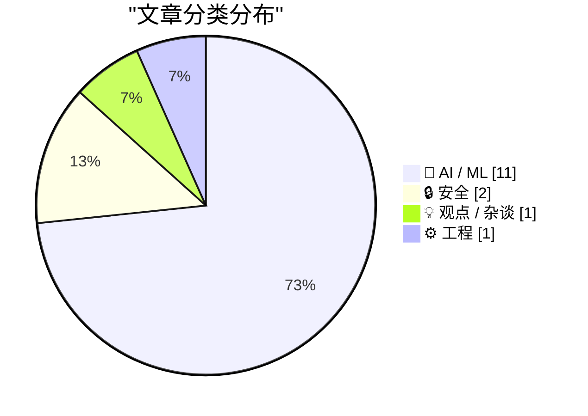
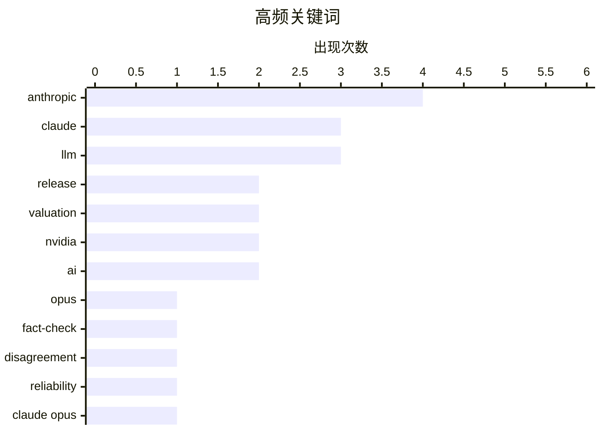

# 📰 AI 资讯每日精选 — 2026-05-29

> 汇聚 140+ 技术博客、X/Twitter、Hacker News、Reddit、Product Hunt、
> Lobste.rs、ClawFeed 日报及 GitHub Trending，经 AI 评分筛选。
>
> **本期内容**：🏆 今日必读 · 🌐 ClawFeed 日报 · 🔥 GitHub Trending · 📂 分类精选 · 🎨 设计与生成式 AI · 📊 数据概览

## 📝 今日看点

今日技术圈聚焦两大趋势：一是大模型竞争白热化，Anthropic发布Claude Opus 4.8，在多数基准测试中超越GPT-5.5和Gemini 3.1 Pro，同时其估值逼近万亿美元，显示出AI头部企业的资本与性能双重冲刺；二是AI系统的可靠性与安全性问题引发关注，研究揭示前沿模型在事实核查上存在显著分歧，且长期部署的智能体面临“老化”性能下降，同时一种通过SSD活动监视网页访客的新攻击方法被披露，凸显出AI落地后的治理与安全挑战。

---

## 🏆 今日必读

🥇 **Claude Opus 4.8**

[Claude Opus 4.8](https://www.anthropic.com/news/claude-opus-4-8) — Hacker News Best · 8 小时前 · 🤖 AI / ML

> Anthropic 发布了其最新旗舰模型 Claude Opus 4.8，官方称其为“适度但切实的改进”。该模型在大多数基准测试中超越了 GPT-5.5 和 Gemini 3.1 Pro，并且其自我纠错能力是前代 Opus 4.7 的四倍。Anthropic 还同步推出了动态工作流功能，可启动数百个并行子代理处理代码库迁移等复杂任务。Opus 4.8 在判断力、诚实度和独立工作能力上均有提升，且价格保持不变。

💡 **为什么值得读**: 这是当前最强AI模型之一的官方发布信息，包含了与GPT-5.5等竞品的直接性能对比和关键能力提升数据，是评估大模型技术前沿的重要参考。

🏷️ Claude, Opus, Anthropic, LLM

🥈 **前沿大语言模型在真实世界事实核查上存在分歧**

[Disagreement among frontier LLMs on real-world fact-checks](https://lenz.io/research/llm-disagreement) — Hacker News Best · 13 小时前 · 🤖 AI / ML

> 一项研究揭示了前沿大语言模型（LLMs）在事实核查任务上存在显著分歧。当面对真实世界中的事实性陈述时，不同模型（如GPT-4、Claude等）给出的判断结果往往不一致，甚至相互矛盾。这种分歧表明，当前LLMs在事实性知识上缺乏共识，其可靠性因模型而异。研究结论指出，依赖单一模型进行事实核查存在风险，需要更严谨的评估方法和多模型交叉验证。

💡 **为什么值得读**: 该研究直击当前AI应用的核心痛点——模型可靠性，揭示了不同顶尖模型在事实判断上的根本性分歧，对AI产品的实际部署和用户信任建设具有重要警示意义。

🏷️ LLM, fact-check, disagreement, reliability

🥉 **Anthropic 发布 Claude Opus 4.8，称其为“适度但切实的改进”，在大多数基准测试中超越 GPT-5.5**

[Anthropic ships Claude Opus 4.8 as a "modest but tangible improvement" that tops GPT-5.5 in most benchmarks](https://the-decoder.com/anthropic-ships-claude-opus-4-8-as-a-modest-but-tangible-improvement-that-tops-gpt-5-5-in-most-benchmarks/) — The Decoder · 4 小时前 · 🤖 AI / ML

> Anthropic 发布了 Claude Opus 4.8，该模型在大多数基准测试中击败了 GPT-5.5 和 Gemini 3.1 Pro。其自我发现并纠正编码错误的频率是前代 Opus 4.7 的四倍。同时，Anthropic 推出了动态工作流功能，能够启动数百个并行子代理来处理代码库迁移等任务。

💡 **为什么值得读**: 这篇文章提供了关于Claude Opus 4.8性能提升的具体量化数据（如自我纠错能力提升4倍）和与GPT-5.5的直接对比结果，是了解最新模型竞争格局的快速入口。

🏷️ Claude Opus, benchmarks, coding, Anthropic

4️⃣ **MONET：一个包含超过1亿张高质量、带标题和元数据的精选图像数据集**

[A new dataset with more that 100M hi-quality, curated images, with captions and meta data! [P]](https://www.reddit.com/r/MachineLearning/comments/1tq2vxa/a_new_dataset_with_more_that_100m_hiquality/) — r/MachineLearning · 12 小时前 · 🤖 AI / ML

> 一个名为 MONET 的新图像-文本数据集正式发布，采用 Apache 2.0 开源许可。该数据集从 29 亿张原始图像中筛选，最终保留了 1.049 亿张高质量样本，并附有标题和元数据。研究团队同步发布了相关论文，详细阐述了数据集的构建和筛选方法。MONET 旨在为多模态AI模型的训练提供大规模、高质量的开源数据资源。

💡 **为什么值得读**: 1亿+高质量、开源、带标注的图像数据集是训练多模态大模型的稀缺资源，该数据集的出现可能显著降低相关研究的门槛并推动社区发展。

🏷️ dataset, image-text, MONET, curated

5️⃣ **你的智能体也在老化：面向已部署系统的智能体生命周期工程**

[Your Agents Are Aging Too: Agent Lifespan Engineering for Deployed Systems [R]](https://www.reddit.com/r/MachineLearning/comments/1tqaoio/your_agents_are_aging_too_agent_lifespan/) — r/MachineLearning · 7 小时前 · 🤖 AI / ML

> 一项新研究提出了“智能体老化”问题，即AI智能体在长期部署后性能会下降。通过构建名为 AgingBench 的纵向部署基准测试，研究发现将 Claude Code CLI 智能体的底层模型从 Sonnet 4.6 切换到 Opus 4.7 后，PyTest 测试通过率下降了约 15%。这一反直觉的结果表明，模型升级并不总能带来部署性能的提升，智能体的生命周期管理是一个被忽视的关键工程问题。

💡 **为什么值得读**: 该研究提出了一个反直觉但极其重要的工程问题——AI智能体在长期部署中会“老化”，并提供了量化证据，对任何正在或计划部署AI代理的团队都具有直接指导意义。

🏷️ agent, deployment, lifespan, benchmark

---

## 🌐 ClawFeed 日报精选

> 来源：[ClawFeed](https://clawfeed.kevinhe.io) — AI 驱动的多源新闻聚合

📅 ClawFeed Daily | 2026-05-28 SGT

汇总当日 5 个 4h 档（00:00–19:59 SGT 覆盖）：4h ids 538 / 539 / 540 / 541 / 542。20:00–23:59 SGT 窗口（明天 00:00 SGT 触发）未含；如有重大事件次日补刀。

---

🔥 当日全场 Top 5

1. **OpenAI Private MCP Servers**（gdb 亲发，5/28 evening）—企业可把 MCP server 留在内网，ChatGPT / Codex / Responses API 通过出站 HTTPS 反向接入。MCP 从开发者玩具升级为企业级标准部署形态。https://x.com/gdb/status/2059733344783630352
2. **DTCC + Stellar 2027**—美国证券集中托管机构（~$90T 资产）官宣把 DTC 托管资产上链到 Stellar。本月最大的 TradFi-onchain 信号，标志主流金融基础设施正式选边公链。https://x.com/Cryptic_Web3/status/2059955116447264997
3. **SpaceX 自造 V1.0 AI 训练栈**（Musk）—纯 C 实现、精确映射 220k 张 GB300 + 800G NIC、重 pipeline 并行，对标"接近裸金属、超越 JAX"。超大集群训练栈开始公司自造，通用框架（PyTorch/JAX）逐步退守。https://x.com/elonmusk/status/2059884150187053488
4. **SoFi SoFiUSD on Ethereum**（ETH_Daily）—首个由美国国家级特许银行发行的 1:1 现金/现金等价物赎回稳定币。监管路径从信托/MSB（USDC、PYUSD）跨进国家银行牌照层。https://x.com/ETH_Daily/status/2059839419650281820
5. **"Harness Engineering = 2026 最重要 AI 工程发现"** 跨档持续被提及—同模型同 benchmark 跑两次 42% → 78%，唯一变量是 harness（rules / tools / skills / 反馈循环）。chenchengpro 中文圈普及 + rstagi_ 在 Berlin Applied AI Conf 现场用同一套词汇——叙事从中文圈延伸到欧洲技术圈，模型本身不再是核心。https://x.com/chenchengpro/status/2037332209003282747

---

📰 当日核心主题（聚类视角）

**A. Harness / Agent OS 叙事跨地理收敛**
heynavtoor 42→78 finding（英文圈母语）+ chenchengpro 中文化普及 + rstagi_ Berlin Applied AI Conf 现场 + idoubicc open-agent-sdk（逆向 claude-code-sourcemap）+ DoveyWanCN 「Anthropic harness 架构泄漏比 CLI 泄漏伤害更大」+ openfangg 「OpenFang = Agent OS」。**关键判断**：harness > model 已经从 hot take 变成跨语种共识。

**B. 企业级 AI 基础设施层硬化**
OpenAI Private MCP Servers（内网部署）+ SpaceX V1.0 训练栈（自造）+ Anthropic Cline Kanban / CLI-agnostic 多 agent 编排 + Vercel Sandboxes 默认持久化（getOrCreate / fork API）。**关键判断**：每个超大玩家都在把自己的 infra 层抽出来，通用框架的中间层正在被压扁。

**C. CLI agent 周更补丁竞赛**
xAI Grok Build 0.2.7（Musk 亲发 release note: subagent UI / session resume / Windows 截图）+ Claude Code / Codex 同步更新。**关键判断**：三家进入"每周补丁"节奏，dev tool 战线从年度升级变成周节奏。

**D. TradFi → onchain 双线**
DTCC + Stellar 2027（托管层）+ SoFi SoFiUSD（国家银行牌照稳定币）+ Cumberland 在 Hyperliquid 把广市/GOLD/NVDA/SILVER 全做空（专业做市商把传统资产搬到 perp DEX 对冲）。**关键判断**：托管层、发行层、对冲层同时往链上挪。

**E. Computer-use / Agent skill 横向扩展**
Cua Driver for Windows（francedot, Mac → Windows，多合成指针 + 背景驱动）+ GPT-Realtime-2 在 Chrome（Chromex）实时音频翻译 + Pika 视频聊天 skill（数字保姆 / 替身开会）+ Google Stitch `DESIGN.md`（一份 Markdown 教整套设计系统）+ petergyang `/slides` skill demo。**关键判断**：agent 从"会聊"到"会干"的边界一周内被多个产品同步推平。

**F. AI 人才与商业模式拐点**
中国把 AI 研究员定为"国家资产"（DeepSeek / 阿里限制工程师出境，幻方扣押护照）+ OpenAI 广告平台扩大邀请（免费版 ChatGPT 用户定向广告，$25/日起、$3.5 CPC）+ levie 「企业 AI 部署岗位需求要乘 10 再乘 10」。**关键判断**：人才管制 + 流量货币化 + 实施工实际缺口，三条线同时被点名。

**G. Bitcoin 法律边界测试**
Noah Doe 用算法定位 39,069 个 5+ 年未动 BTC 钱包（共 370 万 BTC / ~$2850 亿）→ 不破解私钥，向 NYPD 报"无人认领遗失物" → 1 年公示期 → 起诉法院判归自己。纽约最高法院已受理（5/1）。**关键判断**：法律 vs 密码学的极端测试案例，无论判决方向都将形成判例。

---

🔖 累计 Bookmark 精选（跨档去重）

| 来源 | 内容 | 链接 |
|------|------|------|
| arrakis_ai / gdb | GPT-Realtime-2 + Chrome 扩展（Chormex）实时 AI 翻译 | https://x.com/gdb/status/2053134883040514350 |
| turingou | wanman.ai 第 14 款 vibe 产品（一人公司 + AI agents 团队，零部署） | https://x.com/turingou/status/2047860898560373246 |
| yangyi | Google Stitch `DESIGN.md`（40+ 预构建文件，给 Agent 喂设计系统） | https://x.com/yangyi/status/2040272305277079728 |
| openfangg | Agent OS 叙事（"OpenClaw 只能聊不能干"） | https://x.com/openfangg/status/2029637900204171457 |
| cline | Cline Kanban — CLI-agnostic 多 agent 编排独立 app | https://x.com/cline/status/2037182739695493399 |
| chenchengpro / heynavtoor | Harness Engineering 42→78 finding | https://x.com/chenchengpro/status/2037332209003282747 |
| idoubicc | open-agent-sdk（逆向 claude-code-sourcemap） | https://x.com/idoubicc/status/2039006326882546141 |
| DoveyWanCN | Anthropic harness 架构泄漏的企业级影响评论 | https://x.com/DoveyWanCN/status/2038997433586425956 |
| oragnes / Pika | 给 agent 套实时虚拟形象（替身开会 / 数字保姆 + 长期记忆） | https://x.com/oragnes/status/2040031465904472464 |
| demishassabis | YC 现场聊 Gemma 模型生态 | https://x.com/demishassabis/status/2047872041827910093 |

---

👀 推荐关注汇总（跨档去重）

**AI infra / agent tooling 一手信源**
- @gdb (Greg Brockman, OpenAI President) — Private MCP / GPT-Realtime-2 等一线产品节奏
- @googlegemma — Gemma 模型 + Coral edge 硬件双线
- @francedot (Cua Driver 作者) — computer-use Windows / Mac 扩展
- @istdrc (Slock.ai / 前 Kimi CLI) — agent 工具第一手设计思考
- @cline — CLI-agnostic 多 agent 编排
- @openfangg — Agent OS 叙事发起人

**AI 工程内容 & 解读**
- @chenchengpro — Harness Engineering 等核心概念中文深度解读，不堆 buzz
- @yangyi — AI Coding Agent 设计系统工程化（DESIGN.md / Stitch）
- @rstagi_ — 欧洲 Applied AI 圈 harness / context / ontology 主题
- @rohanpaul_ai — inference 成本 / infra 拆解（The Grid 等）

**Vibe / 一人公司 / building in public**
- @turingou — wanman.ai 14 连发 vibe 产品 + 中文 BIP

**Crypto / TradFi**
- @ETH_Daily — 以太坊链上事件第一手快讯（SoFiD 这条今天就是它最先发）
- @proofoftalk — 高质量行业会议运营方（议题列表即趋势信号）
- @RoundtableSpace — 个体 builder 用 AI 跑 ROI 实战样本聚合
- @CryptoWesearch — AI 实验室推荐关注清单整理

**核实提醒**：上述账号当前关注状态未通过浏览器逐一核实，Kevin 加关注前请在 Following 里搜确认。

---

💤 当日重复噪音模式（不是单条吐槽，是模式）

1. **Crypto despair + 喊单 + token shill 三件套**：清仓抱怨（@0xFeiYang）、纯绝望（@_pogai_）、做空炫耀（@bitextr）、BTC 价格喊单（@GrantCardone / @BitcoinMagazine）、memecoin shill（$SPOON / $FACY / $AMERICA / 各种 base-checker 空投帖）—— 跨 4 个 4h 档一直在出现，背景信噪比偏低。
2. **节日 + 政治内容反复刷屏**：EidMubarak 节日帖、MAGA 内容（@C_112sz）、印度政治帖（@narendramodi / Veer Savarkar）、saifedean 转发地缘内容 — 与 AI/crypto/dev 主题无关却高频出现。
3. **Follow-for-follow / 互推 / 蓝 V 抽奖**：纯加关注互推列表（@miiamiav / @zheyiguanjsn / @kevin_76_xx），LegendzCasinoIO 类抽奖蹭流量，Gate Card 营销。
4. **单字回复 / 情绪贴**：纯 emoji、"gogogo"、"Top!"、"oh XD"、"卧槽"、"太强了" 等无文本/低密度回复 — 占了不少 feed 槽位但贡献零信号。
5. **AI 艺术生成 / Bulgarian dogs 类视觉帖**：@NotPhilSledge / @gami_vc slop punks 等 AI 生成视觉内容，与 AI infra / builder 信号无关。
6. **非领域本地新闻**：Hanoi 环线、Vermeer 展、Tsinghua Global Village、Frieren 漫画联动、Iran 无人机打击 — 本地信息流串扰，需要更严格的 channel-aware 过滤。
7. **越南语 / 越界语言贴**：@1Kaiweb3 / @vuong25012000 milk tea 等非中英内容 — 没有过滤维度时被原样放入 feed。

**改进建议**：4h scrape 阶段可以加一层「单字回复 / 节日 hashtag / 纯 token ticker」轻量过滤，会显著提升后续 digest 信噪比。

---

🔍 Deep Dive

• 本日 marks 队列为空，跳过。

—

整体节奏：5/28 SGT 是 infra 层硬信号密度高的一天——企业 MCP / 自造训练栈 / 国家银行级稳定币 / TradFi 大规模上链 / harness 叙事跨地理收敛。crypto 侧噪音占比偏高但底层有结构信号（DTCC、SoFi、Cumberland 做空、Bitcoin 法律案）。Builder 工具层周更节奏稳定，没有大跨度突破但产品力在加速。

明日重点跟进：!276/!277 合并后 cws-comm demo retest（项目侧）；Harness Engineering 在 Berlin Applied AI Conf 是否有新论文产出；Polymarket 多个 Claude bot 套利样本是否独立验证；Cua Driver Windows 实际试用反馈。
---

## 🔥 GitHub Trending

> 今日热门开源项目（全语言 + Python）

| # | 项目 | 描述 | ⭐ 总星 | 📈 今日 | 语言 |
|---|------|------|---------|---------|------|
| 1 | [harry0703/MoneyPrinterTurbo](https://github.com/harry0703/MoneyPrinterTurbo) 🤖 | 利用AI大模型，一键生成高清短视频 Generate short videos with one click us... | 66.4k | +4698 | Python |
| 2 | [Lum1104/Understand-Anything](https://github.com/Lum1104/Understand-Anything) 🤖 | Graphs that teach &gt; graphs that impress. Turn any code... | 42.8k | +3776 | TypeScript |
| 3 | [Leonxlnx/taste-skill](https://github.com/Leonxlnx/taste-skill) 🤖 | Taste-Skill - gives your AI good taste. stops the AI from... | 26.5k | +2234 | Shell |
| 4 | [byoungd/English-level-up-tips](https://github.com/byoungd/English-level-up-tips) | An advanced guide to learn English which might benefit yo... | 48.6k | +2019 | - |
| 5 | [DigitalPlatDev/FreeDomain](https://github.com/DigitalPlatDev/FreeDomain) | DigitalPlat FreeDomain: Free Domain For Everyone | 170.7k | +1761 | HTML |
| 6 | [obra/superpowers](https://github.com/obra/superpowers) | An agentic skills framework & software development method... | 211.1k | +1730 | Shell |
| 7 | [NousResearch/hermes-agent](https://github.com/NousResearch/hermes-agent) 🤖 | The agent that grows with you | 171.6k | +1411 | Python |
| 8 | [microsoft/markitdown](https://github.com/microsoft/markitdown) | Python tool for converting files and office documents to ... | 127.8k | +1410 | Python |
| 9 | [affaan-m/ECC](https://github.com/affaan-m/ECC) 🤖 | The agent harness performance optimization system. Skills... | 197.3k | +1385 | JavaScript |
| 10 | [codecrafters-io/build-your-own-x](https://github.com/codecrafters-io/build-your-own-x) | Master programming by recreating your favorite technologi... | 506.6k | +1066 | Markdown |
| 11 | [hardikpandya/stop-slop](https://github.com/hardikpandya/stop-slop) 🤖 | A skill file for removing AI tells from prose | 6.4k | +761 | - |
| 12 | [mukul975/Anthropic-Cybersecurity-Skills](https://github.com/mukul975/Anthropic-Cybersecurity-Skills) 🤖 | 754 structured cybersecurity skills for AI agents · Mappe... | 11.6k | +737 | Python |
| 13 | [anthropics/skills](https://github.com/anthropics/skills) 🤖 | Public repository for Agent Skills | 142.9k | +718 | Python |
| 14 | [twentyhq/twenty](https://github.com/twentyhq/twenty) 🤖 | The open alternative to Salesforce, designed for AI. | 47.9k | +493 | TypeScript |
| 15 | [anthropics/financial-services](https://github.com/anthropics/financial-services) |  | 28.5k | +385 | Python |

---

## 🤖 AI / ML

### 1. Claude Opus 4.8

[Claude Opus 4.8](https://www.anthropic.com/news/claude-opus-4-8) — **Hacker News Best** · 8 小时前 · ⭐ 29/30

> Anthropic 发布了其最新旗舰模型 Claude Opus 4.8，官方称其为“适度但切实的改进”。该模型在大多数基准测试中超越了 GPT-5.5 和 Gemini 3.1 Pro，并且其自我纠错能力是前代 Opus 4.7 的四倍。Anthropic 还同步推出了动态工作流功能，可启动数百个并行子代理处理代码库迁移等复杂任务。Opus 4.8 在判断力、诚实度和独立工作能力上均有提升，且价格保持不变。

🏷️ Claude, Opus, Anthropic, LLM

---

### 2. 前沿大语言模型在真实世界事实核查上存在分歧

[Disagreement among frontier LLMs on real-world fact-checks](https://lenz.io/research/llm-disagreement) — **Hacker News Best** · 13 小时前 · ⭐ 27/30

> 一项研究揭示了前沿大语言模型（LLMs）在事实核查任务上存在显著分歧。当面对真实世界中的事实性陈述时，不同模型（如GPT-4、Claude等）给出的判断结果往往不一致，甚至相互矛盾。这种分歧表明，当前LLMs在事实性知识上缺乏共识，其可靠性因模型而异。研究结论指出，依赖单一模型进行事实核查存在风险，需要更严谨的评估方法和多模型交叉验证。

🏷️ LLM, fact-check, disagreement, reliability

---

### 3. Anthropic 发布 Claude Opus 4.8，称其为“适度但切实的改进”，在大多数基准测试中超越 GPT-5.5

[Anthropic ships Claude Opus 4.8 as a "modest but tangible improvement" that tops GPT-5.5 in most benchmarks](https://the-decoder.com/anthropic-ships-claude-opus-4-8-as-a-modest-but-tangible-improvement-that-tops-gpt-5-5-in-most-benchmarks/) — **The Decoder** · 4 小时前 · ⭐ 26/30

> Anthropic 发布了 Claude Opus 4.8，该模型在大多数基准测试中击败了 GPT-5.5 和 Gemini 3.1 Pro。其自我发现并纠正编码错误的频率是前代 Opus 4.7 的四倍。同时，Anthropic 推出了动态工作流功能，能够启动数百个并行子代理来处理代码库迁移等任务。

🏷️ Claude Opus, benchmarks, coding, Anthropic

---

### 4. MONET：一个包含超过1亿张高质量、带标题和元数据的精选图像数据集

[A new dataset with more that 100M hi-quality, curated images, with captions and meta data! [P]](https://www.reddit.com/r/MachineLearning/comments/1tq2vxa/a_new_dataset_with_more_that_100m_hiquality/) — **r/MachineLearning** · 12 小时前 · ⭐ 26/30

> 一个名为 MONET 的新图像-文本数据集正式发布，采用 Apache 2.0 开源许可。该数据集从 29 亿张原始图像中筛选，最终保留了 1.049 亿张高质量样本，并附有标题和元数据。研究团队同步发布了相关论文，详细阐述了数据集的构建和筛选方法。MONET 旨在为多模态AI模型的训练提供大规模、高质量的开源数据资源。

🏷️ dataset, image-text, MONET, curated

---

### 5. 你的智能体也在老化：面向已部署系统的智能体生命周期工程

[Your Agents Are Aging Too: Agent Lifespan Engineering for Deployed Systems [R]](https://www.reddit.com/r/MachineLearning/comments/1tqaoio/your_agents_are_aging_too_agent_lifespan/) — **r/MachineLearning** · 7 小时前 · ⭐ 26/30

> 一项新研究提出了“智能体老化”问题，即AI智能体在长期部署后性能会下降。通过构建名为 AgingBench 的纵向部署基准测试，研究发现将 Claude Code CLI 智能体的底层模型从 Sonnet 4.6 切换到 Opus 4.7 后，PyTest 测试通过率下降了约 15%。这一反直觉的结果表明，模型升级并不总能带来部署性能的提升，智能体的生命周期管理是一个被忽视的关键工程问题。

🏷️ agent, deployment, lifespan, benchmark

---

### 6. Anthropic 推出 Claude Opus 4.8

[RT Claude: Introducing Claude Opus 4.8: it builds on Opus 4.7 with sharper judgment, more honesty about its own progress, and the ability to work inde...](https://x.com/AnthropicAI/status/2060042792399770030) — **𝕏 @AnthropicAI** · 8 小时前 · ⭐ 26/30

> Anthropic 正式发布 Claude Opus 4.8，该模型在 Opus 4.7 的基础上进行了改进，拥有更敏锐的判断力、对自身进展更诚实的评估，以及比前代更长的独立工作能力。该模型即日起可用，且价格保持不变。

🏷️ Claude, Opus 4.8, LLM, release

---

### 7. Claude 公司 Anthropic 在完成 650 亿美元 H 轮融资后估值接近万亿美元

[Claude company Anthropic nears a trillion-dollar valuation after raising $65 billion in Series H](https://the-decoder.com/claude-company-anthropic-nears-a-trillion-dollar-valuation-after-raising-65-billion-in-series-h/) — **The Decoder** · 4 小时前 · ⭐ 25/30

> Anthropic 完成了 650 亿美元的 H 轮融资，估值达到 9650 亿美元，接近万亿美元大关。据首席财务官 Krishna Rao 透露，公司年化收入已超过 470 亿美元。Anthropic 计划将这笔资金用于安全研究、计算能力扩展以及扩大其 Claude 产品线。

🏷️ Anthropic, funding, valuation, Claude

---

### 8. 在 NVIDIA GPU 上运行 Step 3.7 Flash，实现企业级多模态 AI

[Run Step 3.7 Flash on NVIDIA GPUs with Enterprise-Ready Multimodal AI](https://developer.nvidia.com/blog/run-step-3-7-flash-on-nvidia-gpus-with-enterprise-ready-multimodal-ai/) — **NVIDIA Technical Blog** · 1 小时前 · ⭐ 25/30

> NVIDIA 技术博客介绍了如何在 NVIDIA GPU 上部署 Step 3.7 Flash 模型，以实现企业级的多模态 AI 应用。文章指出，AI 应用正从纯文本生成转向能够感知、搜索和推理图像、文档、视频等多种模态的系统。该方案旨在为企业提供高性能、可落地的多模态 AI 解决方案。

🏷️ NVIDIA, multimodal, AI, enterprise

---

### 9. NVIDIA LocateAnything - 快速、高质量的视觉语言定位，并行框解码速度比 Qwen3-VL 快 10 倍

[Nvidia LocateAnything - Fast and High-Quality Vision-Language Grounding with Parallel Box Decoding. (10x faster than Qwen3-VL)](https://www.reddit.com/r/LocalLLaMA/comments/1tpvldv/nvidia_locateanything_fast_and_highquality/) — **r/LocalLLaMA** · 18 小时前 · ⭐ 25/30

> NVIDIA 发布了 LocateAnything 模型（3B参数），这是一个用于视觉语言定位（Vision-Language Grounding）的快速高质量模型。该模型采用并行框解码技术，在推理速度上比 Qwen3-VL 快 10 倍。模型权重、代码和在线演示均已开源发布。

🏷️ vision-language, grounding, NVIDIA, speed

---

### 10. 在RTX 3060 12GB上运行Qwen3.6-35B-A3B-APEX：128K上下文，72K填充时生成速度37 t/s，PPL 3.25，卸载17GB模型

[Qwen3.6-35B-A3B-APEX / 128K ctx on RTX 3060 12GB — 37 t/s gen with 72k ctx filled, PPL 3.25, offloading 17GB model](https://www.reddit.com/r/LocalLLaMA/comments/1tq0h1p/qwen3635ba3bapex_128k_ctx_on_rtx_3060_12gb_37_ts/) — **r/LocalLLaMA** · 14 小时前 · ⭐ 25/30

> 该帖展示了如何在仅有12GB显存的RTX 3060上运行35B参数的Qwen3.6-A3B MoE模型。通过使用spiritbuun的llama.cpp分支（包含fused MMA fix、TurboQuant和fattn优化）以及mudler的APEX量化方案，成功将17GB的模型卸载到显存和内存中。在128K上下文长度下，填充72K token后，生成速度仍能达到37 token/s，困惑度（PPL）为3.25。核心方案是利用CUDA优化和特殊量化技术，在低端消费级显卡上实现大模型的可用推理性能。结论是，通过社区工具和量化技巧，12GB显存用户也能流畅运行35B级别的长上下文模型。

🏷️ Qwen, APEX, llama.cpp, VRAM optimization

---

### 11. 突发新闻：Anthropic超越OpenAI，以9000亿美元估值成为全球最有价值的AI初创公司

[Breaking News: Anthropic surpassed OpenAI as the world’s most valuable A.I. start-up, with a valuation of $900 billion.](https://www.reddit.com/r/singularity/comments/1tqcukx/breaking_news_anthropic_surpassed_openai_as_the/) — **r/singularity** · 6 小时前 · ⭐ 25/30

> Anthropic以9000亿美元的估值超越OpenAI，成为全球估值最高的AI初创公司。这一估值反映了市场对Anthropic在AI安全研究、模型能力（如Claude系列）以及企业级应用前景的高度认可。该事件标志着AI行业竞争格局的重大变化，Anthropic从OpenAI的挑战者转变为领导者。核心观点是，AI领域的价值重心正在从通用大模型转向更注重安全性和可控性的技术路线。

🏷️ Anthropic, valuation, startup

---

## 🔒 安全

### 12. 研究人员发布通过分析SSD活动来监视网页访客的方法

[Researchers Publish Method to Surveil Web Page Visitors by Analyzing Their SSD Activity](https://arstechnica.com/security/2026/05/websites-have-a-new-way-to-spy-on-visitors-analyzing-their-ssd-activity/) — **daringfireball.net** · 11 小时前 · ⭐ 25/30

> 研究人员公布了一种新型网络监视技术，通过分析访客的SSD（固态硬盘）活动来窥探其行为。该技术利用了一个侧信道漏洞，通过测量SSD在执行任务时的物理表现（如电磁辐射、缓存或完成时间）来推断加密流量中的机密数据。研究指出，随着浏览器从简单的文档查看器演变为复杂应用平台，此类攻击面也在扩大。

🏷️ SSD, side channel, privacy, surveillance

---

### 13. ACME CAA扩展即将成为强制要求

[ACME CAA Extensions to Become Mandatory](https://www.feistyduck.com/newsletter/issue_137_acme_caa__extensions_to_become_mandatory) — **Lobste.rs** · 2 小时前 · ⭐ 25/30

> 文章宣布ACME（自动证书管理环境）的CAA（证书颁发机构授权）扩展即将成为强制要求。这意味着所有使用ACME协议申请TLS证书的客户端，都必须支持CAA记录检查，以确保证书只能由授权的CA颁发。该变更旨在增强HTTPS证书的安全性，防止证书误发和中间人攻击。核心观点是，这一强制要求将显著提升Web PKI的安全性，但需要所有ACME客户端和CA进行适配。

🏷️ ACME, CAA, TLS, certificate

---

## 💡 观点 / 杂谈

### 14. Scott Aaronson：来自人类可能最后的日子里的快报

[Scott Aaronson: Dispatches from the possibly last days of human relevance](https://www.reddit.com/r/singularity/comments/1tpurf9/scott_aaronson_dispatches_from_the_possibly_last/) — **r/singularity** · 19 小时前 · ⭐ 25/30

> 量子计算专家Scott Aaronson在文章中探讨了AI快速发展对人类未来角色的影响。他分析了AI在数学证明、科学发现和创意写作等领域展现出的超越人类的能力，并讨论了“人类相关性”可能终结的时间线。文章核心论点是，虽然AGI可能很快到来，但人类在定义问题、设定目标和伦理判断上仍可能保留独特价值。结论是，人类需要正视AI带来的存在性挑战，并主动思考如何在后AI时代保持意义。

🏷️ Scott Aaronson, AI, relevance, future

---

## ⚙️ 工程

### 15. Rust 1.96.0 正式发布

[Announcing Rust 1.96.0](https://blog.rust-lang.org/2026/05/28/Rust-1.96.0/) — **Lobste.rs** · 6 小时前 · ⭐ 25/30

> Rust团队宣布发布1.96.0版本，该版本引入了多项语言特性和工具链改进。主要更新包括对模式匹配的增强、新的标准库API以及编译性能的优化。此外，该版本还修复了多个安全漏洞，并改进了与Cargo的集成体验。核心观点是，Rust通过持续迭代，在保持内存安全优势的同时，不断提升开发效率和运行时性能。

🏷️ Rust, release, language

---

## 🎨 Design & Generative AI

### 🖼️ 生成式图片

- **[Windows 上安全加固 ComfyUI 指南](https://www.reddit.com/r/comfyui/comments/1tprno1/guide_securehardened_comfyui_on_windows/)** — r/comfyui · 22 小时前
  > 介绍通过 Docker+WSL2 在 RTX 3090 上安全运行 ComfyUI 的方法，避免节点和模型带来的风险。

- **[ComfyUI 智能提示词生成节点](https://www.reddit.com/r/comfyui/comments/1tqhutj/node_comfyuismartpromptcrafter_autodetects_your/)** — r/comfyui · 3 小时前
  > 自动检测模型类型并重写提示词，免去在 SD 1.5、SDXL、Pony 或 Flux 间手动调整的麻烦。

- **[Windows 上安全运行 ComfyUI 指南](https://www.reddit.com/r/StableDiffusion/comments/1tq46q0/guide_how_to_securely_run_comfyui_on_windows/)** — r/StableDiffusion · 11 小时前
  > 通过 Docker+WSL2 在 Windows 上安全运行 ComfyUI，适用于 RTX 3090 及其他硬件。

- **[训练角色 LoRA 的困惑与解答](https://www.reddit.com/r/StableDiffusion/comments/1tqi2o1/genuinely_so_confused_training_my_own_character/)** — r/StableDiffusion · 3 小时前
  > 新手在训练自定义角色 LoRA 时遇到的术语和流程困惑，寻求社区帮助。

- **[Rebels 提示词增强器（低显存友好）](https://www.reddit.com/r/comfyui/comments/1tppq3e/rebels_prompt_enhancer_low_vram/)** — r/comfyui · 23 小时前
  > 无需来回切换 LLM，直接在 ComfyUI 内生成高质量详细提示词的工具。

- **[Blender 插件集成 LTX 2.3、OmniNFT 与 Flux](https://www.reddit.com/r/StableDiffusion/comments/1tqedbl/ltx_23_omninft_flux_klein_9b_via_my_pallaidium/)** — r/StableDiffusion · 5 小时前
  > 通过 Pallaidium 插件在 Blender 中调用多种 AI 模型进行图像生成。

- **[Reactor 换脸节点更新](https://www.reddit.com/r/comfyui/comments/1tqi48i/my_reactor_updated/)** — r/comfyui · 3 小时前
  > 修复换脸前的问题，新增选择面部区域的功能。

- **[如何放大噪点演唱会照片并修复模糊人脸](https://www.reddit.com/r/StableDiffusion/comments/1tpvej6/how_to_upscale_image_how_to_upscale_a_noisy/)** — r/StableDiffusion · 19 小时前
  > 使用高分辨率参考图像对低质量照片进行放大和面部修复的方法。

- **[Midjourney 角色一致性难题](https://www.reddit.com/r/midjourney/comments/1tq559v/struggling_with_midjourney/)** — r/midjourney · 11 小时前
  > 用户困惑于无法在 Midjourney 中生成同一人物的多张一致图像。

- **[如何优化写实生物细节](https://www.reddit.com/r/midjourney/comments/1tqchku/whats_the_best_settings_for_recreating_and/)** — r/midjourney · 6 小时前
  > 探讨在 Midjourney 中通过低混乱度和参考图像提升照片级生物细节的最佳设置。

- **[Anima Base 1.0 自定义 LoRA 体验](https://www.reddit.com/r/StableDiffusion/comments/1tpx4kg/tried_custom_lora_for_anima_base_10_and_its/)** — r/StableDiffusion · 17 小时前
  > 用户分享在 Anima Base 1.0 模型上使用自定义 LoRA 的惊艳效果。

### 🎬 生成式视频

- **[5分钟学会：用 Prompt Relay 实现多角色对话](https://www.reddit.com/r/comfyui/comments/1tptxv3/5min_howto_using_prompt_relay_for_multi_character/)** — r/comfyui · 20 小时前
  > 在 LTX 2.3 中使用 Prompt Relay 节点快速创建多角色对话视频的教程。

- **[最佳 AI 工作流：恢复低质量视频](https://www.reddit.com/r/StableDiffusion/comments/1tqfzx3/best_stable_diffusion_ai_workflow_for_restoring_a/)** — r/StableDiffusion · 4 小时前
  > 探讨使用 Stable Diffusion 等 AI 工具修复低分辨率视频的最佳方案。

- **[AI 电影制作中的电影镜头尺寸与构图](https://www.reddit.com/r/midjourney/comments/1tpx9yp/cinematic_shot_sizes_and_framing_for_generating/)** — r/midjourney · 17 小时前
  > 传统电影制作人分享如何将镜头语言应用于 AI 视频生成。

- **[ComfyUI 更新后 LTX 节点失效](https://www.reddit.com/r/StableDiffusion/comments/1tqhyez/updated_comfyui_and_ltx_nodes/)** — r/StableDiffusion · 3 小时前
  > 更新 ComfyUI 后 LTX 节点无法工作，用户寻求降级或修复方案。

---

## 📊 数据概览

| 扫描源 | 抓取文章 | 时间范围 | 精选 |
|:---:|:---:|:---:|:---:|
| 117/140 | 5394 篇 → 191 篇 | 24h | **15 篇** |

### 分类分布



### 高频关键词



<details>
<summary>📈 纯文本关键词图（终端友好）</summary>

```
anthropic    │ ████████████████████ 4
claude       │ ███████████████░░░░░ 3
llm          │ ███████████████░░░░░ 3
release      │ ██████████░░░░░░░░░░ 2
valuation    │ ██████████░░░░░░░░░░ 2
nvidia       │ ██████████░░░░░░░░░░ 2
ai           │ ██████████░░░░░░░░░░ 2
opus         │ █████░░░░░░░░░░░░░░░ 1
fact-check   │ █████░░░░░░░░░░░░░░░ 1
disagreement │ █████░░░░░░░░░░░░░░░ 1
```

</details>

### 🏷️ 话题标签

**anthropic**(4) · **claude**(3) · **llm**(3) · release(2) · valuation(2) · nvidia(2) · ai(2) · opus(1) · fact-check(1) · disagreement(1) · reliability(1) · claude opus(1) · benchmarks(1) · coding(1) · dataset(1) · image-text(1) · monet(1) · curated(1) · agent(1) · deployment(1)

---

*生成于 2026-05-29 01:38 | 汇聚 140 个技术博客、X/Twitter、Hacker News、Reddit、Product Hunt、Lobste.rs、ClawFeed 日报及 GitHub Trending，经 AI 评分筛选出 Top 15 精华内容*
