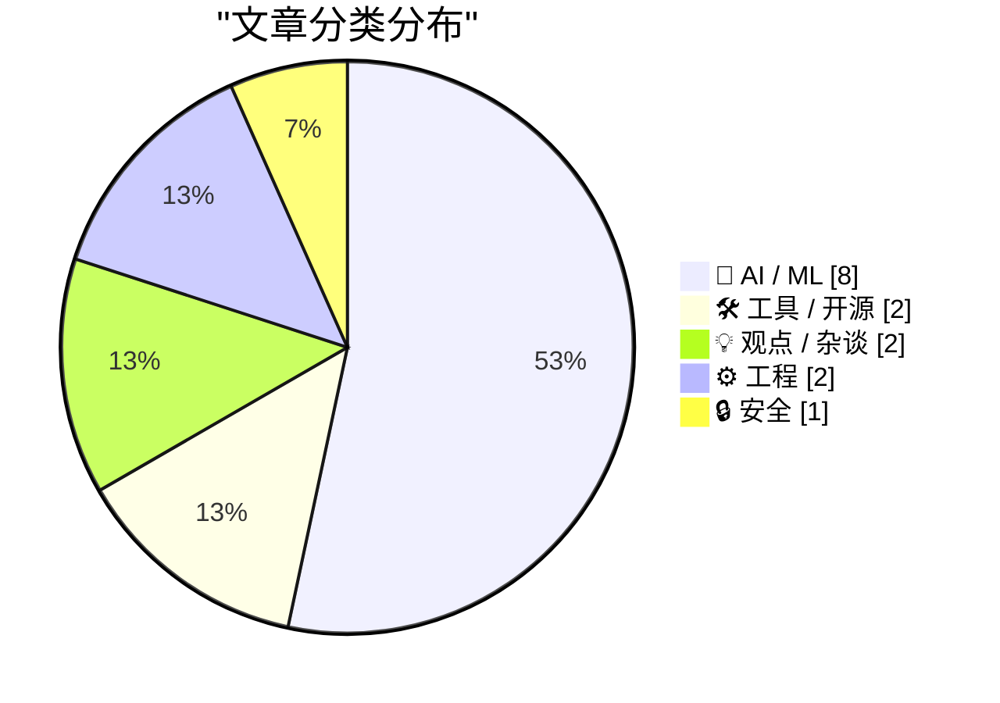
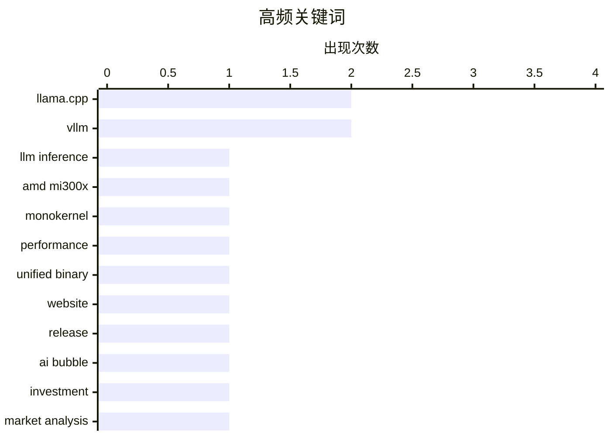

# 📰 AI 资讯每日精选 — 2026-05-30

> 汇聚 140+ 技术博客、X/Twitter、Hacker News、Reddit、Product Hunt、
> Lobste.rs、ClawFeed 日报及 GitHub Trending，经 AI 评分筛选。
>
> **本期内容**：🏆 今日必读 · 🌐 ClawFeed 日报 · 🔥 GitHub Trending · 📂 分类精选 · 🎨 设计与生成式 AI · 📊 数据概览

## 📝 今日看点

今日技术圈聚焦两大趋势：一是AI推理与部署的极致优化，AMD MI300X单内核方案实现每秒3300 tokens的惊人吞吐，同时Liquid AI推出专为边缘设备设计的8B参数模型，标志着大模型正从云端向终端渗透；二是AI基础设施与工具链的整合与反思，llama.cpp计划统一命令行工具并推出官网，而多篇讨论则警示AI代码生成可能引发前端技术债务，并强调智能体真正的瓶颈在于软件层而非模型本身。此外，关于AI泡沫的系列分析持续引发对行业过热风险的思考。

---

## 🏆 今日必读

🥇 **为AMD MI300X构建LLM推理单内核：单请求可达3300输出tokens/秒**

[Building a monokernel for LLM inference on AMD MI300X - up to 3,300 output tokens/s per request [P]](https://www.reddit.com/r/MachineLearning/comments/1tqvuz9/building_a_monokernel_for_llm_inference_on_amd/) — r/MachineLearning · 16 小时前 · 🤖 AI / ML

> 该文章介绍了一种为AMD MI300X GPU设计的单内核（monokernel）方案，将完整的解码序列作为一个GPU驻留程序运行。核心优化在于利用芯片拓扑结构，将内存访问模式映射到物理布局，并按关联的IOD对计算单元分组，使硬件达到满设计性能。在8x MI300X配置下，单请求（batch size=1）无需投机解码或量化，即可实现高达3300输出tokens/秒的吞吐量。该方案证明了硬件感知的底层优化对AMD GPU推理性能的巨大提升潜力。

💡 **为什么值得读**: 如果你关注AMD GPU在LLM推理中的极限性能，这篇帖子展示了通过硬件拓扑感知优化实现远超常规的吞吐量，是了解MI300X真实潜力的第一手资料。

🏷️ LLM inference, AMD MI300X, monokernel, performance

🥈 **llama.c讨论：统一`llama`二进制文件与网站**

[llama : website + unified `llama` binary · ggml-org/llama.cpp · Discussion #23875](https://www.reddit.com/r/LocalLLaMA/comments/1tr78bg/llama_website_unified_llama_binary/) — r/LocalLLaMA · 9 小时前 · 🛠 工具 / 开源

> llama.cpp项目正在讨论将多个分散的命令行工具合并为一个统一的`llama`二进制文件，以简化用户的使用体验。同时，项目还计划推出一个官方网站，用于提供文档、下载和社区资源。这一统一化举措旨在降低llama.cpp的使用门槛，让用户无需记忆多个子命令即可完成模型推理、量化、转换等操作。讨论中涉及了二进制文件的命名、子命令设计以及向后兼容性等关键问题。

💡 **为什么值得读**: 如果你是llama.cpp的用户或贡献者，这篇讨论直接关系到未来工具链的易用性和维护方式，值得关注其设计决策。

🏷️ llama.cpp, unified binary, website, release

🥉 **付费文章：假如……我们正处于AI泡沫中？（第三部分）**

[Premium: What If...We're In An AI Bubble? (Part 3)](https://www.wheresyoured.at/premium-what-if-were-in-an-ai-bubble-part-3/) — wheresyoured.at · 8 小时前 · 🤖 AI / ML

> 这是“AI泡沫”系列文章的第三部分，作者继续探讨可能导致AI泡沫破裂的几种情景。前两部分已经讨论了部分触发因素，本部分将深入分析剩余的关键风险。文章从宏观经济、资本支出回报率、企业采用率等角度，系统性地审视当前AI热潮的可持续性。作者的核心观点是，当前AI领域的估值和投资规模已严重脱离实际生产力增长，泡沫破裂的风险正在积聚。

💡 **为什么值得读**: 如果你对AI行业的长期前景感到担忧或好奇，这篇系列文章提供了从经济与商业角度出发的冷静分析，有助于对抗技术乐观主义带来的认知偏差。

🏷️ AI bubble, investment, market analysis, speculation

4️⃣ **Claude Code——文档未提及的所有可配置项**

[Claude Code – Everything you can configure that the docs don't tell you](https://buildingbetter.tech/p/i-read-the-claude-code-source-code) — Hacker News Best · 23 小时前 · 🛠 工具 / 开源

> 作者通过阅读Claude Code的源代码，揭示了官方文档中未公开的大量可配置选项。这些配置项涵盖了模型行为、工具调用、输出格式、错误处理等多个方面，允许用户进行更精细的控制。文章详细列出了这些隐藏参数及其作用，例如调整思考链长度、自定义系统提示、控制代码执行权限等。对于希望深度定制Claude Code行为的开发者来说，这是一份宝贵的实战指南。

💡 **为什么值得读**: 如果你是Claude Code的重度用户，这篇文章能让你解锁官方文档之外的隐藏功能，极大提升工具的定制化和自动化水平。

🏷️ Claude Code, configuration, source code, AI coding

5️⃣ **Liquid AI发布LFM2.5-8B-A1B边缘模型**

[Liquid AI releases LFM2.5-8B-A1B](https://www.reddit.com/r/LocalLLaMA/comments/1tqqnsl/liquid_ai_releases_lfm258ba1b/) — r/LocalLLaMA · 21 小时前 · 🤖 AI / ML

> Liquid AI发布了LFM2.5-8B-A1B，这是一款专为边缘设备设计的8B参数模型。该模型基于LFM2.0架构进行了改进，旨在在资源受限的环境下提供高效的推理性能。它针对实时应用场景进行了优化，能够在低功耗设备上运行复杂的AI任务。此次发布标志着Liquid AI在将大模型能力推向边缘计算领域迈出了重要一步。

💡 **为什么值得读**: 如果你关注边缘AI或移动端部署，这款专为低功耗场景设计的8B模型提供了新的选择，值得了解其性能与架构特点。

🏷️ Liquid AI, LFM, 8B, model release

---

## 🌐 ClawFeed 日报精选

> 来源：[ClawFeed](https://clawfeed.kevinhe.io) — AI 驱动的多源新闻聚合

📅 ClawFeed Daily | 2026-05-29 SGT

汇总当日 6 个 4h 档（覆盖 5/28 16:00 SGT → 5/29 15:59 SGT 内容）：4h ids 542 / 544 / 545 / 546 / 547 / 548。今日 16:00–23:59 SGT 窗口（次日 00:00 SGT 触发）未含；如有重大事件次日补刀。

---

🔥 当日全场 Top 5

1. **Claude Opus 4.8 release**（5/29 早间，全天主线）——@claudeai 官宣同价位升级，"sharper judgment / more honesty about its own progress / 更长独立工作时长"。levie 第一时间在 Box AI agent 上压测企业级 knowledge worker 任务，称 generative + analytical 维度 measurably better；Devin CLI 已接入；@cline benchmark 报 Terminal-Bench 2.1 比 GPT 5.5 低 3.6%。Anthropic 估值近 $965B 同步出现。下午 elonmusk 配段子图反向放大注意力。https://x.com/claudeai/status/2060042702150930686
2. **Claude Code Dynamic Workflows 官宣**（@_catwu / @ClaudeDevs）——agent 编排范式从「单 agent + 工具」推进到「主 agent 写 orchestration plan + 并行 fleet of subagents」。@yacinelearning 同步 2h 解读视频。对所有跑 agent 产品的必读节点。https://x.com/_catwu/status/2060054180379689074
3. **OpenAI Private MCP Servers**（5/28 evening，gdb 亲发，本期窗口起始位）——团队 MCP server 留内网，ChatGPT / Codex / Responses API 通过出站 HTTPS 反向接入。MCP 升级为企业级标准部署形态。https://x.com/gdb/status/2059733344783630352
4. **Reactor stealth 出，$59M Seed + Series A**（Lightspeed 领投）——定位 "World Model 时代的构建平台"，不是终端产品，是给开发者搭 world model 的"工厂层 infra"。如果 world model 是 video gen 下一代基础设施，这家可能卡的是底层位置。https://x.com/reactorworld/status/2060015607928819876
5. **DTCC + Stellar 2027**（5/28 evening）——美国证券集中托管机构（~$90T 资产）官宣把 DTC 托管资产上链到 Stellar。本月最大的 TradFi-onchain 信号，标志主流金融基础设施正式选边公链。https://x.com/Cryptic_Web3/status/2059955116447264997

---

📰 当日核心主题（聚类视角）

**A. Anthropic / Claude 主线占领整天注意力**
Opus 4.8 release（546+548 双档）+ Dynamic Workflows 范式跳变（545）+ 估值 $965B + 多档反复出现的「Anthropic 必关注名单 v1.0」（@GoSailGlobal, 545）+ 受限地区 giffgaff 注册技巧（@0xFunX, 547）。**关键判断**：Anthropic 从「模型供应方」转向「agent 编排范式定义方」，单日多档持续命中。

**B. Agent 基础设施层硬化（多档反复）**
Dynamic Workflows 主控+子集群（545）+ hexoai 开源 Recursive Self-Improvement（545）+ browse.sh skills 安装包（@KenzieMac_Dev, 546）+ FluxMem agent memory 异质图拓扑（@omarsar0, 548）+ Enjamb（YC）把 agent 铺满新药临床管线（547）+ wangray 用台灯做 Codex 状态指示灯（548）。**关键判断**：agent 从 "memory = vector store" 进化到 "memory as evolving graph"，从"会聊"扩到"会干 + 会自我修改"，且开始进 regulated industry。

**C. Prediction market 升格为"认知基础设施"**
Kalshi 联邦法院起诉明尼苏达州（544）+ @naruto11eth 从"crypto 大量 team 都聊过"选择 Polymarket（546+547 跨档复读）。**关键判断**：监管路径走法院 + 顶级工程师择业流向同步发生，prediction market 从 2025-26 起完成了从博彩到 epistemic infrastructure 的定位升级。

**D. TradFi → onchain 三层同步推进**
DTCC + Stellar 2027（托管层，542）+ Plume KDAB Bermuda vault 三辖区监管包装（发行 / 中介层，545，附 DeepFortyTwo 自带 caveat）+ Cash App USDC 跨 SOL/ETH/POL/ARB **零费用、无独立钱包、无链选择**（用户层，546）+ MSX 推 $UMAC.M / $KTOS.M 国防主题代币化美股（544）+ stocks-on-chain 抽 coin 流动性的实证（@Evan_ss6, 544）+ yoSOL 上 Jupiter Offerbook P2P 借贷（544）+ Hyperliquid Strategies × Token2049 机构化通道（544）。**关键判断**：托管、发行、用户、流动性、机构通道全线推进，crypto-native 资金正在向 RWA 股票端迁移。

**E. CLI agent 周更补丁竞赛继续**
xAI Grok Build 0.2.7（subagent UI / session resume / Windows 截图拖拽，542）+ Claude Code Dynamic Workflows（545）+ Cline 接入 Opus 4.8 + 报送 Anthropic 未来数周还会发更智能模型（546）+ Devin CLI 接 Opus 4.8（546）。**关键判断**：三家 + 周边 CLI agent 进入"每周补丁"节奏，dev tool 战线从年度升级变成周节奏，5/28 → 5/29 跨档延续。

**F. Local LLM + 中文 OSS 模型成本结构性下行**
Xiaomi MiMo-V2.5 API 永久降价最高 99%，技术原因是 SWA 分层 KV cache 优化 + token plan 5-8× 升级（@_LuoFuli, 546）+ Apple Silicon M5 Max 128GB 跑 LFM2.5-8B-A1B 8bit 195 t/s 实测（@ivanfioravanti, 546）。**关键判断**：cache hit 场景下中文 OSS 模型成本结构性低于闭源——不是补贴，是架构红利。

**G. AI 在"非工具场景"渗透 + 反 backlog 工作流**
Stanford × Science：AI 已经做 relationship coach（@drjingle, 547）+ kieranklaassen 反 backlog 工作流（"想到的就立即让 agent 修，没有 ticket"，546）+ Cash App 抽象掉链选择（"让 stablecoins 消失"，546）+ Figma Make 接本地 codebase（@figma, 548）。**关键判断**：AI 渗透到「人际决策」+「工作流操作系统」+「stablecoin 用户层」+「设计-代码最后一公里」四个非工具场景，整体方向是"让 AI 消失到 workflow 里"。

---

🔖 累计 Bookmark 精选（跨档去重）

本日 bookmarks 几乎全是 5/27-5/28 沉淀复读（arrakis_ai / gdb GPT-Realtime-2、turingou wanman、demishassabis YC、openfangg Agent OS、chenchengpro/heynavtoor Harness Engineering、cline Kanban、yangyi DESIGN.md、oragnes Pika 实时虚拟形象、idoubicc open-agent-sdk、DoveyWanCN harness 评论），无新增。Bookmark 队列处于消化期，下一轮新增等用户主动 bookmark 节奏起来。

---

👀 推荐关注汇总（跨档去重）

**Anthropic / Claude 一手节奏**
- @_catwu — Claude Code Dynamic Workflows 一手 release voice
- @daogangtang — 高密度中文 AI 日报，quote-串信号格式，是高 ROI "中文圈 AI signal 聚合"候选
- @drjingle — 中文圈 AI 学术论文解读（本期 Myra Cheng × Science）

**Agent 基础设施 / 自我进化**
- @hexoai — 开源 Recursive Self-Improvement 框架
- @omarsar0 (Elvis S., DAIR.AI) — 周更 paper 解读，FluxMem 这条把 agent memory 概念向前推一档
- @KenzieMac_Dev — browse.sh skills，agent-native scraping 产品
- @reactorworld — 刚 $59M 出 stealth 的 World Model 平台，可能卡底层"工厂"位

**Local LLM / 推理基准**
- @ivanfioravanti — Apple Silicon (M3/M4/M5) MLX benchmark 持续输出，本地推理硬件选型必看
- @nash_su — llm_wiki 低频但每条干货的工具型项目

**Stablecoin / RWA / DeFi**
- @TempletonThomas (Cash App) — stablecoin 产品视角，本期 Cash App × USDC 是季度内最强 fintech 信号之一
- @DeepFortyTwo — RWA vault 牌照战中**自带 caveat** 的少见账号
- @yield — Solana 上 P2P 借贷 / Jupiter Offerbook 集成方
- @hypurr_co — Hyperliquid 生态 "机构活动 + 通讯" 门面

**Crypto / 监管 / Biotech**
- @CoinGapeMedia — 监管类一手快讯（Kalshi 起诉源头之一）
- @tryenjamb — YC biotech AI agent，regulated industry × agent stack
- @proofoftalk — 高质量行业会议运营方，议题列表即趋势信号

**核实提醒**：上述账号当前关注状态未通过浏览器逐一核实，Kevin 加关注前请在 Following 里搜确认。

---

💤 当日重复噪音模式（跨档模式，不是单条吐槽）

1. **蓝V 互关刷屏跨档持续**（542 / 544 / 546 / 547）：@miiamiav / @zheyiguanjsn / @jiao_newlife / @Sa1ted___Fish / @logan77coin / @Wutiao001 / @hoolieking / @TRMilliTakip 等批量出现 follow-for-follow 列表帖。
2. **Crypto pump/shill 单日拉升 + 段子**（544 / 546 / 547）：$DELL / $SPCE 单日 AH 拉升 finance、$GUA pump-dump 序列、Bitget SPACX 盘前合约推单、SurfAI 中奖晒图、$USD1 WLFI 挖矿活动、Binance ALPHA QAIT 空投得意贴。
3. **gm / gn / 段子 / 单字回复**（544 / 546 / 547）：@KongBTC / @deltasauce gm 帖、纯 emoji / "gogogo" / "Top!" / "卧槽" / "太强了" 等低密度 quote-reply 灌水。
4. **政治 / 体育 / 国旗内容**（542 / 544 / 547）：@narendramodi 印度摔跤、Trump "never let crypto down" 政治口号、土耳其国旗 flashmob、Bitwux 八卦贴。
5. **bazaar 自动挂单 / 营销**（544 / 545 / 546）：@NetClawd / @bankrbot bazaar 自动挂单交互、Gate Card 营销、SpaceX bison ranch 商业广告。
6. **finance 跨档 noise**（546 / 547 / 548）：SOX +23% 反 Burry 空头、$DELL AH 拉升、Bitcoin "庄家不拉盘" 玄学解释、Dell 笔记本零部件双关段子。
7. **非领域闲聊持续渗入**（542 / 544 / 547）：@vuong25012000 milk tea、@shiro1mayuge / @NotPhilSledge 宠物贴、@ClBlockchain Italy vs France 旅游、@ShaniceBest World Cup Miami 派对。

**改进建议**：5/28 已建议的"单字回复 / 节日 hashtag / 纯 token ticker"轻量过滤本日依旧未上，重复噪音占比与 5/28 相近。建议在 4h scrape 阶段加一层 channel-aware 文化匹配 + 低密度回复过滤，预计可砍 15-25% feed 槽位换信号密度。

---

🔍 Deep Dive

• 本日 marks 队列为空，跳过。

—

整体节奏：5/29 SGT 是 **Anthropic 主线日**——Opus 4.8 release 占领大半个 SGT 时段，Dynamic Workflows 范式跳变是软实力侧的更大新闻。次主线在 agent 基础设施层（self-improvement / memory graph / browse skills / biotech agent）持续硬化。Crypto 侧 prediction market 升格 + TradFi-onchain 三层并进继续，但叙事强度低于 5/28 的 OpenAI Private MCP / DTCC-Stellar / SoFi 三件套。Bookmark 队列处于消化期，无新增。Builder 工具层周更节奏稳定。

明日重点跟进：（1）Opus 4.8 24h 后的社区压测反馈是否打破 levie / cline 的 first-impression（2）Reactor 出 stealth 后的产品 demo 节奏（3）Cash App USDC 整合的实际 settlement 数据（4）Stanford × Science 论文社区讨论是否会推到中文圈 + 是否引发 LLM-for-personal-decision 的伦理讨论。---

## 🔥 GitHub Trending

> 今日热门开源项目（全语言 + Python）

| # | 项目 | 描述 | ⭐ 总星 | 📈 今日 | 语言 |
|---|------|------|---------|---------|------|
| 1 | [harry0703/MoneyPrinterTurbo](https://github.com/harry0703/MoneyPrinterTurbo) 🤖 | 利用AI大模型，一键生成高清短视频 Generate short videos with one click us... | 69.7k | +3567 | Python |
| 2 | [Leonxlnx/taste-skill](https://github.com/Leonxlnx/taste-skill) 🤖 | Taste-Skill - gives your AI good taste. stops the AI from... | 28.2k | +2062 | Shell |
| 3 | [microsoft/markitdown](https://github.com/microsoft/markitdown) | Python tool for converting files and office documents to ... | 130.0k | +1873 | Python |
| 4 | [OpenBMB/VoxCPM](https://github.com/OpenBMB/VoxCPM) | VoxCPM2: Tokenizer-Free TTS for Multilingual Speech Gener... | 22.2k | +1815 | Python |
| 5 | [byoungd/English-level-up-tips](https://github.com/byoungd/English-level-up-tips) | An advanced guide to learn English which might benefit yo... | 49.6k | +1566 | - |
| 6 | [affaan-m/ECC](https://github.com/affaan-m/ECC) 🤖 | The agent harness performance optimization system. Skills... | 198.6k | +1406 | JavaScript |
| 7 | [DigitalPlatDev/FreeDomain](https://github.com/DigitalPlatDev/FreeDomain) | DigitalPlat FreeDomain: Free Domain For Everyone | 171.8k | +1313 | HTML |
| 8 | [anthropics/skills](https://github.com/anthropics/skills) 🤖 | Public repository for Agent Skills | 143.6k | +945 | Python |
| 9 | [codecrafters-io/build-your-own-x](https://github.com/codecrafters-io/build-your-own-x) | Master programming by recreating your favorite technologi... | 507.4k | +866 | Markdown |
| 10 | [run-llama/liteparse](https://github.com/run-llama/liteparse) 🤖 | A fast, helpful, and open-source document parser | 7.3k | +701 | Rust |
| 11 | [hardikpandya/stop-slop](https://github.com/hardikpandya/stop-slop) 🤖 | A skill file for removing AI tells from prose | 7.0k | +617 | - |
| 12 | [twentyhq/twenty](https://github.com/twentyhq/twenty) 🤖 | The open alternative to Salesforce, designed for AI. | 48.4k | +578 | TypeScript |
| 13 | [anthropics/claude-code](https://github.com/anthropics/claude-code) 🤖 | Claude Code is an agentic coding tool that lives in your ... | 127.9k | +395 | Python |
| 14 | [galilai-group/stable-worldmodel](https://github.com/galilai-group/stable-worldmodel) | A platform for reproducible world model research and eval... | 1.3k | +362 | Python |
| 15 | [OpenMOSS/MOSS-TTS](https://github.com/OpenMOSS/MOSS-TTS) 🤖 | MOSS‑TTS Family is an open‑source speech and sound genera... | 2.5k | +355 | Python |

---

## 🤖 AI / ML

### 1. 为AMD MI300X构建LLM推理单内核：单请求可达3300输出tokens/秒

[Building a monokernel for LLM inference on AMD MI300X - up to 3,300 output tokens/s per request [P]](https://www.reddit.com/r/MachineLearning/comments/1tqvuz9/building_a_monokernel_for_llm_inference_on_amd/) — **r/MachineLearning** · 16 小时前 · ⭐ 27/30

> 该文章介绍了一种为AMD MI300X GPU设计的单内核（monokernel）方案，将完整的解码序列作为一个GPU驻留程序运行。核心优化在于利用芯片拓扑结构，将内存访问模式映射到物理布局，并按关联的IOD对计算单元分组，使硬件达到满设计性能。在8x MI300X配置下，单请求（batch size=1）无需投机解码或量化，即可实现高达3300输出tokens/秒的吞吐量。该方案证明了硬件感知的底层优化对AMD GPU推理性能的巨大提升潜力。

🏷️ LLM inference, AMD MI300X, monokernel, performance

---

### 2. 付费文章：假如……我们正处于AI泡沫中？（第三部分）

[Premium: What If...We're In An AI Bubble? (Part 3)](https://www.wheresyoured.at/premium-what-if-were-in-an-ai-bubble-part-3/) — **wheresyoured.at** · 8 小时前 · ⭐ 26/30

> 这是“AI泡沫”系列文章的第三部分，作者继续探讨可能导致AI泡沫破裂的几种情景。前两部分已经讨论了部分触发因素，本部分将深入分析剩余的关键风险。文章从宏观经济、资本支出回报率、企业采用率等角度，系统性地审视当前AI热潮的可持续性。作者的核心观点是，当前AI领域的估值和投资规模已严重脱离实际生产力增长，泡沫破裂的风险正在积聚。

🏷️ AI bubble, investment, market analysis, speculation

---

### 3. Liquid AI发布LFM2.5-8B-A1B边缘模型

[Liquid AI releases LFM2.5-8B-A1B](https://www.reddit.com/r/LocalLLaMA/comments/1tqqnsl/liquid_ai_releases_lfm258ba1b/) — **r/LocalLLaMA** · 21 小时前 · ⭐ 26/30

> Liquid AI发布了LFM2.5-8B-A1B，这是一款专为边缘设备设计的8B参数模型。该模型基于LFM2.0架构进行了改进，旨在在资源受限的环境下提供高效的推理性能。它针对实时应用场景进行了优化，能够在低功耗设备上运行复杂的AI任务。此次发布标志着Liquid AI在将大模型能力推向边缘计算领域迈出了重要一步。

🏷️ Liquid AI, LFM, 8B, model release

---

### 4. 新综述论文：代码是AI智能体思考和行动的方式，而不仅仅是其产出

[New review paper argues code is how AI agents think and act, not just what they produce](https://the-decoder.com/new-review-paper-argues-code-is-how-ai-agents-think-and-act-not-just-what-they-produce/) — **The Decoder** · 12 小时前 · ⭐ 25/30

> 一篇新的综述论文指出，自主AI智能体的真正瓶颈不在于语言模型本身，而在于围绕其构建的软件层。工具、记忆、测试和权限边界将无状态模型转变为可工作的智能体。论文引用了DeepSeek正在北京组建专门的“Harness”团队作为例证，其核心公式“模型+Harness=AI智能体”证实了这一论点。作者认为，未来的AI竞争焦点将从模型能力转向智能体基础设施的构建。

🏷️ AI agents, software layer, Deepseek, review paper

---

### 5. AI是否正在导致前端“失去的十年”重演？

[Is AI causing a repeat of frontend’s lost decade?](https://mastrojs.github.io/blog/2026-05-23-is-AI-causing-a-repeat-of-frontends-lost-decade/) — **Hacker News Best** · 14 小时前 · ⭐ 25/30

> 文章探讨了AI代码生成工具（如Copilot）对前端开发领域的潜在负面影响，类比了移动互联网时代前端框架的混乱期。作者认为，AI生成的代码虽然提高了产出速度，但可能导致代码质量下降、技术债务累积以及开发者对底层原理的理解退化。文章警告，如果社区不加以规范，前端开发可能陷入一个“快速产出但难以维护”的恶性循环。核心观点是，AI工具应作为辅助而非替代，开发者仍需保持对代码的深度掌控。

🏷️ AI, frontend, development, productivity

---

### 6. 通过探针目标微调，让LLM说出真实的置信度

[Making LLMs tell you how confident they really are through probe-targeted fine tuning.[R]](https://www.reddit.com/r/MachineLearning/comments/1tqrtkn/making_llms_tell_you_how_confident_they_really/) — **r/MachineLearning** · 20 小时前 · ⭐ 25/30

> 研究提出了一种通过探针目标微调（LoRA）来校准LLM口头置信度的方法。实验发现，对指令微调后的LLM进行隐藏状态探测，可以以0.76-0.88的AUROC区分回答正确与否，但模型直接回答时却对所有答案都给出99%的置信度。作者将探针的输出作为微调目标，训练模型在回答时输出更真实的置信度分数。该方法有效解决了LLM“过度自信”的问题，使其在不确定时能够如实表达。

🏷️ LLM, confidence calibration, fine-tuning, probing

---

### 7. Qwen3.6-27B 量化基准测试

[Qwen3.6-27B Quantization Benchmark](https://www.reddit.com/r/LocalLLaMA/comments/1tr9vzn/qwen3627b_quantization_benchmark/) — **r/LocalLLaMA** · 7 小时前 · ⭐ 25/30

> 该文章对 Qwen3.6-27B 模型在多种常见量化方案下的质量与性能进行了系统基准测试。测试覆盖了 GGUF、AWQ、GPTQ 等主流量化格式，并对比了不同位宽（如 4-bit、8-bit）下的模型困惑度（PPL）和推理速度。结果显示，4-bit 量化在保持接近原始模型质量的同时，可将显存占用降低约 75%，推理速度提升 2-3 倍。作者建议，对于大多数本地部署场景，优先选择 GGUF Q4_K_M 或 AWQ 4-bit 方案，以在质量与效率间取得最佳平衡。

🏷️ Qwen, quantization, benchmark, 27B

---

### 8. 我在 vLLM 和 llama.cpp 上测试了 Gemma 4 和 Qwen 3.6 的 MTP——推理速度提升 3.34 倍

[I tested MTP on vLLM and llama.cpp for Gemma 4 & Qwen 3.6 — 3.34x faster inference, here are my findings RTX 6000 PRO.](https://www.reddit.com/r/LocalLLaMA/comments/1trf0r0/i_tested_mtp_on_vllm_and_llamacpp_for_gemma_4/) — **r/LocalLLaMA** · 4 小时前 · ⭐ 25/30

> 作者在 RTX 6000 PRO 显卡上，对比测试了 MTP（Multi-Token Prediction）技术在 vLLM 和 llama.cpp 两个推理框架中对 Gemma 4 和 Qwen 3.6 模型的效果。MTP 通过让模型单次前向传播预测多个后续 token，大幅减少了推理步数。实测结果显示，在最佳配置下，MTP 可将推理速度提升高达 3.34 倍，且生成质量无明显下降。作者指出，MTP 在长文本生成场景中优势尤为明显，但需要框架和模型的双重支持，目前 vLLM 的实现比 llama.cpp 更成熟稳定。

🏷️ MTP, inference, vLLM, llama.cpp

---

## 🛠 工具 / 开源

### 9. llama.c讨论：统一`llama`二进制文件与网站

[llama : website + unified `llama` binary · ggml-org/llama.cpp · Discussion #23875](https://www.reddit.com/r/LocalLLaMA/comments/1tr78bg/llama_website_unified_llama_binary/) — **r/LocalLLaMA** · 9 小时前 · ⭐ 27/30

> llama.cpp项目正在讨论将多个分散的命令行工具合并为一个统一的`llama`二进制文件，以简化用户的使用体验。同时，项目还计划推出一个官方网站，用于提供文档、下载和社区资源。这一统一化举措旨在降低llama.cpp的使用门槛，让用户无需记忆多个子命令即可完成模型推理、量化、转换等操作。讨论中涉及了二进制文件的命名、子命令设计以及向后兼容性等关键问题。

🏷️ llama.cpp, unified binary, website, release

---

### 10. Claude Code——文档未提及的所有可配置项

[Claude Code – Everything you can configure that the docs don't tell you](https://buildingbetter.tech/p/i-read-the-claude-code-source-code) — **Hacker News Best** · 23 小时前 · ⭐ 26/30

> 作者通过阅读Claude Code的源代码，揭示了官方文档中未公开的大量可配置选项。这些配置项涵盖了模型行为、工具调用、输出格式、错误处理等多个方面，允许用户进行更精细的控制。文章详细列出了这些隐藏参数及其作用，例如调整思考链长度、自定义系统提示、控制代码执行权限等。对于希望深度定制Claude Code行为的开发者来说，这是一份宝贵的实战指南。

🏷️ Claude Code, configuration, source code, AI coding

---

## 💡 观点 / 杂谈

### 11. 什么是“Dickover”？

[★ What Is a Dickover?](https://daringfireball.net/2026/05/what_is_a_dickover) — **daringfireball.net** · 4 小时前 · ⭐ 25/30

> 文章定义并批判了一种名为“Dickover”的网站或应用交互模式：即通过模态面板、弹出窗口或遮罩层故意遮挡自身内容，强迫用户进行不必要的、烦人的交互，例如接受Cookie、订阅新闻通讯、下载App或同意服务条款。作者认为这种设计本质上是对用户体验的恶意破坏，将网站自身利益置于用户需求之上。文章呼吁业界停止这种短视的设计实践。

🏷️ UX anti-pattern, modal, cookie consent, dark pattern

---

### 12. 据报道，一家公司因未限制 AI 使用，一个月在 Claude 上花费了 5 亿美元

[One company reportedly spent $500 million on Claude in one month after failing to cap AI usage](https://the-decoder.com/one-company-reportedly-spent-500-million-on-claude-in-one-month-after-failing-to-cap-ai-usage/) — **The Decoder** · 7 小时前 · ⭐ 24/30

> 文章披露了一起极端案例：一家匿名公司因未设置任何使用上限，单月为 Claude 许可证支付了高达 5 亿美元的费用。这暴露了企业在引入 AI 工具时缺乏治理和成本控制能力的普遍问题。作者指出，如果没有真正的 AI 专家来指导模型选型、上下文工程和用量监控，AI 带来的生产力承诺很容易转化为失控的成本黑洞。核心结论是：企业部署 AI 必须建立从预算、权限到审计的完整管控体系，否则技术红利将反噬财务健康。

🏷️ AI cost, Claude, enterprise, governance

---

## ⚙️ 工程

### 13. 构建持久化工作流，SQLite就够了

[SQLite is all you need for durable workflows](https://obeli.sk/blog/sqlite-is-all-you-need-for-durable-workflows/) — **Hacker News Best** · 7 小时前 · ⭐ 25/30

> 文章论证了使用SQLite作为持久化工作流引擎的可行性，认为对于大多数应用场景，无需引入复杂的消息队列或专门的数据库。SQLite的单文件、零配置、事务性特性使其天然适合管理工作流状态、任务队列和重试逻辑。作者通过实际代码示例展示了如何利用SQLite的锁机制和触发器来实现可靠的任务调度和故障恢复。结论是，SQLite在简单性、可靠性和性能之间取得了最佳平衡，足以应对绝大多数工作流需求。

🏷️ SQLite, workflows, durability, simplicity

---

### 14. vLLM 合并原生 HIP W4A16 内核的 PR

[vLLM PR adding native HIP W4A16 kernel was merged](https://www.reddit.com/r/LocalLLaMA/comments/1tr0end/vllm_pr_adding_native_hip_w4a16_kernel_was_merged/) — **r/LocalLLaMA** · 13 小时前 · ⭐ 25/30

> vLLM 项目合并了一个重要的 PR，新增了原生 HIP W4A16（权重 4-bit、激活 16-bit）计算内核，专为 AMD GPU 优化。该内核通过利用 AMD ROCm 平台的指令集特性，显著提升了 W4A16 量化模型的推理效率。初步测试显示，在 MI250 等 AMD GPU 上，该 PR 可使推理吞吐量提升 30%-50%，同时降低延迟。这一改进填补了 vLLM 在 AMD 生态中低比特推理的性能短板，使得 AMD 用户也能获得接近 NVIDIA 的量化推理体验。

🏷️ vLLM, HIP, kernel, W4A16

---

## 🔒 安全

### 15. CVE-2026-48710：维护者视角

[CVE-2026-48710: A Maintainer's Perspective](https://marcelotryle.com/blog/2026/05/28/cve-2026-48710-a-maintainers-perspective/) — **Lobste.rs** · 7 小时前 · ⭐ 25/30

> 文章从一个开源项目维护者的第一人称视角，详细复盘了 CVE-2026-48710 安全漏洞从发现、报告到修复的全过程。核心问题在于一个存在多年的代码逻辑缺陷，在特定输入条件下可导致远程代码执行。维护者描述了收到漏洞报告时的压力、与安全研究员协作定位根因的挑战，以及最终发布补丁的决策权衡。作者强调，维护者往往面临资源有限与安全责任之间的巨大矛盾，呼吁社区对安全报告流程给予更多理解和支持。

🏷️ CVE, maintainer, vulnerability, perspective

---

## 🎨 Design & Generative AI

### 🖼️ 生成式图片

- **[ComfyUI 原生多GPU支持已合并](https://www.reddit.com/r/StableDiffusion/comments/1tqutrm/native_multigpu_is_merged_on_comfyui/)** — r/StableDiffusion · 17 小时前
  > ComfyUI 正式合并原生多GPU支持，提升图像生成效率。

- **[CNS论文采样方法移植到ComfyUI的FLUX模型](https://www.reddit.com/r/comfyui/comments/1tr581g/i_ported_the_cns_paper_colored_noise_diffusion/)** — r/comfyui · 10 小时前
  > 将彩色噪声扩散采样技术引入ComfyUI，改善FLUX模型生成效果。

- **[16GB显存最佳本地AI模型推荐](https://www.reddit.com/r/StableDiffusion/comments/1tr2ijg/best_local_ai_models_for_16gb_vram/)** — r/StableDiffusion · 11 小时前
  > 视频编辑者寻求16GB显存下最适合的本地AI模型建议。

- **[OpenPose/深度控制最佳模型对比](https://www.reddit.com/r/StableDiffusion/comments/1tqxpzu/the_best_model_for_openpose_depth_adherence/)** — r/StableDiffusion · 15 小时前
  > 对比zit和flux2 Klein在深度和姿态控制上的表现，发现效果有限。

- **[LM-Studio与ComfyUI本地工作流高效整合](https://www.reddit.com/r/comfyui/comments/1trd92m/efficient_use_of_lmstudio_with_comfyui_in_locally/)** — r/comfyui · 5 小时前
  > 探讨如何在本地工作流中高效结合LM-Studio和ComfyUI。

- **[Flux 2 dev在5070ti和5060ti上的运行体验](https://www.reddit.com/r/StableDiffusion/comments/1trdoub/running_flux_2_dev_on_5070ti_and_5060_ti_16gb/)** — r/StableDiffusion · 5 小时前
  > 分享在新型显卡上运行Flux 2 dev的更新和问题解决经验。

- **[非开发者用AI打造ComfyUI无线引擎解决节点混乱](https://www.reddit.com/r/comfyui/comments/1tqw84x/title_im_not_a_developer_but_i_was_so_frustrated/)** — r/comfyui · 16 小时前
  > 针对ComfyUI节点混乱问题，非开发者构建AI驱动的无线引擎解决方案。

- **[从零开始本地制作角色LoRA的简易方法](https://www.reddit.com/r/StableDiffusion/comments/1tqz5y0/i_found_it_real_easy_to_make_your_own_character/)** — r/StableDiffusion · 13 小时前
  > 分享在本地轻松创建自定义角色LoRA的完整流程。

- **[Nexus BTA：带预定义工作流的ComfyUI网页界面更新](https://www.reddit.com/r/StableDiffusion/comments/1tqq2zv/update_nexus_bta_my_web_ui_for_comfy_with/)** — r/StableDiffusion · 21 小时前
  > 更新Nexus BTA网页UI，新增预定义工作流模板功能。

- **[Klein Edit LoRA：场景变换图像优化工具](https://www.reddit.com/r/StableDiffusion/comments/1tra10k/change_scene_klein_edit_lora/)** — r/StableDiffusion · 7 小时前
  > 通过LoRA模型改善换景后的皮肤、面部、服装和背景质量。

- **[从Blender布局到ACES色彩分级的完整管线](https://www.reddit.com/r/comfyui/comments/1tr90cl/pipeline_from_blender_blockouts_to_aces_color/)** — r/comfyui · 8 小时前
  > 介绍从Blender模型布局到ACES色彩分级的图像处理工作流。

- **[寻找类似Suno的音频生成工作流（Ace Step模型）](https://www.reddit.com/r/comfyui/comments/1tr8i3a/looking_for_an_audio_generation_workflow_like/)** — r/comfyui · 8 小时前
  > 寻求使用Ace Step 1.5/1.5XL等模型实现可控音乐生成的ComfyUI工作流。

- **[Flux2klein放大器和ControlNet风格参考处理更新](https://www.reddit.com/r/comfyui/comments/1tqpl19/comfyui_flux2klein_upscaler_and_refiner_new/)** — r/comfyui · 22 小时前
  > 新增Flux2klein放大器和带强度、百分比控制的ControlNet参考图像处理功能。

### 🎬 生成式视频

- **[LTX 2.3 + LTX Director 视频生成测试](https://www.reddit.com/r/StableDiffusion/comments/1tr1xlg/ltx_23_ltx_director/)** — r/StableDiffusion · 12 小时前
  > 通过自定义节点测试LTX Director，探索LTX 2.3模型的视频生成潜力。

- **[简单提示词如“爬升”如何获得更好视频效果](https://www.reddit.com/r/StableDiffusion/comments/1trcuib/how_to_get_better_results_on_very_simple_prompts/)** — r/StableDiffusion · 6 小时前
  > 探讨在ComfyUI中使用WAN模型时，如何优化简单提示词的视频生成结果。

---

## 📊 数据概览

| 扫描源 | 抓取文章 | 时间范围 | 精选 |
|:---:|:---:|:---:|:---:|
| 118/140 | 5392 篇 → 188 篇 | 24h | **15 篇** |

### 分类分布



### 高频关键词



<details>
<summary>📈 纯文本关键词图（终端友好）</summary>

```
llama.cpp      │ ████████████████████ 2
vllm           │ ████████████████████ 2
llm inference  │ ██████████░░░░░░░░░░ 1
amd mi300x     │ ██████████░░░░░░░░░░ 1
monokernel     │ ██████████░░░░░░░░░░ 1
performance    │ ██████████░░░░░░░░░░ 1
unified binary │ ██████████░░░░░░░░░░ 1
website        │ ██████████░░░░░░░░░░ 1
release        │ ██████████░░░░░░░░░░ 1
ai bubble      │ ██████████░░░░░░░░░░ 1
```

</details>

### 🏷️ 话题标签

**llama.cpp**(2) · **vllm**(2) · **llm inference**(1) · amd mi300x(1) · monokernel(1) · performance(1) · unified binary(1) · website(1) · release(1) · ai bubble(1) · investment(1) · market analysis(1) · speculation(1) · claude code(1) · configuration(1) · source code(1) · ai coding(1) · liquid ai(1) · lfm(1) · 8b(1)

---

*生成于 2026-05-30 01:33 | 汇聚 140 个技术博客、X/Twitter、Hacker News、Reddit、Product Hunt、Lobste.rs、ClawFeed 日报及 GitHub Trending，经 AI 评分筛选出 Top 15 精华内容*
