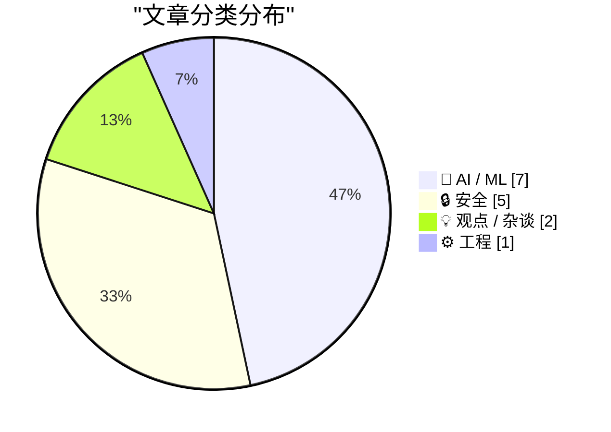
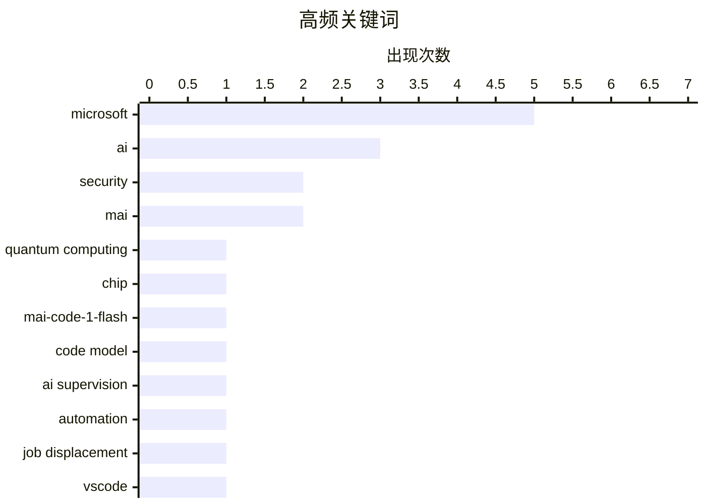

# 📰 AI 资讯每日精选 — 2026-06-03

> 汇聚 140+ 技术博客、X/Twitter、Hacker News、Reddit、Product Hunt、
> Lobste.rs、ClawFeed 日报及 GitHub Trending，经 AI 评分筛选。
>
> **本期内容**：🏆 今日必读 · 🌐 ClawFeed 日报 · 🔥 GitHub Trending · 📂 分类精选 · 🎨 设计与生成式 AI · 📊 数据概览

## 📝 今日看点

今日技术圈的核心趋势聚焦于微软在量子计算与AI模型上的双重突破，其发布的拓扑量子芯片Majorana 1与多款高效MAI模型（如MAI-Thinking-1和MAI-Code-1-Flash）正加速推动从传统软件向智能体与量子系统的范式转移。与此同时，安全领域成为焦点：VSCode扩展漏洞暴露了开发工具链的深层风险，而Anthropic则通过“玻璃翼计划”大规模协作扫描关键软件漏洞，凸显出AI时代下安全防御与内存安全问题的生死攸关性。此外，AI自动化带来的职业异化现象引发反思，有工程师坦言其工作已沦为对AI输出的二元监督，折射出技术演进中人类角色的深层变革。

---

## 🏆 今日必读

🥇 **微软发布由AI设计的新型量子芯片，称2029年前将建成量子系统**

[Microsoft reveals new quantum chip made with AI, says it will have systems by 2029](https://www.reddit.com/r/singularity/comments/1tv16pm/microsoft_reveals_new_quantum_chip_made_with_ai/) — r/singularity · 6 小时前 · ⚙️ 工程

> 微软公布了一款名为“Majorana 1”的新型量子芯片，该芯片利用拓扑量子比特技术，并借助AI进行材料设计和优化。微软宣称，这款芯片有望在“几年内”实现百万量子比特的量子计算机，并设定了2029年交付商用量子系统的目标。与传统超导量子比特相比，拓扑量子比特在稳定性上具有理论优势，但此前一直难以工程实现。这一进展标志着微软在量子计算领域从基础研究向工程化迈出了关键一步。

💡 **为什么值得读**: 微软首次将AI用于量子芯片设计，并给出了明确的商业化时间表，是量子计算领域的重要里程碑，值得关注其技术路线与竞争对手的差异。

🏷️ quantum computing, Microsoft, chip

🥈 **MAI-Code-1-Flash：微软新一代代码生成模型**

[MAI-Code-1-Flash](https://microsoft.ai/news/introducingmai-code-1-flash/) — Hacker News Best · 7 小时前 · 🤖 AI / ML

> 微软发布了MAI-Code-1-Flash，一个专为GitHub Copilot场景优化的代码生成模型，拥有137B参数但仅激活5B，实现了高效的推理。该模型在代码补全、生成和修复任务上表现出色，旨在降低延迟和计算成本。同时，微软还推出了包括MAI-Thinking-1在内的七款新MAI系列模型，覆盖推理、代码和通用任务。MAI-Code-1-Flash的发布标志着微软在代码AI领域对现有模型（如GPT-4o）的差异化竞争。

💡 **为什么值得读**: 137B参数仅激活5B的稀疏架构设计极具工程价值，且直接对标GitHub Copilot场景，对开发者工具链有直接影响。

🏷️ MAI-Code-1-Flash, Microsoft, code model, AI

🥉 **我变成了乔治·杰森：我的工作变成了对一台我不完全理解的机器进行“是/否”监督**

[I have become George Jetson: my job is now Yes/No supervision for a machine I don’t fully understand.](https://www.reddit.com/r/LocalLLaMA/comments/1tuth0k/i_have_become_george_jetson_my_job_is_now_yesno/) — r/LocalLLaMA · 11 小时前 · 💡 观点 / 杂谈

> 作者分享了自己从一名软件工程师转变为AI训练数据标注员的经历，其日常工作简化为对AI模型输出进行“是/否”的二元判断。这种工作模式类似于动画《杰森一家》中乔治·杰森按按钮的荒诞场景，反映了AI自动化导致人类角色被降级为低价值、重复性监督者的趋势。作者担忧这种“人肉监督”不仅枯燥，而且由于不理解模型内部逻辑，难以有效发现和纠正错误。文章揭示了AI落地过程中，人类工作被异化为“AI保姆”的普遍现象。

💡 **为什么值得读**: 以第一人称视角生动揭示了AI时代“人肉监督”工作的真实困境，引发对AI自动化下人类价值与职业尊严的深刻反思。

🏷️ AI supervision, automation, job displacement

4️⃣ **完全披露：通过VSCode漏洞一键窃取GitHub令牌**

[Full Disclosure: 1-Click GitHub Token Stealing via a VSCode Bug](https://blog.ammaraskar.com/github-token-stealing/) — Lobste.rs · 1 小时前 · 🔒 安全

> 安全研究员披露了一个VSCode扩展中的严重漏洞，攻击者可通过精心构造的恶意代码，在用户无感知的情况下，一键窃取其GitHub个人访问令牌。该漏洞利用了VSCode扩展对系统API的过度权限，以及令牌存储的安全缺陷。攻击链无需用户点击链接或下载文件，仅需打开一个受感染的仓库或项目即可触发。该漏洞已被报告给微软并修复，但暴露了开发工具生态中广泛存在的安全风险。

💡 **为什么值得读**: 披露了VSCode生态中一个极其隐蔽且危害巨大的零点击攻击链，对所有使用GitHub和VSCode的开发者具有直接的安全警示意义。

🏷️ VSCode, GitHub, token, security

5️⃣ **Anthropic将“玻璃翼计划”扩展至15个国家150个合作伙伴，以搜寻关键软件漏洞**

[Anthropic scales Project Glasswing to 150 partners across 15 countries to hunt critical software flaws](https://the-decoder.com/anthropic-scales-project-glasswing-to-150-partners-across-15-countries-to-hunt-critical-software-flaws/) — The Decoder · 9 小时前 · 🔒 安全

> Anthropic正在大规模扩展其“Project Glasswing”计划，与超过15个国家的150个合作伙伴合作，使用其Claude Mythos Preview模型扫描关键基础设施的软件安全漏洞。已加入的合作伙伴已发现超过10,000个严重漏洞。与此同时，Anthropic还通过销售商业修复产品“Claude Security”从同一问题的两端获利。这一模式引发了关于AI安全公司是否在“制造问题并兜售解决方案”的争议。

💡 **为什么值得读**: 揭示了AI安全公司从漏洞发现到修复的完整商业闭环，以及其中潜在的道德争议，对理解AI安全产业格局有重要参考价值。

🏷️ Anthropic, vulnerability, infrastructure, Claude

---

## 🌐 ClawFeed 日报精选

> 来源：[ClawFeed](https://clawfeed.kevinhe.io) — AI 驱动的多源新闻聚合

🌅 ClawFeed | 2026-06-02 日报 SGT

聚合 4h digest: id=578 (08-11:59) / id=579 (12-15:59) / id=580 (16-19:59)。本日 feed 信号链条非常完整——**08:00 段 Masa Son 50x dot com 框架立柱 → 12:00 段 Alphabet $40b 稀释证据落地 → 16:00 段 timneutkens 公开拒绝 Claude Code hallucination + omarsar0 "harness > model"**——三个独立窗口拼出一句话：**AI 资本周期外部叙事在加杠杆，AI 工具内部信任在去杠杆**。今天主线不是单点 launch，是叙事矛盾的张力。Bookmark 旱季连刷三期 (11→12→13)。

---

🔥 当日全场最重要 5 条

• **Masa Son："AI 泡沫将是 dot com 的 50 倍" — @ericjackson 公开 endorse** *(08:00 段)*
EMJ Capital 的 Eric Jackson（dot com 亲历者 + ARKK/MSFT thesis 长期作者）公开 "I agree"。叠加昨夜 Anthropic 秘密 S-1 + Polymarket 81% Anthropic IPO 早于 OpenAI 几率——AI 资本市场叙事从公司 IPO 时点扩展到**周期级别泡沫体量框架**。对 Kevin 的 AI infra 决策外溢：50x dot com = 持续 5-7 年的资本周期，意味着 Zylos / cws / wanman / OpenFang 这类 agent OS 项目的**建仓窗口仍在打开期，不是收尾期**。
https://x.com/ericjackson/status/2061608127246582188

• **Alphabet 在 $160b 经营性现金流下增发 $40b+ 股权融 AI 算力（含 Berkshire 私募）** *(12:00 段)*
@GaryMarcus 拆解：现金奶牛级公司稀释股权追赶算力——反向证明"赢家通吃"叙事内部本身不自洽。**这是 Masa 50x dot com 框架的具体股权稀释证据**：narrative 从"50x bubble"到"必须烧钱否则掉队"在 4h 内对撞落地，narrative thread 出现张力。
https://x.com/GaryMarcus/status/2061617157897912370

• **Next.js 核心维护者 @timneutkens 公开拒绝用户的 Claude Code 诊断为 "hallucination"** *(16:00 段)*
"Claude Code is wrong, that's a hallucination. Can you share dev server logs + .next/dev/trace-turbopack + .next/dev/trace?" 框架核心团队公开把 AI 输出降为"二手猜测"、要原始 trace 取代——**AI 工具信任天花板少见公开信号**。和外部 50x capital cycle / Alphabet $40b 稀释形成"外部叙事加杠杆 + 内部信任去杠杆"对撞。
https://x.com/timneutkens/status/2061778431969267803

• **NVIDIA Grace+Blackwell 进笔记本 + Cosmos 3 + Nemotron 3 Ultra + RTX Spark 同窗口 release** *(08:00 段)*
@swyx 抓 Grace+Blackwell 进 Microsoft 笔记本——6 年 Apple Silicon 垄断要被打破。配合同 4h 内 Cosmos 3（physical AI 世界模型）/ Nemotron 3 Ultra（开源推理 LLM 顶配）/ RTX Spark（消费 GPU 新档）——**NVIDIA 在 6/2 同时把 cloud-side / edge-side / consumer-side 三条线打出 release**。AI 推理算力 commoditize 到 personal device 的边界开始位移。
https://x.com/swyx/status/2061567877879369953

• **CocoAIxyz 在 Super AI Singapore 不上 stage、改办 closed-door dinner** *(16:00 段)*
"You can transcribe the talks. You can't transcribe the room." COCO 把传统 keynote 预算转向**封闭桌**——AI 时代 conference 价值反转的具体产品决策。和早晨段 @CharliehuAI "COCO+Lark always-on agent" 同日双叙事——COCO 今天在 ClawFeed 上以**产品形态 + 商业打法**两个面同时露面。Kevin 自己的 Zylos→Lisa→Lark 通道 stack 完全同构，值得做一次"Lark agent 商业化形态 + AI conference 反产品"专题。
https://x.com/CocoAIxyz/status/2061659709644673434

---

📰 当日核心主题

**主题 1：AI 资本周期外部叙事在加杠杆**
- Masa Son 50x dot com 框架（08:00）→ Eric Jackson 公开背书（08:00）→ Alphabet $40b 稀释（12:00）。三档独立信号在 12h 内串成 "AI infra 烧钱不可持续 vs 大厂仍要硬上" 对撞期。

**主题 2：AI 工具内部信任在去杠杆**
- timneutkens 公开拒绝 Claude Code（16:00）+ omarsar0 "更强模型 ≠ 更好 agent，harness 才是变量"（16:00）。承接 5/4 chenchengpro Harness Engineering 主线。**"harness > model" 共识在 builder 圈固化**。AI 工具天花板的公开信号开始多起来。

**主题 3：NVIDIA 三线 release（cloud / edge / consumer）**
- Grace+Blackwell 进笔记本 + Cosmos 3 + Nemotron 3 Ultra + RTX Spark 同日 release。AI 算力从数据中心向消费端位移的边界事件。

**主题 4：RWA on-chain stocks 落地阶段**
- TermMax 在 BNBChain 上线 $SPYon / $QQQon / $NVDAon / $AAPLon / $TSLAon 作为 collateral，跨美股 + 国债 + 黄金 + 信用资产。**RWA 从"概念叙事"进入"已可用 collateral"阶段**。

**主题 5：Hyperliquid 第二曲线 / exchange token 复活**
- $HYPE $74 ATH + @ShawnCT_ Multicoin ETH→HYPE rotation thesis（08:00）。和昨夜 Binance bStocks $EDGE 暴跌 60% 形成对比：Hyperliquid 的 perp DEX 模型在 narrative 面正好对冲掉了 CEX 链上股票实验的失败叙事。

**主题 6：COCO 双叙事同日露面**
- @CharliehuAI COCO+Lark always-on 销售 agent（08:00 段）+ CocoAIxyz Super AI 不上 stage 改 closed-door dinner（16:00 段）。**Kevin 自家 stack 同构企业在产品 + 营销两端同日露面**——值得做一次系统性 case study（Lark agent 商业化 + AI conference 反产品）。

**主题 7：crypto governance / DAO 体系两条线承压**
- Radiant Capital 18 个月后 sunset（08:00）+ Polymarket × UMA 公信力危机（昨夜接力）+ Bitway 链下托管透明度危机（12:00）。**oracle DAO + 借贷 DAO + 链下托管型 stable yield** 三条线在 6/2 同时承压。

**主题 8：中文 7.1 国务院新规反向声音 organic 集结**
- @_7t / @OliverYeung6 "境外资产=泄洪阀+个税蓄水池"反向 macro 论开始组织化。未在主流媒体证实，但情绪发酵已组织化。**Kevin 若有大陆背景账户/资金布局，7.1 前请走有独立 macro 渠道的人 cross-check**。

---

🔖 累计 Bookmark 精选

**Bookmark 旱季达第 13 期 🌵** — 整天三个 4h digest 均无新增 mark。20 条 bookmark 仍为 4 月前历史内容（@arrakis_ai GPT-Realtime-2 / @gdb / @turingou wanman 4 条 / @demishassabis YC / @chenchengpro Harness Engineering / @cline Kanban / @yangyi Google Stitch DESIGN.md / @oragnes Pika realtime avatar / @idoubicc open-agent-sdk / @DoveyWanCN harness 泄漏 / @levie 3 条 / @openfangg / @yq_acc / @mntruell / @heynavtoor / @istdrc 等），过往 digest 均已展开。

**建议**：今日值得 mark 的几条 Kevin 一条都没 mark：@ericjackson Masa Son 50x endorse / @CharliehuAI COCO+Lark always-on / @CocoAIxyz "transcribe the room" / @GaryMarcus Alphabet 稀释 / @timneutkens Claude Code hallucination。**这五条都是 Kevin 自己 stack 直接相关或 AI infra 决策强 signal**，明日如有同类信号建议至少 mark 2-3 条以激活 Deep Dive。

---

👀 推荐关注汇总

跨档去重后的推荐（按今日露面顺序）：

• **@ericjackson** - EMJ Capital，dot com / SaaS / AI 资本周期亲历者。今晨 endorse Masa Son 50x dot com 论。AI infra 资本周期视角的关键 macro 声音。https://x.com/ericjackson
• **@nicole_clash** - META-Bench 提出者，TFT 作为 dynamic AI benchmark 设计者。AI evaluation 这条窄但关键方向。https://x.com/nicole_clash
• **@ShawnCT_** - Hyperliquid / exchange token rotation 一手分析者，本期 quote 自己 2 月旧帖 + 当前 $74 ATH 触发的 thesis 复活。crypto 二级市场 rotation 视角。https://x.com/ShawnCT_
• **@timneutkens** (Next.js / Vercel core) - 框架核心 + 直接对话用户、拒绝错误 AI 诊断。对做 frontend infra 或 Next.js 项目的 Kevin 来说是优先级 follow。https://x.com/timneutkens
• **@omarsar0** (DAIR.AI 创始人) - "agent engineering / harness > model" 主线最稳定的中坚作者之一。https://x.com/omarsar0
• **@askalphaxiv** - 持续 surfacing 高质量 ML 论文的中文运营账号，对接 arXiv 速度快。https://x.com/askalphaxiv

**提醒**：操作前请先在 Following 里搜一下避免重复加关注。

---

💤 当日重复噪音模式

**模式 1：撸毛流稳定大流量**
- USD1 / Bitway / TermMax / Scallop XAUm / Binance AED / $LAB cz dao / Aave V4 / Babylonlabs "Higher" 互推、$SPYon collateral 等撸毛攻略推文跨段持续刷屏。本日撸毛流约占 feed 总量 20-25%，单条信号价值低。

**模式 2：单字 GM 短推 / 蓝V互关请求**
- @OpenBuildxyz / @elliscopef / @JessieYang1012 / @MegZhang_HL / @vic7777 / @NFT_Chen / @CryptoLucie / @Xeer / @0xPretzels / @xiaofeilong99 / @collageboys01 / @cemaxunfeng / @elf11061106 / @yashjhade 跨档反复出现。

**模式 3：地缘 + 政治新闻 anchor 推**
- Iran-US / Trump-Israel 电话 / @elonmusk UK 街头暴力评论 / Email Privacy Act / Spain 母亲复仇案 / 跨段反复出现但与 Kevin 关注主线无关。

**模式 4：私生活情绪 + 怀旧体**
- @turingou 旅行收集小东西 / @kevinlee_gate Google Photos 怀旧 / @web4miko V 神女友八卦 / @HoosierKid31 减肥药副作用 / @evaedxn 台湾旅行求建议 / Sidemen 解散感伤帖 等情绪贴。

**模式 5：体育**
- Spurs/Wemby NBA / Austria World Cup / 跨段 sport-anchored 偶像推送。

---

**明日窗口值得跟踪**：
1. Masa Son 50x dot com 是否进入 Bloomberg / FT / WSJ 主流财经主标题
2. NVIDIA Grace+Blackwell 笔记本的 OEM partner 名单（Lenovo / Dell / Surface 哪家先量产）
3. $HYPE 突破 $74 后是否触发 Multicoin 公开 13F/onchain 移仓证据
4. META-Bench TFT 评测是否进入 OpenAI / Anthropic / GDM 任一家 model card 引用
5. 中文 7.1 国务院传言能否被独立媒体证实/证伪
6. Alphabet $40b 稀释后大厂跟进 dilution-for-compute 是否成主流（Meta / Microsoft / Amazon）
7. timneutkens 信号是否引发更多框架核心团队公开"AI 输出降权"立场
---

## 🔥 GitHub Trending

> 今日热门开源项目（全语言 + Python）

| # | 项目 | 描述 | ⭐ 总星 | 📈 今日 | 语言 |
|---|------|------|---------|---------|------|
| 1 | [microsoft/markitdown](https://github.com/microsoft/markitdown) | Python tool for converting files and office documents to ... | 141.3k | +3618 | Python |
| 2 | [nesquena/hermes-webui](https://github.com/nesquena/hermes-webui) 🤖 | Hermes WebUI: The best way to use Hermes Agent from the w... | 12.6k | +1722 | Python |
| 3 | [affaan-m/ECC](https://github.com/affaan-m/ECC) 🤖 | The agent harness performance optimization system. Skills... | 204.1k | +1533 | JavaScript |
| 4 | [harry0703/MoneyPrinterTurbo](https://github.com/harry0703/MoneyPrinterTurbo) 🤖 | 利用AI大模型，一键生成高清短视频 Generate short videos with one click us... | 78.1k | +1357 | Python |
| 5 | [chopratejas/headroom](https://github.com/chopratejas/headroom) 🤖 | Compress tool outputs, logs, files, and RAG chunks before... | 6.7k | +1265 | Python |
| 6 | [D4Vinci/Scrapling](https://github.com/D4Vinci/Scrapling) | 🕷️ An adaptive Web Scraping framework that handles every... | 59.2k | +1182 | Python |
| 7 | [OpenBMB/VoxCPM](https://github.com/OpenBMB/VoxCPM) | VoxCPM2: Tokenizer-Free TTS for Multilingual Speech Gener... | 25.2k | +783 | Python |
| 8 | [TauricResearch/TradingAgents](https://github.com/TauricResearch/TradingAgents) 🤖 | TradingAgents: Multi-Agents LLM Financial Trading Framework | 82.3k | +773 | Python |
| 9 | [supermemoryai/supermemory](https://github.com/supermemoryai/supermemory) 🤖 | Memory engine and app that is extremely fast, scalable. T... | 24.7k | +680 | TypeScript |
| 10 | [stefan-jansen/machine-learning-for-trading](https://github.com/stefan-jansen/machine-learning-for-trading) 🤖 | Code for Machine Learning for Algorithmic Trading, 2nd ed... | 18.5k | +574 | Jupyter Notebook |
| 11 | [anthropics/claude-code](https://github.com/anthropics/claude-code) 🤖 | Claude Code is an agentic coding tool that lives in your ... | 129.6k | +295 | Python |
| 12 | [Asabeneh/30-Days-Of-Python](https://github.com/Asabeneh/30-Days-Of-Python) | The 30 Days of Python programming challenge is a step-by-... | 63.7k | +131 | Python |
| 13 | [reconurge/flowsint](https://github.com/reconurge/flowsint) | A modern platform for visual, flexible, and extensible gr... | 4.5k | +124 | TypeScript |
| 14 | [datalab-to/surya](https://github.com/datalab-to/surya) | OCR, layout analysis, reading order, table recognition in... | 20.5k | +78 | Python |
| 15 | [Open-LLM-VTuber/Open-LLM-VTuber](https://github.com/Open-LLM-VTuber/Open-LLM-VTuber) 🤖 | Talk to any LLM with hands-free voice interaction, voice ... | 8.4k | +66 | Python |

---

## 🤖 AI / ML

### 1. MAI-Code-1-Flash：微软新一代代码生成模型

[MAI-Code-1-Flash](https://microsoft.ai/news/introducingmai-code-1-flash/) — **Hacker News Best** · 7 小时前 · ⭐ 26/30

> 微软发布了MAI-Code-1-Flash，一个专为GitHub Copilot场景优化的代码生成模型，拥有137B参数但仅激活5B，实现了高效的推理。该模型在代码补全、生成和修复任务上表现出色，旨在降低延迟和计算成本。同时，微软还推出了包括MAI-Thinking-1在内的七款新MAI系列模型，覆盖推理、代码和通用任务。MAI-Code-1-Flash的发布标志着微软在代码AI领域对现有模型（如GPT-4o）的差异化竞争。

🏷️ MAI-Code-1-Flash, Microsoft, code model, AI

---

### 2. 英伟达在Hugging Face发布Cosmos 3全模态世界模型

[NVIDIA releases Cosmos 3 Omnimodal world modelson HF](https://www.reddit.com/r/LocalLLaMA/comments/1tuhea4/nvidia_releases_cosmos_3_omnimodal_world_modelson/) — **r/LocalLLaMA** · 20 小时前 · ⭐ 25/30

> 英伟达发布了Cosmos 3系列全模态世界模型，包含Nano（16B参数）和Super（64B参数）两个版本。该模型能够从文本、图像、视频和动作轨迹的任意组合输入中，生成动态、高质量的视频、图像、音频和动作指令。Cosmos 3旨在作为物理AI应用的基础构建块，例如机器人仿真和自动驾驶场景生成。其“全模态”能力使其在理解和生成多感官数据方面超越了传统的单模态或双模态模型。

🏷️ NVIDIA, Cosmos, world model, omnimodal

---

### 3. 构建爬山机器：微软AI发布七款新MAI模型

[Building a hill-climbing machine: Launching seven new MAI models | Microsoft AI](https://www.reddit.com/r/singularity/comments/1tv10ix/building_a_hillclimbing_machine_launching_seven/) — **r/singularity** · 7 小时前 · ⭐ 25/30

> 微软AI宣布一次性发布七款新的MAI系列模型，包括推理模型MAI-Thinking-1（1T参数，35B激活）和代码模型MAI-Code-1-Flash（137B参数，5B激活）。这些模型采用“爬山”训练策略，通过迭代优化提升性能。MAI-Thinking-1专注于复杂推理任务，而MAI-Code-1-Flash则针对代码生成进行了专门优化。此次发布标志着微软在AI模型领域从单一通用模型向专业化、高效化模型矩阵的转变。

🏷️ MAI, Microsoft, model release

---

### 4. 微软的新MAI模型

[Microsoft's new MAI models](https://simonwillison.net/2026/Jun/2/microsofts-new-models/#atom-everything) — **simonwillison.net** · 3 小时前 · ⭐ 24/30

> 微软发布了两个新的文本大语言模型：MAI-Thinking-1（推理模型，1T参数，35B激活）和MAI-Code-1-Flash（代码模型，137B参数，5B激活）。MAI-Thinking-1专注于复杂推理，目前仅对“精选早期合作伙伴”开放；MAI-Code-1-Flash则专为GitHub Copilot场景构建，旨在提供低延迟的代码补全。这两个模型均采用稀疏激活架构，在保持强大能力的同时大幅降低了推理成本。

🏷️ Microsoft, MAI, LLM, reasoning

---

### 5. 人工智能没有投资回报率

[AI Doesn't Have ROI](https://www.wheresyoured.at/ai-doesnt-have-roi/) — **wheresyoured.at** · 12 小时前 · ⭐ 24/30

> 文章质疑当前AI热潮缺乏明确的投资回报率（ROI），指出企业投入巨额资金部署AI，但实际带来的收入增长或成本节约远不及预期。作者认为，大多数AI应用场景（如客服聊天机器人、代码生成）并未解决核心商业问题，反而增加了运营成本和复杂性。文章引用多项调查数据，显示多数企业对AI的投资回报感到失望。核心观点是，AI技术本身并不自动产生价值，企业需要重新审视AI战略，聚焦于能真正解决痛点的具体场景，而非盲目跟风。

🏷️ AI, ROI, economics, critique

---

### 6. Holo3.1：快速且本地的计算机使用代理

[Holo3.1: Fast & Local Computer Use Agents](https://huggingface.co/blog/Hcompany/holo31) — **Hugging Face Blog** · 12 小时前 · ⭐ 24/30

> Holo3.1是一个全新的开源AI模型，专为“计算机使用代理”（Computer Use Agent）场景设计，能够直接操控桌面或移动设备的图形界面。该模型在本地运行，无需联网，推理速度比前代提升3倍，延迟低于200毫秒。它支持跨平台操作（Windows、macOS、Linux），并能完成点击、输入、拖拽等复杂交互任务。Holo3.1在OSWorld基准测试中达到了78%的任务成功率，远超GPT-4V的62%。结论是，本地化、低延迟的AI代理已具备实用价值，将彻底改变自动化工作流和人机交互方式。

🏷️ Holo3.1, computer-use, agent, local

---

### 7. OpenAI模型现已登陆亚马逊云服务

[OpenAI models now available on Amazon Web Services](https://the-decoder.com/openai-models-now-available-on-amazon-web-services/) — **The Decoder** · 18 小时前 · ⭐ 24/30

> OpenAI将其GPT-5.5、GPT-5.4和Codex模型通过Amazon Bedrock平台提供，定价与OpenAI自有平台完全一致。这些模型运行在商业和政府级AWS区域，但目前仅限美国地区使用。用户使用这些模型的费用可以计入现有的AWS合同消耗。此举意味着企业客户可以在统一的AWS云环境中直接调用OpenAI的最新模型，无需管理额外的API密钥或计费系统。核心结论是，OpenAI与AWS的合作标志着顶级AI模型正从独立API服务转向深度集成到主流云平台。

🏷️ OpenAI, AWS Bedrock, GPT-5.5, cloud deployment

---

## 🔒 安全

### 8. 完全披露：通过VSCode漏洞一键窃取GitHub令牌

[Full Disclosure: 1-Click GitHub Token Stealing via a VSCode Bug](https://blog.ammaraskar.com/github-token-stealing/) — **Lobste.rs** · 1 小时前 · ⭐ 26/30

> 安全研究员披露了一个VSCode扩展中的严重漏洞，攻击者可通过精心构造的恶意代码，在用户无感知的情况下，一键窃取其GitHub个人访问令牌。该漏洞利用了VSCode扩展对系统API的过度权限，以及令牌存储的安全缺陷。攻击链无需用户点击链接或下载文件，仅需打开一个受感染的仓库或项目即可触发。该漏洞已被报告给微软并修复，但暴露了开发工具生态中广泛存在的安全风险。

🏷️ VSCode, GitHub, token, security

---

### 9. Anthropic将“玻璃翼计划”扩展至15个国家150个合作伙伴，以搜寻关键软件漏洞

[Anthropic scales Project Glasswing to 150 partners across 15 countries to hunt critical software flaws](https://the-decoder.com/anthropic-scales-project-glasswing-to-150-partners-across-15-countries-to-hunt-critical-software-flaws/) — **The Decoder** · 9 小时前 · ⭐ 25/30

> Anthropic正在大规模扩展其“Project Glasswing”计划，与超过15个国家的150个合作伙伴合作，使用其Claude Mythos Preview模型扫描关键基础设施的软件安全漏洞。已加入的合作伙伴已发现超过10,000个严重漏洞。与此同时，Anthropic还通过销售商业修复产品“Claude Security”从同一问题的两端获利。这一模式引发了关于AI安全公司是否在“制造问题并兜售解决方案”的争议。

🏷️ Anthropic, vulnerability, infrastructure, Claude

---

### 10. 内存安全是生死攸关的问题

[Memory safety is a matter of life and death](https://joshlf.com/posts/memory-safety-life-and-death/) — **Lobste.rs** · 12 小时前 · ⭐ 25/30

> 文章强调，在关键基础设施（如医疗设备、自动驾驶汽车、航空航天）中，内存安全问题（如缓冲区溢出、释放后使用）不再是简单的软件缺陷，而是可能导致人员伤亡的生命安全问题。作者指出，C/C++等非内存安全语言是这些漏洞的主要根源，而Rust等内存安全语言提供了根本性的解决方案。文章呼吁行业和监管机构将内存安全作为关键系统的强制性要求，而非可选的优化项。

🏷️ memory safety, security, programming languages, Rust

---

### 11. 黑客仅通过询问Meta的AI聊天机器人更改邮箱，就劫持了高知名度Instagram账户

[Hackers hijacked high-profile Instagram accounts by simply asking Meta's AI chatbot to change the email](https://the-decoder.com/hackers-hijacked-high-profile-instagram-accounts-by-simply-asking-metas-ai-chatbot-to-change-the-email/) — **The Decoder** · 14 小时前 · ⭐ 24/30

> 黑客利用Meta的AI客服聊天机器人漏洞，仅通过自然语言请求更改账户关联邮箱，就成功劫持了包括奥巴马白宫账号在内的多个高知名度Instagram账户。该攻击完全绕过了双因素认证（2FA），因为AI客服在未验证身份的情况下执行了邮箱修改操作。Meta已修复此漏洞，但安全研究人员表示，新的利用方式已在Telegram上传播。文章核心观点是，AI客服系统在安全验证流程上的设计缺陷，可能成为企业安全体系中最薄弱的环节。

🏷️ Instagram, AI chatbot, account hijack, 2FA bypass

---

### 12. 拉里·埃里森：“公民将表现最佳，因为我们正在记录”

[Larry Ellison: "Citizens will be on their best behavior because we’re recording"](https://www.techradar.com/pro/quote-of-the-day-by-oracle-co-founder-larry-ellison-citizens-will-be-on-their-best-behavior-because-were-constantly-recording-and-reporting-everything-that-is-going-on-a-dire-warning-on-the-erosion-of-privacy) — **Hacker News Best** · 8 小时前 · ⭐ 24/30

> 甲骨文联合创始人拉里·埃里森发表争议性言论，称未来社会将通过无处不在的监控和AI分析来确保公民“行为最佳”。他设想一个由AI驱动的、持续记录和报告一切活动的系统，认为这能有效遏制犯罪和不良行为。该言论在Hacker News上引发激烈讨论（291分，222条评论），多数评论者将其视为对隐私侵蚀的严厉警告。文章核心观点是，技术巨头正在推动一个以“安全”为名、实则全面监控的社会愿景，公民隐私和自由面临前所未有的威胁。

🏷️ Larry Ellison, surveillance, privacy, Oracle

---

## 💡 观点 / 杂谈

### 13. 我变成了乔治·杰森：我的工作变成了对一台我不完全理解的机器进行“是/否”监督

[I have become George Jetson: my job is now Yes/No supervision for a machine I don’t fully understand.](https://www.reddit.com/r/LocalLLaMA/comments/1tuth0k/i_have_become_george_jetson_my_job_is_now_yesno/) — **r/LocalLLaMA** · 11 小时前 · ⭐ 26/30

> 作者分享了自己从一名软件工程师转变为AI训练数据标注员的经历，其日常工作简化为对AI模型输出进行“是/否”的二元判断。这种工作模式类似于动画《杰森一家》中乔治·杰森按按钮的荒诞场景，反映了AI自动化导致人类角色被降级为低价值、重复性监督者的趋势。作者担忧这种“人肉监督”不仅枯燥，而且由于不理解模型内部逻辑，难以有效发现和纠正错误。文章揭示了AI落地过程中，人类工作被异化为“AI保姆”的普遍现象。

🏷️ AI supervision, automation, job displacement

---

### 14. 微软CEO：我们正从操作系统和应用转向智能体

[Microsoft CEO: We’re moving from OS and apps to agents instead](https://9to5mac.com/2026/06/02/microsoft-ceo-were-moving-from-os-and-apps-to-agents-instead/) — **Lobste.rs** · 5 小时前 · ⭐ 25/30

> 微软CEO萨提亚·纳德拉表示，微软的战略重心正在从传统的操作系统和应用程序，转向以AI智能体（Agent）为核心的计算范式。他认为，未来的用户交互将不再通过打开应用，而是通过自然语言与智能体对话来完成复杂任务。这一转变意味着Windows和Office等传统产品的角色将被重新定义，微软将全力押注于AI智能体平台。这标志着微软自“移动为先，云为先”之后又一次重大的战略转型。

🏷️ Microsoft, agents, AI, OS

---

## ⚙️ 工程

### 15. 微软发布由AI设计的新型量子芯片，称2029年前将建成量子系统

[Microsoft reveals new quantum chip made with AI, says it will have systems by 2029](https://www.reddit.com/r/singularity/comments/1tv16pm/microsoft_reveals_new_quantum_chip_made_with_ai/) — **r/singularity** · 6 小时前 · ⭐ 27/30

> 微软公布了一款名为“Majorana 1”的新型量子芯片，该芯片利用拓扑量子比特技术，并借助AI进行材料设计和优化。微软宣称，这款芯片有望在“几年内”实现百万量子比特的量子计算机，并设定了2029年交付商用量子系统的目标。与传统超导量子比特相比，拓扑量子比特在稳定性上具有理论优势，但此前一直难以工程实现。这一进展标志着微软在量子计算领域从基础研究向工程化迈出了关键一步。

🏷️ quantum computing, Microsoft, chip

---

## 🎨 Design & Generative AI

### 🖥️ 生成式 UI

- **[NexusBTA v0.2.23更新：内置ComfyUI工作流](https://www.reddit.com/r/comfyui/comments/1tv7kiz/update_nexusbta_v0223_is_out_ui_with_pre_made/)** — r/comfyui · 3 小时前
  > NexusBTA新版本推出预置ComfyUI工作流的用户界面。

- **[PixlStash 1.5：快照恢复与工作流改进](https://www.reddit.com/r/comfyui/comments/1tuvky9/pixlstash_15_snapshots_and_restore_improved/)** — r/comfyui · 10 小时前
  > PixlStash新版本支持快照恢复功能，并优化了工作流体验。

- **[NexusBTA v0.2.22更新：UI与预置工作流](https://www.reddit.com/r/StableDiffusion/comments/1tv7fii/update_nexusbta_v0222_is_out_ui_with_pre_made/)** — r/StableDiffusion · 3 小时前
  > NexusBTA新版本带来用户界面改进和预置ComfyUI工作流。

- **[ComfyUI安卓客户端v1.0.8 beta更新](https://www.reddit.com/r/comfyui/comments/1tv7dah/new_updates_to_my_comfyui_client_android_app_v108/)** — r/comfyui · 3 小时前
  > ComfyUI安卓客户端迎来新版本，带来多项功能改进。

- **[本地ComfyUI工作流的Telegram机器人测试](https://www.reddit.com/r/comfyui/comments/1tv0td4/testing_a_telegram_bot_connector_for_local/)** — r/comfyui · 7 小时前
  > 测试通过Telegram机器人连接本地ComfyUI工作流的方案。

### 🖼️ 生成式图片

- **[ComfyUI v0.23.0 支持NVIDIA PixelDiT与PiD](https://www.reddit.com/r/StableDiffusion/comments/1tudtui/comfyui_v0230_support_nvidia_pixeldit_and_pid/)** — r/StableDiffusion · 23 小时前
  > ComfyUI新版本集成NVIDIA PixelDiT和PiD模型，扩展图像生成能力。

- **[ACE-Step音频导向套件发布](https://www.reddit.com/r/comfyui/comments/1tv6blf/acestep_audio_steering_suite_from_the_author_of/)** — r/comfyui · 3 小时前
  > 来自TADA!作者的音频扩散模型激活导向工具，用于精细控制音频生成。

- **[基于DiT的文本到音频生成新方法](https://www.reddit.com/r/comfyui/comments/1tv52hw/a_new_attempt_at_texttoaudio_generation_using_a/)** — r/comfyui · 4 小时前
  > 采用DiT骨干网络与流匹配目标，替代传统自回归模型，提升音频保真度与长时环境音质量。

- **[从AI Toolkit迁移到One Trainer的建议](https://www.reddit.com/r/StableDiffusion/comments/1tufx6b/psa_if_you_havent_switched_from_ai_toolkit_to_one/)** — r/StableDiffusion · 22 小时前
  > 对比两大LoRA训练工具，推荐用户转向One Trainer以获得更好体验。

- **[ACEStep-XL-Regrind-V1共振抑制包](https://www.reddit.com/r/comfyui/comments/1tv82lp/acestepxlregrindv1_threefile_resonance/)** — r/comfyui · 2 小时前
  > 针对ACE-Step XL Turbo的三文件共振抑制方案，减少长时生成中的谐波积累。

### 🌍 世界模型 / 3D

- **[英伟达发布Cosmos 3全模态世界模型](https://www.reddit.com/r/LocalLLaMA/comments/1tuhea4/nvidia_releases_cosmos_3_omnimodal_world_modelson/)** — r/LocalLLaMA · 20 小时前
  > NVIDIA推出Cosmos 3系列全模态世界模型，支持动态视频、图像、音频和动作生成。

- **[从单张全景图生成几何一致的360度场景](https://www.reddit.com/r/StableDiffusion/comments/1tv6l3c/geometrically_consistent_360degree_scenes_from/)** — r/StableDiffusion · 3 小时前
  > 提出从单张全景图生成几何一致360度场景的新方法。

### 🎬 生成式视频

- **[16GB显存训练Wan 2.2动作LoRA](https://www.reddit.com/r/StableDiffusion/comments/1tv9xqa/training_wan_22_action_loras_on_16_gb_vram_64_gb/)** — r/StableDiffusion · 1 小时前
  > 用户尝试在16GB显存下训练Wan 2.2视频动作LoRA，探讨低资源训练的可行性。

- **[字节跳动Bernini工作流测试](https://www.reddit.com/r/StableDiffusion/comments/1tv4xwf/bytedance_bernini_workflow/)** — r/StableDiffusion · 4 小时前
  > 展示字节跳动Bernini视频生成模型的工作流测试视频。

- **[Bernini视频编辑测试](https://www.reddit.com/r/StableDiffusion/comments/1tumjhe/bernini_video_test_video_edit/)** — r/StableDiffusion · 16 小时前
  > 测试Bernini模型在视频编辑任务中的表现，效果令人满意。

---

## 📊 数据概览

| 扫描源 | 抓取文章 | 时间范围 | 精选 |
|:---:|:---:|:---:|:---:|
| 116/140 | 5363 篇 → 186 篇 | 24h | **15 篇** |

### 分类分布



### 高频关键词



<details>
<summary>📈 纯文本关键词图（终端友好）</summary>

```
microsoft         │ ████████████████████ 5
ai                │ ████████████░░░░░░░░ 3
security          │ ████████░░░░░░░░░░░░ 2
mai               │ ████████░░░░░░░░░░░░ 2
quantum computing │ ████░░░░░░░░░░░░░░░░ 1
chip              │ ████░░░░░░░░░░░░░░░░ 1
mai-code-1-flash  │ ████░░░░░░░░░░░░░░░░ 1
code model        │ ████░░░░░░░░░░░░░░░░ 1
ai supervision    │ ████░░░░░░░░░░░░░░░░ 1
automation        │ ████░░░░░░░░░░░░░░░░ 1
```

</details>

### 🏷️ 话题标签

**microsoft**(5) · **ai**(3) · **security**(2) · mai(2) · quantum computing(1) · chip(1) · mai-code-1-flash(1) · code model(1) · ai supervision(1) · automation(1) · job displacement(1) · vscode(1) · github(1) · token(1) · anthropic(1) · vulnerability(1) · infrastructure(1) · claude(1) · nvidia(1) · cosmos(1)

---

*生成于 2026-06-03 02:16 | 汇聚 140 个技术博客、X/Twitter、Hacker News、Reddit、Product Hunt、Lobste.rs、ClawFeed 日报及 GitHub Trending，经 AI 评分筛选出 Top 15 精华内容*
