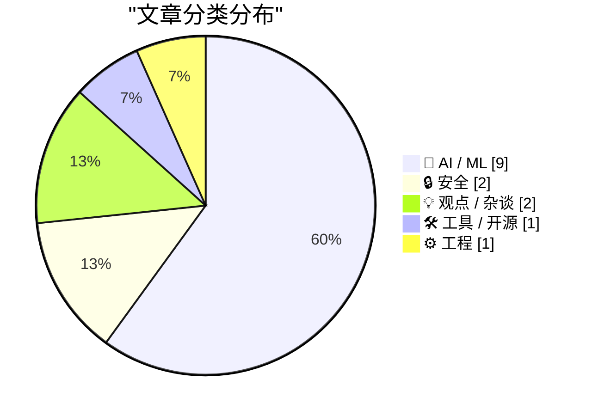
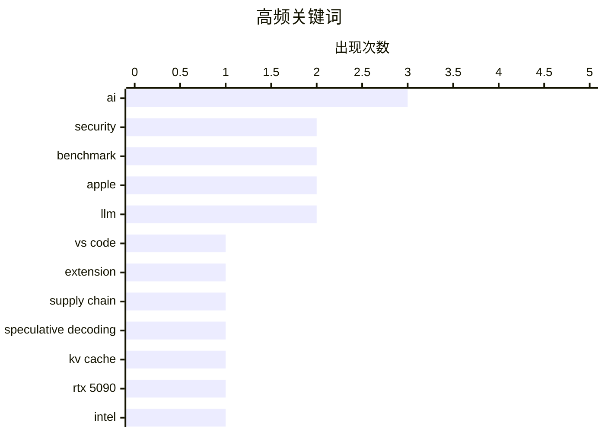

# 📰 AI 资讯每日精选 — 2026-06-09

> 汇聚 140+ 技术博客、X/Twitter、Hacker News、Reddit、Product Hunt、
> Lobste.rs、ClawFeed 日报及 GitHub Trending，经 AI 评分筛选。
>
> **本期内容**：🏆 今日必读 · 🌐 ClawFeed 日报 · 🔥 GitHub Trending · 📂 分类精选 · 🎨 设计与生成式 AI · 📊 数据概览

## 📝 今日看点

今日技术圈呈现三大焦点：AI 基础设施竞争白热化，谷歌与英伟达将英特尔视为台积电的备份方案，同时 OpenAI 秘密提交 IPO 草案，标志着行业资本化加速；模型性能分化加剧，DeepSeek V4 Pro 在精度上超越 GPT-5.5 Pro，但业界普遍认为 Scaling Laws 收益递减，AI 进步正在放缓；安全与隐私博弈升级，VS Code 引入延迟更新机制防范供应链攻击，而 Signal 则强烈反对英国监控法案，凸显技术社区对加密与监控的持续拉锯。

---

## 🏆 今日必读

🥇 **VS Code 新增 2 小时扩展自动更新延迟，以限制供应链攻击**

[VS Code Adds 2-Hour Extension Auto-Update Delay to Limit Supply Chain Attacks](https://www.reddit.com/r/programming/comments/1u089ai/vs_code_adds_2hour_extension_autoupdate_delay_to/) — r/programming · 11 小时前 · 🛠 工具 / 开源

> VS Code 引入了一项安全更新，将扩展的自动更新延迟 2 小时，旨在降低恶意软件通过受感染的扩展版本进行供应链攻击的风险。该机制为用户和系统管理员提供了缓冲时间，以便在更新大规模推送前发现并阻止恶意更新。此前，攻击者常通过劫持合法扩展的更新通道来分发恶意代码，而零延迟更新使得防御极为被动。这一改动直接回应了近年来针对 IDE 扩展的供应链攻击事件频发的问题。核心结论是，通过引入人为延迟，可以在不显著影响用户体验的前提下，大幅提升软件供应链的安全性。

💡 **为什么值得读**: 对于所有 VS Code 用户和关注软件供应链安全的开发者来说，这是一个直接影响日常开发安全性的重要策略变更，值得了解其背后的安全考量。

🏷️ VS Code, extension, supply chain, security

🥈 **[基准测试] DFlash 推测解码 + KV 缓存压缩在 RTX 5090 上实现 3.26 倍加速**

[[Benchmark] DFlash Speculative Decoding + KV Cache Compression on RTX 5090 — 3.26x Speedup](https://www.reddit.com/r/LocalLLaMA/comments/1u05t6u/benchmark_dflash_speculative_decoding_kv_cache/) — r/LocalLLaMA · 13 小时前 · 🤖 AI / ML

> 在 RTX 5090 上对 Qwen3.6-27B 模型进行的基准测试显示，结合 DFlash 推测解码与 KV 缓存压缩策略，推理速度获得了 3.26 倍的显著提升。该测试基于 BeeLlama.cpp 框架，通过让一个小模型草拟多个候选 token 并由大模型并行验证，同时压缩 KV 缓存以减少显存占用和带宽需求。这一组合方案有效缓解了本地大模型推理中显存带宽瓶颈的问题。结果表明，对于拥有大显存的消费级显卡，这种协同优化是提升本地推理性能的高效路径。

💡 **为什么值得读**: 如果你是本地大模型玩家或关注推理优化，这份实测数据直接展示了当前最前沿的推测解码与缓存压缩技术组合的实际收益，极具参考价值。

🏷️ speculative decoding, KV cache, RTX 5090, benchmark

🥉 **英特尔重获新生：谷歌和英伟达将其视为台积电的 AI 芯片备份方案**

[Intel gets a second life as Google and Nvidia explore it as a TSMC backup for AI chips](https://the-decoder.com/intel-gets-a-second-life-as-google-and-nvidia-explore-it-as-a-tsmc-backup-for-ai-chips/) — The Decoder · 8 小时前 · ⚙️ 工程

> 谷歌已向英特尔订购了超过 300 万颗 AI 芯片，计划于 2028 年交付；英伟达也正在测试英特尔的制造工艺，用于其下一代 Feynman 架构。这两大动作的背景是台积电的产能已无法满足 AI 芯片的爆发式需求。长期陷入困境的英特尔代工部门因此获得了罕见的第二次机会，成为重要的替代产能来源。核心观点是，地缘政治和产能瓶颈正在重塑全球芯片制造格局，英特尔有望借此翻身。

💡 **为什么值得读**: 这篇文章揭示了全球 AI 芯片供应链的关键转折点，对于理解未来芯片产业格局和投资趋势至关重要。

🏷️ Intel, AI chips, TSMC, manufacturing

4️⃣ **OpenAI 向 SEC 秘密提交 S-1 注册声明草案**

[OpenAI Submits S-1 Draft to SEC](https://openai.com/index/openai-submits-confidential-s-1/) — Hacker News Best · 4 小时前 · 🤖 AI / ML

> OpenAI 已向美国证券交易委员会（SEC）秘密提交了 S-1 注册声明草案，这是其启动首次公开募股（IPO）流程的关键一步。此举标志着 OpenAI 从非营利组织向上市公司的转型进入实质性阶段。S-1 文件将披露公司的财务状况、业务模式及风险因素，为投资者提供决策依据。这一消息引发了市场对其估值和未来盈利能力的广泛讨论。

💡 **为什么值得读**: 这是 OpenAI 走向 IPO 的里程碑事件，直接关系到 AI 行业未来的资本格局和公司治理透明度，所有关注 AI 商业化的读者都应关注。

🏷️ OpenAI, IPO, S-1, SEC

5️⃣ **监控不等于安全：Signal 就英国最新隐私威胁发表声明**

[Surveillance Is Not Safety: A statement on the UK's latest threat to privacy [pdf]](https://signal.org/blog/pdfs/2026-06-08-uk-surveillance-is-not-safety.pdf) — Hacker News Best · 5 小时前 · 🔒 安全

> Signal 发布声明，强烈反对英国政府提出的新监控法案，该法案试图削弱端到端加密以实施大规模监控。Signal 指出，强制扫描用户消息会破坏加密的根本安全性，为恶意行为者创造后门，并侵犯基本隐私权。声明强调，真正的安全应建立在强加密和用户信任之上，而非大规模监控。核心观点是，以安全为名削弱隐私，最终只会让所有人变得更不安全。

💡 **为什么值得读**: 这是 Signal 对英国政府最新隐私威胁的正面回应，对于任何关心数字隐私、加密技术和公民自由的读者来说，这是一份立场鲜明的必读文件。

🏷️ surveillance, privacy, UK, Signal

---

## 🌐 ClawFeed 日报精选

> 来源：[ClawFeed](https://clawfeed.kevinhe.io) — AI 驱动的多源新闻聚合

# 🗓 ClawFeed Daily | 2026-06-08 (SGT)

> 综合自 5 个 4h digest（ID #615, #618, #619, #620, #621, #622）
> 覆盖时段：SGT 00:00–23:59 | 素材总量：feed 219 + bookmarks 100 + followingSample 175

---

## 🔥 当日全场最重要 5 条

**1. Harness Engineering 概念正式命名 — 2026 AI 工程最重要发现**
同一模型、同一 benchmark 跑两次：42% → 78%，唯一变量是外层 harness（规则 + 工具 + 技能文件 + 反馈循环）。@heynavtoor 提出、@chenchengpro 中文版扩散，全天持续发酵。核心结论：优化 harness 比换模型更有效，agent 产品设计的底层逻辑需要重写。
来源: https://x.com/heynavtoor/status/2037200578842157462 | https://x.com/chenchengpro/status/2037332209003282747

**2. Anthropic recursive self-improvement 官方首次公开承认**
Anthropic 官方研究报告：内部数据显示 Claude 正在加速 AI 开发，可能已触及"AI 自主构建更强继任者"路径，比预期发展更快。这是 Anthropic 官方首次公开承认 recursive self-improvement 正在发生。
来源: https://x.com/AnthropicAI/status/2062728257359790292（via @levie）

**3. Claude Code Sourcemap 泄漏 → Harness 架构曝光**
@DoveyWanCN 点破核心：泄漏的真正杀伤力不在 CLI，而在于 harness 架构被完整曝光，对 Anthropic 企业级客户和联邦合同业务影响最大。@idoubicc 基于此逆向出 open-agent-sdk 替代 claude-agent-sdk（337K views），社区反应速度极快。
来源: https://x.com/DoveyWanCN/status/2038997433586425956 | https://x.com/idoubicc/status/2039006326882546141

**4. Aaron Levie（Box CEO）：Token 成本 = AI 规模化拐点 + 企业存储与 agent 工作流打通**
全天三条高密度推文：(a) token 成本已成所有企业客户头号议题——用量爆炸才会触发此问题，本质是 AI 到达"cost matters"拐点；(b) 80% 工作负载 12-18 个月内将运行在成本低 99% 的模型上；(c) Box 新增 Markdown 编辑器 + CLI + Box Drive 本地挂载，直接接入 Claude Code / Codex / Cursor / Obsidian——企业存储与 agent 工作流打通第一枪。
来源: https://x.com/levie/status/2063320673217609936 | https://x.com/levie/status/2063649508681224367 | https://x.com/levie/status/2063835799096090749

**5. NVIDIA Nemotron 3 Ultra 发布 + SpaceX IPO 倒计时**
- NVIDIA Nemotron 3 Ultra：550B 参数、1M context、美国最大开权重模型，速度最高 5x、成本低 30%，已接入 Cline。来源: https://x.com/cline/status/2062620668085297214
- SpaceX IPO 临近（6 月 12 日纳斯达克），估值 $1.77 万亿，认购窗口剩 4 天，要让估值合理化需 10 年实现 600 倍增长。来源: https://x.com/0xCheshire/status/2063891619653238978

---

## 📰 当日核心主题

### 主题 A：Harness Engineering（全天最强主线，跨 4 个 4h 窗口）
- 概念：harness = 模型外壳（规则/工具/技能/反馈循环），与模型本身同等重要甚至更重要
- 数据：同模型 42%→78% 性能提升，唯一变量是 harness 设计
- 连接：claude-code-sourcemap 泄漏 → harness 架构曝光 → 社区反应（open-agent-sdk）→ Cline Kanban 发布（harness 级别的多 agent 编排工具）
- 人物：@heynavtoor（英文原版）、@chenchengpro（中文普及）、@DoveyWanCN（企业影响分析）、@idoubicc（逆向工程实践）

### 主题 B：企业 AI 成本与规模化（Aaron Levie 主导）
- Box CEO 全天高密度输出：token 成本拐点 → 企业软件护城河消失 → Box 接入 agent 工作流
- 呼应：Claude 企业级使用占比遥遥领先（@Rasmic / @petergyang 调研）
- 对比：@levie 观点"AI 软件构建门槛归零同时差异化也消失"，与 @somewheresy "投资本地算力 = 计算主权"形成两种策略分野

### 主题 C：AI Coding Agent 工具生态
- Cline Kanban：独立 app，CLI-agnostic，Claude + Codex 双兼容，multi-agent worktree 编排
- Codex 百日挑战：社区化运营，每日授予 1 位 builder 10X 用量，社区运营差异化路线
- Google Stitch DESIGN.md：单 Markdown 文件传授设计系统（无需 Figma），40+ 预构建开源文件
- Claude Design → HTML/CSS/React 逆向工作流（@dotey HAR 解密）

### 主题 D：Agent OS 底层竞争
- OpenFang（@openfangg）：137k 行 Rust，MIT，Agent 运行在 WASM 沙盒（进程级隔离），YC F26 背书
- 与 OpenClaw 对比：路线更底层（kernel 级别），是最值得跟踪的竞争方向

### 主题 E：AI 生产力悖论
- @Yuchenj_UW 金句（147K views）："以前一周只能做 1 个无用 app，现在能做 67 个——每个都有 logo、落地页，0 个用户"
- 指向：AI 提升的是产出数量而非质量，真正的生产力革命还未到来
- 呼应：@demonyins "编程最难熬的不是写代码，是等 AI 跑完 E2E 循环"

### 主题 F：新加坡 AI 周（SuperAI SG 6 月 10-11）
- 全球 AI 圈物理聚集：Mike Krieger（Instagram 联创）、Jerry Yang（Yahoo 联创）、Vinod Khosla、Aidan Gomez（Cohere CEO）、Emad Mostaque
- CocoAI（@CocoAIxyz）坐主场，中美东南亚各路团队汇聚

---

## 🔖 累计 Bookmark 精选（跨窗口高频出现）

以下 bookmark 在当日 **3 个以上** 4h 窗口中反复出现，确认为高优先级：

| 内容 | 频次 | 链接 |
|------|------|------|
| Cursor CEO「AI 软件开发第三纪元」（7.2M views） | 3x | https://x.com/mntruell/status/2026736314272591924 |
| Google Stitch DESIGN.md（40+ 预构建，133K views） | 4x | https://x.com/yangyi/status/2040272305277079728 |
| Harness Engineering（42%→78%，128K views） | 4x | https://x.com/heynavtoor/status/2037200578842157462 |
| Cline Kanban 独立 app（multi-agent 编排） | 3x | https://x.com/cline/status/2037182739695493399 |
| open-agent-sdk（claude-code-sourcemap 逆向，337K views） | 3x | https://x.com/idoubicc/status/2039006326882546141 |
| DoveyWanCN harness 架构泄漏分析 | 3x | https://x.com/DoveyWanCN/status/2038997433586425956 |
| Chormex / GPT-Realtime-2 实时翻译（190K views，Greg Brockman 转发） | 2x | https://x.com/arrakis_ai/status/2053055460060618805 |
| MiMo-V2.5 API 降价 99%（@_LuoFuli） | 2x | https://x.com/_LuoFuli/status/2060672928367481000 |

---

## 👀 推荐关注汇总（去重）

以下账号在当日 **2 个以上** 4h 窗口被推荐：

| 账号 | 理由 | 频次 | 链接 |
|------|------|------|------|
| @_LuoFuli (Fuli Luo) | 前 DeepSeek，Xiaomi MiMo CSO，推理优化一手干货 | 3x | https://x.com/_LuoFuli |
| @heynavtoor (Nav Toor) | Harness Engineering 提出者，2026 AI 工程方法论最重要声音 | 2x | https://x.com/heynavtoor |
| @chenchengpro | Harness Engineering 中文普及，有数据说话的 AI 工程账号 | 2x | https://x.com/chenchengpro |
| @mntruell (Michael Truell) | Cursor CEO，AI coding 第三纪元叙事，7.2M views | 2x | https://x.com/mntruell |
| @arrakis_ai | Chormex 构建者，浏览器层 AI 工具，GPT-Realtime-2 落地 | 2x | https://x.com/arrakis_ai |

单窗口推荐（首次出现，值得关注）：
- @Yuchenj_UW (Yuchen Jin) — UW 系 AI 研究员，金句型 AI 洞察输出 https://x.com/Yuchenj_UW
- @openfangg — Agent OS 赛道，Rust + WASM，YC F26 https://x.com/openfangg
- @istdrc (stdrc) — slock.ai 创始人，前 Kimi CLI 作者，AI-as-teammate 实践 https://x.com/istdrc
- @thsottiaux (Tibo) — Codex 社区运营核心，掌握用量配额分配权 https://x.com/thsottiaux
- @0xCheshire — 深度商业分析（SpaceX IPO 逻辑），内容密度高 https://x.com/0xCheshire
- @sainingxie (Saining Xie) — AMI Labs 联创（与 LeCun 共同），Physical AI 前沿 https://x.com/sainingxie

---

## 💤 当日重复噪音模式

| 噪音模式 | 描述 | 出现窗口 |
|------|------|------|
| **互关刷粉帖** | "互关 3 秒+转"类内容，账号质量极低（@icyglobe, @alicejy1, @AfiaDimp_le, @DRbitcoin36 等） | 全天 5 个窗口均出现 |
| **Crypto KOL 入场/清仓信号** | 低质量价格预测 + 持仓告白，无分析支撑（@BTCzcv, @bitcoinlfgo, @fenseanna 等） | 4 个窗口 |
| **品牌推广伪装内容** | TRON/Deepcoin/OKX 付费内容，以普通推文形式出现（@youyou8178, @okxchinese 等） | 3 个窗口 |
| **GM/打卡类空洞内容** | 纯 gm + 表情，零信息密度（@web3XWG, @Soft6161, @ihorbielov 等） | 3 个窗口 |
| **本地生活碎片** | 西湖荷花、端午礼盒、KoreanAir 飞机评测等完全偏离 feed 主题 | 2 个窗口 |
| **政治转发（Elon Musk 账号）** | NHS 种族配额、India 出生率争议等政治内容，via @elonmusk 路径进入 feed | 2 个窗口 |

**核心建议**：feed 信噪比全天偏低（有效 AI/tech 信号占比约 15-20%），主要高质量内容集中在 bookmarks。可考虑降低 feed 抓取频率、提高 bookmark 权重。

---

*Daily digest generated: 2026-06-08 23:59 SGT*
*Source: 4h digest IDs #615, #618, #619, #620, #621, #622*
---

## 🔥 GitHub Trending

> 今日热门开源项目（全语言 + Python）

| # | 项目 | 描述 | ⭐ 总星 | 📈 今日 | 语言 |
|---|------|------|---------|---------|------|
| 1 | [mvanhorn/last30days-skill](https://github.com/mvanhorn/last30days-skill) 🤖 | AI agent skill that researches any topic across Reddit, X... | 34.6k | +3558 | Python |
| 2 | [RyanCodrai/turbovec](https://github.com/RyanCodrai/turbovec) | A vector index built on TurboQuant, written in Rust with ... | 8.9k | +1729 | Python |
| 3 | [roboflow/supervision](https://github.com/roboflow/supervision) 🤖 | We write your reusable computer vision tools. 💜 | 42.4k | +1288 | Python |
| 4 | [aaif-goose/goose](https://github.com/aaif-goose/goose) 🤖 | an open source, extensible AI agent that goes beyond code... | 48.1k | +699 | Rust |
| 5 | [Panniantong/Agent-Reach](https://github.com/Panniantong/Agent-Reach) 🤖 | Give your AI agent eyes to see the entire internet. Read ... | 24.2k | +679 | Python |
| 6 | [refactoringhq/tolaria](https://github.com/refactoringhq/tolaria) | Desktop app to manage markdown knowledge bases | 13.6k | +651 | TypeScript |
| 7 | [TapXWorld/ChinaTextbook](https://github.com/TapXWorld/ChinaTextbook) | 所有小初高、大学PDF教材。 | 73.0k | +592 | Roff |
| 8 | [TauricResearch/TradingAgents](https://github.com/TauricResearch/TradingAgents) 🤖 | TradingAgents: Multi-Agents LLM Financial Trading Framework | 84.5k | +546 | Python |
| 9 | [Imbad0202/academic-research-skills](https://github.com/Imbad0202/academic-research-skills) 🤖 | Academic Research Skills for Claude Code: research → writ... | 29.0k | +470 | Python |
| 10 | [google/skills](https://github.com/google/skills) 🤖 | Agent Skills for Google products and technologies | 12.4k | +461 | Python |
| 11 | [CopilotKit/CopilotKit](https://github.com/CopilotKit/CopilotKit) 🤖 | The Frontend Stack for Agents & Generative UI. React, Ang... | 34.1k | +378 | TypeScript |
| 12 | [yt-dlp/yt-dlp](https://github.com/yt-dlp/yt-dlp) | A feature-rich command-line audio/video downloader | 169.3k | +338 | Python |
| 13 | [luongnv89/claude-howto](https://github.com/luongnv89/claude-howto) 🤖 | A visual, example-driven guide to Claude Code — from basi... | 35.8k | +312 | Python |
| 14 | [santifer/career-ops](https://github.com/santifer/career-ops) 🤖 | AI-powered job search system built on Claude Code. 14 ski... | 50.5k | +308 | JavaScript |
| 15 | [openai/plugins](https://github.com/openai/plugins) 🤖 | OpenAI Plugins | 2.3k | +296 | JavaScript |

---

## 🤖 AI / ML

### 1. [基准测试] DFlash 推测解码 + KV 缓存压缩在 RTX 5090 上实现 3.26 倍加速

[[Benchmark] DFlash Speculative Decoding + KV Cache Compression on RTX 5090 — 3.26x Speedup](https://www.reddit.com/r/LocalLLaMA/comments/1u05t6u/benchmark_dflash_speculative_decoding_kv_cache/) — **r/LocalLLaMA** · 13 小时前 · ⭐ 27/30

> 在 RTX 5090 上对 Qwen3.6-27B 模型进行的基准测试显示，结合 DFlash 推测解码与 KV 缓存压缩策略，推理速度获得了 3.26 倍的显著提升。该测试基于 BeeLlama.cpp 框架，通过让一个小模型草拟多个候选 token 并由大模型并行验证，同时压缩 KV 缓存以减少显存占用和带宽需求。这一组合方案有效缓解了本地大模型推理中显存带宽瓶颈的问题。结果表明，对于拥有大显存的消费级显卡，这种协同优化是提升本地推理性能的高效路径。

🏷️ speculative decoding, KV cache, RTX 5090, benchmark

---

### 2. OpenAI 向 SEC 秘密提交 S-1 注册声明草案

[OpenAI Submits S-1 Draft to SEC](https://openai.com/index/openai-submits-confidential-s-1/) — **Hacker News Best** · 4 小时前 · ⭐ 26/30

> OpenAI 已向美国证券交易委员会（SEC）秘密提交了 S-1 注册声明草案，这是其启动首次公开募股（IPO）流程的关键一步。此举标志着 OpenAI 从非营利组织向上市公司的转型进入实质性阶段。S-1 文件将披露公司的财务状况、业务模式及风险因素，为投资者提供决策依据。这一消息引发了市场对其估值和未来盈利能力的广泛讨论。

🏷️ OpenAI, IPO, S-1, SEC

---

### 3. 苹果公布基于 Google Gemini 模型构建的全新 AI 架构

[Apple reveals new AI architecture built around Google Gemini models](https://www.macrumors.com/2026/06/08/apple-reveals-new-ai-architecture/) — **Hacker News Best** · 6 小时前 · ⭐ 26/30

> 苹果宣布其新的 AI 架构将深度集成 Google 的 Gemini 模型，而非完全依赖自研模型。这一架构将用于驱动 iOS 和 macOS 中的多项 AI 功能，包括更智能的 Siri 和系统级智能。此举标志着苹果在 AI 策略上的重大转变，从封闭自研转向与外部顶尖模型合作。核心结论是，苹果选择与 Google 合作，旨在快速为用户提供最先进的 AI 体验，而非在模型层进行重复造轮子。

🏷️ Apple, Gemini, AI, architecture

---

### 4. DeepSeek V4 Pro 在精度上击败 GPT-5.5 Pro

[DeepSeek V4 Pro beats GPT-5.5 Pro on precision](https://runtimewire.com/article/deepseek-v4-pro-beats-gpt-5-5-pro-on-precision) — **Hacker News Best** · 23 小时前 · ⭐ 26/30

> 最新的基准测试显示，DeepSeek V4 Pro 在多项精度相关的评测任务上超越了 OpenAI 的 GPT-5.5 Pro。该模型在数学推理、代码生成和科学问答等需要高准确率的场景中表现尤为突出。这一结果打破了 OpenAI 在顶尖 AI 模型精度上的垄断地位。核心观点是，开源和低成本模型正在迅速缩小与闭源巨头之间的性能差距，AI 领域的竞争格局正在被重塑。

🏷️ DeepSeek, GPT, LLM, benchmark

---

### 5. Anthropic 新科学博客：为什么 AI 在编程上的进步比生物学更快？

[New Science Blog: Why has AI advanced faster in coding than in biology? To agents, bio databases are like cities built before cars—maddening to drive...](https://x.com/AnthropicAI/status/2064054837294354677) — **𝕏 @AnthropicAI** · 6 小时前 · ⭐ 26/30

> Anthropic 发表博客探讨 AI 在编程领域进展神速而在生物学领域进展缓慢的原因。文章指出，生物学数据库就像“汽车发明前建造的城市”，其数据结构混乱、标准不一、互操作性差，使得 AI 代理难以高效导航和利用。相比之下，编程领域拥有高度结构化、标准化且机器友好的代码库和文档。核心观点是，要释放 AI 在生物学中的潜力，必须先构建适合 AI 代理使用的标准化数据基础设施。

🏷️ biology, AI agents, databases, infrastructure

---

### 6. 使用 NVIDIA Blackwell 上的 NVFP4 配合 JAX 和 MaxText 更快地训练模型

[Train Models Faster with JAX and MaxText Using NVFP4 on NVIDIA Blackwell](https://developer.nvidia.com/blog/train-models-faster-with-jax-and-maxtext-using-nvfp4-on-nvidia-blackwell/) — **NVIDIA Technical Blog** · 7 小时前 · ⭐ 25/30

> 预训练前沿大语言模型的核心瓶颈在于吞吐量，在数千个加速器上训练数万亿 token 时，每一步的微小提升都至关重要。NVIDIA 在 Blackwell 架构上引入了 NVFP4（4位浮点格式），通过将模型权重和激活值压缩至更低精度，显著减少内存占用和通信开销。结合 JAX 和 MaxText 框架，NVFP4 能在不显著牺牲模型质量的前提下，将训练吞吐量提升高达 2 倍。该方案利用了 Blackwell 的硬件级 4 位计算支持，实现了精度与效率的平衡。结论是，NVFP4 为大规模 LLM 训练提供了一条直接且高效的加速路径。

🏷️ JAX, MaxText, NVFP4, Blackwell

---

### 7. Siri AI

[Siri AI](https://www.apple.com/apple-intelligence/) — **Hacker News Best** · 7 小时前 · ⭐ 25/30

> Apple 正式发布了其个人智能系统 Apple Intelligence，深度集成于 iOS、iPadOS 和 macOS 中。该系统利用设备端大语言模型，在保护用户隐私的前提下，实现跨应用的情境感知和任务自动化。核心功能包括全新的 Siri 体验（支持屏幕感知和更自然的对话）、写作工具（重写、校对和摘要）、以及图像生成（Genmoji 和 Image Playground）。Apple Intelligence 采用私有云计算技术，在需要时可将复杂请求安全地卸载到专用服务器上。Apple 认为，真正的 AI 智能必须建立在隐私和用户控制的基础之上。

🏷️ Siri, Apple, AI, intelligence

---

### 8. MiMo-v2.5-Pro-UltraSpeed：1T 参数模型，每秒 1000 个 token

[MiMo-v2.5-Pro-UltraSpeed: 1T model with 1000 tokens per second](https://mimo.xiaomi.com/blog/mimo-tilert-1000tps) — **Hacker News Best** · 10 小时前 · ⭐ 25/30

> 小米发布了 MiMo-v2.5-Pro-UltraSpeed 模型，这是一个拥有 1 万亿参数的巨型模型，推理速度达到了惊人的每秒 1000 个 token。该模型在保持 1T 参数规模的同时，通过极致的模型架构优化和推理引擎加速，实现了此前难以想象的吞吐量。这一速度使得实时交互式应用（如对话、代码生成）成为可能，大幅降低了超大模型的使用门槛。小米声称该模型在多项基准测试中达到了业界领先水平。核心观点是，超大模型的推理速度瓶颈已被突破，万亿参数模型可以做到实时可用。

🏷️ MiMo, LLM, speed, 1T model

---

### 9. 为什么我放弃使用语义嵌入进行工具选择，并切换回 BM25

[Why I stopped using semantic embeddings for tool selection and switched back to BM25 [D]](https://www.reddit.com/r/MachineLearning/comments/1u07tlm/why_i_stopped_using_semantic_embeddings_for_tool/) — **r/MachineLearning** · 12 小时前 · ⭐ 25/30

> 作者在构建一个拥有约 140 个 MCP 暴露工具的 Agent 系统时，发现基于余弦相似度的语义嵌入（Embedding）工具选择方案在生产环境中表现危险。语义排名在 demo 中效果很好，但在真实场景下，用户查询的微小变化会导致工具选择不稳定，且无法处理工具名称和参数中的精确关键词匹配需求。作者最终切换回 BM25 算法，后者在精确匹配、可解释性和稳定性上显著优于语义嵌入。BM25 不仅召回更准确，而且延迟更低，无需维护嵌入向量库。核心观点是：对于工具选择这类高精度、低容错的任务，传统检索方法比花哨的语义方法更可靠。

🏷️ BM25, semantic embeddings, tool selection, agents

---

## 🔒 安全

### 10. 监控不等于安全：Signal 就英国最新隐私威胁发表声明

[Surveillance Is Not Safety: A statement on the UK's latest threat to privacy [pdf]](https://signal.org/blog/pdfs/2026-06-08-uk-surveillance-is-not-safety.pdf) — **Hacker News Best** · 5 小时前 · ⭐ 26/30

> Signal 发布声明，强烈反对英国政府提出的新监控法案，该法案试图削弱端到端加密以实施大规模监控。Signal 指出，强制扫描用户消息会破坏加密的根本安全性，为恶意行为者创造后门，并侵犯基本隐私权。声明强调，真正的安全应建立在强加密和用户信任之上，而非大规模监控。核心观点是，以安全为名削弱隐私，最终只会让所有人变得更不安全。

🏷️ surveillance, privacy, UK, Signal

---

### 11. 千次数据泄露之后，披露延迟问题反而更严重了

[1k Data Breaches Later, the Disclosure Lag Is Worse](https://www.troyhunt.com/1000-data-breaches-later-the-disclosure-lag-is-worse-than-ever/) — **Hacker News Best** · 22 小时前 · ⭐ 26/30

> Troy Hunt 基于其运营 Have I Been Pwned 的经验指出，尽管发生了超过 1000 起重大数据泄露事件，但组织向公众披露泄露事件的平均延迟时间反而变得更长了。许多公司在发现漏洞后数月甚至数年才通知用户，导致用户无法及时采取措施保护自己。文章分析了延迟披露背后的法律、商业和公关原因。核心结论是，当前的披露机制存在系统性缺陷，需要更强有力的法规和行业标准来推动及时披露。

🏷️ data breach, disclosure, security, Troy Hunt

---

## 💡 观点 / 杂谈

### 12. AI 正在放缓

[AI is slowing down](https://www.wheresyoured.at/ai-is-slowing-down/) — **Hacker News Best** · 9 小时前 · ⭐ 26/30

> 文章指出，当前 AI 大模型的性能提升速度正在显著放缓，预训练规模法则（Scaling Laws）的收益递减效应愈发明显。尽管算力投入仍在指数级增长，但模型在关键基准测试上的进步幅度却在收窄。作者认为，行业正从“暴力堆算力”的阶段转向需要更根本性算法创新的阶段。核心观点是，AI 领域的“黄金时代”可能正在结束，未来需要寻找新的突破路径。

🏷️ AI, slowdown, scaling, industry

---

### 13. 你可以 fork 一个包，但你能真正拥有它吗？

[You can fork a package, but can you own it?](https://www.reddit.com/r/programming/comments/1u0epow/you_can_fork_a_package_but_can_you_own_it/) — **r/programming** · 8 小时前 · ⭐ 25/30

> 文章探讨了开源生态中一个被忽视的治理问题：当核心维护者消失或项目停滞时，社区 fork 出的新包往往难以获得同样的信任和生态位。作者指出，fork 在技术上容易，但在法律、品牌和社区治理上存在巨大挑战，包括包名冲突、文档分裂、以及用户对“正统性”的认知惯性。文章以多个知名开源项目的 fork 案例（如 Node.js 的 io.js、Redis 的 Valkey）分析了成功与失败的关键因素。结论是，fork 只是第一步，真正的“拥有”需要建立新的治理结构和社区共识。

🏷️ open source, fork, ownership, governance

---

## 🛠 工具 / 开源

### 14. VS Code 新增 2 小时扩展自动更新延迟，以限制供应链攻击

[VS Code Adds 2-Hour Extension Auto-Update Delay to Limit Supply Chain Attacks](https://www.reddit.com/r/programming/comments/1u089ai/vs_code_adds_2hour_extension_autoupdate_delay_to/) — **r/programming** · 11 小时前 · ⭐ 27/30

> VS Code 引入了一项安全更新，将扩展的自动更新延迟 2 小时，旨在降低恶意软件通过受感染的扩展版本进行供应链攻击的风险。该机制为用户和系统管理员提供了缓冲时间，以便在更新大规模推送前发现并阻止恶意更新。此前，攻击者常通过劫持合法扩展的更新通道来分发恶意代码，而零延迟更新使得防御极为被动。这一改动直接回应了近年来针对 IDE 扩展的供应链攻击事件频发的问题。核心结论是，通过引入人为延迟，可以在不显著影响用户体验的前提下，大幅提升软件供应链的安全性。

🏷️ VS Code, extension, supply chain, security

---

## ⚙️ 工程

### 15. 英特尔重获新生：谷歌和英伟达将其视为台积电的 AI 芯片备份方案

[Intel gets a second life as Google and Nvidia explore it as a TSMC backup for AI chips](https://the-decoder.com/intel-gets-a-second-life-as-google-and-nvidia-explore-it-as-a-tsmc-backup-for-ai-chips/) — **The Decoder** · 8 小时前 · ⭐ 26/30

> 谷歌已向英特尔订购了超过 300 万颗 AI 芯片，计划于 2028 年交付；英伟达也正在测试英特尔的制造工艺，用于其下一代 Feynman 架构。这两大动作的背景是台积电的产能已无法满足 AI 芯片的爆发式需求。长期陷入困境的英特尔代工部门因此获得了罕见的第二次机会，成为重要的替代产能来源。核心观点是，地缘政治和产能瓶颈正在重塑全球芯片制造格局，英特尔有望借此翻身。

🏷️ Intel, AI chips, TSMC, manufacturing

---

## 🎨 Design & Generative AI

### 🖼️ 生成式图片

- **[Ideogram 4 并非被高估，而是被低估了](https://www.reddit.com/r/StableDiffusion/comments/1tzwl34/ideogram_4_isnt_overhyped_its_underrated/)** — r/StableDiffusion · 22 小时前
  > 作者认为 Ideogram 4 在众多新模型中表现突出，值得更多关注。

- **[Ideogram 4.0 对角色和 IP 的理解令人惊叹](https://www.reddit.com/r/StableDiffusion/comments/1u0e1g0/ideogram_40s_understanding_of_characters_and_ip/)** — r/StableDiffusion · 8 小时前
  > 作为开放模型，Ideogram 4.0 在角色和 IP 还原上表现出色。

- **[Ideogram 4 模型很棒，但许可证限制太严](https://www.reddit.com/r/StableDiffusion/comments/1u05cmh/ideogram_4_model_is_great_but_license_is_very/)** — r/StableDiffusion · 13 小时前
  > 用户指出该模型几乎禁止任何商业用途，包括为客户设计或自由职业工作。

- **[Ideogram 4 适合动漫/插画吗？](https://www.reddit.com/r/StableDiffusion/comments/1tzwnhm/ideogram_4_for_animeilustrations/)** — r/StableDiffusion · 21 小时前
  > 用户对 Ideogram 4 的输出质量和区域提示功能印象深刻，并询问其在动漫领域的表现。

- **[如何在数百次生成中保持同一张脸——Z-Image Turbo LoRA 设置](https://www.reddit.com/r/comfyui/comments/1u0a1or/how_i_keep_the_same_face_across_hundreds_of_gens/)** — r/comfyui · 10 小时前
  > 分享了一套 LoRA 设置，有效解决了人脸漂移问题，需要 60 张光照多样的图片数据集。

- **[Ideogram 4 超大分辨率测试：8MP、48步、RTX 4090 耗时21分钟](https://www.reddit.com/r/StableDiffusion/comments/1u08l3e/ideogram_4_hugeres_test_8mp_48_steps_21_min_on/)** — r/StableDiffusion · 11 小时前
  > 测试了 Ideogram 4 在超高分辨率下的生成性能和时间消耗。

- **[Ideogrammar——Ideogram 4 提示词编辑器](https://www.reddit.com/r/StableDiffusion/comments/1u0429g/ideogrammar_ideogram_4_prompt_editor/)** — r/StableDiffusion · 15 小时前
  > 一个专门为 Ideogram 4 设计的提示词编辑工具。

- **[Alphgreed 模型现已发布](https://www.reddit.com/r/StableDiffusion/comments/1u0hpdc/alphgreed_out_now/)** — r/StableDiffusion · 6 小时前
  > 作者发布了新模型 Alphgreed，并提供了 Civitai 链接和工作流。

- **[Ideogram BBox 编辑器](https://www.reddit.com/r/comfyui/comments/1u0fqhb/ideogram_bbox_editor/)** — r/comfyui · 7 小时前
  > 用户为本地运行的 Ideogram 4 开发了一个 JSON 提示词和边界框编辑器。

- **[修复 Prompt Relay 在末尾循环图像的问题](https://www.reddit.com/r/comfyui/comments/1u08e90/fix_for_prompt_relay_cycling_images_at_the_end/)** — r/comfyui · 11 小时前
  > 提供了解决 Prompt Relay 在生成结束时图像循环问题的修复方法。

- **[Gemini 浏览器节点](https://www.reddit.com/r/comfyui/comments/1u06p6l/gemini_browser_node/)** — r/comfyui · 12 小时前
  > 用户创建了一个 ComfyUI 节点，用于自动化批量生成 Google Gemini Nano Banana 图像。

- **[NexusBTA v0.2.28 更新：带预设工作流的 UI](https://www.reddit.com/r/comfyui/comments/1u0k6yc/update_nexusbta_v0228_is_out_ui_with_pre_made/)** — r/comfyui · 4 小时前
  > 新版本 UI 集成了预制的 ComfyUI 工作流，方便用户使用。

- **[Ideogram 4 使用体验](https://www.reddit.com/r/StableDiffusion/comments/1tzva1m/ideogram_4/)** — r/StableDiffusion · 23 小时前
  > 用户分享了使用 Ideogram 4 质量模式、平衡模式和 Turbo 模式的感受。

- **[对 Ideogram 4 进行全秩微调](https://www.reddit.com/r/StableDiffusion/comments/1u0c8uk/fullrank_finetuning_ideogram4/)** — r/StableDiffusion · 9 小时前
  > 作者正在重新制作数据集，并计划进行数周的持续训练，分享了初步经验。

### 🎬 生成式视频

- **[AMD 显卡用户视频生成问题解决方案](https://www.reddit.com/r/comfyui/comments/1u00wcd/for_those_with_amd_graphiccards_where/)** — r/comfyui · 18 小时前
  > 针对 AMD 显卡在视频生成中遇到的问题，提供了具体的解决步骤。

---

## 📊 数据概览

| 扫描源 | 抓取文章 | 时间范围 | 精选 |
|:---:|:---:|:---:|:---:|
| 115/140 | 5358 篇 → 208 篇 | 24h | **15 篇** |

### 分类分布



### 高频关键词



<details>
<summary>📈 纯文本关键词图（终端友好）</summary>

```
ai                   │ ████████████████████ 3
security             │ █████████████░░░░░░░ 2
benchmark            │ █████████████░░░░░░░ 2
apple                │ █████████████░░░░░░░ 2
llm                  │ █████████████░░░░░░░ 2
vs code              │ ███████░░░░░░░░░░░░░ 1
extension            │ ███████░░░░░░░░░░░░░ 1
supply chain         │ ███████░░░░░░░░░░░░░ 1
speculative decoding │ ███████░░░░░░░░░░░░░ 1
kv cache             │ ███████░░░░░░░░░░░░░ 1
```

</details>

### 🏷️ 话题标签

**ai**(3) · **security**(2) · **benchmark**(2) · apple(2) · llm(2) · vs code(1) · extension(1) · supply chain(1) · speculative decoding(1) · kv cache(1) · rtx 5090(1) · intel(1) · ai chips(1) · tsmc(1) · manufacturing(1) · openai(1) · ipo(1) · s-1(1) · sec(1) · surveillance(1)

---

*生成于 2026-06-09 01:34 | 汇聚 140 个技术博客、X/Twitter、Hacker News、Reddit、Product Hunt、Lobste.rs、ClawFeed 日报及 GitHub Trending，经 AI 评分筛选出 Top 15 精华内容*
