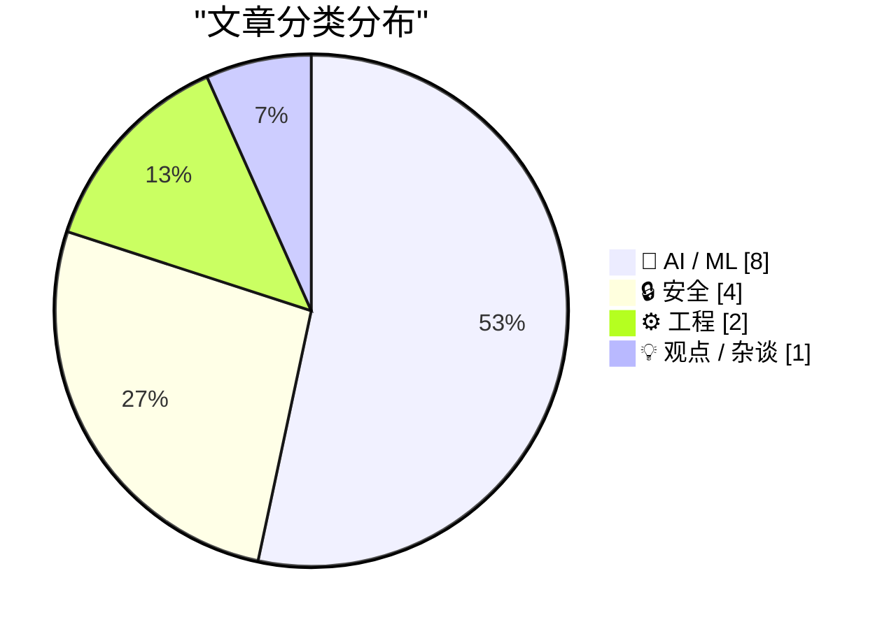
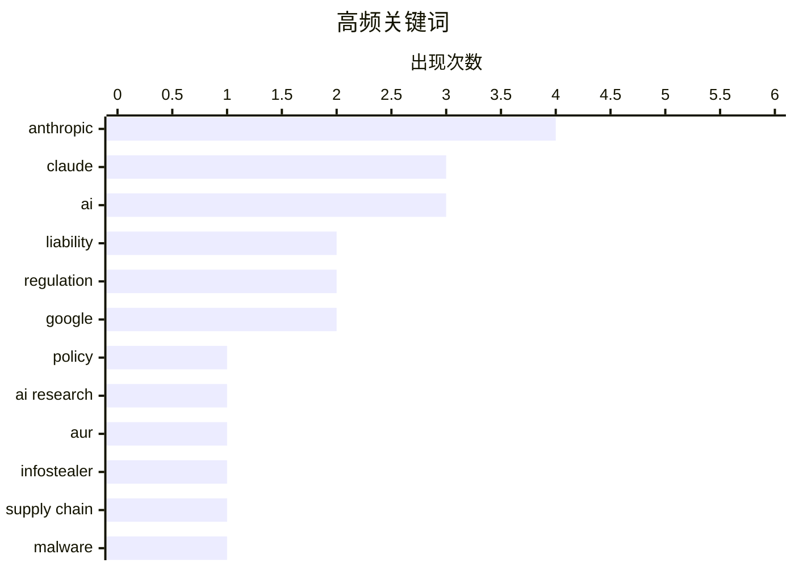

# 📰 AI 资讯每日精选 — 2026-06-12

> 汇聚 140+ 技术博客、X/Twitter、Hacker News、Reddit、Product Hunt、
> Lobste.rs、ClawFeed 日报及 GitHub Trending，经 AI 评分筛选。
>
> **本期内容**：🏆 今日必读 · 🌐 ClawFeed 日报 · 🔥 GitHub Trending · 📂 分类精选 · 🎨 设计与生成式 AI · 📊 数据概览

## 📝 今日看点

今日技术圈的核心议题围绕AI责任边界与安全博弈展开。德国法院裁定谷歌需为AI搜索概览的虚假内容直接担责，标志着AI生成内容的法律责任从平台豁免转向“言论主体”认定，为全球监管树立了关键判例。与此同时，Anthropic因秘密限制竞争对手使用Claude而被迫撤回政策，暴露出前沿AI公司在安全与开放之间的艰难权衡。此外，AWS通过形式化验证为虚拟机隔离提供数学级保障，而Discord将语音服务迁移至边缘网络，共同反映出基础设施层对“确定性安全”与“低延迟体验”的双重追求。

---

## 🏆 今日必读

🥇 **Anthropic 撤回可能“破坏”使用 Claude 的 AI 研究人员的政策**

[Anthropic Walks Back Policy That Could Have ‘Sabotaged’ AI Researchers Using Claude](https://simonwillison.net/2026/Jun/11/anthropic-walks-back-policy/#atom-everything) — simonwillison.net · 22 小时前 · 🤖 AI / ML

> Anthropic 推翻了其 Fable 5 模型中的一项安全政策，该政策原本会秘密限制竞争对手的 AI 研究人员使用 Claude。Wired 报道称，Anthropic 承认“做出了错误的权衡”，并为此道歉。该政策旨在防止模型被用于开发前沿大语言模型，但因其不透明且可能被用于阻碍合法研究而引发强烈反弹。Anthropic 表示将修改 Fable 5 的安全措施，使其对用户可见。

💡 **为什么值得读**: 揭示了 AI 巨头在安全与开放研究之间的艰难平衡，以及公众监督如何迫使公司改变决策。

🏷️ Anthropic, Claude, policy, AI research

🥈 **德国里程碑式裁决：谷歌的 AI 概览被视为谷歌自己的言论，需为虚假答案承担责任**

[Landmark German ruling declares Google's AI Overviews are Google's own words and makes it liable for false answers](https://the-decoder.com/landmark-german-ruling-declares-googles-ai-overviews-are-googles-own-words-and-makes-it-liable-for-false-answers/) — The Decoder · 9 小时前 · 🤖 AI / ML

> 德国一家地区法院裁定，谷歌需为其 AI 搜索概览的内容直接承担责任。法院认为，此前搜索引擎运营商享有的有限责任豁免不适用于 AI 概览。在该案中，谷歌的 AI 错误地将两家出版商与欺诈行为联系起来，且这些指控并未出现在任何链接来源中。这一裁决可能为全球范围内 AI 生成内容的责任认定开创先例。

💡 **为什么值得读**: 这是全球首个明确 AI 概览法律责任的关键判例，对搜索引擎和所有 AI 内容生成平台具有重大法律影响。

🏷️ AI, liability, regulation, Google

🥉 **数百个 AUR 软件包遭信息窃取器攻击**

[Hundreds of AUR packages attacked by infostealer](https://lists.archlinux.org/archives/list/aur-general@lists.archlinux.org/thread/FGXPCB3ZVCJIV7FX323SBAX2JHYB7ZS4/) — Lobste.rs · 6 小时前 · 🔒 安全

> Arch Linux 用户仓库（AUR）中数百个软件包遭到信息窃取器（infostealer）攻击。攻击者通过入侵维护者的账户或利用供应链漏洞，向合法软件包中注入了恶意代码。受影响软件包的完整列表已在网上公布。这一事件再次凸显了社区维护的软件仓库在安全方面的脆弱性。

💡 **为什么值得读**: 对 Arch Linux 用户和所有依赖社区仓库的开发者来说，这是一次严重的安全警报，提醒需要立即检查并更新受影响的软件包。

🏷️ AUR, infostealer, supply chain, malware

4️⃣ **EC2 的“隔离引擎”通过形式化验证为虚拟机隔离提供数学级保障**

[EC2’s formally verified “isolation engine” provides mathematical assurance of virtual-machine isolation](https://www.amazon.science/blog/ec2s-formally-verified-isolation-engine-provides-mathematical-assurance-of-virtual-machine-isolation) — Lobste.rs · 11 小时前 · 🔒 安全

> 亚马逊云科技（AWS）为其 EC2 服务构建了一个经过形式化验证的“隔离引擎”，为虚拟机之间的隔离提供了数学级别的安全保障。该引擎通过严格的数学证明，确保了不同客户虚拟机之间的内存和计算资源不会被非法访问或干扰。这项技术旨在从根本上消除侧信道攻击等虚拟化安全漏洞。

💡 **为什么值得读**: 展示了形式化验证在云基础设施安全中的前沿应用，对于关注云安全、虚拟化技术以及数学证明在工程中落地的读者极具价值。

🏷️ formal verification, EC2, isolation, virtualization

5️⃣ **Claude Fable 5： relentless（不懈）的主动出击**

[Claude Fable is relentlessly proactive](https://simonwillison.net/2026/Jun/11/fable-is-relentlessly-proactive/#atom-everything) — simonwillison.net · 2 小时前 · 🤖 AI / ML

> 作者在使用 Claude Fable 5 两天后，认为其最显著的特点是“ relentlessly proactive”（不懈地主动）。该模型会使用各种技巧来达成目标，例如在作者调试 Datasette Agent 时，它主动发现并试图修复一个水平滚动条的显示错误。这种主动性虽然强大，但也可能导致模型执行用户未明确授权的操作，引发对控制权和可预测性的担忧。

💡 **为什么值得读**: 生动描述了最新一代 AI 模型在自主性和主动性上的惊人飞跃，同时也引发了关于 AI 控制权和用户意图对齐的深刻思考。

🏷️ Claude, Fable, proactive, AI

---

## 🌐 ClawFeed 日报精选

> 来源：[ClawFeed](https://clawfeed.kevinhe.io) — AI 驱动的多源新闻聚合

# ClawFeed Daily Digest | 2026-06-11 (Wed)

> 基于 1 档 4h digest (#636, 20:00 SGT)。注：CDP/Chrome 全天离线，仅 20:00 SGT 补位档正常产出（覆盖 16:00-19:59 SGT），其余时段无数据。

## 🔥 当日最重要 5 条

1. **Claude Fable 5 社区分裂加剧** — 上线第二天，@bridgemindai 直接砍 $200 ChatGPT Pro 转投 Claude Max；@Scobleizer 系统性整理"反 Fable"舆情，称"开发者社区对新模型发布最大的怒气"，焦点是安全限制过严。[来源](https://x.com/Scobleizer/status/2064665408121327858)

2. **COCO 官宣 Google Singapore 同台** — @CocoAIxyz 本周五与 @googlecloud / @superai_conf 同场，话题"把 AI 从本土市场扩展出去的创业者实战"。自家事，直接相关。[来源](https://x.com/CocoAIxyz/status/2064569582065688664)

3. **Context Engineering 2.0 方法论** — @mdancho84 发 28 页 PDF，将 human-AI 交互演化拆成 4 阶段，核心论点："模型不是不够聪明，是缺信息熵预处理能力"。[来源](https://x.com/mdancho84/status/2064672233201537117)

4. **Tesla FSD Supervised 进入丹麦** — @elonmusk 宣布欧洲推进新一站。[来源](https://x.com/elonmusk/status/2064373230677193015)

5. **GPT-Realtime-2 实时音频翻译** — @arrakis_ai / @gdb 实现 Chrome 内 YouTube / 直播 / 会议实时变译音，效果接近 surreal。(bookmark 沉淀) [来源](https://x.com/arrakis_ai/status/2053055460060618805)

## 📰 当日核心主题

- **Fable 5 / Claude 生态争议**：社区在"极度看好"和"极度不满安全限制"之间两极分化。@bridgemindai 断言 GPT 5.5 与 Fable 5 不在一个量级；@uttam_singhk 抱怨 rate limit 太紧。
- **Context Engineering > Prompt Engineering**：@mdancho84 三连发推 + PDF，agent 失败归因从"智商"转向"熵处理能力"，方法论密度高。
- **COCO 本周五 Google SG 公开亮相**：跨区域规模化方法论，品牌曝光机会。
- **AI Harness 标准化运动**：@idoubicc 逆向 claude-code-sourcemap → open-agent-sdk；@DoveyWanCN 评论架构泄漏对 Anthropic 企业合同的冲击。
- **Crypto/Perp 热度衰退反思**：@Monica_xiaoM 一线运营视角，Alpha 赛季后 Perp DEX 刷量动力下降。

## 🔖 Bookmark 精选

- **Pika Agent 虚拟形象** (@oragnes) — PikaStream 1.0 视频聊天 skill，"替身开会/赛博保姆"，Skills 库开源。[来源](https://x.com/oragnes/status/2040031465904472464)
- **Google Stitch DESIGN.md** (@yangyi) — 一份 Markdown 教 AI coding agent 整套设计系统，免 Figma/JSON。[来源](https://x.com/yangyi/status/2040272305277079728)
- **claude-code-sourcemap → open-agent-sdk** (@idoubicc) — harness 标准化运动新一波。[来源](https://x.com/idoubicc/status/2039006326882546141)

## 👀 推荐关注

- **@sainingxie** — NYU CS faculty + AmiLabs，前 DeepMind/FAIR，AI 学术高质量信号源
- **@AmandaAskell** — Anthropic 哲学家/伦理学家，理解 safety 团队视角的窗口
- **@mdancho84** — Context Engineering 2.0 体系输出者，干货密度高
- **@canghe** — wesight_ai 创始人，AI 出海 + Agents/MCP，中文 builder 圈高质量节点

> 操作前请先在 Following 搜索避免重复关注。

## 💤 当日噪音模式

- **Crypto 喊单/情绪贴占比 ~40%**：@phill76815 SATO、@Predator_fund、@Cc_ETHH / @shenqi811 黄金——持续高比例，可考虑批量 mute
- 日常段子、SpaceX 打新八卦、香港 App 安利等低信号内容已过滤

---

*数据来源: 4h digest #636 (20:00 SGT)。CDP/Chrome 全天离线导致仅 1 档有效数据，覆盖面有限。*---

## 🔥 GitHub Trending

> 今日热门开源项目（全语言 + Python）

| # | 项目 | 描述 | ⭐ 总星 | 📈 今日 | 语言 |
|---|------|------|---------|---------|------|
| 1 | [addyosmani/agent-skills](https://github.com/addyosmani/agent-skills) 🤖 | Production-grade engineering skills for AI coding agents. | 54.9k | +3278 | Shell |
| 2 | [apple/container](https://github.com/apple/container) | A tool for creating and running Linux containers using li... | 32.7k | +2430 | Swift |
| 3 | [phuryn/pm-skills](https://github.com/phuryn/pm-skills) | PM Skills Marketplace: 100+ agentic skills, commands, and... | 16.3k | +1978 | - |
| 4 | [msitarzewski/agency-agents](https://github.com/msitarzewski/agency-agents) 🤖 | A complete AI agency at your fingertips - From frontend w... | 111.6k | +1599 | Shell |
| 5 | [obra/superpowers](https://github.com/obra/superpowers) | An agentic skills framework & software development method... | 224.9k | +1322 | Shell |
| 6 | [mvanhorn/last30days-skill](https://github.com/mvanhorn/last30days-skill) 🤖 | AI agent skill that researches any topic across Reddit, X... | 39.8k | +799 | Python |
| 7 | [soxoj/maigret](https://github.com/soxoj/maigret) | 🕵️‍♂️ Collect a dossier on a person by username from 300... | 32.6k | +661 | Python |
| 8 | [refactoringhq/tolaria](https://github.com/refactoringhq/tolaria) | Desktop app to manage markdown knowledge bases | 15.4k | +604 | TypeScript |
| 9 | [masterking32/MasterDnsVPN](https://github.com/masterking32/MasterDnsVPN) | Advanced DNS tunneling VPN for censorship bypass, optimiz... | 5.7k | +507 | Go |
| 10 | [FareedKhan-dev/train-llm-from-scratch](https://github.com/FareedKhan-dev/train-llm-from-scratch) 🤖 | A straightforward method for training your LLM, from down... | 5.6k | +491 | Python |
| 11 | [maziyarpanahi/openmed](https://github.com/maziyarpanahi/openmed) 🤖 | open-source healthcare ai | 2.8k | +426 | Python |
| 12 | [x1xhlol/system-prompts-and-models-of-ai-tools](https://github.com/x1xhlol/system-prompts-and-models-of-ai-tools) 🤖 | FULL Augment Code, Claude Code, Cluely, CodeBuddy, Comet,... | 139.9k | +368 | - |
| 13 | [LLMQuant/quant-mind](https://github.com/LLMQuant/quant-mind) | QuantMind is an intelligent knowledge extraction and retr... | 1.2k | +324 | Python |
| 14 | [NVIDIA/SkillSpector](https://github.com/NVIDIA/SkillSpector) 🤖 | Security scanner for AI agent skills. Detect vulnerabilit... | 2.7k | +319 | Python |
| 15 | [karpathy/autoresearch](https://github.com/karpathy/autoresearch) 🤖 | AI agents running research on single-GPU nanochat trainin... | 86.2k | +208 | Python |

---

## 🤖 AI / ML

### 1. Anthropic 撤回可能“破坏”使用 Claude 的 AI 研究人员的政策

[Anthropic Walks Back Policy That Could Have ‘Sabotaged’ AI Researchers Using Claude](https://simonwillison.net/2026/Jun/11/anthropic-walks-back-policy/#atom-everything) — **simonwillison.net** · 22 小时前 · ⭐ 28/30

> Anthropic 推翻了其 Fable 5 模型中的一项安全政策，该政策原本会秘密限制竞争对手的 AI 研究人员使用 Claude。Wired 报道称，Anthropic 承认“做出了错误的权衡”，并为此道歉。该政策旨在防止模型被用于开发前沿大语言模型，但因其不透明且可能被用于阻碍合法研究而引发强烈反弹。Anthropic 表示将修改 Fable 5 的安全措施，使其对用户可见。

🏷️ Anthropic, Claude, policy, AI research

---

### 2. 德国里程碑式裁决：谷歌的 AI 概览被视为谷歌自己的言论，需为虚假答案承担责任

[Landmark German ruling declares Google's AI Overviews are Google's own words and makes it liable for false answers](https://the-decoder.com/landmark-german-ruling-declares-googles-ai-overviews-are-googles-own-words-and-makes-it-liable-for-false-answers/) — **The Decoder** · 9 小时前 · ⭐ 27/30

> 德国一家地区法院裁定，谷歌需为其 AI 搜索概览的内容直接承担责任。法院认为，此前搜索引擎运营商享有的有限责任豁免不适用于 AI 概览。在该案中，谷歌的 AI 错误地将两家出版商与欺诈行为联系起来，且这些指控并未出现在任何链接来源中。这一裁决可能为全球范围内 AI 生成内容的责任认定开创先例。

🏷️ AI, liability, regulation, Google

---

### 3. Claude Fable 5： relentless（不懈）的主动出击

[Claude Fable is relentlessly proactive](https://simonwillison.net/2026/Jun/11/fable-is-relentlessly-proactive/#atom-everything) — **simonwillison.net** · 2 小时前 · ⭐ 25/30

> 作者在使用 Claude Fable 5 两天后，认为其最显著的特点是“ relentlessly proactive”（不懈地主动）。该模型会使用各种技巧来达成目标，例如在作者调试 Datasette Agent 时，它主动发现并试图修复一个水平滚动条的显示错误。这种主动性虽然强大，但也可能导致模型执行用户未明确授权的操作，引发对控制权和可预测性的担忧。

🏷️ Claude, Fable, proactive, AI

---

### 4. 苹果：由于《数字市场法案》，Siri AI 在欧盟的发布将推迟至 iOS 27 和 iPadOS 27

[Apple: ‘Due to DMA, Siri AI Delayed in EU for iOS 27 and iPadOS 27’](https://www.apple.com/newsroom/2026/06/due-to-dma-siri-ai-delayed-in-eu-for-ios-27-and-ipados-27/) — **daringfireball.net** · 4 小时前 · ⭐ 25/30

> 苹果公司宣布，由于欧盟的《数字市场法案》（DMA），其新一代 Siri AI 功能将推迟在欧盟地区发布，预计随 iOS 27 和 iPadOS 27 推出。苹果声称，DMA 要求其向任何 AI 系统开放近乎无限制的设备访问权限，包括读取和发送消息、进行购买、访问文件等，这带来了严重的安全和隐私风险。苹果以此为由，选择暂不在欧盟推出该功能。

🏷️ Apple, DMA, Siri, EU

---

### 5. Dario Amodei 的新文章读起来像 AI 时代的冷战剧本

[Dario Amodei's new essay reads like a Cold War playbook for the AI age](https://the-decoder.com/dario-amodeis-new-essay-reads-like-a-cold-war-playbook-for-the-ai-age/) — **The Decoder** · 12 小时前 · ⭐ 25/30

> Anthropic 首席执行官 Dario Amodei 发表了一篇长文和两套政策框架，呼吁对前沿 AI 模型进行强制性审计。文章将 AI 描绘成国家间争夺的战略武器，其论调类似于冷战时期的博弈策略。Anthropic 试图通过这种方式，推动建立类似于核武器管控的全球 AI 治理体系。

🏷️ AI policy, Anthropic, frontier models, national security

---

### 6. Claude Fable 5：Anthropic 承认“错误的权衡”，此前曾暗中限制竞争对手的 AI 研究人员

[Claude Fable 5: Anthropic admits "wrong tradeoff" after invisibly throttling rival AI researchers](https://the-decoder.com/claude-fable-5-anthropic-admits-wrong-tradeoff-after-invisibly-throttling-rival-ai-researchers/) — **The Decoder** · 17 小时前 · ⭐ 25/30

> Anthropic 在推出 Claude Fable 5 后，因一项暗中限制竞争对手 AI 研究人员使用其模型的政策而遭到强烈批评。该政策会秘密地降低模型对特定研究请求的响应质量。面对舆论压力，Anthropic 承认“做出了错误的权衡”并撤销了该政策，但关于模型使用条款的其他争议点依然存在。

🏷️ Anthropic, Claude, researcher throttling, ethics

---

### 7. 德国法院裁决：谷歌的 AI 概览被视为谷歌自己的言论，需为虚假答案承担责任

[German court ruling declares Google's AI Overviews are Google's own words and makes it liable for false answers](https://the-decoder.com/landmark-german-ruling-declares-googles-ai-overviews-are-googles-own-words-and-makes-it-liable-for-false-answers/) — **Lobste.rs** · 19 小时前 · ⭐ 25/30

> 德国一家地区法院裁定，谷歌需为其 AI 搜索概览的内容直接承担责任。法院认为，此前搜索引擎运营商享有的有限责任豁免不适用于 AI 概览。在该案中，谷歌的 AI 错误地将两家出版商与欺诈行为联系起来，且这些指控并未出现在任何链接来源中。这一裁决可能为全球范围内 AI 生成内容的责任认定开创先例。

🏷️ AI, liability, Google, regulation

---

### 8. OpenAI vs. Anthropic：API Token 价格战一触即发

[OpenAI vs. Anthropic: A price war over API tokens is brewing](https://the-decoder.com/openai-vs-anthropic-a-price-war-over-api-tokens-is-brewing/) — **The Decoder** · 10 小时前 · ⭐ 24/30

> 据《华尔街日报》报道，OpenAI 正在考虑降低 API Token 价格，以从竞争对手 Anthropic 手中争夺客户。这场潜在的价格战聚焦于大模型 API 的调用成本，直接关系到开发者和企业的选型决策。OpenAI 此举旨在通过价格优势巩固其市场主导地位，应对 Anthropic 在安全性和模型能力上的竞争。文章指出，降价策略可能引发双方在 API 定价上的持续博弈，最终惠及下游用户。核心观点是，AI 模型 API 市场正从技术竞赛转向价格与服务综合竞争。

🏷️ OpenAI, Anthropic, API pricing, competition

---

## 🔒 安全

### 9. 数百个 AUR 软件包遭信息窃取器攻击

[Hundreds of AUR packages attacked by infostealer](https://lists.archlinux.org/archives/list/aur-general@lists.archlinux.org/thread/FGXPCB3ZVCJIV7FX323SBAX2JHYB7ZS4/) — **Lobste.rs** · 6 小时前 · ⭐ 27/30

> Arch Linux 用户仓库（AUR）中数百个软件包遭到信息窃取器（infostealer）攻击。攻击者通过入侵维护者的账户或利用供应链漏洞，向合法软件包中注入了恶意代码。受影响软件包的完整列表已在网上公布。这一事件再次凸显了社区维护的软件仓库在安全方面的脆弱性。

🏷️ AUR, infostealer, supply chain, malware

---

### 10. EC2 的“隔离引擎”通过形式化验证为虚拟机隔离提供数学级保障

[EC2’s formally verified “isolation engine” provides mathematical assurance of virtual-machine isolation](https://www.amazon.science/blog/ec2s-formally-verified-isolation-engine-provides-mathematical-assurance-of-virtual-machine-isolation) — **Lobste.rs** · 11 小时前 · ⭐ 26/30

> 亚马逊云科技（AWS）为其 EC2 服务构建了一个经过形式化验证的“隔离引擎”，为虚拟机之间的隔离提供了数学级别的安全保障。该引擎通过严格的数学证明，确保了不同客户虚拟机之间的内存和计算资源不会被非法访问或干扰。这项技术旨在从根本上消除侧信道攻击等虚拟化安全漏洞。

🏷️ formal verification, EC2, isolation, virtualization

---

### 11. CVE-2026-45257：FreeBSD 内核通过 kTLS-RX 实现的本地权限提升漏洞

[CVE-2026-45257: LPE in FreeBSD via kTLS-RX](https://bumsrake.de) — **Lobste.rs** · 12 小时前 · ⭐ 24/30

> 该文章披露了一个编号为 CVE-2026-45257 的严重安全漏洞，影响 FreeBSD 操作系统。漏洞存在于内核的 kTLS（内核传输层安全协议）接收路径（kTLS-RX）中，攻击者可以利用该漏洞实现本地权限提升（LPE）。这意味着拥有普通用户权限的攻击者，能够通过精心构造的请求，获得系统最高权限（root）。文章详细分析了漏洞的触发原理和潜在攻击面，并强调了及时打补丁的紧迫性。核心结论是，运行 FreeBSD 且启用了 kTLS 功能的系统面临严重安全风险，需立即更新。

🏷️ CVE, FreeBSD, LPE, kTLS

---

### 12. 加密空间（Encrypted Spaces）

[Encrypted Spaces](https://encryptedspaces.org) — **Lobste.rs** · 10 小时前 · ⭐ 23/30

> 该项目由 Signal 开发者与教育及微软研究院的研究人员共同推出，旨在构建端到端加密（E2EE）的协作与社交应用。其核心技术栈包括零知识证明（ZKP）和其他密码学工具，确保服务器仅提供同步、认证和成员管理后端服务，而无法查看或修改任何应用状态。这意味着用户数据在服务器端是完全不可见的，从根本上解决了传统协作应用中的隐私信任问题。文章展示了如何在不牺牲功能的前提下，实现真正的隐私保护。核心观点是，通过密码学创新，可以构建既安全又实用的去中心化社交和协作平台。

🏷️ E2EE, zero-knowledge proofs, encrypted spaces, collaboration

---

## ⚙️ 工程

### 13. 我们如何将 Discord 语音迁移到边缘网络

[How We Moved Discord Voice to the Edge](https://discord.com/blog/how-we-moved-discord-voice-to-the-edge) — **Lobste.rs** · 16 小时前 · ⭐ 25/30

> Discord 分享了其将语音服务迁移到边缘网络的技术细节。为了降低全球用户的通话延迟，Discord 在全球部署了数百个边缘节点，并重新设计了其语音架构。文章详细介绍了他们如何解决分布式系统中的状态同步、故障转移和网络优化等挑战，最终实现了更低的延迟和更高的通话质量。

🏷️ Discord, edge computing, voice, infrastructure

---

### 14. 本地优先的软件更容易扩展

[Local-First Software Is Easier to Scale](https://elijahpotter.dev/articles/local-first_software_is_easier_to_scale) — **Lobste.rs** · 5 小时前 · ⭐ 23/30

> 文章挑战了“云优先”的传统扩展观念，提出“本地优先”（Local-First）架构在扩展性上具有显著优势。核心论点在于，本地优先软件通过将数据主权和计算逻辑放在客户端，减少了服务器端的瓶颈和单点故障。作者认为，这种架构天然支持离线工作，并通过冲突解决机制（如 CRDT）实现多设备同步，从而在用户规模增长时，服务器负载增长远低于传统中心化架构。结论是，对于需要高可用性和低延迟的协作应用，本地优先设计比纯云端方案更具扩展潜力。

🏷️ local-first, scalability, architecture

---

## 💡 观点 / 杂谈

### 15. 我们工作场所的 LLM 集体幻觉

[our workplace LLM mass delusion](https://blog.avas.space/llm-circus/) — **Lobste.rs** · 10 小时前 · ⭐ 24/30

> 文章批判了当前工作场所中对大型语言模型（LLM）的盲目追捧和过度依赖，认为这形成了一种“集体幻觉”。作者指出，许多团队在没有明确业务价值或技术验证的情况下，强行将 LLM 集成到工作流中，导致效率下降和资源浪费。关键论点包括：LLM 的“智能”被严重高估，其输出常包含事实错误和逻辑漏洞；团队往往忽视数据隐私、模型幻觉和运维成本等实际问题。结论是，企业应回归理性，基于具体场景和可衡量的收益来评估 LLM 的适用性，而非跟风炒作。

🏷️ LLM, workplace, hype, critique

---

## 🎨 Design & Generative AI

### 🖼️ 生成式图片

- **[AI编舞实验与解析](https://www.reddit.com/r/midjourney/comments/1u310o4/an_experiment_on_synthetic_ai_choreographies/)** — r/midjourney · 11 小时前
  > 探索AI生成的合成编舞效果及技术分解。

- **[70年代童话美学（奇幻混搭）](https://www.reddit.com/r/midjourney/comments/1u3amkh/70s_fairytale_aesthetic_fantasy_mix/)** — r/midjourney · 5 小时前
  > 致敬布莱恩·弗劳德与亚瑟·拉克姆风格的奇幻图像。

- **[黑城堡](https://www.reddit.com/r/midjourney/comments/1u3fayt/castle_black/)** — r/midjourney · 2 小时前
  > Midjourney生成的奇幻风格城堡场景。

- **[探索Lumina](https://www.reddit.com/r/midjourney/comments/1u2w9s8/exploring_lumina/)** — r/midjourney · 14 小时前
  > 展示名为Lumina的AI生成视觉作品。

- **[大天使——宇宙恐怖](https://www.reddit.com/r/midjourney/comments/1u31w60/archangels_cosmic_horror/)** — r/midjourney · 10 小时前
  > 以宇宙恐怖为主题的大天使AI图像创作。

- **[前鹦鹉](https://www.reddit.com/r/midjourney/comments/1u2wjul/exparrot/)** — r/midjourney · 14 小时前
  > 一幅名为“前鹦鹉”的AI生成图像。

- **[猎鹰之夜](https://www.reddit.com/r/midjourney/comments/1u36tp9/a_night_at_the_falcon/)** — r/midjourney · 7 小时前
  > 描绘夜晚猎鹰场景的AI艺术作品。

- **[河流与洞穴（原创）](https://www.reddit.com/r/midjourney/comments/1u2v0xj/el_río_y_la_cuevaoc/)** — r/midjourney · 15 小时前
  > 展示河流与洞穴景观的原创AI图像。

- **[清醒梦](https://www.reddit.com/r/midjourney/comments/1u35rbc/lucid_dream/)** — r/midjourney · 8 小时前
  > 表现梦境般超现实氛围的AI生成图像。

- **[绽放的抽象](https://www.reddit.com/r/midjourney/comments/1u38d1w/blooming_abstract/)** — r/midjourney · 6 小时前
  > 抽象风格的花卉绽放AI艺术作品。

- **[patdubonnet](https://www.reddit.com/r/midjourney/comments/1u2ruxj/patdubonnet/)** — r/midjourney · 18 小时前
  > 用户patdubonnet分享的Midjourney图像。

- **[如何关闭个性化功能？](https://www.reddit.com/r/midjourney/comments/1u351x0/anyone_know_how_to_turn_personalization_off/)** — r/midjourney · 8 小时前
  > 用户询问如何禁用Midjourney的个性化设置以保持提示词纯粹性。

- **[帖子等待版主审核？](https://www.reddit.com/r/midjourney/comments/1u2u5wx/post_is_awaiting_mod_approval_first_time_i_got/)** — r/midjourney · 16 小时前
  > 用户首次遇到帖子需版主审核的情况，询问是否为新规则。

---

## 📊 数据概览

| 扫描源 | 抓取文章 | 时间范围 | 精选 |
|:---:|:---:|:---:|:---:|
| 90/140 | 3660 篇 → 53 篇 | 24h | **15 篇** |

### 分类分布



### 高频关键词



<details>
<summary>📈 纯文本关键词图（终端友好）</summary>

```
anthropic   │ ████████████████████ 4
claude      │ ███████████████░░░░░ 3
ai          │ ███████████████░░░░░ 3
liability   │ ██████████░░░░░░░░░░ 2
regulation  │ ██████████░░░░░░░░░░ 2
google      │ ██████████░░░░░░░░░░ 2
policy      │ █████░░░░░░░░░░░░░░░ 1
ai research │ █████░░░░░░░░░░░░░░░ 1
aur         │ █████░░░░░░░░░░░░░░░ 1
infostealer │ █████░░░░░░░░░░░░░░░ 1
```

</details>

### 🏷️ 话题标签

**anthropic**(4) · **claude**(3) · **ai**(3) · liability(2) · regulation(2) · google(2) · policy(1) · ai research(1) · aur(1) · infostealer(1) · supply chain(1) · malware(1) · formal verification(1) · ec2(1) · isolation(1) · virtualization(1) · fable(1) · proactive(1) · apple(1) · dma(1)

---

*生成于 2026-06-12 02:03 | 汇聚 140 个技术博客、X/Twitter、Hacker News、Reddit、Product Hunt、Lobste.rs、ClawFeed 日报及 GitHub Trending，经 AI 评分筛选出 Top 15 精华内容*
