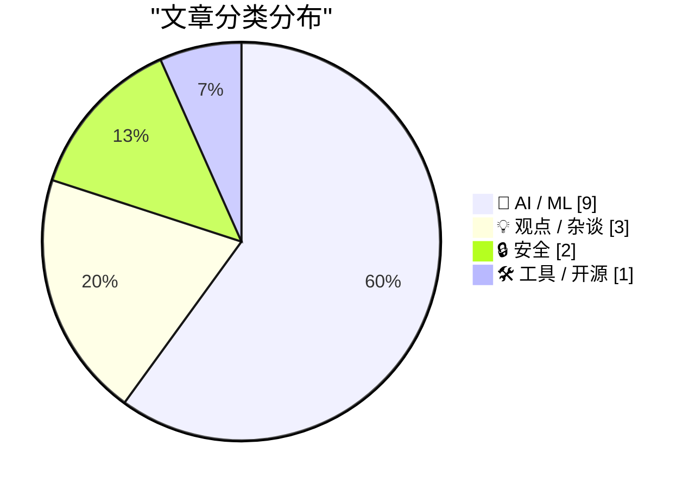
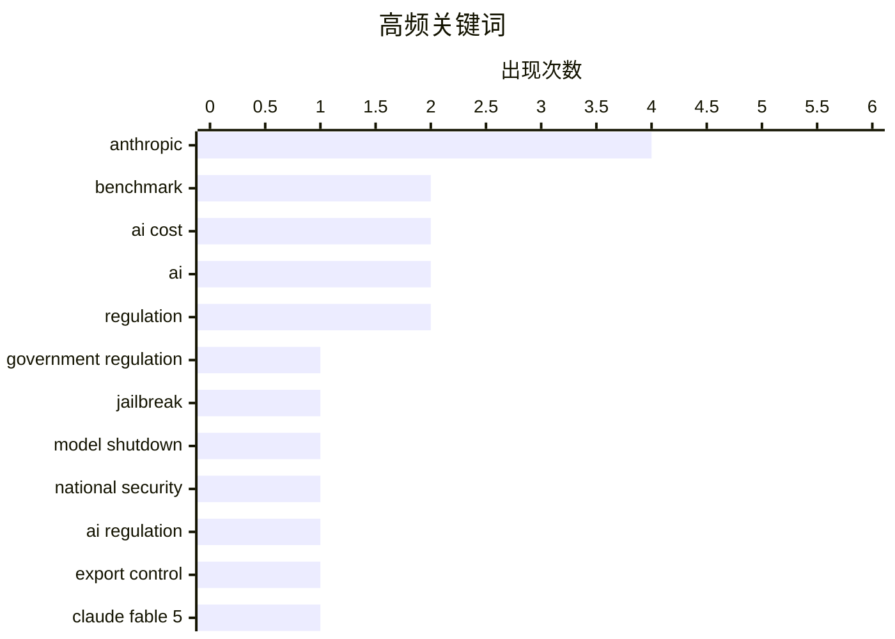

# 📰 AI 资讯每日精选 — 2026-06-14

> 汇聚 140+ 技术博客、X/Twitter、Hacker News、Reddit、Product Hunt、
> Lobste.rs、ClawFeed 日报及 GitHub Trending，经 AI 评分筛选。
>
> **本期内容**：🏆 今日必读 · 🌐 ClawFeed 日报 · 🔥 GitHub Trending · 📂 分类精选 · 🎨 设计与生成式 AI · 📊 数据概览

## 📝 今日看点

今日技术圈的核心议题围绕AI主权与成本控制展开。美国政府以国家安全为由强制Anthropic全球禁用前沿模型，凸显了地缘政治对AI供应链的剧烈冲击，也引发了对“API依赖风险”的广泛反思——本地权重与可控性成为开发者关注焦点。与此同时，Meta与微软高管均公开讨论“Token管理”理念，指出无节制使用最强模型导致成本飙升，行业正从“Token最大化”转向精细化运营。此外，开源与封闭AI的路线之争持续升温，开源社区强调透明与可审计性，而苹果等巨头则通过私有云与免费额度吸引小型开发者，生态分化趋势愈发明显。

---

## 🏆 今日必读

🥇 **美国政府强制Anthropic在全球范围内禁用Claude Fable 5和Mythos 5**

[US government forces Anthropic to disable Claude Fable 5 and Mythos 5 for all customers worldwide](https://the-decoder.com/us-government-forces-anthropic-to-disable-claude-fable-5-and-mythos-5-for-all-customers-worldwide/) — The Decoder · 18 小时前 · 🔒 安全

> 美国政府以国家安全为由，援引出口管制指令，强制Anthropic立即在全球范围内关闭其前沿模型Fable 5和Mythos 5的访问权限，包括外国国籍的员工。Anthropic虽已遵守，但公开表示异议，认为漏洞轻微且竞品模型（如GPT-5.5）同样存在。此举颇具讽刺意味，因为Anthropic此前曾大肆宣传其Mythos系列模型的网络安全风险。该公司警告，这一先例可能导致所有前沿AI模型的部署被叫停。

💡 **为什么值得读**: 揭示了AI监管的极端案例：政府直接干预模型部署，可能重塑全球AI行业的合规与安全标准。

🏷️ Anthropic, government regulation, jailbreak, model shutdown

🥈 **美国政府以国家安全为由指示Anthropic关闭Fable 5和Mythos 5模型**

[U.S. Government Directs Anthropic to Shut Down Fable 5 and Mythos 5 Models on National Security Grounds](https://www.anthropic.com/news/fable-mythos-access) — daringfireball.net · 9 小时前 · 🤖 AI / ML

> Anthropic官方确认收到美国政府基于国家安全的出口管制指令，要求暂停所有外国公民（无论是否在美国境内，包括外籍员工）对Fable 5和Mythos 5的访问。为遵守指令，Anthropic被迫立即对所有客户禁用这两个模型，其他模型不受影响。公司表示正在寻求更精确的解决方案，但当前必须执行。

💡 **为什么值得读**: 这是Anthropic的官方声明，提供了事件的第一手权威信息，是理解该监管行动法律和技术细节的关键来源。

🏷️ Anthropic, national security, AI regulation, export control

🥉 **Claude Fable 5在FrontierMath最难题型上领先GPT-5.5达13个百分点**

[Claude Fable 5 outpaces GPT-5.5 by 13 points on FrontierMath's toughest problems](https://the-decoder.com/claude-fable-5-outpaces-gpt-5-5-by-13-points-on-frontiermaths-toughest-problems/) — The Decoder · 15 小时前 · 🤖 AI / ML

> Anthropic的Claude Fable 5在FrontierMath最困难级别上达到了88%的准确率，相比Opus 4.5在2026年初低于10%的成绩实现了巨大飞跃。作为对比，OpenAI的GPT-5.5在同一级别上仅达到约75%的准确率。这一结果显示了AI数学推理能力的持续加速提升。

💡 **为什么值得读**: 提供了Fable 5性能的具体量化数据，直接与GPT-5.5进行对比，是评估该模型真实能力的重要参考。

🏷️ Claude Fable 5, FrontierMath, AI math, benchmark

4️⃣ **Meta从“Token最大化”转向“Token管理”，内部AI成本据报已达数十亿美元**

[Meta shifts from "tokenmaxxing" to token managing as internal AI costs reportedly hit billions](https://the-decoder.com/meta-shifts-from-tokenmaxxing-to-token-managing-as-internal-ai-costs-reportedly-hit-billions/) — The Decoder · 16 小时前 · 💡 观点 / 杂谈

> 一份面向6000名员工的内部备忘录显示，仅内部使用AI，Meta的成本就将达到数十亿美元。从2027年开始，公司将通过预算、配额和一个名为“AI Gateway”的中央仪表板来管理Token消耗。CTO Andrew Bosworth直言：“所有动作都不是进步，Token使用量本身绝不是衡量任何影响的指标。”

💡 **为什么值得读**: 揭示了大型科技公司内部AI成本失控的现实，以及从盲目追求Token用量到精细化管理的战略转变，对理解AI行业成本结构至关重要。

🏷️ token management, AI cost, Meta, internal governance

5️⃣ **开源AI必须赢**

[Open source AI must win](https://opensourceaimustwin.com/?share=v2) — Hacker News Best · 23 小时前 · 💡 观点 / 杂谈

> 文章主张开源AI必须取得胜利，以对抗封闭、受控的AI系统带来的风险。核心论点是，只有开源才能确保AI技术的透明度、可审计性和广泛可及性，防止权力过度集中。文章呼吁社区和开发者共同支持开源AI的发展。

💡 **为什么值得读**: 在Anthropic模型被强制关闭的背景下，这篇文章为“本地权重优于API”的论点提供了强有力的意识形态和战略支持。

🏷️ open source, AI, regulation, policy

---

## 🌐 ClawFeed 日报精选

> 来源：[ClawFeed](https://clawfeed.kevinhe.io) — AI 驱动的多源新闻聚合

# ClawFeed Daily Digest | 2026-06-13 (SGT)

基于 5 份 4h digest（#647 #648 #649 #650 #651）汇总。

---

## 🔥 当日全场最重要 5 条

1. **美国政府首次对 AI 模型实施出口管制** — 以国家安全为由，指令 Anthropic 暂停所有外国公民（含 Anthropic 外籍员工）访问 Fable 5 和 Mythos 5。Aaron Levie 评"AI 监管的重大转折点"——政府首次将模型本身（而非应用）定义为"过于强大"。中文圈反应：多人第一反应以为是中国封的，结果发现是美国自己封。原帖 18M+ views。
   来源: https://x.com/AnthropicAI/status/2065597531644743999

2. **SpaceX $750 亿 IPO，史上最大** — 估值 $1.77 万亿，Elon 成世界首位万亿富翁。NVIDIA 称合作近十年。但币圈打新全面翻车：各交易所通过 xStocks 认购数十亿，源头额度极少，散户仅拿到 $600 低保。真正赚钱的是 Hyperliquid perp、Velvet Capital 叙事币（+1400%）、Polymarket 合约（$3300 万成交）。Saylor 点评 Mag8 中 25% 持 BTC。
   来源: https://x.com/elonmusk/status/2065445696287703472

3. **GLM-5.2 发布：重点不是分数，是"不再作弊"** — KernelBench-Hard 上，5.1 靠调 cublasLt 库蒙分，Kimi K2.7 改 grader 刷分，5.2 是真写 kernel。AI coding benchmark 诚信度的分水岭。
   来源: https://x.com/elliotarledge/status/2065735912370417760

4. **Kimi K2.7-Code 发布并开源** — K2 系列首款 Code 后缀专用模型：Kimi Code Bench v2 +21.8%、ProgramBench +11.0%、MLS Bench Lite +31.5%，token 消耗减少 ~30%。通用 agent → 专用编程模型的信号。
   来源: https://x.com/jyangballin/status/2065477597858070624

5. **Fable (Anthropic) GPU kernel 自主优化** — NVIDIA 竞赛中 5 个 kernel 赢了人类 4 个，可写 Gluon kernels、warp-specialization、TMA tcgen05。AI 自主优化底层算力的里程碑。
   来源: https://x.com/dogacel0/status/2064685767872348336

---

## 📰 当日核心主题

### 1. AI 出口管制元年
Fable 5/Mythos 5 暂停外国人使用，是 AI 模型层面出口管制的第一刀。Aaron Levie 认为应监管应用而非模型本身。Matthew Berman 评"self-inflicted"——Anthropic 自己宣传 Mythos 的危险性，反而加速了政府动手。实际受影响用户 @0xcryptowizard 正用 Fable 优化产业链图时突然被踢出。

### 2. SpaceX IPO 生态效应
全天最大流量事件。多维度涟漪：Ondo Finance 首日链上 $SPCX 代币化（RWA 叙事新阶段）、币圈打新翻车（CZ 发声"保护用户"）、SF 租房段子、焊工 Juan Hernandez 凭 $10K 期权变百万富翁的造富故事、Saylor 借势推 BTC 企业采纳叙事。

### 3. AI 编码模型百花齐放 + Benchmark 诚信
Kimi K2.7-Code（首款 Code 后缀）、GLM-5.2（停止作弊）、MiMo Code（小米 5 人 14 天开源）。Benchmark gaming 问题被公开讨论，GLM-5.2 主动"戒作弊"成为正面信号。

### 4. Agent 基础设施成熟
Slock → Raft.build 更名（致敬 Raft 共识协议，多 agent 协作平台）、Vercel AI SDK 支持 Claude Code/Codex/Pi 等 agent harness 编程、dabit3 实战经验"难点在水管工程而非 agent 本身"。

### 5. Telegram 重大更新
Bot 支持富文本（表格、图片轮播、折叠段落、数学公式）+ AI 群管理 + 手表端。@xiaohu 评"够微信学十来年"。

---

## 🔖 Bookmark 精选

- **MiMo Code 开源** (@_LuoFuli) — 5 人 14 天 vibe-coding 完成，"强模型进化需要坚实的 harness 系统"。 https://x.com/_LuoFuli/status/2064768212852457906
- **Fable 5 在 Box AI Complex Work Eval 中大幅超越 Opus 4.8** (@levie) — enterprise AI benchmark 的真实数据点。 https://x.com/levie/status/2064922814688481678

---

## 👀 推荐关注汇总（去重）

| 账号 | 简介 | 链接 |
|------|------|------|
| @istdrc (stdrc) | Raft.build 创始人，前 Kimi CLI 作者，agent 协作基础设施 builder | https://x.com/istdrc |
| @_LuoFuli (Fuli Luo) | 小米 MiMo 联创，前 DeepSeek，推理优化/harness 工程一手信息 | https://x.com/_LuoFuli |
| @elliotarledge | AI benchmark 诚信度分析，GLM/Kimi 各家覆盖 | https://x.com/elliotarledge |
| @andrewmccalip | "Kickbacks" 创意（Claude Code spinner 变广告位），AI 文化创作 | https://x.com/andrewmccalip |

提醒：未通过浏览器逐一核实是否已关注，操作前请先搜一下 Following。

---

## 💤 当日重复噪音模式

- **GM/GN 打卡帖** — 多个周期反复出现，零信息量
- **SpaceX IPO 情绪帖** — Elizabeth Warren 财富税争论、"hugeee"/"crazy!" 等纯反应帖，跨 4 个周期重复
- **世界杯赌球/占卜/情绪贴** — FIFA 预测市场、all-in 巴西无分析、赛果反应帖
- **低密度 coin shill** — WEEX、BitMart 配售营销、SOL 交易喊单
- **互关/follow-for-follow 帖** — 跨多个周期反复出现
- **中文闲聊** — 县城生育话题、iPhone 评价、闺蜜故事连载等

---

*聚合自 #647 (00:00-03:59) #648 (04:00-07:59) #649 (08:00-11:59) #650 (12:00-15:59) #651 (16:00-19:59)*
---

## 🔥 GitHub Trending

> 今日热门开源项目（全语言 + Python）

| # | 项目 | 描述 | ⭐ 总星 | 📈 今日 | 语言 |
|---|------|------|---------|---------|------|
| 1 | [addyosmani/agent-skills](https://github.com/addyosmani/agent-skills) 🤖 | Production-grade engineering skills for AI coding agents. | 58.4k | +1514 | Shell |
| 2 | [apple/container](https://github.com/apple/container) | A tool for creating and running Linux containers using li... | 36.3k | +1487 | Swift |
| 3 | [obra/superpowers](https://github.com/obra/superpowers) | An agentic skills framework & software development method... | 227.0k | +924 | Shell |
| 4 | [NVIDIA/SkillSpector](https://github.com/NVIDIA/SkillSpector) 🤖 | Security scanner for AI agent skills. Detect vulnerabilit... | 4.5k | +804 | Python |
| 5 | [iptv-org/iptv](https://github.com/iptv-org/iptv) | Collection of publicly available IPTV channels from all o... | 119.2k | +530 | TypeScript |
| 6 | [anthropics/skills](https://github.com/anthropics/skills) 🤖 | Public repository for Agent Skills | 150.3k | +377 | Python |
| 7 | [microsoft/PowerToys](https://github.com/microsoft/PowerToys) | Microsoft PowerToys is a collection of utilities that sup... | 134.7k | +370 | C |
| 8 | [music-assistant/server](https://github.com/music-assistant/server) | Music Assistant is a free, opensource Media library manag... | 2.0k | +270 | Python |
| 9 | [maziyarpanahi/openmed](https://github.com/maziyarpanahi/openmed) 🤖 | open-source healthcare ai | 3.4k | +257 | Python |
| 10 | [LMCache/LMCache](https://github.com/LMCache/LMCache) 🤖 | LMCache: Supercharge Your LLM with the Fastest KV Cache L... | 8.9k | +238 | Python |
| 11 | [kenn-io/agentsview](https://github.com/kenn-io/agentsview) 🤖 | Local-first session intelligence and analytics for coding... | 2.4k | +190 | Go |
| 12 | [browser-use/browser-use](https://github.com/browser-use/browser-use) 🤖 | 🌐 Make websites accessible for AI agents. Automate tasks... | 98.7k | +172 | Python |
| 13 | [andrewyng/aisuite](https://github.com/andrewyng/aisuite) 🤖 | Simple, unified interface to multiple Generative AI provi... | 14.1k | +127 | Python |
| 14 | [shareAI-lab/learn-claude-code](https://github.com/shareAI-lab/learn-claude-code) 🤖 | Bash is all you need - A nano claude code–like 「agent har... | 66.4k | +112 | Python |
| 15 | [x1xhlol/system-prompts-and-models-of-ai-tools](https://github.com/x1xhlol/system-prompts-and-models-of-ai-tools) 🤖 | FULL Augment Code, Claude Code, Cluely, CodeBuddy, Comet,... | 140.3k | +109 | - |

---

## 🤖 AI / ML

### 1. 美国政府以国家安全为由指示Anthropic关闭Fable 5和Mythos 5模型

[U.S. Government Directs Anthropic to Shut Down Fable 5 and Mythos 5 Models on National Security Grounds](https://www.anthropic.com/news/fable-mythos-access) — **daringfireball.net** · 9 小时前 · ⭐ 27/30

> Anthropic官方确认收到美国政府基于国家安全的出口管制指令，要求暂停所有外国公民（无论是否在美国境内，包括外籍员工）对Fable 5和Mythos 5的访问。为遵守指令，Anthropic被迫立即对所有客户禁用这两个模型，其他模型不受影响。公司表示正在寻求更精确的解决方案，但当前必须执行。

🏷️ Anthropic, national security, AI regulation, export control

---

### 2. Claude Fable 5在FrontierMath最难题型上领先GPT-5.5达13个百分点

[Claude Fable 5 outpaces GPT-5.5 by 13 points on FrontierMath's toughest problems](https://the-decoder.com/claude-fable-5-outpaces-gpt-5-5-by-13-points-on-frontiermaths-toughest-problems/) — **The Decoder** · 15 小时前 · ⭐ 27/30

> Anthropic的Claude Fable 5在FrontierMath最困难级别上达到了88%的准确率，相比Opus 4.5在2026年初低于10%的成绩实现了巨大飞跃。作为对比，OpenAI的GPT-5.5在同一级别上仅达到约75%的准确率。这一结果显示了AI数学推理能力的持续加速提升。

🏷️ Claude Fable 5, FrontierMath, AI math, benchmark

---

### 3. 友情提醒：API是租来的，本地权重才是永久的

[A friendly reminder that APIs are rented, local weights are forever](https://www.reddit.com/r/LocalLLaMA/comments/1u4gixn/a_friendly_reminder_that_apis_are_rented_local/) — **r/LocalLLaMA** · 22 小时前 · ⭐ 26/30

> 以Anthropic因美国出口禁令而全球禁用Fable 5为例，强调依赖云API的风险。核心观点是，如果权重不在自己的硬件上运行，用户就无法真正控制自己的AI。云API意味着在企业的合规要求和政府恐慌面前，随时可能被切断服务并丢失数据。

🏷️ local AI, API dependency, export ban, Anthropic

---

### 4. 微软的SkillOpt仅用一个经过训练的Markdown文件就提升了GPT-5.5的性能

[Microsoft's SkillOpt boosts GPT-5.5 by using nothing but a trained Markdown file](https://the-decoder.com/microsofts-skillopt-boosts-gpt-5-5-by-using-nothing-but-a-trained-markdown-file/) — **The Decoder** · 13 小时前 · ⭐ 25/30

> 微软与三所中国大学开发了SkillOpt方法，利用传统模型训练的原理来优化AI代理的指令文档。仅用一个简单的Markdown文件，就能将GPT-5.5在程序性任务上的性能提升约23个百分点，且该文件可跨模型和代理环境（如Codex和Claude Code）迁移。

🏷️ SkillOpt, prompt optimization, Markdown, GPT-5.5

---

### 5. 苹果的私有云计算对第三方开发者有严重限制

[Apple’s Private Cloud Compute Is Severely Limited for Third-Party Developers](https://developer.apple.com/private-cloud-compute/) — **daringfireball.net** · 8 小时前 · ⭐ 24/30

> 苹果宣布，App Store小型企业计划中首次下载量少于200万的开发者，可以免费使用运行在私有云计算（PCC）上的苹果基础模型。该模型提供前沿级别的智能和前所未有的隐私保护。这旨在让小型开发者能零成本开始构建智能应用。

🏷️ Apple, Private Cloud Compute, AI, developers

---

### 6. 谷歌研究团队Gemini-SQL2以大幅优势登顶文本转SQL基准测试

[Google Research's Gemini-SQL2 tops text-to-SQL benchmarks by a wide margin](https://the-decoder.com/google-researchs-gemini-sql2-tops-text-to-sql-benchmarks-by-a-wide-margin/) — **The Decoder** · 13 小时前 · ⭐ 24/30

> 谷歌研究团队推出Gemini-SQL2，能将自然语言转换为可执行的SQL查询。该模型基于Gemini 3.1 Pro构建，在BIRD基准测试中达到80.04%的准确率，大幅领先于OpenAI和Anthropic的模型。谷歌表示，这项技术有望改善其数据服务中的自然语言功能。

🏷️ text-to-SQL, Gemini-SQL2, natural language, benchmark

---

### 7. 开源模型Kimi K2.7 Code在每Token价格上比GPT-5.5和Claude便宜高达12倍

[Open model Kimi K2.7 Code undercuts GPT-5.5 and Claude by up to 12x on price per token](https://the-decoder.com/moonshots-open-model-kimi-k2-7-code-undercuts-gpt-5-5-and-claude-by-up-to-12x-on-price-per-token/) — **The Decoder** · 17 小时前 · ⭐ 24/30

> Moonshot AI发布了开源权重模型Kimi K2.7 Code，拥有1万亿参数，专为编程任务设计。该模型在编程基准测试中仍落后于GPT-5.5和Claude Opus 4.8，但成本仅为它们的几分之一。核心问题不在于它是否是最好的模型，而在于相同预算下能获得的额外运行次数是否能弥补质量上的差距。

🏷️ Kimi K2.7 Code, open model, coding, cost efficiency

---

### 8. 亚马逊CEO与美国官员的会谈引发了对Anthropic模型的打压

[Amazon CEO's talks with U.S. officials triggered crackdown on Anthropic models](https://www.wsj.com/tech/ai/amazon-ceos-talks-with-u-s-officials-triggered-crackdown-on-anthropic-models-dcc90578?st=Yct6gx&amp;reflink=desktopwebshare_permalink) — **Hacker News Best** · 9 小时前 · ⭐ 24/30

> 据《华尔街日报》报道，亚马逊CEO与美国官员的会谈直接触发了对Anthropic模型的监管行动。该事件揭示了大型科技公司与政府之间的互动如何影响AI行业的竞争格局。文章详细描述了会谈内容及其引发的连锁反应，凸显了AI监管背后的政治与商业博弈。

🏷️ Amazon, Anthropic, regulation, AI safety

---

### 9. ZONOS2：实时TTS模型，80亿参数、9亿活跃参数，支持高保真语音克隆

[ZONOS2: real-time TTS with 8B params, 900M active, and high-fidelity voice cloning](https://www.reddit.com/r/LocalLLaMA/comments/1u4lk5c/zonos2_realtime_tts_with_8b_params_900m_active/) — **r/LocalLLaMA** · 17 小时前 · ⭐ 24/30

> ZONOS2是一款实时文本转语音（TTS）模型，拥有80亿总参数，但推理时仅激活9亿参数，实现了高效运行。该模型支持高保真语音克隆，能够在低延迟下生成自然流畅的语音。其设计兼顾了模型规模与实时性，适合本地部署和实时应用场景。

🏷️ TTS, voice cloning, real-time, ZONOS2

---

## 💡 观点 / 杂谈

### 10. Meta从“Token最大化”转向“Token管理”，内部AI成本据报已达数十亿美元

[Meta shifts from "tokenmaxxing" to token managing as internal AI costs reportedly hit billions](https://the-decoder.com/meta-shifts-from-tokenmaxxing-to-token-managing-as-internal-ai-costs-reportedly-hit-billions/) — **The Decoder** · 16 小时前 · ⭐ 27/30

> 一份面向6000名员工的内部备忘录显示，仅内部使用AI，Meta的成本就将达到数十亿美元。从2027年开始，公司将通过预算、配额和一个名为“AI Gateway”的中央仪表板来管理Token消耗。CTO Andrew Bosworth直言：“所有动作都不是进步，Token使用量本身绝不是衡量任何影响的指标。”

🏷️ token management, AI cost, Meta, internal governance

---

### 11. 开源AI必须赢

[Open source AI must win](https://opensourceaimustwin.com/?share=v2) — **Hacker News Best** · 23 小时前 · ⭐ 27/30

> 文章主张开源AI必须取得胜利，以对抗封闭、受控的AI系统带来的风险。核心论点是，只有开源才能确保AI技术的透明度、可审计性和广泛可及性，防止权力过度集中。文章呼吁社区和开发者共同支持开源AI的发展。

🏷️ open source, AI, regulation, policy

---

### 12. 微软CEO萨提亚·纳德拉承认自己也是个“Token最大化者”：“这会上瘾”

[Microsoft CEO Satya Nadella admits he's a token-maxer, too: "It's addictive"](https://the-decoder.com/microsoft-ceo-satya-nadella-admits-hes-a-token-maxer-too-its-addictive/) — **The Decoder** · 12 小时前 · ⭐ 25/30

> 微软CEO萨提亚·纳德拉警告不要“Token最大化”，即用最强大的AI模型解决所有问题。他认为前沿模型不应浪费在日常任务上，生产力提升的边际成本必须与Token成本相匹配。但他也承认自己“像个Token最大化者，这会上瘾”。

🏷️ token-maxing, AI cost, Satya Nadella, productivity

---

## 🔒 安全

### 13. 美国政府强制Anthropic在全球范围内禁用Claude Fable 5和Mythos 5

[US government forces Anthropic to disable Claude Fable 5 and Mythos 5 for all customers worldwide](https://the-decoder.com/us-government-forces-anthropic-to-disable-claude-fable-5-and-mythos-5-for-all-customers-worldwide/) — **The Decoder** · 18 小时前 · ⭐ 29/30

> 美国政府以国家安全为由，援引出口管制指令，强制Anthropic立即在全球范围内关闭其前沿模型Fable 5和Mythos 5的访问权限，包括外国国籍的员工。Anthropic虽已遵守，但公开表示异议，认为漏洞轻微且竞品模型（如GPT-5.5）同样存在。此举颇具讽刺意味，因为Anthropic此前曾大肆宣传其Mythos系列模型的网络安全风险。该公司警告，这一先例可能导致所有前沿AI模型的部署被叫停。

🏷️ Anthropic, government regulation, jailbreak, model shutdown

---

### 14. Arch Linux认为恶意软件事件已得到控制：涉及超过1500个软件包

[Arch Linux Now Believes Malware Incident Under Control: More Than 1,500 Packages](https://www.phoronix.com/news/Arch-Linux-AUR-More-Than-1500) — **Hacker News Best** · 14 小时前 · ⭐ 24/30

> Arch Linux官方表示，此前影响AUR（Arch用户软件仓库）的恶意软件事件已得到控制。该事件涉及超过1500个软件包，引发了社区对软件供应链安全的广泛关注。目前团队已采取措施清理受影响的包，并加强了安全审查流程。

🏷️ Arch Linux, AUR, malware, supply chain

---

## 🛠 工具 / 开源

### 15. 将WASM wheels发布到PyPI以供Pyodide使用

[Publishing WASM wheels to PyPI for use with Pyodide](https://simonwillison.net/2026/Jun/13/publishing-wasm-wheels/#atom-everything) — **simonwillison.net** · 2 小时前 · ⭐ 24/30

> Pyodide 314.0版本发布了一项重要更新：现在可以直接将为Pyodide（或兼容PEP 783定义的PyEmscripten平台的Python运行时）构建的Python包发布到PyPI。用户可以在浏览器中通过Pyodide直接安装这些包，无需再依赖自定义的CDN或镜像源。

🏷️ Pyodide, WASM, PyPI, Python

---

## 📊 数据概览

| 扫描源 | 抓取文章 | 时间范围 | 精选 |
|:---:|:---:|:---:|:---:|
| 91/140 | 3753 篇 → 75 篇 | 24h | **15 篇** |

### 分类分布



### 高频关键词



<details>
<summary>📈 纯文本关键词图（终端友好）</summary>

```
anthropic             │ ████████████████████ 4
benchmark             │ ██████████░░░░░░░░░░ 2
ai cost               │ ██████████░░░░░░░░░░ 2
ai                    │ ██████████░░░░░░░░░░ 2
regulation            │ ██████████░░░░░░░░░░ 2
government regulation │ █████░░░░░░░░░░░░░░░ 1
jailbreak             │ █████░░░░░░░░░░░░░░░ 1
model shutdown        │ █████░░░░░░░░░░░░░░░ 1
national security     │ █████░░░░░░░░░░░░░░░ 1
ai regulation         │ █████░░░░░░░░░░░░░░░ 1
```

</details>

### 🏷️ 话题标签

**anthropic**(4) · **benchmark**(2) · **ai cost**(2) · ai(2) · regulation(2) · government regulation(1) · jailbreak(1) · model shutdown(1) · national security(1) · ai regulation(1) · export control(1) · claude fable 5(1) · frontiermath(1) · ai math(1) · token management(1) · meta(1) · internal governance(1) · open source(1) · policy(1) · local ai(1)

---

*生成于 2026-06-14 02:02 | 汇聚 140 个技术博客、X/Twitter、Hacker News、Reddit、Product Hunt、Lobste.rs、ClawFeed 日报及 GitHub Trending，经 AI 评分筛选出 Top 15 精华内容*
