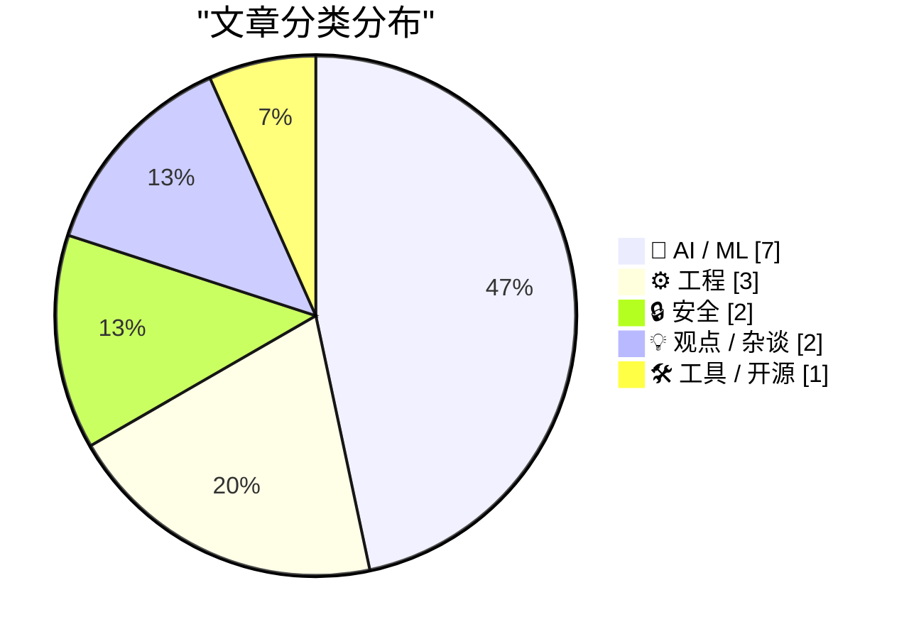
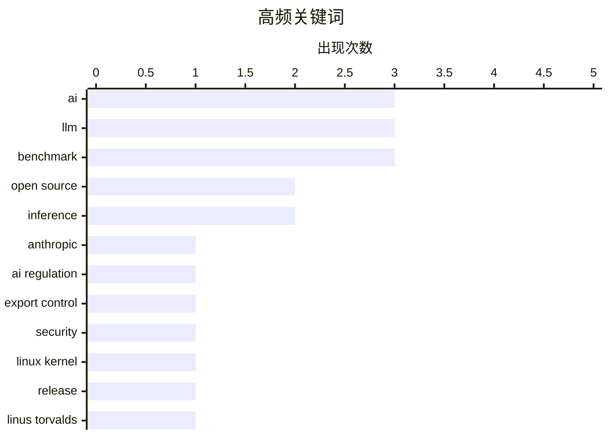

# 📰 AI 资讯每日精选 — 2026-06-15

> 汇聚 140+ 技术博客、X/Twitter、Hacker News、Reddit、Product Hunt、
> Lobste.rs、ClawFeed 日报及 GitHub Trending，经 AI 评分筛选。
>
> **本期内容**：🏆 今日必读 · 🌐 ClawFeed 日报 · 🔥 GitHub Trending · 📂 分类精选 · 🎨 设计与生成式 AI · 📊 数据概览

## 📝 今日看点

今日技术圈的核心议题围绕AI能力边界与现实落地的矛盾展开：一方面，亚马逊等巨头联合施压政府封禁Anthropic的Fable模型，凸显出AI安全与商业利益之间的激烈博弈；另一方面，多项研究与实践表明，AI在软件工程中的实际表现远未达到替代人类的程度——编码助手能定位文件却遗漏关键代码行，大上下文窗口存在信息丢失风险，而KPMG甚至被曝编造AI案例来推销服务。与此同时，开源社区在推理加速上取得突破，小米MiMo V2.5实现每秒千级token服务，EAGLE技术也合并入llama.cpp，推动本地化部署效率提升。整体来看，行业正从狂热炒作转向对AI能力局限性的清醒认知，并加速落地可量化的工程优化。

---

## 🏆 今日必读

🥇 **亚马逊等六家公司据报引发政府对Anthropic的Fable模型进行打压**

[Amazon and five other companies reportedly triggered the government crackdown on Anthropic's Fable model](https://the-decoder.com/amazon-and-five-other-companies-reportedly-triggered-the-government-crackdown-on-anthropics-fable-model/) — The Decoder · 17 小时前 · 🔒 安全

> 亚马逊CEO安迪·贾西与其他五家科技公司高管据报向特朗普政府警告Anthropic的Fable模型存在安全漏洞，尽管亚马逊是Anthropic最大的投资者之一。数小时内，白宫通过出口管制令强制该模型下线。此举可能是一项合法的安全政策决定，但也被视为对一家“碍事”公司展示武力。文章揭示了科技巨头在AI安全与商业利益之间的复杂博弈。

💡 **为什么值得读**: 揭露了科技巨头如何利用政府监管打击竞争对手，即使对方是其投资对象，展现了AI行业权力斗争的阴暗面。

🏷️ Anthropic, AI regulation, export control, security

🥈 **Linux 7.1**

[Linux 7.1](https://lore.kernel.org/lkml/CAHk-=wi4BF4bMhZNZ1tqs+FFV4OuZRe3ZqdWB+LxRLmRweUzQw@mail.gmail.com/T/#u) — Hacker News Best · 10 小时前 · ⚙️ 工程

> Linux内核发布了7.1版本。该版本在Hacker News上获得231个点赞和87条评论，引发了社区广泛讨论。具体更新内容需查看内核邮件列表的详细公告。

💡 **为什么值得读**: Linux内核新版本发布是操作系统和开发者社区的重大事件，值得关注其新特性与性能改进。

🏷️ Linux kernel, release, Linus Torvalds

🥉 **为什么AI没有取代软件工程师，而且也不会**

[Why AI hasn’t replaced software engineers, and won’t](https://simonwillison.net/2026/Jun/14/why-ai-hasnt-replaced-software-engineers/#atom-everything) — simonwillison.net · 2 小时前 · 💡 观点 / 杂谈

> Arvind Narayanan和Sayash Kapoor通过软件工程这一最易受AI冲击的职业视角，反驳了“AI能力达到阈值后将导致大规模失业”的叙事。他们论证现有证据足以否定该观点，认为AI不会取代软件工程师。文章深入分析了AI在编程中的实际局限与人类工程师不可替代的价值。

💡 **为什么值得读**: 来自权威学者的理性分析，直接回应了AI取代程序员的热门恐慌，提供了基于证据的冷静判断。

🏷️ AI, software engineering, job displacement

4️⃣ **KPMG在旨在向客户推销AI的报告中编造AI案例研究**

[KPMG fabricated AI case studies in a report designed to sell clients on AI adoption](https://the-decoder.com/kpmg-fabricated-ai-case-studies-in-a-report-designed-to-sell-clients-on-ai-adoption/) — The Decoder · 16 小时前 · 💡 观点 / 杂谈

> KPMG发布的一份关于企业AI应用的报告中，包含了涉及瑞银、英国国家医疗服务体系等组织的虚假案例研究。GPTZero CEO Edward Tian协助揭露了这些错误，并警告“二次幻觉”现象——来自可信咨询公司的错误主张会不受限制地传播。KPMG已撤回该报告。

💡 **为什么值得读**: 揭露了顶级咨询公司为推销AI而编造案例的丑闻，警示读者对行业报告保持批判性思维。

🏷️ AI, hallucination, consulting, ethics

5️⃣ **不要相信大上下文窗口**

[Don't trust large context windows](https://garrit.xyz/posts/2026-05-06-dont-trust-large-context-windows) — Hacker News Best · 19 小时前 · 🤖 AI / ML

> 文章警告不要过度依赖AI模型的大上下文窗口能力。该观点在Hacker News上获得242个点赞和178条评论，引发激烈讨论。作者认为，即使上下文窗口很大，模型在处理长文本时仍存在信息丢失、注意力分散等问题，实际效果远不如宣传。

💡 **为什么值得读**: 针对当前AI模型“大上下文”营销热点的冷静反思，提供了实用的技术警示。

🏷️ LLM, context window, reliability, AI limitations

---

## 🌐 ClawFeed 日报精选

> 来源：[ClawFeed](https://clawfeed.kevinhe.io) — AI 驱动的多源新闻聚合

# ClawFeed Daily Digest | 2026-06-14 (SGT)

基于 7 份 4h digest（#653 #654 #655 #656 #657 #658 #659）汇总。注：#653 与 #654 内容完全重复（同时段双发），实际覆盖 6 个时段。

---

## 🔥 当日全场最重要 5 条

1. **Fable 5 出口管制升级：从外籍限制扩大到全员暂停** — Anthropic 官方 @ClaudeDevs 确认因美国政府指令暂停所有用户（不仅外国公民）使用 Fable 5。Andrej Karpathy 因非美国公民被禁止访问自己公司最先进模型。Aaron Levie 评论这是"model-layer regulation"的前例——首次在模型层而非应用层实施管制，后续影响深远。@0xQiYan 三日简史精辟："Day 1 史上最强模型发布 → Day 2 有人声称破解 → Day 3 联邦政府像管导弹一样封存"。
   来源: https://x.com/ClaudeDevs/status/2065200848431464737

2. **Meta 20 亿美元收购 Manus 被迫拆分** — 北京要求下交易逆转，Manus 员工已失去 Meta 内部系统权限，数据共享停止。AI 跨境并购地缘风险的标志性事件——继 TikTok 后，Meta 中国业务再度受阻。@gelunding 评："老扎和中国真的八字不合。"
   来源: https://x.com/gelunding/status/2065954762840007142

3. **OpenRouter Fusion API：多模型路由追平 Fable 5、价格砍半** — Gemini 3 Flash + Kimi K2.6 + DeepSeek V4 Pro 组成 compound panel。Levie 跟进论断：模型路由层（routing layer）将成最有价值的中间层——成本优化、专项调度、可靠性三重收益。在 Fable 5 管制背景下，多模型路由从"省钱"升级为"保险"。
   来源: https://x.com/Svwang1/status/2066004303672909881

4. **SpaceX $750 亿 IPO 持续发酵** — ARK Invest Cathie Wood 单日买入 $5.29 亿 SPCX 股票（分布四只 ETF），机构押注信号明确。币圈 tokenized 配额全面翻车后，@lex_node 指出链上 transfer agent 才是正解。
   来源: https://x.com/CoinGapeMedia/status/2065200848431464737

5. **Google DeepMind 发布 AGI→ASI 路径论文** — 提出 4 条技术通道：持续扩展算力/模型/数据、test-time compute 提升、多模态融合、agent 自我进化。43K views。同日 RandOpt 论文颠覆 RL alignment 假设：仅对 LLM 加高斯噪声 + ensemble（无梯度、无 RL），数学/代码/写作/化学性能媲美 GRPO/PPO。
   来源: https://x.com/rohanpaul_ai/status/2065549739266048120

---

## 📰 当日核心主题

### 1. Fable 5 管制余波：叙事战、替代方案、行业重构
全天最大流量事件，跨全部 7 个 digest 反复出现。三条支线：(a) 智谱 GLM-5.2 当天打出"Frontier Intelligence Belongs to Everyone"对标 Fable 5 管制；(b) 美国 AI KYC 讨论升温——@0xSero 指出未来所有超顶级能力模型将需身份验证；(c) @scaling01 从收入模型角度推演——Anthropic 海外收入将"双位数百分比"蒸发。设计圈 @MengTo 对 Fable 5 的怀念仍在发酵。

### 2. Agent Harness 可编程化
Vercel AI SDK 发布 HarnessAgent（跨 2 个 digest 反复出现）：Claude Code / Codex / Pi 均可通过统一抽象层以 sandboxed session 调用，输出 AI SDK 兼容流。Agent harness 从 CLI 工具正式变成可编排 API 组件。@chenchengpro 的"Harness Engineering"概念持续传播：同模型同 benchmark，换 harness 从 42%→78%。@_LuoFuli（小米 MiMo Code）也强调"强模型进化需要强 harness 系统"。

### 3. 模型路由与中间层价值
OpenRouter Fusion API 上线 + Levie 路由层价值论 + @servasyy_ai 的 Headroom（Agent-LLM 中间层，token 消耗砍 95%）+ Google OKF（Open Knowledge Format）标准化知识库输入。中间层从成本优化工具升级为战略基础设施。

### 4. AI 地缘博弈加剧
Meta-Manus 拆分 + Fable 5 管制 + DeepSeek 成员公开维权（Deli Chen 因投诉施工扰民被小红书封号）。@MrBoKong 逆向观点：禁令证明先进 AI 已被视为国家战略资源，军备竞赛只会加速。@Shinobi333 推演：将推动欧盟/日韩加速自主 AI 投资。

### 5. Loop Engineering & Agent 工作流进化
Karpathy 金句广泛传播："Remove yourself as the bottleneck. Put in very few tokens, and a huge amount of stuff happens on your behalf." @turingou 观察：多 agent 协同成为默认姿势后，session 不再承载 todo 而是承载"愿景"。@billtheinvestor 总结 Claude Code 高效运行方式：/goal + /loop + /workflows。

---

## 🔖 Bookmark 精选

- **GPT-Realtime-2 实时翻译** (@arrakis_ai / @gdb) — Chormex 接入后实现 YouTube/直播/会议全场景实时翻译，Greg Brockman 亲自转发。跨 4 个 digest 反复出现。 https://x.com/arrakis_ai/status/2053055460060618805
- **wanman.ai 开源** (@turingou) — 第 14 款 vibe 产品，AI agent 团队帮任何人从零创办一人公司。跨 story 搜索 + Codex 调 GPT Image 2 自动创建设计师 agent。 https://x.com/turingou/status/2065200848431464737
- **Harness Engineering** (@chenchengpro) — 同模型同 benchmark，42%→78%，唯一变量是 harness。"2026 AI 工程最重要发现"。 https://x.com/chenchengpro/status/2065200848431464737
- **Cline Kanban** (@cline) — CLI-agnostic 多 agent 编排独立应用，Claude/Codex 兼容，worktree 隔离 + diff review + 卡片依赖链。 https://x.com/cline/status/2065200848431464737
- **open-agent-sdk** (@idoubicc) — 从 claude-code-sourcemap 源码逆向抽出，替代 claude-agent-sdk。Claude Code harness 架构开源化。 https://x.com/idoubicc/status/2039006326882546141
- **Google Stitch DESIGN.md** (@yangyi) — 一个 Markdown 文件教会 AI Coding Agent 整套设计系统，40+ 预构建文件。 https://x.com/yangyi/status/2040272305277079728

---

## 👀 推荐关注汇总（去重）

| 账号 | 简介 | 链接 |
|------|------|------|
| @scaling01 | 高质量 AI 商业/地缘分析，从收入模型角度拆解政策影响 | https://x.com/scaling01 |
| @lex_node | MetaLeX Labs 创始人，链上证券基础设施 builder，SpaceX IPO tokenization 分析最清晰 | https://x.com/lex_node |
| @0xQiYan | 中文 AI/crypto 交叉圈，信息密度高，Fable 5 管制三日简史叙事质量远超一般推文 | https://x.com/0xQiYan |

已确认 Following 的（内容提权推荐，非新关注建议）：@levie、@_LuoFuli

提醒：未通过浏览器逐一核实是否已关注，操作前请先搜一下 Following。

---

## 🧹 建议取关

| 账号 | 理由 |
|------|------|
| @HeXiaobo (David.He) | 最后一条推文 2018 年 7 月，沉寂近 8 年，510 followers，内容全是 Instagram 打卡，与 AI/crypto/tech 完全无关。跨 3 个 digest 反复建议。 |
| @0xJasonBateman | 仅 36 条推文，最后原创内容 2025 年 4 月 Spotify 分享，8 followers，与 AI/crypto/tech 无关。 |

---

## 💤 当日重复噪音模式

- **世界杯赌球/体育** — FIFA 预测、Copa America 竞猜、NBA Knicks 夺冠刷屏、F1 赛车、UFC 白宫赛，跨多个周期反复出现
- **互关刷粉/GM/GN 打卡** — #蓝V互关、follow-for-follow、纯 GM/GN 帖，每个周期都有
- **SpaceX IPO 情绪帖** — 纯感叹无分析的"打新"讨论、SF 租房段子，已从信息变噪音
- **Crypto 低质量喊单** — 交易所退款争议、paid partnership 推广、SOL/BNB 喊单
- **中文闲聊** — 深圳身高、怀孕照、食物分享、县城话题等生活类内容
- **Fable 5 情绪贴（无增量）** — 后期 digest 中大量"Fable 5 好可惜"帖已无新信息，纯情绪复读

---

*聚合自 #653 (20:00-23:59) #654 (重复) #655 (00:00-03:59) #656 (04:00-07:59) #657 (08:00-11:59) #658 (12:00-15:59) #659 (16:00-19:59)*
---

## 🔥 GitHub Trending

> 今日热门开源项目（全语言 + Python）

| # | 项目 | 描述 | ⭐ 总星 | 📈 今日 | 语言 |
|---|------|------|---------|---------|------|
| 1 | [iptv-org/iptv](https://github.com/iptv-org/iptv) | Collection of publicly available IPTV channels from all o... | 121.1k | +1528 | TypeScript |
| 2 | [NVIDIA/SkillSpector](https://github.com/NVIDIA/SkillSpector) 🤖 | Security scanner for AI agent skills. Detect vulnerabilit... | 5.4k | +964 | Python |
| 3 | [chatwoot/chatwoot](https://github.com/chatwoot/chatwoot) | Open-source live-chat, email support, omni-channel desk. ... | 31.3k | +400 | Ruby |
| 4 | [Introduction-to-Autonomous-Robots/Introduction-to-Autonomous-Robots](https://github.com/Introduction-to-Autonomous-Robots/Introduction-to-Autonomous-Robots) | Introduction to Autonomous Robots | 2.7k | +293 | TeX |
| 5 | [andrewyng/aisuite](https://github.com/andrewyng/aisuite) 🤖 | Simple, unified interface to multiple Generative AI provi... | 14.4k | +291 | Python |
| 6 | [GorvGoyl/Clone-Wars](https://github.com/GorvGoyl/Clone-Wars) | 100+ open-source clones of popular sites like Airbnb, Ama... | 35.5k | +269 | - |
| 7 | [yt-dlp/yt-dlp](https://github.com/yt-dlp/yt-dlp) | A feature-rich command-line audio/video downloader | 170.6k | +252 | Python |
| 8 | [LMCache/LMCache](https://github.com/LMCache/LMCache) 🤖 | LMCache: Supercharge Your LLM with the Fastest KV Cache L... | 9.1k | +248 | Python |
| 9 | [shiyu-coder/Kronos](https://github.com/shiyu-coder/Kronos) | Kronos: A Foundation Model for the Language of Financial ... | 29.9k | +244 | Python |
| 10 | [OpenHands/OpenHands](https://github.com/OpenHands/OpenHands) 🤖 | 🙌 OpenHands: AI-Driven Development | 77.1k | +230 | Python |
| 11 | [music-assistant/server](https://github.com/music-assistant/server) | Music Assistant is a free, opensource Media library manag... | 2.2k | +197 | Python |
| 12 | [swc-project/swc](https://github.com/swc-project/swc) | Rust-based platform for the Web | 33.8k | +163 | Rust |
| 13 | [freeCodeCamp/freeCodeCamp](https://github.com/freeCodeCamp/freeCodeCamp) | freeCodeCamp.org's open-source codebase and curriculum. L... | 447.2k | +146 | TypeScript |
| 14 | [Ar9av/obsidian-wiki](https://github.com/Ar9av/obsidian-wiki) 🤖 | Framework for AI agents to build and maintain a digital b... | 2.0k | +135 | Python |
| 15 | [FareedKhan-dev/train-llm-from-scratch](https://github.com/FareedKhan-dev/train-llm-from-scratch) 🤖 | A straightforward method for training your LLM, from down... | 6.1k | +105 | Python |

---

## 🤖 AI / ML

### 1. 不要相信大上下文窗口

[Don't trust large context windows](https://garrit.xyz/posts/2026-05-06-dont-trust-large-context-windows) — **Hacker News Best** · 19 小时前 · ⭐ 24/30

> 文章警告不要过度依赖AI模型的大上下文窗口能力。该观点在Hacker News上获得242个点赞和178条评论，引发激烈讨论。作者认为，即使上下文窗口很大，模型在处理长文本时仍存在信息丢失、注意力分散等问题，实际效果远不如宣传。

🏷️ LLM, context window, reliability, AI limitations

---

### 2. 小米现以1000-3000tps的速度提供MiMo V2.5服务，采用DFlash和持久化内核；DFlash模型已发布，开源版本即将推出

[Xiaomi is now serving MiMo V2.5 at 1000-3000tps using DFlash & Persistent kernel. DFLash model is out, open-source release promised coming soon](https://www.reddit.com/r/LocalLLaMA/comments/1u5jtr8/xiaomi_is_now_serving_mimo_v25_at_10003000tps/) — **r/LocalLLaMA** · 13 小时前 · ⭐ 24/30

> 小米宣布其MiMo V2.5模型现以每秒1000-3000个token的速度提供服务，该速度得益于DFlash技术和持久化内核。DFlash模型已公开发布，并承诺即将开源。这一性能指标在本地LLM社区引起高度关注。

🏷️ Xiaomi, MiMo, inference speed, open source

---

### 3. 为什么4-bit GPTQ不会破坏模型的困惑度？我从零推导了补偿数学原理

[Why doesn’t 4-bit GPTQ wreck a model’s perplexity? I derived the compensation math from scratch](https://www.reddit.com/r/LocalLLaMA/comments/1u602zu/why_doesnt_4bit_gptq_wreck_a_models_perplexity_i/) — **r/LocalLLaMA** · 2 小时前 · ⭐ 24/30

> 作者从数学上推导了GPTQ量化为何能在4-bit精度下保持模型性能。核心在于GPTQ将权重视为相关而非独立：当将一个权重强制量化到4-bit网格时，它利用层输入的逆海森矩阵精确计算如何调整相邻权重以吸收误差。这解释了为什么GPTQ量化后的模型困惑度几乎不变。

🏷️ GPTQ, quantization, LLM, perplexity

---

### 4. 研究表明：AI编码助手能找到正确的文件，但会错过关键代码行

[AI coding agents find the right file but miss the exact lines that matter, study shows](https://the-decoder.com/ai-coding-agents-find-the-right-file-but-miss-the-exact-lines-that-matter-study-shows/) — **The Decoder** · 17 小时前 · ⭐ 23/30

> 一项新研究显示，Claude Code、Codex等AI编码助手能可靠地定位到正确的文件，但会错过其中大部分关键的代码行。新的SWE-Explore基准测试首次将代码搜索与修复能力分开评估，结果表明，没有足够的上下文，即使最好的修复也会失败。

🏷️ AI coding agents, code search, benchmark, context

---

### 5. 里约热内卢的“本土”大语言模型被发现是现有模型的合并

[Rio de Janeiro's "homegrown" LLM appears to be a merge of an existing model](https://github.com/nex-agi/Nex-N2/issues/4) — **Hacker News Best** · 10 小时前 · ⭐ 23/30

> 里约热内卢市政府宣称自主研发的“本土”大语言模型被社区质疑。经技术分析发现，该模型实际上是多个现有开源模型（如Llama等）的合并或微调版本，并非从零开始训练。这一发现引发了关于政府AI项目透明度、资金使用以及“自主创新”定义的广泛讨论。作者的核心观点是，政府应公开模型的技术细节和训练数据来源，以避免误导公众和浪费公共资源。

🏷️ LLM, model merge, controversy, open source

---

### 6. 双DGX Spark：单用户1M上下文40 tokens/s，聚合350 tokens/s——DeepSeek V4 Flash对比RTX Pro 6000与Mac M2 Ultra 192GB

[Dual DGX Sparks- 40tk/s single 1M ; 350 tk/s agg. - Deepseek V4 Flash (vs RTX Pro 6000 vs Mac M2 Ultra 192)](https://www.reddit.com/r/LocalLLaMA/comments/1u5g9pr/dual_dgx_sparks_40tks_single_1m_350_tks_agg/) — **r/LocalLLaMA** · 16 小时前 · ⭐ 22/30

> 该文章分享了在双DGX Spark工作站上运行大型MoE模型（DeepSeek V4 Flash）的配置、经验与基准测试。在单用户1M上下文长度下，推理速度可达40 tokens/s，聚合吞吐量达350 tokens/s。文章对比了RTX Pro 6000和Mac M2 Ultra 192GB等平台的性能表现。核心结论是，通过合理配置，双DGX Spark能以实用速度支持大型MoE模型的智能体应用。

🏷️ DGX Spark, DeepSeek, benchmark, multi-node

---

### 7. Nemotron——深度之王？四款120B以下模型对比评测

[Nemotron - King of the Deep? Comparison of 4 models <=120B](https://www.reddit.com/r/LocalLLaMA/comments/1u5vqpl/nemotron_king_of_the_deep_comparison_of_4_models/) — **r/LocalLLaMA** · 5 小时前 · ⭐ 22/30

> 该评测在Strix Halo 128GB共享内存平台上，对四款参数不超过120B的模型（包括Nemotron）进行了横向对比。评测重点考察了模型在复杂推理、代码生成和长文本理解等“深度”任务上的表现。结果显示，Nemotron在多项基准测试中表现突出，尤其在需要深度推理的任务上领先于其他同规模模型。作者认为，在120B参数级别，Nemotron是目前综合能力最强的模型之一。

🏷️ Nemotron, model comparison, benchmark, local LLM

---

## ⚙️ 工程

### 8. Linux 7.1

[Linux 7.1](https://lore.kernel.org/lkml/CAHk-=wi4BF4bMhZNZ1tqs+FFV4OuZRe3ZqdWB+LxRLmRweUzQw@mail.gmail.com/T/#u) — **Hacker News Best** · 10 小时前 · ⭐ 27/30

> Linux内核发布了7.1版本。该版本在Hacker News上获得231个点赞和87条评论，引发了社区广泛讨论。具体更新内容需查看内核邮件列表的详细公告。

🏷️ Linux kernel, release, Linus Torvalds

---

### 9. 我用M1 Max电脑和本地机器学习模型索引了669 GB的GoPro视频

[I indexed 669 GB of my GoPro videos using my M1 Max computer and local ML models](https://news.ycombinator.com/item?id=48528029) — **Hacker News Best** · 10 小时前 · ⭐ 23/30

> 作者为解决2207个GoPro骑行视频的检索难题，构建了一个本地化视频索引项目。该项目在M1 Max上利用开源ML模型（如CLIP）对628个视频（总计668.68 GB，时长15小时13分钟）进行自动分析和索引。用户可通过自然语言搜索特定场景，并直接将精彩片段发送到达芬奇剪辑时间线。结论是，消费级硬件结合开源模型已能高效处理大规模个人视频库的语义检索任务。

🏷️ GoPro, video indexing, local ML, M1 Max

---

### 10. Miri中的FFI：每秒8000次段错误

[FFI in Miri at 8000 segfaults per second](https://youtu.be/9X-ngiKo_Y0) — **Lobste.rs** · 8 小时前 · ⭐ 22/30

> 该演讲探讨了在Rust的Miri（未定义行为检测器）中测试外部函数接口（FFI）的极端情况。通过故意触发大量段错误（高达每秒8000次），展示了Miri在检测跨语言边界内存安全问题时的能力与局限性。演讲者Nia Deckers分析了FFI调用中常见的未定义行为模式。核心观点是，即使在高频错误场景下，Miri也能有效捕获并报告FFI相关的内存安全问题，是保障Rust与C代码互操作安全性的重要工具。

🏷️ Rust, FFI, Miri, segfault

---

## 🔒 安全

### 11. 亚马逊等六家公司据报引发政府对Anthropic的Fable模型进行打压

[Amazon and five other companies reportedly triggered the government crackdown on Anthropic's Fable model](https://the-decoder.com/amazon-and-five-other-companies-reportedly-triggered-the-government-crackdown-on-anthropics-fable-model/) — **The Decoder** · 17 小时前 · ⭐ 27/30

> 亚马逊CEO安迪·贾西与其他五家科技公司高管据报向特朗普政府警告Anthropic的Fable模型存在安全漏洞，尽管亚马逊是Anthropic最大的投资者之一。数小时内，白宫通过出口管制令强制该模型下线。此举可能是一项合法的安全政策决定，但也被视为对一家“碍事”公司展示武力。文章揭示了科技巨头在AI安全与商业利益之间的复杂博弈。

🏷️ Anthropic, AI regulation, export control, security

---

### 12. Siri的未来，或：为什么私有推理还不够隐私

[The future of Siri, or: why private inference isn’t private enough](https://blog.cryptographyengineering.com/2026/06/09/apples-siri-ai-or-more-shouting-into-the-void-about-private-agents/) — **Lobste.rs** · 22 小时前 · ⭐ 24/30

> 文章探讨了苹果Siri的AI发展方向，核心论点是当前的私有推理技术（如差分隐私、联邦学习）在隐私保护上仍不足够。作者认为，即使推理过程本身是私有的，智能代理的行为和决策模式仍可能泄露用户隐私。

🏷️ Siri, privacy, inference, AI

---

## 💡 观点 / 杂谈

### 13. 为什么AI没有取代软件工程师，而且也不会

[Why AI hasn’t replaced software engineers, and won’t](https://simonwillison.net/2026/Jun/14/why-ai-hasnt-replaced-software-engineers/#atom-everything) — **simonwillison.net** · 2 小时前 · ⭐ 26/30

> Arvind Narayanan和Sayash Kapoor通过软件工程这一最易受AI冲击的职业视角，反驳了“AI能力达到阈值后将导致大规模失业”的叙事。他们论证现有证据足以否定该观点，认为AI不会取代软件工程师。文章深入分析了AI在编程中的实际局限与人类工程师不可替代的价值。

🏷️ AI, software engineering, job displacement

---

### 14. KPMG在旨在向客户推销AI的报告中编造AI案例研究

[KPMG fabricated AI case studies in a report designed to sell clients on AI adoption](https://the-decoder.com/kpmg-fabricated-ai-case-studies-in-a-report-designed-to-sell-clients-on-ai-adoption/) — **The Decoder** · 16 小时前 · ⭐ 25/30

> KPMG发布的一份关于企业AI应用的报告中，包含了涉及瑞银、英国国家医疗服务体系等组织的虚假案例研究。GPTZero CEO Edward Tian协助揭露了这些错误，并警告“二次幻觉”现象——来自可信咨询公司的错误主张会不受限制地传播。KPMG已撤回该报告。

🏷️ AI, hallucination, consulting, ethics

---

## 🛠 工具 / 开源

### 15. EAGLE支持已合并到llama.cpp

[EAGLE support merged into llama.cpp](https://www.reddit.com/r/LocalLLaMA/comments/1u5z4j0/eagle_support_merged_into_llamacpp/) — **r/LocalLLaMA** · 3 小时前 · ⭐ 24/30

> EAGLE（一种推测解码加速技术）的支持已被合并到llama.cpp项目中。这意味着用户现在可以在llama.cpp上使用EAGLE来加速大语言模型的推理过程，无需额外配置。该合并是本地LLM部署社区的重要进展。

🏷️ llama.cpp, EAGLE, speculative decoding, inference

---

## 🎨 Design & Generative AI

### 🌍 世界模型 / 3D

- **[不规则形状音频源的点云声音技术](https://blog.runevision.com/2026/06/point-cloud-sound-for-irregular-shaped.html)** — Lobste.rs · 14 小时前
  > 讨论点云声音技术在处理不规则形状音频源时的应用与评论。

### 🎬 生成式视频

- **[微软Mirage：为视频生成赋予持久空间记忆](https://the-decoder.com/microsoft-researchs-mirage-gives-video-generation-a-persistent-spatial-memory-that-doesnt-forget-whats-around-the-corner/)** — The Decoder · 12 小时前
  > 微软研究院与多所大学合作开发的视频世界模型Mirage，通过在潜在空间中存储场景信息而非像素点云，大幅降低了计算时间。

---

## 📊 数据概览

| 扫描源 | 抓取文章 | 时间范围 | 精选 |
|:---:|:---:|:---:|:---:|
| 91/140 | 3744 篇 → 55 篇 | 24h | **15 篇** |

### 分类分布



### 高频关键词



<details>
<summary>📈 纯文本关键词图（终端友好）</summary>

```
ai             │ ████████████████████ 3
llm            │ ████████████████████ 3
benchmark      │ ████████████████████ 3
open source    │ █████████████░░░░░░░ 2
inference      │ █████████████░░░░░░░ 2
anthropic      │ ███████░░░░░░░░░░░░░ 1
ai regulation  │ ███████░░░░░░░░░░░░░ 1
export control │ ███████░░░░░░░░░░░░░ 1
security       │ ███████░░░░░░░░░░░░░ 1
linux kernel   │ ███████░░░░░░░░░░░░░ 1
```

</details>

### 🏷️ 话题标签

**ai**(3) · **llm**(3) · **benchmark**(3) · open source(2) · inference(2) · anthropic(1) · ai regulation(1) · export control(1) · security(1) · linux kernel(1) · release(1) · linus torvalds(1) · software engineering(1) · job displacement(1) · hallucination(1) · consulting(1) · ethics(1) · context window(1) · reliability(1) · ai limitations(1)

---

*生成于 2026-06-15 02:06 | 汇聚 140 个技术博客、X/Twitter、Hacker News、Reddit、Product Hunt、Lobste.rs、ClawFeed 日报及 GitHub Trending，经 AI 评分筛选出 Top 15 精华内容*
