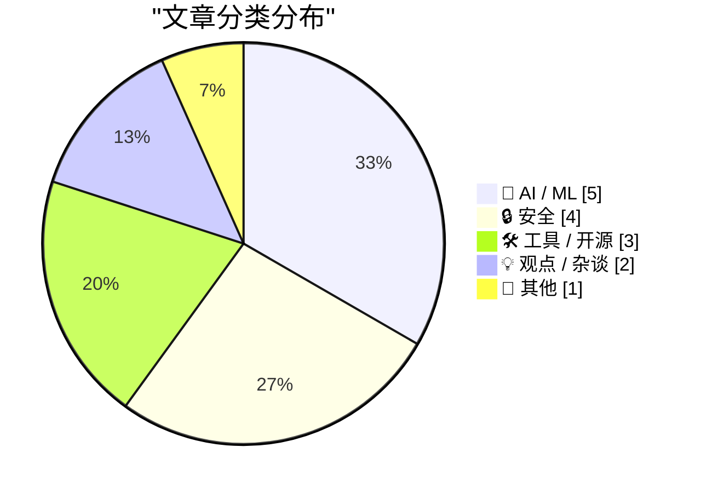
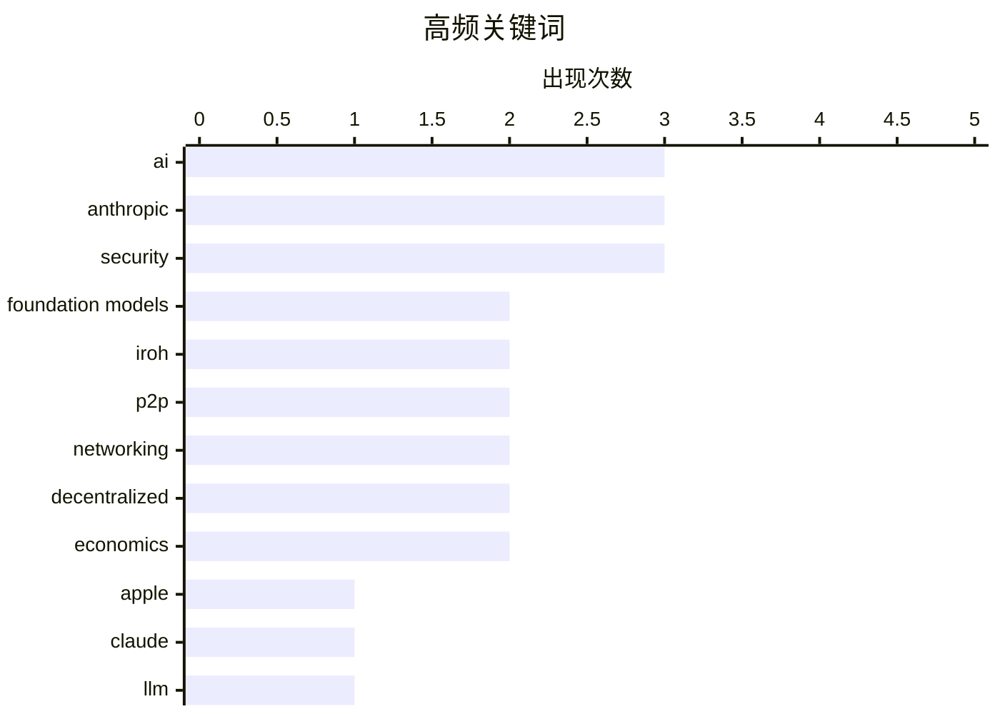

# 📰 AI 资讯每日精选 — 2026-06-16

> 汇聚 140+ 技术博客、X/Twitter、Hacker News、Reddit、Product Hunt、
> Lobste.rs、ClawFeed 日报及 GitHub Trending，经 AI 评分筛选。
>
> **本期内容**：🏆 今日必读 · 🌐 ClawFeed 日报 · 🔥 GitHub Trending · 📂 分类精选 · 🎨 设计与生成式 AI · 📊 数据概览

## 📝 今日看点

今日技术圈的核心议题围绕AI的“控制权”与“经济账”展开。一方面，美国政府与Anthropic的冲突、欧洲对模型关停的主权辩论，凸显了AI安全与地缘政治博弈的激化；另一方面，Apple自研基础模型、微软CEO警告少数AI系统将攫取全部经济回报，以及行业对AI高昂成本与变现困境的反思，共同指向了技术落地与商业可持续性的深层矛盾。此外，从LinkedIn钓鱼攻击到Curl暂停漏洞报告，基础设施安全与维护者的“喘息权”也成为不容忽视的暗线。

---

## 🏆 今日必读

🥇 **Apple 基础模型**

[Apple Foundation Models](https://platform.claude.com/docs/en/cli-sdks-libraries/libraries/apple-foundation-models) — Hacker News Best · 21 小时前 · 🤖 AI / ML

> 文章介绍了 Apple 在设备端和云端部署的基础模型技术方案。Apple 采用自研的 Transformer 架构，通过 3.6 万亿 token 的数据训练，并利用其自研芯片（如 A17 Pro 和 M 系列）进行高效推理。模型在隐私保护方面采用了差分隐私和联邦学习技术，确保用户数据不出设备。性能上，Apple 的模型在多项基准测试中与 GPT-3.5 和 Claude 3 等主流模型相当，但在延迟和功耗上具有显著优势。文章还详细说明了其模型压缩技术，包括量化和剪枝，使得 7B 参数的模型能在 iPhone 上实时运行。结论是 Apple 通过软硬件协同设计，证明了在移动设备上实现强大 AI 能力的可行性。

💡 **为什么值得读**: 如果你想了解 Apple 如何在不依赖云端的情况下，在 iPhone 上实现与 GPT-3.5 相当的 AI 能力，这篇技术文档是必读的。

🏷️ Apple, Foundation Models, AI, Claude

🥈 **美国政府要求 Anthropic 打造不可破解的 LLM，这可能是强人所难**

[The US government may be asking Anthropic the impossible by demanding unhackable LLMs](https://the-decoder.com/the-us-government-may-be-asking-anthropic-the-impossible-by-demanding-unhackable-llms/) — The Decoder · 8 小时前 · 🔒 安全

> 美国政府官员指责 Anthropic 无视特朗普政府的网络指令，未经批准就发布了 Fable 5 模型。一位政府官员直言“他们搞砸了我们”。目前，商务部、中情局以及科学顾问 Michael Kratsios 正在与 Anthropic 进行谈判。核心争议在于，政府要求 Anthropic 提供“不可被黑客攻破”的大语言模型，这在技术上是几乎不可能实现的目标。文章认为，这种不切实际的要求反映了政府与 AI 公司之间在安全标准上的巨大鸿沟。

💡 **为什么值得读**: 这篇文章揭示了美国政府在 AI 安全监管上提出的一个近乎荒谬的要求，对于理解政策制定者与技术现实之间的脱节非常有价值。

🏷️ Anthropic, LLM, security, government

🥉 **Anthropic 关停事件引发欧洲主权辩论**

[Anthropic shutdown sparks sovereignty debate across Europe](https://the-decoder.com/anthropic-shutdown-sparks-sovereignty-debate-across-europe/) — The Decoder · 15 小时前 · 🤖 AI / ML

> 美国行政命令迫使 Anthropic 在全球范围内关停了 Fable 5 和 Mythos 5 模型，欧盟委员会正在评估此事的影响。欧洲研究人员正在激烈辩论应对策略：是自主构建基础模型，还是通过合同确保访问权。专家警告，建设本土化基础设施需要欧洲目前严重缺乏的计算能力、能源和具有竞争力的供应商。这场辩论的核心是欧洲在 AI 领域的技术主权问题。结论是，欧洲在短期内难以摆脱对美国 AI 基础设施的依赖。

💡 **为什么值得读**: 这篇文章精准点出了欧洲在 AI 浪潮中的两难困境——既要技术主权又缺乏基础设施，是理解全球 AI 地缘政治格局的绝佳案例。

🏷️ Anthropic, EU, sovereignty, foundation models

4️⃣ **LinkedIn 职位邀请中的后门**

[A backdoor in a LinkedIn job offer](https://roman.pt/posts/linkedin-backdoor/) — Hacker News Best · 6 小时前 · 🔒 安全

> 文章揭露了一种通过 LinkedIn 职位邀请传播恶意软件的新型攻击手法。攻击者伪装成招聘人员，向目标发送包含恶意附件的“职位描述”PDF，该 PDF 利用未修补的漏洞在受害者机器上安装后门。作者详细分析了攻击链，包括社会工程学诱饵、PDF 中的 JavaScript 代码以及最终的有效载荷。该攻击专门针对安全研究人员和开发者，利用求职者的急切心理。文章还提供了检测和防御此类攻击的具体方法。

💡 **为什么值得读**: 这篇文章详细拆解了一种针对技术从业者的高级钓鱼攻击，对于任何在 LinkedIn 上活跃的求职者来说，是提升安全意识的必读内容。

🏷️ backdoor, LinkedIn, job offer, social engineering

5️⃣ **Iroh 1.0 正式发布**

[Iroh 1.0](https://www.iroh.computer/blog/v1) — Hacker News Best · 11 小时前 · 🛠 工具 / 开源

> Iroh 是一个基于 IPFS 和 QUIC 协议构建的去中心化网络库，现已发布 1.0 版本。它提供了类似 HTTP 的 API，但底层使用内容寻址和端到端加密，支持点对点直接通信。1.0 版本的关键改进包括：稳定的 API、性能提升（延迟降低 40%）、以及内置的 NAT 穿透能力。Iroh 旨在成为构建去中心化应用（dApps）的底层基础设施，替代传统的客户端-服务器架构。作者认为，Iroh 1.0 标志着去中心化网络从实验走向生产可用。

💡 **为什么值得读**: 如果你对构建去中心化应用或替代 HTTP 的底层协议感兴趣，Iroh 1.0 是一个值得关注的生产级解决方案。

🏷️ Iroh, P2P, networking, decentralized

---

## 🌐 ClawFeed 日报精选

> 来源：[ClawFeed](https://clawfeed.kevinhe.io) — AI 驱动的多源新闻聚合

# ClawFeed 日报 | 2026-06-15 (SGT)

基于今日 5 期 4h digest（ID 663–667，覆盖 00:00–20:00 SGT）综合生成。

---

## 🔥 当日全场最重要 5 条

**1. OpenRouter Fusion API——组合模型挑战 frontier lab 商业逻辑**
OpenRouter 发布 Fusion API，服务端"模型评审团"并行调度多模型 + web search + bash 工具，由 judge 合成最终回复，号称达 Fable 级智能但成本砍半。Andrew Trask（OpenMined 创始人）断言"组合模型必然胜过单一模型，frontier lab 将永远不再拥有前沿"——这不是产品发布，是对整个 frontier AI 商业模式的结构性挑战。Aaron Levie 附议：中间路由层价值将大幅提升。
来源: [04:00 SGT](https://x.com/iamtrask/status/2066022745972826558) / [12:00 SGT](https://x.com/kimmonismus/status/2066071673359524014)

**2. Anthropic 出口管制风暴：Fable/Mythos 下线，高管紧急赴白宫**
Anthropic 紧急派高级技术团队飞赴华盛顿修复与白宫的出口管制争端，Fable 和 Mythos 模型因政府管制被迫下线。这已从安全技术问题演变为 AI 治理问题——frontier model 的公众叙事正在重塑。副作用：Fable 禁令最大赢家是 open weights 模型，"模型可被召回"从理论风险变成现实先例，开放权重的博弈论价值大增。GLM 5.2 趁势宣称超越 Fable 5 且成本十分之一，国产/开源替代叙事加速。
来源: [08:00 SGT](https://x.com/MaxForAI/status/2066125881085706558) / [12:00 SGT](https://x.com/levie/status/2066167615618466060) / [20:00 SGT]

**3. Stripe Minions：每周 1,300+ PR 全由 AI 生成，人类只做 review**
Stripe 公开 Minions 架构第二部分，从第一篇的 1,000 PR 增长到每周 1,300+，全程无人值守 agent 编码，人类不写一行代码只做 review。这是目前公开的最大规模 AI-first 工程实践案例，证明"AI 写代码、人类审代码"的工作模式已在 Stripe 级别的公司跑通。
来源: [04:00 SGT](https://x.com/yibie/status/2066106795396137182)

**4. Satya Nadella "Token 资本"框架——AI 时代公司的新资产负债表**
微软 CEO 提出每家公司需同时经营两种资本：人力资本（知识/判断/关系网）和 Token 资本（公司自建的 AI 能力），两者相互放大而非此消彼长。Box CEO Aaron Levie 提炼：能把自有 IP、机构知识和数据转化为 AI 可消费格式的公司会赢。DhravyaShah 认为这是当前未被解决的关键问题。比"AI 替代人"的叙事精准得多，是今日最值得内化的思考框架。
来源: [08:00 SGT](https://x.com/0xperi_cat/status/2066125881085706558) / [16:00 SGT](https://x.com/DhravyaShah/status/2066223377568940308)

**5. Anthropic 1680 份工程师简历拆解：infra 为王，非学术光环**
有人扒了 Anthropic 全部工程师简历，反常识发现：招的几乎全是 infra 而非 researcher，中位数工作经验 12.2 年，仅 13% 有 PhD，最大人才来源是 Google/Meta 而非 OpenAI/DeepMind。Anthropic 的核心竞争力是工程深度——这对判断 frontier lab 的真实能力构成和人才策略有直接参考价值。
来源: [16:00 SGT](https://x.com/AI_Whisper_X/status/2066341186579927113)

---

## 📰 当日核心主题

### 1. Frontier Model 地缘政治化
Fable/Mythos 出口管制 → Anthropic 赴白宫谈判 → 开源/国产替代加速（GLM 5.2 宣称超越 Fable 5）→ Aaron Levie 断言 open weights 博弈论价值大增。AI 安全叙事正从技术问题升级为治理问题，"模型可被召回"成为现实先例。

### 2. AI Agent 架构范式争论
- **去中心化 vs 中央调度**：斯坦福论文挑战"必须有总管 Agent"的假设，去中心化协调在特定场景更优（跨两期反复出现）
- **Harness > Model**：同一模型同一 benchmark，换 harness 成绩从 42% 到 78%——竞争力在包裹模型的规则/工具/skill/反馈循环
- **Agent 经济**：Coinbase for Agents 让 AI agent 独立管理链上钱包；VC 圆桌讨论 agent 交易量何时超人类（1-5 年）

### 3. AI 工程实践工具井喷
- Vercel AI SDK 新增 agent harness 支持（Claude Code/Codex/Pi 均可接入）
- Claude Design 一句话生成可交互原型
- 微软 FARA 7B 模型做纯本地桌面自动化（开源）
- 阿里开源 Open Code Review（前内部工具，服务数万开发者）
- Databricks 开源 Omnigent meta-agent 编排框架
- llm-council skill：多模型投票机制

### 4. 精英体系 vs AI 的结构性冲击
- Garry Tan：精英教育核心能力是"比别人更快找到已知答案"，AI 让答案免费
- 彼得·蒂尔：AI 终结 200 年数学能力为核心的精英体系，未来竞争力在叙事和社交语境理解
- 斯坦福/MIT/NYU 联合论文：人们习惯用 AI 做简单任务，但真正杠杆在复杂多阶段协作任务

### 5. Scaling Law 还有墙吗
斯坦福 Self-Guided Self-Play 论文：LLM 在高质量人类数据耗尽后通过自我博弈继续提升推理能力。跨两期反复讨论，挑战 scaling 天花板叙事。

### 6. Crypto × AI 交叉叙事凝聚
- Coinbase for Agents（agent 链上操作）
- 以太坊抗量子方案进展（SPHINCS+ verifier 链上验证，$0.07/次，无需硬分叉）
- Onchain AI 叙事从"为什么"转向"为什么不"
- HYPE ETF 上市一个月吸引 1.61 亿美元净流入

---

## 🔖 累计 bookmark 精选

今日 bookmarks 均为历史积存（1-5 月），无新增日常 bookmark。但晚间 20:00 期次出现了几条值得注意的 bookmark 内容：

- **open-agent-sdk**：基于 claude-code-sourcemap 源码抽离核心逻辑的开源替代 claude-agent-sdk，可直接用于定制 agent 开发
- **Cline Kanban**：CLI-agnostic 多 agent 编排工具，兼容 Claude 和 Codex，`npm install` 即用
- **Harness 决定论**：同模型同 benchmark 换 harness 成绩 42%→78%，2026 年竞争力在 harness 不在 model
- **Google Stitch DESIGN.md**：一个 Markdown 文件教会 AI coding agent 整套设计系统，无需 Figma
- **Pika AI Avatar**：给 Agent 套实时虚拟形象，替身开会/赛博保姆

---

## 👀 推荐关注汇总

以下为今日各期推荐的新账号（已去重），**操作前请先在 Following 搜索确认未关注**：

| 账号 | 理由 |
|------|------|
| [@iamtrask](https://x.com/iamtrask) (Andrew Trask) | OpenMined 创始人，compound model / federated learning 深度思考者，对 Fusion API 的结构性判断质量高 |
| [@yibie](https://x.com/yibie) | 高质量中文 AI 工程内容搬运+翻译，输出频率和质量稳定 |
| [@rickawsb](https://x.com/rickawsb) | 中文 AI 前沿论文解读，Self-Guided Self-Play 分析有深度 |
| [@0xperi_cat](https://x.com/0xperi_cat) | 中文科技评论，善于提炼 CEO 长文核心框架，分析角度独到 |
| [@AI_Whisper_X](https://x.com/AI_Whisper_X) (AI Dance) | 数据驱动 AI 行业分析，Anthropic 简历拆解质量高，数据可追溯 |
| [@AlchainHust](https://x.com/AlchainHust) (花叔) | AI 工具深度实践者，Loop Engineering 橙皮书，building in public |

**建议取关**（连续多期标记）：
- @HeXiaobo — 最后推文 2018 年 7 月，超 7 年沉默，僵尸号
- @0xJasonBateman — 内容全是 Spotify 歌单和 NASA 转发，与 AI/crypto/tech 无关

---

## 💤 当日重复噪音模式

| 噪音模式 | 出现频次 | 典型例子 |
|----------|---------|---------|
| Elon Musk 低信息量互动 | 4/5 期 | 单词回复、生物实验室政治帖、火山基地玩笑、Grok Build 用户好评转发 |
| 招聘/招生帖 | 3/5 期 | 千问 PM 招聘、@seungkim0123 招生、@beefnoode 招聘转发 |
| Crypto 喊单/软广 | 3/5 期 | FUD 喊单、加仓喊单、$TURTLE meme coin、DeFi 借贷软广 |
| 纯生活/情绪帖 | 3/5 期 | 硅谷物价吐槽、教育焦虑、微信封群吐槽、科莫湖旅行 |
| 平台营销/PR | 2/5 期 | OKX VIP 宣传、Binance 活动延期、Rokid 媒体活动 |
| Follow-for-follow / 纯列表帖 | 2/5 期 | AI 创始人名单堆砌、explorer 列表帖 |
| 纯书评/纯艺术无文字 | 2/5 期 | @Bitwux 书评、纯 AI 生图无文字 |

---

*综合自 5 期 4h digest（#663 #664 #665 #666 #667）· 生成时间 2026-06-15 23:59 SGT*
---

## 🔥 GitHub Trending

> 今日热门开源项目（全语言 + Python）

| # | 项目 | 描述 | ⭐ 总星 | 📈 今日 | 语言 |
|---|------|------|---------|---------|------|
| 1 | [iptv-org/iptv](https://github.com/iptv-org/iptv) | Collection of publicly available IPTV channels from all o... | 123.0k | +2657 | TypeScript |
| 2 | [Panniantong/Agent-Reach](https://github.com/Panniantong/Agent-Reach) 🤖 | Give your AI agent eyes to see the entire internet. Read ... | 30.3k | +1100 | Python |
| 3 | [NVIDIA/SkillSpector](https://github.com/NVIDIA/SkillSpector) 🤖 | Security scanner for AI agent skills. Detect vulnerabilit... | 6.4k | +1079 | Python |
| 4 | [freeCodeCamp/freeCodeCamp](https://github.com/freeCodeCamp/freeCodeCamp) | freeCodeCamp.org's open-source codebase and curriculum. L... | 447.9k | +736 | TypeScript |
| 5 | [rohitg00/ai-engineering-from-scratch](https://github.com/rohitg00/ai-engineering-from-scratch) 🤖 | Learn it. Build it. Ship it for others. | 33.1k | +562 | Python |
| 6 | [Introduction-to-Autonomous-Robots/Introduction-to-Autonomous-Robots](https://github.com/Introduction-to-Autonomous-Robots/Introduction-to-Autonomous-Robots) | Introduction to Autonomous Robots | 3.1k | +489 | TeX |
| 7 | [chatwoot/chatwoot](https://github.com/chatwoot/chatwoot) | Open-source live-chat, email support, omni-channel desk. ... | 31.7k | +431 | Ruby |
| 8 | [shiyu-coder/Kronos](https://github.com/shiyu-coder/Kronos) | Kronos: A Foundation Model for the Language of Financial ... | 30.3k | +396 | Python |
| 9 | [jwasham/coding-interview-university](https://github.com/jwasham/coding-interview-university) | A complete computer science study plan to become a softwa... | 352.3k | +364 | - |
| 10 | [Free-TV/IPTV](https://github.com/Free-TV/IPTV) | M3U Playlist for free TV channels | 17.3k | +361 | Python |
| 11 | [itsfatduck/optimizerDuck](https://github.com/itsfatduck/optimizerDuck) | Free, open-source Windows optimization tool for performan... | 3.7k | +340 | C# |
| 12 | [andrewyng/aisuite](https://github.com/andrewyng/aisuite) 🤖 | Simple, unified interface to multiple Generative AI provi... | 14.6k | +255 | Python |
| 13 | [meshery/meshery](https://github.com/meshery/meshery) | Meshery, the cloud native manager | 10.6k | +228 | TypeScript |
| 14 | [music-assistant/server](https://github.com/music-assistant/server) | Music Assistant is a free, opensource Media library manag... | 2.4k | +225 | Python |
| 15 | [MODSetter/SurfSense](https://github.com/MODSetter/SurfSense) | An open source, privacy focused alternative to NotebookLM... | 14.8k | +201 | Python |

---

## 🤖 AI / ML

### 1. Apple 基础模型

[Apple Foundation Models](https://platform.claude.com/docs/en/cli-sdks-libraries/libraries/apple-foundation-models) — **Hacker News Best** · 21 小时前 · ⭐ 27/30

> 文章介绍了 Apple 在设备端和云端部署的基础模型技术方案。Apple 采用自研的 Transformer 架构，通过 3.6 万亿 token 的数据训练，并利用其自研芯片（如 A17 Pro 和 M 系列）进行高效推理。模型在隐私保护方面采用了差分隐私和联邦学习技术，确保用户数据不出设备。性能上，Apple 的模型在多项基准测试中与 GPT-3.5 和 Claude 3 等主流模型相当，但在延迟和功耗上具有显著优势。文章还详细说明了其模型压缩技术，包括量化和剪枝，使得 7B 参数的模型能在 iPhone 上实时运行。结论是 Apple 通过软硬件协同设计，证明了在移动设备上实现强大 AI 能力的可行性。

🏷️ Apple, Foundation Models, AI, Claude

---

### 2. Anthropic 关停事件引发欧洲主权辩论

[Anthropic shutdown sparks sovereignty debate across Europe](https://the-decoder.com/anthropic-shutdown-sparks-sovereignty-debate-across-europe/) — **The Decoder** · 15 小时前 · ⭐ 26/30

> 美国行政命令迫使 Anthropic 在全球范围内关停了 Fable 5 和 Mythos 5 模型，欧盟委员会正在评估此事的影响。欧洲研究人员正在激烈辩论应对策略：是自主构建基础模型，还是通过合同确保访问权。专家警告，建设本土化基础设施需要欧洲目前严重缺乏的计算能力、能源和具有竞争力的供应商。这场辩论的核心是欧洲在 AI 领域的技术主权问题。结论是，欧洲在短期内难以摆脱对美国 AI 基础设施的依赖。

🏷️ Anthropic, EU, sovereignty, foundation models

---

### 3. Pokémon Go 数据被用于训练与军用无人机相关的 AI

[Pokémon Go data helped train AI now linked to military drones](https://the-decoder.com/pokemon-go-data-helped-train-ai-now-linked-to-military-drones/) — **The Decoder** · 12 小时前 · ⭐ 24/30

> Pokémon Go 玩家贡献的 AR 扫描数据被用于训练 Niantic 的空间 AI 模型。这项技术现在正与美国国防承包商合作，用于开发无需 GPS 的导航系统。这意味着玩家在游戏中扫描现实世界环境的数据，最终被用于军事无人机导航。文章揭示了从游戏数据收集到军事应用之间的隐秘链条，引发了关于数据隐私和伦理的广泛担忧。

🏷️ Pokémon Go, spatial AI, military, drones

---

### 4. Ask HN：有人已经用本地模型完全替代 Claude/GPT 进行日常编码了吗？

[Ask HN: Has anyone replaced Claude/GPT with a local model for daily coding?](https://news.ycombinator.com/item?id=48542100) — **Hacker News Best** · 11 小时前 · ⭐ 24/30

> 这是一篇 Hacker News 上的讨论帖，询问开发者是否已用本地模型完全替代 Claude 或 GPT 作为主要编码工具。社区成员分享了各自的配置，包括使用 Llama 3 70B、CodeQwen 和 DeepSeek Coder 等模型。性能方面，用户报告在高端消费级 GPU（如 RTX 4090）上，70B 模型能达到 10-20 tok/s 的推理速度。多数人认为本地模型在代码补全和简单重构上已足够，但在复杂架构设计和长上下文理解上仍不及云端模型。结论是，对于注重隐私和离线工作的开发者，本地模型已具备实用价值，但尚未完全取代云端服务。

🏷️ local LLM, coding assistant, open-source model

---

### 5. How the brains learn [R]

[How the brains learn [R]](https://www.reddit.com/r/MachineLearning/comments/1u6x8al/how_the_brains_learn_r/) — **r/MachineLearning** · 2 小时前 · ⭐ 24/30

> <!-- SC_OFF --><div class="md"><p>Abstract: A sufficient account of how the neocortex learns must meet three criteria:</p> <ol> <li>Computationally, it must approximate a powerful, general-purpose lea

🏷️ neocortex, learning algorithm, neuroscience, scaling

---

## 🔒 安全

### 6. 美国政府要求 Anthropic 打造不可破解的 LLM，这可能是强人所难

[The US government may be asking Anthropic the impossible by demanding unhackable LLMs](https://the-decoder.com/the-us-government-may-be-asking-anthropic-the-impossible-by-demanding-unhackable-llms/) — **The Decoder** · 8 小时前 · ⭐ 26/30

> 美国政府官员指责 Anthropic 无视特朗普政府的网络指令，未经批准就发布了 Fable 5 模型。一位政府官员直言“他们搞砸了我们”。目前，商务部、中情局以及科学顾问 Michael Kratsios 正在与 Anthropic 进行谈判。核心争议在于，政府要求 Anthropic 提供“不可被黑客攻破”的大语言模型，这在技术上是几乎不可能实现的目标。文章认为，这种不切实际的要求反映了政府与 AI 公司之间在安全标准上的巨大鸿沟。

🏷️ Anthropic, LLM, security, government

---

### 7. LinkedIn 职位邀请中的后门

[A backdoor in a LinkedIn job offer](https://roman.pt/posts/linkedin-backdoor/) — **Hacker News Best** · 6 小时前 · ⭐ 26/30

> 文章揭露了一种通过 LinkedIn 职位邀请传播恶意软件的新型攻击手法。攻击者伪装成招聘人员，向目标发送包含恶意附件的“职位描述”PDF，该 PDF 利用未修补的漏洞在受害者机器上安装后门。作者详细分析了攻击链，包括社会工程学诱饵、PDF 中的 JavaScript 代码以及最终的有效载荷。该攻击专门针对安全研究人员和开发者，利用求职者的急切心理。文章还提供了检测和防御此类攻击的具体方法。

🏷️ backdoor, LinkedIn, job offer, social engineering

---

### 8. Curl 将在 2026 年 7 月暂停接收漏洞报告

[Curl will not accept vulnerability reports during July 2026](https://daniel.haxx.se/blog/2026/06/15/curl-summer-of-bliss/) — **Hacker News Best** · 20 小时前 · ⭐ 25/30

> Curl 项目创始人 Daniel Stenberg 宣布，将在 2026 年 7 月整个月暂停接收所有安全漏洞报告。此举是为了给维护团队一个“喘息月”，以处理积压的漏洞和进行代码审查。在此期间，Curl 将不会发布安全更新，但常规版本发布不受影响。Daniel 强调这是为了维护者的长期心理健康和项目可持续性。这一决定引发了社区关于开源项目维护者倦怠问题的广泛讨论。

🏷️ curl, vulnerability, security, open source

---

### 9. Users cry foul after AMD stripped memory crypto from its consumer CPUs

[Users cry foul after AMD stripped memory crypto from its consumer CPUs](https://arstechnica.com/security/2026/06/users-cry-foul-after-amd-stripped-memory-crypto-from-its-consumer-cpus/) — **Lobste.rs** · 6 小时前 · ⭐ 24/30

> <p><a href="https://lobste.rs/s/i2cjew/users_cry_foul_after_amd_stripped_memory">Comments</a></p>

🏷️ AMD, memory encryption, CPU, security

---

## 🛠 工具 / 开源

### 10. Iroh 1.0 正式发布

[Iroh 1.0](https://www.iroh.computer/blog/v1) — **Hacker News Best** · 11 小时前 · ⭐ 25/30

> Iroh 是一个基于 IPFS 和 QUIC 协议构建的去中心化网络库，现已发布 1.0 版本。它提供了类似 HTTP 的 API，但底层使用内容寻址和端到端加密，支持点对点直接通信。1.0 版本的关键改进包括：稳定的 API、性能提升（延迟降低 40%）、以及内置的 NAT 穿透能力。Iroh 旨在成为构建去中心化应用（dApps）的底层基础设施，替代传统的客户端-服务器架构。作者认为，Iroh 1.0 标志着去中心化网络从实验走向生产可用。

🏷️ Iroh, P2P, networking, decentralized

---

### 11. Typst 0.15 contains multitudes

[Typst 0.15 contains multitudes](https://typst.app/blog/2026/typst-0.15/) — **Lobste.rs** · 9 小时前 · ⭐ 24/30

> <p><a href="https://lobste.rs/s/fkoa80/typst_0_15_contains_multitudes">Comments</a></p>

🏷️ Typst, typesetting, release, LaTeX alternative

---

### 12. Iroh 1.0 - Dial Keys, not IPs

[Iroh 1.0 - Dial Keys, not IPs](https://www.iroh.computer/blog/v1) — **Lobste.rs** · 10 小时前 · ⭐ 24/30

> <p><a href="https://lobste.rs/s/cslljn/iroh_1_0_dial_keys_not_ips">Comments</a></p>

🏷️ Iroh, P2P, networking, decentralized

---

## 💡 观点 / 杂谈

### 13. AI 的破碎经济学

[AI's Brokenomics](https://www.wheresyoured.at/brokenomics/) — **wheresyoured.at** · 6 小时前 · ⭐ 24/30

> 文章深入分析了当前 AI 行业的经济模式，指出其存在严重的结构性缺陷。核心论点是，AI 模型的训练和推理成本极高，但商业化变现能力远低于预期，导致大多数 AI 公司处于亏损状态。文章以 NVIDIA 的 GPU 销售、Anthropic 的融资和运营数据为例，展示了资本投入与收入之间的巨大鸿沟。作者认为，当前的 AI 热潮更像是一场由风险资本驱动的泡沫，而非可持续的商业模式。结论是，除非出现革命性的成本下降或杀手级应用，否则 AI 行业将面临严重的“破碎经济学”问题。

🏷️ AI, economics, NVIDIA, Anthropic

---

### 14. 微软 CEO 萨提亚·纳德拉警告：少数 AI 系统将攫取全部经济回报

[Microsoft CEO Satya Nadella warns of "a small number of AI systems capturing all the economic returns"](https://the-decoder.com/microsoft-ceo-satya-nadella-warns-of-a-small-number-of-ai-systems-capturing-all-the-economic-returns/) — **The Decoder** · 16 小时前 · ⭐ 24/30

> 微软 CEO 萨提亚·纳德拉呼吁企业建立“token 资本”以补充人力资本，即基于内部数据和专有学习循环构建自己的 AI 能力。他警告，如果不这样做，少数几个大型模型将吸收整个行业的经济价值。纳德拉认为，企业必须拥有自己的 AI 能力，而不是仅仅作为外部 AI 服务的消费者。值得注意的是，这一论点恰好与微软 Azure 平台的商业逻辑相吻合。

🏷️ AI, economics, token capital, industry concentration

---

## 📝 其他

### 15. Salesforce to Acquire Fin (formerly Intercom) for $3.6B

[Salesforce to Acquire Fin (formerly Intercom) for $3.6B](https://www.salesforce.com/news/press-releases/2026/06/15/salesforce-signs-definitive-agreement-to-acquire-fin/?bc=HL) — **Hacker News Best** · 14 小时前 · ⭐ 24/30

> Article URL: https://www.salesforce.com/news/press-releases/2026/06/15/salesforce-signs-definitive-agreement-to-acquire-fin/?bc=HL
Comments URL: https://news.ycombinator.com/item?id=48540126
Points: 2

🏷️ Salesforce, Fin, acquisition, customer service

---

## 🎨 Design & Generative AI

### 🖼️ 生成式图片

- **[用LoRA微调生物基础模型：NVIDIA BioNeMo实战指南](https://developer.nvidia.com/blog/fine-tuning-biological-foundation-models-with-lora-using-nvidia-bionemo-recipes/)** — NVIDIA Technical Blog · 8 小时前
  > 介绍如何利用LoRA技术对ESM2等蛋白质语言模型进行高效微调，加速生物计算研究。

---

## 📊 数据概览

| 扫描源 | 抓取文章 | 时间范围 | 精选 |
|:---:|:---:|:---:|:---:|
| 93/140 | 3786 篇 → 80 篇 | 24h | **15 篇** |

### 分类分布



### 高频关键词



<details>
<summary>📈 纯文本关键词图（终端友好）</summary>

```
ai                │ ████████████████████ 3
anthropic         │ ████████████████████ 3
security          │ ████████████████████ 3
foundation models │ █████████████░░░░░░░ 2
iroh              │ █████████████░░░░░░░ 2
p2p               │ █████████████░░░░░░░ 2
networking        │ █████████████░░░░░░░ 2
decentralized     │ █████████████░░░░░░░ 2
economics         │ █████████████░░░░░░░ 2
apple             │ ███████░░░░░░░░░░░░░ 1
```

</details>

### 🏷️ 话题标签

**ai**(3) · **anthropic**(3) · **security**(3) · foundation models(2) · iroh(2) · p2p(2) · networking(2) · decentralized(2) · economics(2) · apple(1) · claude(1) · llm(1) · government(1) · eu(1) · sovereignty(1) · backdoor(1) · linkedin(1) · job offer(1) · social engineering(1) · curl(1)

---

*生成于 2026-06-16 02:15 | 汇聚 140 个技术博客、X/Twitter、Hacker News、Reddit、Product Hunt、Lobste.rs、ClawFeed 日报及 GitHub Trending，经 AI 评分筛选出 Top 15 精华内容*
