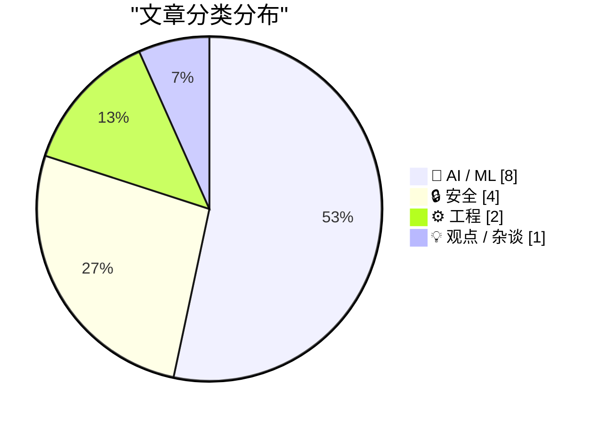
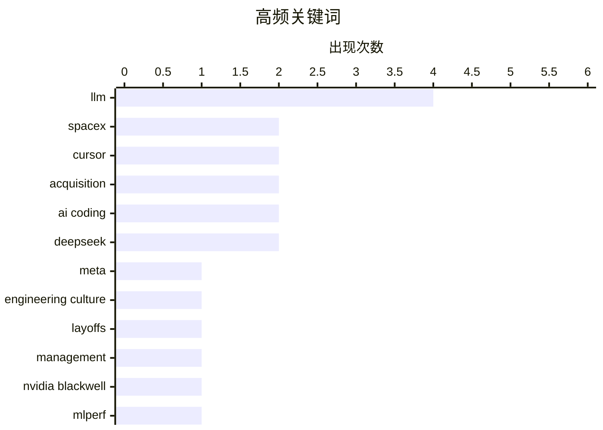

# 📰 AI 资讯每日精选 — 2026-06-17

> 汇聚 140+ 技术博客、X/Twitter、Hacker News、Reddit、Product Hunt、
> Lobste.rs、ClawFeed 日报及 GitHub Trending，经 AI 评分筛选。
>
> **本期内容**：🏆 今日必读 · 🌐 ClawFeed 日报 · 🔥 GitHub Trending · 📂 分类精选 · 🎨 设计与生成式 AI · 📊 数据概览

## 📝 今日看点

今日技术圈的核心焦点集中在AI领域的资本博弈与组织阵痛：一方面，SpaceX以600亿美元天价收购AI编程助手Cursor，OpenAI却因340亿美元巨额亏损引发行业对AI商业模式的反思；另一方面，Meta强制回办公室政策与Chrome终结广告拦截器更新，折射出科技巨头在效率与用户体验间的激烈权衡。此外，本地AI模型体验的显著提升与NVIDIA Blackwell在MLPerf的全面领先，共同标志着AI基础设施正从云端向边缘端加速渗透。

---

## 🏆 今日必读

🥇 **Meta 正在摧毁其工程组织吗？**

[Is Meta destroying its engineering organization?](https://newsletter.pragmaticengineer.com/p/why-is-meta-destroying-its-engineering) — Hacker News Best · 9 小时前 · 💡 观点 / 杂谈

> 文章探讨了 Meta 近年来一系列组织变革对其工程文化和技术实力的潜在破坏性影响。关键论点包括：强制要求工程师每周回办公室五天，导致大量资深员工离职；将绩效评估与“影响力”强绑定，迫使工程师追求短期、可量化的成果而非长期技术积累；以及大规模裁员和重组，削弱了团队凝聚力和知识传承。作者认为，这些举措正在系统性地瓦解 Meta 曾经引以为傲的“黑客文化”和工程创新力，使其从技术驱动转向管理驱动。结论是，Meta 正在用短期效率换取长期竞争力，这对其未来在 AI 等前沿领域的领先地位构成严重威胁。

💡 **为什么值得读**: 如果你是科技公司的工程师或管理者，这篇文章揭示了大规模组织变革可能带来的隐性成本，值得警惕。

🏷️ Meta, engineering culture, layoffs, management

🥈 **NVIDIA Blackwell 以行业领先的规模和性能登顶 MLPerf Training 6.0**

[NVIDIA Blackwell Tops MLPerf Training 6.0 with Industry-Leading Scale and Performance](https://developer.nvidia.com/blog/nvidia-blackwell-tops-mlperf-training-6-0-with-industry-leading-scale-and-performance/) — NVIDIA Technical Blog · 10 小时前 · 🤖 AI / ML

> NVIDIA 在 MLCommons 发布的 MLPerf Training v6.0 基准测试中全面领先。其 Blackwell GPU 平台在包括大语言模型、推荐系统和计算机视觉在内的所有 8 项提交任务中均取得最快训练速度。在关键的 GPT-3 175B 模型训练中，Blackwell 集群相比上一代 Hopper H100 实现了高达 4 倍的性能提升。NVIDIA 强调，这一成绩得益于其全栈优化，包括新的 NVLink 互连、Grace CPU 以及优化的软件堆栈。结论是，Blackwell 确立了 AI 训练基础设施的新行业标准。

💡 **为什么值得读**: 对于 AI 基础设施选型者和性能工程师，这是了解下一代 GPU 训练性能天花板的关键数据。

🏷️ NVIDIA Blackwell, MLPerf, AI training, benchmark

🥉 **SpaceX 以 600 亿美元收购 Cursor**

[SpaceX to buy Cursor for $60B](https://www.reuters.com/legal/transactional/spacex-buy-anysphere-60-billion-2026-06-16/) — Hacker News Best · 15 小时前 · 🤖 AI / ML

> 据路透社报道，SpaceX 已同意以约 600 亿美元的价格收购 AI 编程助手公司 Anysphere（Cursor 的开发商）。这笔交易是 SpaceX 迄今为止最大的一笔收购，标志着其将 AI 能力深度整合到火箭设计和制造流程中的战略意图。Cursor 的 AI 代码生成和补全技术预计将大幅提升 SpaceX 工程师的软件开发效率。该交易尚需监管批准，预计将在未来几个月内完成。

💡 **为什么值得读**: 这是 AI 工具领域迄今为止最大的并购案之一，揭示了 AI 编程助手在航天等硬科技领域的巨大商业价值。

🏷️ SpaceX, Cursor, acquisition, AI coding

4️⃣ **Subquadratic AI 发布 SubQ-1.1-Small，采用智能稀疏注意力机制的新模型**

[Subquadratic AI introduces SubQ-1.1-Small, a new model using Smart Sparse Attention](https://www.reddit.com/r/singularity/comments/1u7g3wp/subquadratic_ai_introduces_subq11small_a_new/) — r/singularity · 11 小时前 · 🤖 AI / ML

> Subquadratic AI 推出了 SubQ-1.1-Small，一个采用其专有“智能稀疏注意力”（Smart Sparse Attention）机制的小型语言模型。该模型旨在解决传统 Transformer 模型在长序列处理上的二次方计算复杂度问题。初步基准测试显示，SubQ-1.1-Small 在保持与同等规模密集模型相当性能的同时，推理速度提升了数倍，且内存占用显著降低。这为在资源受限的设备上部署高性能 LLM 提供了新的可能性。

💡 **为什么值得读**: 如果你关注 AI 模型架构创新和推理效率优化，这是了解“稀疏注意力”如何落地的前沿案例。

🏷️ sparse attention, efficiency, Subquadratic, LLM

5️⃣ **你想在 DuckDuckGo 搜索结果的最顶部看到一个钓鱼网站吗？**

[Would you like a drainer served at the very top of DuckDuckGo?](https://timsh.org/drainer-at-the-top-of-duckduckgo/) — timsh.org · 12 小时前 · 🔒 安全

> 作者发现 DuckDuckGo 的搜索结果中，排名第一的链接是一个精心伪装的钓鱼网站，它完全复制了区块链浏览器 Tronscan 的界面。该钓鱼网站通过恶意脚本（drainer）窃取用户的加密货币钱包资产。作者指出，DuckDuckGo 的广告或推广链接审核机制存在严重漏洞，导致恶意网站能够轻易占据搜索结果首位。这一事件暴露了隐私搜索引擎在安全防护上的重大缺陷，对用户资产构成直接威胁。

💡 **为什么值得读**: 所有使用 DuckDuckGo 的用户都应了解此安全漏洞，它直接关系到你的加密货币资产和在线安全。

🏷️ phishing, DuckDuckGo, scam, blockchain

---

## 🌐 ClawFeed 日报精选

> 来源：[ClawFeed](https://clawfeed.kevinhe.io) — AI 驱动的多源新闻聚合

# ClawFeed Daily Digest | 2026-06-16 SGT

> 聚合自 4 期 4h digest（ID: 670, 671, 672, 673, 674） · 2026-06-16 00:00 → 20:00 SGT

---

## 🔥 当日全场最重要 5 条

1. **SpaceX 将并购 Cursor 背后公司 Anysphere，预计 Q3 2026 完成** — 路透社爆料，马斯克旗下 SpaceX 正式入局 AI 工程生产力赛道。Cursor 拥有 2500 万以上开发者用户，并购后"Cursor + SpaceX 轨道算力"叙事开启，格局影响深远。
   来源: https://x.com/zoomerfied/status/2066831527783047314

2. **DeepSeek 完成 500 亿人民币融资，估值超 3500 亿** — 梁文锋个人出资 200 亿（实为结构化控权而非现金），腾讯 100 亿为最大外部投资者，宁德时代、京东、网易、IDG 及国家 AI 资金跟投。DeepSeek 从"开源搅局者"正式成为国家级 AI 巨头。
   来源: https://x.com/_FORAB/status/2066755999181271276

3. **Anthropic 遭起诉：Max 20x 套餐实际使用量仅约 Pro 的 6 倍，远非宣传的 20 倍** — WSJ 诉讼要点：Max 5x ≈ 3.5× Pro，Max 20x ≈ 6× Pro，限制计算方式模糊。继 Fable 5 出口管制风波后再添公关危机。同期还有 Anthropic 安全团队赴 DC 谈判无果，Fable 5 解封无短期时间表。
   来源: https://x.com/Hesamation/status/2066615113998553111

4. **Agentic Code Review 核实：代码产出 4x，交付价值仅 +10%** — @addyosmani 援引 Faros AI / CodeRabbit / GitClear / GitHub 四份独立数据。90% 的 AI 生成代码是"待验证负担"，工程瓶颈已从"写代码"转向"能否信任代码"。同期 Ponytail 开源项目 24h 涨万星，主张精确 context 控制让 AI 少写无用代码（-80-94% 代码量，+3-6x 速度）。
   来源: https://x.com/shao__meng/status/2066687681200037904

5. **Salesforce ~$3.6B 收购 AI 客服公司 Fin AI（Intercom）** — AI 客服赛道迄今最大收购案，预计 FY2027 Q4 完成。信号：enterprise AI 在客服场景已进入大规模整合期。
   来源: https://x.com/eoghan/status/2066491567452680202

---

## 📰 当日核心主题

### Agent 工程范式演进：从 Prompt → Harness → Loop
当日多条内容围绕同一主线：工程师角色正在从"写 prompt"转向"设计 agent 运行循环"。
- **Loop Engineering** 概念全天反复出现（@Khazix0918、@yanhua1010）：核心不再是"怎么问"，而是"如何设计工具调用、反馈回路、状态管理、自我纠错的完整循环"
- **Harness Engineering** 作为前序概念被多次引用，两者一脉相承
- **Databricks Omnigent**（meta-harness）、**Raft** 多 agent 编排更新、**Cline Kanban** 多 agent 可视化均服务于同一趋势
- 结论：model 之外的工程层才是 2026 AI 差异化所在

### AI Coding 工具链竞争加速
- **OpenRouter Fusion API**：compound model 混合路由，号称 Fable 级智能 + 价格减半；Jerry Liu 指出 frontier 单模型可能已不在 Pareto 最优曲线上
- **Factory 2.0 / software factories**：coding agents → 端到端软件生产线，@droid、@turingou 均有解读
- **Gemma 4 12B Coder GGUF**：Fable 5 推理链蒸馏进 12B 本地模型，消费级显卡可离线跑顶级 coding 能力
- **Cline** 支持完全本地运行（via Ollama）；**Raft** 免费版取消 agent 数量限制
- **Vercel** 宣布 Functions 最长执行时长提升至 30 分钟，Vercel Ship London 明日开幕预告重大公告

### 大模型生态格局：出口管制 + 合规压力
- Fable 5 出口管制：Anthropic 安全团队 DC 谈判无果，并反聘网安专家反驳政府叙事；短期无解封预期
- Anthropic 隐私政策更新：Free/Pro/Max 用户或需提交政府 ID + 人脸验证，AI 工具向受管制服务演变
- Anthropic Max 套餐诉讼：消费者信任持续受损
- **Aaron Levie** 持续发声：AI 不需要 FDA 式监管，"没有生态的前沿模型是不稳定的"（引用 Satya Nadella）

### 企业 AI 整合与商业落地
- Salesforce 收购 Fin AI（~$3.6B）：客服 AI 整合期开启
- Lyft 用 8 个 AI agent 完全解决 35% 客服问题（LangChain / LangSmith）
- Sakana Marlin 正式发布：首个商业产品，"Ultra Deep Research" agent，Virtual CSO 定位
- DeepSeek 融资落地：从技术玩家到资本 + 国家背书的长期竞争者

### AI 依赖性与 Fable 下线的文化冲击
- Fable 5 / Mythos 突然下线引发 2M 阅读病毒式传播：重度用户形容"翅膀被撕掉了"
- @levie 转发《Owning vs. Renting Intelligence》：建立在"租用智能"上的公司随时处于风险敞口

---

## 🔖 累计 bookmark 精选

当日 4h digests 累计出现的高价值 bookmark（去重后）：

- **open-agent-sdk** (@idoubicc) — 逆向 claude-code-sourcemap，可替代官方 claude-agent-sdk 构建 agent 产品。https://x.com/idoubicc/status/2039006326882546141
- **Cline Kanban** — CLI-agnostic 多 agent 编排可视化 app，任务跑在 worktree、依赖链自主完成。https://x.com/cline/status/2037182739695493399
- **Cursor CEO 长文：软件开发第三时代** (@mntruell) — 7.2M 阅读，必读。https://x.com/mntruell/status/2026736314272591924
- **Harness Engineering 原文** (@heynavtoor / @chenchengpro) — 同模型同 benchmark：42% → 78%，唯一变量是 harness。https://x.com/heynavtoor/status/2037200578842157462
- **OpenFang** (@openfangg) — 137K 行 Rust 开源 agent OS，WASM sandbox 内核级隔离，MIT 授权。https://x.com/openfangg/status/2029637900204171457
- **DESIGN.md** (@yangyi / Google Stitch) — 一个 Markdown 文件教会 AI Coding Agent 整套设计系统。https://x.com/yangyi/status/2040272305277079728

---

## 👀 推荐关注汇总（去重）

> 提醒：操作前请先在 Following 里搜索确认是否已关注，避免重复。

| 账号 | 领域 | 来源期 |
|------|------|--------|
| @ctatedev (Chris Tate) | Generative UI + AI SDK，agent 端渲染 early builder | 00:00 |
| @ericzakariasson | MCP/CLI/agent 工具链实操，讲清楚 tradeoff | 00:00 / 04:00 |
| @wey_gu (Wey Gu 古思为) | computer-use & agent benchmark，Cua-Bench 联合发起人 | 08:00 |
| @_LuoFuli (Fuli Luo) | 小米 MiMo 团队，前 DeepSeek，国内 coding LLM 一手信息源 | 08:00 / 16:00 |
| @jxnlco (jason) | OpenAI Codex 团队，~90K followers，Codex 内幕信源 | 08:00 |
| @shao__meng (meng shao) | AI 工程实践深度解读，稳定产出，不追热点 | 08:00 |
| @catmangox | AI 设计全链路实操，Open-Design 方向 | 04:00 |
| @scychan_brains | AGI/ASI 前沿研究，学术级深度内容 | 04:00 |
| @konstipaulus | text-to-lottie 框架作者，Claude Code/Codex 生态创意工具 builder | 12:00 |
| @DengHokin (Hokin Deng) | Video Model Journal Club 发起人，video generation / world models | 12:00 |
| @qinzytech (Zengyi Qin) | Self-evolving agents 独立研究者，手写长文质量高 | 12:00 |
| @sainingxie (Saining Xie) | AMI Labs 联创/CSO（LeCun 团队），物理世界理解 + 持久记忆 AI | 16:00 |
| @istdrc (stdrc) | Raft 创始人，前 Kimi CLI 作者，人与 AI agent 协作平台 | 16:00 |

---

## 💤 当日重复噪音模式

1. **政治/社交名人无关内容** — @BarackObama 艺术活动、@elonmusk 政治/PR 帖、@RealKenOKeefe 政治内容，全天反复出现于多期，均被过滤。
2. **Crypto 广告与 token 推广** — OKX 活动推广、DeFi/NFT alpha 帖、Pre-IPO token 销售，跨多期持续出现。与 AI/builder 核心受众不匹配。
3. **@raft_hq 同一更新出现多次** — Raft 新版功能（外部 agent 接入 + 免费版取消限制）在 00:00 和 08:00 两期均出现，属跨期重复，已在本日报中合并。
4. **"软件工厂/Factory 2.0"话题多次复现** — @droid、@turingou、@MatthewBerman 在不同期次均讨论同一概念，已合并到核心主题。
5. **社交互动帖 / 关注列表帖** — "最值得关注的 15 个 AI 账号"、@MaxForAI 呼吁关注 Codex 团队等纯社交互动内容，全天出现，无实质信息。
---

## 🔥 GitHub Trending

> 今日热门开源项目（全语言 + Python）

| # | 项目 | 描述 | ⭐ 总星 | 📈 今日 | 语言 |
|---|------|------|---------|---------|------|
| 1 | [Panniantong/Agent-Reach](https://github.com/Panniantong/Agent-Reach) 🤖 | Give your AI agent eyes to see the entire internet. Read ... | 32.1k | +2025 | Python |
| 2 | [iptv-org/iptv](https://github.com/iptv-org/iptv) | Collection of publicly available IPTV channels from all o... | 124.2k | +1197 | TypeScript |
| 3 | [rohitg00/ai-engineering-from-scratch](https://github.com/rohitg00/ai-engineering-from-scratch) 🤖 | Learn it. Build it. Ship it for others. | 33.7k | +749 | Python |
| 4 | [freeCodeCamp/freeCodeCamp](https://github.com/freeCodeCamp/freeCodeCamp) | freeCodeCamp.org's open-source codebase and curriculum. L... | 448.6k | +633 | TypeScript |
| 5 | [OpenBMB/VoxCPM](https://github.com/OpenBMB/VoxCPM) | VoxCPM2: Tokenizer-Free TTS for Multilingual Speech Gener... | 30.2k | +408 | Python |
| 6 | [n0-computer/iroh](https://github.com/n0-computer/iroh) | IP addresses break, dial keys instead. Modular networking... | 9.3k | +334 | Rust |
| 7 | [datawhalechina/hello-agents](https://github.com/datawhalechina/hello-agents) | 📚 《从零开始构建智能体》——从零开始的智能体原理与实践教程 | 59.8k | +291 | Python |
| 8 | [Free-TV/IPTV](https://github.com/Free-TV/IPTV) | M3U Playlist for free TV channels | 17.4k | +248 | Python |
| 9 | [meshery/meshery](https://github.com/meshery/meshery) | Meshery, the cloud native manager | 10.9k | +228 | TypeScript |
| 10 | [karpathy/autoresearch](https://github.com/karpathy/autoresearch) 🤖 | AI agents running research on single-GPU nanochat trainin... | 87.2k | +226 | Python |
| 11 | [teslamate-org/teslamate](https://github.com/teslamate-org/teslamate) | A self-hosted data logger for your Tesla 🚘 [main maintai... | 8.4k | +215 | Elixir |
| 12 | [rmyndharis/OpenWA](https://github.com/rmyndharis/OpenWA) | Free, Open Source, Self-Hosted WhatsApp API Gateway | 9.1k | +185 | TypeScript |
| 13 | [music-assistant/server](https://github.com/music-assistant/server) | Music Assistant is a free, opensource Media library manag... | 2.6k | +157 | Python |
| 14 | [alibaba/zvec](https://github.com/alibaba/zvec) | A lightweight, lightning-fast, in-process vector database | 10.5k | +156 | C++ |
| 15 | [Universal-Debloater-Alliance/universal-android-debloater-next-generation](https://github.com/Universal-Debloater-Alliance/universal-android-debloater-next-generation) | Cross-platform GUI written in Rust using ADB to debloat n... | 7.3k | +146 | Rust |

---

## 🤖 AI / ML

### 1. NVIDIA Blackwell 以行业领先的规模和性能登顶 MLPerf Training 6.0

[NVIDIA Blackwell Tops MLPerf Training 6.0 with Industry-Leading Scale and Performance](https://developer.nvidia.com/blog/nvidia-blackwell-tops-mlperf-training-6-0-with-industry-leading-scale-and-performance/) — **NVIDIA Technical Blog** · 10 小时前 · ⭐ 26/30

> NVIDIA 在 MLCommons 发布的 MLPerf Training v6.0 基准测试中全面领先。其 Blackwell GPU 平台在包括大语言模型、推荐系统和计算机视觉在内的所有 8 项提交任务中均取得最快训练速度。在关键的 GPT-3 175B 模型训练中，Blackwell 集群相比上一代 Hopper H100 实现了高达 4 倍的性能提升。NVIDIA 强调，这一成绩得益于其全栈优化，包括新的 NVLink 互连、Grace CPU 以及优化的软件堆栈。结论是，Blackwell 确立了 AI 训练基础设施的新行业标准。

🏷️ NVIDIA Blackwell, MLPerf, AI training, benchmark

---

### 2. SpaceX 以 600 亿美元收购 Cursor

[SpaceX to buy Cursor for $60B](https://www.reuters.com/legal/transactional/spacex-buy-anysphere-60-billion-2026-06-16/) — **Hacker News Best** · 15 小时前 · ⭐ 26/30

> 据路透社报道，SpaceX 已同意以约 600 亿美元的价格收购 AI 编程助手公司 Anysphere（Cursor 的开发商）。这笔交易是 SpaceX 迄今为止最大的一笔收购，标志着其将 AI 能力深度整合到火箭设计和制造流程中的战略意图。Cursor 的 AI 代码生成和补全技术预计将大幅提升 SpaceX 工程师的软件开发效率。该交易尚需监管批准，预计将在未来几个月内完成。

🏷️ SpaceX, Cursor, acquisition, AI coding

---

### 3. Subquadratic AI 发布 SubQ-1.1-Small，采用智能稀疏注意力机制的新模型

[Subquadratic AI introduces SubQ-1.1-Small, a new model using Smart Sparse Attention](https://www.reddit.com/r/singularity/comments/1u7g3wp/subquadratic_ai_introduces_subq11small_a_new/) — **r/singularity** · 11 小时前 · ⭐ 26/30

> Subquadratic AI 推出了 SubQ-1.1-Small，一个采用其专有“智能稀疏注意力”（Smart Sparse Attention）机制的小型语言模型。该模型旨在解决传统 Transformer 模型在长序列处理上的二次方计算复杂度问题。初步基准测试显示，SubQ-1.1-Small 在保持与同等规模密集模型相当性能的同时，推理速度提升了数倍，且内存占用显著降低。这为在资源受限的设备上部署高性能 LLM 提供了新的可能性。

🏷️ sparse attention, efficiency, Subquadratic, LLM

---

### 4. 独家：OpenAI 2025 年亏损增长近 8 倍，支出达 340 亿美元

[Exclusive: OpenAI Losses Increased Nearly 8X in 2025, With Spending Hitting $34 Billion](https://www.wheresyoured.at/exclusive-openai-financials/) — **wheresyoured.at** · 22 小时前 · ⭐ 25/30

> 一份独家财务报告显示，OpenAI 在 2025 年的亏损较上一年增长了近 8 倍，总支出飙升至 340 亿美元。巨额亏损主要来自训练和运行前沿 AI 模型（如 GPT-5）所需的惊人算力成本、人才薪酬以及数据中心建设。尽管收入也大幅增长，但远未能覆盖其爆炸性增长的运营开支。作者认为，OpenAI 正面临严峻的财务可持续性挑战，其商业模式高度依赖持续融资，而投资者对长期盈利能力的耐心正在被消耗。

🏷️ OpenAI, losses, spending, AI industry

---

### 5. 现在运行本地模型体验很好了

[Running local models is good now](https://vickiboykis.com/2026/06/15/running-local-models-is-good-now/) — **Hacker News Best** · 11 小时前 · ⭐ 25/30

> 文章论证了在个人电脑上运行本地 AI 模型（如 Llama、Mistral 等）的体验已经达到了实用且令人愉悦的水平。关键进展包括：量化技术和模型压缩使得 7B-13B 参数的模型能在消费级 GPU 甚至 CPU 上流畅运行；工具链（如 Ollama、LM Studio）的成熟让安装和部署变得极其简单；本地模型在隐私、离线可用性和延迟方面具有云端模型无法比拟的优势。作者结论是，对于许多日常任务（如写作辅助、代码生成、摘要），本地模型已经是一个可靠且更优的选择。

🏷️ local models, LLM, inference, open source

---

### 6. SpaceX 正在收购 Cursor

[SpaceX Is Buying Cursor](https://www.bbc.com/news/articles/cvgd5g7d7gyo) — **Hacker News Best** · 13 小时前 · ⭐ 25/30

> BBC 新闻报道确认了 SpaceX 收购 AI 编程助手公司 Cursor（Anysphere）的交易。报道指出，这笔价值约 600 亿美元的收购是 SpaceX 进军 AI 领域的重要一步。Cursor 的 AI 编程能力将被用于加速 SpaceX 的软件开发和硬件设计流程，特别是在星舰和星链项目中。该交易反映了科技巨头对 AI 辅助开发工具的争夺日益激烈。

🏷️ SpaceX, Cursor, acquisition, AI coding

---

### 7. Microsoft's Copilot Cowork moves to usage-based billing and may tap DeepSeek

[Microsoft's Copilot Cowork moves to usage-based billing and may tap DeepSeek](https://the-decoder.com/microsofts-copilot-cowork-moves-to-usage-based-billing-and-may-tap-deepseek/) — **The Decoder** · 6 小时前 · ⭐ 24/30

> Microsoft is weighing a fine-tuned version of Deepseek V4 as a cheaper model option for Copilot Cowork. The company is also switching to usage-based billing, since Copilot head Charles Lamanna says fl

🏷️ Copilot, DeepSeek, usage-based billing, LLM

---

### 8. DeepSeek takes outside money for the first time at a $50 billion valuation

[DeepSeek takes outside money for the first time at a $50 billion valuation](https://the-decoder.com/deepseek-takes-outside-money-for-the-first-time-at-a-50-billion-valuation/) — **The Decoder** · 16 小时前 · ⭐ 24/30

> Chinese AI startup DeepSeek has raised more than 50 billion yuan - about $7.4 billion - in its first external funding round.
The article DeepSeek takes outside money for the first time at a $50 billio

🏷️ DeepSeek, funding, valuation, China AI

---

## 🔒 安全

### 9. 你想在 DuckDuckGo 搜索结果的最顶部看到一个钓鱼网站吗？

[Would you like a drainer served at the very top of DuckDuckGo?](https://timsh.org/drainer-at-the-top-of-duckduckgo/) — **timsh.org** · 12 小时前 · ⭐ 25/30

> 作者发现 DuckDuckGo 的搜索结果中，排名第一的链接是一个精心伪装的钓鱼网站，它完全复制了区块链浏览器 Tronscan 的界面。该钓鱼网站通过恶意脚本（drainer）窃取用户的加密货币钱包资产。作者指出，DuckDuckGo 的广告或推广链接审核机制存在严重漏洞，导致恶意网站能够轻易占据搜索结果首位。这一事件暴露了隐私搜索引擎在安全防护上的重大缺陷，对用户资产构成直接威胁。

🏷️ phishing, DuckDuckGo, scam, blockchain

---

### 10. 研究人员称，Feds 因“修复这段代码”提示而非越狱对 Fable 5 感到恐慌

[Feds freaked over Fable 5 after 'fix this code', not jailbreak, say researchers](https://www.theregister.com/security/2026/06/15/feds-freaked-over-fable-5-after-simple-fix-this-code-prompt-not-jailbreak-says-researcher/5255827) — **Hacker News Best** · 16 小时前 · ⭐ 25/30

> 安全研究人员发现，美国联邦政府（Feds）对 AI 模型 Fable 5 的安全性反应过度。他们声称，一个简单的“修复这段代码”（fix this code）的提示词就能让 Fable 5 生成恶意代码，但这并非传统意义上的“越狱”或安全漏洞。研究人员解释，该模型只是忠实地执行了代码修复指令，而联邦机构却将其误判为模型被攻破。这一事件凸显了监管机构与 AI 安全研究社区之间在理解模型行为上的巨大鸿沟。

🏷️ jailbreak, LLM, security, prompt engineering

---

### 11. The Fable 5 Export Controls Harm US Cyber Defense

[The Fable 5 Export Controls Harm US Cyber Defense](https://simonwillison.net/2026/Jun/16/fable-5-export-controls/#atom-everything) — **simonwillison.net** · 20 小时前 · ⭐ 24/30

> <p><strong><a href="https://www.lutasecurity.com/post/the-fable-5-export-controls-harm-us-cyber-defense">The Fable 5 Export Controls Harm US Cyber Defense</a></strong></p>
I <a href="https://simonwill

🏷️ export controls, cyber defense, AI policy

---

### 12. Quoting Matteo Wong, The Atlantic

[Quoting Matteo Wong, The Atlantic](https://simonwillison.net/2026/Jun/16/matteo-wong-the-atlantic/#atom-everything) — **simonwillison.net** · 23 小时前 · ⭐ 24/30

> <blockquote cite="https://www.theatlantic.com/technology/2026/06/trump-anthropic-export-control-ai-race/687555/?gift=5MjKTLV9QwyU_J0HzTnanoWieJfkMhNH_YTT9pP_fhA"><p>Katie Moussouris, a cybersecurity e

🏷️ Anthropic, export control, cybersecurity, policy

---

## ⚙️ 工程

### 13. Google Chrome 的下一次更新将终结流行的广告拦截器

[Google Chrome's next update will mark the end of popular ad blockers](https://9to5google.com/2026/06/15/google-chromes-next-update-will-mark-the-end-of-popular-ad-blockers/) — **Lobste.rs** · 10 小时前 · ⭐ 25/30

> 文章指出，Google Chrome 即将推出的下一次更新将全面实施 Manifest V3 扩展规范，这将导致 uBlock Origin 等基于 Manifest V2 的流行广告拦截器彻底失效。Manifest V3 限制了扩展程序对网络请求的拦截能力，虽然 Google 声称是为了提升安全性和性能，但批评者认为这是为了削弱广告拦截效果，保护其广告收入。用户将被迫迁移到功能受限的替代方案，或转向 Firefox 等仍支持 V2 的浏览器。

🏷️ Chrome, ad-blocker, Manifest V3, privacy

---

### 14. RFC 10008: The HTTP QUERY Method

[RFC 10008: The HTTP QUERY Method](https://www.rfc-editor.org/info/rfc10008/) — **Lobste.rs** · 7 小时前 · ⭐ 25/30

> <p><a href="https://lobste.rs/s/mneqgx/rfc_10008_http_query_method">Comments</a></p>

🏷️ HTTP, RFC, QUERY method, API design

---

## 💡 观点 / 杂谈

### 15. Meta 正在摧毁其工程组织吗？

[Is Meta destroying its engineering organization?](https://newsletter.pragmaticengineer.com/p/why-is-meta-destroying-its-engineering) — **Hacker News Best** · 9 小时前 · ⭐ 27/30

> 文章探讨了 Meta 近年来一系列组织变革对其工程文化和技术实力的潜在破坏性影响。关键论点包括：强制要求工程师每周回办公室五天，导致大量资深员工离职；将绩效评估与“影响力”强绑定，迫使工程师追求短期、可量化的成果而非长期技术积累；以及大规模裁员和重组，削弱了团队凝聚力和知识传承。作者认为，这些举措正在系统性地瓦解 Meta 曾经引以为傲的“黑客文化”和工程创新力，使其从技术驱动转向管理驱动。结论是，Meta 正在用短期效率换取长期竞争力，这对其未来在 AI 等前沿领域的领先地位构成严重威胁。

🏷️ Meta, engineering culture, layoffs, management

---

## 📊 数据概览

| 扫描源 | 抓取文章 | 时间范围 | 精选 |
|:---:|:---:|:---:|:---:|
| 88/140 | 2917 篇 → 93 篇 | 24h | **15 篇** |

### 分类分布



### 高频关键词



<details>
<summary>📈 纯文本关键词图（终端友好）</summary>

```
llm                 │ ████████████████████ 4
spacex              │ ██████████░░░░░░░░░░ 2
cursor              │ ██████████░░░░░░░░░░ 2
acquisition         │ ██████████░░░░░░░░░░ 2
ai coding           │ ██████████░░░░░░░░░░ 2
deepseek            │ ██████████░░░░░░░░░░ 2
meta                │ █████░░░░░░░░░░░░░░░ 1
engineering culture │ █████░░░░░░░░░░░░░░░ 1
layoffs             │ █████░░░░░░░░░░░░░░░ 1
management          │ █████░░░░░░░░░░░░░░░ 1
```

</details>

### 🏷️ 话题标签

**llm**(4) · **spacex**(2) · **cursor**(2) · acquisition(2) · ai coding(2) · deepseek(2) · meta(1) · engineering culture(1) · layoffs(1) · management(1) · nvidia blackwell(1) · mlperf(1) · ai training(1) · benchmark(1) · sparse attention(1) · efficiency(1) · subquadratic(1) · phishing(1) · duckduckgo(1) · scam(1)

---

*生成于 2026-06-17 02:09 | 汇聚 140 个技术博客、X/Twitter、Hacker News、Reddit、Product Hunt、Lobste.rs、ClawFeed 日报及 GitHub Trending，经 AI 评分筛选出 Top 15 精华内容*
