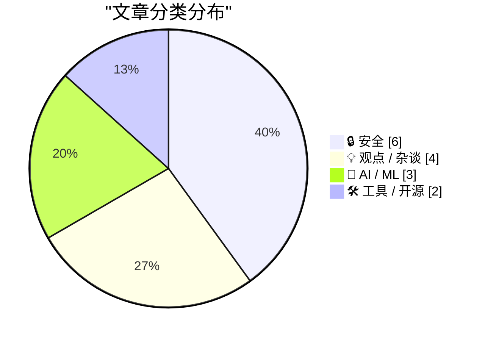
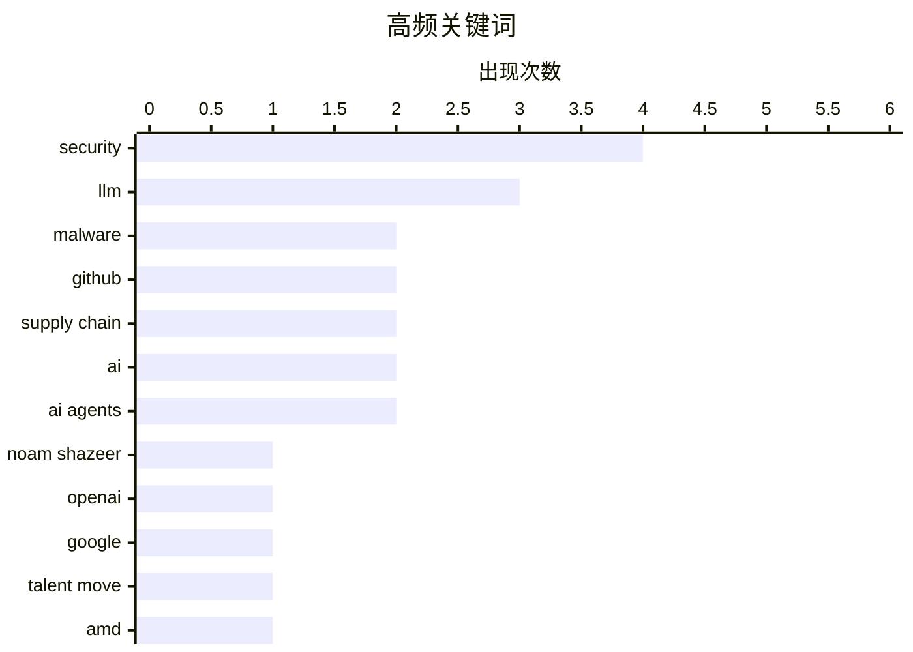

# 📰 AI 资讯每日精选 — 2026-06-19

> 汇聚 140+ 技术博客、X/Twitter、Hacker News、Reddit、Product Hunt、
> Lobste.rs、ClawFeed 日报及 GitHub Trending，经 AI 评分筛选。
>
> **本期内容**：🏆 今日必读 · 🌐 ClawFeed 日报 · 🔥 GitHub Trending · 📂 分类精选 · 🎨 设计与生成式 AI · 📊 数据概览

## 📝 今日看点

今日技术圈呈现两大焦点：AI人才争夺战持续白热化，谷歌Gemini联合负责人、《Attention Is All You Need》合著者Noam Shazeer在回归两年后转投OpenAI，同时SpaceX以600亿美元股票收购AI编程工具Cursor，凸显资本与顶尖人才向头部AI公司加速集中；另一方面，供应链安全与隐私风险集中爆发，GitHub上超1万个仓库被曝分发木马恶意软件，AMD悄然移除消费级CPU内存加密功能，以及研究揭示LLM智能体存在“马赛克攻击”数据泄露风险，警示开发者与用户需重新审视平台信任与硬件安全底线。

---

## 🏆 今日必读

🥇 **谷歌Gemini联合负责人Noam Shazeer在回归两年后加入OpenAI**

[Google's Gemini co-lead Noam Shazeer joins OpenAI after two-year return stint](https://the-decoder.com/googles-gemini-co-lead-noam-shazeer-joins-openai-after-two-year-return-stint/) — The Decoder · 19 小时前 · 🤖 AI / ML

> 《Attention Is All You Need》论文合著者、谷歌Gemini模型前联合负责人Noam Shazeer加入OpenAI。他于2024年作为价值27亿美元交易的一部分，从Character.AI重返谷歌。这是继Karpathy跳槽Anthropic之后，今年第二次重大AI人才变动。

💡 **为什么值得读**: 关注顶级AI人才流向，了解Transformer架构创始人为何在短暂回归后再次离开谷歌。

🏷️ Noam Shazeer, OpenAI, Google, talent move

🥈 **我在GitHub上发现1万个分发木马恶意软件的仓库**

[I found 10k GitHub repositories distributing Trojan malware](https://orchidfiles.com/github-repositories-distributing-malware/) — Hacker News Best · 14 小时前 · 🔒 安全

> 研究人员在GitHub上发现超过1万个仓库正在分发特洛伊木马恶意软件。这些仓库伪装成合法项目或工具，诱骗开发者下载并执行恶意代码。攻击者利用GitHub的信任机制和搜索排名进行大规模传播。该发现揭示了开源生态系统中供应链攻击的新规模。

💡 **为什么值得读**: 如果你是开发者或使用开源代码，这篇文章揭示了GitHub上潜伏的严重安全威胁，值得立即自查。

🏷️ malware, GitHub, supply chain, security

🥉 **AMD悄然从消费级Ryzen CPU中移除内存加密功能**

[AMD silently removes memory encryption from consumer Ryzen CPUs](https://www.tomshardware.com/pc-components/cpus/amd-silently-removes-memory-encryption-from-consumer-ryzen-cpus-leaving-users-unaware-that-they-may-be-vulnerable-security-feature-vanishes-after-newer-agesa-firmware-amd-engineers-go-radio-silent-when-pressed-about-the-change) — Hacker News Best · 18 小时前 · 🔒 安全

> AMD在最新的AGESA固件更新中，悄然移除了消费级Ryzen CPU的内存加密（SME）功能，且未向用户明确说明。该安全特性消失后，用户可能面临物理内存攻击风险。当被问及此变更时，AMD工程师保持沉默。此举引发了社区对硬件安全透明度的严重担忧。

💡 **为什么值得读**: 涉及数亿用户的硬件安全功能被无声移除，所有Ryzen用户都应了解这一潜在风险。

🏷️ AMD, memory encryption, security, Ryzen

4️⃣ **我发现了GitHub上的大规模恶意软件分发**

[I discovered a large-scale malware distribution on GitHub](https://orchidfiles.com/github-repositories-distributing-malware/) — Lobste.rs · 4 小时前 · 🔒 安全

> 与Index 1内容相同：研究人员在GitHub上发现超过1万个仓库正在分发特洛伊木马恶意软件。这些仓库伪装成合法项目或工具，诱骗开发者下载并执行恶意代码。攻击者利用GitHub的信任机制和搜索排名进行大规模传播。该发现揭示了开源生态系统中供应链攻击的新规模。

💡 **为什么值得读**: 与Index 1相同：如果你是开发者或使用开源代码，这篇文章揭示了GitHub上潜伏的严重安全威胁，值得立即自查。

🏷️ malware, GitHub, supply chain

5️⃣ **“Popa”僵尸网络与一家公开交易的以色列公司有关联**

[‘Popa’ Botnet Linked to Publicly-Traded Israeli Firm](https://krebsonsecurity.com/2026/06/popa-botnet-linked-to-publicly-traded-israeli-firm/) — krebsonsecurity.com · 8 小时前 · 🔒 安全

> 一个名为Popa的庞大Android僵尸网络在过去四年中，迫使数百万台消费级电视盒子转发与广告欺诈、账户接管和大规模数据抓取相关的互联网流量。多家安全公司的研究人员本周得出结论，Popa僵尸网络与NetNut有关，后者是一家由公开交易的以色列公司Alarum Technologies Ltd（纳斯达克：ALAR）运营的“住宅代理”服务商。

💡 **为什么值得读**: 揭露了一个影响数百万设备的隐蔽僵尸网络及其背后的上市公司，对物联网安全和网络犯罪研究极具价值。

🏷️ botnet, Android, ad-fraud, security

---

## 🌐 ClawFeed 日报精选

> 来源：[ClawFeed](https://clawfeed.kevinhe.io) — AI 驱动的多源新闻聚合

# ClawFeed Daily Digest | 2026-06-18 (Wed)

> 基于 6 份 4h digest（#681 #684 #685 #686 #687 #688）汇总。#681 为 Jun 17 晚档（16:00-20:00 SGT），未纳入 Jun 17 日报 #682，此处补收。

---

## 🔥 当日全场最重要 5 条

1. **NVIDIA ENPIRE Physical AutoResearch** — Jim Fan 团队首次让 AI AutoResearch 进入物理世界：8 个 Codex agent 同时控制一整支机器人舰队 + GPU 集群，目标是让机器人不闲着、尽快解决任务。最硬的不是按 Enter，而是按之前的安全 harness 设计（防撞、物理约束、故障恢复）。AI 从代码世界走进物理世界的里程碑。
2. **Noam Shazeer 加入 OpenAI** — Transformer 论文共同作者、MoE 架构提出者、前 Character AI CEO。谷歌此前花 $27 亿收购 Character 就为留他，结果没多久出走 OpenAI 做模型架构研究。AI 人才争夺战最强信号。
3. **Vercel 一天三连发：Eve + Connect + Passport** — Eve 开源 agent 框架（durable execution + 沙箱 + human-in-the-loop + subagents），Connect 统一 OAuth token 管理（给 agent 短期 scoped token 访问 Slack/GitHub/Salesforce），Passport 内部应用零代码身份认证。Agent 基础设施全家桶成型。Guillermo Rauch 直言"构建 agent 最难的不是 agent 本身，而是数据——OAuth、token、credential、scope"。
4. **Cursor 本地 agent → 云端，移动端即将 GA** — 本地 agent 一键推上云端，关掉笔记本继续跑；手机端发 prompt、并行多 agent、收 PR + demo。从"本地 IDE copilot"到"云端 agent 调度中心"的范式转型落地。
5. **Midjourney 发布全身医疗扫描仪** — 无辐射、1 分钟完成扫描、部分成像优于 MRI。从 AI 绘画公司到医疗硬件的跨界转型，AI 公司向物理世界扩展的新案例。

---

## 📰 当日核心主题

### Agent 基础设施成熟化
Vercel Eve/Connect/Passport 三连发 + Cursor 云端 agent + Raft Joint Channels（跨组织 agent 协作频道） — agent 从"能跑"走向"能部署、能协作、能安全授权"。stdrc 说得好："don't talk to me, talk to my agents。"

### AI 走出软件
NVIDIA ENPIRE 让 agent 控制物理机器人；Midjourney 跨界医疗硬件；Odyssey 获 $310M B 轮做通用世界模型（Amazon、GV、AMD 投资）；OpenAI LifeSciBench 瞄准真实科研场景。AI 从语言理解走向世界模拟和物理交互。

### AI 人才与地缘政治
Noam Shazeer → OpenAI 是人才争夺最大新闻。G7 AI 午餐会 Altman + Amodei 与各国首脑同桌，美国限制 Anthropic 最先进模型出口引发盟友紧张。AI 能力集中度成为国际议题。

### 开源追赶闭源
GLM-5.2 在 Code Arena Frontend 排第 2，超越 Claude Opus 4.7（Thinking）。Haseeb Qureshi 公开认错更新判断。OpenAI 向 Rust Foundation 投 $60 万（白金会员），Greg Brockman："Rust is the future of systems programming"。Firecrawl 无 API key 免费开放全线功能。

### Agent 经济体形成
微信推出 AI 专属卡——用户在 Agent 对话中直接完成推荐→下单→付款，钱包隔离限额。LLM 已占 Walmart/Target 等零售商 2% referral traffic（同比 3x）。企业 Claude 支出 $3.1K/工程师/月。YC 2026 春季 Demo Day 头部公司 Tasklet $500 万 ARR。Applied AI 层从"薄壳"变成有真正壁垒的商业层。

---

## 🔖 累计 Bookmark 精选

- **Chormex 实时 AI 翻译** — GPT-Realtime-2 驱动，YouTube/直播/会议/演讲全场景实时翻译，Greg Brockman 转推
- **MiMo-V2.5 推理优化** — Hybrid Sliding Window Attention，UltraSpeed 模式 1000 tokens/s，5 人 14 天 vibe-coding 完成
- **Google DESIGN.md** — 一个 Markdown 文件教会 AI Coding Agent 整套设计系统，不需要 Figma/JSON

---

## 👀 推荐关注汇总（去重）

| 账号 | 理由 |
|------|------|
| @DrJimFan (Jim Fan, NVIDIA) | Physical AI + embodied agents 持续深度输出，ENPIRE 等前沿工作第一手信息源 |
| @istdrc (stdrc) | Raft 创始人，前 Kimi CLI / RisingWave 内核，agent-native 协作工具 builder |
| @huang_biwei (Biwei Huang) | CMU 因果 AI 教授，Aether AI 创始人，$2000 万种子轮，因果世界模型方向 |
| @hosseeb (Haseeb Qureshi) | Dragonfly 合伙人，AI+crypto 双线视角，敢于公开认错更新判断 |
| @dongxi_nlp (马东锡) | "Context Is A Projection" 系列，coding agent 架构哲学级深度思考 |
| @_LuoFuli (Fuli Luo) | 前 DeepSeek → Xiaomi MiMo 团队，一手大模型训练/推理经验 |
| @sainingxie (Saining Xie) | AmiLabs 联创兼首席科学家，视觉/多模态基础模型方向 |

> 注：均未通过浏览器核实是否已关注，操作前请先搜一下。

---

## 💤 当日重复噪音模式

1. **Elon Musk 政治转推** — 每个时段都有，英国政治、SEC 争议、非 AI 评论，一律过滤
2. **政治/生活内容** — Obama 校友聚会、JD Vance MLB 评论、Modi 演讲、Cristiano 足球、邮轮打卡，与 AI/crypto/tech 无关
3. **Crypto 社交刷量** — Kaito 互点、"gm frens"、follow-for-follow、BTC 矿机广告
4. **跨时段重复报道** — Cursor 云端 agent（3 个时段重复）、Vercel Eve（3 个时段重复）、Noam Shazeer 加入 OpenAI（2 个时段重复）— 日报已去重合并
5. **营销/卖课内容** — "60 分钟用 Claude 月赚 $7200"、"加微信"引流帖

---

*Aggregated from 4h digests #681 #684 #685 #686 #687 #688 | Generated 2026-06-18 23:55 SGT*---

## 🔥 GitHub Trending

> 今日热门开源项目（全语言 + Python）

| # | 项目 | 描述 | ⭐ 总星 | 📈 今日 | 语言 |
|---|------|------|---------|---------|------|
| 1 | [DeusData/codebase-memory-mcp](https://github.com/DeusData/codebase-memory-mcp) | High-performance code intelligence MCP server. Indexes co... | 7.1k | +2322 | C |
| 2 | [obra/superpowers](https://github.com/obra/superpowers) | An agentic skills framework & software development method... | 232.5k | +1429 | Shell |
| 3 | [Kilo-Org/kilocode](https://github.com/Kilo-Org/kilocode) 🤖 | Kilo is the all-in-one agentic engineering platform. Buil... | 22.2k | +1345 | TypeScript |
| 4 | [google-research/timesfm](https://github.com/google-research/timesfm) | TimesFM (Time Series Foundation Model) is a pretrained ti... | 23.2k | +844 | Python |
| 5 | [github/spec-kit](https://github.com/github/spec-kit) | 💫 Toolkit to help you get started with Spec-Driven Devel... | 113.9k | +764 | Python |
| 6 | [calesthio/OpenMontage](https://github.com/calesthio/OpenMontage) 🤖 | World's first open-source, agentic video production syste... | 5.9k | +738 | Python |
| 7 | [makeplane/plane](https://github.com/makeplane/plane) | 🔥🔥🔥 Open-source Jira, Linear, Monday, and ClickUp alte... | 51.9k | +613 | TypeScript |
| 8 | [anthropics/financial-services](https://github.com/anthropics/financial-services) |  | 31.9k | +481 | Python |
| 9 | [freeCodeCamp/freeCodeCamp](https://github.com/freeCodeCamp/freeCodeCamp) | freeCodeCamp.org's open-source codebase and curriculum. L... | 449.6k | +417 | TypeScript |
| 10 | [n0-computer/iroh](https://github.com/n0-computer/iroh) | IP addresses break, dial keys instead. Modular networking... | 10.0k | +369 | Rust |
| 11 | [alibaba/zvec](https://github.com/alibaba/zvec) | A lightweight, lightning-fast, in-process vector database | 11.2k | +259 | C++ |
| 12 | [Universal-Debloater-Alliance/universal-android-debloater-next-generation](https://github.com/Universal-Debloater-Alliance/universal-android-debloater-next-generation) | Cross-platform GUI written in Rust using ADB to debloat n... | 7.9k | +244 | Rust |
| 13 | [shareAI-lab/learn-claude-code](https://github.com/shareAI-lab/learn-claude-code) 🤖 | Bash is all you need - A nano claude code–like 「agent har... | 67.4k | +234 | Python |
| 14 | [zai-org/GLM-5](https://github.com/zai-org/GLM-5) | GLM-5: From Vibe Coding to Agentic Engineering | 4.2k | +202 | - |
| 15 | [K-Dense-AI/scientific-agent-skills](https://github.com/K-Dense-AI/scientific-agent-skills) 🤖 | Turn any AI agent into an AI Scientist. The #1 Agent Skil... | 28.7k | +174 | Python |

---

## 🔒 安全

### 1. 我在GitHub上发现1万个分发木马恶意软件的仓库

[I found 10k GitHub repositories distributing Trojan malware](https://orchidfiles.com/github-repositories-distributing-malware/) — **Hacker News Best** · 14 小时前 · ⭐ 27/30

> 研究人员在GitHub上发现超过1万个仓库正在分发特洛伊木马恶意软件。这些仓库伪装成合法项目或工具，诱骗开发者下载并执行恶意代码。攻击者利用GitHub的信任机制和搜索排名进行大规模传播。该发现揭示了开源生态系统中供应链攻击的新规模。

🏷️ malware, GitHub, supply chain, security

---

### 2. AMD悄然从消费级Ryzen CPU中移除内存加密功能

[AMD silently removes memory encryption from consumer Ryzen CPUs](https://www.tomshardware.com/pc-components/cpus/amd-silently-removes-memory-encryption-from-consumer-ryzen-cpus-leaving-users-unaware-that-they-may-be-vulnerable-security-feature-vanishes-after-newer-agesa-firmware-amd-engineers-go-radio-silent-when-pressed-about-the-change) — **Hacker News Best** · 18 小时前 · ⭐ 27/30

> AMD在最新的AGESA固件更新中，悄然移除了消费级Ryzen CPU的内存加密（SME）功能，且未向用户明确说明。该安全特性消失后，用户可能面临物理内存攻击风险。当被问及此变更时，AMD工程师保持沉默。此举引发了社区对硬件安全透明度的严重担忧。

🏷️ AMD, memory encryption, security, Ryzen

---

### 3. 我发现了GitHub上的大规模恶意软件分发

[I discovered a large-scale malware distribution on GitHub](https://orchidfiles.com/github-repositories-distributing-malware/) — **Lobste.rs** · 4 小时前 · ⭐ 26/30

> 与Index 1内容相同：研究人员在GitHub上发现超过1万个仓库正在分发特洛伊木马恶意软件。这些仓库伪装成合法项目或工具，诱骗开发者下载并执行恶意代码。攻击者利用GitHub的信任机制和搜索排名进行大规模传播。该发现揭示了开源生态系统中供应链攻击的新规模。

🏷️ malware, GitHub, supply chain

---

### 4. “Popa”僵尸网络与一家公开交易的以色列公司有关联

[‘Popa’ Botnet Linked to Publicly-Traded Israeli Firm](https://krebsonsecurity.com/2026/06/popa-botnet-linked-to-publicly-traded-israeli-firm/) — **krebsonsecurity.com** · 8 小时前 · ⭐ 25/30

> 一个名为Popa的庞大Android僵尸网络在过去四年中，迫使数百万台消费级电视盒子转发与广告欺诈、账户接管和大规模数据抓取相关的互联网流量。多家安全公司的研究人员本周得出结论，Popa僵尸网络与NetNut有关，后者是一家由公开交易的以色列公司Alarum Technologies Ltd（纳斯达克：ALAR）运营的“住宅代理”服务商。

🏷️ botnet, Android, ad-fraud, security

---

### 5. MosaicLeaks：你的研究智能体能否保守秘密？

[MosaicLeaks: Can your research agent keep a secret?](https://huggingface.co/blog/ServiceNow/mosaicleaks) — **Hugging Face Blog** · 8 小时前 · ⭐ 25/30

> 文章探讨了大型语言模型（LLM）作为研究智能体时面临的数据泄露风险。通过“MosaicLeaks”测试，发现即使模型经过安全对齐，仍可能通过组合多个看似无害的查询片段（马赛克攻击）来重构敏感信息。研究揭示了当前安全机制在对抗此类推理攻击时的脆弱性。

🏷️ LLM, data leakage, privacy

---

### 6. Google Deepmind treats its own AI agents like rogue employees with office keys

[Google Deepmind treats its own AI agents like rogue employees with office keys](https://the-decoder.com/google-deepmind-treats-its-own-ai-agents-like-rogue-employees-with-office-keys/) — **The Decoder** · 8 小时前 · ⭐ 24/30

> Google Deepmind treats its own AI agents like rogue employees with office keys

🏷️ AI agents, insider threat, security, DeepMind

---

## 💡 观点 / 杂谈

### 7. 本地运行的Qwen不是更差的Opus，而是不同的工具

[Local Qwen isn't a worse Opus, it's a different tool](https://blog.alexellis.io/local-ai-is-not-opus/) — **Hacker News Best** · 23 小时前 · ⭐ 25/30

> 文章对比了本地部署的Qwen模型与云端闭源模型（如Claude Opus）的差异。作者认为，将本地模型视为“更差的Opus”是错误的，它们更适合隐私敏感、离线、低延迟或定制化场景。本地模型在特定任务（如代码补全、个人知识库）上表现优异，且无需担心API成本和数据外泄。

🏷️ local AI, Qwen, LLM, tooling

---

### 8. Pluralistic: AI digital sovereignty risk doesn't exist (18 Jun 2026)

[Pluralistic: AI digital sovereignty risk doesn't exist (18 Jun 2026)](https://pluralistic.net/2026/06/18/their-trillions-our-billions/) — **pluralistic.net** · 11 小时前 · ⭐ 24/30

> Pluralistic: AI digital sovereignty risk doesn't exist (18 Jun 2026)

🏷️ AI, sovereignty, risk, policy

---

### 9. Open Source vs the Invisible Hand

[Open Source vs the Invisible Hand](https://nesbitt.io/2026/06/18/open-source-vs-the-invisible-hand.html) — **nesbitt.io** · 16 小时前 · ⭐ 24/30

> Open Source vs the Invisible Hand

🏷️ open source, maintainer, sustainability

---

### 10. Yann LeCun warns AI labs like OpenAI and Anthropic face a "big bubble explosion"

[Yann LeCun warns AI labs like OpenAI and Anthropic face a "big bubble explosion"](https://the-decoder.com/yann-lecun-warns-ai-labs-like-openai-and-anthropic-face-a-big-bubble-explosion/) — **The Decoder** · 12 小时前 · ⭐ 24/30

> Yann LeCun warns AI labs like OpenAI and Anthropic face a "big bubble explosion"

🏷️ AI bubble, Yann LeCun, investor subsidy, startup

---

## 🤖 AI / ML

### 11. 谷歌Gemini联合负责人Noam Shazeer在回归两年后加入OpenAI

[Google's Gemini co-lead Noam Shazeer joins OpenAI after two-year return stint](https://the-decoder.com/googles-gemini-co-lead-noam-shazeer-joins-openai-after-two-year-return-stint/) — **The Decoder** · 19 小时前 · ⭐ 27/30

> 《Attention Is All You Need》论文合著者、谷歌Gemini模型前联合负责人Noam Shazeer加入OpenAI。他于2024年作为价值27亿美元交易的一部分，从Character.AI重返谷歌。这是继Karpathy跳槽Anthropic之后，今年第二次重大AI人才变动。

🏷️ Noam Shazeer, OpenAI, Google, talent move

---

### 12. 新上市的SpaceX将以600亿美元“SpaceX代币”股票收购Cursor

[SpaceX, Newly Public, to Acquire Cursor for $60 Billion in SpaceX Funny-Money Stock](https://www.cnbc.com/2026/06/16/spacex-spcx-cursor-acquisition-ipo.html) — **daringfireball.net** · 9 小时前 · ⭐ 25/30

> SpaceX宣布以价值600亿美元的A类普通股收购AI编程工具Cursor，该交易导致SpaceX IPO估值稀释3.4%。Cursor在2025年11月已实现年化收入超过10亿美元，并入选2026年CNBC颠覆者50强榜单第37位。消息公布后，SpaceX股价上涨约16%，市值超越亚马逊和微软，成为第四大公司。

🏷️ SpaceX, Cursor, acquisition, AI

---

### 13. DeepSeek 推出视觉功能

[DeepSeek Introduces Vision](https://chat.deepseek.com/) — **Hacker News Best** · 20 小时前 · ⭐ 25/30

> DeepSeek在其聊天平台中正式引入了视觉理解能力，支持用户上传图片并进行多模态对话。该功能允许模型识别图像中的物体、文字和场景，并基于视觉信息回答问题或执行任务。此举标志着DeepSeek从纯文本模型向多模态AI的扩展。

🏷️ DeepSeek, vision, LLM, multimodal

---

## 🛠 工具 / 开源

### 14. Datasette Apps：在Datasette内部托管自定义HTML应用

[Datasette Apps: Host custom HTML applications inside Datasette](https://simonwillison.net/2026/Jun/18/datasette-apps/#atom-everything) — **simonwillison.net** · 2 小时前 · ⭐ 24/30

> Datasette团队发布了新插件datasette-apps，允许用户在Datasette实例中托管自包含的HTML+JavaScript应用。这些应用运行在严格受限的环境中，可直接访问底层SQLite数据库。文章解释了该设计的动机：将数据探索与自定义交互界面无缝结合，而无需搭建独立的前端服务。

🏷️ Datasette, plugin, web-app, SQLite

---

### 15. Adobe adds AI agents to Photoshop, Premiere, and more Creative Cloud apps

[Adobe adds AI agents to Photoshop, Premiere, and more Creative Cloud apps](https://the-decoder.com/adobe-adds-ai-agents-to-photoshop-premiere-and-more-creative-cloud-apps/) — **The Decoder** · 13 小时前 · ⭐ 24/30

> Adobe adds AI agents to Photoshop, Premiere, and more Creative Cloud apps

🏷️ Adobe, AI agents, Creative Cloud, automation

---

## 🎨 Design & Generative AI

### 🖼️ 生成式图片

- **[Midjourney跨界推出全身超声扫描仪与自营水疗中心](https://the-decoder.com/midjourney-known-for-ai-image-generation-unveils-a-full-body-ultrasound-scanner-and-its-own-spa/)** — The Decoder · 13 小时前
  > AI图像生成公司Midjourney意外进军医疗硬件领域，计划在旧金山开设配备全身超声扫描仪的水疗中心。

- **[Midjourney展示60年代风格全身CT扫描图像](https://www.reddit.com/r/midjourney/comments/1u8yszt/midjourney_unveiled_a_60s_full_body_scan_ct/)** — r/midjourney · 19 小时前
  > 用户分享Midjourney生成的复古风格全身CT扫描图像，引发社区热议。

- **[SOTA AI模型的光音频响应实验](https://www.reddit.com/r/midjourney/comments/1u98xfu/an_experiment_on_light_audioreactivity_on_sota_ai/)** — r/midjourney · 11 小时前
  > 探索当前最先进AI模型对光线与音频的交互响应效果。

- **[火焰即是龙](https://www.reddit.com/r/midjourney/comments/1u99m0v/the_flames_were_the_dragon/)** — r/midjourney · 10 小时前
  > Midjourney生成的火焰与龙融合的奇幻图像作品。

- **[Midjourney开始做医疗硬件了？](https://www.reddit.com/r/midjourney/comments/1u981x4/guess_we_doin_medical_hardware_now/)** — r/midjourney · 11 小时前
  > 社区对Midjourney涉足医疗硬件领域的惊讶与调侃。

- **[Midjourney医疗！](https://www.reddit.com/r/midjourney/comments/1u96shr/midjourney_medical/)** — r/midjourney · 12 小时前
  > 用户分享Midjourney创始人David关于全身超声扫描仪的最新动态。

- **[如何获得这样的汽车图片？](https://www.reddit.com/r/midjourney/comments/1u9i21i/how_to_get_pics_like_this/)** — r/midjourney · 5 小时前
  > 用户询问使用Midjourney生成高质量汽车图片的技巧与方法。

- **[轨道力学](https://www.reddit.com/r/midjourney/comments/1u915e2/orbital_mechanics/)** — r/midjourney · 17 小时前
  > Midjourney生成的太空轨道与天体力学主题的视觉作品。

- **[如何用Midjourney做品牌样机？](https://www.reddit.com/r/midjourney/comments/1u9o0tk/how_do_i_use_this_website_for_brand_mockups/)** — r/midjourney · 1 小时前
  > 用户寻求使用Midjourney制作香水包装等品牌样机的实用指南。

- **[Midjourney适合我的需求吗？](https://www.reddit.com/r/midjourney/comments/1u9kmym/is_midjourney_fit_for_what_i_need/)** — r/midjourney · 3 小时前
  > 用户咨询Midjourney是否适合生成带有地标的国家系列插画。

- **[奇点不可避免](https://www.reddit.com/r/midjourney/comments/1u8zy3z/singularity_inevitable/)** — r/midjourney · 18 小时前
  > 用户用Midjourney创作的一系列关于技术奇点的图像与动画。

- **[花开](https://www.reddit.com/r/midjourney/comments/1u9487g/blossom/)** — r/midjourney · 14 小时前
  > Midjourney生成的花朵绽放主题的唯美图像。

- **[物之灵](https://www.reddit.com/r/midjourney/comments/1u8zze9/spirit_in_things/)** — r/midjourney · 18 小时前
  > 探索中国传统视觉文化中物体承载精神与意义的Midjourney作品。

- **[错误的走廊](https://www.reddit.com/r/midjourney/comments/1u9hoq2/wrong_hallway/)** — r/midjourney · 5 小时前
  > Midjourney生成的充满神秘感的走廊场景图像。

- **[坠入虚空](https://www.reddit.com/r/midjourney/comments/1u9nvo3/into_the_void/)** — r/midjourney · 1 小时前
  > Midjourney创作的抽象虚空主题视觉作品。

---

## 📊 数据概览

| 扫描源 | 抓取文章 | 时间范围 | 精选 |
|:---:|:---:|:---:|:---:|
| 93/140 | 3799 篇 → 82 篇 | 24h | **15 篇** |

### 分类分布



### 高频关键词



<details>
<summary>📈 纯文本关键词图（终端友好）</summary>

```
security     │ ████████████████████ 4
llm          │ ███████████████░░░░░ 3
malware      │ ██████████░░░░░░░░░░ 2
github       │ ██████████░░░░░░░░░░ 2
supply chain │ ██████████░░░░░░░░░░ 2
ai           │ ██████████░░░░░░░░░░ 2
ai agents    │ ██████████░░░░░░░░░░ 2
noam shazeer │ █████░░░░░░░░░░░░░░░ 1
openai       │ █████░░░░░░░░░░░░░░░ 1
google       │ █████░░░░░░░░░░░░░░░ 1
```

</details>

### 🏷️ 话题标签

**security**(4) · **llm**(3) · **malware**(2) · github(2) · supply chain(2) · ai(2) · ai agents(2) · noam shazeer(1) · openai(1) · google(1) · talent move(1) · amd(1) · memory encryption(1) · ryzen(1) · botnet(1) · android(1) · ad-fraud(1) · spacex(1) · cursor(1) · acquisition(1)

---

*生成于 2026-06-19 02:24 | 汇聚 140 个技术博客、X/Twitter、Hacker News、Reddit、Product Hunt、Lobste.rs、ClawFeed 日报及 GitHub Trending，经 AI 评分筛选出 Top 15 精华内容*
