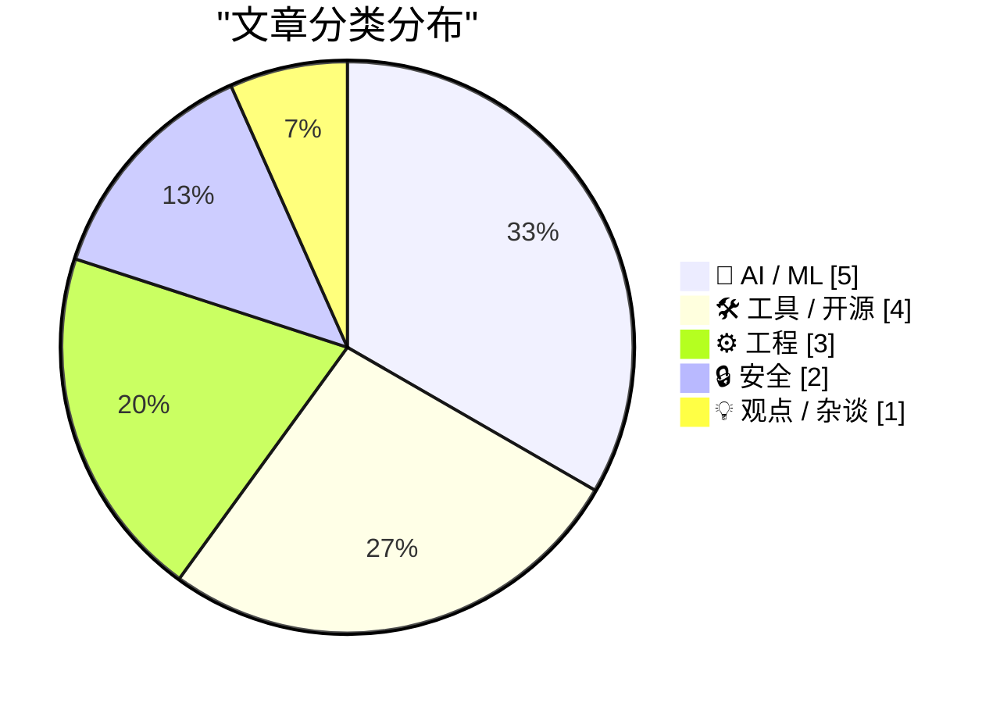
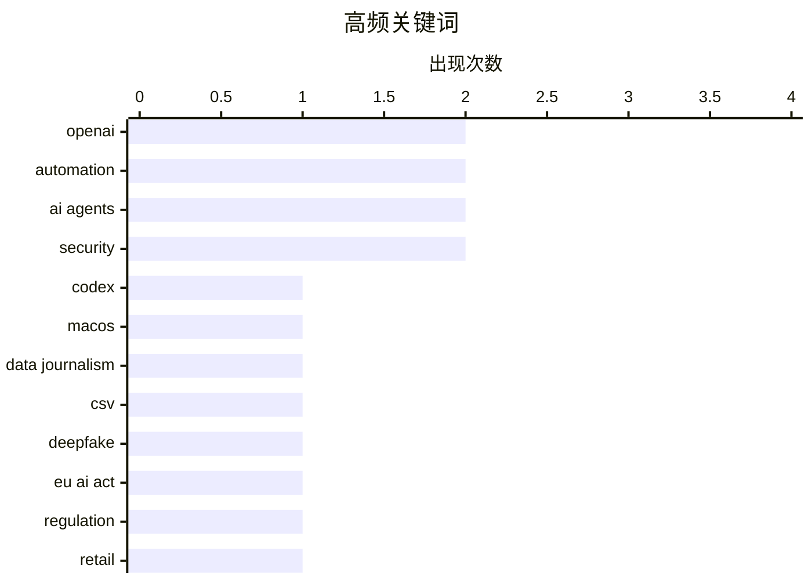

# 📰 AI 资讯每日精选 — 2026-06-21

> 汇聚 140+ 技术博客、X/Twitter、Hacker News、Reddit、Product Hunt、
> Lobste.rs、ClawFeed 日报及 GitHub Trending，经 AI 评分筛选。
>
> **本期内容**：🏆 今日必读 · 🌐 ClawFeed 日报 · 🔥 GitHub Trending · 📂 分类精选 · 🎨 设计与生成式 AI · 📊 数据概览

## 📝 今日看点

今日技术圈聚焦两大趋势：AI正从“生成内容”迈向“自主执行”，OpenAI Codex的“记录与回放”与Cloudflare为AI代理提供的临时账户，标志着AI开始像人类一样学习并安全地接管重复性工作；与此同时，AI行业的泡沫风险与监管博弈成为焦点，纽约大学教授警告AI崩盘可能比互联网泡沫更严重，而OpenAI收入翻三倍却烧掉37亿美元的数据，以及欧盟对AI生成广告是否算深度伪造的争议，都凸显了行业在高速扩张中的脆弱与规则缺失。此外，卫星数据揭示的全球GPS信号大规模篡改，则为技术安全敲响了新的警钟。

---

## 🏆 今日必读

🥇 **OpenAI Codex 现在可以观察你工作一次，然后永远重复该任务**

[OpenAI's Codex can now watch you work once and repeat the task forever](https://the-decoder.com/openais-codex-can-now-watch-you-work-once-and-repeat-the-task-forever/) — The Decoder · 12 小时前 · 🤖 AI / ML

> OpenAI 为其 macOS 版 Codex 应用推出了“记录与回放”功能。用户只需演示一次工作流程，Codex 就能将其转化为可复用的“技能”并自动重复执行。该功能目前尚未在欧盟、英国和瑞士上线。

💡 **为什么值得读**: 如果你经常做重复性操作，这篇文章展示了 AI 如何通过一次演示实现自动化，值得了解其能力边界和可用性限制。

🏷️ OpenAI, Codex, automation, macOS

🥈 **Data2Story 使用七个 AI 代理将 CSV 文件转化为经过验证的交互式新闻文章**

[Data2Story turns a CSV file into a verified interactive news article using seven AI agents](https://the-decoder.com/data2story-turns-a-csv-file-into-a-verified-interactive-news-article-using-seven-ai-agents/) — The Decoder · 16 小时前 · 🤖 AI / ML

> 来自牛津和斯坦福的“数据记者代理”利用七个 AI 代理像新闻编辑室一样协作，将 CSV 文件直接生成包含图表、网络研究和可验证来源链接的交互式文章，其中 93% 的陈述都有来源链接。在一项读者研究中，74% 的读者更偏好 AI 的输出而非人类原稿。但在与精心制作的长篇报道对比时，AI 仅与人类打成平手。

💡 **为什么值得读**: 这篇文章展示了 AI 在数据新闻领域的惊人进展，特别是其高验证率和读者偏好度，对内容创作者和数据记者极具参考价值。

🏷️ AI agents, data journalism, CSV, automation

🥉 **欧盟并不真正知道什么是深度伪造，这对零售业来说正成为一个问题**

[The EU doesn't really know what a deepfake is, and that's becoming a problem for retail](https://the-decoder.com/the-eu-doesnt-really-know-what-a-deepfake-is-and-thats-becoming-a-problem-for-retail/) — The Decoder · 8 小时前 · 🤖 AI / ML

> 代表亚马逊、H&M 和宜家等巨头的贸易协会 Eurocommerce 希望将 AI 生成的广告排除在欧盟 AI 法案的透明度规则之外。其理由是：用于销售沙发的 AI 生成客厅图像并非深度伪造。仅 Zalando 一家平台就有 90% 的营销内容已经是 AI 生成的。

💡 **为什么值得读**: 这篇文章揭示了 AI 监管在商业应用中的现实困境，尤其是“深度伪造”定义模糊对零售业产生的巨大影响，值得关注政策走向的人阅读。

🏷️ deepfake, EU AI Act, regulation, retail

4️⃣ **为 AI 代理提供临时 Cloudflare 账户**

[Temporary Cloudflare accounts for AI agents](https://blog.cloudflare.com/temporary-accounts/) — Hacker News Best · 14 小时前 · 🛠 工具 / 开源

> Cloudflare 推出了临时账户功能，专为 AI 代理设计。该功能允许 AI 代理在无需长期凭证的情况下安全地执行任务，解决了 AI 代理访问受限资源的身份验证和安全问题。

💡 **为什么值得读**: 如果你正在构建或使用 AI 代理，这篇文章介绍了一个解决代理身份验证和安全问题的实用方案，直接关系到自动化任务的可行性。

🏷️ Cloudflare, AI agents, temporary accounts, security

5️⃣ **卫星揭示 GPS 信号篡改的惊人规模**

[Satellite reveals immense scale of GPS signal tampering](https://www.space.com/space-exploration/satellites/its-quite-a-bit-more-than-we-expected-satellite-reveals-immense-scale-of-gps-signal-tampering) — Hacker News Best · 21 小时前 · 🔒 安全

> 通过卫星观测发现，GPS 信号被篡改的规模远超预期。这种“欺骗”攻击不仅干扰导航，还对航空、航运和基础设施安全构成严重威胁。研究揭示了全球范围内大量未报告的 GPS 干扰事件。

💡 **为什么值得读**: 这篇文章用卫星数据揭示了 GPS 安全问题的真实规模，对关注网络安全、基础设施和地缘政治的人而言，是一份重要的警示报告。

🏷️ GPS, spoofing, satellite, security

---

## 🌐 ClawFeed 日报精选

> 来源：[ClawFeed](https://clawfeed.kevinhe.io) — AI 驱动的多源新闻聚合

# ClawFeed Daily Digest | 2026-06-20 (Fri)

> 基于 3 份 4h digest（#691 08:00, #692 12:00, #693 16:00）汇总。20:00 档尚未生成，日报先基于已有数据编制。

---

## 🔥 当日全场最重要 5 条

1. **John Jumper（AlphaFold 之父、2024 诺贝尔化学奖）离开 DeepMind 加入 Anthropic** — 在 DeepMind 近 9 年，领导了蛋白质折叠革命。继 Noam Shazeer → OpenAI 之后，DeepMind 又失血一位顶级科学家。Anthropic 拿到生物 AI 方向最强人才，短期对 DeepMind 信心冲击不小。（#691 #692 同报）
2. **Claude Code 发布 Artifacts 功能** — session 内生成交互式页面（PR walkthrough、项目 dashboard 等），私有链接分享给团队。Team/Enterprise beta 可用。Claude 从 coding agent 向协作工具延伸的标志性一步。（#691 #693 同报）
3. **OpenAI Codex 上线 Record & Replay** — Mac 上录制一次操作，Codex 自动生成可复用 Skill。基于 LLM 理解而非坐标回放，泛化能力远超传统 RPA。目前仅 macOS，需开启 Computer Use。（#692）
4. **Vercel CEO 宣称"下一个热门编程语言是 markdown"** — eve agent 框架用 instructions.md + skills/ 定义 agent，一行 `vercel` 命令部署。Agent 开发门槛降到极致，design-as-code 范式继续扩展。（#693）
5. **Cloudflare 推出 Temporary Accounts for Workers** — `wrangler deploy --temporary` 秒级获得 live Worker，无需注册账号。Agent 基础设施正在变得 agent-native，部署零摩擦。（#692 #693 同报）

---

## 📰 当日核心主题

### Agent 基础设施 Agent-Native 化
Claude Artifacts（session→可分享页面）+ Vercel eve（markdown 定义 agent）+ Cloudflare Temporary Workers（秒级无账号部署）+ Codex Record & Replay（操作→Skill）。Agent 从"能跑代码"走向"能部署、能分享、能录制复用"。基础设施层的摩擦在系统性消除。

### AI 人才大迁徙
John Jumper（Nobel Chemistry → Anthropic）是继 Noam Shazeer（Transformer → OpenAI）之后又一标志性事件。DeepMind 连失两位顶级科学家。Dario Amodei 百度硅谷实验室背景被翻出（14-15 年与吴恩达共事时发现缩放定律早期特征）。AI 顶尖人才向 Anthropic/OpenAI 双极集中。

### Agent 开发流程标准化
Vercel 发布官方 design.md（设计系统写成 Markdown 给 AI 消费）；AI 开发主流程 Grill→Research→PRD→Issues→Implement 被多人引用；UpSkill 框架让 Flash Model 通过持续 skill 进化达到 Pro 表现。从 vibe coding 走向结构化 agent 工程。

### Token 与数据管道优化
Netflix 开源 Headroom（数据喂 LLM 前可逆压缩，token 节省 60-95%）；LlamaIndex LiteParse v2.1（最快 PDF→Markdown，纯代码无 AI/OCR）；Microsoft 开源 Presidio（PII 检测 + 匿名化 SDK）。RAG pipeline 的前处理层工具持续成熟。

### 开源大模型本地化
Unsloth 量化 GLM-5.2（744B→239GB，2-bit GGUF，-84% 体积），256GB Mac 即可本地跑。变宽 Transformer（><former）打破每层等宽架构假设，同时改善 loss 并减少计算量。

---

## 🔖 累计 Bookmark 精选

- 本日三档 4h digest 均无新增 bookmark，历史 bookmarks 已在往期覆盖。

---

## 👀 推荐关注汇总

| 账号 | 推荐理由 | 来源 |
|------|---------|------|
| @JohnJumperSci | 2024 诺贝尔化学奖得主，AlphaFold 之父，刚转投 Anthropic | #691 |
| @zhaofeng_wu | 变宽 Transformer 论文作者，架构创新一线研究者 | #692 |
| @bibryam | 分布式系统/云原生实践者，分享 AmEx cell-based 等大厂架构案例 | #692 |
| @huang_chao4969 | UpSkill 框架作者，关注 AI agent skill 进化方向 | #693 |

> 提醒：未通过浏览器核实是否已关注，Kevin 操作前请先在 Following 里搜一下。

---

## 🧹 建议取关

| 账号 | 理由 | 连续标记 |
|------|------|---------|
| @HeXiaobo | 最后一条推文 2018 年 7 月，已超 8 年不活跃，典型僵尸号 | 多期连续 |
| @0xJasonBateman | 仅 8 followers，最近原创为 Spotify 链接，无 AI/tech 内容 | 2 期连续 |

---

## 💤 当日重复噪音模式

- **Crypto 短线交易**：$BP 暴涨分析、币安新币、Arcium TGE 等纯二级交易内容持续出现，与 AI/tech feed 主线无关
- **个人生活分享**：旅行打卡（克罗地亚、君临城）、空乘回忆等非技术内容
- **招聘/营销帖**：Sentient Foundation 招聘、营销工作室自宣、付费推广帖
- **政治争议**：Elon Musk 相关政治标签话题，信噪比极低

---

*汇总自 4h digest #691 #692 #693 | 生成时间: 2026-06-20 23:55 SGT*---

## 🔥 GitHub Trending

> 今日热门开源项目（全语言 + Python）

| # | 项目 | 描述 | ⭐ 总星 | 📈 今日 | 语言 |
|---|------|------|---------|---------|------|
| 1 | [chopratejas/headroom](https://github.com/chopratejas/headroom) 🤖 | Compress tool outputs, logs, files, and RAG chunks before... | 42.0k | +3795 | Python |
| 2 | [tw93/Pake](https://github.com/tw93/Pake) | 🤱🏻 Turn any webpage into a desktop app with one command. | 54.9k | +2546 | Rust |
| 3 | [mattpocock/skills](https://github.com/mattpocock/skills) 🤖 | Skills for Real Engineers. Straight from my .claude direc... | 138.3k | +1395 | Shell |
| 4 | [DeusData/codebase-memory-mcp](https://github.com/DeusData/codebase-memory-mcp) | High-performance code intelligence MCP server. Indexes co... | 9.4k | +1271 | C |
| 5 | [palmier-io/palmier-pro](https://github.com/palmier-io/palmier-pro) 🤖 | macOS video editor built for AI | 3.4k | +902 | Swift |
| 6 | [tursodatabase/turso](https://github.com/tursodatabase/turso) | Turso is an in-process SQL database, compatible with SQLite. | 20.4k | +801 | Rust |
| 7 | [calesthio/OpenMontage](https://github.com/calesthio/OpenMontage) 🤖 | World's first open-source, agentic video production syste... | 7.1k | +677 | Python |
| 8 | [Kilo-Org/kilocode](https://github.com/Kilo-Org/kilocode) 🤖 | Kilo is the all-in-one agentic engineering platform. Buil... | 23.4k | +513 | TypeScript |
| 9 | [google-research/timesfm](https://github.com/google-research/timesfm) | TimesFM (Time Series Foundation Model) is a pretrained ti... | 24.6k | +433 | Python |
| 10 | [penpot/penpot](https://github.com/penpot/penpot) | Penpot: The open-source design tool for design and code c... | 51.5k | +420 | Clojure |
| 11 | [mukul975/Anthropic-Cybersecurity-Skills](https://github.com/mukul975/Anthropic-Cybersecurity-Skills) 🤖 | 754 structured cybersecurity skills for AI agents · Mappe... | 17.1k | +343 | Python |
| 12 | [public-apis/public-apis](https://github.com/public-apis/public-apis) | A collective list of free APIs | 443.1k | +330 | Python |
| 13 | [Kong/insomnia](https://github.com/Kong/insomnia) | The open-source, cross-platform API client for GraphQL, R... | 39.3k | +329 | TypeScript |
| 14 | [yt-dlp/yt-dlp](https://github.com/yt-dlp/yt-dlp) | A feature-rich command-line audio/video downloader | 172.1k | +326 | Python |
| 15 | [withastro/flue](https://github.com/withastro/flue) 🤖 | The sandbox agent framework. | 6.1k | +316 | TypeScript |

---

## 🤖 AI / ML

### 1. OpenAI Codex 现在可以观察你工作一次，然后永远重复该任务

[OpenAI's Codex can now watch you work once and repeat the task forever](https://the-decoder.com/openais-codex-can-now-watch-you-work-once-and-repeat-the-task-forever/) — **The Decoder** · 12 小时前 · ⭐ 27/30

> OpenAI 为其 macOS 版 Codex 应用推出了“记录与回放”功能。用户只需演示一次工作流程，Codex 就能将其转化为可复用的“技能”并自动重复执行。该功能目前尚未在欧盟、英国和瑞士上线。

🏷️ OpenAI, Codex, automation, macOS

---

### 2. Data2Story 使用七个 AI 代理将 CSV 文件转化为经过验证的交互式新闻文章

[Data2Story turns a CSV file into a verified interactive news article using seven AI agents](https://the-decoder.com/data2story-turns-a-csv-file-into-a-verified-interactive-news-article-using-seven-ai-agents/) — **The Decoder** · 16 小时前 · ⭐ 26/30

> 来自牛津和斯坦福的“数据记者代理”利用七个 AI 代理像新闻编辑室一样协作，将 CSV 文件直接生成包含图表、网络研究和可验证来源链接的交互式文章，其中 93% 的陈述都有来源链接。在一项读者研究中，74% 的读者更偏好 AI 的输出而非人类原稿。但在与精心制作的长篇报道对比时，AI 仅与人类打成平手。

🏷️ AI agents, data journalism, CSV, automation

---

### 3. 欧盟并不真正知道什么是深度伪造，这对零售业来说正成为一个问题

[The EU doesn't really know what a deepfake is, and that's becoming a problem for retail](https://the-decoder.com/the-eu-doesnt-really-know-what-a-deepfake-is-and-thats-becoming-a-problem-for-retail/) — **The Decoder** · 8 小时前 · ⭐ 25/30

> 代表亚马逊、H&M 和宜家等巨头的贸易协会 Eurocommerce 希望将 AI 生成的广告排除在欧盟 AI 法案的透明度规则之外。其理由是：用于销售沙发的 AI 生成客厅图像并非深度伪造。仅 Zalando 一家平台就有 90% 的营销内容已经是 AI 生成的。

🏷️ deepfake, EU AI Act, regulation, retail

---

### 4. OpenAI 第一季度收入翻三倍至 57 亿美元，但为此烧掉了 37 亿美元

[OpenAI tripled revenue to $5.7 billion in Q1 but burned through $3.7 billion to get there](https://the-decoder.com/openai-tripled-revenue-to-5-7-billion-in-q1-but-burned-through-3-7-billion-to-get-there/) — **The Decoder** · 18 小时前 · ⭐ 24/30

> 在 2026 年第一季度，OpenAI 实现了 57 亿美元的收入，同时烧掉了约 37 亿美元，两项数据均同比翻了三倍。仅股票薪酬一项就消耗了超过 23 亿美元。尽管拥有 730 亿美元的储备，OpenAI 目前不需要新融资，但与 Anthropic 的价格战可能迅速改变这一局面。

🏷️ OpenAI, revenue, burn rate, AI economics

---

### 5. 逆向工程高通 NPU 编译器

[Reverse Engineering the Qualcomm NPU Compiler](https://datavorous.github.io/writing/qairt/) — **Lobste.rs** · 14 小时前 · ⭐ 24/30

> 作者详细记录了逆向工程高通神经处理单元（NPU）编译器的过程，揭示了其内部工作原理和指令集。这项工作为在没有官方文档的情况下使用高通 NPU 进行 AI 推理提供了关键洞见，并展示了如何绕过限制来优化模型部署。

🏷️ Qualcomm, NPU, reverse engineering, compiler

---

## 🛠 工具 / 开源

### 6. 为 AI 代理提供临时 Cloudflare 账户

[Temporary Cloudflare accounts for AI agents](https://blog.cloudflare.com/temporary-accounts/) — **Hacker News Best** · 14 小时前 · ⭐ 25/30

> Cloudflare 推出了临时账户功能，专为 AI 代理设计。该功能允许 AI 代理在无需长期凭证的情况下安全地执行任务，解决了 AI 代理访问受限资源的身份验证和安全问题。

🏷️ Cloudflare, AI agents, temporary accounts, security

---

### 7. Distrobox 下一代版本发布公告

[Announcing the next generation of Distrobox](https://distrobox.it/posts/announcing_distrobox_next/) — **Lobste.rs** · 10 小时前 · ⭐ 23/30

> Distrobox 项目宣布了其下一代重大版本更新。Distrobox 是一个用于在 Linux 上创建和管理容器化开发环境的工具，允许用户在不同发行版容器中无缝运行软件。新版本带来了架构重构、性能优化和更紧密的 Podman/Docker 集成。主要改进包括更快的启动速度、更稳定的文件系统挂载以及改进的图形应用支持。此次更新旨在进一步降低容器化开发环境的使用门槛，提升日常开发体验。

🏷️ Distrobox, containers, Linux, toolbox

---

### 8. Windows 11 新版媒体播放器内存占用增加 3.5 倍，流行视频编解码器开始收费

[Windows 11 New Media Player Uses 3.5x More RAM, Charges for Popular Video Codecs](https://www.extremetech.com/computing/windows-11s-new-media-player-uses-35x-more-ram-charges-for-popular-video) — **Hacker News Best** · 11 小时前 · ⭐ 22/30

> Windows 11 新版媒体播放器（Media Player）被发现内存占用相比旧版增加了 3.5 倍。更引发争议的是，微软开始对 HEVC、AV1 等流行视频编解码器的播放功能收费。用户需要额外支付费用才能播放这些格式的视频，而此前这些功能是免费内置的。该变化被批评为降低用户体验并增加用户负担，尤其对需要播放高压缩比视频的用户影响显著。文章获得 253 个点赞和 136 条评论，表明社区对此强烈不满。

🏷️ Windows 11, Media Player, RAM, codec

---

### 9. LTX Director 2.0 更新发布：一款免费开源的 ComfyUI 全功能 AI 视频创作工具，全面重构，新增完整 AI 视频编辑支持、IC-LoRA、重拍模式、音频修复等

[LTX Director 2.0 Update - A Free Open Source All-In-One Tool for Creating AI Videos in ComfyUI. Complete Overhaul now with full AI video editing support, IC-LoRA, Retake Mode, Audio Inpainting and much more!](https://www.reddit.com/r/StableDiffusion/comments/1ub4jpk/ltx_director_20_update_a_free_open_source/) — **r/StableDiffusion** · 7 小时前 · ⭐ 22/30

> LTX Director 2.0 作为 ComfyUI 的免费开源插件进行了重大重构，定位为“一站式 AI 视频创作工具”。新版本引入了完整的 AI 视频编辑功能，包括基于 IC-LoRA 的图像条件控制、Retake Mode（重拍模式）用于快速迭代生成结果，以及 Audio Inpainting（音频修复）能力。该工具完全免费且开源，旨在降低 AI 视频制作的门槛，让用户无需切换多个软件即可完成从生成到编辑的完整流程。此次更新显著提升了工作流的集成度和易用性。

🏷️ ComfyUI, video, open-source, AI

---

## ⚙️ 工程

### 10. SMPTE 免费开放其标准

[SMPTE Makes Its Standards Freely Accessible](https://www.smpte.org/blog/smpte-makes-its-standards-freely-accessible-openingstandards-library-to-the-global-media-technology-community) — **Hacker News Best** · 9 小时前 · ⭐ 24/30

> 电影电视工程师协会（SMPTE）宣布将其所有标准免费向全球媒体技术社区开放。这一举措消除了获取专业音视频标准（如 SMPTE ST 2110）的付费门槛，将极大促进媒体技术的普及和创新。

🏷️ SMPTE, standards, open access, media technology

---

### 11. 在 Rust 中实现安全的 SIMD，即使在内部也是如此

[Safe SIMD in Rust, even on the inside](https://shnatsel.medium.com/safe-simd-in-rust-even-on-the-inside-c6f1ff381828) — **Lobste.rs** · 21 小时前 · ⭐ 24/30

> 文章探讨了如何在 Rust 中安全地使用 SIMD（单指令多数据流）指令，即使是在库的内部实现中。作者介绍了如何利用 Rust 的类型系统和 unsafe 代码的封装技巧，在保证性能的同时避免未定义行为，提供了实用的安全抽象模式。

🏷️ Rust, SIMD, safety, performance

---

### 12. 终于让 FLUX Schnell + Wan 2.2 TI2V 在 4060 8GB 显卡上跑通了端到端动态壁纸管线——内附工作流

[Finally got FLUX Schnell + Wan 2.2 TI2V running as an end-to-end animated wallpaper pipeline on a 4060 8GB — workflow inside](https://www.reddit.com/r/StableDiffusion/comments/1uaomq6/finally_got_flux_schnell_wan_22_ti2v_running_as/) — **r/StableDiffusion** · 20 小时前 · ⭐ 23/30

> 作者在 8GB 显存的 RTX 4060 上构建了一套完全本地化的动态壁纸生成管线。该管线使用 FLUX.1 Schnell（4步推理，GGUF量化）在约5秒内生成1920×1080静态图，再通过 Wan 2.2 TI2V 模型将图像转为视频。所有组件运行在 ComfyUI 和 WSL2 环境中，无需联网或付费服务。核心挑战在于在显存受限的消费级显卡上串联两个大模型，作者通过量化、优化步数和合理分配显存解决了这一问题。最终实现了“输入文字提示→自动生成动态壁纸”的完整闭环。

🏷️ FLUX, Wan2.2, pipeline, wallpaper

---

## 🔒 安全

### 13. 卫星揭示 GPS 信号篡改的惊人规模

[Satellite reveals immense scale of GPS signal tampering](https://www.space.com/space-exploration/satellites/its-quite-a-bit-more-than-we-expected-satellite-reveals-immense-scale-of-gps-signal-tampering) — **Hacker News Best** · 21 小时前 · ⭐ 25/30

> 通过卫星观测发现，GPS 信号被篡改的规模远超预期。这种“欺骗”攻击不仅干扰导航，还对航空、航运和基础设施安全构成严重威胁。研究揭示了全球范围内大量未报告的 GPS 干扰事件。

🏷️ GPS, spoofing, satellite, security

---

### 14. 英国家庭 VPN 禁令更新：政府考虑实施“年龄门”审查

[VPN ban update for UK households as government looks at 'age-gate'](https://www.birminghammail.co.uk/news/midlands-news/vpn-ban-update-uk-households-34141063) — **Hacker News Best** · 11 小时前 · ⭐ 22/30

> 英国政府正在推进一项针对 VPN 服务的新监管措施，旨在通过“年龄门”（age-gate）技术限制未成年人访问成人内容。该政策要求 VPN 提供商实施年龄验证机制，否则可能面临禁令。此举引发了关于隐私、网络自由和技术可行性的广泛争议。批评者认为年龄验证可能被滥用于监控，且技术上难以在不收集用户数据的前提下有效实施。目前该提案仍在讨论阶段，但已获得 287 个点赞和 320 条评论，反映出社区的高度关注。

🏷️ VPN ban, UK, age-gate, privacy

---

## 💡 观点 / 杂谈

### 15. 纽约大学金融教授 Damodaran 警告：AI 崩盘可能比互联网泡沫破裂更严重

[NYU finance professor Damodaran warns an AI crash could hit harder than the dot-com bust](https://the-decoder.com/nyu-finance-professor-damodaran-warns-an-ai-crash-could-hit-harder-than-the-dot-com-bust/) — **The Decoder** · 13 小时前 · ⭐ 24/30

> 纽约大学金融教授 Aswath Damodaran 认为，潜在的 AI 崩盘会比互联网泡沫破裂更痛苦，因为该行业正在大规模建设债务融资的物理基础设施，而非轻量级软件。即使 AI 成功，他也看到了问题：实际的商业模式是取代整个工作岗位，对社会的影响尚不明确。

🏷️ AI crash, dot-com, infrastructure, finance

---

## 🎨 Design & Generative AI

### 🖼️ 生成式图片

- **[Ideogram 4 图像编辑：利用SAM2遮罩与部分去噪实现精准重绘](https://www.reddit.com/r/StableDiffusion/comments/1ub5cyx/ideogram_4_img2img_editing_via_inpaint_using_sam2/)** — r/StableDiffusion · 6 小时前
  > 通过SAM2遮罩和部分去噪技术，在Ideogram 4中实现图像到图像的编辑功能。

- **[许可限制导致Civitai无法将Ideogram 4设为模型基座](https://www.reddit.com/r/StableDiffusion/comments/1ubbeis/because_of_licensing_terms_lewd_model_trainers/)** — r/StableDiffusion · 2 小时前
  > 由于许可条款问题，模型训练者无法在Civitai上将Ideogram 4作为基础模型使用。

- **[Ideogram 4.0 无过滤问题：仅需KJ节点即可解决](https://www.reddit.com/r/StableDiffusion/comments/1ub1fbh/ideogram_40_with_no_filter_issues_you_literally/)** — r/StableDiffusion · 9 小时前
  > 通过使用KJ节点，轻松绕过Ideogram 4.0的内容过滤限制。

- **[ComfyUI FLUX.2 [klein] 单节点工作流](https://www.reddit.com/r/StableDiffusion/comments/1uaual4/one_node_comfyui_flux2_klein/)** — r/StableDiffusion · 14 小时前
  > 一个ComfyUI自定义节点，将完整的FLUX.2 [klein]工作流封装为单一节点。

- **[SCAIL 2 生成：RTX 5060TI 16GB + 48GB RAM 实测](https://www.reddit.com/r/StableDiffusion/comments/1ubagta/yes_this_was_generated_by_scail_2_rtx_5060ti_16gb/)** — r/StableDiffusion · 2 小时前
  > 在RTX 5060TI 16GB显卡和48GB内存配置下成功运行SCAIL 2生成图像。

- **[Z-image基础模型现状与角色LoRA训练经验](https://www.reddit.com/r/StableDiffusion/comments/1uazjtz/zimage_base_situation/)** — r/StableDiffusion · 10 小时前
  > 在Runpod上成功训练角色LoRA，并分享了Z-image基础模型的使用心得。

- **[Ideogram 教程：桌面应用构建故事板](https://www.reddit.com/r/StableDiffusion/comments/1ubd5pa/ideogram_tutorial/)** — r/StableDiffusion · 36 分钟前
  > 开发了一款小型桌面应用，利用Ideogram 4（最喜欢的视觉语言模型）快速构建故事板。

- **[如何加速高分辨率图像生成？](https://www.reddit.com/r/StableDiffusion/comments/1uapxhn/how_to_make_hires_faster/)** — r/StableDiffusion · 18 小时前
  > 探讨提升高分辨率图像生成速度的方法与技巧。

- **[吉卜力风格：Ideogram 4 LoRA 模型](https://www.reddit.com/r/StableDiffusion/comments/1ubcnj7/studio_ghibli_ideogram_4_lora/)** — r/StableDiffusion · 1 小时前
  > 基于《千与千寻》《借东西的小人阿莉埃蒂》《悬崖上的金鱼姬》和《幽灵公主》训练的LoRA模型。

### 🌍 世界模型 / 3D

- **[本地3D CAD设计：开源工具推荐与ComfyUI集成](https://www.reddit.com/r/StableDiffusion/comments/1ub7gh5/local_3d_cad_design/)** — r/StableDiffusion · 5 小时前
  > 寻求本地开源3D CAD或产品原型设计工具的建议，并探讨在ComfyUI中的使用可能性。

### 🎬 生成式视频

- **[LTX Director 2.0 更新：免费开源AI视频编辑工具全面升级](https://www.reddit.com/r/StableDiffusion/comments/1ub4jpk/ltx_director_20_update_a_free_open_source/)** — r/StableDiffusion · 7 小时前
  > ComfyUI中的一站式AI视频创作工具迎来重大更新，新增完整视频编辑、IC-LoRA、重拍模式和音频修复等功能。

- **[LTX 2.3 新LoRA在12GB显存下能否运行？](https://www.reddit.com/r/StableDiffusion/comments/1uazpic/has_anyone_managed_to_run_the_new_loras_from/)** — r/StableDiffusion · 10 小时前
  > 用户询问在12GB显存显卡上运行LTX 2.3蒸馏版1.1模式的新LoRA是否可行。

---

## 📊 数据概览

| 扫描源 | 抓取文章 | 时间范围 | 精选 |
|:---:|:---:|:---:|:---:|
| 92/140 | 3791 篇 → 65 篇 | 24h | **15 篇** |

### 分类分布



### 高频关键词



<details>
<summary>📈 纯文本关键词图（终端友好）</summary>

```
openai          │ ████████████████████ 2
automation      │ ████████████████████ 2
ai agents       │ ████████████████████ 2
security        │ ████████████████████ 2
codex           │ ██████████░░░░░░░░░░ 1
macos           │ ██████████░░░░░░░░░░ 1
data journalism │ ██████████░░░░░░░░░░ 1
csv             │ ██████████░░░░░░░░░░ 1
deepfake        │ ██████████░░░░░░░░░░ 1
eu ai act       │ ██████████░░░░░░░░░░ 1
```

</details>

### 🏷️ 话题标签

**openai**(2) · **automation**(2) · **ai agents**(2) · security(2) · codex(1) · macos(1) · data journalism(1) · csv(1) · deepfake(1) · eu ai act(1) · regulation(1) · retail(1) · cloudflare(1) · temporary accounts(1) · gps(1) · spoofing(1) · satellite(1) · ai crash(1) · dot-com(1) · infrastructure(1)

---

*生成于 2026-06-21 02:05 | 汇聚 140 个技术博客、X/Twitter、Hacker News、Reddit、Product Hunt、Lobste.rs、ClawFeed 日报及 GitHub Trending，经 AI 评分筛选出 Top 15 精华内容*
