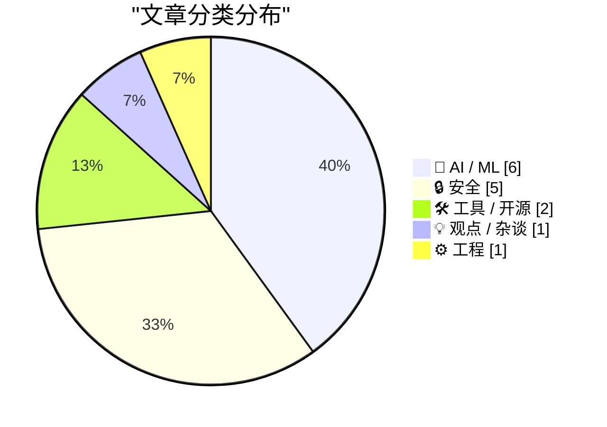
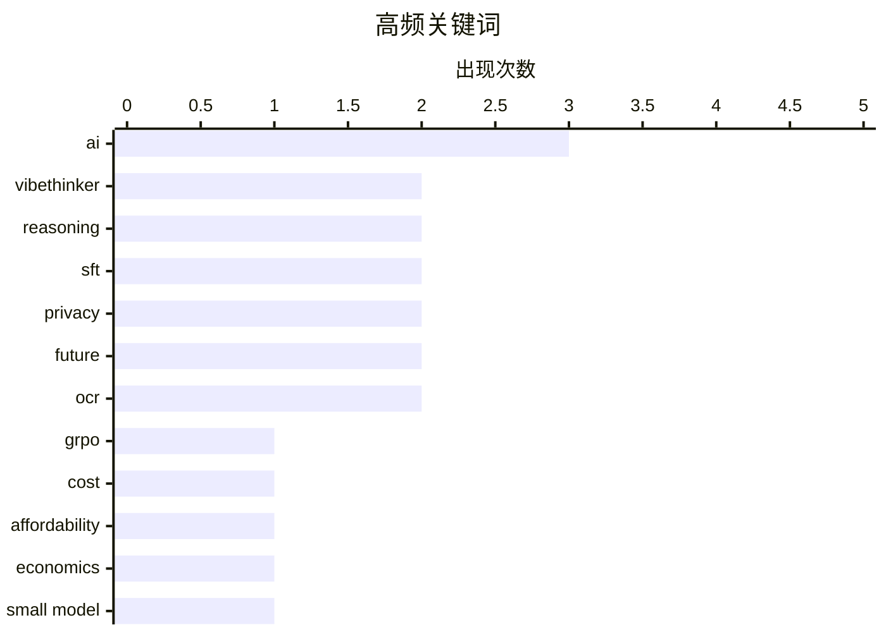

# 📰 AI 资讯每日精选 — 2026-06-24

> 汇聚 140+ 技术博客、X/Twitter、Hacker News、Reddit、Product Hunt、
> Lobste.rs、ClawFeed 日报及 GitHub Trending，经 AI 评分筛选。
>
> **本期内容**：🏆 今日必读 · 🌐 ClawFeed 日报 · 🔥 GitHub Trending · 📂 分类精选 · 🎨 设计与生成式 AI · 📊 数据概览

## 📝 今日看点

今日技术圈呈现两大核心趋势：一是AI模型正从“越大越好”转向“小而精”的路线，3B参数的VibeThinker通过新型训练方法在推理任务上击败大模型，同时行业面临算力成本飙升的可负担性危机；二是AI工具带来的新问题引发反思，编程助手虽提升效率却制造了“认知负担循环”，而所谓的“年龄验证”技术被指实为大规模监控。此外，AI安全攻防战持续升温，OpenAI与Anthropic在网络安全基准上展开竞争，黑客组织成员则因攻击公共交通系统而认罪。

---

## 🏆 今日必读

🥇 **VibeThinker：一个在推理上击败Opus 4.5的3B参数模型，采用新型SFT+GRPO方法**

[VibeThinker: 3B param model that beats Opus 4.5 on reasoning with novel SFT+GRPO](https://arxiv.org/abs/2606.16140) — Hacker News Best · 23 小时前 · 🤖 AI / ML

> VibeThinker是一个仅有3B参数的小型语言模型，却在推理任务上击败了Anthropic的Opus 4.5等大模型。其核心创新在于结合了监督微调（SFT）与基于组相对策略优化（GRPO）的新型训练方法。该模型在多个推理基准测试中表现优异，证明了小模型通过精心设计的训练策略也能达到甚至超越大模型的推理能力。这一成果挑战了“模型越大推理越强”的传统认知，为高效、低成本AI推理开辟了新路径。

💡 **为什么值得读**: 如果你关注如何用小模型实现大模型级别的推理能力，这篇论文提供了具体的技术方案和令人信服的实验结果。

🏷️ VibeThinker, reasoning, SFT, GRPO

🥈 **AI的可负担性危机**

[AI's Affordability Crisis](https://blog.dshr.org/2026/06/ais-affordability-crisis.html) — Hacker News Best · 10 小时前 · 🤖 AI / ML

> 文章指出当前AI行业正面临严重的可负担性危机，即训练和运行前沿AI模型的成本急剧上升，远超大多数企业和个人的承受能力。作者认为，这种成本膨胀主要由算力军备竞赛、数据获取成本增加以及模型规模无节制扩大驱动。文章警告，如果成本问题得不到解决，AI的发展将仅限于少数科技巨头，导致创新停滞和垄断加剧。核心观点是，行业必须转向更高效、更经济的模型架构和训练方法，否则AI的普及将化为泡影。

💡 **为什么值得读**: 这篇文章直击AI行业当前最现实的痛点——成本，对于任何关心AI商业化、普惠化或投资方向的人来说都极具参考价值。

🏷️ AI, cost, affordability, economics

🥉 **VibeThinker：一个在推理上击败Opus 4.5的3B参数模型，采用新型SFT+GRPO方法**

[VibeThinker is a 3B param model that beats Opus 4.5 on reasoning with novel SFT+GRPO](https://www.reddit.com/r/singularity/comments/1udifm6/vibethinker_is_a_3b_param_model_that_beats_opus/) — r/singularity · 11 小时前 · 🤖 AI / ML

> VibeThinker是一个仅有3B参数的小型语言模型，却在推理任务上击败了Anthropic的Opus 4.5等大模型。其核心创新在于结合了监督微调（SFT）与基于组相对策略优化（GRPO）的新型训练方法。该模型在多个推理基准测试中表现优异，证明了小模型通过精心设计的训练策略也能达到甚至超越大模型的推理能力。这一成果挑战了“模型越大推理越强”的传统认知，为高效、低成本AI推理开辟了新路径。

💡 **为什么值得读**: 如果你关注如何用小模型实现大模型级别的推理能力，这篇论文提供了具体的技术方案和令人信服的实验结果。

🏷️ VibeThinker, reasoning, small model, SFT

4️⃣ **我们所谓的“年龄验证”实际上是大规模监控**

[What we call "age verification" is actually mass surveillance](https://pluralistic.net/2026/06/23/destroy-the-village/) — Hacker News Best · 11 小时前 · 🔒 安全

> 文章尖锐地指出，当前各国推行的在线年龄验证方案本质上是一种大规模监控系统。作者认为，这些方案要求用户提交身份证件、生物信息或进行面部扫描，不仅侵犯隐私，还创造了可供政府和企业滥用的集中化数据仓库。文章批评了“为了儿童安全可以牺牲所有人隐私”的叙事，并列举了多个技术方案（如去中心化身份、零知识证明）作为更优替代。核心观点是，任何要求用户向第三方证明身份的“验证”系统，最终都会演变为全面监控工具。

💡 **为什么值得读**: 这篇文章对当前流行的“年龄验证”立法进行了深刻的技术与政治批判，对于理解数字权利、隐私保护和监控资本主义的读者来说是一记警钟。

🏷️ age-verification, surveillance, privacy

5️⃣ **即将到来的循环**

[The Coming Loop](https://lucumr.pocoo.org/2026/6/23/the-coming-loop/) — Hacker News Best · 14 小时前 · 💡 观点 / 杂谈

> 文章探讨了AI编程工具（如Cursor、Copilot）带来的“循环”问题：开发者越来越依赖AI生成代码，但AI生成的代码又需要开发者去理解和调试，形成了一个新的认知负担循环。作者指出，这种循环导致开发者对底层原理的理解逐渐退化，代码质量下降，且难以发现AI引入的微妙错误。结论是，虽然AI编程助手提高了效率，但过度依赖会侵蚀开发者的核心技能，行业需要找到人机协作的平衡点。

💡 **为什么值得读**: 如果你是开发者或技术管理者，这篇文章会促使你反思AI编程工具的真实成本和长期影响，避免陷入“效率陷阱”。

🏷️ programming, loops, language-design, future

---

## 🌐 ClawFeed 日报精选

> 来源：[ClawFeed](https://clawfeed.kevinhe.io) — AI 驱动的多源新闻聚合

# ClawFeed Daily Digest | 2026-06-23 (Mon)

> 基于 5 份 4h digest（#708 00:00, #709 04:00, #710 08:00, #711 12:00, #712 16:00）汇总。覆盖 00:00-19:59 SGT。数据覆盖率 5/6（20:00 档尚未生成）。注：#711 和 #712 受 Chrome 149 Playwright 兼容问题影响，scrape 深度受限，fallback 到 puppeteer-core。

---

## 🔥 当日全场最重要 5 条

1. **John Jumper（AlphaFold 之父）离开 Google DeepMind，加入 Anthropic** — 9 年 GDM 生涯结束，AI 科学发现方向的顶级人才正式转投 Anthropic。5.9M views，当日最大人事新闻。AI for Science 研究力量进一步向 Anthropic 集中。（#708）

2. **Cline 官方实测 GLM-5.2 vs Opus 4.8：开源模型在真实编码任务胜出** — 用 Cline 仓库真实 bug 做 head-to-head 对比，两者都修复了问题，但 GLM 在代码质量上更优，虽然用了 2x token（1.1M vs 660K）但总成本更低。首个头部开发工具的独立实测，验证开源模型在实际编码场景的竞争力。（#709 #710 #711 跨 3 档热点）

3. **Box 支持 HTML agent 内容管理** — Aaron Levie 宣布 Box 可预览、编辑、版本管理、安全分享任何 HTML 内容——"We heard that HTML is a big deal again"。直接面向 agent 产出物的企业级 content pipeline，agent 产出内容 → 企业内管理/分享的闭环正在形成。（#709 #710 #711 跨 3 档热点）

4. **Sakana Fugu 持续发酵：model routing 走向产品化** — Levie 补评"mixture of models to get work done，单 API 自动分发到最佳模型"。郭宇评"专门为 tool use 设计的 LLM"。开源模型逼近前沿：Levie 指出 GLM-5.2 在 Design Arena 击败 Fable 5，open weights 与 frontier 仅剩 marginal gap。（#708 #710）

5. **Levie：几乎所有 AI 模型和 agent 进步都 downstream from evals** — 开源后训练、应用层 agent 改进、企业级部署全都回到 eval 问题。结合他另一条"agents 用软件频率将是人的 100x"——guardrails、audit、authoritative sources of truth 需求爆发。（#710 #711）

---

## 📰 当日核心主题

### 开源模型逼近 Frontier — 从 benchmark 到实战验证
今日最持续的主题。Cline 用真实 bug 实测 GLM-5.2 vs Opus 4.8，GLM 在代码质量和成本上胜出——从昨日 Design Arena benchmark 到今日 real-world coding task，验证链条在延伸。Levie 总结"open weights 与 frontier 仅剩 marginal gap"。Sakana Fugu 用 model routing 绕过单模型天花板，进一步模糊开源闭源界限。

### Agent 内容管理基础设施补全
Box 支持 HTML 预览/编辑/版本管理/安全分享，直接面向 agent 产出物。Agent 产出 → 企业内管理分享的闭环正在形成。Levie 断言 agent 用软件频率将是人的 100x，guardrails 和 audit 成为刚需。

### Harness Engineering 持续深化
MiMo Code 开源（5 人 14 天 vibe-coding 产出的 agent harness 系统），强调"强模型需要强 harness，反之亦然"。@yanhua1010 发布目前最完整的 Agentic Engineering Workflow 介绍：tmux、agent 记忆、skills、语音输入、长任务执行、并行 worktree 管理、多 agent 调度。

### AI 人才大迁徙
John Jumper（AlphaFold/诺贝尔化学奖）从 GDM 转投 Anthropic。@Momoxu7 回顾 OpenAI Founder Day："旧人赴新途，AI 持续承接全市场资本热度"。顶级人才流动反映各 lab 的战略方向。

### Eval 驱动一切
Levie 明确指出"几乎所有进步都 downstream from evals"——模型训练、agent 改进、企业部署全都回到评估问题。Amanda Askell（Anthropic 哲学家）发起 "Claude soul eval" 征集用户真实对话案例。

---

## 🔖 Bookmarks 精选

全天 5 档 digest 中抓到的 bookmarks 均为旧标记（4-5 月），无新增。

唯一值得注意：Chormex 用 GPT-Realtime-2 实现实时 AI 翻译（YouTube/直播/会议等 Chrome 内音频实时翻译），Greg Brockman 转发。（5/9 旧推，#711 才被 scrape 到）

---

## 👀 推荐关注汇总

| 账号 | 简介 | Followers | 推荐理由 |
|------|------|-----------|----------|
| **@JohnJumperSci** | AlphaFold 创始人，刚加入 Anthropic | 29.8K | AI for Science 标杆人物，刚开始活跃 |
| **@tianyi** | DeepSeek Harness 组 MTS | 12.5K | Coding agent 工具链一手信息源，正在大规模招人 |
| **@MengkePM** | 独立开发者/品牌方法论 | 10.8K | "好事发生"App 创始人，5 天 10K 关注增长 |

提醒：未通过浏览器核实是否已关注，操作前请先搜一下 Following 避免重复。

---

## 🧹 建议取关

| 账号 | 理由 |
|------|------|
| **@HeXiaobo** (David.He) | 最后推文 2018 年 7 月，超 8 年无活动。Follows you，可能有私交（连续 3 日提醒） |
| **@0xJasonBateman** (Jason) | 36 posts / 8 followers，内容为 Spotify 音乐分享，非领域相关。Follows you（连续 3 日提醒） |

---

## 💤 当日重复噪音模式

- **Elon Musk 政治评论**：gain-of-function 生物实验室 / Ro Khanna 国会交易丑闻 / 社交媒体年龄限制 vs 青春期阻断剂 / 马克思父亲信件——全天 5 档均出现，持续最高噪音
- **@rwayne**：投资鸡汤转发 + 意大利总理外貌评论 + 生活帖——3 档出现
- **@caterpillarous**：个人感悟/乔布斯视频——2 档出现，低频但无信息增量
- **@JELabs2024**：营销公司互推帖——1 档出现

---

*Generated at 2026-06-23 23:55 SGT | Digests aggregated: #708, #709, #710, #711, #712*
---

## 🔥 GitHub Trending

> 今日热门开源项目（全语言 + Python）

| # | 项目 | 描述 | ⭐ 总星 | 📈 今日 | 语言 |
|---|------|------|---------|---------|------|
| 1 | [calesthio/OpenMontage](https://github.com/calesthio/OpenMontage) 🤖 | World's first open-source, agentic video production syste... | 15.7k | +3592 | Python |
| 2 | [palmier-io/palmier-pro](https://github.com/palmier-io/palmier-pro) 🤖 | macOS video editor built for AI | 8.4k | +1630 | Swift |
| 3 | [DeusData/codebase-memory-mcp](https://github.com/DeusData/codebase-memory-mcp) | High-performance code intelligence MCP server. Indexes co... | 13.0k | +1300 | C |
| 4 | [ZhuLinsen/daily_stock_analysis](https://github.com/ZhuLinsen/daily_stock_analysis) 🤖 | LLM 驱动的多市场股票智能分析系统：多源行情、实时新闻、决策看板与自动推送，支持零成本定时运行。 LLM-pow... | 47.1k | +1119 | Python |
| 5 | [jamiepine/voicebox](https://github.com/jamiepine/voicebox) 🤖 | The open-source AI voice studio. Clone, dictate, create. | 33.2k | +1045 | TypeScript |
| 6 | [mukul975/Anthropic-Cybersecurity-Skills](https://github.com/mukul975/Anthropic-Cybersecurity-Skills) 🤖 | 817 structured cybersecurity skills for AI agents · Mappe... | 19.7k | +1041 | Python |
| 7 | [garrytan/gstack](https://github.com/garrytan/gstack) 🤖 | Use Garry Tan's exact Claude Code setup: 23 opinionated t... | 114.1k | +1011 | TypeScript |
| 8 | [NousResearch/hermes-agent](https://github.com/NousResearch/hermes-agent) 🤖 | The agent that grows with you | 201.0k | +936 | Python |
| 9 | [JCodesMore/ai-website-cloner-template](https://github.com/JCodesMore/ai-website-cloner-template) 🤖 | Clone any website with one command using AI coding agents | 18.6k | +826 | TypeScript |
| 10 | [bytedance/deer-flow](https://github.com/bytedance/deer-flow) | An open-source long-horizon SuperAgent harness that resea... | 73.9k | +739 | Python |
| 11 | [affaan-m/ECC](https://github.com/affaan-m/ECC) 🤖 | The agent harness performance optimization system. Skills... | 220.6k | +593 | JavaScript |
| 12 | [anthropics/skills](https://github.com/anthropics/skills) 🤖 | Public repository for Agent Skills | 154.4k | +433 | Python |
| 13 | [shanraisshan/claude-code-best-practice](https://github.com/shanraisshan/claude-code-best-practice) 🤖 | from vibe coding to agentic engineering - practice makes ... | 59.5k | +344 | HTML |
| 14 | [koala73/worldmonitor](https://github.com/koala73/worldmonitor) 🤖 | Real-time global intelligence dashboard. AI-powered news ... | 59.1k | +294 | TypeScript |
| 15 | [karpathy/autoresearch](https://github.com/karpathy/autoresearch) 🤖 | AI agents running research on single-GPU nanochat trainin... | 88.3k | +186 | Python |

---

## 🤖 AI / ML

### 1. VibeThinker：一个在推理上击败Opus 4.5的3B参数模型，采用新型SFT+GRPO方法

[VibeThinker: 3B param model that beats Opus 4.5 on reasoning with novel SFT+GRPO](https://arxiv.org/abs/2606.16140) — **Hacker News Best** · 23 小时前 · ⭐ 28/30

> VibeThinker是一个仅有3B参数的小型语言模型，却在推理任务上击败了Anthropic的Opus 4.5等大模型。其核心创新在于结合了监督微调（SFT）与基于组相对策略优化（GRPO）的新型训练方法。该模型在多个推理基准测试中表现优异，证明了小模型通过精心设计的训练策略也能达到甚至超越大模型的推理能力。这一成果挑战了“模型越大推理越强”的传统认知，为高效、低成本AI推理开辟了新路径。

🏷️ VibeThinker, reasoning, SFT, GRPO

---

### 2. AI的可负担性危机

[AI's Affordability Crisis](https://blog.dshr.org/2026/06/ais-affordability-crisis.html) — **Hacker News Best** · 10 小时前 · ⭐ 27/30

> 文章指出当前AI行业正面临严重的可负担性危机，即训练和运行前沿AI模型的成本急剧上升，远超大多数企业和个人的承受能力。作者认为，这种成本膨胀主要由算力军备竞赛、数据获取成本增加以及模型规模无节制扩大驱动。文章警告，如果成本问题得不到解决，AI的发展将仅限于少数科技巨头，导致创新停滞和垄断加剧。核心观点是，行业必须转向更高效、更经济的模型架构和训练方法，否则AI的普及将化为泡影。

🏷️ AI, cost, affordability, economics

---

### 3. VibeThinker：一个在推理上击败Opus 4.5的3B参数模型，采用新型SFT+GRPO方法

[VibeThinker is a 3B param model that beats Opus 4.5 on reasoning with novel SFT+GRPO](https://www.reddit.com/r/singularity/comments/1udifm6/vibethinker_is_a_3b_param_model_that_beats_opus/) — **r/singularity** · 11 小时前 · ⭐ 27/30

> VibeThinker是一个仅有3B参数的小型语言模型，却在推理任务上击败了Anthropic的Opus 4.5等大模型。其核心创新在于结合了监督微调（SFT）与基于组相对策略优化（GRPO）的新型训练方法。该模型在多个推理基准测试中表现优异，证明了小模型通过精心设计的训练策略也能达到甚至超越大模型的推理能力。这一成果挑战了“模型越大推理越强”的传统认知，为高效、低成本AI推理开辟了新路径。

🏷️ VibeThinker, reasoning, small model, SFT

---

### 4. 使用CUGA构建真正的智能体应用：轻量级框架上的二十多个工作示例

[Build real agentic apps using CUGA: two dozen working examples on a lightweight harness](https://huggingface.co/blog/ibm-research/cuga-apps) — **Hugging Face Blog** · 12 小时前 · ⭐ 25/30

> 文章介绍了IBM Research开发的CUGA框架，这是一个用于构建AI智能体应用的轻量级工具。CUGA提供了二十多个可直接运行的工作示例，覆盖了从简单工具调用到复杂多步骤任务的各种场景。该框架强调模块化和可扩展性，允许开发者快速组合不同的模型、工具和记忆组件。核心目标是降低智能体应用的门槛，让开发者无需从零搭建基础设施即可快速原型化。

🏷️ agentic AI, CUGA, LLM, harness

---

### 5. Mistral OCR 4

[Mistral OCR 4](https://mistral.ai/news/ocr-4/) — **Hacker News Best** · 11 小时前 · ⭐ 25/30

> Article URL: https://mistral.ai/news/ocr-4/
Comments URL: https://news.ycombinator.com/item?id=48645152
Points: 427
# Comments: 113

🏷️ OCR, Mistral, AI, document-parsing

---

### 6. Unlimited OCR: One-shot long-horizon parsing

[Unlimited OCR: One-shot long-horizon parsing](https://github.com/baidu/Unlimited-OCR) — **Hacker News Best** · 13 小时前 · ⭐ 25/30

> Article URL: https://github.com/baidu/Unlimited-OCR
Comments URL: https://news.ycombinator.com/item?id=48643426
Points: 434
# Comments: 100

🏷️ OCR, long-horizon, parsing, open-source

---

## 🔒 安全

### 7. 我们所谓的“年龄验证”实际上是大规模监控

[What we call "age verification" is actually mass surveillance](https://pluralistic.net/2026/06/23/destroy-the-village/) — **Hacker News Best** · 11 小时前 · ⭐ 26/30

> 文章尖锐地指出，当前各国推行的在线年龄验证方案本质上是一种大规模监控系统。作者认为，这些方案要求用户提交身份证件、生物信息或进行面部扫描，不仅侵犯隐私，还创造了可供政府和企业滥用的集中化数据仓库。文章批评了“为了儿童安全可以牺牲所有人隐私”的叙事，并列举了多个技术方案（如去中心化身份、零知识证明）作为更优替代。核心观点是，任何要求用户向第三方证明身份的“验证”系统，最终都会演变为全面监控工具。

🏷️ age-verification, surveillance, privacy

---

### 8. Scattered Spider黑客在审判第一天认罪

[Scattered Spider Hackers Plead Guilty on Day 1 of Trial](https://krebsonsecurity.com/2026/06/scattered-spider-hackers-plead-guilty-on-day-1-of-trial/) — **krebsonsecurity.com** · 9 小时前 · ⭐ 25/30

> 两名Scattered Spider黑客组织的核心成员在英国法庭认罪，他们被指控参与了2024年8月对伦敦交通局（TfL）的网络攻击，该攻击导致大伦敦地区公共交通网络瘫痪。原定为期六周的审判在第一天即告结束，两人对多项刑事指控供认不讳。Scattered Spider是一个多产的网络犯罪团伙，此次认罪标志着执法部门在打击该组织方面取得重大胜利。

🏷️ cyberattack, ransomware, plea, Transport for London

---

### 9. OpenAI称新版GPT-5.5-Cyber在网络安全基准测试中超越Anthropic的Mythos

[OpenAI says new GPT-5.5-Cyber outperforms Anthropic's Mythos on cybersecurity benchmark](https://the-decoder.com/openai-says-new-gpt-5-5-cyber-outperforms-anthropics-mythos-on-cybersecurity-benchmark/) — **The Decoder** · 14 小时前 · ⭐ 25/30

> OpenAI宣布其最新的GPT-5.5-Cyber模型在网络安全基准测试中超越了Anthropic的Mythos。该模型是OpenAI“Daybreak”网络安全计划的一部分，同时发布的还有更新的Codex Security插件和一个由超过25家安全公司和多个政府组成的合作伙伴网络。OpenAI表示，其重点已从发现漏洞转向自动修补漏洞，标志着AI在网络安全领域的应用进入新阶段。

🏷️ GPT-5.5-Cyber, cybersecurity, OpenAI, vulnerability patching

---

### 10. U.S. presses Meta to agree to AI reviews as security concerns rise (OpenAI, Anthropic, Google, and xAI have agreed)

[U.S. presses Meta to agree to AI reviews as security concerns rise (OpenAI, Anthropic, Google, and xAI have agreed)](https://www.reddit.com/r/singularity/comments/1udzehs/us_presses_meta_to_agree_to_ai_reviews_as/) — **r/singularity** · 18 分钟前 · ⭐ 25/30

> <table> <tr><td> <a href="https://www.reddit.com/r/singularity/comments/1udzehs/us_presses_meta_to_agree_to_ai_reviews_as/">  <p><a href="https://lobste.rs/s/fdwnzt/cloudflare_collaborates_with_leading">Comments</a></p>

🏷️ Cloudflare, privacy, protocol, browsers

---

## 🛠 工具 / 开源

### 12. Cursor宣布推出自有AI模型、新Git平台和移动应用

[Cursor announces its own AI model, a new Git platform, and a mobile app](https://the-decoder.com/cursor-announces-its-own-ai-model-a-new-git-platform-and-a-mobile-app/) — **The Decoder** · 13 小时前 · ⭐ 25/30

> AI编程助手Cursor公布了其首个完全内部训练的AI模型，并同时发布了两个新产品：一个全新的Git平台和一款移动应用。新模型旨在提供更精准的代码生成和上下文理解能力。Git平台则试图解决现有版本控制工具在AI协作时代的痛点。移动应用让开发者可以在手机上查看代码、审查AI建议。这一系列动作表明Cursor正从单一工具向完整的AI开发平台转型。

🏷️ Cursor, AI model, Git platform, mobile app

---

### 13. F3：未来文件格式

[F3](https://github.com/future-file-format/f3) — **Hacker News Best** · 8 小时前 · ⭐ 25/30

> F3（Future File Format）是一个旨在创建下一代文件格式的开源项目。它试图解决现有格式（如PDF、DOCX）的诸多问题，包括封闭性、版本兼容性差、难以扩展等。F3基于纯文本和结构化数据，强调可读性、可扩展性和长期可访问性。项目已在GitHub上开源，并提供了详细的规范和示例。核心目标是设计一种能适应未来几十年技术变化的文件格式。

🏷️ file-format, future, standardization

---

## 💡 观点 / 杂谈

### 14. 即将到来的循环

[The Coming Loop](https://lucumr.pocoo.org/2026/6/23/the-coming-loop/) — **Hacker News Best** · 14 小时前 · ⭐ 26/30

> 文章探讨了AI编程工具（如Cursor、Copilot）带来的“循环”问题：开发者越来越依赖AI生成代码，但AI生成的代码又需要开发者去理解和调试，形成了一个新的认知负担循环。作者指出，这种循环导致开发者对底层原理的理解逐渐退化，代码质量下降，且难以发现AI引入的微妙错误。结论是，虽然AI编程助手提高了效率，但过度依赖会侵蚀开发者的核心技能，行业需要找到人机协作的平衡点。

🏷️ programming, loops, language-design, future

---

## ⚙️ 工程

### 15. Performance of WebAssembly runtimes in 2026

[Performance of WebAssembly runtimes in 2026](https://00f.net/2026/06/23/webassembly-runtimes-2026/) — **Lobste.rs** · 11 小时前 · ⭐ 25/30

> <p><a href="https://lobste.rs/s/fhmvsf/performance_webassembly_runtimes_2026">Comments</a></p>

🏷️ WebAssembly, runtime, performance, benchmark

---

## 📊 数据概览

| 扫描源 | 抓取文章 | 时间范围 | 精选 |
|:---:|:---:|:---:|:---:|
| 90/140 | 3751 篇 → 71 篇 | 24h | **15 篇** |

### 分类分布



### 高频关键词



<details>
<summary>📈 纯文本关键词图（终端友好）</summary>

```
ai            │ ████████████████████ 3
vibethinker   │ █████████████░░░░░░░ 2
reasoning     │ █████████████░░░░░░░ 2
sft           │ █████████████░░░░░░░ 2
privacy       │ █████████████░░░░░░░ 2
future        │ █████████████░░░░░░░ 2
ocr           │ █████████████░░░░░░░ 2
grpo          │ ███████░░░░░░░░░░░░░ 1
cost          │ ███████░░░░░░░░░░░░░ 1
affordability │ ███████░░░░░░░░░░░░░ 1
```

</details>

### 🏷️ 话题标签

**ai**(3) · **vibethinker**(2) · **reasoning**(2) · sft(2) · privacy(2) · future(2) · ocr(2) · grpo(1) · cost(1) · affordability(1) · economics(1) · small model(1) · age-verification(1) · surveillance(1) · programming(1) · loops(1) · language-design(1) · cyberattack(1) · ransomware(1) · plea(1)

---

*生成于 2026-06-24 01:31 | 汇聚 140 个技术博客、X/Twitter、Hacker News、Reddit、Product Hunt、Lobste.rs、ClawFeed 日报及 GitHub Trending，经 AI 评分筛选出 Top 15 精华内容*
