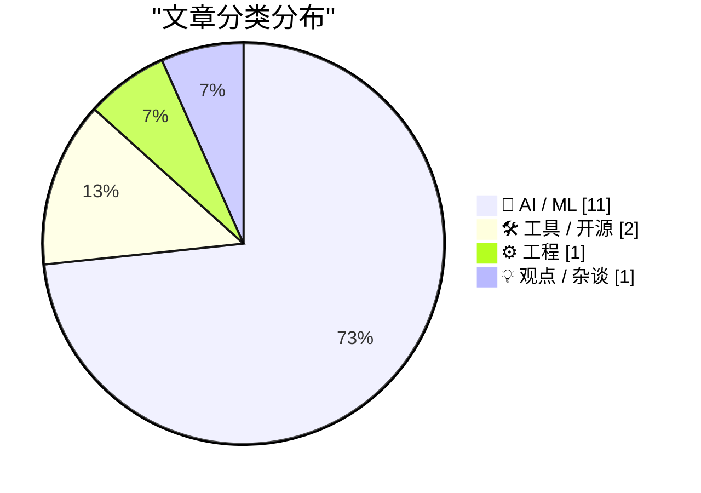
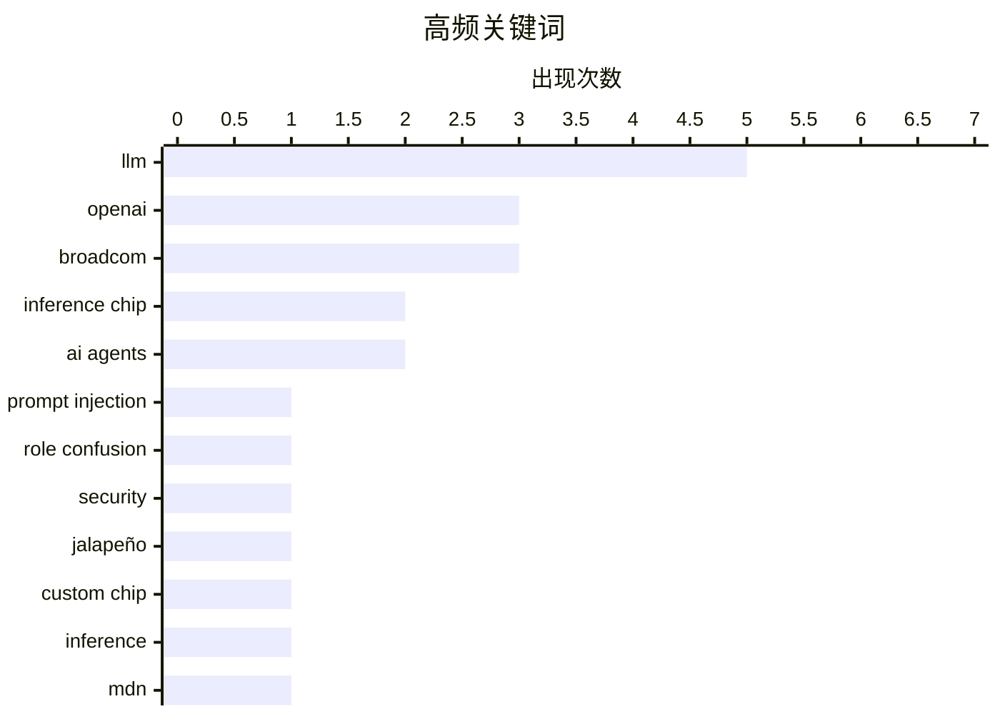

# 📰 AI 资讯每日精选 — 2026-06-25

> 汇聚 140+ 技术博客、X/Twitter、Hacker News、Reddit、Product Hunt、
> Lobste.rs、ClawFeed 日报及 GitHub Trending，经 AI 评分筛选。
>
> **本期内容**：🏆 今日必读 · 🌐 ClawFeed 日报 · 🔥 GitHub Trending · 📂 分类精选 · 🎨 设计与生成式 AI · 📊 数据概览

## 📝 今日看点

今日技术圈聚焦两大趋势：一是AI基础设施的硬件突破，OpenAI与博通联合发布专为LLM推理优化的定制芯片“Jalapeño”，旨在降低对英伟达GPU的依赖并大幅提升能效比；二是AI智能体的能力与治理同步演进，Gemini 3.5 Flash引入计算机使用功能，同时业界开始制定智能体认证标准（auth.md）以解决自动化服务注册的难题。此外，国产模型GLM-5.2在成本仅为对手五分之一的情况下展现出竞争力，进一步加剧了AI模型的性价比竞赛。

---

## 🏆 今日必读

🥇 **关于角色混淆的思考**

[Thoughts on Role Confusion](https://www.gilesthomas.com/2026/06/role-confusion) — gilesthomas.com · 5 小时前 · 🤖 AI / ML

> 文章探讨了LLM中“提示注入”与“角色混淆”之间的关系。研究发现，LLM几乎会忽略`<system>`、`<user>`等显式角色标签，而是根据内容的语气和上下文来推断角色。这种机制导致攻击者可以通过伪装成系统指令来诱导模型执行非预期操作。作者认为，当前基于角色标签的安全防护存在根本性缺陷，需要重新设计模型对指令来源的区分机制。

💡 **为什么值得读**: 揭示了LLM安全机制的一个核心盲点，对理解提示注入攻击的本质有重要启发。

🏷️ prompt injection, role confusion, LLM, security

🥈 **OpenAI与博通发布专为LLM推理设计的定制芯片“Jalapeño”**

[OpenAI and Broadcom unveil "Jalapeño," a custom chip built for LLM inference](https://the-decoder.com/openai-and-broadcom-unveil-jalapeno-a-custom-chip-built-for-llm-inference/) — The Decoder · 11 小时前 · 🤖 AI / ML

> OpenAI与博通联合发布了名为“Jalapeño”的定制芯片，专门针对大语言模型推理进行优化。该芯片围绕前沿AI模型最关键的核函数、内存搬运、网络和推理服务模式进行了架构设计。早期测试表明，Jalapeño的性能功耗比显著优于当前最先进的芯片，计划于2026年底大规模部署。

💡 **为什么值得读**: 这是OpenAI自研芯片战略的重要里程碑，对理解AI硬件竞争格局和推理成本趋势至关重要。

🏷️ OpenAI, Broadcom, Jalapeño, inference chip

🥉 **OpenAI发布首款定制芯片，由博通制造**

[OpenAI unveils its first custom chip, built by Broadcom](https://techcrunch.com/2026/06/24/openai-unveils-its-first-custom-chip-built-by-broadcom/) — Hacker News Best · 7 小时前 · ⚙️ 工程

> OpenAI正式宣布其首款定制芯片“Jalapeño”，由博通负责制造。该芯片专为LLM推理场景设计，旨在降低对英伟达GPU的依赖。早期测试显示其能效比远超现有方案，但最终性能数据仍在测量中。此举标志着OpenAI从纯软件公司向软硬件一体化转型的关键一步。

💡 **为什么值得读**: 提供了OpenAI芯片战略的官方视角，包含Hacker News社区的高热度讨论，适合关注AI基础设施的读者。

🏷️ OpenAI, custom chip, Broadcom, inference

4️⃣ **OpenAI与博通发布LLM优化推理芯片**

[OpenAI and Broadcom unveil LLM-optimized inference chip](https://www.reddit.com/r/singularity/comments/1ueej55/openai_and_broadcom_unveil_llmoptimized_inference/) — r/singularity · 11 小时前 · 🤖 AI / ML

> OpenAI与博通联合发布了针对LLM推理优化的芯片“Jalapeño”。官方称其架构围绕前沿AI模型最关键的核函数、内存搬运、网络和推理服务模式进行了专门优化。早期测试显示，该芯片的性能功耗比“显著优于当前最先进水平”，但最终性能仍在评估中。

💡 **为什么值得读**: 来自r/singularity社区的热议，包含官方技术细节引用，适合关注AI硬件突破的读者。

🏷️ OpenAI, Broadcom, inference chip, LLM

5️⃣ **MDN MCP服务器正式发布**

[Introducing the MDN MCP server](https://developer.mozilla.org/en-US/blog/introducing-mdn-mcp-server/) — Lobste.rs · 9 小时前 · 🛠 工具 / 开源

> Mozilla开发者网络（MDN）推出了MCP（Model Context Protocol）服务器，为AI工具提供标准化的MDN文档访问接口。该服务器允许AI助手直接查询和检索最新的Web开发文档，包括HTML、CSS、JavaScript等API的详细说明。这解决了AI模型在生成代码时引用过时或不准确文档的问题。

💡 **为什么值得读**: 对AI辅助编程和Web开发者而言，这是提升代码生成准确性的重要基础设施。

🏷️ MDN, MCP, developer tools

---

## 🌐 ClawFeed 日报精选

> 来源：[ClawFeed](https://clawfeed.kevinhe.io) — AI 驱动的多源新闻聚合

# ClawFeed Daily Digest | 2026-06-24 (SGT)

Aggregated from 5x 4h digests: #712, #715, #716, #717, #718

---

## 🔥 当日 Top 5

1. **Cline 实测 GLM-5.2 vs Opus 4.8 修真实 bug** — 开源模型在 agentic coding 场景正面对标闭源前沿：GLM 代码质量更好、成本更低，但 token 用量翻倍（1.1M vs 660K）。开源 vs 闭源的 trade-off 进入新阶段。
   来源: https://x.com/cline/status/2069171146994729078

2. **Claude Tag 发布 — Claude 以团队成员身份加入 Slack** — 可访问频道和工具，Levie 指出配合 Box 实现企业内容作为便携知识库。"Headless software + agent" 模式正式落地。
   来源: https://x.com/levie/status/2069596515560267891

3. **AI 定价出现"杠铃效应"** — Aaron Levie 分析：高成本前沿模型 vs 便宜够用的开源/闭源模型两极分化，核心问题变成如何最大化前沿模型的效率。
   来源: https://x.com/levie/status/2069639600310767616

4. **Du Jun 企业 AI 协作产品 7/6 上线** — 3 月孵化，内测服务 70+ 家企业（从万人跨国集团到创业团队）。同时基于真实案例撰写《AI 组织重构》一书。企业 AI adoption 的真实信号。
   来源: https://x.com/DujunX/status/2069645772505936685

5. **美国数字资产立法三件套推进** — GENIUS（稳定币）+ Clarity（市场结构）+ 税务透明度。Crypto 监管框架逐步成形。
   来源: https://x.com/KristinSmith/status/2069508211254636852

---

## 📰 当日核心主题

- **AI Agent 工具竞赛**：Cline GLM vs Opus 对比测评、Claude Tag 落地 Slack、Chormex 实时翻译 — agent 从 demo 进入日常工作流
- **AI 定价经济学**：杠铃效应（frontier vs commodity），开源模型在 agentic 场景成本优势显现但 token 效率仍差
- **企业 AI 落地**：Du Jun 70+ 企业内测、Box + Claude 企业知识库、headless software 范式
- **Crypto 周期观察**：叙事回归支付（Bitcoin 白皮书），社交圈从炒币群迁移 AI 群，美国监管框架渐成
- **Harness Engineering**：MiMo 团队强调 "model evolution needs a solid harness system"，与上周 harness 话题呼应

---

## 🔖 Bookmarks 精选

- **Chormex + GPT-Realtime-2 实时 AI 翻译** — 浏览器内实时翻译 YouTube/直播/会议音频，延迟极低。Greg Brockman 转发背书，190K+ views。（多期重复出现，原发布 5/9）
  来源: https://x.com/arrakis_ai/status/2053055460060618805

---

## 👀 推荐关注汇总

- 本日各期均无新推荐关注目标（feed 样本量偏小，且多为已关注账号）

---

## 🧹 建议取关

- **@HeXiaobo** — 最近推文 2018 年 7 月，超 7 年未活跃。标注 Follows you，如有私交可保留。
- **@0xJasonBateman** — 仅 36 posts，内容与 AI/crypto/tech 无关（NASA 转帖、Spotify 链接）。标注 Follows you。
- **@Soft6161** — 27.9K followers，但内容以互动引流/engagement bait 为主，缺乏原创深度。

---

## 💤 当日噪音模式

- **@elonmusk 政治内容**：全天多期出现（社交媒体年龄限制、Soros、Ro Khanna 国会议员交易争议），均已过滤
- **@DujunX 重复**：博士课程感言在 #712/#715/#716 三期重复出现，已去重仅保留一次
- **旧 Bookmark 反复浮现**：Chormex (5/9)、wanman.ai (4/25) 等旧内容在多期 bookmark 中重复补录
- **凌晨低信号**：04:00-12:00 SGT 时段 feed 极度低信号（3-5 条/期），有效内容集中在 16:00-20:00 SGT

---

*Generated from 4h digests #712, #715, #716, #717, #718*
---

## 🔥 GitHub Trending

> 今日热门开源项目（全语言 + Python）

| # | 项目 | 描述 | ⭐ 总星 | 📈 今日 | 语言 |
|---|------|------|---------|---------|------|
| 1 | [calesthio/OpenMontage](https://github.com/calesthio/OpenMontage) 🤖 | World's first open-source, agentic video production syste... | 19.5k | +3719 | Python |
| 2 | [apple/container](https://github.com/apple/container) | A tool for creating and running Linux containers using li... | 42.3k | +1838 | Swift |
| 3 | [ZhuLinsen/daily_stock_analysis](https://github.com/ZhuLinsen/daily_stock_analysis) 🤖 | LLM 驱动的多市场股票智能分析系统：多源行情、实时新闻、决策看板与自动推送，支持零成本定时运行。 LLM-pow... | 48.6k | +1468 | Python |
| 4 | [NousResearch/hermes-agent](https://github.com/NousResearch/hermes-agent) 🤖 | The agent that grows with you | 202.1k | +1178 | Python |
| 5 | [mukul975/Anthropic-Cybersecurity-Skills](https://github.com/mukul975/Anthropic-Cybersecurity-Skills) 🤖 | 817 structured cybersecurity skills for AI agents · Mappe... | 20.6k | +1031 | Python |
| 6 | [JCodesMore/ai-website-cloner-template](https://github.com/JCodesMore/ai-website-cloner-template) 🤖 | Clone any website with one command using AI coding agents | 19.4k | +692 | TypeScript |
| 7 | [google-labs-code/design.md](https://github.com/google-labs-code/design.md) | A format specification for describing a visual identity t... | 17.4k | +619 | TypeScript |
| 8 | [bytedance/deer-flow](https://github.com/bytedance/deer-flow) | An open-source long-horizon SuperAgent harness that resea... | 74.5k | +617 | Python |
| 9 | [stablyai/orca](https://github.com/stablyai/orca) 🤖 | Orca is the ADE for working with a fleet of parallel agen... | 6.8k | +331 | TypeScript |
| 10 | [anthropics/claude-plugins-official](https://github.com/anthropics/claude-plugins-official) 🤖 | Official, Anthropic-managed directory of high quality Cla... | 31.1k | +306 | Python |
| 11 | [revfactory/harness](https://github.com/revfactory/harness) 🤖 | A meta-skill that designs domain-specific agent teams, de... | 7.7k | +277 | HTML |
| 12 | [interviewstreet/hiring-agent](https://github.com/interviewstreet/hiring-agent) 🤖 | AI agent to evaluate and score resumes. | 2.2k | +203 | Python |
| 13 | [BerriAI/litellm](https://github.com/BerriAI/litellm) 🤖 | Python SDK, Proxy Server (AI Gateway) to call 100+ LLM AP... | 51.4k | +159 | Python |
| 14 | [kunchenguid/no-mistakes](https://github.com/kunchenguid/no-mistakes) | git push no-mistakes | 2.2k | +110 | Go |
| 15 | [flutter/flutter](https://github.com/flutter/flutter) | Flutter makes it easy and fast to build beautiful apps fo... | 177.3k | +73 | Dart |

---

## 🤖 AI / ML

### 1. 关于角色混淆的思考

[Thoughts on Role Confusion](https://www.gilesthomas.com/2026/06/role-confusion) — **gilesthomas.com** · 5 小时前 · ⭐ 26/30

> 文章探讨了LLM中“提示注入”与“角色混淆”之间的关系。研究发现，LLM几乎会忽略`<system>`、`<user>`等显式角色标签，而是根据内容的语气和上下文来推断角色。这种机制导致攻击者可以通过伪装成系统指令来诱导模型执行非预期操作。作者认为，当前基于角色标签的安全防护存在根本性缺陷，需要重新设计模型对指令来源的区分机制。

🏷️ prompt injection, role confusion, LLM, security

---

### 2. OpenAI与博通发布专为LLM推理设计的定制芯片“Jalapeño”

[OpenAI and Broadcom unveil "Jalapeño," a custom chip built for LLM inference](https://the-decoder.com/openai-and-broadcom-unveil-jalapeno-a-custom-chip-built-for-llm-inference/) — **The Decoder** · 11 小时前 · ⭐ 26/30

> OpenAI与博通联合发布了名为“Jalapeño”的定制芯片，专门针对大语言模型推理进行优化。该芯片围绕前沿AI模型最关键的核函数、内存搬运、网络和推理服务模式进行了架构设计。早期测试表明，Jalapeño的性能功耗比显著优于当前最先进的芯片，计划于2026年底大规模部署。

🏷️ OpenAI, Broadcom, Jalapeño, inference chip

---

### 3. OpenAI与博通发布LLM优化推理芯片

[OpenAI and Broadcom unveil LLM-optimized inference chip](https://www.reddit.com/r/singularity/comments/1ueej55/openai_and_broadcom_unveil_llmoptimized_inference/) — **r/singularity** · 11 小时前 · ⭐ 26/30

> OpenAI与博通联合发布了针对LLM推理优化的芯片“Jalapeño”。官方称其架构围绕前沿AI模型最关键的核函数、内存搬运、网络和推理服务模式进行了专门优化。早期测试显示，该芯片的性能功耗比“显著优于当前最先进水平”，但最终性能仍在评估中。

🏷️ OpenAI, Broadcom, inference chip, LLM

---

### 4. Gemini 3.5 Flash引入计算机使用能力

[Introducing computer use in Gemini 3.5 Flash](https://deepmind.google/blog/introducing-computer-use-in-gemini-3-5-flash/) — **Google DeepMind Blog** · 9 小时前 · ⭐ 25/30

> Google DeepMind宣布在Gemini 3.5 Flash模型中引入“计算机使用”功能，使AI能够直接操作图形用户界面。该功能允许模型模拟人类操作，包括点击、滚动、输入等动作，从而自动化完成网页浏览、软件操作等任务。这标志着AI从纯文本交互向环境交互的重要演进。

🏷️ Gemini, computer use, Flash, multimodal

---

### 5. DualPath：突破智能体LLM推理中的存储带宽瓶颈

[DualPath: Breaking the Storage Bandwidth Bottleneck in Agentic LLM Inference](https://www.reddit.com/r/singularity/comments/1uemrgy/dualpath_breaking_the_storage_bandwidth/) — **r/singularity** · 6 小时前 · ⭐ 25/30

> DualPath提出了一种新架构，旨在解决智能体LLM推理中存储带宽成为瓶颈的问题。该方案通过双路径数据流设计，显著减少了模型在推理过程中对存储系统的访问压力。初步实验表明，该方法能有效提升推理吞吐量，降低延迟，特别适用于需要频繁访问外部知识的智能体场景。

🏷️ LLM inference, storage bandwidth, agentic, DualPath

---

### 6. WorkOS：智能体需要认证，现在有了标准规范

[[Sponsor] WorkOS: Agents Need Auth. There’s Now a Spec for It.](http://workos.com/auth-md?utm_source=daringfireball&amp;utm_medium=newsletter&amp;utm_campaign=q32026) — **daringfireball.net** · 6 小时前 · ⭐ 24/30

> 文章介绍了auth.md规范，旨在解决AI智能体在代表用户注册新服务时遇到的认证难题。auth.md是一个托管在域名下的文件，类似于robots.txt，用于告知智能体如何注册用户、支持哪些流程、暴露哪些作用域以及如何颁发凭证。该规范基于现有OAuth标准，已被Cloudflare、Firecrawl和Resend等公司采用。

🏷️ AI agents, auth, spec, registration

---

### 7. Snowflake CEO发现GLM-5.2在成本远低于Opus 4.7的情况下具有竞争力

[Snowflake CEO finds GLM-5.2 competitive with Opus 4.7 at a fraction of the cost](https://the-decoder.com/snowflake-ceo-finds-glm-5-2-competitive-with-opus-4-7-at-a-fraction-of-the-cost/) — **The Decoder** · 8 小时前 · ⭐ 24/30

> 智谱AI的GLM-5.2模型在Snowflake的103个编码任务基准测试中几乎与Claude Opus 4.7持平，但每个输出token的成本仅为后者的五分之一。不过，GLM-5.2每个任务消耗的token数量几乎是Opus 4.7的两倍。这种巨大的定价差距正在给Anthropic和OpenAI带来压力，并可能动摇西方AI实验室的估值。

🏷️ GLM-5.2, Claude Opus, cost, benchmark

---

### 8. Claude Tag embeds Anthropic's AI in Slack, already writes 65 percent of internal code, company says

[Claude Tag embeds Anthropic's AI in Slack, already writes 65 percent of internal code, company says](https://the-decoder.com/claude-tag-embeds-anthropics-ai-in-slack-already-writes-65-percent-of-internal-code-company-says/) — **The Decoder** · 16 小时前 · ⭐ 24/30

> Claude Tag lets teams bring Anthropic's AI into Slack by tagging @Claude in any channel and assigning it tasks. Internally, the tool already generates 65 percent of the code on Anthropic's product tea

🏷️ Claude, Slack, code generation, Anthropic

---

### 9. the EU is funding its own open-source 400B+ frontier model, built on European supercomputers

[the EU is funding its own open-source 400B+ frontier model, built on European supercomputers](https://www.reddit.com/r/singularity/comments/1ue8yy5/the_eu_is_funding_its_own_opensource_400b/) — **r/singularity** · 15 小时前 · ⭐ 24/30

> <!-- SC_OFF --><div class="md"><p>the Commission just named the winner of its Frontier AI Grand Challenge. it's a consortium called EUROPA, led by an Italian company called Domyn, and the plan is an o

🏷️ open-source, LLM, EU, supercomputer

---

### 10. The memory wall gets expensive: KV cache is why you should stop worshiping softmax attention

[The memory wall gets expensive: KV cache is why you should stop worshiping softmax attention](https://www.reddit.com/r/singularity/comments/1uek0n6/the_memory_wall_gets_expensive_kv_cache_is_why/) — **r/singularity** · 8 小时前 · ⭐ 24/30

> <table> <tr><td> <a href="https://www.reddit.com/r/singularity/comments/1uek0n6/the_memory_wall_gets_expensive_kv_cache_is_why/">  <!-- SC_OFF --><div class="md"><p>The discourse around long context keeps treating it as a capability number, 1M tokens, 10M tokens, as if the ceiling is the window size. The actual ceiling is context

🏷️ context window, AI agents, reasoning, context rot

---

## 🛠 工具 / 开源

### 12. MDN MCP服务器正式发布

[Introducing the MDN MCP server](https://developer.mozilla.org/en-US/blog/introducing-mdn-mcp-server/) — **Lobste.rs** · 9 小时前 · ⭐ 26/30

> Mozilla开发者网络（MDN）推出了MCP（Model Context Protocol）服务器，为AI工具提供标准化的MDN文档访问接口。该服务器允许AI助手直接查询和检索最新的Web开发文档，包括HTML、CSS、JavaScript等API的详细说明。这解决了AI模型在生成代码时引用过时或不准确文档的问题。

🏷️ MDN, MCP, developer tools

---

### 13. We’re making Bunny DNS free

[We’re making Bunny DNS free](https://bunny.net/blog/were-making-bunny-dns-free/) — **Hacker News Best** · 16 小时前 · ⭐ 24/30

> Article URL: https://bunny.net/blog/were-making-bunny-dns-free/
Comments URL: https://news.ycombinator.com/item?id=48657030
Points: 840
# Comments: 255

🏷️ Bunny, DNS, free, CDN

---

## ⚙️ 工程

### 14. OpenAI发布首款定制芯片，由博通制造

[OpenAI unveils its first custom chip, built by Broadcom](https://techcrunch.com/2026/06/24/openai-unveils-its-first-custom-chip-built-by-broadcom/) — **Hacker News Best** · 7 小时前 · ⭐ 26/30

> OpenAI正式宣布其首款定制芯片“Jalapeño”，由博通负责制造。该芯片专为LLM推理场景设计，旨在降低对英伟达GPU的依赖。早期测试显示其能效比远超现有方案，但最终性能数据仍在测量中。此举标志着OpenAI从纯软件公司向软硬件一体化转型的关键一步。

🏷️ OpenAI, custom chip, Broadcom, inference

---

## 💡 观点 / 杂谈

### 15. 引用Tom MacWright：关于AI生成的求职材料

[Quoting Tom MacWright](https://simonwillison.net/2026/Jun/24/tom-macwright/#atom-everything) — **simonwillison.net** · 7 小时前 · ⭐ 25/30

> Tom MacWright观察到，近期大量求职申请明显由LLM共同撰写，包括LLM生成的简历、作品集网站、GitHub项目和提交信息。他认为这些申请者没有展示真实的自我，没有表达任何真实观点，导致他完全无法了解这些人的实际能力。这反映了AI工具在求职领域滥用带来的信任危机。

🏷️ LLM, job applications, portfolio, authenticity

---

## 📊 数据概览

| 扫描源 | 抓取文章 | 时间范围 | 精选 |
|:---:|:---:|:---:|:---:|
| 90/140 | 3763 篇 → 77 篇 | 24h | **15 篇** |

### 分类分布



### 高频关键词



<details>
<summary>📈 纯文本关键词图（终端友好）</summary>

```
llm              │ ████████████████████ 5
openai           │ ████████████░░░░░░░░ 3
broadcom         │ ████████████░░░░░░░░ 3
inference chip   │ ████████░░░░░░░░░░░░ 2
ai agents        │ ████████░░░░░░░░░░░░ 2
prompt injection │ ████░░░░░░░░░░░░░░░░ 1
role confusion   │ ████░░░░░░░░░░░░░░░░ 1
security         │ ████░░░░░░░░░░░░░░░░ 1
jalapeño         │ ████░░░░░░░░░░░░░░░░ 1
custom chip      │ ████░░░░░░░░░░░░░░░░ 1
```

</details>

### 🏷️ 话题标签

**llm**(5) · **openai**(3) · **broadcom**(3) · inference chip(2) · ai agents(2) · prompt injection(1) · role confusion(1) · security(1) · jalapeño(1) · custom chip(1) · inference(1) · mdn(1) · mcp(1) · developer tools(1) · job applications(1) · portfolio(1) · authenticity(1) · gemini(1) · computer use(1) · flash(1)

---

*生成于 2026-06-25 01:39 | 汇聚 140 个技术博客、X/Twitter、Hacker News、Reddit、Product Hunt、Lobste.rs、ClawFeed 日报及 GitHub Trending，经 AI 评分筛选出 Top 15 精华内容*
