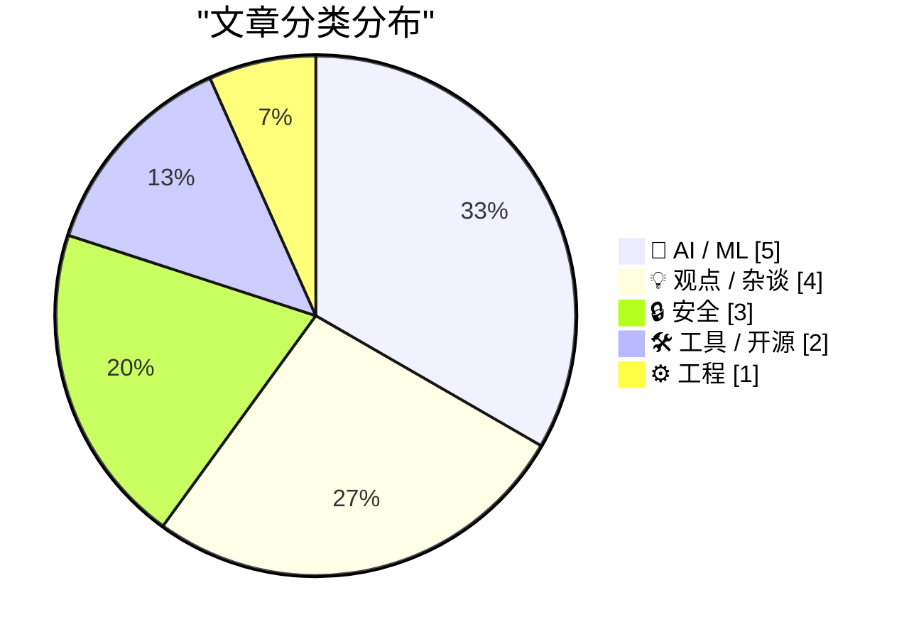
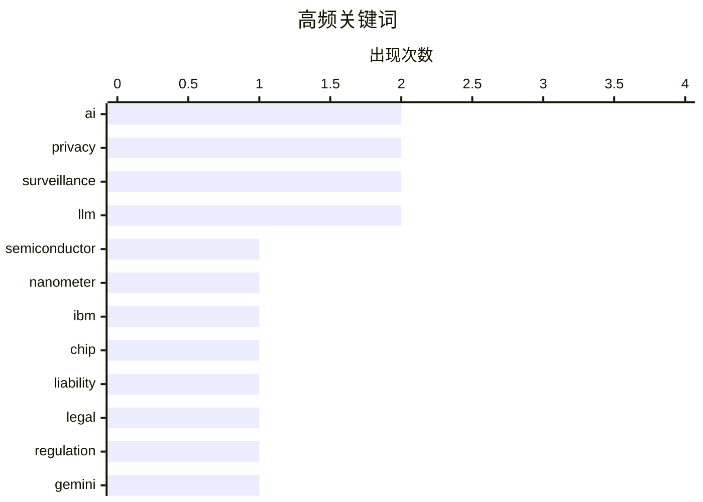

# 📰 AI 资讯每日精选 — 2026-06-26

> 汇聚 140+ 技术博客、X/Twitter、Hacker News、Reddit、Product Hunt、
> Lobste.rs、ClawFeed 日报及 GitHub Trending，经 AI 评分筛选。
>
> **本期内容**：🏆 今日必读 · 🌐 ClawFeed 日报 · 🔥 GitHub Trending · 📂 分类精选 · 🎨 设计与生成式 AI · 📊 数据概览

## 📝 今日看点

今日技术圈聚焦两大趋势：一是AI自主能力与法律责任的边界加速碰撞，谷歌因AI概览错误信息被判担责，同时其Gemini模型已能直接操控电脑屏幕，标志着AI从“建议者”向“执行者”的跃迁；二是隐私与监控的攻防战持续升级，从LastPass再曝数据泄露到全球各国竞相扩大监控规模，互联网正滑向“请出示证件”的严控时代。此外，硬件层面IBM突破亚1纳米芯片极限，为算力底座注入新动能，而AI在考古领域成功解读碳化古卷，则展现了技术跨越时空的独特价值。

---

## 🏆 今日必读

🥇 **IBM 推出亚 1 纳米芯片技术**

[IBM debuts sub-1 nanometer chip technology](https://newsroom.ibm.com/2026-06-25-ibm-debuts-worlds-first-sub-1-nanometer-chip-technology) — Hacker News Best · 10 小时前 · ⚙️ 工程

> IBM 宣布研发出全球首款亚 1 纳米（sub-1nm）芯片技术，突破了传统硅基晶体管的物理极限。该技术通过在纳米片（nanosheet）结构上实现更小的晶体管间距，显著提升了芯片的能效比和计算密度。与当前最先进的 3 纳米工艺相比，新工艺有望在同等功耗下将性能提升 40% 以上。这一突破为未来十年半导体行业的发展指明了方向，但距离商业化量产仍需数年时间。IBM 认为，亚 1 纳米技术是延续摩尔定律的关键路径。

💡 **为什么值得读**: 这是半导体行业的里程碑式突破，直接关系到未来 AI 算力、数据中心和消费电子的性能天花板。

🏷️ semiconductor, nanometer, IBM, chip

🥈 **AI 与法律责任**

[AI and Liability](https://simonwillison.net/2026/Jun/25/ai-and-liability/#atom-everything) — simonwillison.net · 3 小时前 · 🤖 AI / ML

> 文章围绕德国一项具有里程碑意义的法院裁决展开：谷歌必须为其 AI 概览（AI Overviews）中产生的错误信息承担法律责任。安全专家 Bruce Schneier 评论称，AI 智能体本质上是部署它的个人或组织的“代理人”，因此其行为后果应由部署方负责。该裁决打破了“AI 只是工具”的免责惯例，将 AI 输出视为发布者的“言论”。核心结论是：企业不能通过使用 AI 来逃避对用户造成的损害责任，法律上 AI 没有独立人格，责任必须落在人类实体身上。

💡 **为什么值得读**: 这是全球首例明确 AI 输出责任归属的司法判例，对任何使用生成式 AI 产品的公司都具有直接的法律和合规参考价值。

🏷️ AI, liability, legal, regulation

🥉 **谷歌将电脑控制能力直接集成到 Gemini 3.5 Flash 中，让模型能看并操作你的屏幕**

[Google bakes computer control directly into Gemini 3.5 Flash, letting the model see and operate your screen](https://the-decoder.com/google-bakes-computer-control-directly-into-gemini-3-5-flash-letting-the-model-see-and-operate-your-screen/) — The Decoder · 16 小时前 · 🤖 AI / ML

> 谷歌在 Gemini 3.5 Flash 模型中原生集成了“电脑使用”（Computer Use）功能，使模型能够自主操作电脑、浏览器和移动设备。在 OSWorld 基准测试中，该模型得分 78.4，性能与 GPT-5.5 持平。开发者可通过 Gemini API 直接构建用于软件测试或办公自动化的智能体。这意味着 AI 从“对话”进化到了“动手操作”，直接挑战了传统 RPA（机器人流程自动化）和 UI 测试工具的市场。

💡 **为什么值得读**: 这是 AI 从“聊天”到“操作电脑”的关键能力跃迁，直接定义了下一代 AI 智能体的交互范式，对开发者、自动化工程师和产品经理极具启发性。

🏷️ Gemini, computer use, agent, OSWorld

4️⃣ **互联网的“请出示证件”时代将摧毁你的隐私**

[The 'papers, please' era of the internet will decimate your privacy](https://expression.fire.org/p/the-papers-please-era-of-the-internet) — Hacker News Best · 3 小时前 · 💡 观点 / 杂谈

> 文章警告，全球正进入一个“请出示证件”（papers, please）的互联网时代，各国政府通过强制身份验证（如 KYC、年龄验证、数字身份证）来监控公民。这种趋势以“保护儿童安全”或“打击欺诈”为名，实际上建立了全面的监控基础设施。作者指出，一旦身份验证成为上网的默认门槛，匿名性将彻底消失，言论自由和隐私权将受到系统性侵蚀。核心观点是：这种看似合理的监管最终会演变成对所有人的无差别监控。

💡 **为什么值得读**: 它揭示了当前全球立法（如美国 KOSA、欧盟 eIDAS）背后被忽视的隐私代价，是理解“安全 vs 隐私”辩论的必读文章。

🏷️ privacy, identity verification, internet, surveillance

5️⃣ **赫库兰尼姆古卷首次被完整阅读**

[An entire Herculaneum scroll has been read for the first time](https://scrollprize.org/firstscroll) — Hacker News Best · 9 小时前 · 🤖 AI / ML

> Scroll Prize 项目宣布，利用 AI 和 X 射线断层扫描技术，首次完整读取了公元 79 年维苏威火山爆发中碳化的赫库兰尼姆古卷。研究团队通过训练机器学习模型识别卷轴上的碳基墨水痕迹，成功复原了整卷文本。该古卷内容为伊壁鸠鲁学派哲学家菲洛德穆斯的哲学著作。这一突破证明了 AI 在考古学中的巨大潜力，为解读数千卷尚未打开的赫库兰尼姆图书馆提供了可行方案。

💡 **为什么值得读**: 这是 AI 与考古学结合的巅峰成就，解决了困扰学界数百年的“无法打开碳化古卷”难题，展示了技术如何解锁人类失落的文明记忆。

🏷️ Herculaneum scroll, AI, computer vision, digital restoration

---

## 🌐 ClawFeed 日报精选

> 来源：[ClawFeed](https://clawfeed.kevinhe.io) — AI 驱动的多源新闻聚合

# ClawFeed Daily Digest | 2026-06-25 (SGT)

Aggregated from 5x 4h digests: #721, #722, #723, #724, #725

---

## 🔥 当日 Top 5

1. **a16z 领投 Mirendil $200M 种子轮 — AI 研究自动化的资本下注正式开始** — KP 跟投 + NVIDIA。目标：训练"擅长 AI R&D"的前沿模型，让任何人都能做 AI 研究。打破 AI 前沿被少数大实验室垄断的格局。
   来源: https://x.com/a16z/status/2069869327411749012

2. **Claude 从工具变为组织级 coworker — Levie 深度解读 Claude Tag** — Aaron Levie 指出重点不是 1:1 对话，而是 Claude 以团队成员身份嵌入共享协作流。Karpathy 补充："显著更 inline 的 AI 交互范式。"底层工程（工具集成、记忆、计算环境）才是壁垒。
   来源: https://x.com/levie/status/2069975251476422664

3. **stdrc 犀利评价 Claude Tag：Slack 是为人类设计的** — Raft 创始人指出 Slack 上不可能每人跑 10 个 agent，Claude Tag 只是"住在 Slack 里的一个 agent"。Raft 反向设计——多 agent、命名角色、共享频道。对 agent 基础设施设计的深层思考。
   来源: https://x.com/istdrc/status/2070054613588553946

4. **bitfish 的 HBM 带宽穿越周期论** — 10 年前用 BTC 买 AMD Fury（第一代 HBM）挖 ETH，ETH PoW 吃内存带宽。现在 AI 瓶颈也在内存带宽，HBM 成命门。"这条逻辑我 10 年前就跑通了"——crypto mining 到 AI infra 的公共瓶颈。
   来源: https://x.com/bitfish/status/2070053312603562018

5. **AI 定价出现"杠铃效应"** — Levie 分析：高成本前沿模型 vs 便宜够用的开源/闭源模型两极分化。引 Palo Alto Networks CEO：LLM 厂商陷入免费端烧钱与 post-training data 依赖双重困境。
   来源: https://x.com/levie/status/2069639600310767616

---

## 📰 当日核心主题

- **Claude Tag / Agent 组织化**：全天最大主题。Levie 三条深度解读（定价杠铃 + Claude coworker + Box 集成），stdrc 反向批判（Slack 不适合多 agent），Karpathy 背书"inline 范式"。从个人工具→组织基础设施的范式转移正在发生。
- **AI 研究自动化资本化**：Mirendil $200M 种子轮标志 AI-for-AI-research 赛道进入大额融资阶段。
- **内存带宽 = 穿越周期瓶颈**：bitfish 从 ETH mining 到 AI infra 的 HBM 带宽统一论，投资常识框架（"合同可违约、债务可协商、公司可破产"）。
- **AI 产品质量门槛**：郭宇提出 vibe coding 时代 AI 产品做不到 99 分不如不做，旅行时无法深度思考的 builder 节奏管理。
- **开源模型追赶前沿**：Vercel GLM 5.2 Fast 上线（2x token 吞吐）、Cline 实测 GLM vs Opus（成本低但 token 量翻倍）、MiMo-V2.5 推理优化。

---

## 🔖 Bookmarks 精选

- **Chormex + GPT-Realtime-2 实时 AI 翻译** — 浏览器内实时翻译 YouTube/直播/会议音频。Greg Brockman 转发背书。（多日重复出现，原发布 5/9，Kevin 收藏未清）
  来源: https://x.com/arrakis_ai/status/2053055460060618805

---

## 👀 推荐关注汇总

- **@karpathy (Andrej Karpathy)** — 前 Tesla AI 主管，Levie 引用帖中出现。高质量 AI 洞察。（需确认是否已关注）

---

## 🧹 建议取关

- **@openfangg (OpenFang)** — Agent OS 项目，4 个月无新推文，连续四期标注。符合"3-6 个月不活跃"标准。
- **@caterpillarous (#endif)** — 最新推文 May 19，内容以个人感悟为主，tech 信号极弱。连续三期标注。
- **@0xJasonBateman** — 仅 8 followers，几乎无原创内容。与 AI/crypto/tech 无直接关联。
- **@HeXiaobo** — 最后推文 2018 年 7 月，超 7 年未活跃。除非有私交白名单原因。

---

## 💤 当日噪音模式

- **@DujunX 博士感言重复**：在 #721/#722 两期重现 feed，同一条推文反复浮现
- **@rwayne 生活碎片**：凌晨"身为男朋友你会怎么做"、"很好奇这么忙的人月薪有五六万吗"、"这得赔多少啊"——三期连续标注噪音，接近取关线
- **@elonmusk 文化向内容**：LKY 空调金句 + 数据中心水耗数据，有趣但非信号
- **旧 Bookmark 反复浮现**：Chormex (5/9) 在多期 bookmark 中重复出现
- **凌晨/早间低信号**：00:00-12:00 SGT 时段 feed 极低（3 条/期），有效内容集中在 12:00-20:00 SGT
- **Chrome 149 + Playwright CDP 兼容性问题**：#724 有 8/18 profiles crashed，#725 切换 puppeteer-core 完成

---

*Generated from 4h digests #721, #722, #723, #724, #725*
---

## 🔥 GitHub Trending

> 今日热门开源项目（全语言 + Python）

| # | 项目 | 描述 | ⭐ 总星 | 📈 今日 | 语言 |
|---|------|------|---------|---------|------|
| 1 | [calesthio/OpenMontage](https://github.com/calesthio/OpenMontage) 🤖 | World's first open-source, agentic video production syste... | 22.1k | +3434 | Python |
| 2 | [Panniantong/Agent-Reach](https://github.com/Panniantong/Agent-Reach) 🤖 | Give your AI agent eyes to see the entire internet. Read ... | 41.2k | +1547 | Python |
| 3 | [google-labs-code/design.md](https://github.com/google-labs-code/design.md) | A format specification for describing a visual identity t... | 19.3k | +1475 | TypeScript |
| 4 | [apple/container](https://github.com/apple/container) | A tool for creating and running Linux containers using li... | 43.2k | +1351 | Swift |
| 5 | [ZhuLinsen/daily_stock_analysis](https://github.com/ZhuLinsen/daily_stock_analysis) 🤖 | LLM 驱动的多市场股票智能分析系统：多源行情、实时新闻、决策看板与自动推送，支持零成本定时运行。 LLM-pow... | 49.5k | +1209 | Python |
| 6 | [JCodesMore/ai-website-cloner-template](https://github.com/JCodesMore/ai-website-cloner-template) 🤖 | Clone any website with one command using AI coding agents | 20.5k | +1024 | TypeScript |
| 7 | [garrytan/gstack](https://github.com/garrytan/gstack) 🤖 | Use Garry Tan's exact Claude Code setup: 23 opinionated t... | 115.8k | +767 | TypeScript |
| 8 | [interviewstreet/hiring-agent](https://github.com/interviewstreet/hiring-agent) 🤖 | AI agent to evaluate and score resumes. | 2.8k | +683 | Python |
| 9 | [opendatalab/MinerU](https://github.com/opendatalab/MinerU) 🤖 | Transforms complex documents like PDFs and Office docs in... | 69.6k | +644 | Python |
| 10 | [mukul975/Anthropic-Cybersecurity-Skills](https://github.com/mukul975/Anthropic-Cybersecurity-Skills) 🤖 | 817 structured cybersecurity skills for AI agents · Mappe... | 21.3k | +571 | Python |
| 11 | [NanmiCoder/MediaCrawler](https://github.com/NanmiCoder/MediaCrawler) | 小红书笔记 | 评论爬虫、抖音视频 | 评论爬虫、快手视频 | 评论爬虫、B 站视频 ｜ 评论爬虫、微博帖子 ｜ ... | 52.8k | +398 | Python |
| 12 | [NVIDIA/SkillSpector](https://github.com/NVIDIA/SkillSpector) 🤖 | Security scanner for AI agent skills. Detect vulnerabilit... | 10.7k | +352 | Python |
| 13 | [xbtlin/ai-berkshire](https://github.com/xbtlin/ai-berkshire) 🤖 | AI 时代的伯克希尔：基于 Claude Code 的价值投资研究框架。巴菲特·芒格·段永平·李录四大师方法论 +... | 1.9k | +309 | Python |
| 14 | [shanraisshan/claude-code-best-practice](https://github.com/shanraisshan/claude-code-best-practice) 🤖 | from vibe coding to agentic engineering - practice makes ... | 60.6k | +287 | HTML |
| 15 | [bytedance/deer-flow](https://github.com/bytedance/deer-flow) | An open-source long-horizon SuperAgent harness that resea... | 74.7k | +282 | Python |

---

## 🤖 AI / ML

### 1. AI 与法律责任

[AI and Liability](https://simonwillison.net/2026/Jun/25/ai-and-liability/#atom-everything) — **simonwillison.net** · 3 小时前 · ⭐ 26/30

> 文章围绕德国一项具有里程碑意义的法院裁决展开：谷歌必须为其 AI 概览（AI Overviews）中产生的错误信息承担法律责任。安全专家 Bruce Schneier 评论称，AI 智能体本质上是部署它的个人或组织的“代理人”，因此其行为后果应由部署方负责。该裁决打破了“AI 只是工具”的免责惯例，将 AI 输出视为发布者的“言论”。核心结论是：企业不能通过使用 AI 来逃避对用户造成的损害责任，法律上 AI 没有独立人格，责任必须落在人类实体身上。

🏷️ AI, liability, legal, regulation

---

### 2. 谷歌将电脑控制能力直接集成到 Gemini 3.5 Flash 中，让模型能看并操作你的屏幕

[Google bakes computer control directly into Gemini 3.5 Flash, letting the model see and operate your screen](https://the-decoder.com/google-bakes-computer-control-directly-into-gemini-3-5-flash-letting-the-model-see-and-operate-your-screen/) — **The Decoder** · 16 小时前 · ⭐ 26/30

> 谷歌在 Gemini 3.5 Flash 模型中原生集成了“电脑使用”（Computer Use）功能，使模型能够自主操作电脑、浏览器和移动设备。在 OSWorld 基准测试中，该模型得分 78.4，性能与 GPT-5.5 持平。开发者可通过 Gemini API 直接构建用于软件测试或办公自动化的智能体。这意味着 AI 从“对话”进化到了“动手操作”，直接挑战了传统 RPA（机器人流程自动化）和 UI 测试工具的市场。

🏷️ Gemini, computer use, agent, OSWorld

---

### 3. 赫库兰尼姆古卷首次被完整阅读

[An entire Herculaneum scroll has been read for the first time](https://scrollprize.org/firstscroll) — **Hacker News Best** · 9 小时前 · ⭐ 26/30

> Scroll Prize 项目宣布，利用 AI 和 X 射线断层扫描技术，首次完整读取了公元 79 年维苏威火山爆发中碳化的赫库兰尼姆古卷。研究团队通过训练机器学习模型识别卷轴上的碳基墨水痕迹，成功复原了整卷文本。该古卷内容为伊壁鸠鲁学派哲学家菲洛德穆斯的哲学著作。这一突破证明了 AI 在考古学中的巨大潜力，为解读数千卷尚未打开的赫库兰尼姆图书馆提供了可行方案。

🏷️ Herculaneum scroll, AI, computer vision, digital restoration

---

### 4. Meta员工警告：AI内容审核部署速度过快

[Meta employees warn AI moderation rollout is too fast](https://the-decoder.com/meta-employees-warn-ai-moderation-rollout-is-too-fast/) — **The Decoder** · 15 小时前 · ⭐ 24/30

> Meta计划到2025年用大语言模型取代约一半的人工审核请求，并计划在年底前将特定类型内容的AI审核比例提升至90%以上。然而，Meta内部员工对此表示担忧，认为AI审核的部署速度过快，可能无法有效处理复杂或细微的违规内容，导致误判或漏判。文章揭示了公司在追求效率与确保内容安全之间的内部矛盾。

🏷️ Meta, AI moderation, LLM, content moderation

---

### 5. 使用NVIDIA TensorRT多设备推理支持，跨多GPU扩展AI推理

[Scaling AI Inference Across Multiple GPUs Using NVIDIA TensorRT with Multi-Device Inference Support](https://developer.nvidia.com/blog/scaling-ai-inference-across-multiple-gpus-using-nvidia-tensorrt-with-multi-device-inference-support/) — **NVIDIA Technical Blog** · 8 小时前 · ⭐ 24/30

> 生成式AI工作负载正迅速超出单GPU的内存和计算预算。NVIDIA TensorRT推出的多设备推理支持，允许开发者将大型模型（如媒体生成管线）的推理任务分布到多个GPU上。该技术通过优化模型分区和通信开销，实现了近乎线性的性能扩展。文章提供了具体的技术方案和配置指南，帮助开发者突破单卡瓶颈，提升推理吞吐量。

🏷️ TensorRT, multi-GPU, inference, scaling

---

## 💡 观点 / 杂谈

### 6. 互联网的“请出示证件”时代将摧毁你的隐私

[The 'papers, please' era of the internet will decimate your privacy](https://expression.fire.org/p/the-papers-please-era-of-the-internet) — **Hacker News Best** · 3 小时前 · ⭐ 26/30

> 文章警告，全球正进入一个“请出示证件”（papers, please）的互联网时代，各国政府通过强制身份验证（如 KYC、年龄验证、数字身份证）来监控公民。这种趋势以“保护儿童安全”或“打击欺诈”为名，实际上建立了全面的监控基础设施。作者指出，一旦身份验证成为上网的默认门槛，匿名性将彻底消失，言论自由和隐私权将受到系统性侵蚀。核心观点是：这种看似合理的监管最终会演变成对所有人的无差别监控。

🏷️ privacy, identity verification, internet, surveillance

---

### 7. 多数主流AI聊天机器人在政治问题上仍偏左，甚至“反觉醒”模型也不例外

[Most major AI chatbots still lean left on political questions, even "anti-woke" models are no exception](https://the-decoder.com/most-major-ai-chatbots-still-lean-left-on-political-questions-even-anti-woke-models-are-no-exception/) — **The Decoder** · 9 小时前 · ⭐ 24/30

> 《华盛顿邮报》的一项调查显示，主流AI聊天机器人在政治问题上普遍存在左倾偏见。OpenAI的GPT-5.5在80%的情况下给出完全左倾的论点；即使是以“反觉醒”为卖点的马斯克旗下Grok，也更多时候表现出左倾立场。唯一的例外是谷歌的Gemini 3.1 Pro，它在93%的情况下会呈现正反双方观点。该研究揭示了当前AI模型在政治中立性上的显著差异，并质疑“反觉醒”模型是否真正实现了其宣称的立场平衡。

🏷️ AI bias, politics, chatbots, ethics

---

### 8. 软件工程劳动力的重新定价

[Repricing of Software Engineering Labor](https://www.reddit.com/r/programming/comments/1ufm7co/repricing_of_software_engineering_labor/) — **r/programming** · 4 小时前 · ⭐ 24/30

> 文章作者回顾了自2010年代末以来的职业生涯，观察到软件工程行业正在经历劳动力价值的重新定价。过去十年中，通用型软件工程师（Generalist SWEs）因行业高速增长而获得高溢价，但当前市场环境变化，这种“廉价资金”驱动的红利正在消退。作者认为，随着AI工具和自动化的发展，市场对工程师的要求正从“能写代码”转向“能解决特定复杂问题”，导致通用型人才的价值被重新评估。

🏷️ software engineering, labor market, career, industry trends

---

### 9. 越狱不是盗窃

[Pluralistic: Jailbreaking isn't theft (25 Jun 2026)](https://pluralistic.net/2026/06/25/thieve-different/) — **pluralistic.net** · 16 小时前 · ⭐ 23/30

> 文章核心观点是：用户对设备进行越狱（Jailbreaking）不应被视为盗窃或非法行为。作者指出，当大型科技公司利用技术限制用户自由（如锁定设备、禁止侧载）时，这并非进步；而当用户反过来突破这些限制时，也不应被定义为盗版。文章批判了将“越狱”等同于“盗窃”的叙事，认为这是对消费者权利的侵犯，并呼吁保护用户对自有硬件的控制权。

🏷️ jailbreaking, copyright, DRM, piracy

---

## 🔒 安全

### 10. LastPass 再次通知用户发生数据泄露

[LastPass notifies users of yet another data breach](https://9to5mac.com/2026/06/23/lastpass-notifies-users-of-yet-another-data-breach/) — **Hacker News Best** · 15 小时前 · ⭐ 26/30

> 密码管理器 LastPass 再次向用户通报了一起新的数据泄露事件，这是该公司近年来发生的多起安全事件中的最新一起。此次泄露涉及用户的部分元数据，但官方声称主密码和保险库数据仍受加密保护。然而，频繁的泄露事件严重动摇了用户对云托管密码管理器的信任。安全专家建议用户考虑迁移至本地存储或开源密码管理器，并立即更换所有存储在 LastPass 中的密码。

🏷️ LastPass, data breach, password manager, security

---

### 11. 面向所有人的 OAuth

[OAuth for all](https://blog.cloudflare.com/oauth-for-all/) — **Hacker News Best** · 23 小时前 · ⭐ 26/30

> Cloudflare 宣布推出“OAuth for All”服务，旨在简化并民主化 OAuth 2.0 授权流程。该服务允许任何网站或应用通过 Cloudflare 的全球网络，快速集成安全的第三方登录功能，无需自行搭建复杂的认证服务器。它内置了防钓鱼和令牌保护机制，并兼容 Google、GitHub、Apple 等主流身份提供商。核心目标是降低中小型开发者实现安全认证的门槛，减少因自建认证系统导致的安全漏洞。

🏷️ OAuth, Cloudflare, authentication, API security

---

### 12. 各国正在竞相看谁的大规模监控做得最好

[Countries are competing to see which can carry out mass surveillance the best](https://mullvad.net/en/why-privacy-matters/state-mass-surveillance) — **Hacker News Best** · 12 小时前 · ⭐ 25/30

> 文章指出，全球各国政府正在展开一场“大规模监控竞赛”，通过立法和技术手段（如生物识别、通信拦截、数据留存）不断扩大监控范围。作者以 Mullvad VPN 的视角，列举了美国、中国、英国、印度等国在监控能力上的“军备竞赛”。核心观点是：这种竞争并非为了国家安全，而是为了巩固政治权力和控制信息流。最终结论是，公民的隐私正在成为这场竞赛的牺牲品，而 VPN 和加密工具只是暂时的防御手段。

🏷️ surveillance, privacy, mass surveillance, government

---

## 🛠 工具 / 开源

### 13. Show HN：我通过索引 18 年的评论，为 Hacker News 制作了 Google Trends

[Show HN: I made Google Trends for Hacker News by indexing 18 years of comments](https://hackernewstrends.com) — **Hacker News Best** · 11 小时前 · ⭐ 25/30

> 一位开发者创建了 HackerNewsTrends.com，通过索引 Hacker News 过去 18 年的所有评论，实现了类似 Google Trends 的热度趋势分析功能。用户可以搜索任意关键词（如“Rust”、“AI”），查看其在 HN 讨论中的热度随时间变化的曲线。该工具还支持对比多个关键词的热度走势，并识别出引爆讨论的关键帖子。这是对 HN 社区知识图谱的一次深度挖掘，为技术趋势观察提供了数据驱动的视角。

🏷️ Hacker News, trends, data visualization, index

---

### 14. 一条命令在 HF Jobs 上运行 vLLM 服务器

[Run a vLLM Server on HF Jobs in One Command](https://huggingface.co/blog/vllm-jobs) — **Hugging Face Blog** · 1 小时前 · ⭐ 24/30

> Hugging Face 发布了一项新功能，允许用户通过一条命令在 HF Jobs（其云 GPU 计算平台）上直接部署和运行 vLLM 推理服务器。vLLM 是目前最流行的高性能 LLM 推理引擎之一，支持 PagedAttention 和连续批处理。该集成免去了用户手动配置 GPU 环境、安装依赖和启动服务的繁琐步骤。开发者只需指定模型名称和 GPU 类型，即可获得一个生产级别的 API 端点。这大幅降低了部署大模型推理服务的门槛。

🏷️ vLLM, Hugging Face, deployment, LLM

---

## ⚙️ 工程

### 15. IBM 推出亚 1 纳米芯片技术

[IBM debuts sub-1 nanometer chip technology](https://newsroom.ibm.com/2026-06-25-ibm-debuts-worlds-first-sub-1-nanometer-chip-technology) — **Hacker News Best** · 10 小时前 · ⭐ 27/30

> IBM 宣布研发出全球首款亚 1 纳米（sub-1nm）芯片技术，突破了传统硅基晶体管的物理极限。该技术通过在纳米片（nanosheet）结构上实现更小的晶体管间距，显著提升了芯片的能效比和计算密度。与当前最先进的 3 纳米工艺相比，新工艺有望在同等功耗下将性能提升 40% 以上。这一突破为未来十年半导体行业的发展指明了方向，但距离商业化量产仍需数年时间。IBM 认为，亚 1 纳米技术是延续摩尔定律的关键路径。

🏷️ semiconductor, nanometer, IBM, chip

---

## 📊 数据概览

| 扫描源 | 抓取文章 | 时间范围 | 精选 |
|:---:|:---:|:---:|:---:|
| 92/140 | 3778 篇 → 65 篇 | 24h | **15 篇** |

### 分类分布



### 高频关键词



<details>
<summary>📈 纯文本关键词图（终端友好）</summary>

```
ai            │ ████████████████████ 2
privacy       │ ████████████████████ 2
surveillance  │ ████████████████████ 2
llm           │ ████████████████████ 2
semiconductor │ ██████████░░░░░░░░░░ 1
nanometer     │ ██████████░░░░░░░░░░ 1
ibm           │ ██████████░░░░░░░░░░ 1
chip          │ ██████████░░░░░░░░░░ 1
liability     │ ██████████░░░░░░░░░░ 1
legal         │ ██████████░░░░░░░░░░ 1
```

</details>

### 🏷️ 话题标签

**ai**(2) · **privacy**(2) · **surveillance**(2) · llm(2) · semiconductor(1) · nanometer(1) · ibm(1) · chip(1) · liability(1) · legal(1) · regulation(1) · gemini(1) · computer use(1) · agent(1) · osworld(1) · identity verification(1) · internet(1) · herculaneum scroll(1) · computer vision(1) · digital restoration(1)

---

*生成于 2026-06-26 01:42 | 汇聚 140 个技术博客、X/Twitter、Hacker News、Reddit、Product Hunt、Lobste.rs、ClawFeed 日报及 GitHub Trending，经 AI 评分筛选出 Top 15 精华内容*
