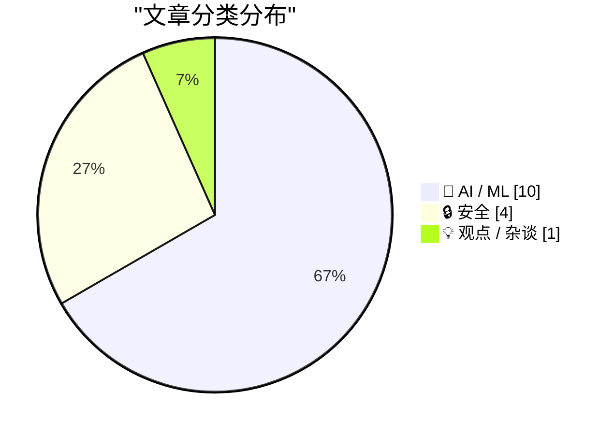
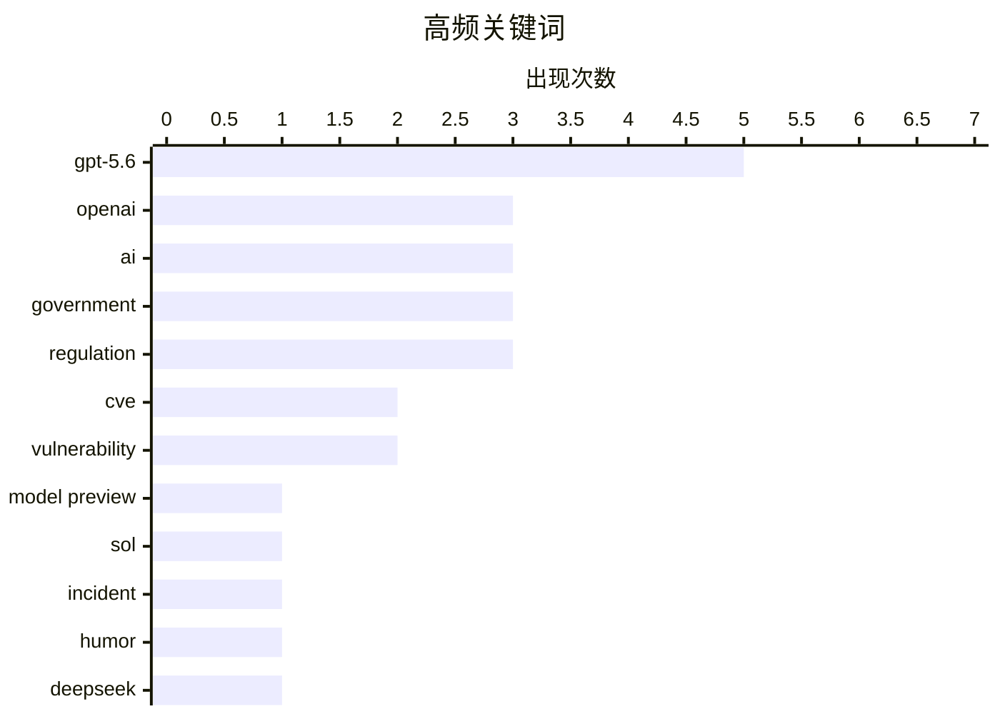

# 📰 AI 资讯每日精选 — 2026-06-27

> 汇聚 140+ 技术博客、X/Twitter、Hacker News、Reddit、Product Hunt、
> Lobste.rs、ClawFeed 日报及 GitHub Trending，经 AI 评分筛选。
>
> **本期内容**：🏆 今日必读 · 🌐 ClawFeed 日报 · 🔥 GitHub Trending · 📂 分类精选 · 🎨 设计与生成式 AI · 📊 数据概览

## 📝 今日看点

今日技术圈聚焦两大趋势：一是AI模型竞争进入白热化阶段，OpenAI发布GPT-5.6系列（含旗舰Sol、平衡模型Terra及廉价Luna），同时面临美国政府“逐客户”审批的严格管控，而Anthropic则因成本压力被客户弃用Claude转向Deepseek，凸显出性能、成本与监管之间的多重博弈；二是AI对就业结构的冲击引发广泛讨论，Anthropic直言不再需要初级工程师，并警告其他行业效仿将带来经济震荡。此外，安全领域曝出CVE-2026-LGTM漏洞事件，开源社区则联合发声捍卫其基石地位，技术生态的脆弱性与韧性同时受到考验。

---

## 🏆 今日必读

🥇 **引用OpenAI**

[Quoting OpenAI](https://simonwillison.net/2026/Jun/26/openai/#atom-everything) — simonwillison.net · 8 小时前 · 🤖 AI / ML

> OpenAI开始对GPT-5.6系列进行有限预览，包括旗舰模型Sol、日常工作的平衡模型Terra以及快速廉价的Luna。Terra在性能上与GPT-5.5相当，但成本降低2倍，Luna则以最低成本提供强大能力。OpenAI计划在未来几周内全面开放这些模型，并强调其致力于广泛访问的理念。

💡 **为什么值得读**: 直接获取OpenAI官方对GPT-5.6系列三款新模型的定位、性能对比和定价策略的第一手信息。

🏷️ GPT-5.6, OpenAI, model preview, Sol

🥈 **事件报告：CVE-2026-LGTM**

[Incident Report: CVE-2026-LGTM](https://nesbitt.io/2026/06/26/incident-report-cve-2026-lgtm.html) — Lobste.rs · 9 小时前 · 🔒 安全

> 这是一篇关于编号为CVE-2026-LGTM的安全漏洞的事件报告。文章详细描述了该漏洞的发现过程、影响范围以及修复措施。报告旨在透明地公开此次安全事件，帮助社区了解并防范类似风险。

💡 **为什么值得读**: 对于关注安全漏洞和事件响应流程的技术人员，这是一份真实且详细的案例复盘。

🏷️ CVE, incident, vulnerability, humor

🥉 **AI初创公司Lindy完全弃用Claude转向Deepseek，在成本压力下为Anthropic节省了数百万美元**

[AI startup Lindy ditched Claude entirely for Deepseek, saving millions as cost pressure mounts on Anthropic](https://the-decoder.com/ai-startup-lindy-ditched-claude-entirely-for-deepseek-saving-millions-as-cost-pressure-mounts-on-anthropic/) — The Decoder · 10 小时前 · 🤖 AI / ML

> AI初创公司Lindy因AI成本超过人力成本，决定完全放弃Anthropic的Claude模型，全面转向Deepseek。CEO Flo Crivello称此举是“关乎企业生存的问题”。这一迁移为Lindy节省了数百万美元，也反映出AI模型成本对初创公司的巨大压力。

💡 **为什么值得读**: 通过真实商业案例，揭示了AI模型选型中成本因素的决定性作用，以及Deepseek在价格上的竞争力。

🏷️ Deepseek, Claude, cost, startup

4️⃣ **Anthropic表示，由于AI的进步，不再需要初级工程师，并警告其他行业效仿后将引发经济冲击**

[Anthropic doesn't need junior engineers anymore thanks to AI and warns of an economic shock when other industries follow](https://the-decoder.com/anthropic-doesnt-need-junior-engineers-anymore-thanks-to-ai-and-warns-of-an-economic-shock-when-other-industries-follow/) — The Decoder · 14 小时前 · 🤖 AI / ML

> Anthropic公司指出，得益于AI技术的进步，他们不再需要招聘初级工程师。公司认为“直觉的回报”正在被AI替代，并警告当其他行业也效仿这一做法时，可能会引发严重的经济冲击。这反映了AI对就业市场结构的深远影响。

💡 **为什么值得读**: 来自AI行业头部公司的高层观点，直接点明了AI对初级岗位的替代效应及其潜在的社会经济后果。

🏷️ Anthropic, junior engineers, AI, economic shock

5️⃣ **预览GPT-5.6 Sol：下一代模型**

[Previewing GPT‑5.6 Sol: a next-generation model](https://openai.com/index/previewing-gpt-5-6-sol/) — Hacker News Best · 8 小时前 · 🤖 AI / ML

> OpenAI发布了其下一代旗舰模型GPT-5.6 Sol的预览，并同步发布了系统卡。该模型在多个基准测试中表现出色，引发了Hacker News社区的热烈讨论，获得了795个点赞和490条评论。

💡 **为什么值得读**: 直接获取OpenAI最新旗舰模型的技术细节和社区反响，是了解AI前沿动态的核心入口。

🏷️ GPT-5.6, preview, system card, safety

---

## 🌐 ClawFeed 日报精选

> 来源：[ClawFeed](https://clawfeed.kevinhe.io) — AI 驱动的多源新闻聚合

# ClawFeed Daily Digest | 2026-06-26 (Thu)

Based on 5x 4h digests (#728, #729, #731, #732, #733) covering 00:00-19:59 SGT.

---

## 🔥 当日全场最重要 5 条

**1. GPT-5.6 遭美国政府"逐客户审批"**
Trump 政府要求 OpenAI 分批发布 GPT-5.6，按客户逐一获政府批准才能使用。Levie 评论：这是事实上的 AI 监管（de facto regulation），从此算力/能力达到一定阈值的模型都可能需要政府审查。Levie 后续加入博弈论框架：AI regulation is prisoner's dilemma at insane scale——只要一方不减速（中国、开源），遵守的一方就输，没有好的均衡点。
https://x.com/levie/status/2070310706369712272
https://x.com/levie/status/2070370225271251161

**2. Anthropic《Loop Engineering》PDF——agentic 闭环系统方法论**
Anthropic 工程师放出 11 页 PDF，核心转变：不再手动提示 agent，而是构建自动提示它的系统。循环结构 Schedule → Discover → Build → Verify → Repeat。这是 agentic 系统从"prompt engineering"到"loop engineering"的范式升级信号。
https://x.com/oragnes/status/2070344348034830732

**3. Claude Tag 发布 + Raft 立刻反击——coco-workspace 赛道竞品定位明确化**
Anthropic 发布 Claude Tag：Claude 以"团队成员"身份入驻 Slack，可被 @、接任务、访问频道和工具。Levie 称关键在于"shared coworker"范式，Karpathy 认为"significantly more inline with all the other human activity"。Raft 创始人 stdrc 立刻发文反击："Slack is built for humans, you'd never run 10 agents per person. Raft is built for the opposite: many agents, named, with roles." 这是 coco-workspace 赛道的直接竞品信号。
https://x.com/levie/status/2069975251476422664
https://x.com/istdrc/status/2070054613588553946

**4. Matrix Agent OS——"一套 Agent 公司 OS，不是一个 Agent"**
底层架构把文件/工具/权限按角色拆分，而非全塞给一个巨大 Agent。引用 Derek Nee："you cannot run a company on one giant agent with every tool, every file, and no accountability." 与 COCO 的组织级 agent 架构高度相关。
https://x.com/BruceGuai/status/2070130243059495142

**5. Codex 中文社区爆发——从尝鲜到系统化教学生态**
逸尘过去几个月发了大量 Codex 教程，覆盖赚钱、自媒体、视频、记忆系统、APP 开发上架等多领域。973K views, 2.2K bookmarks。Coding agent 用户教育正在自发生长，"全栈 agent"认知门槛快速降低。对 COCO 的信号：coding agent 市场已过早期尝鲜阶段。
https://x.com/Astronaut_1216/status/2069967488104976737

---

## 📰 当日核心主题

**1. AI 监管从指南走向执法**
GPT-5.6 逐客户审批是标志性事件。Levie 的分析从"de facto regulation"升级到"prisoner's dilemma at insane scale"——博弈论视角下，全球同步减速审查才能保持均衡，但任何一方不配合就全盘崩溃。

**2. Agent 架构成熟：从单体到多角色 OS**
三个信号汇聚：Claude Tag（Slack 内嵌入单一 shared agent）、Raft（多 agent + 角色 + 共享工作区）、Matrix（Agent 公司 OS，按角色拆分权限/工具/文件）。加上 Anthropic 的 Loop Engineering 闭环系统——agent 架构正从"一个聪明的助手"演进到"组织级操作系统"。

**3. Coding Agent 用户认知成熟**
Codex 在中文社区已形成自发教学生态（逸尘系列教程 973K views），LobeHub 即将推出"委托智能"产品（delegation 是真正 Agent 下一阶段），Cline 实测 GLM-5.2 vs Opus 4.8 显示开源前沿模型在 agentic coding 追赶加速。

**4. AI 宏观经济 lose-lose 框架**
Dovey 给出思想实验：AI 成功 → 中产阶级劳动力价值归零 → 通缩 → passive 401k/pension flow reverse → big tech 估值崩；AI 失败 → 百年债全发完没退路。不论成败，传统经济结构都面临重构。

---

## 🔖 Bookmarks 精选

- **Matrix Agent OS** (@BruceGuai) — Agent 公司 OS，按角色拆分文件/工具/权限。https://x.com/BruceGuai/status/2070130243059495142
- **Chormex 实时 AI 翻译** (@arrakis_ai + @gdb) — GPT-Realtime-2 做浏览器内实时语音翻译，Greg Brockman 转推。191K views。（May 9 旧 bookmark，多期重复出现） https://x.com/arrakis_ai/status/2053055460060618805

---

## 👀 推荐关注汇总

- **@_LuoFuli** (Fuli Luo) — 小米 MiMo 核心 builder，前 DeepSeek。MiMo-V2.5 推理优化 + MiMo Code 开源（14 天 5 人 vibe-coding），67.9K followers。高质量技术输出。https://x.com/_LuoFuli

---

## 🧹 建议取关

- **@HeXiaobo** (David.He) — 最后一条推文 2018 年 7 月，近 8 年未活跃。可能是私交，Kevin 自行判断。
- **@0xJasonBateman** (Jason) — 仅 36 条推文，最后活跃 2025 年 4 月，内容与 AI/tech 无关。Follows you，可能是熟人。

---

## 💤 当日重复噪音模式

1. **Chormex bookmark 幽灵循环** — arrakis_ai 的 5 月 9 日旧 bookmark 在 5 个 4h digest 中反复出现（#728, #729, #731, #732, #733），每次都标注"旧 bookmark"。根因：bookmark 抓取未去重已出现过的条目。
2. **僵尸号取关建议重复** — @HeXiaobo 和 @0xJasonBateman 在 #728, #731 两次出现相同建议。根因：followingSample 随机采样重复命中同一批账号。
3. **Feed 跨期重复** — @turingou App Store 类比帖和 @zizhpan 招聘帖在 #731 和 #732 两期重复出现（推文仍在 feed 窗口内）。

---

*Generated from 4h digests: #728, #729, #731, #732, #733*
*Coverage: 00:00-19:59 SGT Jun 26 (20:00-23:59 not yet available)*---

## 🔥 GitHub Trending

> 今日热门开源项目（全语言 + Python）

| # | 项目 | 描述 | ⭐ 总星 | 📈 今日 | 语言 |
|---|------|------|---------|---------|------|
| 1 | [google-labs-code/design.md](https://github.com/google-labs-code/design.md) | A format specification for describing a visual identity t... | 21.3k | +2407 | TypeScript |
| 2 | [calesthio/OpenMontage](https://github.com/calesthio/OpenMontage) 🤖 | World's first open-source, agentic video production syste... | 23.6k | +1754 | Python |
| 3 | [xbtlin/ai-berkshire](https://github.com/xbtlin/ai-berkshire) 🤖 | AI 时代的伯克希尔：基于 Claude Code 的价值投资研究框架。巴菲特·芒格·段永平·李录四大师方法论 +... | 3.1k | +1274 | Python |
| 4 | [Panniantong/Agent-Reach](https://github.com/Panniantong/Agent-Reach) 🤖 | Give your AI agent eyes to see the entire internet. Read ... | 42.4k | +1194 | Python |
| 5 | [JCodesMore/ai-website-cloner-template](https://github.com/JCodesMore/ai-website-cloner-template) 🤖 | Clone any website with one command using AI coding agents | 21.4k | +1088 | TypeScript |
| 6 | [mauriceboe/TREK](https://github.com/mauriceboe/TREK) | A self-hosted travel/trip planner with real-time collabor... | 7.7k | +1060 | TypeScript |
| 7 | [opendatalab/MinerU](https://github.com/opendatalab/MinerU) 🤖 | Transforms complex documents like PDFs and Office docs in... | 70.4k | +960 | Python |
| 8 | [garrytan/gstack](https://github.com/garrytan/gstack) 🤖 | Use Garry Tan's exact Claude Code setup: 23 opinionated t... | 116.6k | +950 | TypeScript |
| 9 | [topoteretes/cognee](https://github.com/topoteretes/cognee) 🤖 | Cognee is the open-source AI memory platform for agents. ... | 23.2k | +729 | Python |
| 10 | [NanmiCoder/MediaCrawler](https://github.com/NanmiCoder/MediaCrawler) | 小红书笔记 | 评论爬虫、抖音视频 | 评论爬虫、快手视频 | 评论爬虫、B 站视频 ｜ 评论爬虫、微博帖子 ｜ ... | 53.4k | +673 | Python |
| 11 | [ZhuLinsen/daily_stock_analysis](https://github.com/ZhuLinsen/daily_stock_analysis) 🤖 | LLM 驱动的多市场股票智能分析系统：多源行情、实时新闻、决策看板与自动推送，支持零成本定时运行。 LLM-pow... | 50.1k | +637 | Python |
| 12 | [IceWhaleTech/CasaOS](https://github.com/IceWhaleTech/CasaOS) | CasaOS - A simple, easy-to-use, elegant open-source Perso... | 35.4k | +619 | Go |
| 13 | [safishamsi/graphify](https://github.com/safishamsi/graphify) 🤖 | AI coding assistant skill (Claude Code, Codex, OpenCode, ... | 72.6k | +474 | Python |
| 14 | [simplex-chat/simplex-chat](https://github.com/simplex-chat/simplex-chat) | SimpleX - the first messaging network operating without u... | 12.6k | +432 | Haskell |
| 15 | [kunchenguid/no-mistakes](https://github.com/kunchenguid/no-mistakes) | git push no-mistakes | 3.4k | +398 | Go |

---

## 🤖 AI / ML

### 1. 引用OpenAI

[Quoting OpenAI](https://simonwillison.net/2026/Jun/26/openai/#atom-everything) — **simonwillison.net** · 8 小时前 · ⭐ 28/30

> OpenAI开始对GPT-5.6系列进行有限预览，包括旗舰模型Sol、日常工作的平衡模型Terra以及快速廉价的Luna。Terra在性能上与GPT-5.5相当，但成本降低2倍，Luna则以最低成本提供强大能力。OpenAI计划在未来几周内全面开放这些模型，并强调其致力于广泛访问的理念。

🏷️ GPT-5.6, OpenAI, model preview, Sol

---

### 2. AI初创公司Lindy完全弃用Claude转向Deepseek，在成本压力下为Anthropic节省了数百万美元

[AI startup Lindy ditched Claude entirely for Deepseek, saving millions as cost pressure mounts on Anthropic](https://the-decoder.com/ai-startup-lindy-ditched-claude-entirely-for-deepseek-saving-millions-as-cost-pressure-mounts-on-anthropic/) — **The Decoder** · 10 小时前 · ⭐ 27/30

> AI初创公司Lindy因AI成本超过人力成本，决定完全放弃Anthropic的Claude模型，全面转向Deepseek。CEO Flo Crivello称此举是“关乎企业生存的问题”。这一迁移为Lindy节省了数百万美元，也反映出AI模型成本对初创公司的巨大压力。

🏷️ Deepseek, Claude, cost, startup

---

### 3. Anthropic表示，由于AI的进步，不再需要初级工程师，并警告其他行业效仿后将引发经济冲击

[Anthropic doesn't need junior engineers anymore thanks to AI and warns of an economic shock when other industries follow](https://the-decoder.com/anthropic-doesnt-need-junior-engineers-anymore-thanks-to-ai-and-warns-of-an-economic-shock-when-other-industries-follow/) — **The Decoder** · 14 小时前 · ⭐ 27/30

> Anthropic公司指出，得益于AI技术的进步，他们不再需要招聘初级工程师。公司认为“直觉的回报”正在被AI替代，并警告当其他行业也效仿这一做法时，可能会引发严重的经济冲击。这反映了AI对就业市场结构的深远影响。

🏷️ Anthropic, junior engineers, AI, economic shock

---

### 4. 预览GPT-5.6 Sol：下一代模型

[Previewing GPT‑5.6 Sol: a next-generation model](https://openai.com/index/previewing-gpt-5-6-sol/) — **Hacker News Best** · 8 小时前 · ⭐ 27/30

> OpenAI发布了其下一代旗舰模型GPT-5.6 Sol的预览，并同步发布了系统卡。该模型在多个基准测试中表现出色，引发了Hacker News社区的热烈讨论，获得了795个点赞和490条评论。

🏷️ GPT-5.6, preview, system card, safety

---

### 5. 下一个重大突破将是AI在工作中学习

[The next big breakthrough will be AIs learning on the job](https://www.dwarkesh.com/p/the-next-paradigm) — **dwarkesh.com** · 9 小时前 · ⭐ 26/30

> 文章指出，当前AI实验室正在浪费最有价值的数据——即模型在实际工作环境中产生的交互数据。作者认为，下一个重大突破将来自于让AI在真实工作场景中持续学习和适应，而非仅仅依赖静态的训练数据集。

🏷️ AI, learning, data, breakthrough

---

### 6. OpenAI的GPT-5.6 Sol在政府认为不可持续的访问规则下推出，与Claude Mythos竞争

[OpenAI's GPT-5.6 Sol launches to rival Claude Mythos under government access rules it calls unsustainable](https://the-decoder.com/openais-claude-mythos-competitor-gpt-5-6-sol-launches-under-government-controlled-access-it-calls-unsustainable/) — **The Decoder** · 7 小时前 · ⭐ 26/30

> OpenAI的新旗舰模型GPT-5.6 Sol在编程基准测试中击败了Anthropic的Claude Mythos 5，但美国政府强制要求对其进行受限发布。OpenAI对此表示不满，认为这种政府控制下的访问模式不可持续。

🏷️ GPT-5.6, OpenAI, government, regulation

---

### 7. OpenAI的GPT 5.6发布现在需要美国政府“逐客户”批准

[OpenAI's GPT 5.6 rollout now requires US government approval on a "customer by customer basis"](https://the-decoder.com/openais-gpt-5-6-rollout-now-requires-us-government-approval-on-a-customer-by-customer-basis/) — **The Decoder** · 16 小时前 · ⭐ 26/30

> 应美国政府要求，OpenAI的GPT-5.6模型初期仅向特定合作伙伴开放，且需“逐客户”审批。CEO Sam Altman表示这不是“首选的长期模式”。在Anthropic的Fable模型被强制下架后，AI实验室普遍担心事实上的AI模型许可制度正在形成。

🏷️ GPT-5.6, regulation, OpenAI, government

---

### 8. 一个AI模型在单个MirrorCode任务上连续编程19天，耗资2600美元

[An AI model programmed nonstop for 19 days on a single MirrorCode task that cost $2,600 to run](https://the-decoder.com/an-ai-model-programmed-nonstop-for-19-days-on-a-single-mirrorcode-task-that-cost-2600-to-run/) — **The Decoder** · 8 小时前 · ⭐ 25/30

> Epoch AI 推出了新的 MirrorCode 基准测试，用于评估 AI 模型在无法访问原始代码的情况下重建完整程序的能力。Claude Opus 4.7 以 56% 的解决率领先，并在 14 小时内重建了一个 16000 行的工具包。然而，所有测试的模型在最复杂的任务上仍然失败，其中一个模型甚至连续运行了 19 天，花费 2600 美元才完成单个任务。该基准测试揭示了当前 AI 在复杂代码重构与理解上的能力上限，表明大模型在极端编程任务上距离人类专家仍有显著差距。

🏷️ AI, benchmark, coding, MirrorCode

---

### 9. 美国政府将决定谁能使用GPT-5.6

[U.S. government will decide who gets to use GPT-5.6](https://www.washingtonpost.com/technology/2026/06/26/openai-says-us-government-will-vet-users-its-latest-ai-model/) — **Hacker News Best** · 7 小时前 · ⭐ 25/30

> OpenAI 宣布其最新模型 GPT-5.6 的用户准入将由美国政府直接审核和决定，标志着 AI 监管从企业自律转向政府直接干预。这一政策旨在防止模型被用于恶意目的，但也引发了关于技术垄断和言论自由的广泛争议。Hacker News 上该话题获得了 777 个点赞和 887 条评论，讨论热度极高。核心争议在于政府审查是否会限制创新，以及如何平衡安全与开放。

🏷️ GPT-5.6, regulation, government, AI safety

---

### 10. 制作了一个关于推测解码/多Token预测的交互式讲解器

[Made an interactive explainer about speculative decoding/MTP](https://www.reddit.com/r/LocalLLaMA/comments/1ug2wyj/made_an_interactive_explainer_about_speculative/) — **r/LocalLLaMA** · 15 小时前 · ⭐ 25/30

> 一位开发者制作了一个交互式讲解器，用于直观展示推测解码（Speculative Decoding）和多Token预测（MTP）的工作原理。该工具通过可视化方式解释了如何利用小型草稿模型加速大型模型的推理过程，以及多Token并行预测如何提升生成效率。对于希望理解这些加速技术但缺乏数学背景的读者，该讲解器提供了低门槛的学习路径。

🏷️ speculative decoding, MTP, interactive, explainer

---

## 🔒 安全

### 11. 事件报告：CVE-2026-LGTM

[Incident Report: CVE-2026-LGTM](https://nesbitt.io/2026/06/26/incident-report-cve-2026-lgtm.html) — **Lobste.rs** · 9 小时前 · ⭐ 28/30

> 这是一篇关于编号为CVE-2026-LGTM的安全漏洞的事件报告。文章详细描述了该漏洞的发现过程、影响范围以及修复措施。报告旨在透明地公开此次安全事件，帮助社区了解并防范类似风险。

🏷️ CVE, incident, vulnerability, humor

---

### 12. 事件CVE-2026-LGTM

[Incident CVE-2026-LGTM](https://nesbitt.io/2026/06/26/incident-report-cve-2026-lgtm.html) — **Hacker News Best** · 12 小时前 · ⭐ 26/30

> 这是一篇关于编号为CVE-2026-LGTM的安全漏洞的事件报告。文章详细描述了该漏洞的发现过程、影响范围以及修复措施。报告旨在透明地公开此次安全事件，帮助社区了解并防范类似风险。

🏷️ CVE, incident response, vulnerability, supply chain

---

### 13. 2000人试图入侵我的AI助手之后发生了什么

[What happened after 2,000 people tried to hack my AI assistant](https://simonwillison.net/2026/Jun/26/hack-my-ai-assistant/#atom-everything) — **simonwillison.net** · 7 小时前 · ⭐ 25/30

> Fernando Irarrázaval 发起了一项挑战，邀请黑客通过发送电子邮件来攻击他的 OpenClaw AI 助手测试实例，试图窃取其持有的秘密。在经历了 6000 次攻击尝试、消耗了 500 美元 Token 费用，并因入站邮件过多导致 Google 账户被暂停后，令人惊讶的是，没有一个人成功窃取到秘密。该挑战证明了当前基于邮件交互的 AI 助手在特定配置下具备较强的抗提示注入攻击能力。作者通过这一实验展示了 AI 安全防护的实战效果，并揭示了攻击成本与防御难度之间的不对称性。

🏷️ AI assistant, hacking, prompt injection, security challenge

---

### 14. 一次（国家级？）攻击失败的解剖分析

[Anatomy of a Failed (Nation-State?) Attack](https://grack.com/blog/2026/06/25/dissecting-a-failed-nation-state-attack/) — **Lobste.rs** · 10 小时前 · ⭐ 25/30

> 一篇博客详细剖析了一次疑似国家级网络攻击的完整过程，包括攻击者的初始入侵手法、横向移动路径以及最终失败的原因。作者通过日志和系统痕迹还原了攻击链，指出攻击者因目标系统的一个意外配置错误而功亏一篑。文章强调了纵深防御和“安全意外”在抵御高级持续性威胁中的关键作用，并提供了可复用的检测规则。

🏷️ attack, nation-state, security, analysis

---

## 💡 观点 / 杂谈

### 15. 我们都依赖开源。我们将共同捍卫它。

[We all depend on open source. We will defend it together](https://akrites.org/letter/) — **Hacker News Best** · 19 小时前 · ⭐ 26/30

> 这是一封公开信，强调开源软件对全球技术生态的基石作用。信中指出，面对日益增长的威胁（如监管、企业垄断等），开源社区必须团结一致，共同捍卫开源精神、代码和基础设施。

🏷️ open source, defense, community, solidarity

---

## 📊 数据概览

| 扫描源 | 抓取文章 | 时间范围 | 精选 |
|:---:|:---:|:---:|:---:|
| 91/140 | 3776 篇 → 82 篇 | 24h | **15 篇** |

### 分类分布



### 高频关键词



<details>
<summary>📈 纯文本关键词图（终端友好）</summary>

```
gpt-5.6       │ ████████████████████ 5
openai        │ ████████████░░░░░░░░ 3
ai            │ ████████████░░░░░░░░ 3
government    │ ████████████░░░░░░░░ 3
regulation    │ ████████████░░░░░░░░ 3
cve           │ ████████░░░░░░░░░░░░ 2
vulnerability │ ████████░░░░░░░░░░░░ 2
model preview │ ████░░░░░░░░░░░░░░░░ 1
sol           │ ████░░░░░░░░░░░░░░░░ 1
incident      │ ████░░░░░░░░░░░░░░░░ 1
```

</details>

### 🏷️ 话题标签

**gpt-5.6**(5) · **openai**(3) · **ai**(3) · government(3) · regulation(3) · cve(2) · vulnerability(2) · model preview(1) · sol(1) · incident(1) · humor(1) · deepseek(1) · claude(1) · cost(1) · startup(1) · anthropic(1) · junior engineers(1) · economic shock(1) · preview(1) · system card(1)

---

*生成于 2026-06-27 01:34 | 汇聚 140 个技术博客、X/Twitter、Hacker News、Reddit、Product Hunt、Lobste.rs、ClawFeed 日报及 GitHub Trending，经 AI 评分筛选出 Top 15 精华内容*
