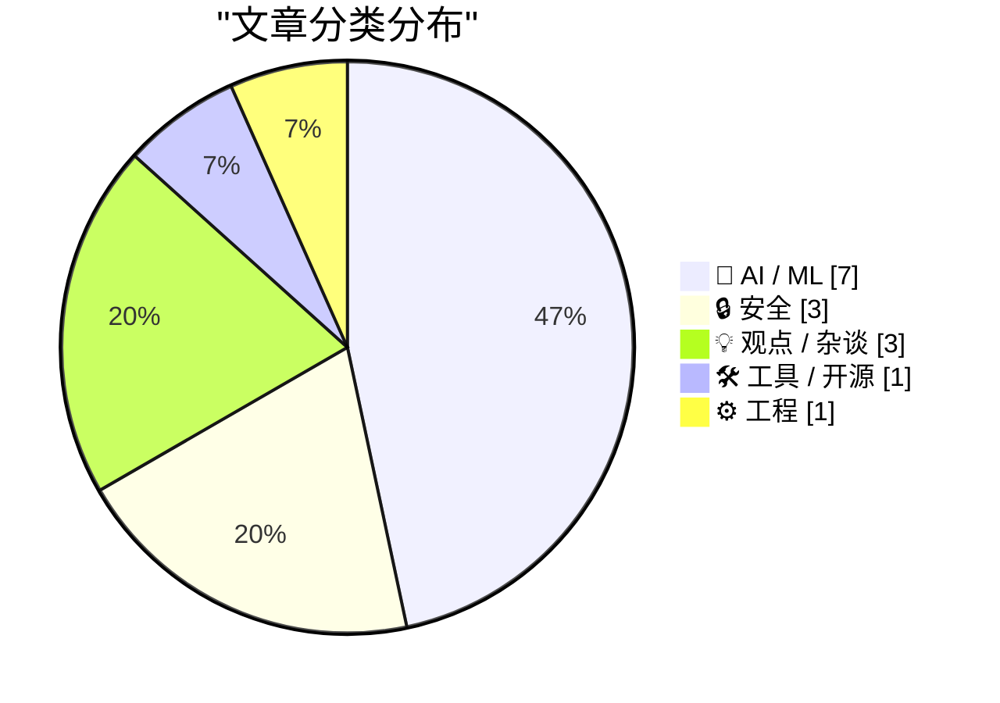
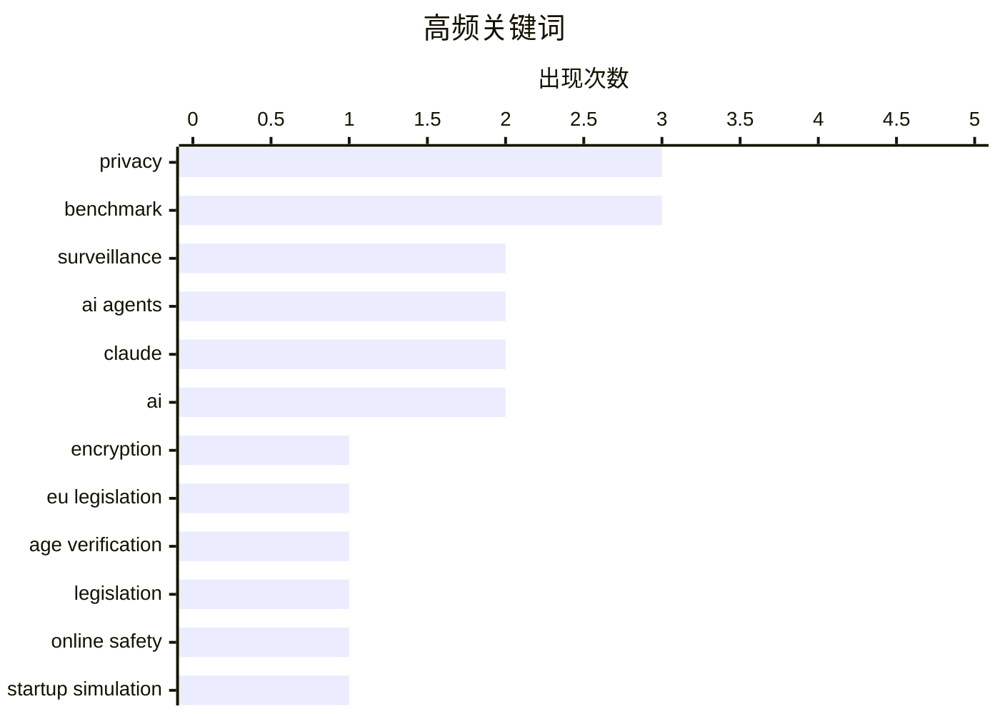

# 📰 AI 资讯每日精选 — 2026-06-29

> 汇聚 140+ 技术博客、X/Twitter、Hacker News、Reddit、Product Hunt、
> Lobste.rs、ClawFeed 日报及 GitHub Trending，经 AI 评分筛选。
>
> **本期内容**：🏆 今日必读 · 🌐 ClawFeed 日报 · 🔥 GitHub Trending · 📂 分类精选 · 🎨 设计与生成式 AI · 📊 数据概览

## 📝 今日看点

今日技术圈聚焦两大趋势：一是全球隐私与安全监管加速收紧，欧盟秘密推进“聊天控制”立法以扫描私人通信，美国《KIDS法案》则强制要求年龄验证，两者均被批评为对端到端加密和匿名性的重大威胁；二是AI应用正从“回答问题”转向“完成任务”，普林斯顿测试显示多数AI模型在模拟创业中破产，而国产模型如GLM 5.2在网络安全领域击败Claude，新浪VibeThinker-3B则以极小参数实现顶尖推理性能，标志着AI正走向专业化与实用化。

---

## 🏆 今日必读

🥇 **欧盟拟闭门立法监管“聊天控制”**

[EU to legislate about Chat Control behind closed doors](https://www.patrick-breyer.de/en/double-threat-to-private-communications-undemocratic-chat-control-backroom-deals-and-imminent-concessions-spark-relaunch-of-fightchatcontrol-eu/) — Hacker News Best · 11 小时前 · 🔒 安全

> 欧盟正在秘密推进“聊天控制”（Chat Control）立法，该法案旨在扫描私人通信以打击儿童性虐待材料，但被批评者视为对端到端加密和隐私的严重威胁。文章揭露了立法过程中的暗箱操作和可能的妥协方案，引发了隐私倡导者的强烈反对。作者认为，这种不民主的立法程序将破坏私人通信安全，并呼吁公众重新发起“#FightChatControl”运动以阻止该法案通过。

💡 **为什么值得读**: 如果你关心数字隐私和加密通信的未来，这篇文章揭示了欧盟一项可能彻底改变互联网隐私格局的立法内幕。

🏷️ privacy, encryption, EU legislation, surveillance

🥈 **《KIDS法案》要求上网进行年龄验证**

[The KIDS Act would require age checks to get online](https://www.eff.org/deeplinks/2026/06/kids-act-would-require-age-checks-get-online) — Hacker News Best · 13 小时前 · 🔒 安全

> 美国《KIDS法案》要求所有在线平台实施年龄验证才能访问，旨在保护未成年人。电子前哨基金会（EFF）指出，该法案将迫使网站收集用户身份证件或生物识别数据，从而破坏匿名性并带来严重的隐私风险。EFF认为，年龄验证不仅无法有效保护儿童，反而会创造庞大的监控基础设施，对言论自由和用户隐私构成根本性威胁。

💡 **为什么值得读**: EFF从隐私和公民自由角度深度剖析了《KIDS法案》的危害，是理解“保护儿童”立法背后监控风险的关键读物。

🏷️ age verification, privacy, legislation, online safety

🥉 **在500天创业生存测试中，仅有三款AI模型盈利**

[Only three AI models finished above starting capital in a 500-day startup survival test](https://the-decoder.com/only-three-ai-models-finished-above-starting-capital-in-a-500-day-startup-survival-test/) — The Decoder · 15 小时前 · 🤖 AI / ML

> 普林斯顿大学研究人员构建了CEO-Bench测试，让AI智能体在模拟环境中运营一家软件公司500天。结果显示，大多数主流AI模型在模拟中破产，仅有三款模型在结束时资本高于初始资金。更令人意外的是，一个简单的、基于规则的非AI启发式算法几乎击败了所有AI模型，表明当前AI在长期、复杂的商业决策中表现不佳。

💡 **为什么值得读**: 该测试用严谨的模拟实验揭示了当前AI在真实商业运营中的局限性，对评估AI的实际应用价值具有重要参考意义。

🏷️ AI agents, benchmark, startup simulation, CEO-Bench

4️⃣ **Auth.md：来自WorkOS的AI智能体注册开放协议**

[Auth.md — an Open Protocol for Agent Registration From WorkOS](https://workos.com/auth-md?utm_source=daringfireball&amp;utm_medium=newsletter&amp;utm_campaign=q22026) — daringfireball.net · 10 分钟前 · 🛠 工具 / 开源

> WorkOS发布了Auth.md，一个用于AI智能体注册的开放协议。该协议旨在解决AI智能体如何以编程方式在服务上注册用户的问题，而传统注册表单是为人类浏览器设计的。Auth.md是一个托管在域名下的Markdown文件，它告诉AI智能体如何完成用户注册流程，支持多种注册方式。

💡 **为什么值得读**: 这是解决AI智能体与现有Web服务交互难题的实用方案，对开发AI代理和自动化工具的技术人员极具价值。

🏷️ Auth.md, agent registration, protocol, Markdown

5️⃣ **新浪开源模型VibeThinker-3B：推理可压缩，事实知识不行**

[Sina's open model VibeThinker-3B aims to show reasoning compresses well but factual knowledge doesn't](https://the-decoder.com/sinas-open-model-vibethinker-3b-aims-to-show-reasoning-compresses-well-but-factual-knowledge-doesnt/) — The Decoder · 17 小时前 · 🤖 AI / ML

> 新浪微博开源的VibeThinker-3B模型仅有30亿参数，但在数学和编程基准测试中，性能与参数规模大333倍的DeepSeek V3.2和Kimi K2.5等模型相当。其秘诀不在于模型大小，而在于多阶段后训练。研究人员据此提出假设：逻辑推理能力可以很好地压缩进小模型，但广泛的世界知识则不行。

💡 **为什么值得读**: 该研究挑战了“越大越好”的AI范式，揭示了小模型在推理能力上的巨大潜力，对模型压缩和高效AI部署有重要启示。

🏷️ small language model, reasoning, post-training, VibeThinker

---

## 🌐 ClawFeed 日报精选

> 来源：[ClawFeed](https://clawfeed.kevinhe.io) — AI 驱动的多源新闻聚合

# ClawFeed 日报 | 2026-06-28 (Saturday)

汇总 6 期 4h digest（#740 #742 #743 #744 #745 #746），覆盖 00:00–23:59 SGT。

---

## 🔥 当日全场 Top 5

1. **Claude Code 金融应用破圈** — leopardracer "How I Set Up Claude Code as My Investment Research Analyst" 引 @Av1dlive 推荐为"quant AI 领域最值得花的 1 小时"，**806K views**。Claude Code 使用场景从纯开发向金融研究/投研分析延伸，标志性拐点。
   来源: https://x.com/Av1dlive/status/2059273095970738264

2. **Boris Cherny Loop Engineering PDF（Anthropic 官方方法论）** — Anthropic 高级工程师（Claude Code 构建者）发布 11 页 PDF，核心转变：别再 prompt agent，改为构建"prompt agent 的系统"。Discover→Isolate→Build→Verify→Repeat 自主循环。**208K views**，连续 3 档发酵。
   来源: https://x.com/DataChaz/status/2070415564510785812

3. **Greg Isenberg 4 张图解 AI Agent 公司架构** — 人退到战略/品味/判断层，agent 承接执行层，从 single-agent 到 multi-agent org 的演进路径。**109K views** 刷屏。
   来源: https://x.com/gregisenberg/status/2070918939526205494

4. **Ryan Carson $15-20k/月 Token 开销 + Coinbase 路由策略** — 单人月花 $15-20k 是 AI 工程成本指数化实证。计划参考 Brian Armstrong：GLM 5.2 做默认，frontier 只用于难题，核心是 better defaults + routing + caching，不是限额。Aaron Levie 同步评论："intelligence 和 work 之间需要一个中间层"。
   来源: https://x.com/ryancarson/status/2070876856317010406

5. **BINEVAL：LLM-as-Judge 原子化评估方法** — 把每个评估维度拆成二值判断（是/否），替代传统整体打分，解决 holistic judge scores 隐藏推理过程和天花板效应问题。@omarsar0 推荐为"最有效的 LLM-as-Judge eval 用法"。**38K views**。
   来源: https://x.com/omarsar0/status/2070942495832470001

---

## 📰 当日核心主题

### 1. Agent-Native 公司 / 工作流设计
今天最强信号。Greg Isenberg 4 图刷屏、Warp 开源仓库做成 agent-native workflow（issue triage→spec→实现→review→CI 诊断全流程化）、@BruceGuai Matrix Agent OS 架构（不是一个大 Agent，而是一套 Agent 公司 OS——角色分离+权限最小化+可审计）、Raft（原 Slock）正式亮相定位"humans and agents build together"。这条线正在从概念走向方法论和产品。

### 2. Loop Engineering 从经验帖变成官方方法论
Boris Cherny（Anthropic）的 PDF 在今天整整 3 档持续发酵。@istdrc（Raft 创始人）呼应"meta thinking is the key of loop engineering"——知道事情不再稀缺，知道该知道什么才是关键。Agent 开发范式正在从 prompting 转向 harness engineering。

### 3. Token 成本管理 — 从个人到企业的现实拷问
Ryan Carson $15-20k/月 + Coinbase 路由策略是最具实证的数据点。Aaron Levie 的评论把讨论推到更高维度：成本优化的前提是深度理解底层工作本身。这不是"省钱"的问题，是"如何让 AI 的投入产出比可持续"。

### 4. Claude Code 跨界扩展（金融 / 一人公司）
806K views 的金融应用帖 + "One-Person Company Using Claude Cowork"（2M views）+ Hermes+Obsidian+Claude Code Trinity——Claude Code 正在从开发者工具变成知识工作者基础设施。

### 5. AI 模型格局更新
GPT-5.6 三件套发布（Sol 旗舰 / Terra 日常 / Luna 高吞吐低价），Aaron Levie 评"real and looks very strong"。Anthropic Mythos 5 获美国政府重新放行。MiMo Code 开源（小米，5 人 14 天 vibe-coding）。竞争在加速。

---

## 🔖 Bookmark 精选

• **@Av1dlive** — Anthropic Claude for Finance 讲座 + Claude Code 投研分析师搭建教程（806K views），Kevin 已 bookmark
• **@BruceGuai** — Matrix Agent OS 架构解析：Agent 公司 OS，角色隔离、权限最小化、可审计

---

## 👀 推荐关注汇总

• **Raft (@raft_hq)** — agent-native 协作工具新玩家，IM 界面直接接 Claude Code，手机可用
• **@sainingxie** (NYU → AMI Labs 联合创始人) — $10.3 亿融资造"可理解世界、有持久记忆、能推理规划"的 AI 系统，LeCun 坐镇

### 🧹 建议取关
• **@HeXiaobo** — 最后一条推文 2018 年 7 月，超 7 年未活跃（但可能是私人联系人，酌情处理）
• **@0xJasonBateman** — 最后推文 2026-04-10，近 3 个月未活跃，仅 8 followers，无 AI/tech 原创

---

## 💤 当日重复噪音模式

1. **@rwayne 生活/情感文** — 多档出现（职场汇报技巧、理财感想、"人生真的会突然变好的"），与 AI/tech 无关，已全部过滤
2. **Codex 教程搬运** — 纯搬运无原创分析的 Codex 教程帖在多档出现，信息增量低
3. **跨档重复** — Av1dlive Claude Finance（3 档重复）、BruceGuai Matrix Agent OS（3 档重复）、Boris Cherny Loop Engineering（3 档重复）——热度持续但新信息趋零
4. **Crypto KOL 推广帖** — @Soft6161 等推广类内容已过滤

---

*聚合自 4h digest #740 #742 #743 #744 #745 #746 | Generated by Lisa*---

## 🔥 GitHub Trending

> 今日热门开源项目（全语言 + Python）

| # | 项目 | 描述 | ⭐ 总星 | 📈 今日 | 语言 |
|---|------|------|---------|---------|------|
| 1 | [DeusData/codebase-memory-mcp](https://github.com/DeusData/codebase-memory-mcp) | High-performance code intelligence MCP server. Indexes co... | 19.7k | +2190 | C |
| 2 | [xbtlin/ai-berkshire](https://github.com/xbtlin/ai-berkshire) 🤖 | AI 时代的伯克希尔：基于 Claude Code / Codex 的价值投资研究框架。巴菲特·芒格·段永平·李录... | 5.4k | +1445 | Python |
| 3 | [simplex-chat/simplex-chat](https://github.com/simplex-chat/simplex-chat) | SimpleX - the first messaging network operating without u... | 15.1k | +1180 | Haskell |
| 4 | [ripienaar/free-for-dev](https://github.com/ripienaar/free-for-dev) | A list of SaaS, PaaS and IaaS offerings that have free ti... | 125.3k | +495 | HTML |
| 5 | [HKUDS/Vibe-Trading](https://github.com/HKUDS/Vibe-Trading) 🤖 | "Vibe-Trading: Your Personal Trading Agent" | 14.3k | +492 | Python |
| 6 | [opendatalab/MinerU](https://github.com/opendatalab/MinerU) 🤖 | Transforms complex documents like PDFs and Office docs in... | 71.6k | +380 | Python |
| 7 | [Robbyant/lingbot-map](https://github.com/Robbyant/lingbot-map) | A feed-forward 3D foundation model for reconstructing sce... | 8.2k | +372 | Python |
| 8 | [altic-dev/FluidVoice](https://github.com/altic-dev/FluidVoice) | FluidVoice - Fastest macOS Offline Dictation app - Voice ... | 3.8k | +365 | Swift |
| 9 | [luongnv89/claude-howto](https://github.com/luongnv89/claude-howto) 🤖 | A visual, example-driven guide to Claude Code — from basi... | 38.8k | +312 | Python |
| 10 | [TauricResearch/TradingAgents](https://github.com/TauricResearch/TradingAgents) 🤖 | TradingAgents: Multi-Agents LLM Financial Trading Framework | 89.5k | +274 | Python |
| 11 | [commaai/openpilot](https://github.com/commaai/openpilot) | openpilot is an operating system for robotics. Currently,... | 62.4k | +266 | Python |
| 12 | [ByteByteGoHq/system-design-101](https://github.com/ByteByteGoHq/system-design-101) | Explain complex systems using visuals and simple terms. H... | 84.5k | +250 | - |
| 13 | [browser-use/video-use](https://github.com/browser-use/video-use) | Edit videos with coding agents | 11.1k | +196 | Python |
| 14 | [cupy/cupy](https://github.com/cupy/cupy) | NumPy & SciPy for GPU | 11.5k | +174 | Python |
| 15 | [pandas-dev/pandas](https://github.com/pandas-dev/pandas) | Flexible and powerful data analysis / manipulation librar... | 49.2k | +145 | Python |

---

## 🤖 AI / ML

### 1. 在500天创业生存测试中，仅有三款AI模型盈利

[Only three AI models finished above starting capital in a 500-day startup survival test](https://the-decoder.com/only-three-ai-models-finished-above-starting-capital-in-a-500-day-startup-survival-test/) — **The Decoder** · 15 小时前 · ⭐ 25/30

> 普林斯顿大学研究人员构建了CEO-Bench测试，让AI智能体在模拟环境中运营一家软件公司500天。结果显示，大多数主流AI模型在模拟中破产，仅有三款模型在结束时资本高于初始资金。更令人意外的是，一个简单的、基于规则的非AI启发式算法几乎击败了所有AI模型，表明当前AI在长期、复杂的商业决策中表现不佳。

🏷️ AI agents, benchmark, startup simulation, CEO-Bench

---

### 2. 新浪开源模型VibeThinker-3B：推理可压缩，事实知识不行

[Sina's open model VibeThinker-3B aims to show reasoning compresses well but factual knowledge doesn't](https://the-decoder.com/sinas-open-model-vibethinker-3b-aims-to-show-reasoning-compresses-well-but-factual-knowledge-doesnt/) — **The Decoder** · 17 小时前 · ⭐ 24/30

> 新浪微博开源的VibeThinker-3B模型仅有30亿参数，但在数学和编程基准测试中，性能与参数规模大333倍的DeepSeek V3.2和Kimi K2.5等模型相当。其秘诀不在于模型大小，而在于多阶段后训练。研究人员据此提出假设：逻辑推理能力可以很好地压缩进小模型，但广泛的世界知识则不行。

🏷️ small language model, reasoning, post-training, VibeThinker

---

### 3. GLM 5.2在网络安全基准测试中击败Claude

[GLM 5.2 beats Claude in our benchmarks](https://semgrep.dev/blog/2026/we-have-mythos-at-home-glm-52-beats-claude-in-our-cyber-benchmarks/) — **Hacker News Best** · 7 小时前 · ⭐ 24/30

> Semgrep团队发布的内部网络安全基准测试显示，智谱AI的GLM 5.2模型在多项安全任务上超越了Anthropic的Claude模型。测试涵盖了代码漏洞检测、安全策略生成等专业领域。结果表明，在特定垂直领域，国产大模型已经具备了与国际顶尖模型竞争甚至超越的能力。

🏷️ GLM 5.2, benchmark, cybersecurity, Claude

---

### 4. 我用Claude Code给我的MRI片子做了二次诊断

[I used Claude Code to get a second opinion on my MRI](https://antoine.fi/mri-analysis-using-claude-code-opus) — **Hacker News Best** · 9 小时前 · ⭐ 24/30

> 一位用户使用Claude Code（基于Opus模型）分析自己的膝盖MRI影像，并成功发现了放射科医生报告中遗漏的细微骨折。文章详细描述了如何将DICOM格式的医学影像转换为模型可处理的格式，以及如何通过提示词引导模型进行专业分析。作者认为，虽然AI不能替代医生，但作为个人健康数据的“第二意见”工具具有巨大潜力。

🏷️ Claude Code, medical imaging, MRI, AI-assisted diagnosis

---

### 5. 我们有了自己的Mythos：GLM 5.2在网络安全基准测试中击败Claude

[We have Mythos at Home: GLM 5.2 beats Claude in our Cyber Benchmarks](https://semgrep.dev/blog/2026/we-have-mythos-at-home-glm-52-beats-claude-in-our-cyber-benchmarks) — **Lobste.rs** · 10 小时前 · ⭐ 24/30

> Semgrep团队在内部网络安全基准测试中发现，智谱AI的GLM 5.2模型在多项安全任务（如漏洞检测、代码审计）上超越了Anthropic的Claude模型。这一结果展示了国产大模型在特定专业领域的竞争力。文章详细介绍了测试方法和具体得分，为AI选型提供了参考。

🏷️ GLM, benchmark, LLM, Claude

---

### 6. AI要成为真正的同事，必须停止回答问题，开始完成任务

[AI won't become a real coworker until it stops answering and starts finishing tasks](https://the-decoder.com/ai-wont-become-a-real-coworker-until-it-stops-answering-and-starts-finishing-tasks/) — **The Decoder** · 12 小时前 · ⭐ 23/30

> 腾讯与多所中国大学联合发表的综述论文指出，AI系统要成为可靠的“数字同事”，必须从“生成答案”转向“在持久工作环境中完成整个任务”。当前AI的局限在于缺乏持续的工作记忆和可复用的技能。论文认为，结合持久工作空间和可复用技能是AI从聊天机器人进化为真正协作者的关键路径。

🏷️ AI agents, task completion, digital coworker, survey

---

### 7. Google caps Meta’s Gemini use as AI demand strains capacity

[Google caps Meta’s Gemini use as AI demand strains capacity](https://www.reddit.com/r/singularity/comments/1uhx4vo/google_caps_metas_gemini_use_as_ai_demand_strains/) — **r/singularity** · 12 小时前 · ⭐ 23/30

> <table> <tr><td> <a href="https://www.reddit.com/r/singularity/comments/1uhx4vo/google_caps_metas_gemini_use_as_ai_demand_strains/">  欧盟正在秘密推进“聊天控制”（Chat Control）立法，该法案旨在扫描私人通信以打击儿童性虐待材料，但被批评者视为对端到端加密和隐私的严重威胁。文章揭露了立法过程中的暗箱操作和可能的妥协方案，引发了隐私倡导者的强烈反对。作者认为，这种不民主的立法程序将破坏私人通信安全，并呼吁公众重新发起“#FightChatControl”运动以阻止该法案通过。

🏷️ privacy, encryption, EU legislation, surveillance

---

### 9. 《KIDS法案》要求上网进行年龄验证

[The KIDS Act would require age checks to get online](https://www.eff.org/deeplinks/2026/06/kids-act-would-require-age-checks-get-online) — **Hacker News Best** · 13 小时前 · ⭐ 27/30

> 美国《KIDS法案》要求所有在线平台实施年龄验证才能访问，旨在保护未成年人。电子前哨基金会（EFF）指出，该法案将迫使网站收集用户身份证件或生物识别数据，从而破坏匿名性并带来严重的隐私风险。EFF认为，年龄验证不仅无法有效保护儿童，反而会创造庞大的监控基础设施，对言论自由和用户隐私构成根本性威胁。

🏷️ age verification, privacy, legislation, online safety

---

### 10. Flock摄像头追踪的不只是车牌，它们正在快速普及

[Flock cameras track more than your license plate, and they're spreading fast](https://www.engadget.com/2203000/flock-cameras-recording-license-plate/) — **Hacker News Best** · 11 小时前 · ⭐ 24/30

> Flock Safety公司的AI摄像头网络正在美国快速扩张，它们不仅扫描车牌，还能记录车辆的颜色、型号、贴纸甚至车内人员特征。这些数据被实时共享给执法部门，并存储长达30天。文章指出，这种无处不在的监控网络缺乏有效的监管和公众知情同意，构成了对公民隐私的严重侵蚀。

🏷️ surveillance, privacy, license plate, AI

---

## 💡 观点 / 杂谈

### 11. Professor denounces mass AI fraud on an exam at Brown

[Professor denounces mass AI fraud on an exam at Brown](https://english.elpais.com/education/2026-06-28/ai-fraud-at-brown-university-academic-integrity-is-at-risk.html) — **Hacker News Best** · 9 小时前 · ⭐ 23/30

> Article URL: https://english.elpais.com/education/2026-06-28/ai-fraud-at-brown-university-academic-integrity-is-at-risk.html
Comments URL: https://news.ycombinator.com/item?id=48708991
Points: 199
# C

🏷️ AI fraud, academic integrity, education, ethics

---

### 12. Michigan bill would bar employers from requiring after-hours coms with workers

[Michigan bill would bar employers from requiring after-hours coms with workers](https://www.cbsnews.com/detroit/news/workplace-boundaries-act-employees-after-hours/) — **Hacker News Best** · 10 小时前 · ⭐ 23/30

> Article URL: https://www.cbsnews.com/detroit/news/workplace-boundaries-act-employees-after-hours/
Comments URL: https://news.ycombinator.com/item?id=48707769
Points: 234
# Comments: 176

🏷️ labor law, remote work, work-life balance

---

### 13. Ford hired AI and sacked humans. It backfired badly

[Ford hired AI and sacked humans. It backfired badly](https://www.the-independent.com/tech/ford-ai-automation-human-workers-b3003787.html) — **Hacker News Best** · 22 小时前 · ⭐ 23/30

> Article URL: https://www.the-independent.com/tech/ford-ai-automation-human-workers-b3003787.html
Comments URL: https://news.ycombinator.com/item?id=48703968
Points: 233
# Comments: 4

🏷️ AI, automation, labor, corporate failure

---

## 🛠 工具 / 开源

### 14. Auth.md：来自WorkOS的AI智能体注册开放协议

[Auth.md — an Open Protocol for Agent Registration From WorkOS](https://workos.com/auth-md?utm_source=daringfireball&amp;utm_medium=newsletter&amp;utm_campaign=q22026) — **daringfireball.net** · 10 分钟前 · ⭐ 24/30

> WorkOS发布了Auth.md，一个用于AI智能体注册的开放协议。该协议旨在解决AI智能体如何以编程方式在服务上注册用户的问题，而传统注册表单是为人类浏览器设计的。Auth.md是一个托管在域名下的Markdown文件，它告诉AI智能体如何完成用户注册流程，支持多种注册方式。

🏷️ Auth.md, agent registration, protocol, Markdown

---

## ⚙️ 工程

### 15. LineShine, a Chinese supercomputer, has topped the global supercomputer ranking

[LineShine, a Chinese supercomputer, has topped the global supercomputer ranking](https://www.reddit.com/r/singularity/comments/1ui9erl/lineshine_a_chinese_supercomputer_has_topped_the/) — **r/singularity** · 4 小时前 · ⭐ 23/30

> <!-- SC_OFF --><div class="md"><p>It uses Huawei CPUs. Wikipedia has a table comparing the top 10 supercomputers, including LineShine</p> <p><a href="https://en.wikipedia.org/wiki/TOP500#TOP500">https

🏷️ supercomputer, China, Huawei, TOP500

---

## 📊 数据概览

| 扫描源 | 抓取文章 | 时间范围 | 精选 |
|:---:|:---:|:---:|:---:|
| 92/140 | 3786 篇 → 55 篇 | 24h | **15 篇** |

### 分类分布



### 高频关键词



<details>
<summary>📈 纯文本关键词图（终端友好）</summary>

```
privacy          │ ████████████████████ 3
benchmark        │ ████████████████████ 3
surveillance     │ █████████████░░░░░░░ 2
ai agents        │ █████████████░░░░░░░ 2
claude           │ █████████████░░░░░░░ 2
ai               │ █████████████░░░░░░░ 2
encryption       │ ███████░░░░░░░░░░░░░ 1
eu legislation   │ ███████░░░░░░░░░░░░░ 1
age verification │ ███████░░░░░░░░░░░░░ 1
legislation      │ ███████░░░░░░░░░░░░░ 1
```

</details>

### 🏷️ 话题标签

**privacy**(3) · **benchmark**(3) · **surveillance**(2) · ai agents(2) · claude(2) · ai(2) · encryption(1) · eu legislation(1) · age verification(1) · legislation(1) · online safety(1) · startup simulation(1) · ceo-bench(1) · auth.md(1) · agent registration(1) · protocol(1) · markdown(1) · small language model(1) · reasoning(1) · post-training(1)

---

*生成于 2026-06-29 01:42 | 汇聚 140 个技术博客、X/Twitter、Hacker News、Reddit、Product Hunt、Lobste.rs、ClawFeed 日报及 GitHub Trending，经 AI 评分筛选出 Top 15 精华内容*
