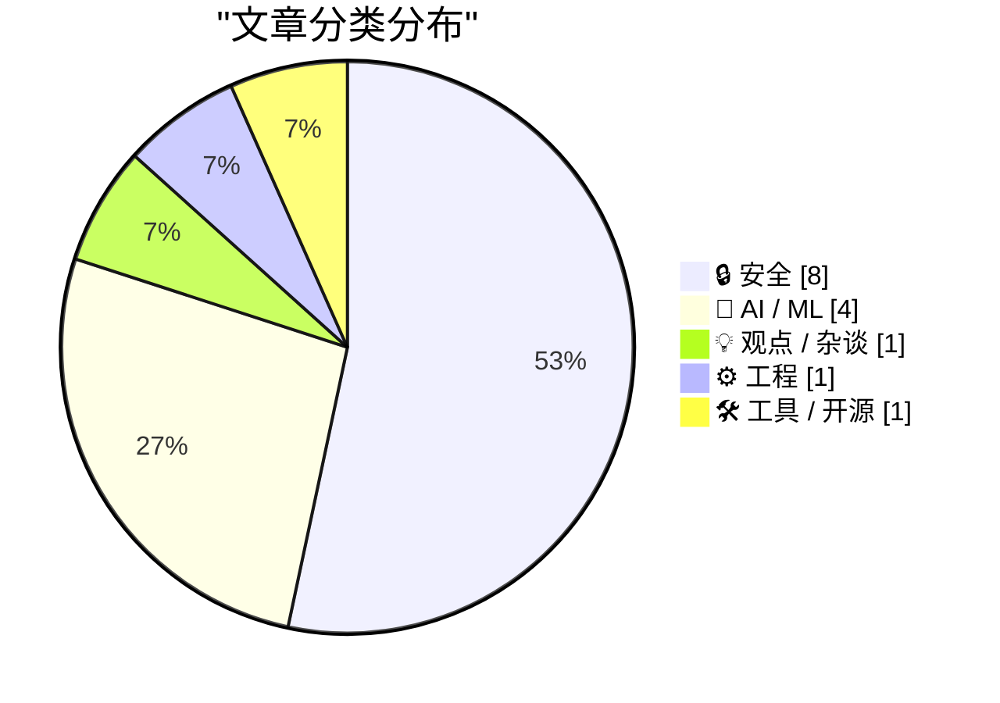
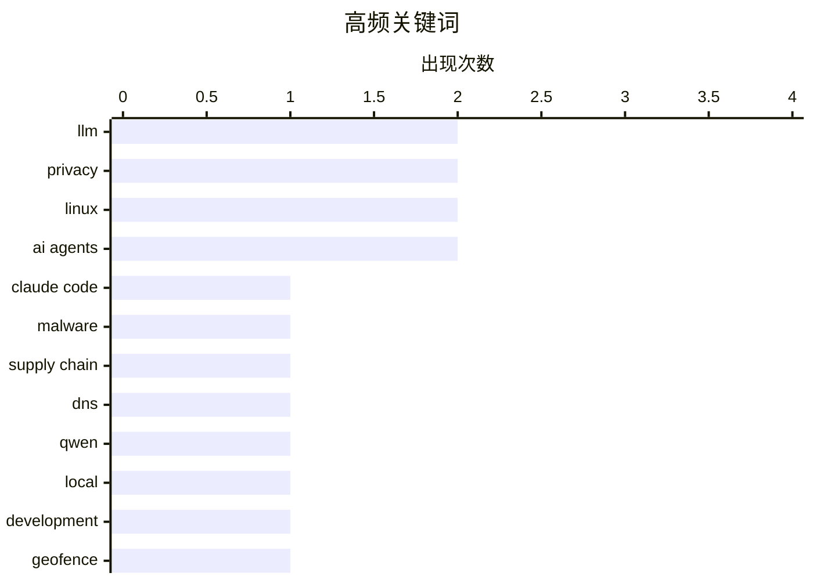

# 📰 AI 资讯每日精选 — 2026-06-30

> 汇聚 140+ 技术博客、X/Twitter、Hacker News、Reddit、Product Hunt、
> Lobste.rs、ClawFeed 日报及 GitHub Trending，经 AI 评分筛选。
>
> **本期内容**：🏆 今日必读 · 🌐 ClawFeed 日报 · 🔥 GitHub Trending · 📂 分类精选 · 🎨 设计与生成式 AI · 📊 数据概览

## 📝 今日看点

今日技术圈聚焦两大主线：AI工具与基础设施的安全危机，以及开发范式的深层变革。安全方面，从Claude Code被利用实现远程控制，到Chrome和Linux内核接连曝出可突破沙箱、实现提权的致命漏洞，表明攻击者正系统性地瞄准AI编码工具与底层系统边界。与此同时，AI正重塑开发与商业模式：Qwen 3.6 27B模型被视为本地开发的新标杆，而德勤内部文件直言按小时计费模式将被AI代理终结，咨询行业面临根本性颠覆。此外，美国最高法院对地理围栏搜查令的宪法限制，也为技术圈的数据隐私与监管博弈划下新红线。

---

## 🏆 今日必读

🥇 **Claude Code 未经验证即运行 GitHub 仓库中的隐藏恶意软件，攻击者可获完全控制权**

[Claude Code runs a GitHub repo's hidden malware without verification, giving attackers full control](https://the-decoder.com/claude-code-runs-a-github-repos-hidden-malware-without-verification-giving-attackers-full-control/) — The Decoder · 15 小时前 · 🔒 安全

> Mozilla 0DIN 平台的安全研究人员演示了单个被攻陷的 GitHub 仓库如何通过 AI 编码工具（如 Claude Code）的设置过程接管开发者机器。恶意代码仅在运行时通过 DNS 查询加载，在仓库、扫描器和 AI 代理本身中均不可见。攻击者利用 AI 工具对仓库代码的信任链，在开发者执行 setup 命令时触发恶意负载。该漏洞暴露了 AI 辅助开发工具在安全验证机制上的重大缺陷。结论是当前 AI 编码工具缺乏对运行时加载代码的验证能力，为供应链攻击提供了新途径。

💡 **为什么值得读**: 揭示了 AI 编码工具（如 Claude Code）中一个被忽视的严重安全漏洞，对使用 AI 辅助开发的团队具有直接警示意义。

🏷️ Claude Code, malware, supply chain, DNS

🥈 **Qwen 3.6 27B 是本地开发的最佳选择**

[Qwen 3.6 27B is the sweet spot for local development](https://quesma.com/blog/qwen-36-is-awesome/) — Hacker News Best · 8 小时前 · 🤖 AI / ML

> 文章论证了 Qwen 3.6 27B 模型在本地开发场景中达到了性能与资源消耗的最佳平衡点。该模型在编码、推理和指令遵循等基准测试中表现优异，同时 27B 参数量级使其能够在消费级 GPU（如 RTX 4090）上流畅运行。与更大规模的 72B 或 120B 模型相比，27B 版本在推理速度上快 2-3 倍，而性能损失仅约 5-10%。作者认为对于日常本地开发任务，Qwen 3.6 27B 是当前开源模型中最实用的选择。

💡 **为什么值得读**: 为本地 AI 开发提供了明确的模型选型建议，包含具体的性能数据和硬件要求，适合需要部署本地编码助手的开发者。

🏷️ Qwen, LLM, local, development

🥉 **美国最高法院裁定：地理围栏搜查令需受宪法保护**

[US Supreme Court rules geofence warrants require constitutional protections](https://www.theguardian.com/us-news/2026/jun/29/supreme-court-geofence-warrants-case-decision) — Hacker News Best · 9 小时前 · 🔒 安全

> 美国最高法院裁定执法机构使用地理围栏搜查令（要求科技公司提供特定区域所有设备数据）必须遵守宪法第四修正案的保护。法院认为这种大规模数据收集行为构成宪法意义上的搜查，需要基于相当理由（probable cause）并获取特定性搜查令。该判决限制了警方通过 Google 等平台获取匿名位置数据的权力，要求搜查令必须明确描述目标设备而非地理区域。这一裁决对数字隐私权具有里程碑意义，将影响全美执法机构的调查手段。

💡 **为什么值得读**: 这是数字隐私领域的重要判例，直接关系到每个手机用户的位置数据保护，对科技公司和法律从业者都有深远影响。

🏷️ geofence, warrant, privacy, Supreme Court

4️⃣ **Longinus：一个漏洞突破两道边界——利用单一漏洞穿透 Chrome 渲染器和 V8 沙箱（CVE-2026-6307）**

[Longinus: 2 Boundaries in One Bug, Piercing Chrome’s Renderer and V8 Sandbox with a Single Vulnerability, CVE-2026-6307](https://nebusec.ai/research/v8-cve-2026-6307-writeup/) — Lobste.rs · 10 小时前 · 🔒 安全

> 安全研究人员发现并利用了一个编号为 CVE-2026-6307 的 Chrome 漏洞，该漏洞能够同时突破 Chrome 的渲染器沙箱和 V8 JavaScript 引擎沙箱。攻击链利用 V8 中一个类型混淆漏洞，通过精心构造的 JavaScript 代码实现从渲染进程到系统内核的权限提升。该漏洞被命名为 Longinus，展示了现代浏览器多层防御体系中的边界交叉攻击可能性。研究人员已向 Google 报告漏洞并获得确认，Chrome 团队已发布修复补丁。

💡 **为什么值得读**: 展示了突破 Chrome 双层沙箱的完整攻击链，对浏览器安全研究人员和 Chrome 用户理解现代浏览器安全架构的薄弱环节极具价值。

🏷️ Chrome, V8, sandbox, CVE

5️⃣ **ipv6_frag_escape：Linux 本地权限提升——可靠的容器/沙箱逃逸**

[ipv6_frag_escape: Linux LPE - Reliable Jail/Container Escape](https://github.com/sgkdev/ipv6_frag_escape) — Lobste.rs · 8 小时前 · 🔒 安全

> 该 GitHub 项目公开了一个 Linux 内核漏洞利用工具，通过 IPv6 分片重组机制实现本地权限提升（LPE）和容器/沙箱逃逸。漏洞利用 IPv6 分片处理中的竞争条件，允许非特权用户获得 root 权限并逃逸出容器或 jail 环境。该工具声称具有高可靠性，支持多种 Linux 发行版和内核版本。项目提供了完整的 PoC 代码和利用说明，但警告仅用于安全研究和授权测试。

💡 **为什么值得读**: 提供了一个可工作的 Linux 容器逃逸利用工具，对安全运维人员评估和加固容器环境具有直接参考价值。

🏷️ Linux, IPv6, container escape, LPE

---

## 🌐 ClawFeed 日报精选

> 来源：[ClawFeed](https://clawfeed.kevinhe.io) — AI 驱动的多源新闻聚合

# ClawFeed 日报 | 2026-06-29 (Sunday)

汇总 6 期 4h digest：#747, #750, #751, #752, #753, #754

---

## 🔥 当日 Top 5

1. **Verification 取代 Coding 成新瓶颈** — Fiona Fung（Anthropic Claude Code/Cowork 工程负责人）上 Lenny 播客：代码生成已基本解决，瓶颈转移到验证环节。Anthropic 内部组织正围绕这一转变重构。[#752]
   https://x.com/wangray/status/2071266780182683748

2. **AI 工程 Token 开销破 $15-20K/月** — Ryan Carson 透露个人月均 token 支出，计划参考 Coinbase (Brian Armstrong) 策略：用便宜模型做默认 + 路由 + 缓存，不限用量。258K views。AI-native 工程成本管理成刚需。[#750]
   https://x.com/ryancarson/status/2070876856317010406

3. **一人公司 Claude Cowork 方法论刷屏 4.5M views** — Rahul 拆解知识工作者 60% 时间可被 Claude Cowork 接管（邮件/报告/deck/SEO/研究）。"One-Person Company" 叙事传播高峰。[#750, #751]
   https://x.com/sairahul1/status/2070795168677265758

4. **Vercel 开源 Eve Agent 框架** — 标准化 agent build/run/scale，不再每次手搓基础设施。51K views，agent infra 开源化趋势加速。[#747]
   https://x.com/omarsar0/status/2070884837372703196

5. **VAS 虚拟代理服务器概念** — 郭宇分享在 VPS 上跑多 coding agent，提交/测试/构建/部署全在服务端，绕开 GitHub，声称提速 10x。一个月没碰 MacBook。server-side multi-agent 新范式。[#752]
   https://x.com/turingou/status/2071354445070323922

---

## 📰 核心主题

### Agent 基础设施标准化
Vercel Eve 开源、VAS 服务端多 agent、Matrix Agent OS（多 agent 分权分责可审计）、COCO 智外文化案例（26 AI 员工 5 部门，AI manager 管 AI worker）。Agent 从 demo 走向工程化运维。

### AI 成本管理成刚需
Ryan Carson $15-20K/月 token 花费 → Coinbase 策略（cheaper defaults + routing + caching）。这是 AI-native 工程从 "能用" 到 "可持续" 的关键拐点。

### Verification > Coding
Fiona Fung (Anthropic) 明确表态：coding is solved，verification 是新瓶颈。Anthropic 内部重组方向验证了这一趋势。对 COCO 的启示：验证能力（自动化测试、审计追踪）将成为 agent 平台差异化关键。

### 一人公司叙事高峰
sairahul1 帖子 4.5M views，知识工作者 60% 时间可替代。与 Greg Isenberg "4 张图解 AI agent 公司" (127K→持续增长) 形成共振。

### 半导体供应链暗流
CXMT（长鑫存储）可能向苹果供货 + 低价 DRAM 冲击市场担忧 → SK Hynix、三星持续下跌。Jenny Cheng 认为第二点 largely unsubstantiated。[#753]

---

## 🔖 Bookmarks 精选

本日无新增 bookmark。持续跟踪中的：
- Av1dlive: Claude for Finance quant AI 讲座 (807K views)
- BruceGuai: Matrix Agent OS 架构 (33K views)

---

## 👀 推荐关注汇总

- **@raft_hq** (Raft, YC) — agent-native workflow 工具，"一条消息替代 form+email+chat+spreadsheet"
- **@runinfrai** (RunInfra, YC F26) — automegakernel / autokernel，CUDA 推理优化
- **@_LuoFuli** (Fuli Luo) — 小米 MiMo 团队 lead，前 DeepSeek，MiMo-V2.5 推理优化

---

## 💤 当日重复噪音模式

- **Bookmark 回显**：Av1dlive quant AI (807K) 和 BruceGuai Matrix Agent OS (33K) 在 6 期中反复出现（未新增 bookmark 导致每期重复展示），建议 CDP 逻辑过滤已展示过的 bookmark。
- **sairahul1 One-Person Company 跨期重复**：从 #750 的 4.1M 涨到 #751 的 4.5M，同一帖子在 3 期中反复出现。高热帖跨期去重可优化。
- **CocoAI 官推**：A/B Opus 4.5 code review 帖在 #753 和 #754 中重复覆盖。
- **周日低流量**：下午档 (#754) feed 仅 3 条且大部分已覆盖，本质是 followingSample 抽查报告而非新内容 digest。

---

*聚合自 4h digest #747, #750, #751, #752, #753, #754 | 生成时间: 2026-06-29*
---

## 🔥 GitHub Trending

> 今日热门开源项目（全语言 + Python）

| # | 项目 | 描述 | ⭐ 总星 | 📈 今日 | 语言 |
|---|------|------|---------|---------|------|
| 1 | [ripienaar/free-for-dev](https://github.com/ripienaar/free-for-dev) | A list of SaaS, PaaS and IaaS offerings that have free ti... | 126.7k | +1935 | HTML |
| 2 | [simplex-chat/simplex-chat](https://github.com/simplex-chat/simplex-chat) | SimpleX - the first messaging network operating without u... | 16.6k | +1607 | Haskell |
| 3 | [msitarzewski/agency-agents](https://github.com/msitarzewski/agency-agents) 🤖 | A complete AI agency at your fingertips - From frontend w... | 118.9k | +1425 | Shell |
| 4 | [xbtlin/ai-berkshire](https://github.com/xbtlin/ai-berkshire) 🤖 | AI 时代的伯克希尔：基于 Claude Code / Codex 的价值投资研究框架。巴菲特·芒格·段永平·李录... | 6.7k | +1386 | Python |
| 5 | [browser-use/video-use](https://github.com/browser-use/video-use) | Edit videos with coding agents | 12.0k | +967 | Python |
| 6 | [topoteretes/cognee](https://github.com/topoteretes/cognee) 🤖 | Cognee is the open-source AI memory platform for agents. ... | 25.7k | +868 | Python |
| 7 | [HKUDS/Vibe-Trading](https://github.com/HKUDS/Vibe-Trading) 🤖 | "Vibe-Trading: Your Personal Trading Agent" | 15.1k | +839 | Python |
| 8 | [altic-dev/FluidVoice](https://github.com/altic-dev/FluidVoice) | FluidVoice - Fastest macOS Offline Dictation app - Voice ... | 4.4k | +830 | Swift |
| 9 | [Robbyant/lingbot-map](https://github.com/Robbyant/lingbot-map) | A feed-forward 3D foundation model for reconstructing sce... | 8.6k | +465 | Python |
| 10 | [commaai/openpilot](https://github.com/commaai/openpilot) | openpilot is an operating system for robotics. Currently,... | 62.8k | +458 | Python |
| 11 | [TauricResearch/TradingAgents](https://github.com/TauricResearch/TradingAgents) 🤖 | TradingAgents: Multi-Agents LLM Financial Trading Framework | 89.8k | +362 | Python |
| 12 | [cupy/cupy](https://github.com/cupy/cupy) | NumPy & SciPy for GPU | 11.8k | +352 | Python |
| 13 | [0xNyk/council-of-high-intelligence](https://github.com/0xNyk/council-of-high-intelligence) 🤖 | 18 AI personas deliberate your hardest decisions across m... | 1.9k | +331 | Shell |
| 14 | [unclecode/crawl4ai](https://github.com/unclecode/crawl4ai) 🤖 | 🚀🤖 Crawl4AI: Open-source LLM Friendly Web Crawler & Scr... | 70.3k | +288 | Python |
| 15 | [refactoringhq/tolaria](https://github.com/refactoringhq/tolaria) | Desktop app to manage markdown knowledge bases | 17.5k | +280 | TypeScript |

---

## 🔒 安全

### 1. Claude Code 未经验证即运行 GitHub 仓库中的隐藏恶意软件，攻击者可获完全控制权

[Claude Code runs a GitHub repo's hidden malware without verification, giving attackers full control](https://the-decoder.com/claude-code-runs-a-github-repos-hidden-malware-without-verification-giving-attackers-full-control/) — **The Decoder** · 15 小时前 · ⭐ 27/30

> Mozilla 0DIN 平台的安全研究人员演示了单个被攻陷的 GitHub 仓库如何通过 AI 编码工具（如 Claude Code）的设置过程接管开发者机器。恶意代码仅在运行时通过 DNS 查询加载，在仓库、扫描器和 AI 代理本身中均不可见。攻击者利用 AI 工具对仓库代码的信任链，在开发者执行 setup 命令时触发恶意负载。该漏洞暴露了 AI 辅助开发工具在安全验证机制上的重大缺陷。结论是当前 AI 编码工具缺乏对运行时加载代码的验证能力，为供应链攻击提供了新途径。

🏷️ Claude Code, malware, supply chain, DNS

---

### 2. 美国最高法院裁定：地理围栏搜查令需受宪法保护

[US Supreme Court rules geofence warrants require constitutional protections](https://www.theguardian.com/us-news/2026/jun/29/supreme-court-geofence-warrants-case-decision) — **Hacker News Best** · 9 小时前 · ⭐ 27/30

> 美国最高法院裁定执法机构使用地理围栏搜查令（要求科技公司提供特定区域所有设备数据）必须遵守宪法第四修正案的保护。法院认为这种大规模数据收集行为构成宪法意义上的搜查，需要基于相当理由（probable cause）并获取特定性搜查令。该判决限制了警方通过 Google 等平台获取匿名位置数据的权力，要求搜查令必须明确描述目标设备而非地理区域。这一裁决对数字隐私权具有里程碑意义，将影响全美执法机构的调查手段。

🏷️ geofence, warrant, privacy, Supreme Court

---

### 3. Longinus：一个漏洞突破两道边界——利用单一漏洞穿透 Chrome 渲染器和 V8 沙箱（CVE-2026-6307）

[Longinus: 2 Boundaries in One Bug, Piercing Chrome’s Renderer and V8 Sandbox with a Single Vulnerability, CVE-2026-6307](https://nebusec.ai/research/v8-cve-2026-6307-writeup/) — **Lobste.rs** · 10 小时前 · ⭐ 27/30

> 安全研究人员发现并利用了一个编号为 CVE-2026-6307 的 Chrome 漏洞，该漏洞能够同时突破 Chrome 的渲染器沙箱和 V8 JavaScript 引擎沙箱。攻击链利用 V8 中一个类型混淆漏洞，通过精心构造的 JavaScript 代码实现从渲染进程到系统内核的权限提升。该漏洞被命名为 Longinus，展示了现代浏览器多层防御体系中的边界交叉攻击可能性。研究人员已向 Google 报告漏洞并获得确认，Chrome 团队已发布修复补丁。

🏷️ Chrome, V8, sandbox, CVE

---

### 4. ipv6_frag_escape：Linux 本地权限提升——可靠的容器/沙箱逃逸

[ipv6_frag_escape: Linux LPE - Reliable Jail/Container Escape](https://github.com/sgkdev/ipv6_frag_escape) — **Lobste.rs** · 8 小时前 · ⭐ 27/30

> 该 GitHub 项目公开了一个 Linux 内核漏洞利用工具，通过 IPv6 分片重组机制实现本地权限提升（LPE）和容器/沙箱逃逸。漏洞利用 IPv6 分片处理中的竞争条件，允许非特权用户获得 root 权限并逃逸出容器或 jail 环境。该工具声称具有高可靠性，支持多种 Linux 发行版和内核版本。项目提供了完整的 PoC 代码和利用说明，但警告仅用于安全研究和授权测试。

🏷️ Linux, IPv6, container escape, LPE

---

### 5. 年龄验证只是自动归因言论的前奏

[Age verification is just a precursor to automated attribution of speech](https://nonogra.ph/age-verification-is-just-a-precursor-to-attribution-of-speech-06-29-2026) — **Hacker News Best** · 21 小时前 · ⭐ 26/30

> 文章论证了强制年龄验证系统本质上是对网络言论进行自动归因的前置步骤。作者认为年龄验证技术（如上传身份证、面部扫描）收集的生物特征和身份信息，可以轻易被扩展用于将匿名言论与真实身份绑定。一旦建立了身份验证基础设施，政府或平台就能以“保护未成年人”为名，逐步要求所有言论都必须关联可验证身份。结论是年龄验证法案的真正危险不在于验证年龄本身，而在于它为全面监控和言论审查铺平了道路。

🏷️ age verification, privacy, attribution

---

### 6. 通过 DRM GEM change_handle 中的释放后使用漏洞实现非特权提权至 root（CVE-2026-46215）

[Unprivileged root via a use-after-free in DRM GEM change_handle (CVE-2026-46215)](https://cyberstan.co.uk/drm-lpe-linux/) — **Lobste.rs** · 7 小时前 · ⭐ 25/30

> Linux 内核 DRM（直接渲染管理器）子系统的 GEM（图形执行管理器）change_handle 操作中存在一个释放后使用（use-after-free）漏洞，编号 CVE-2026-46215。非特权本地用户可通过该漏洞获得 root 权限。漏洞源于 GEM 句柄处理中的竞态条件，攻击者通过精心构造的 ioctl 调用序列触发已释放内存的访问。该漏洞影响多个 Linux 发行版，研究人员已提供 PoC 代码。建议用户尽快更新内核至修复版本。

🏷️ Linux, DRM, use-after-free, privilege escalation

---

### 7. Data Breach at Indian Supplier Tata Electronics Exposes iPhone 18 Pro Details and Photos

[Data Breach at Indian Supplier Tata Electronics Exposes iPhone 18 Pro Details and Photos](https://www.reuters.com/business/media-telecom/apple-iphone-18-pro-supplier-list-parts-photos-exposed-tata-data-leak-2026-06-29/) — **daringfireball.net** · 39 分钟前 · ⭐ 24/30

> Munsif Vengattil, Aditya Kalra, and Stephen Nellis, reporting for Reuters:


  Sensitive lists of components and suppliers, ​and photos of
Apple’s upcoming iPhone 18 Pro models are part of files
poste

🏷️ data-breach, ransomware, iPhone, supply-chain

---

### 8. The US military used AI to pick thousands of targets but missed a note saying one was a school

[The US military used AI to pick thousands of targets but missed a note saying one was a school](https://the-decoder.com/the-us-military-used-ai-to-pick-thousands-of-targets-but-missed-a-note-saying-one-was-a-school/) — **The Decoder** · 13 小时前 · ⭐ 24/30

> The probe into a missile strike on an Iranian school exposes serious gaps in the US military's targeting infrastructure. AI is supposed to close them.
The article The US military used AI to pick thous

🏷️ AI targeting, military, ethics, failure

---

## 🤖 AI / ML

### 9. Qwen 3.6 27B 是本地开发的最佳选择

[Qwen 3.6 27B is the sweet spot for local development](https://quesma.com/blog/qwen-36-is-awesome/) — **Hacker News Best** · 8 小时前 · ⭐ 27/30

> 文章论证了 Qwen 3.6 27B 模型在本地开发场景中达到了性能与资源消耗的最佳平衡点。该模型在编码、推理和指令遵循等基准测试中表现优异，同时 27B 参数量级使其能够在消费级 GPU（如 RTX 4090）上流畅运行。与更大规模的 72B 或 120B 模型相比，27B 版本在推理速度上快 2-3 倍，而性能损失仅约 5-10%。作者认为对于日常本地开发任务，Qwen 3.6 27B 是当前开源模型中最实用的选择。

🏷️ Qwen, LLM, local, development

---

### 10. Ornith-1.0：用于智能体编程的自脚手架大语言模型

[Ornith-1.0: Self-Scaffolding LLMs for Agentic Coding](https://simonwillison.net/2026/Jun/29/ornith/#atom-everything) — **simonwillison.net** · 9 小时前 · ⭐ 24/30

> DeepReinforce 发布了 Ornith-1.0 系列开源模型（MIT 许可），这是首个自脚手架（self-scaffolding）LLM，专为智能体编程任务设计。该系列包含 9B Dense、31B Dense、35B MoE 和 397B MoE 四种变体，基于预训练的 Gemma 4 和 Qwen 3.5 构建。在编程基准测试中，Ornith-1.0 在同等规模的开源模型中达到了最先进的性能。自脚手架能力使模型能够自主生成和优化其推理链，无需外部提示工程。

🏷️ LLM, coding, open-weights, agentic

---

### 11. Amazon engineers are reportedly distilling Anthropic models to cut costs before new token-based pricing kicks in

[Amazon engineers are reportedly distilling Anthropic models to cut costs before new token-based pricing kicks in](https://the-decoder.com/amazon-engineers-are-reportedly-distilling-anthropic-models-to-cut-costs-before-new-token-based-pricing-kicks-in/) — **The Decoder** · 7 小时前 · ⭐ 24/30

> Amazon engineers are already distilling Anthropic models into smaller, cheaper versions for internal use. Starting next year, Amazon will pay by tokens processed rather than compute hours, which could

🏷️ distillation, Anthropic, cost, pricing

---

### 12. How to Govern Autonomous Agents in Enterprise AI Factories

[How to Govern Autonomous Agents in Enterprise AI Factories](https://developer.nvidia.com/blog/how-to-govern-autonomous-agents-in-enterprise-ai-factories/) — **NVIDIA Technical Blog** · 9 小时前 · ⭐ 24/30

> AI agents are quickly moving beyond chat. They inspect code, run tests, read documents, search knowledge bases, query internal systems, and operate for hours on...

🏷️ AI agents, governance, enterprise, safety

---

## 💡 观点 / 杂谈

### 13. 德勤告知自家顾问：AI 正在终结按小时计费模式

[Deloitte tells its own consultants: AI is coming for the billable hour](https://the-decoder.com/deloitte-tells-its-own-consultants-ai-is-coming-for-the-billable-hour/) — **The Decoder** · 10 小时前 · ⭐ 25/30

> 德勤内部演示文件预测，咨询行业经典的按小时计费模式到 2035 年将萎缩至市场总量的极小份额，被 AI 代理取代。一名顾问总结该信息为“我们的模式完蛋了”。麦肯锡和波士顿咨询集团已在寻找替代收入模式，如基于成果定价、订阅制或 AI 工具授权费。该文件认为 AI 能将咨询交付效率提升 10 倍以上，使按小时计费在经济上不再可行。结论是传统咨询公司必须彻底重构商业模式才能在 AI 时代生存。

🏷️ AI agents, consulting, billable hour, disruption

---

## ⚙️ 工程

### 14. Ante：融合借用检查与引用计数的新方式

[Ante: New Way to Blend Borrow Checking and Reference Counting](https://verdagon.dev/blog/ante-blending-borrowing-rc) — **Lobste.rs** · 1 天前 · ⭐ 25/30

> Ante 编程语言提出了一种新的内存管理方案，将 Rust 的借用检查（borrow checking）与 Swift/Objective-C 的引用计数（reference counting）融合在统一框架中。该方法允许开发者根据场景选择静态借用检查（零运行时开销）或动态引用计数（灵活性更高），并在同一代码中无缝混合使用。与 Rust 相比，Ante 降低了某些模式下的编程复杂度；与纯引用计数语言相比，它提供了更强的内存安全保证。作者认为这种混合方案可能成为系统编程语言内存管理的未来方向。

🏷️ borrow checking, reference counting, memory safety, programming language

---

## 🛠 工具 / 开源

### 15. .self: A new top-level domain designed to support self-hosting

[.self: A new top-level domain designed to support self-hosting](https://hccf.onmy.cloud/2026/06/21/reclaiming-our-digital-selves-hccfs-vision-for-a-human-centered-top-level-domain/) — **Hacker News Best** · 5 小时前 · ⭐ 24/30

> Article URL: https://hccf.onmy.cloud/2026/06/21/reclaiming-our-digital-selves-hccfs-vision-for-a-human-centered-top-level-domain/
Comments URL: https://news.ycombinator.com/item?id=48724230
Points: 28

🏷️ self-hosting, domain, decentralization

---

## 📊 数据概览

| 扫描源 | 抓取文章 | 时间范围 | 精选 |
|:---:|:---:|:---:|:---:|
| 92/140 | 3804 篇 → 81 篇 | 24h | **15 篇** |

### 分类分布



### 高频关键词



<details>
<summary>📈 纯文本关键词图（终端友好）</summary>

```
llm          │ ████████████████████ 2
privacy      │ ████████████████████ 2
linux        │ ████████████████████ 2
ai agents    │ ████████████████████ 2
claude code  │ ██████████░░░░░░░░░░ 1
malware      │ ██████████░░░░░░░░░░ 1
supply chain │ ██████████░░░░░░░░░░ 1
dns          │ ██████████░░░░░░░░░░ 1
qwen         │ ██████████░░░░░░░░░░ 1
local        │ ██████████░░░░░░░░░░ 1
```

</details>

### 🏷️ 话题标签

**llm**(2) · **privacy**(2) · **linux**(2) · ai agents(2) · claude code(1) · malware(1) · supply chain(1) · dns(1) · qwen(1) · local(1) · development(1) · geofence(1) · warrant(1) · supreme court(1) · chrome(1) · v8(1) · sandbox(1) · cve(1) · ipv6(1) · container escape(1)

---

*生成于 2026-06-30 01:38 | 汇聚 140 个技术博客、X/Twitter、Hacker News、Reddit、Product Hunt、Lobste.rs、ClawFeed 日报及 GitHub Trending，经 AI 评分筛选出 Top 15 精华内容*
