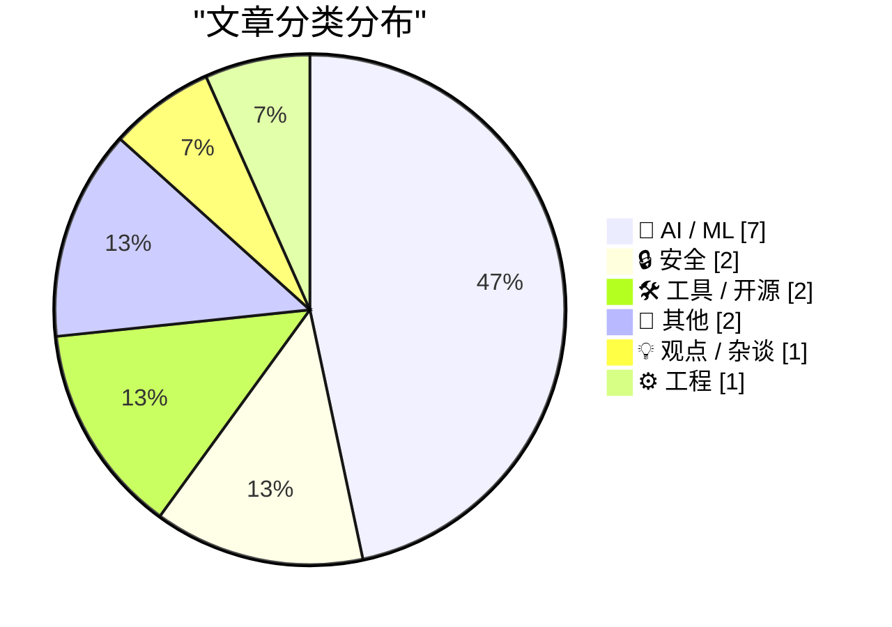
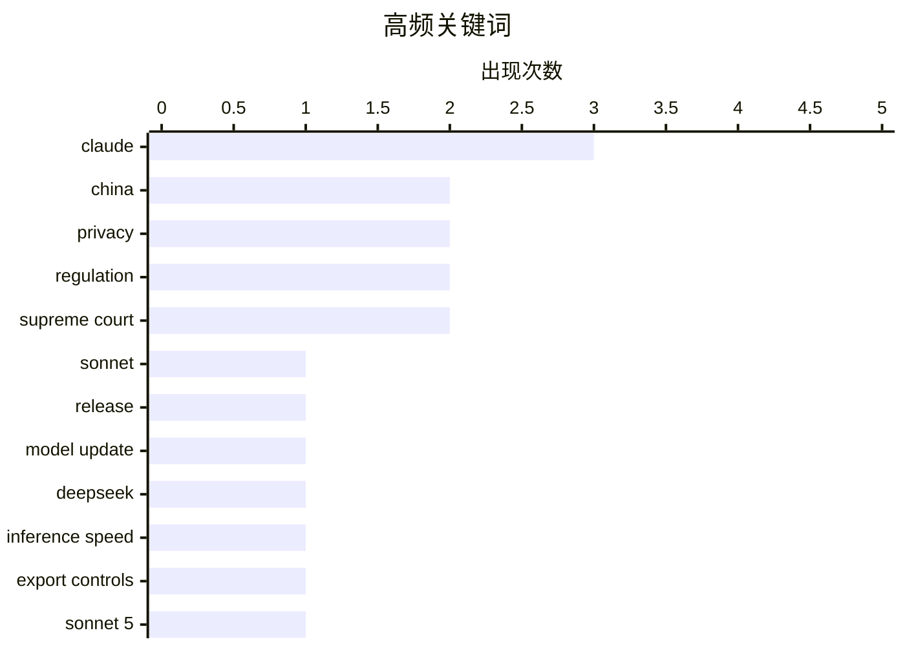

# 📰 AI 资讯每日精选 — 2026-07-01

> 汇聚 140+ 技术博客、X/Twitter、Hacker News、Reddit、Product Hunt、
> Lobste.rs、ClawFeed 日报及 GitHub Trending，经 AI 评分筛选。
>
> **本期内容**：🏆 今日必读 · 🌐 ClawFeed 日报 · 🔥 GitHub Trending · 📂 分类精选 · 🎨 设计与生成式 AI · 📊 数据概览

## 📝 今日看点

今日技术圈聚焦两大趋势：一是AI模型竞争进入“高性价比”阶段，Anthropic的Claude Sonnet 5以更低价格逼近顶级性能，而DeepSeek的DSpark框架通过“小模型生成、大模型验证”的创新架构，在受限芯片条件下大幅提升推理速度；二是国产算力突围取得标志性进展，美团基于纯国产芯片成功训练1.6万亿参数模型LongCat-2.0，同时ZLUDA 6的发布让非英伟达GPU运行CUDA成为可能，显示全球AI基础设施正加速去中心化。此外，AI安全与伦理争议持续升温，Meta秘密测试青少年危机提示词的行为，再次引发对平台责任与用户保护的激烈讨论。

---

## 🏆 今日必读

🥇 **Claude Sonnet 5 新特性**

[What's new in Claude Sonnet 5](https://simonwillison.net/2026/Jun/30/claude-sonnet-5/#atom-everything) — simonwillison.net · 4 小时前 · 🤖 AI / ML

> Anthropic 发布了 Claude Sonnet 5，其性能接近 Opus 4.8，但价格更低。开发者文档提供了比官方公告更实用的信息，包括具体的基准测试成绩和定价细节。Sonnet 5 在多项任务上超越了前代 Sonnet 4.6，并在知识工作测试 GDPval-AA v2 上以 1618 分超过了更大的 Opus 4.8。Anthropic 还特意指出，该模型在网络安全任务上的得分远低于美国政府目前封锁的模型，这可能是对当前监管辩论的刻意信号。

💡 **为什么值得读**: 如果你正在评估最新、性价比最高的 Claude 模型，这篇开发者文档能提供比官方公告更具体、更可操作的性能与定价信息。

🏷️ Claude, Sonnet, release, model update

🥈 **DeepSeek 的 DSpark 将 AI 速度提升高达 85%，在美国出口管制收紧下的战略胜利**

[Deepseek's DSpark boosts AI speed by up to 85 percent, a strategic win under tightening US export controls](https://the-decoder.com/deepseeks-dspark-boosts-ai-speed-by-up-to-85-percent-a-strategic-win-under-tightening-us-export-controls/) — The Decoder · 17 小时前 · 🤖 AI / ML

> DeepSeek 的新框架 DSpark 将每用户响应速度提升了 60% 到 85%。其核心方案是使用一个小模型生成候选 token，再由大模型批量验证，从而在更少的芯片上榨取更多性能。这一技术突破有助于进一步减少中国对美国高端硬件的依赖，是在美国出口管制持续收紧背景下的战略胜利。

💡 **为什么值得读**: 这篇文章展示了一种不依赖高端芯片即可大幅提升推理速度的实用技术方案，对于关注算力效率和国产替代的读者极具价值。

🏷️ DeepSeek, inference speed, export controls, China

🥉 **Anthropic 新发布的 Claude Sonnet 5 缩小了与更昂贵的 Opus 系列模型的差距**

[Anthropic's new Claude Sonnet 5 closes the gap to the pricier Opus model series](https://the-decoder.com/anthropics-new-claude-sonnet-5-closes-the-gap-to-the-pricier-opus-model-series/) — The Decoder · 7 小时前 · 🤖 AI / ML

> Anthropic 发布了 Claude Sonnet 5，在所有基准测试中均超越了前代 Sonnet 4.6，甚至在知识工作测试 GDPval-AA v2 上以 1618 分超过了更大的 Opus 4.8。Anthropic 还特意指出，该模型在网络安全任务上的得分远低于美国政府目前封锁的模型，这可能是对当前监管辩论的刻意信号。这表明 Sonnet 5 在性价比上取得了显著突破，正在缩小与旗舰 Opus 系列的差距。

💡 **为什么值得读**: 这篇文章清晰量化了 Sonnet 5 与 Opus 4.8 的性能对比，并揭示了 Anthropic 在监管敏感话题上的微妙表态，是理解当前模型竞争格局的关键信息。

🏷️ Claude, Sonnet 5, Anthropic, benchmark

4️⃣ **Anthropic 推出 Claude Science，一个专为研究人员打造的 AI 工作空间**

[Anthropic launches Claude Science, an AI workspace built specifically for researchers](https://the-decoder.com/anthropic-launches-claude-science-an-ai-workspace-built-specifically-for-researchers/) — The Decoder · 7 小时前 · 🤖 AI / ML

> Anthropic 发布了 Claude Science，一个面向研究人员的 AI 工作台。该平台内置了超过 60 个预配置技能，覆盖基因组学和计算化学等领域，并配备了一个验证代理来自动检查引用和计算结果。Claude Science 支持本地或 HPC 集群运行，确保敏感数据无需离开实验室的基础设施。

💡 **为什么值得读**: 对于需要处理敏感数据并希望将 AI 集成到科研工作流中的研究人员，这篇文章介绍了 Anthropic 提供的首个专用科研 AI 平台，值得关注。

🏷️ Claude Science, research, AI workspace, genomics

5️⃣ **美团的 LongCat-2.0 证明中国可以在没有英伟达的情况下训练大规模 AI 模型**

[Meituan's LongCat-2.0 shows China can train massive AI models without Nvidia](https://the-decoder.com/meituans-longcat-2-0-shows-china-can-train-massive-ai-models-without-nvidia/) — The Decoder · 10 小时前 · 🤖 AI / ML

> 美团成功训练了一个拥有 1.6 万亿参数的 AI 模型 LongCat-2.0，完全基于国产芯片，未使用任何英伟达硬件。这一成果证明了中国在面临美国出口管制的情况下，依然具备训练超大规模 AI 模型的能力，是国产算力生态的重要里程碑。

💡 **为什么值得读**: 这篇文章用具体案例（1.6万亿参数模型）证明了国产芯片的可行性，对于关注中国 AI 自主可控和算力替代方案的读者是必读信息。

🏷️ China, AI training, domestic chips, Meituan

---

## 🌐 ClawFeed 日报精选

> 来源：[ClawFeed](https://clawfeed.kevinhe.io) — AI 驱动的多源新闻聚合

# ClawFeed 日报 | 2026-06-30 (Mon)

> 聚合 7 期 4h digest (#755, #757, #758, #759, #760, #761, #762)

---

## 🔥 当日 Top 5

1. **Cline 推出 $9.99/月订阅** — 头部开源 coding agent 正式转向"多模型聚合订阅"商业化，打包 GLM-5.2/DeepSeek/Kimi/MiniMax/Mimo/Qwen 等模型，验证 agent + 多模型路由变现路径。374K views, 187 RT。[#758]
   https://x.com/cline/status/2071617325296734309

2. **Anthropic loop engineering playbook 泄露引爆讨论** — 0xMovez (308→405K views, 76 RT) 和 Miles Deutscher (54K views, 45 RT) 从不同角度解读 agent loop/harness/eval 的完整 stack。核心框架：trace → LLM judge → diagnose → fix → ship，形成 agent 自我改进闭环。全天持续发酵。[#757, #759, #760]
   https://x.com/0xMovez/status/2071214176526049739

3. **全栈切换中国 AI 模型，成本降 87%** — DeRonin_ 公开晒替换清单（Opus 4.8 → Kimi K2.7, GPT-5.5 → Qwen 3.7 Max），宣称收入不变。中国模型价格战从 benchmark 比拼进入"真实生产环境替换"阶段。251K views, 4.6K likes。[#759]
   https://x.com/DeRonin_/status/2071561335234531578

4. **"AI native 组织"定义之争** — 玉伯指出"只有程序员 ≠ AI native"，需要全职能参与；elliotchen100 补充模型能力需渗入全链路。对"一人公司"叙事的冷思考：缺少非工程角色，AI 自动化再强也撑不起完整产品闭环。[#762]
   https://x.com/elliotchen100/status/2071801503204192268

5. **Aaron Levie: 智谱 AI 匹配 Claude Mythos 网络安全水平** — "Mythos 级别的开源网络安全模型即将出现，替代技术栈将从美国体系分走更多经济价值和控制权。" 140K views。[#755]
   https://x.com/levie/status/2071253118252356001

---

## 📰 核心主题聚类

### Agent 工程化浪潮
- Anthropic loop engineering playbook 全天热议（0xMovez + Miles Deutscher，合计 ~460K views）
- Matrix Agent OS 公测一周：用户创建"数以万计" 0-person companies（BruceGuai）
- OpenAI 开源航空公司客服多 Agent Demo（Agents SDK, Jolyne_AI）
- COCO CharlieHuAI 在新加坡 Agentic Finance panel: "模型能力过剩，落地能力才是稀缺资源"

### 中国模型价格战 → 生产替换
- DeRonin_ 全栈替换案例（87% 降本，收入不变）
- Cline 订阅打包大量中国开源模型（GLM/DeepSeek/Kimi/Qwen 等）
- 小米 MiMo Code 开源（5 人 14 天 vibe-coding，Fuli Luo）

### "一人公司" vs 现实
- elliotchen100 + 玉伯：AI native ≠ 只有工程师
- BruceGuai Matrix: agent 公司 OS 需要 accountability/audit/可控性
- AI 网站出海实战（huangyun_122）：从焦虑到第一个 $10K

### Crypto 合规 + 生态位
- DujunX: crypto 交易所在传统资本市场中"降维"——从王者变散户券商
- OKX.AI 发布（bxiaokang）：Crypto + AI 交叉叙事

---

## 🔖 Bookmark 精选

- **BruceGuai — Matrix Agent 公司 OS 架构详解**: 不是一个巨大 Agent 塞满所有工具，而是一套可长期运行的 agent 公司架构。核心设计原则：accountability、audit、可控性。引用 DerekNee "you cannot run a company on one giant agent."
  https://x.com/BruceGuai/status/2070130243059495142

- **Av1dlive — Google senior engineer MIT 公开课**: AI 模型构建方法论 55 分钟免费讲解。同一作者此前的 quant AI lecture 获 807K views，持续产出高质量教育内容。

---

## 👀 推荐关注汇总

本日各期均无新增推荐——当前 following 列表覆盖已较完整。

---

## 🧹 建议取关

- **@HeXiaobo** — 最后一条推文 2018 年 7 月，超 8 年未活跃，509 followers。典型僵尸号。（多期重复建议）
- **@0xJasonBateman** — 仅 8 followers，无近期推文，账号几乎无活动。
- **@caterpillarous** — 最后发推 5 月 19 日（41 天前），内容以个人感悟为主，与 AI/crypto/tech builder 方向关联弱。观察中。

---

## 💤 当日噪音模式

1. **Bookmark 回显轮回**: Av1dlive quant AI lecture (807K) 和 BruceGuai Matrix (33K) 在全部 7 期中反复出现为"前期已覆盖"，占据每期 bookmark 位但无增量信息。
2. **followingSample 固定 8 人旋转**: raft_hq / levie / kalinowski007 / runinfrai / caterpillarous / _LuoFuli / AmandaAskell / rwayne 在多期中重复抽样，产出相同评估结论。
3. **Marketing 内容混入 feed**: DujunX WidthGRC 合规平台推广、Renee7eth AgentKey 涨粉模板。
4. **非技术生活帖过滤**: turingou 米其林餐厅、rwayne 娱乐八卦、AmandaAskell 个人生活向内容。

---

*Generated by Lisa · ClawFeed Daily Digest Pipeline*---

## 🔥 GitHub Trending

> 今日热门开源项目（全语言 + Python）

| # | 项目 | 描述 | ⭐ 总星 | 📈 今日 | 语言 |
|---|------|------|---------|---------|------|
| 1 | [msitarzewski/agency-agents](https://github.com/msitarzewski/agency-agents) 🤖 | A complete AI agency at your fingertips - From frontend w... | 121.0k | +1791 | Shell |
| 2 | [hasaneyldrm/exercises-dataset](https://github.com/hasaneyldrm/exercises-dataset) | A comprehensive dataset of 433 fitness exercises. Each en... | 6.8k | +1343 | HTML |
| 3 | [Panniantong/Agent-Reach](https://github.com/Panniantong/Agent-Reach) 🤖 | Give your AI agent eyes to see the entire internet. Read ... | 47.1k | +1339 | Python |
| 4 | [simplex-chat/simplex-chat](https://github.com/simplex-chat/simplex-chat) | SimpleX - the first messaging network operating without u... | 17.3k | +1235 | Haskell |
| 5 | [xbtlin/ai-berkshire](https://github.com/xbtlin/ai-berkshire) 🤖 | AI 时代的伯克希尔：基于 Claude Code / Codex 的价值投资研究框架。巴菲特·芒格·段永平·李录... | 7.5k | +969 | Python |
| 6 | [obra/superpowers](https://github.com/obra/superpowers) | An agentic skills framework & software development method... | 242.5k | +890 | Shell |
| 7 | [ripienaar/free-for-dev](https://github.com/ripienaar/free-for-dev) | A list of SaaS, PaaS and IaaS offerings that have free ti... | 127.3k | +742 | HTML |
| 8 | [browser-use/video-use](https://github.com/browser-use/video-use) | Edit videos with coding agents | 12.6k | +721 | Python |
| 9 | [HKUDS/Vibe-Trading](https://github.com/HKUDS/Vibe-Trading) 🤖 | "Vibe-Trading: Your Personal Trading Agent" | 15.8k | +721 | Python |
| 10 | [altic-dev/FluidVoice](https://github.com/altic-dev/FluidVoice) 🤖 | Fastest and only macOS Dictation app with on-device STT a... | 4.9k | +588 | Swift |
| 11 | [usestrix/strix](https://github.com/usestrix/strix) 🤖 | Open-source AI penetration testing tool to find and fix y... | 28.2k | +515 | Python |
| 12 | [ogulcancelik/herdr](https://github.com/ogulcancelik/herdr) 🤖 | agent multiplexer that lives in your terminal. | 9.0k | +486 | Rust |
| 13 | [google/agents-cli](https://github.com/google/agents-cli) 🤖 | The CLI and skills that turn any coding assistant into an... | 4.2k | +445 | Python |
| 14 | [diegosouzapw/OmniRoute](https://github.com/diegosouzapw/OmniRoute) 🤖 | Never stop coding. Free AI gateway: one endpoint, 231+ pr... | 8.6k | +387 | TypeScript |
| 15 | [facebook/astryx](https://github.com/facebook/astryx) 🤖 | An open source design system that's fully customizable an... | 1.8k | +364 | TypeScript |

---

## 🤖 AI / ML

### 1. Claude Sonnet 5 新特性

[What's new in Claude Sonnet 5](https://simonwillison.net/2026/Jun/30/claude-sonnet-5/#atom-everything) — **simonwillison.net** · 4 小时前 · ⭐ 26/30

> Anthropic 发布了 Claude Sonnet 5，其性能接近 Opus 4.8，但价格更低。开发者文档提供了比官方公告更实用的信息，包括具体的基准测试成绩和定价细节。Sonnet 5 在多项任务上超越了前代 Sonnet 4.6，并在知识工作测试 GDPval-AA v2 上以 1618 分超过了更大的 Opus 4.8。Anthropic 还特意指出，该模型在网络安全任务上的得分远低于美国政府目前封锁的模型，这可能是对当前监管辩论的刻意信号。

🏷️ Claude, Sonnet, release, model update

---

### 2. DeepSeek 的 DSpark 将 AI 速度提升高达 85%，在美国出口管制收紧下的战略胜利

[Deepseek's DSpark boosts AI speed by up to 85 percent, a strategic win under tightening US export controls](https://the-decoder.com/deepseeks-dspark-boosts-ai-speed-by-up-to-85-percent-a-strategic-win-under-tightening-us-export-controls/) — **The Decoder** · 17 小时前 · ⭐ 26/30

> DeepSeek 的新框架 DSpark 将每用户响应速度提升了 60% 到 85%。其核心方案是使用一个小模型生成候选 token，再由大模型批量验证，从而在更少的芯片上榨取更多性能。这一技术突破有助于进一步减少中国对美国高端硬件的依赖，是在美国出口管制持续收紧背景下的战略胜利。

🏷️ DeepSeek, inference speed, export controls, China

---

### 3. Anthropic 新发布的 Claude Sonnet 5 缩小了与更昂贵的 Opus 系列模型的差距

[Anthropic's new Claude Sonnet 5 closes the gap to the pricier Opus model series](https://the-decoder.com/anthropics-new-claude-sonnet-5-closes-the-gap-to-the-pricier-opus-model-series/) — **The Decoder** · 7 小时前 · ⭐ 25/30

> Anthropic 发布了 Claude Sonnet 5，在所有基准测试中均超越了前代 Sonnet 4.6，甚至在知识工作测试 GDPval-AA v2 上以 1618 分超过了更大的 Opus 4.8。Anthropic 还特意指出，该模型在网络安全任务上的得分远低于美国政府目前封锁的模型，这可能是对当前监管辩论的刻意信号。这表明 Sonnet 5 在性价比上取得了显著突破，正在缩小与旗舰 Opus 系列的差距。

🏷️ Claude, Sonnet 5, Anthropic, benchmark

---

### 4. Anthropic 推出 Claude Science，一个专为研究人员打造的 AI 工作空间

[Anthropic launches Claude Science, an AI workspace built specifically for researchers](https://the-decoder.com/anthropic-launches-claude-science-an-ai-workspace-built-specifically-for-researchers/) — **The Decoder** · 7 小时前 · ⭐ 25/30

> Anthropic 发布了 Claude Science，一个面向研究人员的 AI 工作台。该平台内置了超过 60 个预配置技能，覆盖基因组学和计算化学等领域，并配备了一个验证代理来自动检查引用和计算结果。Claude Science 支持本地或 HPC 集群运行，确保敏感数据无需离开实验室的基础设施。

🏷️ Claude Science, research, AI workspace, genomics

---

### 5. 美团的 LongCat-2.0 证明中国可以在没有英伟达的情况下训练大规模 AI 模型

[Meituan's LongCat-2.0 shows China can train massive AI models without Nvidia](https://the-decoder.com/meituans-longcat-2-0-shows-china-can-train-massive-ai-models-without-nvidia/) — **The Decoder** · 10 小时前 · ⭐ 25/30

> 美团成功训练了一个拥有 1.6 万亿参数的 AI 模型 LongCat-2.0，完全基于国产芯片，未使用任何英伟达硬件。这一成果证明了中国在面临美国出口管制的情况下，依然具备训练超大规模 AI 模型的能力，是国产算力生态的重要里程碑。

🏷️ China, AI training, domestic chips, Meituan

---

### 6. REAP：从交互式生产使用中自动策划编码智能体基准测试

[REAP: Automatic Curation of Coding Agent Benchmarks from Interactive Production Usage [R]](https://www.reddit.com/r/MachineLearning/comments/1uk713d/reap_automatic_curation_of_coding_agent/) — **r/MachineLearning** · 1 小时前 · ⭐ 25/30

> 该论文提出 REAP 方法，用于从实际生产环境的交互使用中自动策划编码智能体基准测试。传统基准测试往往与真实场景脱节，REAP 通过分析用户与编码智能体的真实交互数据，自动生成更具代表性和挑战性的评估任务。该方法旨在解决现有基准测试覆盖不全、更新滞后的问题。

🏷️ coding agent, benchmark curation, REAP, production usage

---

### 7. Claude Code Is Steganographically Marking Requests

[Claude Code Is Steganographically Marking Requests](https://thereallo.dev/blog/claude-code-prompt-steganography) — **Lobste.rs** · 6 小时前 · ⭐ 24/30

> <p><a href="https://lobste.rs/s/qs2sxd/claude_code_is_steganographically">Comments</a></p>

🏷️ Claude, steganography, LLM, security

---

## 🔒 安全

### 8. Meta 秘密使用数千条青少年危机提示词测试了 ChatGPT、Gemini 和 Character.AI

[Meta secretly tested ChatGPT, Gemini, and Character.AI with thousands of minor-perspective crisis prompts](https://the-decoder.com/meta-secretly-tested-chatgpt-gemini-and-character-ai-with-thousands-of-minor-perspective-crisis-prompts/) — **The Decoder** · 14 小时前 · ⭐ 25/30

> 据报道，Meta 雇佣了数百名承包商，伪装成未成年人，向 OpenAI、Google 和 Character.AI 的聊天机器人发送了超过 45,000 条涉及自杀、性和毒品等危机提示词。被测试的公司对此毫不知情。这一秘密测试揭示了 Meta 对竞争对手在青少年安全防护方面的关注。

🏷️ Meta, chatbot, safety testing, minors

---

### 9. ★ The Supreme Court Rules That Law Enforcement’s Use of ‘Geofence Warrant’ Was a ‘Search’ (But May Be Moot, Technically, Since 2024)

[★ The Supreme Court Rules That Law Enforcement’s Use of ‘Geofence Warrant’ Was a ‘Search’ (But May Be Moot, Technically, Since 2024)](https://daringfireball.net/2026/06/scotus_geofence_warrant_search) — **daringfireball.net** · 7 小时前 · ⭐ 24/30

> Google no longer collects this information in a way that is susceptible to geofence warrants, and, more importantly, Apple never did.

🏷️ geofence warrant, privacy, Supreme Court, search

---

## 🛠 工具 / 开源

### 10. ZLUDA 6 发布（在非英伟达 GPU 上运行 CUDA）

[ZLUDA 6 release (run CUDA on non-Nvidia GPUs)](https://vosen.github.io/ZLUDA/blog/zluda-update-q1q2-2026/) — **Lobste.rs** · 3 小时前 · ⭐ 25/30

> ZLUDA 6 版本正式发布，该工具允许用户在非英伟达 GPU（如 AMD、Intel）上直接运行 CUDA 程序。此次更新可能包含对更多 GPU 架构的支持、性能优化以及兼容性改进。这对于打破英伟达 CUDA 生态垄断、降低硬件依赖具有重要意义。

🏷️ ZLUDA, CUDA, GPU, compatibility

---

### 11. 让你的智能体用 shot-scraper video 录制工作视频演示

[Have your agent record video demos of its work with shot-scraper video](https://simonwillison.net/2026/Jun/30/shot-scraper-video/#atom-everything) — **simonwillison.net** · 9 小时前 · ⭐ 24/30

> shot-scraper 1.10 版本引入了新的 `shot-scraper video` 命令，它接受一个 `storyboard.yml` 文件来定义针对 Web 应用的例行操作，并使用 Playwright 录制该操作过程的视频。该工具旨在让 AI 智能体能够自动生成其工作流程的可视化演示，便于调试、分享和记录。

🏷️ shot-scraper, video, automation, storyboard

---

## 📝 其他

### 12. Supreme Court Agrees to Review Apple’s Petition Regarding Civil Contempt Finding in ‘Apple v. Epic Games’

[Supreme Court Agrees to Review Apple’s Petition Regarding Civil Contempt Finding in ‘Apple v. Epic Games’](https://www.supremecourt.gov/orders/courtorders/063026zor_3f14.pdf) — **daringfireball.net** · 5 小时前 · ⭐ 23/30

> Speaking of the Supreme Court’s end-of-term rulings, they today agreed to grant certiorari to Apple’s petition from last month, ordering:


  APPLE INC. V. EPIC GAMES, INC. 
The petition for a writ of

🏷️ Apple, Epic Games, Supreme Court, legal

---

### 13. CMA Consultation on Mobile App Steering and NFC Access

[CMA Consultation on Mobile App Steering and NFC Access](https://www.gov.uk/government/news/cma-consults-on-new-requirements-for-apple-and-googles-mobile-platforms) — **daringfireball.net** · 9 小时前 · ⭐ 23/30

> The UK Competition and Markets Authority: 


  ‘Steering’ — the ability for developers to engage with customers
about off‑platform options — is currently banned by Apple and
restricted by Google in th

🏷️ App Store, regulation, NFC, competition

---

## 💡 观点 / 杂谈

### 14. 停止扼杀互联网

[Stop Killing the Internet](https://www.stopkillingtheinternet.com/) — **Lobste.rs** · 26 分钟前 · ⭐ 25/30

> 该网站发起了一项名为“停止扼杀互联网”的倡议，旨在反对当前各种威胁互联网开放、自由和去中心化本质的政策与行为。文章或活动可能聚焦于网络中立性、数据隐私、平台垄断、审查制度等议题，呼吁公众和决策者采取行动保护互联网的原始精神。

🏷️ internet, privacy, regulation, critique

---

## ⚙️ 工程

### 15. Parse, Don't Validate — In a Language That Doesn't Want You To

[Parse, Don't Validate — In a Language That Doesn't Want You To](https://cekrem.github.io/posts/parse-dont-validate-typescript/) — **Lobste.rs** · 10 小时前 · ⭐ 24/30

> <p><a href="https://lobste.rs/s/lzewut/parse_don_t_validate_language_doesn_t_want">Comments</a></p>

🏷️ parsing, validation, type system, programming

---

## 📊 数据概览

| 扫描源 | 抓取文章 | 时间范围 | 精选 |
|:---:|:---:|:---:|:---:|
| 92/140 | 3777 篇 → 70 篇 | 24h | **15 篇** |

### 分类分布



### 高频关键词



<details>
<summary>📈 纯文本关键词图（终端友好）</summary>

```
claude          │ ████████████████████ 3
china           │ █████████████░░░░░░░ 2
privacy         │ █████████████░░░░░░░ 2
regulation      │ █████████████░░░░░░░ 2
supreme court   │ █████████████░░░░░░░ 2
sonnet          │ ███████░░░░░░░░░░░░░ 1
release         │ ███████░░░░░░░░░░░░░ 1
model update    │ ███████░░░░░░░░░░░░░ 1
deepseek        │ ███████░░░░░░░░░░░░░ 1
inference speed │ ███████░░░░░░░░░░░░░ 1
```

</details>

### 🏷️ 话题标签

**claude**(3) · **china**(2) · **privacy**(2) · regulation(2) · supreme court(2) · sonnet(1) · release(1) · model update(1) · deepseek(1) · inference speed(1) · export controls(1) · sonnet 5(1) · anthropic(1) · benchmark(1) · claude science(1) · research(1) · ai workspace(1) · genomics(1) · ai training(1) · domestic chips(1)

---

*生成于 2026-07-01 01:58 | 汇聚 140 个技术博客、X/Twitter、Hacker News、Reddit、Product Hunt、Lobste.rs、ClawFeed 日报及 GitHub Trending，经 AI 评分筛选出 Top 15 精华内容*
