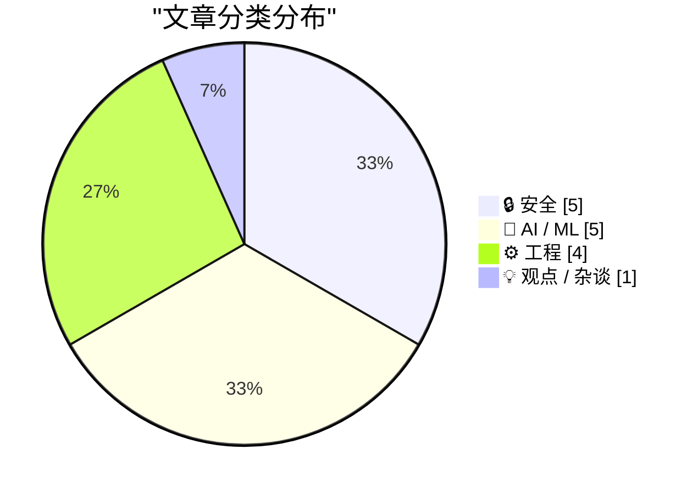
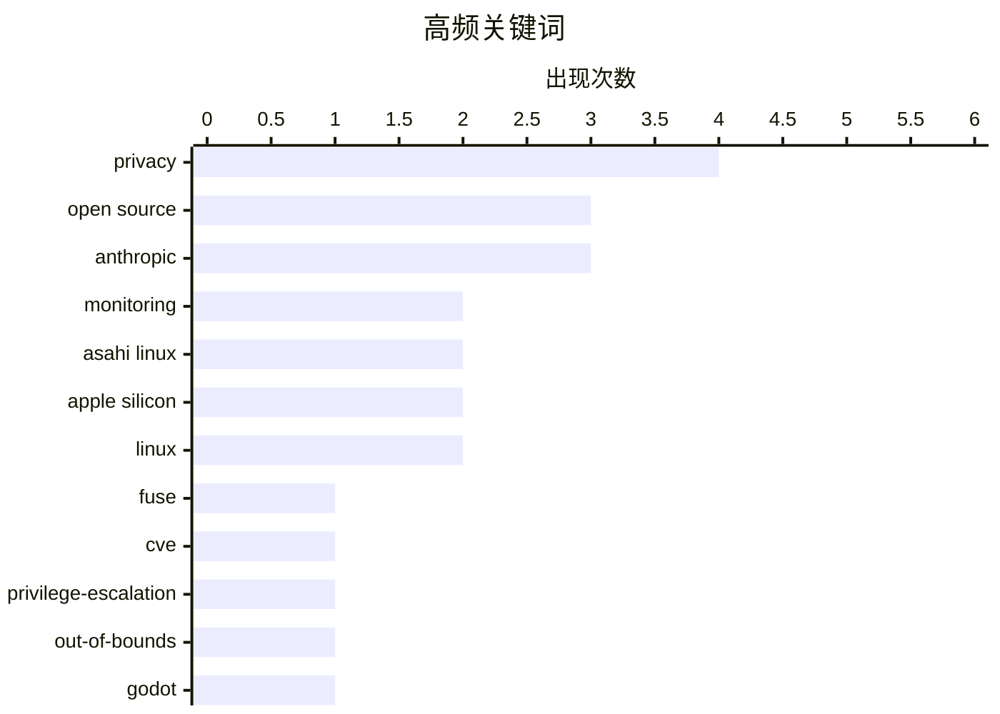

# 📰 AI 资讯每日精选 — 2026-07-02

> 汇聚 140+ 技术博客、X/Twitter、Hacker News、Reddit、Product Hunt、
> Lobste.rs、ClawFeed 日报及 GitHub Trending，经 AI 评分筛选。
>
> **本期内容**：🏆 今日必读 · 🌐 ClawFeed 日报 · 🔥 GitHub Trending · 📂 分类精选 · 🎨 设计与生成式 AI · 📊 数据概览

## 📝 今日看点

今日技术圈聚焦两大主线：AI治理与安全漏洞的博弈持续升级。一方面，开源社区与监管层对AI的信任危机加剧——Godot引擎因代码质量风险封杀AI贡献，而欧盟AI法案要求的文本水印被指存在根本性缺陷，无法有效防移除；另一方面，Linux内核曝出高危提权漏洞（CVE-2026-31694），苹果iCloud隐私功能也出现真实邮箱泄露，凸显底层安全防线仍存薄弱环节。此外，基础设施层面，ClickHouse正凭借性能优势重塑可观测性领域的数据库格局，而Anthropic与Meta则分别通过隐性涨价和算力转售，探索AI商业化的新路径。

---

## 🏆 今日必读

🥇 **FUSE readdir 缓存越界写入漏洞导致非特权用户获取 root 权限 (CVE-2026-31694)**

[Unprivileged root via an out-of-bounds write in the FUSE readdir cache (CVE-2026-31694)](https://cyberstan.co.uk/fuse-readdir-oob/) — Lobste.rs · 1 小时前 · 🔒 安全

> Linux 内核的 FUSE 文件系统驱动中存在一个高危漏洞 (CVE-2026-31694)，攻击者可通过精心构造的 readdir 缓存操作触发越界写入。该漏洞允许无特权的本地用户利用 FUSE 文件系统实现权限提升，最终获得 root 权限。漏洞根源在于内核在处理 FUSE 目录项缓存时缺乏边界检查。目前该漏洞已被公开，建议用户立即更新内核以修复此安全问题。

💡 **为什么值得读**: 这是一个影响广泛的 Linux 内核高危提权漏洞，所有使用 FUSE 文件系统的用户都应了解其风险并尽快修复。

🏷️ FUSE, CVE, privilege-escalation, out-of-bounds

🥈 **Godot 引擎将不再接受 AI 生成的代码贡献**

[Godot will no longer accept AI-authored code contributions](https://www.pcgamer.com/gaming-industry/open-source-game-engine-godot-will-no-longer-accept-ai-authored-code-contributions-we-cant-trust-heavy-users-of-ai-to-understand-their-code-enough-to-fix-it/) — Hacker News Best · 17 小时前 · 🤖 AI / ML

> 开源游戏引擎 Godot 宣布将不再接受由 AI 生成的代码贡献，理由是“无法信任重度 AI 用户能够充分理解其代码以进行修复”。该决定源于维护者发现大量 AI 生成的代码存在难以调试、缺乏上下文理解以及潜在版权问题。Godot 团队强调，贡献者必须能够解释和修改自己提交的每一行代码。此举在开发者社区引发了关于 AI 辅助编程与开源项目质量控制之间平衡的广泛讨论。

💡 **为什么值得读**: 这是主流开源项目首次明确禁止 AI 代码贡献，对理解 AI 在开源协作中的边界和风险具有重要参考价值。

🏷️ Godot, AI code, open source, policy

🥉 **美国最高法院裁决重创欧美数据传输机制**

[US Supreme Court just blew up EU-US Data Transfers](https://noyb.eu/en/us-supreme-court-just-blew-eu-us-data-transfers) — Lobste.rs · 10 小时前 · 🔒 安全

> 美国最高法院的一项裁决实质上推翻了现有的欧美数据传输框架，对依赖跨大西洋数据流动的数万家企业造成重大影响。裁决认定当前的数据保护措施不足以防止美国情报机构对欧洲公民数据的监控。这意味着 Meta、Google 等科技巨头以及大量使用美国云服务的欧洲企业可能面临法律合规危机。隐私倡导组织 noyb 认为，该裁决将迫使欧盟重新审视并可能暂停数据传输协议。

💡 **为什么值得读**: 该裁决直接冲击全球数据流动的法律基础，所有涉及欧美业务的企业和开发者都必须了解其合规影响。

🏷️ US Supreme Court, EU-US data transfer, privacy

4️⃣ **文本 AI 水印将永远无法有效防止移除**

[Text AI watermarks will always be trivial to remove](https://seangoedecke.com/text-ai-watermarks/) — seangoedecke.com · 1 小时前 · 🤖 AI / ML

> 欧盟 AI 法案将于 2026 年 8 月生效，其中第 50 条要求所有 AI 输出必须“可被检测为人工生成”。然而文章论证，任何基于文本统计特征的 AI 水印方案都存在根本性缺陷：攻击者只需通过简单的重写、翻译或同义词替换即可轻松移除水印。与图像水印不同，文本的语义等价变换空间极大，使得水印的鲁棒性无法保证。作者认为，强制要求文本 AI 水印不仅无效，还可能给用户带来虚假的安全感。

💡 **为什么值得读**: 在欧盟 AI 法案即将实施之际，本文从技术原理上揭示了文本水印的不可行性，对政策制定者和技术从业者都有重要启发。

🏷️ AI watermark, EU AI Act, removal, trivial

5️⃣ **iCloud“隐藏我的邮箱”功能漏洞泄露用户真实邮箱地址**

[404 Media: Vulnerability in iCloud’s ‘Hide My Email’ Reveals Peoples’ Real Email Addresses](https://www.404media.co/apple-hide-my-email-vulnerability-reveals-peoples-real-email-addresses/) — daringfireball.net · 10 小时前 · 🔒 安全

> 404 Media 披露，苹果 iCloud 的“隐藏我的邮箱”功能存在一个漏洞，会泄露用户本应被隐藏的真实邮箱地址。该漏洞在 404 Media 验证时仍可被利用，且他们已在一年多前向苹果报告了该问题及复现步骤，但至今未修复。漏洞细节暂未公开以防止被恶意利用。该功能旨在让用户生成随机邮箱别名来保护隐私，但此漏洞使其完全失效。

💡 **为什么值得读**: 苹果隐私功能的核心漏洞被曝光，且苹果在收到报告一年后仍未修复，对 iCloud 用户隐私安全构成直接威胁。

🏷️ iCloud, Hide My Email, vulnerability, privacy

---

## 🌐 ClawFeed 日报精选

> 来源：[ClawFeed](https://clawfeed.kevinhe.io) — AI 驱动的多源新闻聚合

# ClawFeed Daily Digest | 2026-07-01 (Tue)

> 覆盖 5 期 4h digest（#766 #767 #768 #769 #770），00:00–19:59 SGT。20:00–23:59 SGT 期尚未生成。

## 🔥 当日 Top 5

1. **Andrew Ng 定义 "Loop Engineering" 为 AI agent 核心范式** — Boris Cherny（Claude Code）+ Peter Steinberger（OpenClaw）带火的概念，Ng 在 newsletter 系统梳理：让 agent 在长循环中迭代构建软件，是 prompt engineering 之后的下一个工程化焦点。全天 5 期 digest 均出现，views 从 92K → 317K 持续攀升。  
   https://x.com/AndrewYNg/status/2071988145667928442

2. **X/Twitter 官方 MCP 正式发布** — Grok、Cursor 或任何 MCP 兼容工具可直接连接 X API，无需额外配置。按量付费（个人信息类 $0.01/次）。对 ClawFeed 采集方式和 agent 实时信息获取是重大利好，可能改变数据接入架构。  
   https://x.com/op7418/status/2071816099986022650

3. **CocoAI AllScale Roundtable 预告** — Jul 2 (明天) 21:00 SGT，主题 "AI Agents, Wallets & Payments"。CharlieHuAI 代表 COCO 出席，同台 AllScale / NeoSoulAI / Clustly。公司活动，需关注。  
   https://x.com/CocoAIxyz/status/2071976165364101335

4. **CharlieHuAI Agentic Finance 核心论点** — "Model capability is already in surplus. What's scarce is the ability to actually land it."（模型能力过剩，落地能力才稀缺）。与 Kevin 团队 harness > model 理念高度一致，品牌传播价值高。  
   https://x.com/CocoAIxyz/status/2071860824294215732

5. **Matt Pocock 发布 /writing-great-skills 指南** — 教写"可预测工作流"式 Claude Code Skill：稳定触发、分层加载、清楚完成、持续删减。Skill 编写的 meta-skill，对 Zylos 技能体系有直接参考价值。  
   https://x.com/shao__meng/status/2072126769986220157

## 📰 当日核心主题

### 1. Loop Engineering 成为 agent 工程标准术语
Andrew Ng 系统化梳理后，loop engineering 从 Twitter buzzword 进入方法论阶段。agent 通过迭代循环长时间构建软件，不再是单次 prompt → response。这是当日绝对主线话题。

### 2. COCO/CocoAI 公开活动密集
- AllScale Roundtable (Jul 2, 21:00 SGT)
- Agentic Finance panel 回顾（Charlie "model surplus" 金句）
- 品牌叙事新尝试："Every answer an AI gives you started as sunlight. Energy → electricity → data centers → tokens → intelligence."

### 3. Agent 架构模式讨论升温
- BruceGuai Matrix Agent OS："不是一个 Agent，而是一套 Agent 公司 OS"——角色分工、权限隔离、可审计（与 Zylos 理念共鸣）
- Matt Pocock writing-great-skills：Claude Code Skill 工程化最佳实践
- MiMo Code 开源（5 人 14 天 vibe-coding 完成）

### 4. X/Twitter MCP = agent 数据接入新通道
官方 MCP 发布意味着 agent 不再需要 scraping 或 unofficial API。对 ClawFeed 来说，可能从浏览器自动化切换为 MCP 直连，值得评估。

### 5. 开源模型生态动态
- Cline $9.99/mo 订阅，捆绑 GLM-5.2 + DeepSeek/Kimi/MiniMax/MiMo/Qwen（971K views）
- MiMo Code 开源（_LuoFuli, 117K views）
- MOPD post-training pipeline 论文（_TobiasLee）

## 🔖 Bookmark 精选

- **Av1dlive**: Anthropic "Claude for Finance" 讲座 — "quant AI 最值得看的免费 1 小时"，附 Claude Code 投研分析师实操文章。807K views。  
  https://x.com/Av1dlive/status/2059273095970738264
- **BruceGuai**: Matrix Agent OS 架构深度帖 — Agent 公司操作系统，不是巨大 Agent + 所有工具，而是分层治理。33K views。  
  https://x.com/BruceGuai/status/2070130243059495142

## 👀 推荐关注汇总

| Handle | 简介 | 关注理由 |
|--------|------|----------|
| @runinfrai | RunInfra, YC F26 | Inference 优化平台 beta，自动处理 kernel/量化/部署 |
| @_LuoFuli | Fuli Luo, 小米 MiMo | 前 DeepSeek，MiMo Code 开源核心人物 |
| @raft_hq | Raft | Agent 工作流平台，与 COCO Workspace 有交集 |
| @_TobiasLee | Lei Li, MiMo 团队 | MOPD post-training pipeline 论文 |

提醒：以上均未通过浏览器核实是否已关注，Kevin 操作前请先搜索确认。

## 🧹 建议取关

| Handle | 理由 |
|--------|------|
| @HeXiaobo | 2018 年 7 月最后发推，7+ 年未活跃。标注 "Follows you"，请确认 |
| @0xJasonBateman | 仅 36 posts，内容为 NASA repost + Spotify 歌曲，与 AI/crypto 无关 |

## 💤 当日重复噪音模式

- **Andrew Ng Loop Engineering 跨档重复**：5 期 digest 均为头条，内容大同小异（仅 view count 递增 92K→169K→235K→280K→317K）。建议后续 4h digest 对当日已详细报道的话题做增量更新而非全文重复。
- **Bookmark 板块零更新**：Av1dlive + BruceGuai 两条 bookmark 在 5 期中重复出现，均为前日内容。当日无新 bookmark 活动。
- **followingSample 抓取不稳定**：多期报告部分 profile page 未加载出推文（levie/caterpillarous/rwayne/raft_hq），可能是 Puppeteer 抓取限流问题。---

## 🔥 GitHub Trending

> 今日热门开源项目（全语言 + Python）

| # | 项目 | 描述 | ⭐ 总星 | 📈 今日 | 语言 |
|---|------|------|---------|---------|------|
| 1 | [hasaneyldrm/exercises-dataset](https://github.com/hasaneyldrm/exercises-dataset) | A comprehensive dataset of 433 fitness exercises. Each en... | 8.4k | +2470 | HTML |
| 2 | [msitarzewski/agency-agents](https://github.com/msitarzewski/agency-agents) 🤖 | A complete AI agency at your fingertips - From frontend w... | 123.5k | +2114 | Shell |
| 3 | [usestrix/strix](https://github.com/usestrix/strix) 🤖 | Open-source AI penetration testing tool to find and fix y... | 29.8k | +1211 | Python |
| 4 | [microsoft/AI-For-Beginners](https://github.com/microsoft/AI-For-Beginners) 🤖 | 12 Weeks, 24 Lessons, AI for All! | 50.5k | +1096 | Jupyter Notebook |
| 5 | [diegosouzapw/OmniRoute](https://github.com/diegosouzapw/OmniRoute) 🤖 | Never stop coding. Free AI gateway: one endpoint, 231+ pr... | 9.6k | +1010 | TypeScript |
| 6 | [facebook/astryx](https://github.com/facebook/astryx) 🤖 | An open source design system that's fully customizable an... | 2.7k | +708 | TypeScript |
| 7 | [HKUDS/Vibe-Trading](https://github.com/HKUDS/Vibe-Trading) 🤖 | "Vibe-Trading: Your Personal Trading Agent" | 16.6k | +694 | Python |
| 8 | [browser-use/video-use](https://github.com/browser-use/video-use) | Edit videos with coding agents | 13.2k | +693 | Python |
| 9 | [ogulcancelik/herdr](https://github.com/ogulcancelik/herdr) 🤖 | agent multiplexer that lives in your terminal. | 9.6k | +609 | Rust |
| 10 | [google/agents-cli](https://github.com/google/agents-cli) 🤖 | The CLI and skills that turn any coding assistant into an... | 4.6k | +586 | Python |
| 11 | [altic-dev/FluidVoice](https://github.com/altic-dev/FluidVoice) 🤖 | Fastest and only macOS Dictation app with on-device STT a... | 5.5k | +572 | Swift |
| 12 | [CoreBunch/Instatic](https://github.com/CoreBunch/Instatic) | Instatic is a modern self-hosted visual CMS - get it runn... | 2.0k | +508 | TypeScript |
| 13 | [allenai/olmocr](https://github.com/allenai/olmocr) 🤖 | Toolkit for linearizing PDFs for LLM datasets/training | 18.3k | +334 | Python |
| 14 | [omkarcloud/botasaurus](https://github.com/omkarcloud/botasaurus) | The All in One Framework to Build Undefeatable Scrapers | 5.5k | +211 | Python |
| 15 | [virgiliojr94/book-to-skill](https://github.com/virgiliojr94/book-to-skill) 🤖 | Turn any technical book PDF into a Claude Code skill — re... | 7.4k | +192 | Python |

---

## 🔒 安全

### 1. FUSE readdir 缓存越界写入漏洞导致非特权用户获取 root 权限 (CVE-2026-31694)

[Unprivileged root via an out-of-bounds write in the FUSE readdir cache (CVE-2026-31694)](https://cyberstan.co.uk/fuse-readdir-oob/) — **Lobste.rs** · 1 小时前 · ⭐ 28/30

> Linux 内核的 FUSE 文件系统驱动中存在一个高危漏洞 (CVE-2026-31694)，攻击者可通过精心构造的 readdir 缓存操作触发越界写入。该漏洞允许无特权的本地用户利用 FUSE 文件系统实现权限提升，最终获得 root 权限。漏洞根源在于内核在处理 FUSE 目录项缓存时缺乏边界检查。目前该漏洞已被公开，建议用户立即更新内核以修复此安全问题。

🏷️ FUSE, CVE, privilege-escalation, out-of-bounds

---

### 2. 美国最高法院裁决重创欧美数据传输机制

[US Supreme Court just blew up EU-US Data Transfers](https://noyb.eu/en/us-supreme-court-just-blew-eu-us-data-transfers) — **Lobste.rs** · 10 小时前 · ⭐ 26/30

> 美国最高法院的一项裁决实质上推翻了现有的欧美数据传输框架，对依赖跨大西洋数据流动的数万家企业造成重大影响。裁决认定当前的数据保护措施不足以防止美国情报机构对欧洲公民数据的监控。这意味着 Meta、Google 等科技巨头以及大量使用美国云服务的欧洲企业可能面临法律合规危机。隐私倡导组织 noyb 认为，该裁决将迫使欧盟重新审视并可能暂停数据传输协议。

🏷️ US Supreme Court, EU-US data transfer, privacy

---

### 3. iCloud“隐藏我的邮箱”功能漏洞泄露用户真实邮箱地址

[404 Media: Vulnerability in iCloud’s ‘Hide My Email’ Reveals Peoples’ Real Email Addresses](https://www.404media.co/apple-hide-my-email-vulnerability-reveals-peoples-real-email-addresses/) — **daringfireball.net** · 10 小时前 · ⭐ 25/30

> 404 Media 披露，苹果 iCloud 的“隐藏我的邮箱”功能存在一个漏洞，会泄露用户本应被隐藏的真实邮箱地址。该漏洞在 404 Media 验证时仍可被利用，且他们已在一年多前向苹果报告了该问题及复现步骤，但至今未修复。漏洞细节暂未公开以防止被恶意利用。该功能旨在让用户生成随机邮箱别名来保护隐私，但此漏洞使其完全失效。

🏷️ iCloud, Hide My Email, vulnerability, privacy

---

### 4. Claude Code 隐藏代码秘密标记中国用户

[Hidden code in Claude Code secretly flagged Chinese users](https://the-decoder.com/hidden-code-in-claude-code-secretly-flagged-chinese-users/) — **The Decoder** · 14 小时前 · ⭐ 24/30

> Anthropic 从其编程工具 Claude Code 中移除了一项隐藏的监控功能，该功能被发现在后台秘密标记中国用户。该功能在代码中未被文档记录，引发社交媒体上的强烈抗议。用户发现该功能会检测并标记来自中国的 IP 地址或系统语言设置。Anthropic 在舆论压力下承认了该功能的存在并已将其删除，但未详细说明数据收集的范围和用途。

🏷️ Claude Code, Anthropic, privacy, monitoring

---

### 5. AIVD 和 MIVD 的大数据集：影子情报机构

[Bulkdatasets AIVD en MIVD: de schaduw geheime dienst](https://berthub.eu/articles/posts/de-schaduwgeheimedienst/) — **berthub.eu** · 16 小时前 · ⭐ 23/30

> 一份最新发布的研究报告显示，荷兰情报机构 AIVD 和 MIVD 在处理大数据集时存在草率甚至不合规的行为。这些数据集包含数百万随机公民的信息，来源包括线人、其他政府机构、外国情报部门以及商业购买。报告指出，机构在数据获取、存储和使用方面缺乏足够的监督和合法性保障。

🏷️ bulk data, privacy, intelligence, Netherlands

---

## 🤖 AI / ML

### 6. Godot 引擎将不再接受 AI 生成的代码贡献

[Godot will no longer accept AI-authored code contributions](https://www.pcgamer.com/gaming-industry/open-source-game-engine-godot-will-no-longer-accept-ai-authored-code-contributions-we-cant-trust-heavy-users-of-ai-to-understand-their-code-enough-to-fix-it/) — **Hacker News Best** · 17 小时前 · ⭐ 26/30

> 开源游戏引擎 Godot 宣布将不再接受由 AI 生成的代码贡献，理由是“无法信任重度 AI 用户能够充分理解其代码以进行修复”。该决定源于维护者发现大量 AI 生成的代码存在难以调试、缺乏上下文理解以及潜在版权问题。Godot 团队强调，贡献者必须能够解释和修改自己提交的每一行代码。此举在开发者社区引发了关于 AI 辅助编程与开源项目质量控制之间平衡的广泛讨论。

🏷️ Godot, AI code, open source, policy

---

### 7. 文本 AI 水印将永远无法有效防止移除

[Text AI watermarks will always be trivial to remove](https://seangoedecke.com/text-ai-watermarks/) — **seangoedecke.com** · 1 小时前 · ⭐ 25/30

> 欧盟 AI 法案将于 2026 年 8 月生效，其中第 50 条要求所有 AI 输出必须“可被检测为人工生成”。然而文章论证，任何基于文本统计特征的 AI 水印方案都存在根本性缺陷：攻击者只需通过简单的重写、翻译或同义词替换即可轻松移除水印。与图像水印不同，文本的语义等价变换空间极大，使得水印的鲁棒性无法保证。作者认为，强制要求文本 AI 水印不仅无效，还可能给用户带来虚假的安全感。

🏷️ AI watermark, EU AI Act, removal, trivial

---

### 8. Claude Sonnet 5 延续 Anthropic 的隐性涨价策略：标价不变但实际成本翻倍

[Claude Sonnet 5 continues Anthropic's pattern of hiding price increases behind unchanged token rates](https://the-decoder.com/claude-sonnet-5-continues-anthropics-pattern-of-hiding-price-increases-behind-unchanged-token-rates/) — **The Decoder** · 14 小时前 · ⭐ 25/30

> Anthropic 新发布的 Claude Sonnet 5 在 AI 指数中排名第五（53 分），部分智能体任务甚至超越更贵的 Opus 4。然而，该模型每任务消耗的 token 数比前代多约 40%，导致实际使用成本几乎翻倍，尽管 API 标价保持不变。文章指出，这已是 Anthropic 连续多次通过提升 token 消耗量而非直接涨价来隐藏成本增加的模式。用户需要关注的是实际完成任务的成本，而非单纯的 token 单价。

🏷️ Claude Sonnet 5, pricing, tokens, Anthropic

---

### 9. Meta 效仿 SpaceX 模式，将闲置 AI 算力作为云服务对外销售

[Meta follows SpaceX's playbook and builds a cloud business to sell its spare AI compute to outside customers](https://the-decoder.com/meta-follows-spacexs-playbook-and-builds-a-cloud-business-to-sell-its-spare-ai-compute-to-outside-customers/) — **The Decoder** · 9 小时前 · ⭐ 24/30

> Meta 正在构建自己的云业务，计划将闲置的 AI 算力出售给外部客户。Meta 今年计划在 AI 基础设施上投入高达 1450 亿美元，但面临与 xAI 同样的问题：为何不将所有算力用于自身模型？效仿 SpaceX 将内部技术商业化（如 Starlink）的模式，Meta 希望通过出售过剩算力来分摊巨额基础设施成本。此举可能对现有云服务商（如 AWS、Azure）形成竞争压力。

🏷️ Meta, cloud, AI compute, infrastructure

---

### 10. Anthropic 的 Fable 5 因越狱漏洞被政府封禁两周后，在全球重新上线

[Anthropic's Fable 5 is back worldwide after a two-week government ban over a jailbreak](https://the-decoder.com/anthropics-fable-5-is-back-worldwide-after-a-two-week-government-ban-over-a-jailbreak/) — **The Decoder** · 17 小时前 · ⭐ 24/30

> 美国政府在封禁两周后，允许 Anthropic 的 Fable 5 模型在全球重新发布。此前亚马逊研究人员发现了一个越狱漏洞，但 Anthropic 指出，即使是像 Claude Haiku 4.5 这样小得多的模型也能实现同样的攻击。新的安全分类器在超过 99% 的案例中阻止了该技术，但同时也误拦了更多无害请求。

🏷️ Anthropic, Fable 5, jailbreak, safety

---

## ⚙️ 工程

### 11. ClickHouse 正在赢得可观测性战争

[Clickhouse is winning the Observability Wars](https://matduggan.com/clickhouse-is-winning-the-observability-wars/) — **matduggan.com** · 12 小时前 · ⭐ 25/30

> 在可观测性领域（即新一代监控系统）的数据库选型中，ClickHouse 正凭借其极致的列式存储和查询性能脱颖而出。相比 Elasticsearch 和传统时序数据库，ClickHouse 在处理大规模日志、指标和追踪数据时，查询速度可快 10-100 倍，且存储成本更低。文章指出，包括 Uber、Cloudflare 在内的多家头部企业已将其核心可观测性栈迁移至 ClickHouse。作者认为，ClickHouse 的生态成熟度和性能优势使其成为当前可观测性场景下的最佳选择。

🏷️ Clickhouse, observability, database, monitoring

---

### 12. Asahi Linux 7.1 进度报告

[Asahi Linux 7.1 Progress Report](https://asahilinux.org/2026/06/progress-report-7-1/) — **Hacker News Best** · 15 小时前 · ⭐ 25/30

> Asahi Linux 项目发布了 7.1 版本进度报告，展示了在 Apple Silicon Mac 上的持续改进。新版本显著提升了 GPU 驱动的稳定性和性能，支持了更多硬件加速功能。此外，对 M4 系列芯片的初步支持已开始落地，包括基础外设驱动。休眠和唤醒功能的可靠性也得到了大幅改善。项目团队还修复了多个与 USB-C 和 Thunderbolt 相关的兼容性问题。

🏷️ Asahi Linux, Apple Silicon, Linux, progress report

---

### 13. Box3D：一个开源 3D 物理引擎

[Box3D, an open source 3D physics engine](https://box2d.org/posts/2026/06/announcing-box3d/) — **Hacker News Best** · 13 小时前 · ⭐ 24/30

> Box3D 是一个新发布的开源 3D 物理引擎，由知名 2D 物理引擎 Box2D 的作者开发。该引擎专注于刚体动力学模拟，旨在为游戏和仿真提供高性能、轻量级的解决方案。项目代码完全开源，社区可自由使用和贡献。

🏷️ physics engine, open source, 3D, Box2D

---

### 14. 进度报告：Linux 7.1 - Asahi Linux

[Progress Report: Linux 7.1 - Asahi Linux](https://asahilinux.org/2026/06/progress-report-7-1/) — **Lobste.rs** · 11 小时前 · ⭐ 24/30

> Asahi Linux 项目发布了 Linux 7.1 版本的进度报告，展示了在 Apple Silicon Mac 上运行 Linux 的最新进展。该版本包含了对更多硬件（如 GPU、USB-C 和 Thunderbolt）的改进支持，以及性能优化和稳定性修复。项目团队持续致力于将 Linux 打造成 Apple Silicon 平台的一等公民。

🏷️ Asahi Linux, Linux, Apple Silicon, progress

---

## 💡 观点 / 杂谈

### 15. 《网络弹性法案》与开源无关

[The CRA is not about open source](https://nesbitt.io/2026/07/01/the-cra-is-not-about-open-source.html) — **nesbitt.io** · 15 小时前 · ⭐ 23/30

> 文章指出，欧盟的《网络弹性法案》（CRA）虽然创建了“开源维护者”角色，但并未为开源项目的长期维护提供资金支持。作者认为，CRA 的核心目标是监管商业软件产品的安全，而非针对开源社区，但缺乏资金支持将导致开源维护负担加重。结论是：CRA 的争议焦点应回归到商业责任，而非开源本身。

🏷️ CRA, open source, maintenance, funding

---

## 🎨 Design & Generative AI

### 🖼️ 生成式图片

- **[Midjourney提示词进阶：5个技巧让AI绘画脱胎换骨](https://www.reddit.com/r/midjourney/comments/1ukigl0/5_techniques_that_transformed_my_midjourney/)** — r/midjourney · 14 小时前
  > 分享5个提升Midjourney提示词效果的实用技巧，附前后对比示例。

- **[如何将Logo巧妙融入图像？](https://www.reddit.com/r/midjourney/comments/1ukopvp/any_way_to_emblazon_a_logo_into_an_image/)** — r/midjourney · 10 小时前
  > 探讨在Midjourney中让风景元素自然扭曲形成Logo的可行性。

- **[肩后视角：Midjourney 8.2预览版搭配Magnific效果](https://www.reddit.com/r/midjourney/comments/1ukbp6d/over_her_shoulder_82_preview_magnific/)** — r/midjourney · 21 小时前
  > 展示Midjourney 8.2预览版与Magnific工具结合生成的肩后视角图像。

- **[Nijijourney风格代码玩上瘾：趣味创作分享](https://www.reddit.com/r/midjourney/comments/1ul2765/been_having_way_to_much_fun_with_this_sref_in/)** — r/midjourney · 1 小时前
  > 分享在Nijijourney中使用特定风格代码（sref）的创作乐趣。

- **[Midjourney免费额度用完了？每天5次免费提示可能吗？](https://www.reddit.com/r/midjourney/comments/1ukz2f1/isnt_there_a_way_to_get_like_5_free_prompts_a_day/)** — r/midjourney · 3 小时前
  > 询问Midjourney是否提供每日免费提示次数，讨论免费与付费使用体验。

- **[玛瑙海：奇幻风景AI绘画](https://www.reddit.com/r/midjourney/comments/1ukq20n/the_agate_sea/)** — r/midjourney · 9 小时前
  > 展示一幅名为《玛瑙海》的AI生成奇幻风景图像。

- **[卡通幻想角色概念设计](https://www.reddit.com/r/midjourney/comments/1ukmxpf/caricatured_fantasy_toon_character_concepts/)** — r/midjourney · 11 小时前
  > 用Midjourney创作一系列夸张风格的卡通奇幻角色概念图。

- **[太阳朋克遇上塔罗牌：灵感碰撞](https://www.reddit.com/r/midjourney/comments/1ukrq7s/solarpunk_vibes_with_tarot_inspiration/)** — r/midjourney · 8 小时前
  > 融合太阳朋克美学与塔罗牌元素，生成独特视觉作品。

- **[繁忙的外星市场：科幻场景创作](https://www.reddit.com/r/midjourney/comments/1ul0y3p/busy_alien_market/)** — r/midjourney · 2 小时前
  > 用AI描绘一个熙熙攘攘的外星市场，充满异星风情。

- **[另一个世界的惊鸿一瞥](https://www.reddit.com/r/midjourney/comments/1ukwfg8/glimpse_of_another_world/)** — r/midjourney · 5 小时前
  > 展示一幅名为《另一个世界的惊鸿一瞥》的AI奇幻图像。

- **[沙漠风暴：原创AI风景画](https://www.reddit.com/r/midjourney/comments/1ukcbe1/tormenta_de_arena_en_el_desierto_oc/)** — r/midjourney · 20 小时前
  > 用Midjourney生成沙漠风暴场景，展现自然力量的震撼。

- **[色彩与图案实验：高混沌提示词探索](https://www.reddit.com/r/midjourney/comments/1ukxthj/misc_colors_patterns_prompt_ash_and_grains_chaos/)** — r/midjourney · 4 小时前
  > 使用“Ash and Grains --chaos 100”提示词，探索随机色彩与图案生成。

- **[新美国众神：AI神话角色创作](https://www.reddit.com/r/midjourney/comments/1ukbhih/newest_american_gods/)** — r/midjourney · 21 小时前
  > 用Midjourney创作一系列现代美国神话角色形象。

### 🎬 生成式视频

- **[美国历史250年：AI电影《生于烈火》震撼发布](https://www.reddit.com/r/midjourney/comments/1ukd1h0/250_years_of_american_history_born_in_fire/)** — r/midjourney · 19 小时前
  > 用AI生成9分钟短片，浓缩1776至2026年美国历史。

- **[《伯爵夫人与间谍》：詹姆斯·邦德同人AI短片](https://www.reddit.com/r/midjourney/comments/1ul1tg2/a_few_scenes_from_the_countess_and_the_spy_a/)** — r/midjourney · 2 小时前
  > 用Midjourney等平台制作詹姆斯·邦德同人短片，画质虽非最佳但创意十足。

---

## 📊 数据概览

| 扫描源 | 抓取文章 | 时间范围 | 精选 |
|:---:|:---:|:---:|:---:|
| 93/140 | 3823 篇 → 77 篇 | 24h | **15 篇** |

### 分类分布



### 高频关键词



<details>
<summary>📈 纯文本关键词图（终端友好）</summary>

```
privacy              │ ████████████████████ 4
open source          │ ███████████████░░░░░ 3
anthropic            │ ███████████████░░░░░ 3
monitoring           │ ██████████░░░░░░░░░░ 2
asahi linux          │ ██████████░░░░░░░░░░ 2
apple silicon        │ ██████████░░░░░░░░░░ 2
linux                │ ██████████░░░░░░░░░░ 2
fuse                 │ █████░░░░░░░░░░░░░░░ 1
cve                  │ █████░░░░░░░░░░░░░░░ 1
privilege-escalation │ █████░░░░░░░░░░░░░░░ 1
```

</details>

### 🏷️ 话题标签

**privacy**(4) · **open source**(3) · **anthropic**(3) · monitoring(2) · asahi linux(2) · apple silicon(2) · linux(2) · fuse(1) · cve(1) · privilege-escalation(1) · out-of-bounds(1) · godot(1) · ai code(1) · policy(1) · us supreme court(1) · eu-us data transfer(1) · ai watermark(1) · eu ai act(1) · removal(1) · trivial(1)

---

*生成于 2026-07-02 01:38 | 汇聚 140 个技术博客、X/Twitter、Hacker News、Reddit、Product Hunt、Lobste.rs、ClawFeed 日报及 GitHub Trending，经 AI 评分筛选出 Top 15 精华内容*
